# AI 에이전트

속성: AI


<details>
<summary><strong>AI 코딩의 진화 3단계</strong></summary>


1️⃣ 프롬프트 엔지니어링
→ 내가 직접 좋은 프롬프트를 쓴다

2️⃣ 하네스 엔지니어링
→ 에이전트가 실행되는 환경을 설계한다
([CLAUDE.md](http://claude.md/), [SKILL.md](http://skill.md/), 툴 세팅, 컨텍스트 주입)

3️⃣ 루프 엔지니어링
→ 에이전트에게 프롬프트를 보내는 시스템을 내가 만든다
→ 인간은 루프에서 빠짐

하네스: 에이전트의 런타임 환경
루프: 그 하네스를 자동으로 실행하는 조율 시스템

Anthropic Claude Code 총괄 Boris Cherny:
"나는 이제 Claude에게 직접 프롬프트를 안 써.
내 루프가 Claude를 호출하고, 뭘 할지 결정해.
내 일은 루프를 짜는 것."

1인 개발자가 루프 설계를 익히면
소규모 팀의 속도를 혼자서 낼 수 있게 됌.

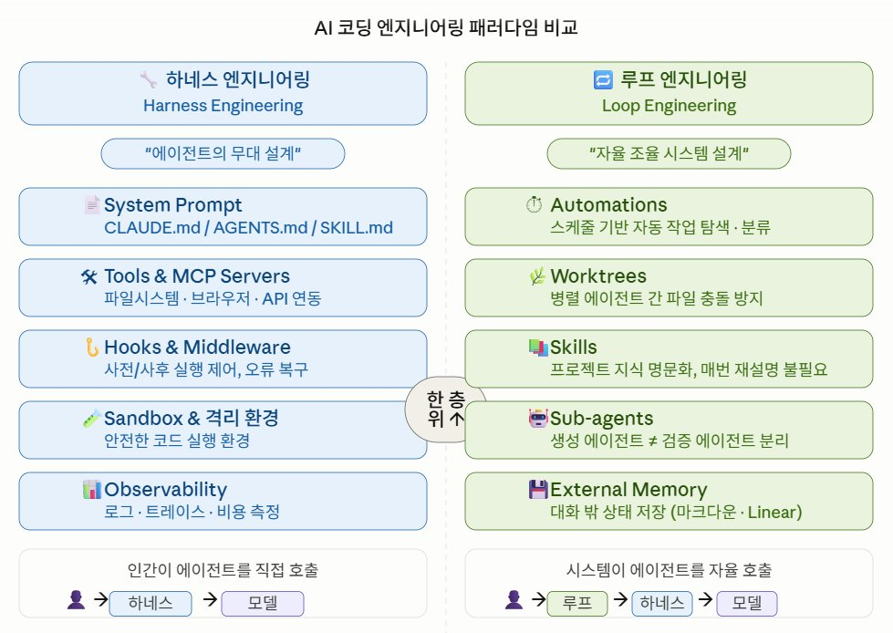

하네스가 별게 없음

경력자 입장에선 걍 한 프로젝트에 필요한 것들을 정의하고 그에 필요한 권한과 롤 할당

어떤걸 신경써야하는지 룰만 잘 정하면 24시간 하루종일 돌아가는 에이전트 시스템을 만들수있음

---


</details>


<details>
<summary><strong>MCP vs A2A vs ACP</strong></summary>


𝗠𝗖𝗣는 에이전트를 도구와 데이터에 연결하기 위한 것입니다. 데이터베이스 쿼리, API 호출, 파일 접근, 외부 시스템과의 상호작용과 같은 기능 발견 및 사용 방식을 표준화합니다.

𝗔𝟮𝗔는 독립적인 AI 에이전트 간의 통신을 위한 것입니다. 에이전트가 서로의 기능을 발견하고, 작업을 위임하며, 정보를 교환하고, 다양한 프레임워크와 환경에서 작업을 조정할 수 있게 합니다.

A2A가 MCP와 함께 어떻게 맞물리는지에 대해 더 깊이 파고들고 싶다면, 여기 훌륭한 분석이 있습니다 → [https://lucode.co/agent-communication-matrix-z7xd](https://lucode.co/agent-communication-matrix-z7xd)

𝗔𝗖𝗣는 에이전트 간 통신을 위한 또 다른 접근 방식으로, RESTful HTTP API, JSON 페이로드, 표준 웹 인프라를 중심으로 구축되었습니다. 이후 A2A로 병합되어 에이전트 상호 운용성에 대한 두 가지 노력을 통합했습니다.

MCP와 A2A는 경쟁자가 아니라 상호 보완적입니다. 에이전트는 도구 접근을 위해 MCP를 사용하고 조정을 위해 A2A를 사용하며, ACP는 A2A로 병합되었습니다.

하지만 MCP와 A2A가 항상 답은 아닙니다. 프로덕션에서 어떤 접근 방식을 사용할지 결정한다면, 이 가이드가 MCP, A2A 또는 다른 것을 언제 사용할지 분석해줍니다

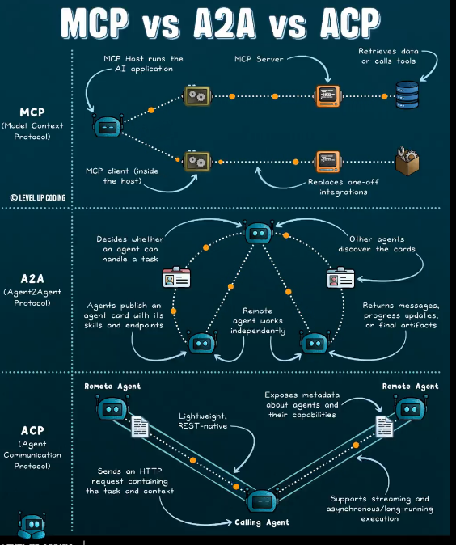

[https://blogs.oracle.com/developers/the-agent-communication-matrix-when-mcp-a2a-and-plain-rest-each-win?source=:ad:so:tw:awr:a_nas::RC_DEVT260603P00041:Nikki&SC=:ad:so:tw:awr:a_nas::RC_DEVT260603P00041:Nikki](https://blogs.oracle.com/developers/the-agent-communication-matrix-when-mcp-a2a-and-plain-rest-each-win?source=:ad:so:tw:awr:a_nas::RC_DEVT260603P00041:Nikki&SC=:ad:so:tw:awr:a_nas::RC_DEVT260603P00041:Nikki)

---


</details>


<details>
<summary><strong>📚 그래프 엔지니어링 따라하기 (AI 협업 조직도를 설계하고 에이전트 경로를 제어하는 실무 가이드)</strong></summary>


거대한 프롬프트 하나에 모든 일을 맡기는 대신, 작업을 노드로 나누고 경로를 코드...

👉 [https://wikidocs.net/book/20829](https://wikidocs.net/book/20829)

---


</details>


<details>
<summary><strong>그래프 엔지니어링, 이제 말로만이 아니라 실제 도구로 나왔다</strong></summary>


- 그래피파이 : AI 코딩 어시스턴트용 스킬, 코드베이스를 지식그래프로 통째로 매핑
- 벡터인덱스아님 : 임베딩 없이 실제 그래프를 순회하는 방식
- 반전포인트 : 코드 파싱은 LLM 안 씀, 완전 로컬 무료

1) 그래피파이라는 오픈소스 도구가 최근 화제임. AI 코딩 어시스턴트(클로드코드, 커서, 코덱스 등)에서 명령어 하나 치면 코드, SQL 스키마, 문서, PDF, 이미지, 영상까지 프로젝트 전체를 지식그래프로 만들어줌. 그담부터는 파일을 매번 grep하는 대신 그래프에 질문하는 방식으로 작업함.

2) 이게 그래프 엔지니어링 개념을 실제 도구로 구현한 사례임. 노드는 코드의 개념 하나하나, 엣지는 그 사이의 관계(호출, 상속, 참조)임. 근데 재밌는 게 코드 파싱 자체는 트리시터라는 파서로 로컬에서 결정론적으로 처리함, LLM 안 씀. 그래서 코드만 있는 프로젝트는 API 비용 0원임. 문서나 이미지처럼 의미 해석이 필요한 것만 LLM한테 넘김.

3) 벤치마크 수치도 근거로 붙일 만함. LOCOMO 데이터셋 기준 recall@10이 0.497로, 비교 대상인 다른 메모리 시스템(0.048, 0.149)보다 훨씬 높게 나옴. 그래프 빌드에 드는 LLM 크레딧은 0인데, 이건 코드 파싱 부분이 로컬 처리라서 가능한 수치임.

4) 반전 포인트. 다들 요즘 RAG 하면 벡터 임베딩부터 떠올리는데, 이 도구는 정반대 접근임. 임베딩도 벡터스토어도 없이 진짜 그래프 구조를 순회함. 그리고 모든 엣지에 “명시적으로 추출됐는지” “추론된 건지” 태그를 달아둬서, AI가 뭘 확실히 아는지 뭘 짐작한 건지 구분할 수 있게 해둠.

정리하면, 프롬프트 잘 쓰는 시대에서 루프 설계 시대로, 이제 그래프 자체를 코드베이스에 적용하는 시대로 넘어가는 흐름이 실제 제품으로 나타난 셈임. 물론 이것도 아직 초기 도구라 대규모 레포에서 얼마나 안정적일지는 더 지켜봐야 함.

[https://github.com/Graphify-Labs/graphify](https://github.com/Graphify-Labs/graphify)

---


</details>


<details>
<summary><strong>AI 에이전트는 모델보다 설계가 더 중요해지고 있습니다</strong></summary>


AI 에이전트가 기대만큼
안정적으로 동작하지 않는다면
모델보다 구조를 먼저 볼 필요가 있습니다.
요즘 자주 나오는 세 가지 개념이 있습니다.
Harness Engineering은
도구, 메모리, 권한, 실행 환경처럼
모델을 둘러싼 기반을 설계하는 것입니다.

Loop Engineering은
실행 → 검증 → 수정 과정을 반복하며
'확신'이 아니라 '증거'를 기준으로
작업을 끝내도록 만드는 구조입니다.

Graph Engineering은
어떤 작업이 어떤 순서로 실행되고,
분기와 승인을 어떻게 처리할지 설계합니다.
세 가지는 경쟁 관계가 아닙니다.
그래프 안에서 루프가 돌고,
그 모든 것을 하네스가 뒷받침합니다.

AI 에이전트가 불안정하다면
모델보다 어디에서 구조가 무너졌는지
먼저 진단하는 시대가 되고 있습니다.

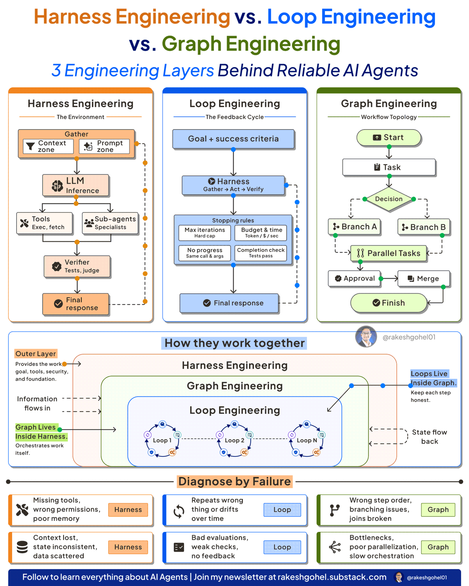

---


</details>


<details>
<summary><strong>AI 에이전트가 자꾸 엉뚱하게 움직인다면</strong></summary>

프롬프트보다 구조를 봐야 합니다.

AI를 제대로 굴리려면
3가지 레이어를 구분하는 것이 중요합니다.

Harness Engineering
AI가 사용할 컨텍스트, 도구, 메모리,
실행 제어, 안전장치를 설계합니다.

Loop Engineering
작업 → 검증 → 피드백을 반복하는
루프와 종료 조건을 설계합니다.

Graph Engineering
분기, 합류, 반복, 상태 전환까지
워크플로 전체 흐름을 설계합니다.

관계도 명확합니다.

그래프 안에서 루프가 돌고,
그 그래프를 하네스가 감싸는 구조입니다.

AI가 원하는 결과를 못 내는 이유는
모델보다 어느 레이어가 부족한지
잘못 진단했기 때문인 경우도 많습니다.

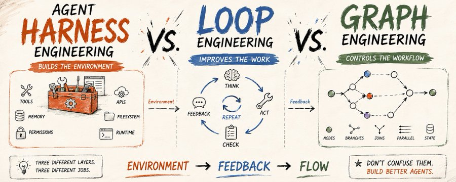

---


</details>


<details>
<summary><strong>요즘 클로드 코드나 코덱스를 사용해서 시스템을 설계할 때</strong></summary>


하네스 엔지니어링/루프 엔지니어링의 개념에서 더 나아가 그래프 엔지니어링이라는 개념이 많이 언급되고 있습니다

그래프 엔지니어링에 대한 한글 버전 상세 설명을 확인 할 수 있는 유용한 글 같습니다.

## **Graph Engineering**

Loop Engineering 이후 AI를 다루는 법 - Graph Engineering이란 무엇인가.

2026년 7월, AI 에이전트 설계 담론에서 “Loop Engineering is dead. Long live Graph Engineering!”이라는 선언이 빠르게 퍼졌다.

이는 단순한 유행어가 아니다. Prompt Engineering에서 Context, Harness를 거쳐 Loop Engineering으로 이어진 레버리지 이동이 한 단계 더 바깥으로 확장된 결과다.

모델 자체는 점점 commodity가 되고, 진짜 엔지니어링 대상은 **여러 에이전트(또는 노드)가 어떻게 연결되고 협력하는가**로 이동했다.

### **AI 엔지니어링의 계층적 진화**

지금까지의 흐름을 정리하면 대략 이렇다.

- **Prompt Engineering** (2023–24): 단일 요청의 지시를 설계한다. 역할은 운영자(operator).
- **Context Engineering**: 모델이 보는 정보(검색, 메모리, 윈도우)를 설계한다. 역할은 편집자(editor).
- **Harness Engineering**: 도구, 메모리, 샌드박스, 가드레일을 설계한다. 역할은 도구 제작자(toolmaker).
- **Loop Engineering** (2025–초중반 2026): 단일 에이전트가 목표를 향해 반복하는 사이클(관찰–추론–행동–검증)을 설계한다. Verifier, stop condition, 상태 관리가 핵심이다. 역할은 시스템 디자이너.
- **Graph Engineering** (2026년 중반~): 여러 루프(노드)를 연결하는 topology를 설계한다. 역할은 조직 디자이너(org designer).

이 계층들은 서로 대체하지 않는다. 그래프의 각 노드는 여전히 잘 설계된 루프여야 하고, 루프는 좋은 harness와 context 위에 세워진다. 그래프는 그 위 계층이다.

### **Loop Engineering: 단일 개체의 자율성**

Loop Engineering의 핵심은 “내가 프롬프트를 쓰는 게 아니라, 에이전트가 스스로 프롬프트를 반복하게 만드는 시스템”을 만드는 것이다.

목표를 주고, 외부 verifier(테스트, 빌드, 메트릭, 다른 에이전트)로 결과를 평가하며, 실패하면 다시 시도하고, 성공하거나 한도에 도달하면 멈춘다. Claude Code 같은 도구에서 “나는 더 이상 Claude에게 프롬프트를 쓰지 않는다. 루프를 돌린다”는 말이 나온 배경이다.

단일 루프는 잘 정의된 작업에서 강력하다. 그러나 작업이 전문화되고, 병렬화가 필요하고, 서로 다른 도구·모델·권한을 요구하거나, 검증을 생성과 분리해야 할 때 한계에 부딪힌다. 하나의 컨텍스트에 너무 많은 책임이 쌓이면 드리프트가 발생하고, 실패가 전체를 오염시킨다.

### **Graph Engineering: 조직의 Topology를 설계하다**

Graph Engineering은 다중 에이전트 시스템(또는 더 넓게는 이종 노드들의 시스템)을 **명시적인 그래프**로 다루는 실천이다.

- **노드(Node)**: 에이전트, 결정적 함수, 라우터, 조인 포인트, 도구, 인간 체크포인트. 각 노드는 자신의 루프를 돌 수 있다.
- **엣지(Edge)**: 통신, 위임, 조건부 라우팅, fan-out/fan-in, 루프백.
- **공유 상태(Shared State)**: 노드 사이를 오가는 객체(작업, 초안, 노트, 메타데이터 등). 누가 읽고 쓸 수 있는지가 명시되어야 한다.

중요한 구분은 **Org Graph**와 **Work Graph**다.

Org Graph는 비교적 안정적인 역할과 소유권(보안 에이전트는 인증·권한·감사 로그를 소유하고, 데이터 에이전트는 스키마와 마이그레이션을 소유하는 식)을 정의한다.

Work Graph는 특정 작업이 실행되면서 동적으로 형성되고 변형되는 실행 그래프다. 정책(누가 노드를 생성할 수 있는지, 상속, 실패 시 언와인딩)은 Org Graph가 통제하고, 실제 작업 흐름은 Work Graph가 반영한다.

이는 지식그래프(Knowledge Graph)와는 다르다.

지식그래프가 “시스템이 무엇을 아는가”를 구조화한다면, Graph Engineering은 “시스템이 누구인가—구성원, 권한, 메시지 경로”를 구조화한다. 둘은 공존할 수 있지만 질문이 다르다.

### **Loop 이후 AI를 어떻게 다뤄야 하는가**

Graph Engineering 시대의 핵심 원칙은 다음과 같다.

**1. 루프를 먼저 마스터하라**

그래프의 모든 노드는 결국 루프다. 약한 루프를 여러 개 연결하면 실패 지점만 늘어난다. 단일 에이전트가 안정적으로 목표를 달성하는 verifier와 stop condition을 먼저 확보해야 한다.

**2. 필요할 때만 그래프로 승격하라**

대부분의 작업은 여전히 잘 설계된 단일 루프로 충분하다. 다음 신호가 나타날 때 그래프를 고려한다.

- 작업이 명확한 전문 영역으로 나뉜다.

- 병렬 처리 후 결과를 합쳐야 한다(fan-out/fan-in).

- 단계마다 다른 모델·도구·권한이 필요하다.

- 제어 흐름을 감사 가능하고 명시적으로 만들고 싶다.

- 실패를 격리하고 싶다.

“루프에서 그래프로 졸업한다”가 아니라 “루프를 구성 요소로 사용해 그래프를 만든다”가 정확한 표현이다.

**3. Topology를 프로그래밍 가능한 아티팩트로 취급하라**

누가 존재하는지, 무엇을 소유하는지, 누구에게 말할 수 있는지, 실패 시 어떻게 되는지, 상태를 어떻게 전달하는지를 코드나 선언적으로 정의하고 버전 관리한다.

암묵적 합의나 프롬프트 속에 숨기지 않는다. 경계(maker vs checker vs authority)를 분명히 하고, 외부 현실(테스트, 메트릭, 인간 판단)을 앵커로 삼는다. 그렇지 않으면 그래프는 환각을 스케일링하는 장치가 된다.

**4. 비용, 관측성, 거버넌스를 설계에 포함하라**

그래프는 여러 루프를 동시에 돌리므로 토큰과 지연이 급증할 수 있다.

예산 캡, 라우팅(저렴한 모델로 돌리기), 시맨틱 캐싱, 승인 체크포인트를 처음부터 넣어야 한다. 실행 그래프를 기록하고, node_id / run_id 같은 식별자를 전파해 추적을 가능하게 한다. 정체성, 권한, 가드레일을 게이트웨이 수준에서 강제하는 것이 엔터프라이즈에서 특히 중요하다.

**5. 도구를 선택하되, 설계 책임을 포기하지 마라**

LangGraph(명시적 상태 그래프), AutoGen/AG2, CrewAI, Google ADK 같은 프레임워크가 노드·엣지·상태·라우팅을 지원한다.

이들은 실행 엔진이지, topology 설계를 대신해주지 않는다. “어떤 노드가 존재해야 하는가”, “어떤 실패 모드를 허용할 것인가”는 여전히 엔지니어의 몫이다.

### **간단 실전**

[langchain-ai/langgraph](https://github.com/langchain-ai/langgraph)

위 레포, 특히 examples/multi_agent 폴더에 있는 supervisor 패턴, collaboration 패턴 노트북을 먼저 돌려보라.

StateGraph로 노드·엣지·공유 상태를 명시적으로 정의하는 방식이 Graph Engineering의 핵심과 거의 1:1로 대응된다.

추가로 [langgraph-101](https://github.com/langchain-ai/langgraph-101) 레포의 multi_agent.ipynb도 좋은 입문 자료다.

빠르게 조직 구조(역할 기반)를 실험하고 싶다면 **CrewAI**가 진입장벽이 낮다. 에이전트에 role/goal/backstory를 주고 sequential 또는 hierarchical로 연결하는 방식이 “Org Graph”를 직관적으로 경험하게 해준다.

Google 생태계를 선호한다면 **ADK**(Agent Development Kit, [google/adk-python](https://github.com/google/adk-python))를 보라. 멀티에이전트 hierarchy와 graph-based workflow를 모두 지원하며, Dev UI에서 실행 그래프를 시각적으로 확인할 수 있다.

실전 적용 순서는 이렇다.

1. 먼저 잘 동작하는 **단일 루프**를 하나 만든다 (verifier와 stop condition이 명확한 것).
2. 그 루프를 “노드”로 취급하고, 전문성이 다른 두세 개의 노드로 쪼갠다.
3. 공유할 상태 스키마(TypedDict나 Pydantic)를 먼저 정의한 뒤, 노드 간 엣지(조건부 라우팅, fan-out/fan-in)를 연결한다.
4. 생성 노드와 검증 노드를 분리하고, 실패 시 재시도·에스컬레이션 경로를 명시적으로 넣는다.
5. 비용·토큰 상한을 처음부터 걸고, 실행 그래프를 로깅할 수 있게 만든다.

처음부터 복잡한 그래프를 그리려고 하지 말고, “이 작업이 단일 루프로는 더 이상 깔끔하지 않을 때”만 노드를 추가하는 습관을 들이는 것이 중요하다. LangGraph 예제 코드를 복사해서 자신의 도메인(예: 리서치 → 작성 → 리뷰)으로 바꿔보는 것이 가장 현실적인 학습 경로다.

### **마치며**

Graph Engineering은 분산 시스템과 조직 설계의 오래된 문제를 AI 에이전트에 적용한 것이다. DAG 스케줄러, 상태 머신, Actor 모델, RACI 매트릭스의 교훈이 그대로 유효하다. 새로 생긴 것은 “확률적 에이전트를 노드로 쓰는 그래프”라는 점뿐이다.

위험도 명확하다. 컨텍스트 누수, 교차 오염, 비용 폭발, 조정 실패, 검증 없는 합의(circular agreement). 이를 줄이려면 생성과 검증을 분리하고, 노드 간 권한을 최소화하며, 외부 근거에 강하게 앵커링해야 한다.

장기적으로 보면, 모델 성능이 계속 올라갈수록 “더 똑똑한 단일 에이전트”를 만드는 일의 상대적 가치는 줄어든다. 대신 **어떤 구조를 허용하고, 어떤 구조를 즉시 제거하며, 어떤 선택압을 가하는가**가 경쟁력이 된다. 잘 설계된 그래프는 그 선택압을 실행하는 환경이 된다.

### **결론**

Loop Engineering이 “한 마리의 개체를 잘 훈련시키는 일”이었다면, Graph Engineering은 “개체들이 서로를 견제하고 협력하며 실패를 격리하는 조직”을 설계하는 일이다. 루프는 죽지 않았다. 루프는 그래프의 원자 단위가 되었다.

앞으로 AI를 다루는 방식은 점점 더 “프롬프트를 잘 쓰는 것”에서 “명시적이고, 관측 가능하며, 버전 관리되는 topology를 설계하는 것”으로 이동할 것이다. 모델은 점점 더 저렴하고 강력해지지만, 그 모델을 어떤 관계망 속에 배치할지는 여전히 사람이 결정해야 한다. 그 결정의 품질이 시스템의 품질을 결정한다.

---


</details>


<details>
<summary><strong><strong>그래프 엔지니어링</strong>이 뭔지 아주 쉽게 알아봅시다</strong></summary>


**1/ 루프 엔지니어링**

한 달전까지만 해도 
AI 개발자들이 모두 "루프"에 대해 이야기 하고 있었는데.
갑자기 그래프 엔지니어링은 또 뭔가 싶을 수 있을텐데요..

Loop는 말그대로 개선 싸이클을 계속 돌리는걸 말합니다.

에이전트에 특정한 목표를 주고 
시도 > 결과 확인 > 수정 > 확인 > 다시 시도 이런식으로요.

에이전트 하나가, 한 가지를, 반복해서 개선하는 것을 말하죠.

근데 루프 엔지니어링의 문제는 루프의 범주에 있습니다. 

루프는 "특정한 목표"를 지표로 삼기 때문에, 

그 목표가 애초에 맞는 목표인지 물을 수 없고, 

자기 측정이 엉뚱한 방향으로 흘러가고 있다는 것도 알아채지 못하고 그 단일지점만 계속 두들겨 패고 있는 형태가 되는 경우가 많습니다.

루프는 상당히 직선적인 엔지니어링이라는 것이죠.

**2/ 또 다른 루프의 문제점**

루프 방식은 작업이 직선적이라는 점.

사람이 계획해놓은 순서, 루트를 에이전트가 직선적으로 따라가다 보니, 에이전트끼리 줄을 서 있는 형태가 되는 경우가 많습니다.

에이전트가 쓸데없이 작업이 끝나기를 기다리고 있는 것이죠.

기다리는 시간이 늘어났고, 효율적으로 일을 못하고 있는 상태였던 겁니다. 

우리는 그저 "모델이 좀 약하네" 라고만 생각.

**3/ 그래프 엔지니어링**

그래프 엔지니어링은 루프들의 그래프, 여러개의 싸이클이 서로 모니터링하고 교정해주는 네트워크를 만드는걸 말합니다.

작업을 직선적으로 설계하고 지시하는게 아니라, 작업의 구조를 설계하고 이를 에이전트들이 효율적으로 일할 수 있게 만드는 겁니다. 

Claude에서 얼마전에 Dynamic workflows를 출시한게 
이걸 하기 위한 도구죠.

**4/ 그럼 어떻게 그래프 엔지니어링을 할 수 있을까?**

그래프에는 두 가지 중요한 개념이 있습니다.
노드와 엣지.

노드는 작업의 단위이고,

엣지는 하나의 노드가 처리되고 그 결과가 다음 노드에 처리되야하는 의존성을 갖는걸 말하죠.

즉, 노드와 엣지를 완전히 구분해놓고
노드가 다른 노드에 의존성이 없는 경우 (엣지가 없는 경우),
이 작업은 병렬로 돌려야합니다.

엣지가 있으면 순서를 지켜야죠.
이 개념을 충실히 지켜야합니다.

**5/ 그래프 만들기**

한 번 그래프 직접 만들어 보죠.

**기본 준비물 : Claude Code v2.1.154 이상**

- 유료 플랜. Max, Team, Enterprise는 워크플로우가 기본 활성화
- Pro는 /config에서 Dynamic workflows 항목을 ON

1) 잘 아는 레포를 연다. 
결과가 의미 있으려면 실제 레포여야 합니다.

2) 이 프롬프트를 붙여넣는다 
(이하는 Anthropic이 제시한 예시):

*Create a workflow to audit every route file under src/routes/*

*for missing auth checks. Spawn one agent per file, then run an*

*independent verifier on each finding before reporting.*

*Analyze a maximum of 20 files to start.*

src/routes/는 본인 파일 경로로 바꾼다. "최대 20개" 문구는 첫 실행 비용을 낮게 잡아준다.

3) "workflow"에 불이 들어오는지 본다. Claude Code가 "Dynamic workflow requested"라고 강조 해줌. 일반 채팅이 아니라 그래프가 만들어지고 있다는 신호

4) 플랜을 승인한다. Claude가 JavaScript 오케스트레이션 스크립트를 작성하고 단계(phase)를 먼저 보여준다. 읽고 나서 "Yes, run it"을 고른다.

5) 플릿이 돌게 둔다. 파일당 에이전트 하나가 병렬로 도는 동안 당신 세션은 그대로 비어 있다. /workflows를 입력하면 실시간으로 볼 수 있다. 스코프, 팬아웃, 검증, 종합.

6) 하나의 답을 읽는다. 스무 개의 개별 채팅이 아니라 리포트 하나다. 중간 결과가 당신의 컨텍스트가 아니라 스크립트의 변수 안에 살았기 때문이다.

**6 / 참고할 사항들**

이게 그래프다.
문장 하나로 십수 개의 에이전트를 동시에 굴린 것.

이렇게 작업 시키면 토큰이 들지 않을까?
"토큰 사용량이 제로"라는 말이 있는데 곧이곧대로 믿지는 말아야 합니다.

절반은 맞고 절반은 틀린 말입니다.

맞는 부분: 에이전트들을 지휘하는 코디네이션 스크립트는 코드다. 그래서 A 에이전트의 결과가 B 에이전트로 넘어갈 때, 그 내용이 코드 안의 변수에 담긴 채로 이동합니다.

채팅에서 결과를 복붙해가며 넘기는 수작업 지시와 달리, 컨텍스트를 다시 갉아먹지 않는다네요.

하지만 에이전트들이 공짜로 일하는 건 아닙니다.
에이전트 하나하나는 여전히 사용량을 씁니다.
워크플로우 한 번은 일반 세션보다 눈에 띄게 비쌉니다.

절약되는 건 조율 비용이지, 작업 비용은 아니라는 것.

좁게 시작 → 사용량 확인 → 그다음에 넓혀서 해보세요.

**7/ 팁**

이미 한 번 만든 그래프를 자산으로 만들 수도 있습니다.

실행 결과가 괜찮다면, s 를 누른다.

~/.claude/workflows에 저장되고,
다음부터는 이름만 불러서 재실행할 수 있습니다.

사용했던 형태는 그대로 두고, 작업만 갈아끼워라.

방금 만든 건 "파일마다 에이전트 하나 → 검증자로 확인 → 한 장으로 종합"이라는 형태다. 그 안에 들어가는 작업 문구는 뭐든 가능합니다.

한 번 만든 형태가 계속 재활용되는 것.
이게 "그래프를 그린다"는 말의 실제 효용이라는군요.

**8 / 스케일링**

이게 어디까지 커지는가 궁금하실텐데요.

- 한 번의 워크플로우 실행 → 최대 1,000개 에이전트로 팬아웃
- 동시에 도는 건 최대 16개.

"창 하나에서 1,000개 이상의 루프"는 진짜 가능하다는 말이 됩니다. 실제 기능에 명시된 실제 상한이 1,000입니다.

에이전트 1,000개는 곧 어떤 단일 컨텍스트에도 담기지 않는 작업을 할 수 있다는 말을 뜻합니다.

- 코드베이스 전체를 한 번에 감사하기
- 모든 파일을 건드리는 마이그레이션
- 하나의 질문을 1,000개의 각도로 동시에 파고들기

동시 16개 제한이 걸리는 게 아쉬워 보이지만, 실제로는 플릿이 파도처럼 밀려 들어갑니다.

이제 사람은 이 과정을 하나도 지켜볼 필요가 없죠.

시작은 20개로 해보세요.

실행이 어떻게 굴러가는지, 비용이 얼마나 붙는지부터 몸으로 확인해보시는게 좋을 겁니다.

그 이후에 스케일링을 해버리는거죠.

---


</details>


<details>
<summary><strong>[처음 배우는 AI] Prompt vs System Prompt. 요청 문장과 상위 규칙은 다르다.</strong></summary>


Prompt는 지금 시키는 말이다. "이 문장을 번역해줘", "보고서를 써줘"처럼 이번 작업의 목표, 조건, 형식, 범위를 담는다. 한 번 쓰고 끝난다.

System Prompt는 항상 지켜야 할 규칙이다. 사용자의 요청보다 위에 있고, 하면 안 되는 일을 막고, AI의 기본 역할과 답변 기준을 정한다. 대화가 아무리 길어져도 바뀌지 않는다.

선택 기준은 단순하다. 작업을 시키려면 Prompt다. 규칙을 정하려면 System Prompt다. 둘이 충돌하면 상위 규칙이 이긴다.

대부분의 사람은 Prompt만 쓴다. System Prompt를 쓰기 시작하면 AI가 "매번 말해야 하는 것"을 기억하게 된다. Prompt는 요청이고, System Prompt는 경계다. 요청은 바뀌어도 경계는 남아 있어야 한다.

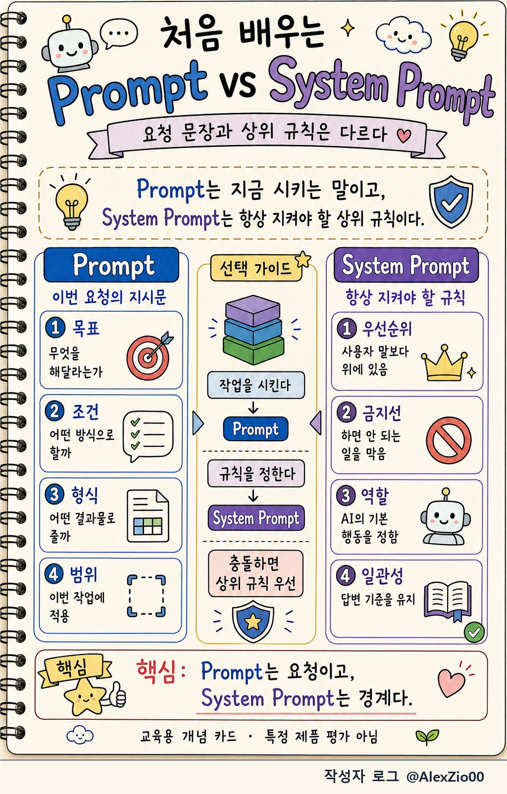

---


</details>


<details>
<summary><strong>Claude Code는 대부분의 엔지니어가 절대 열어보지 않는 5개의 아키텍처 레이어와 함께 배포됩니다.</strong></summary>


기능이 아닙니다. 설정이 아닙니다. 레이어들 — 각각 LLM만으로는 해결할 수 없는 고유한 문제를 해결하는 레이어들입니다. 그리고 그중 네 개는 프롬프팅과는 전혀 관련이 없습니다.
여기 전체 에이전트 개발 키트가 있습니다:

Layer 1 — [CLAUDE.md](http://claude.md/) → 메모리 레이어
아키텍처 규칙, 명명 규칙, 테스트 기대치, 리포지토리 맵. 항상 로드됩니다. 항상 활성화됩니다.
두 가지 범위:
• ~/.claude/CLAUDE.md → 전역
• .claude/CLAUDE.md → 프로젝트
이것은 매 세션 전에 붙여넣는 컨텍스트가 아닙니다. 반복할 필요가 없는 컨텍스트입니다. 에이전트의 헌법입니다.

Layer 2 — Skills → 지식 레이어
각 SKILL.md는 설명을 담고 있습니다. Claude는 런타임에 이를 매칭하고 스킬을 격리된 서브에이전트로 포크합니다. 필요할 때만, 항상 켜져 있는 것이 아닙니다.
주 컨텍스트 윈도우를 부풀리지 않고 작업별 지식을 제공합니다. 설계상 모듈화되어 있습니다.

Layer 3 — Hooks → 가드레일 레이어
PreToolUse → PostToolUse → SessionStart → Stop → SubagentStop

이것은 대부분의 팀이 건너뛰는 레이어입니다. 그리고 가장 먼저 후회하는 레이어이기도 합니다.

훅은 AI가 아닙니다. 결정론적인 이벤트 기반 쉘 명령어입니다.
• 모든 Write에서 자동 린트
• rm -rf에서 강제 차단
• Stop에서 Slack 알림
이벤트 발생 → 매처 확인 → 명령 실행
품질은 인프라 레벨에서 강제됩니다. 프롬프트 레벨이 아닙니다.

Layer 4 — Subagents → 위임 레이어
각 서브에이전트는 자체 컨텍스트 윈도우, 모델, 도구, 권한을 가집니다.
메인 에이전트는 아래로 위임합니다. 결과를 위로 받습니다. 그게 전부입니다.
무한 재귀가 없습니다 — 서브에이전트는 서브에이전트를 생성할 수 없습니다. 메인 컨텍스트는 깨끗하게 유지됩니다. 설계상 강제 경계입니다.

Layer 5 — Plugins → 배포 레이어
스킬 + 에이전트 + 훅 + 명령어를 플러그인으로 번들링하세요. 한 번 설치. 전체 팀이 동작을 상속합니다.
npm 패키지를 생각해보세요 — 하지만 에이전트가 할 수 있는 일에 대한 것입니다.

모든 것을 감싸는:
→ 왼쪽에 MCP 서버 (GitHub, 데이터베이스, API, 커스텀 통합)
→ 오른쪽에 에이전트 팀 (병렬 실행, 메시지 전달, 공유 권한)

한 줄로 요약한 5-레이어 스택:
CLAUDE.md가 규칙을 설정 → Skills가 전문성을 제공 → Hooks가 품질을 강제 → Subagents가 작업을 위임 → Plugins가 팀에 배포
에이전트 시스템의 대부분의 프로덕션 실패는 누락된 한 레이어로 거슬러 올라갑니다.

현재 설정에서 어떤 레이어가 누락되어 있나요?

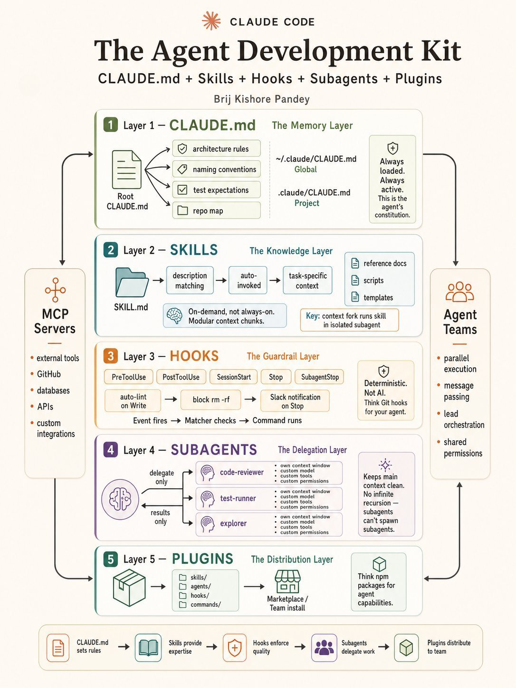

---


</details>


<details>
<summary><strong>당신의 AI 에이전트가 당신을 속이고 있습니다</strong></summary>


그 이유는 당신 코드의 2%만 보고 나머지를 추측하기 때문입니다

당신이 함수 하나를 바꿔달라고 하면, 이미 되어 있다고 말하면서 열지도 않은 3개의 파일을 망가뜨립니다. 문제는 모델이 아니라, 당신의 저장소가 그 컨텍스트에 맞지 않아서 그냥 지어내버리는 겁니다.

code-graph-rag는 다르게 작동합니다: 코드를 그냥 넣어주는 대신, 저장소의 실제 맵을 제공합니다:

→ 완전한 그래프를 구축합니다: 어떤 함수가 무엇을 호출하는지, 어떤 클래스가 무엇을 상속받는지, 이것을 건드리면 무엇이 망가지는지
→ 당신의 테스트를 실행하고 정적 분석이 놓친 실제 호출을 캡처합니다
→ 5개 언어가 섞인 모노레포: 모든 것에 대한 단일 그래프
→ Claude Code에 MCP 서버로 연결됩니다
→ Python, Go, Rust, Java, Node, .NET, PHP, C/C++, Ruby
→ 5분 만에 실행됩니다

추측하는 에이전트와 자신의 위치를 아는 에이전트의 차이입니다.

[https://github.com/vitali87/code-graph-rag](https://github.com/vitali87/code-graph-rag)

---


</details>


<details>
<summary><strong>리뷰어 관점에서 다시 짠 AI 코드 검증법, 61가지 동작 349쪽을 무료로 풉니다.</strong></summary>


AI가 방금 200줄을 건넸습니다. 읽어봤습니다. 다 맞는 것 같습니다.

머지하시겠습니까?

'맞는 것 같다'가 사고가 나는 지점입니다. 생성된 코드를 검토하는 건 읽는 게 아니라 심문하는 겁니다.

머지 전에 던지는 다섯 가지 질문

1. 조용히 빠뜨린 건 뭔가? 빈 입력, null, 타임아웃. 실패 경로는 대개 안 적혀 있습니다.
2. 여기 쓰인 import와 메서드가 실제로 존재하는가? 그럴듯한 이름일수록 확인이 필요합니다.
3. 시키지 않은 부분까지 건드린 건 없는가? diff 전체를 보세요. 요청 범위 밖의 변경이 조용히 섞입니다.
4. 테스트가 통과한 이유가 코드가 맞아서인가, 테스트를 코드에 맞춰 짜서인가?
5. 새벽 3시에 터지면, AI 없이 고칠 수 있는가? 설명하지 못하는 코드는 내 코드가 아닙니다.

다섯 개에 답할 수 없다면 그건 리뷰가 아닙니다. 그냥 기도하는 겁니다.

다행히 이건 재능이 아니라 순서의 문제라서, 몇 번 해보면 손에 붙습니다. 그 순서를 61가지 동작으로 정리해 뒀습니다. 회원가입 없습니다.

[https://github.com/leaf-kit/book-verify-ai-code](https://github.com/leaf-kit/book-verify-ai-code)

---


</details>


<details>
<summary><strong>MIT Agentic Coding 강의 이후에 연결해서 보시면 좋은..</strong></summary>


마이크로소프트의 AI 에이전트 강의...📚
[https://microsoft.github.io/ai-agents-for-beginners/translations/ko/](https://microsoft.github.io/ai-agents-for-beginners/translations/ko/)

좋은 이유는 초보자가 AI 에이전트를 제대로 이해하고 직접 만들어 볼 수 있도록 설계되었기 때문!

체계적인 기초를 쌓을 수 있고 → 이걸 실전 파이프라인에 연결할 수 있음.

AI 에이전트가 무엇인지, 왜 쓰는지부터 시작하는데 그 이후에도

Tool Use, Agentic RAG, Planning, Multi-Agent, Metacognition, Context Engineering, Memory 관리, Production 배포, 보안까지 순서대로 다룸.. 므찜..

MIT 강의에서 얘기했던게 죄다 연결된 것. 좀 더 구체적으로 말이죱.

AI 에이전트 소개, 프레임워크, 설계 패턴, 컨텍스트 엔지니어링, 메모리.... 배우고 잘쓰자!

---


</details>


<details>
<summary><strong>2026년에 승진을 이끄는 구분: 루프 vs 그래프</strong></summary>


같은 티켓. 해결하는 두 가지 방법. 잘못 선택하면 주말이 불타오른다

- 루프
프레임을 설정하는 건 당신. 에이전트가 경로를 소유한다
초안 답변 -> 정책과 비교 확인 -> 해결됐나? -> 아니, 다시 루프
경로를 아직 모를 때 가장 좋다
- 그래프
경로를 그리는 건 당신. 에이전트가 각 노드를 채운다
티켓 읽기 -> 알려진 문제인가? -> 수정 또는 조사 -> 초안 -> QA 통과? -> 리뷰 통과? -> 보내기 -> 로그
매일 같은 파이프라인일 때 가장 좋다

디스크 상에서 어떻게 보이는지:

```java
📁 support-agent
┃
┣📁 Loop
┃ ┣📁 /goal.md
┃ ┣📁 /policy.md
┃ ┗📁 /retry.md
┃
┣📁 Graph
┃ ┣📁 /nodes.yml
┃ ┗📁 /edges.yml
┃
┣📁 Company Brain
┃ ┣📁 /tickets.md
┃ ┗📁 /product-docs.md
┃
┗📁 State
┗📁 /log.md
```

두 형태 모두 같은 회사 브레인에서 읽는다. 이를 건너뛰면 에이전트가 매 실행마다 당신의 비즈니스를 다시 배운다

일이 엉망일 때는 루프로 시작하라
안정되면 그래프로 고정하라

> Grok Bot은 기계와 스케줄을 기본으로 제공한다
Claude는 여전히 루프를 직접 구축하게 만든다
시작은 느리지만, 그 형태를 소유한다
> 

당신의 설정은 실제로 어떤 걸 실행 중인가?

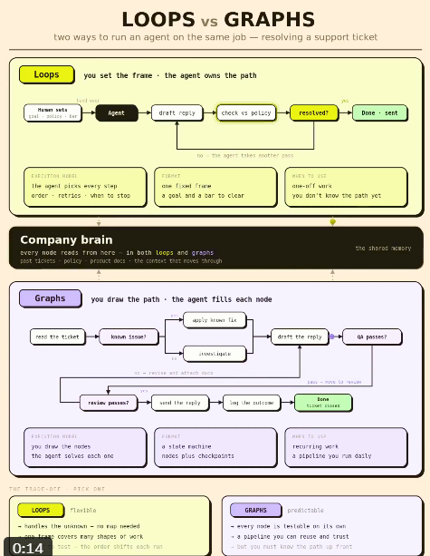

---


</details>


<details>
<summary><strong>현재 가장 포괄적인 DevOps + 보안 Agent Skill 라이브러리 중 하나입니다.</strong></summary>


바로 사용할 수 있는 Skill 160개 이상. 한 번 설치하면 Claude Code, Codex, Cursor에 인프라 팀의 운영 매뉴얼 한 세트를 추가하는 셈입니다.

범위도 넓습니다.

- Kubernetes, Docker, Terraform, CI/CD, 모니터링, 배포
- AWS, Azure, GCP, Cloudflare, 데이터베이스, 네트워크
- 취약점 스캔, 시크릿 관리, 컨테이너 하드닝, 공급망 보안
- MCP 보안, 프롬프트 인젝션, Coding Agent 권한 제어
- SOC 2, GDPR, HIPAA, PCI-DSS, 인시던트 대응

각 Skill에는 실제 설정, 명령어, 스크립트, 트러블슈팅 절차, 참고 자료가 포함돼 있습니다.

예를 들어 Agent에게 Kubernetes 장애 분석, Terraform 작성, 이미지 스캔, Vault 설정을 요청하면, 먼저 해당 작업의 운영 가이드를 읽은 뒤 실행합니다.

전체 설치:

```java
npx skills add bagelhole/DevOps-Security-Agent-Skills
```

원하는 Skill만 골라 설치할 수도 있습니다.

```java
npx skills add bagelhole/DevOps-Security-Agent-Skills \
--skill kubernetes-ops \
--skill hashicorp-vault \
-a cursor -y
```

매번 DevOps나 보안 업무를 위해 프롬프트를 처음부터 작성할 필요가 크게 줄어듭니다.

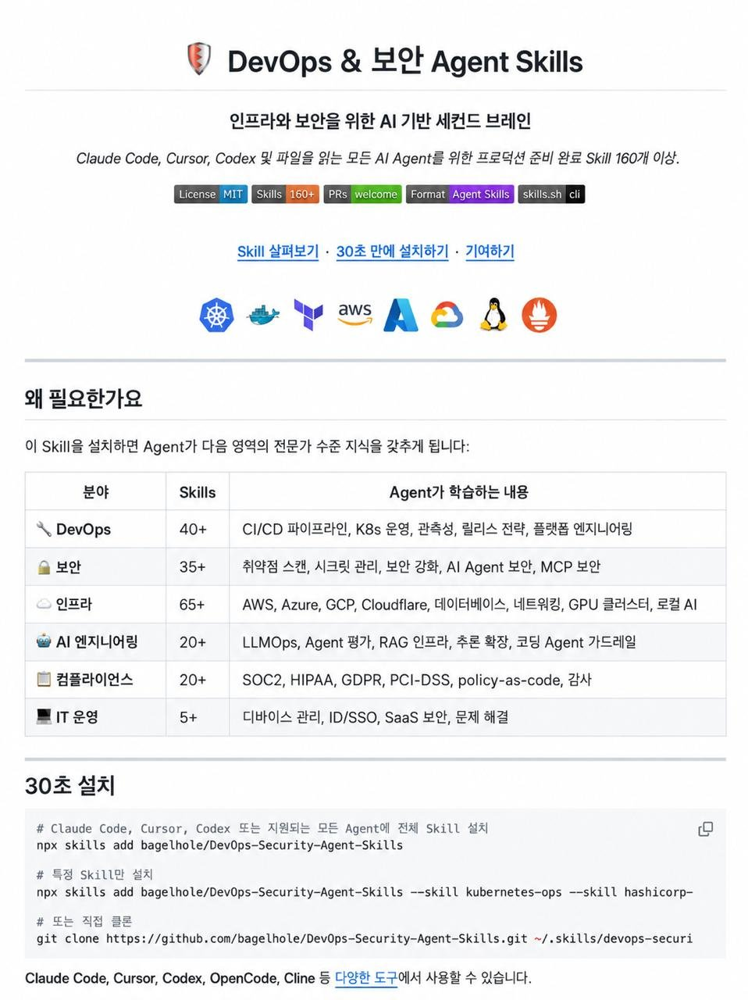

---


</details>


<details>
<summary><strong>하네스된 LLM 에이전트, 명확히 설명!</strong></summary>


두 에이전트가 동일한 모델을 동일한 작업에 실행할 수 있고, 예상대로 완료할 수 있습니다. 하지만 그중 하나는 작업을 완료하는 데 거의 3배의 토큰을 소비할 수 있습니다.

이 추가 사용량은 그들을 감싸는 코드에서 비롯되며, 이 코드는 각 호출 시 모델의 컨텍스트에 무엇이 도달할지 결정하고 호출 횟수를 결정합니다.

예를 들어, 어떤 단계에서 50k 토큰의 JSON을 반환하는 도구를 생각해 보세요. 만약 이것이 컨텍스트에 남아 있다면, 모델은 이후 모든 단계에서 그 페이로드를 다시 읽게 될 것입니다.

도구 정의도 동일하게 작동합니다.

서버가 50개의 도구를 노출할 수 있으며, 각 도구는 이름, 설명, 입력 및 출력 스키마를 가집니다.

기본적으로, 에이전트가 사용하든 사용하지 않든 모든 도구가 첫 번째 호출부터 프롬프트에 남아 있을 것입니다.

그러나 최적화된 하네스는 모델에 불필요한 인지 부하를 피할 수 있습니다.

더 구체적으로, 하네스 엔지니어링의 핵심 설계 원칙 중 하나는 적절한 시점에 모델에서 요소들을 밀어내는 것입니다:

- 메모리는 가중치와 컨텍스트가 지니지 않아야 할 상태를 보유합니다.
- 스킬은 절차적 지식을 보유합니다. 이는 일반 모델을 전문화하는 운영 절차와 휴리스틱을 다룹니다.
- 프로토콜은 사용자, 다른 에이전트, 도구에 대한 상호작용 계약을 보유합니다.

컨텍스트가 영구적으로 사라진다는 점을 유의하세요.

필요할 때 항상 로드되며, 하네스가 얼마나 많은 양을 로드할지와 언제 로드할지를 결정합니다.

예를 들어, 50k 토큰 페이로드를 관리하기 위해 하네스는 이를 파일에 쓰고 컨텍스트에 미리보기와 경로를 유지하거나, 작업을 하위 에이전트에 넘겨 그 컨텍스트를 나중에 폐기하거나, 대화가 임계값을 초과하면 이전 메시지를 요약할 수 있습니다.

이것을 실제로 보고 싶다면, TrueForge는 이러한 관행을 이미 구현한 오픈소스 하네스입니다.

도구 스키마는 사전 로딩이 켜지지 않으면 지연되며, 대형 응답은 샌드박스 파일로 이동하고, 생성된 코드는 하네스를 통해 도구를 다시 호출하므로 샌드박스가 자격 증명을 절대 보유하지 않습니다.

위에서 언급한 두 에이전트는 DevRev의 Enterprise-Bench에서 나온 것입니다. TrueForge는 동일한 모델에서 Claude Managed Agents와 동일한 수의 작업을 해결했으며, 토큰의 3분의 1 조금 넘는 양과 약 40% 적은 도구 호출을 사용했습니다.

여기 GitHub 저장소: [http://github.com/truefoundry/trueforge](http://github.com/truefoundry/trueforge)

또한 에이전트 토큰이 실행 중에 실제로 어디로 가는지에 대한 전체 분석을 작성했으며, 컨텍스트 회계, 위 전략, 벤치마크를 자세히 다루었고, TrueForge가 이 작업을 함께 진행하는 데 도움을 주었습니다.

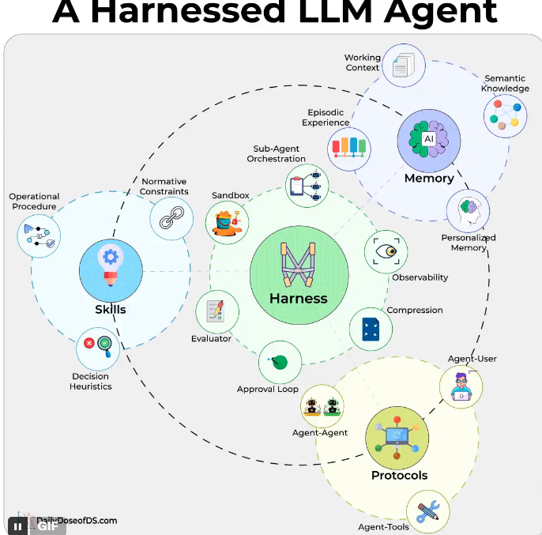

---


</details>


<details>
<summary><strong>🚨속보: Claude에 Council이라는 새로운 기능이 추가되었습니다.</strong></summary>


Claude를 5명의 AI 고문으로 바꾸어 최종 답변 하나를 내리기 전에 서로 논쟁하게 합니다.

설치 방법과 시도해볼 5가지 프롬프트는 여기👇

1. 설치하기
    - 프로젝트 → 새 프로젝트 → 이름을 "The Council"로 지정 → 아래 지침을 프로젝트 지침에 붙여넣기.
    - 완료. 이제 해당 프로젝트 내에서 여는 모든 채팅이 의회로 실행됩니다.
2. 이 지침에 붙여넣기
    - 프롬프트 시작: "당신은 평의회입니다. 단일 목소리로 응답하지 마십시오. 모든 질문에 대해, 각기 다른 관점을 취하는 5명의 조언자를 소환한 후, 하나의 최종 결론으로 마무리하십시오.
    1. 반대론자: 내 사고의 가장 약한 고리를 공격합니다.
    2. 첫 번째 원칙 사상가: 내가 어떻게 표현했는지 무시하고 실제 문제를 해결합니다.
    3. 확장주의자: 내가 간과한 이점을 발견합니다.
    4. 외부자: 맥락이 전혀 없기 때문에 명백한 것을 포착합니다.
    5. 실행자: 다음 행동을 알려줍니다.
    
    그 후, 그것들을 서로 비교하여 약한 주장을 버리고, 하나의 최종 결론을 제시하십시오. 어떤 것에 확신이 없다면, 추측하는 대신 그렇게 말하십시오." 프롬프트 끝.
    
3. 여기 테스트해볼 5개의 프롬프트가 있습니다:
    1. 내가 착각하고 있는 걸까?
    이미 확신하고 있는 그 결정? 그걸 먼저 입력하세요.
        
        의회에 물어보세요: "저는 이미 [감정적으로 몰입한 그 결정]을 하기로 결정했습니다. 제 추론은 다음과 같습니다: [여기에 붙여넣기]. 정중하게 하지 마세요. 어떤 부분이 탄탄한지, 어떤 부분이 제가 스스로를 설득하려는 것인지, 그리고 당신이라면 제가 이걸 실행하도록 허락할지 알려주세요. 명확한 예스 또는 노로 끝내세요."
        
    2. 내 패턴 찾기
    당신의 실적을 읽는 다섯 명의 조언자들이 당신이 발견하지 못한 것을 알아챌 것입니다.
        
        의회에 물어보세요: "지난 몇 년 동안 내가 내린 3가지 가장 큰 결정과 각각의 결과는 다음과 같습니다: [솔직하게 나열하세요]. 이들을 연결하는 패턴을 찾아내고, 계속해서 나타나는 편향을 명명하며, 그로 인해 내가 다음으로 저지를 가능성이 가장 높은 실수를 예측해 주세요."
        
    3. 내 변명 읽기
    계속 미루고 있는 그 일에는 이유가 있습니다. 그 이유가 진짜인지 알아보세요.
        
        평의회에게 물어보세요: "저는 [그 일]을 [얼마나 오랫동안] 미뤄왔습니다. 제 이유는 [당신의 이유]입니다. 판결 시간: 그게 정당한 장애물인가요, 아니면 꾸며낸 두려움인가요? 만약 진짜라면, 해결책을 주세요. 만약 두려움이라면, 그렇게 말하고 오늘 밤 할 첫 번째 행동을 제게 주세요."
        
    4. 거래를 공격하라
    체결, 수락, 또는 지불하려고 하는가? 먼저 그들에게 공격을 허용하라.
        
        의회에 물어보라: "나는 [제안, 계약, 구매, 또는 조건]에 동의하려고 한다. 세부 사항은 다음과 같다: [그것들을 붙여넣기]. 모든 각도에서 공격하라: 과도하게 가격이 책정된 것, 누락된 것, 6개월 후 후회할 것, 그리고 서명 전에 협상해야 할 것. 그런 다음 나에게 말하라: 받아들일까, 밀어붙일까, 아니면 떠날까."
        
    5. 스트레스 테스트
    자랑스러운 계획이 있나요? 현실이 균열을 찾아내기 전에 먼저 찾아보세요.
        
        의회에 물어보세요: "여기 제 계획이 있어요: [자세히 설명하세요]. 지금부터 6개월 후에 이 계획이 실패했다고 가정해 보세요. 여러분 각자가 가장 가능성 높은 실패 이유를 하나씩 꼽은 뒤, 그것을 막을 수 있는 해결책을 제안해 주세요. 그리고 우선순위에 따라 먼저 패치해야 할 것을 순서대로 나열해 주세요."
        

---


</details>


<details>
<summary><strong>여전히 사람들이 왜 이 에이전트 스킬들을 아직 사용하지 않는지 이해가 안 가 💀</strong></summary>


너는 claude code, hermes agent, grok bot을 설치했어. 그럼 이건 AI 에이전트로 원포스 컴퍼니를 만들고 싶다면 반드시 사용해야 할 스킬들이야

에이전트를 완전한 회사로 만드는 35가지 스킬

시니어 엔지니어

1. superpowers → [http://github.com/obra/superpowers](http://github.com/obra/superpowers)
2. agent-skills → [http://github.com/addyosmani/agent-skills](http://github.com/addyosmani/agent-skills)
3. karpathy-skills → [http://github.com/multica-ai/andrej-karpathy-skills](http://github.com/multica-ai/andrej-karpathy-skills)
4. gstack → [http://github.com/garrytan/gstack](http://github.com/garrytan/gstack)

제품 디자이너
5. ui-ux-pro-max-skill → [http://github.com/nextlevelbuilder/ui-ux-pro-max-skill](http://github.com/nextlevelbuilder/ui-ux-pro-max-skill)
6. taste-skill → [http://github.com/Leonxlnx/taste-skill](http://github.com/Leonxlnx/taste-skill)
7. impeccable → github에서 "impeccable" claude skill 검색

QA 테스터
8. Codex (유료)
9. playwright-mcp → github에서 playwright-mcp 검색
10. skills → [http://github.com/anthropics/skills](http://github.com/anthropics/skills)

문서 팀
11. markitdown → [http://github.com/microsoft/markitdown](http://github.com/microsoft/markitdown)
12. skills → [http://github.com/anthropics/skills](http://github.com/anthropics/skills)
13. frontend-slides → github에서 frontend-slides 검색

마케터
14. marketingskills → github에서 marketingskills 검색
15. claude-seo → github에서 claude-seo 검색
16. humanizer → [http://github.com/blader/humanizer](http://github.com/blader/humanizer)
17. Apify (유료)

소셜 매니저
18. social-media-skills → github에서 social-media-skills 검색
19. ManyChat (유료)
20. GPT Image 2 (유료)

모션 디자이너
21. HiggsField (유료)
22. hyperframes → github에서 hyperframes 검색
23. OpenMontage → github에서 OpenMontage 검색
24. OpenCut → github에서 OpenCut 검색

리서처
25. Agent-Reach → github에서 Agent-Reach 검색
26. last30days-skill → github에서 last30days-skill 검색
27. NotebookLM (무료)

운영 매니저
28. Notion MCP (무료)
29. github-mcp-server → [http://github.com/github/github-mcp-server](http://github.com/github/github-mcp-server)
30. claude-mem → [http://github.com/thedotmack/claude-mem](http://github.com/thedotmack/claude-mem)
31. mem0 →

전체 에이전시
32. agency-agents → github에서 agency-agents 검색
33. awesome-claude-skills → github에서 awesome-claude-skills 검색
34. agents → github에서 claude agents 검색
35. claude-skills → github에서 claude-skills 검색

대부분의 레포는 무료야, 몇 가지 유료 도구는 표시했어

첫날 35개 전부 설치하지 마. 네가 부족한 역할부터 골라서 2-3개 추가해

에이전트 스택용으로 이걸 북마크해둬

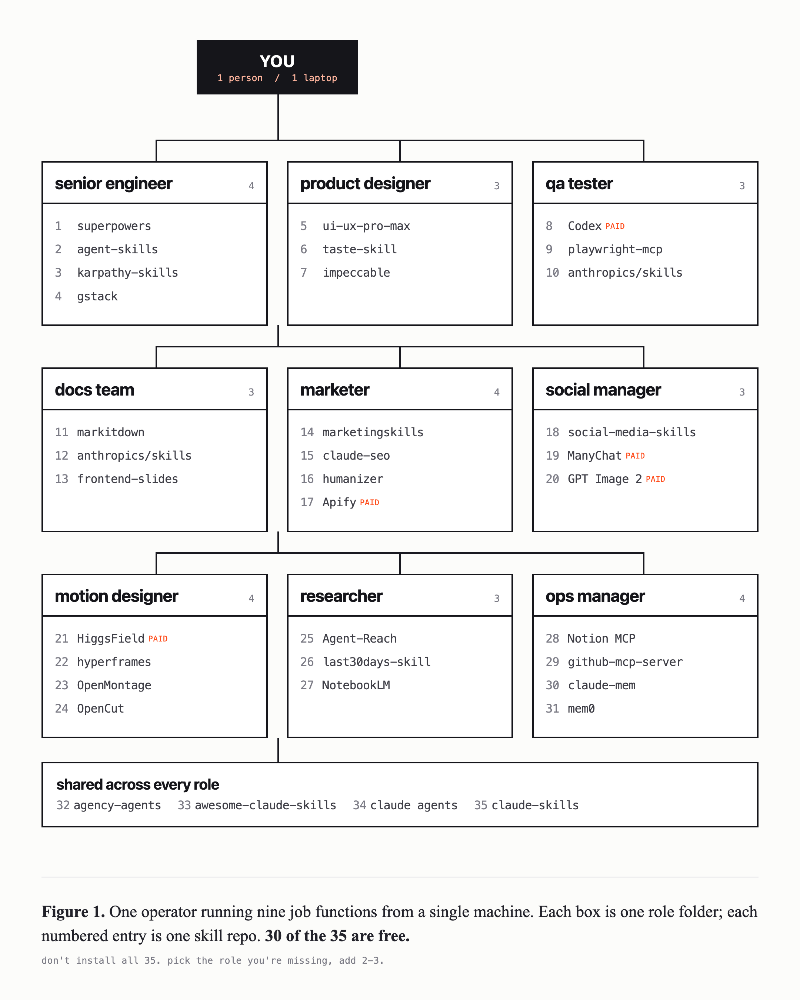

---


</details>


<details>
<summary><strong>왜 DB 설계가 중요한가. 이유는 간단하다.</strong></summary>


①한 번 데이터가 들어가면 설계 변경은 망가뜨리고 다시 만드는 것과 다름없다. 예를 들어 "users 테이블에 전화번호를 하나만 가질 수 있게 했다" → 나중에 여러 개 등록에 대응하려고 하면, 기존 데이터의 이관과 모든 참조 코드의 수정이 발생한다.

②정규화나 인덱스의 실패는 앱 쪽 코드로는 보정할 수 없다. 예를 들어 검색 대상 컬럼에 인덱스를 붙이는 걸 잊으면, 데이터가 1만 건에서는 한순간이지만 100만 건에서는 몇 초가 걸린다. 코드를 아무리 다시 써도 해결되지 않는다.

③제약 설계가 느슨하면 부정확한 데이터가 들어오고, 대증요법이 쌓인다. 예를 들어 외래 키 제약이 없어서 "존재하지 않는 사용자 ID의 주문 데이터"가 들어오면, 앱 쪽에서 null 체크의 if문이 끝없이 늘어난다.

④스케일링하는 순간에 N+1이나 JOIN 과다에 빠진다. 예를 들어 "게시물 목록 + 각 게시물의 작성자 이름"을 한 건씩 가져오는 구현은 10건이면 눈치채지 못하지만, 1000건이 되는 순간에 1000번의 쿼리가 발동한다.

코드는 다시 쓰면 된다. 하지만 DB는 고치는 데 시간도 리스크도 비교할 수 없을 만큼 든다.

---


</details>


<details>
<summary><strong>하네스 엔지니어링이란 무엇인가, 시각적으로 설명.</strong></summary>


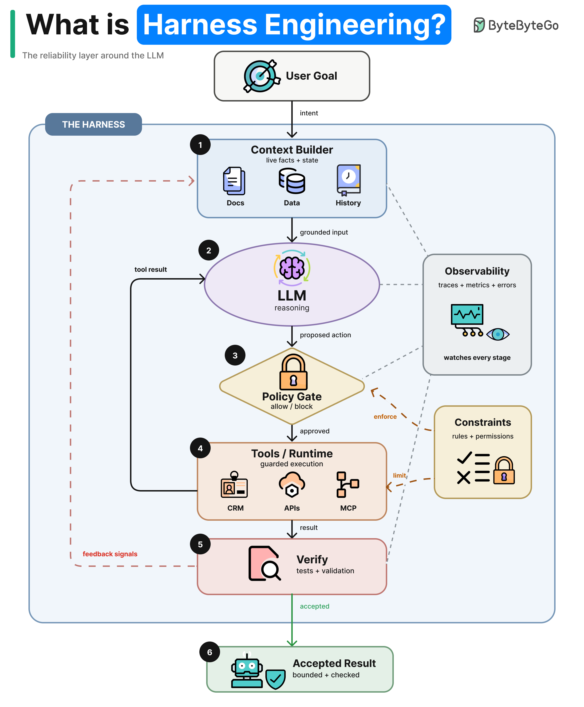

에이전트 하네스는 어떻게 작동하나요?

LLM은 추론하고 텍스트를 생성할 수 있지만, 그것만으로는 신뢰성이 떨어질 수 있습니다. 신뢰성은 보통 하네스에서 나오며, 아래 다이어그램에 표시된 LLM을 둘러싼 계층입니다.

1. 사용자가 쿼리를 하네스에 보내면, 컨텍스트 빌더가 지식 베이스를 사용하여 쿼리를 프롬프트로 변환합니다.
2. LLM이 제공된 프롬프트에 대해 추론하고 일부 작업(호출할 함수)을 제안합니다.
3. 정책 게이트가 작업을 확인하고 허용할지 차단할지 결정합니다.
4. 런타임이 먼저 도구를 실행하고 결과를 LLM에 다시 보냅니다.
5. 마지막으로, 검증 단계가 결과에 대한 테스트를 실행하고 피드백을 미래 반복을 위한 컨텍스트에 포함합니다.
6. 검증 단계가 통과되면, 하네스가 결과를 사용자에게 표시합니다.

이 외에도 모든 단계에서 공유되는 두 개의 다른 계층이 존재합니다. 관찰 가능성 계층은 메트릭이나 오류 같은 것을 추적합니다. 제약 조건 계층은 시스템이 이를 시행할 수 있도록 규칙과 권한을 설정합니다.

에이전트 실패의 대부분은 컨텍스트, 도구, 제약 조건, 또는 검증 중 어디서 발생한다고 생각하시나요?

---


</details>


<details>
<summary><strong>스택에 추가할 만한 5가지 AI 에이전트 스킬:</strong></summary>


AI 에이전트는 당신이 부여한 스킬만큼만 좋습니다.

이 5가지는 에이전트를 더 유용하고, 자기 개선 가능하며, 훨씬 덜 로봇처럼 만들 수 있습니다:

1. ELI5
복잡한 주제를 간단하고 이해하기 쉬운 설명으로 바꿔줍니다
[https://github.com/anthropics/claude-plugins-community/blob/main/eli5/skills/eli5/SKILL.md](https://github.com/anthropics/claude-plugins-community/blob/main/eli5/skills/eli5/SKILL.md)
2. Show Me
에이전트가 자신이 하는 일을 시각적으로 설명하도록 도와줍니다
[https://github.com/humanlayer/skills/tree/main/plugins/show-me](https://github.com/humanlayer/skills/tree/main/plugins/show-me)
3. Skill Doctor
에이전트 스킬을 감사하고 개선 사항을 제안합니다
[https://github.com/warpdotdev/common-skills/tree/main/.agents/skills/skill-doctor](https://github.com/warpdotdev/common-skills/tree/main/.agents/skills/skill-doctor)
4. Retro
에이전트가 과거 작업을 반성하고 실수로부터 배우도록 합니다
[https://github.com/mattpocock/skills/blob/main/skills/in-progress/retro/SKILL.md](https://github.com/mattpocock/skills/blob/main/skills/in-progress/retro/SKILL.md)
5. Unslop
일반적이고 로봇 같은 AI 스타일 글쓰기를 제거하고 출력을 더 자연스럽게 만듭니다
[https://github.com/cursor/plugins/tree/main/pstack/skills/unslop](https://github.com/cursor/plugins/tree/main/pstack/skills/unslop)

진짜 힘은? 에이전트에게 설명하고, 개선하고, 배우고, 더 잘 소통할 수 있는 스킬을 주는 것입니다.

---


</details>


<details>
<summary><strong>AI 에이전트를 구축하려면 이해해야 할 4가지 유형의 메모리가 있습니다:</strong></summary>


1. 내부 지식: LLM 가중치에 내장된 지식.
2. 컨텍스트 창: 현재 추론 중에 LLM이 보는 내용.
3. 단기 메모리: 활성 세션 동안 메모리(RAM)에 유지되는 최근 상호작용, 활성 상태, 검색된 정보.
4. 장기 메모리: 에이전트 외부에 저장된 지속적인 정보.

메모리가 LLM에 가까울수록 사용하기 쉽습니다.

LLM에서 멀어질수록 올바른 정보를 검색하고 컨텍스트로 다시 가져오기 위해 더 많은 인프라가 필요합니다.

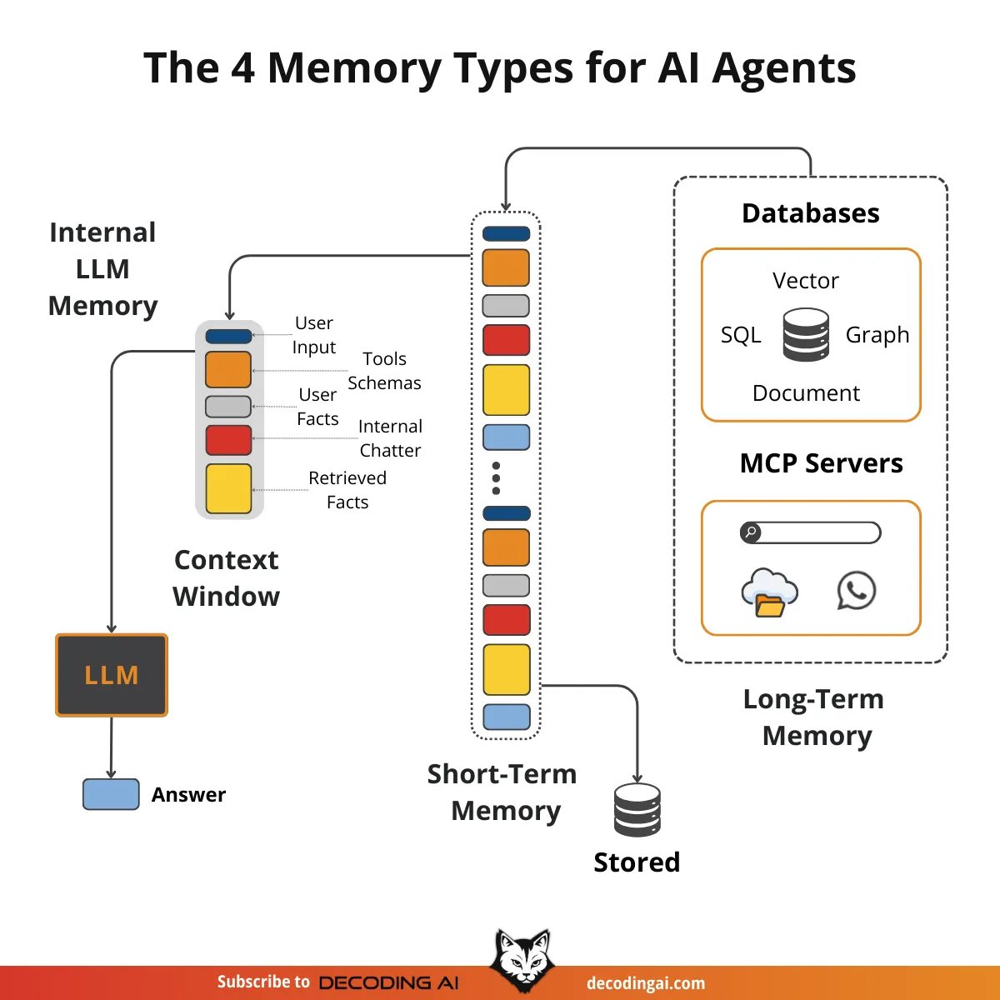

---


</details>


<details>
<summary><strong>Archify라는 멋진 프로젝트를 발견했어요.</strong></summary>


큰 프로젝트의 아키텍처를 구축하기 위해 이 스킬 세트를 사용할 수 있습니다.

예를 들어 웹 랜딩 페이지, 관리자 패널, 사용자 패널, 그리고 모바일 앱으로 구성된 큰 시스템을 만들 거라고 해보죠. 이 시스템을 처음에 잘 분석하고 구상해야 해요.

Archify 스킬 세트를 바로 이 지점에서 사용하게 되는 거예요.

시스템을 설명하면, 백엔드-프론트엔드-데이터베이스-클라우드-보안 시스템들과 그들 사이의 연결을 시각화해서 설명해 줍니다.

그 다음에 이 출력을 LLM에 주고 계획을 세우게 할 수 있어요.

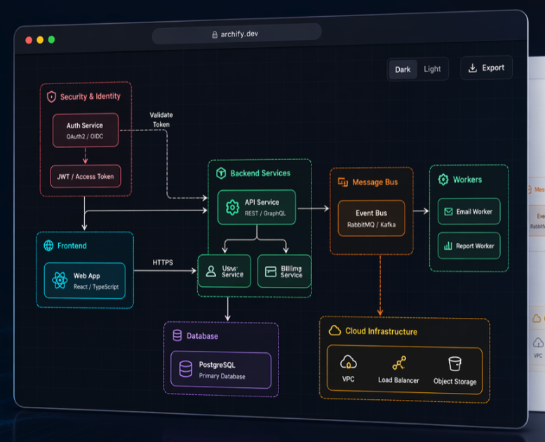

---


</details>


<details>
<summary><strong>만약 하네스 엔지니어링을 배우고 싶다면, 먼저 이런 걸 이해하는 걸로 시작하라고 할게:</strong></summary>


모델은 에이전트의 일부일 뿐이야.

하네스는 모델 주위의 시스템으로, 컨텍스트를 관리하고, 도구를 실행하며, 상태를 유지하고, 에이전트의 한계를 제어해.

이게 내가 제안하는 로드맵이야:

1. 에이전트 루프
    
    먼저 기본 사이클을 이해해:
    
    작업 받기 → 다음 단계 결정 → 도구 사용 → 결과 관찰 → 계속하거나 멈추기.
    
    모든 다른 건 이 루프 주위에 구축되는 거야.
    
2. 컨텍스트 엔지니어링
    
    컨텍스트에 어떤 정보가 들어갈지, 어떤 걸 빼고, 언제 회수할지 결정하는 법을 배워.
    
    지시사항, 파일, 히스토리, 도구 결과, 정보 회수, 압축을 포함해.
    
3. 도구 디자인
    
    도구는 명확한 이름, 정확한 설명, 간단한 매개변수, 검증, 유용한 응답이 필요해.
    
    결과는 컨텍스트로 돌아가서 에이전트가 다음에 할 일을 직접적으로 영향을 줘.
    
4. 상태와 메모리
    
    상태는 작업 중에 진행 상황, 계획, 중간 결과, 승인을 유지할 수 있게 해.
    
    메모리는 결정이나 선호도 같은 유용한 정보를 여러 세션 사이에 지속시켜.
    
5. 계획과 오케스트레이션
    
    계획은 작업을 단계로 나누고, 새로운 정보가 나오면 계획을 업데이트하는 거야.
    
    오케스트레이션은 모델, 도구, 하위 에이전트, 핸드오프를 조정해서 그 작업을 실행해.
    
    단일 에이전트부터 시작해. 작업이 정말로 나눌 수 있을 때 하위 에이전트를 추가해.
    
6. 권한과 가드레일
    
    에이전트가 읽고, 수정하고, 실행할 수 있는 걸 정의하고, 어떤 행동이 승인이 필요한지, 언제 멈춰야 하는지.
    
    더 많은 자율성은 더 나은 한계를 요구해.
    
7. 관찰 가능성과 평가
    
    트레이스, 도구 호출, 오류, 비용, 결과를 저장해.
    
    그 다음 실제 작업으로 평가를 구축해서 결함을 찾고, 각 변경이 시스템을 정말로 개선하는지 확인해.
    
8. 장기 실행 에이전트
    
    마지막으로, 압축, 체크포인트, 재시도, 시간과 비용 한계, 오류 복구, 작업 재개에 대해 배워.
    

왜 하네스 엔지니어링이 중요한가?

같은 모델을 가진 두 에이전트가 컨텍스트, 도구, 상태, 권한, 피드백에 따라 아주 다른 결과를 얻을 수 있기 때문이야.

에이전트를 개선하는 게 항상 모델을 바꾸는 걸 의미하는 건 아니야. 많은 경우, 작업을 가능하게 하는 시스템을 더 잘 디자인하는 걸 의미해.

---


</details>


<details>
<summary><strong>맥이나 로컬 LLM에 관심 있는 사람일수록, Hermes Agent는 공부할 만해.</strong></summary>


ChatGPT나 Claude는, 모델 단독이 아니야.

메모리, 도구, 스킬 등의 "하네스"가 포함된 서비스야.

로컬 LLM은 달라.

Llama나 Qwen을 다운로드해도, 거기 있는 건 "두뇌"뿐이야.

거기에 Hermes Agent를 덧붙이는 거지.

LLM이 생각해. Hermes가 움직여. 조사해. 기억해. 도구를 써. 파일을 다뤄. 명령어를 실행해.

"생각하는 두뇌"에 "움직일 수 있는 몸"을 주는 거야.

이게 AI 에이전트야.

그러니까 비교한다면 "Qwen vs Fable"만이 아니야.

"Qwen + Hermes" 대 "Fable + Claude 앱"처럼, 하네스 포함해서 생각해야 해.

채팅이나 요약만 한다면 LM Studio로 충분해.

하지만, 모델을 "일하는 에이전트"로 만들고 싶다면, Hermes Agent는 갖고 싶어질 거야.

모델은 언젠가 교체될 테니까.

남는 건, 스스로 갖는 하네스야.

Hermes Agent는, 무료로 쓸 수 있는 에이전트 하네스로서 꽤 강력하다고 생각해.

---


</details>


<details>
<summary><strong>내가 본 것 중 가장 깔끔한 그래프 엔지니어링 셋업</strong></summary>


하나의 에이전트가 원시 소스에서 클레임을 추출하고, 하나는 그것들이 어떻게 연결되는지 제안하고, 하나는 이미 있는 것과 모든 클레임을 확인해

모든 클레임이 추가되고, 타임스탬프가 찍히고, 소스가 기록돼. 절대 덮어쓰지 않아

실제 내부에 뭐가 있는지:

- 스키마

> nodes.yml - 엔티티, 클레임, 소스, 아티팩트, 런
edges.yml - supersedes
[ids.md](http://ids.md/) - 엔티티당 하나의 ID, 별칭 나열
> 
- 스토어

> log/ - 하루에 하나의 jsonl, 하루가 끝나면 봉인
blobs/ - sha256 파일명, 무료로 중복 제거
index.duckdb - 파생된 거, 언제든 삭제해도 안전
> 
- 라이터들 (.claude/agents/)

> [extractor.md](http://extractor.md/) - 소스 입력, 클레임 출력
[linker.md](http://linker.md/) - 병합 제안, 절대 병합 안 함
[checker.md](http://checker.md/) - 지지하거나 반박, 항상 이유와 함께
[http://write.py](http://write.py/) - 유일한 입력 경로, 검증하고 추가하고 종료
> 
- 운영

> queries/ - 질문들, sql로 저장
merges.pending.jsonl - 인간이 하나하나 승인
make rebuild - 로그에서 전체 인덱스가 8초 만에 복구
> 

12,571 클레임 입력. 행 하나도 업데이트된 적 없음

그래프가 잘못됐을 때 고치지 않아. 수정 사항을 추가하고 로그가 실수를 투표로 이기게 내버려둬

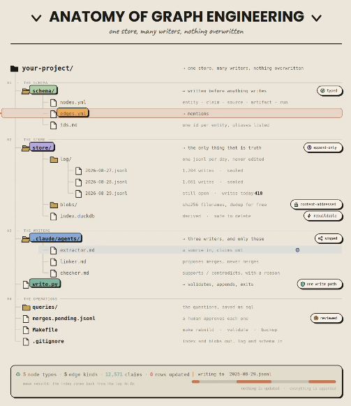

---


</details>


<details>
<summary><strong>진짜 Linux를 써본 사람이라면, 지금 많은 AI Agent 튜토리얼을 보면서 마음이 꽤 복잡할 거예요.</strong></summary>


왜냐하면 알게 되니까, AI는 2026년 거라는 거죠.

많은 소위 Agent 인프라가 대충 1996년 거라는 거예요.

Agent한테 사용자 따로 만들어주면, 그걸 '신원 격리'라고 해요.

chmod 한 번 해주면, '최소 권한'이라고 해요.

디렉토리 하나 나누면, '워크스페이스 샌드박스'라고 해요.

sudo 제한하면, '보안 경계'라고 해요.

systemd 데몬 프로세스라고, 'Agent 런타임'이라고 해요.

cron으로 타이밍 잡아서 돌리면, '자율 스케줄러'라고 해요.

journalctl로 로그 보면, '관찰 가능성'이라고 해요.

SSH로 원격 접속하면, '휴먼 인 더 루프'라고 해요.

Docker로 한 겹 씌우면, '보안 실행 환경'이라고 해요.

프로세스 죽으면 자동으로 다시 띄우면, '셀프 힐링'이라고 해요.

몇 개 스크립트 서로 호출하는 거만으로, 벌써 '멀티 에이전트 아키텍처' 그림 그리기 시작해요.

Redis 하나 더 끼얹으면, 다음 날 바로 펀딩 받을 기세예요.

가끔 이런 아키텍처 다이어그램 보면, 진짜 많이 배우는 기분이에요.

원래 내가 서버 관리할 때 매일 Agent 인프라 짜고 있었는데, 그땐 아무도 이 용어가 돈이 된다고 말 안 해줬어요.

Linux가 진짜 편한 점이 바로 여기예요.

Agent를 전혀 믿을 필요가 없어요.

그냥 평범한 사용자 하나 주고.

홈 디렉토리 하나 주고.

읽어야 할 건 읽기 권한 주고.

써야 할 건 쓰기 권한 주고.

건드릴 거 없으면 쳐다보지도 못하게 하고.

CPU, 메모리, 프로세스, 포트, 파일, 네트워크, 다 관리할 수 있어요.

장기적으로 돌리려면 systemd.

임시로 돌리려면 tmux.

타이밍 맞춰 돌리려면 cron.

격리하려면 컨테이너.

그래도 불안하면 VM.

최고로 불안하면 그냥 인터넷 끊어요.

그래서 많은 Linux 베테랑 유저들이 Agent 놀 때 적응이 엄청 빨라요.

남들은 아직 AI가 명령 실행하는 걸 어떻게 우아하게 관리할지 연구 중인데.

Linux 유저들은 반나절 쳐다보고.

아.

이게 그냥 좀 믿음직하지 못한 평범한 사용자 하나 추가된 거잖아.

---


</details>


<details>
<summary><strong>요즘 하네스에 대한 이야기가 사라진 이유</strong></summary>


1. 올해 상반기~한여름까지는
하네스 엔지니어링 얘기가 진짜 도배 수준이었음
2. 프롬프트 다음이 컨텍스트고, 그다음이 하네스다, 모델보다 환경을 짜는 게 핵심이다… 이런 식의 글·강의·영상이 계속 나왔었음
3. 그런데 지금은 좀 가라앉은 편임. 모델이 좋아지면서 “굳이 복잡한 하네스 계속 만들지 말고 슬슬 걷어내자”, “새 모델 나오면 하네스도 다시 검증해야 한다” 같은 말이 나오기 시작했음

지금은 Astra가 나와서 또 다시 자신의 하네스를 점검해볼 차례기도 함

요즘 하네스 만들지 말라는 이야기가 도는데

하네스는 결국
그 시점 모델이 부족한 부분을 보완하는 장치라서

새 모델이 나오면
하네스도 같이 다시 검증하고 업데이트해야 함다

---


</details>


<details>
<summary><strong>GPT-6 Astra를 위한 스킬 및 프롬프트 재고찰</strong></summary>


코딩 에이전트는 많은 발전을 이루었고, 모범 사례도 빠르게 변화하고 있습니다. 예전에는 많은 도움과 지원이 필요했던 작업들이 이제는 더 이상 그렇지 않습니다.

지난 한 해 동안 프로젝트에서 에이전트를 사용해 왔다면, 모델을 좋은 결과로 이끌기 위해 작업하는 과정에서 불필요한 명령어가 많이 쌓였을 가능성이 높습니다. 새로운 버전이 출시될 때마다 이러한 가정을 재검토하는 것이 중요했지만, GPT-6 Astra의 경우에는 그 중요성이 더욱 커졌습니다.

이러한 지침은 스킬, AGENTS.md 및 작업 프롬프트 등 다양한 형태로 나타날 수 있으며, 이 모든 요소가 모델이 작업을 수행하는 방식을 결정합니다.

# **스킬 파일**

이러한 지침은 스킬 파일 형태로 제공될 수 있는데, 이는 기본적으로 마크다운 파일로 저장된 프롬프트이며, 경우에 따라 스크립트가 함께 포함되기도 합니다. 일반적으로 스킬 파일은 모델이 특정 작업에만 필요한 워크플로에 대한 안내나 플러그인 사용 방법에 대한 지침을 제공하는 데 가장 유용합니다.

많은 사람들이 프로젝트에 여러 스킬을 한꺼번에 다운로드하는 경향이 있는데, 이는 잘못된 접근 방식입니다. 각 스킬에는 이름과 설명이 있으며, 이는 모델의 컨텍스트에 로드되어 모델이 언제 해당 스킬을 사용해야 하는지 알 수 있도록 합니다. 설명이 너무 긴 경우가 많은데, 스킬을 너무 많이 추가하면 Codex가 설명을 줄여서 컨텍스트에 맞추려고 합니다. 결과적으로 모델은 각 설명에 대한 정보를 덜 접하게 되어 어떤 스킬을 선택해야 할지 판단하기 어려워집니다.

더 심각한 것은, 설명들이 서로 모순되거나 지나치게 "나를 선택해 주세요"라는 메시지를 전달하여 모델이 실제 작업에 도움이 되지 않는 지침을 로드하게 만드는 경우입니다.

만약 여러분이 Codex에게 스킬 제작을 의뢰한 적이 있다면, Codex는 아마도 다음을 사용했을 것입니다.$스킬 크리에이터기술. 최근 실무에서 발생한 여러 실패 유형을 완화하는 데 도움이 되도록 몇 가지 방식으로 지침을 업데이트했습니다.

첫째, 스킬 설명은 모델이 언제 해당 스킬을 사용해야 하는지를 명확히 하면서 가능한 한 간결해야 합니다.

*여기서 잘못된 스킬 설명은 모델이 데이터베이스와 관련된 모든 작업을 수행할 때마다 해당 스킬을 사용하도록 만들 수 있으며, 마이그레이션을 처리해야 할 때만 사용하도록 만들지 않을 수 있습니다.*

둘째, 유용한 기술의 핵심 지표 중 하나는 점진적 정보 공개입니다. 기술을 읽는 것은 맥락을 파악하는 것으로 이어져, 기술에 더 가까워지고, 작업에 직접 적용되지 않을 수도 있는 지침까지 제공받게 됩니다. 여러 워크플로가 있는 기술의 경우, 기본 문서를 최소한의 라우터로 만들어 지원 문서와 스크립트를 가리키도록 하세요. 모델이 어디를 참조해야 하는지 알 수 있도록 충분한 지침을 제공하되, 현재 중요하지 않은 내용을 읽도록 강요하지 마세요.

셋째, 많은 기술들이 정교한 일정표나 레시피처럼 작성되었습니다. 모델들이 미묘한 차이와 모호함을 이해하는 능력이 훨씬 향상되었기 때문에, 지나치게 구체적인 지침은 예전에는 도움이 되었던 것과 달리 이제는 오히려 결과를 저해할 수 있습니다.

저장소의 기술은 다른 기여자의 에이전트에도 영향을 미치는데, 이들은 서로 다른 모델을 사용할 수 있습니다. Sol이나 Luna에게 도움이 되는 지침은 GPT-6 Astra에 과도한 제약을 가할 수 있으므로, 어떤 모델이 사용자가 남긴 지침을 사용할지 고려해야 합니다.

# **에이전트.md**

AGENTS.md 파일은 모델이 저장소에서 작동하는 모든 시점에 적용되므로, 각 지침을 다시 검토하여 해당 작업에 여전히 필요한지 확인하십시오.

오타 수정 하나 할 때마다 방대한 문서나 전체 저장소 맵을 요구하는 것은 과도합니다. GPT-6 Astra는 매 변경 전에 전체 프로젝트를 검토하지 않고도 필요한 정보만 파악할 수 있습니다.

*모델이 편집할 때마다 파일을 읽도록 하는 것은 컨텍스트를 소모하고 작업 속도를 늦추는 지름길입니다. 하지만 맥락에 맞는 문서 링크를 제공하는 것은 여전히 유용할 수 있습니다. 문서도 항상 최신 상태로 유지하세요!*

이전 모델들은 테스트를 실행하고 결과를 검증하기 위해 별도의 지시가 필요했습니다. 하지만 GPT-6 Astra는 이러한 작업을 스스로 수행하므로, 동일한 지시를 반복하면 불필요한 테스트가 발생할 수 있습니다.

GPT-6 Astra는 철저하지만, 작업을 어디까지 수행해야 할지 판단하는 데 다소 신중할 수 있습니다. 때로는 작업을 계속 진행하도록 약간의 자극이 필요합니다. AGENTS.md를 사용하여 로컬 테스트 스위트와 같이 안전하다고 판단되는 특정 워크플로에 대한 권한을 부여할 수 있습니다.

> 로컬 테스트는 일회용 픽스처를 사용하며 프로덕션 환경에 접근할 수 없습니다. 테스트를 실행하고, 요청된 변경 사항으로 인해 발생한 오류를 수정한 후, 각 단계에서 승인을 요청할 필요 없이 해당 테스트를 다시 실행할 수 있습니다.
> 

# **결정 경계**

경계를 설정하는 방식에 세심한 주의를 기울이세요. 이전 모델이 허락 없이 작업을 수행했다면, 먼저 허락을 구하도록 강력한 문구를 추가했을 수 있습니다. 이는 유용할 수 있지만, GPT-6 Astra는 훨씬 뛰어난 판단력을 가지고 있으므로 그에 맞게 사용해야 합니다. 또한, GPT-6 Astra는 사용자의 경계를 진지하게 받아들이고, 사용자가 작업을 계속하기를 원하는 경우에도 작업을 중단할 수 있습니다.

# **고집**

GPT-5.6 Sol이 요청을 받고 오랫동안 작업을 계속하는 것에 익숙하다면, GPT-6 Astra는 언제 작업을 중단해야 할지 망설이는 것처럼 느껴질 수 있습니다. 첫 번째 구현을 완료한 후에도 작업이 남아 있는 상태에서 검토를 위해 다시 돌아올 수 있습니다.

이럴 때 시작하기 전에 완료 기준을 명확히 정의하는 것이 도움이 됩니다. 구현 실행, 결과 검사, 오류 수정 등이 작업에 포함된다면, 해당 내용을 요청에 명시하세요. 첫 번째 구현 후 검토를 위해 작업을 중단해야 한다는 요구사항은 모델 개발을 더 일찍 중단하게 만들 수 있으므로, 실제로 그러한 결정을 내려야 하는지 신중하게 검토해야 합니다.

첫 번째 탐색 이후에도 계속 탐색을 진행하려면 탐색할 내용과 탐색을 멈춰야 할 지점을 지정하세요.

새로운 모델을 도입하는 것은 시스템을 정비할 좋은 기회입니다. GPT-6 Astra에게 이 글에서 다룬 내용을 바탕으로 시스템 진단을 의뢰하고, 이전에는 시도조차 하지 않았던 새로운 것을 만들어 보세요!

---


</details>


<details>
<summary><strong>🚨하나의 파일만 수정하면 GPT-6 Astra 토큰을 35%+ 직접 절감할 수 있어!</strong></summary>


GPT-6 Astra가 비싼 게 아니라, 네 AGENTS.md가 너무 뚱뚱한 거야

토큰 절감은 한 가지 일만 해: 저장소 루트 디렉토리의 AGENTS.md를 간소화된 버전으로 교체해 (그림 참조)

수정 후 실제 테스트 데이터가 꽤 세네:

🔹일반 코드 수정 시 5%–15% 절감
🔹파일 간 긴 작업 시 10%–25% 절감
🔹반복 검색, 반복 검증 작업 시 30%–35%+ 절감 가능

GPT-6 Astra 협업 규칙에서 토큰을 진짜 줄이는 건 텍스트가 짧아지는 게 아니라, Agent의 나쁜 습관을 뿌리 뽑는 거야:
🔸먼저 결론부터, 요구사항 반복 읽지 않기
🔸이미 확인된 정보는 다시 읽지 않기, 다시 검색하지 않기
🔸증거가 충분하면 멈추기, 원인 찾으면 바로 수정하기
🔸이미 승인된 작업은 반복 확인하지 않기
🔸검증 강도는 이번 위험과 맞추기, “엄격해 보이려고” 테스트 추가하지 않기
🔸결과물 나오고, 필요 검증 끝나고, 제한사항 명확히 하면 바로 마무리하기
🔸서브 Agent는 독립적이고 조정 비용보다 이득이 클 때만 분리하기

GPT-6 Astra는 AGENTS.md에 더 민감해. 파일이 완벽할수록, 오래된 규칙에 휘말려 헛돌기 쉬워.

루트 파일에는 안정적인 규칙만 남기고, 세부 사항은 필요할 때 로드하면 청구서가 떨어질 거야.

수집해서 대조하며 수정해. 수정 후 토큰이 가장 많이 드는 긴 작업 하나를 비교해봐. 대부분의 경우 35%가 아니라, 전체 무효 탐색을 아낄 수 있어.

---


</details>


<details>
<summary><strong>우리가 기대하는 멀티 Agent 협업은 이런 모습입니다</strong></summary>


한 Agent는 기능을 만들고,

다른 Agent는 테스트를 보완하고,

또 다른 Agent는 보안 검토를 하고,

누군가는 프로젝트에서 예전에 겪었던 문제까지 기억해주는 것.

그런데 Agent가 늘어나면 금방 복잡해집니다.

누가 무엇을 맡았는지,
이미 처리한 작업은 무엇인지,
컨텍스트는 어떻게 공유할지,
마지막 리뷰는 누가 할지. 🤯

GitHub 7.1만 Star의 Ruflo는 Claude Code와 Codex에 멀티 Agent 오케스트레이션 레이어를 더해주는 프로젝트입니다.

작업을 역할별 Agent에게 나눠 맡기고,
결과·메모리·검증 흐름을 다시 연결합니다.

전체 설치 시 제공하는 구성:

→ 전문 Agent 98개

→ 명령어 60개 이상과 Skill 30개

→ 멀티 Agent 협업과 작업 라우팅

→ 벡터 메모리 및 세션 간 검색

→ 자동 테스트, 문서화, 보안 점검, 비용 추적

→ Claude, GPT, Gemini, Cohere, Ollama 등 모델 라우팅

가볍게 필요한 명령과 역할만 설치하는 플러그인 모드도 있습니다.

다만 전체 CLI 모드는 프로젝트에 `.claude/`, `.claude-flow/`, `CLAUDE.md`, MCP, Hook, 백그라운드 컴포넌트까지 생성합니다.
오래 유지할 큰 프로젝트에 더 어울리는 선택입니다. 

[https://github.com/ruvnet/ruflo](https://github.com/ruvnet/ruflo)

---


</details>


<details>
<summary><strong>AI 엔지니어링에서 무엇을 만들어야 할지 계속 묻는 사람들을 위해.</strong></summary>


➣  자체 컨텍스트 어셈블러 구축
(토큰 예산 메모리 + 검색 + 도구)

➣  자체 검색 스택 구축
(청커 + BM25 + 밀도 검색 + 재순위)

➣  자체 모델 라우터 구축
(비용/지연/품질 라우팅 + 대체)

➣  자체 시맨틱 캐시 구축
(임베딩 유사도 + 적중률 추적)

➣  자체 에이전트 오케스트레이터 구축
(결정론적 상태 머신, LangChain 없음)

➣  자체 MCP 서버와 클라이언트 구축
(원시 JSON-RPC, SDK 없음)

➣  자체 멀티 에이전트 합의 구축
(가중 투표 + 심판 + 에스컬레이션)

➣  자체 샌드박스 도구 실행기 구축
(격리 실행 + 자원 제한)

➣  자체 가드레일 미들웨어 구축
(주입 탐지 + PII 편집)

➣  자체 지속 워크플로 엔진 구축
(체크포인트/재개, 미니-Temporal)

➣  자체 스트리밍 프록시 구축
(SSE + TTFT 및 ITL 메트릭)

➣  자체 LLM 트레이서 구축
(매 홉마다 OpenTelemetry 스타일 스팬)

➣  자체 평가 하네스 구축
(궤적 등급 + CI 회귀 게이트)

➣  자체 프롬프트 레지스트리 구축
(버전 관리 + A/B 라우팅 + 롤백)

➣  자체 데이터 플라이휠 구축
(피드백 → 합성 데이터 → LoRA 루프)

3개 선택. 처음부터 구축. 모든 결정 문서화.
대부분의 사람들은 라이브러리를 가져옵니다.

빌더들은 그 아래에서 무슨 일이 일어나는지 이해합니다.

---


</details>


<details>
<summary><strong>AI 엔지니어링 분야에 진입하려 한다면, 제가 우선적으로 학습할 것을 추천하는 주제들은 다음과 같습니다:</strong></summary>


- RAG — Retrieval-Augmented Generation
• Embeddings & Vector Databases
• Quantization — AWQ, GPTQ, GGUF, FP16, INT8, INT4
• RAG Evaluation — RAGAS
• Model Routing & Fallbacks
• Observability — logs, metrics & traces
• MCP — Model Context Protocol
• AI Agents & Agentic Patterns
• Memory & Context Management
• Guardrails & deterministic input/output validation
• Inference Engines — vLLM, TensorRT, SGLang
• Load Balancing & Queuing
• Local vs Cloud Inference
• Backend Fundamentals & System Design

제가 보기에 가장 큰 실수는 프롬프팅과 LLM API 호출에만 집중하는 것입니다.

AI 엔지니어링은 모델 주위에 안정적이고 확장 가능한 시스템을 구축하는 데 훨씬 더 중점을 둡니다.

---


</details>


<details>
<summary><strong>만약 에이전트에 대해 배우기 시작하고 싶다면, 대략 이런 순서로 진행하는 게 좋을 것 같아요:</strong></summary>


1. 에이전트가 뭔지 이해하기: 도구를 사용할 수 있고, 작업을 완료할 때까지 단계를 반복할 수 있는 모델이에요.
2. 구체적인 일을 처음부터 끝까지 하는 간단한 에이전트를 하나 만들어보기. 예를 들어: 정보를 검색하고, 파일을 읽고, 결과를 돌려주는 거요.
3. 컨텍스트 배우기: 모델이 일할 수 있도록 어떤 정보를 줄지, 언제 로드할지, 그리고 무엇을 빼는 게 좋을지.
4. 정말 필요할 때 메모리, 스킬, MCPs 그리고 다른 통합을 추가하기.
5. 그 에이전트가 하는 걸 검증하는 법 배우기: 테스트, 체크, 그리고 결과가 제대로 됐는지 아는 명확한 기준들.
6. 그 다음 멀티 에이전트로 넘어가기: 작업을 나누고, 다른 에이전트들에게 부분을 위임하고, 그들 사이에 작업을 어떻게 전달할지 조정하는 거요.
7. 마지막으로, 하네스 엔지니어링에 뛰어들기: 샌드박스, 권한, 관찰 가능성, 제한 그리고 에이전트들에게 더 많은 자율성을 주는 모든 인프라요.

구축을 시작하려면 OpenAI Agents SDK나 LangChain을 사용할 수 있어요. 둘 다 아주 잘 돼 있어요.

---


</details>


<details>
<summary><strong>에이전트로 HTML 설명 자료를 만들 때, CLAUDE.md / AGENTS.md에 이 지침을 추가하면 한 단계 업그레이드할 수 있습니다.</strong></summary>


기본적으로 AI 모델은 수많은 랜딩 페이지로 훈련됩니다. 즉, 그들 고유의 놀라운 SVG 다이어그램이나 브라우저 내 JavaScript 기능에 대해 알지 못합니다.

이들을 사용하도록 유도하면 정보가 훨씬 더 소화하기 쉬워집니다.

사람들은 보통 텍스트 덩어리를 읽는 걸 좋아하지 않습니다. 따라서 만드는 모든 HTML 페이지는 CSS와 브라우저 내 JavaScript가 제공하는 전체 창의적 힘을 활용해 시각 요소를 일등 시민으로 통합해야 합니다.

- 아이디어를 설명하기 위해 다이어그램을 도입하세요. 아키텍처 다이어그램, 플로우차트, 애니메이션 가이드 워크쓰루, 시퀀스 다이어그램, 비교 매트릭스가 도움이 될 수 있습니다.
• 흐름을 애니메이션화하려고 노력하세요. 페이지가 흐름을 설명한다면, 그 흐름을 시각화하기 쉽게 재생 가능하게 만드세요.
• 공유 전에 페이지를 스크린샷으로 찍어 확인하세요. 넘치는 레이블과 교차된 선이 일반적인 결함입니다.

---


</details>


<details>
<summary><strong>CloudFlare, AI 에이전트들을 위한 보안 기술을 출시했어. 바로 붙여넣자</strong></summary>


[https://github.com/cloudflare/security-audit-skill](https://github.com/cloudflare/security-audit-skill)

---


</details>


<details>
<summary><strong>제 AGENTS.md 상단에:</strong></summary>


- 코드를 작성한 후에 절대 단위 테스트를 작성하지 마십시오.
- 유일한 테스트 메커니즘으로 E2E 테스트를 강력히 선호하십시오. 복잡한 기능이 작동하는지 확인하기 위해 이를 사용하십시오. E2E 테스트 끝에 검증 가능하고 반복 가능한 아티팩트를 생성하십시오.
- 시스템을 격리된 상태에서 테스트해야 한다면, 먼저 그것이 실패할 수 있는 모든 방법을 작성한 후에 코드를 작성하십시오.
- 테스트 주도 개발로 구현할 때 에이전트 지침에 추가하세요:
    - 중복 테스트는 해롭다고 여겨집니다.
    - 변경 감지 테스트는 해롭다고 여겨집니다.
    - 진정한 동작 테스트의 격차 없이 버그 수정에 대한 회귀 테스트를 생성하지 마세요.

---


</details>


<details>
<summary><strong>이제 단위 테스트는 대부분 무의미하다고 생각합니다.</strong></summary>


AI가 단위 테스트를 미친 듯이 지나치게 복잡하게 만들고, 코드 라인 수(LOC)를 몇 배나 늘려버리며, 바람직하지 않은 방식으로 동작을 고정시킵니다. 100% "커버리지"를 달성한 거대한 쓰레기 PR들이 프로덕션 시스템을 망가뜨리는 일이 실제로 발생하죠.

AI가 생성한 코드에 대한 테스트를 작성하는 건 무의미합니다. 왜냐하면 그 코드 자체가 정확할 테니까요. 테스트는 실질적으로 추가 가치를 전혀 제공하지 않습니다.

2025년이나 그 이전에는 그랬지 않을 수도 있지만, 2026년에는 모델들이 거의 완벽한 코드를 작성합니다. 그냥 그렇게 되는 거예요. 단위 테스트는 모델들이 완벽하게 해내는 부분을 테스트하는 거죠. 그 안에 무슨 가치가 있나요?

따라서 알고리즘적 동작이 문제가 아닙니다. 문제는 2차, 3차 효과와 시스템 전체 동작에 있습니다. 단위 테스트는 그런 것들에 대한 보호를 제공하지 못합니다.

E2E(End-to-End) 동작이 중요한 거예요. 쓸모없는 단위 테스트를 그렇게 많이 작성하지 마세요.

---


</details>


<details>
<summary><strong>요즘 클로드에 연결해서 잘 쓰는 것 : playMCP</strong></summary>


카카오에서 만든 MCP인데 카카오맵부터 택배 추적, ktx 시간표, 유튜브 분석, 맛집 찾기, 사람인 등등 일상에서 쓰면 편한게 많음 대충 쉽게 말해서 해당 서비스랑 연결해서 정보를 받아올수 있는건데요 예를 들어 그냥 맛집 찾아달라고 하면

웹검색 기반으로 찾아주지만 playMCP 쓰라는 한마디만 추가하면 카카오맵 기준으로 거리랑 평점, 예약 가능 여부도 보고, 리뷰 중에서 협찬, 광고 단어 들어가 있는 건 빼고 찾아서 준답니다 

클로드 설정-커넥터-탐색 탭에서 playMCP 검색해서 추가하고

[https://playmcp.kakao.com](https://t.co/Uz0sKxhigc)

<여기 드가서 로그인

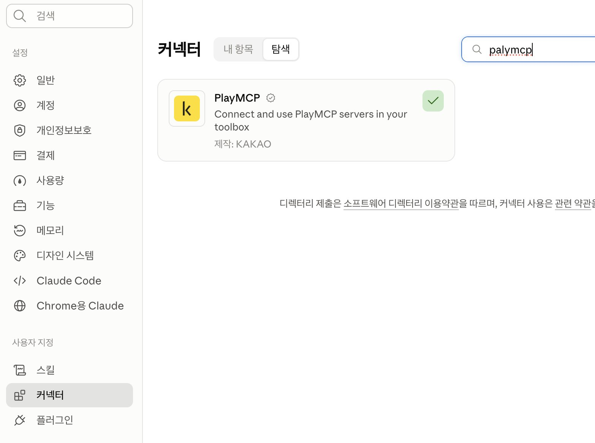

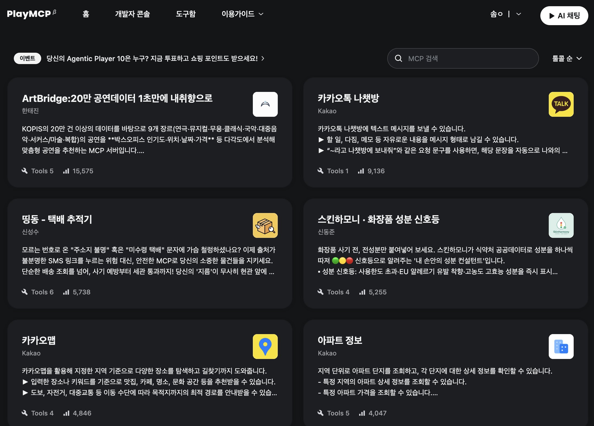

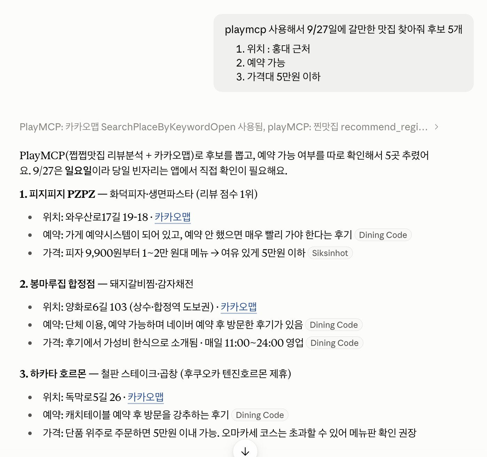

---


</details>


<details>
<summary><strong>개인용 AI에이전트가 퍼지면 퍼질수록</strong></summary>


1. 은행 예적금
→ 사용자가 무조건 이자 많이 주는 곳으로 이동
2. 카드사
→ 본인 소비패턴 분석해서 가장 혜택 좋은 카드로 이동
3. 보험사
→ 본인 나이/가족력/건강상태 체크해서 가장 저렴하고 보장 좋은 보험으로 이동할 가능성
→ 여기에 유전자 검사나 건강검진 결과 같은 구체적인 데이터까지 합쳐지면?
4. 예매/예약 같은 서비스
→ 광클 같은 거 필요 없이 누구의 AI에이전트가 더 빠르게 예매할 것이냐로 경쟁 승부가 갈릴 것
→ 암표상들 망할지도?
5. AI에이전트 시대에도 진짜 유효할 데이터는?
→ 사람의 데이터. 숫자로 표현할 수 없는 것들. 정량화하기 어려운 진짜 경험들.
→ 사람의 경험, 사람의 직관, 사람의 주관적 무언가가 굉장히 소중해질 것.
→ 이걸 가진 곳은 어딜까? 가질 곳은 어딜까?

한국에 들어오면 난리나겠다.

---


</details>


<details>
<summary><strong>𝗠𝗖𝗣 𝘃𝘴 𝗔𝗣𝗜.</strong></summary>


𝗔𝗣𝗜는 소프트웨어 시스템이 특정 엔드포인트, 요청, 응답을 통해 어떻게 통신하는지를 정의합니다. 이는 애플리케이션에 다른 시스템의 데이터에 접근하거나 기능을 트리거하는 구조화된 방법을 제공합니다.

𝗠𝗖𝗣는 AI 애플리케이션에 외부 도구, 데이터, 리소스를 발견하고 사용하는 표준화된 방법을 제공합니다. 모든 AI 클라이언트에 대한 맞춤형 통합을 구축하는 대신, MCP 서버는 공통 프로토콜을 통해 기능을 노출합니다.

API는 소프트웨어에 기능을 노출합니다. MCP는 AI 애플리케이션이 해당 기능을 발견하고 상호작용하는 방식을 표준화합니다.

하지만 AI가 API 뒤에 자리 잡게 되면, 요청-응답 모델이 더 어려워집니다.

추론 과정은 요청이 열린 상태를 유지할 수 있는 시간보다 오래 걸릴 수 있습니다. 중간에 실패할 수도 있습니다. 재시도가 필요할 수도 있습니다.

이는 API 자체의 설계 방식을 바꿔야 합니다.

Oracle의 가이드는 비동기 작업, 워커, 지속 가능한 상태, 예측 가능한 API 계약을 통해 이를 위해 어떻게 설계할지 분해합니다.

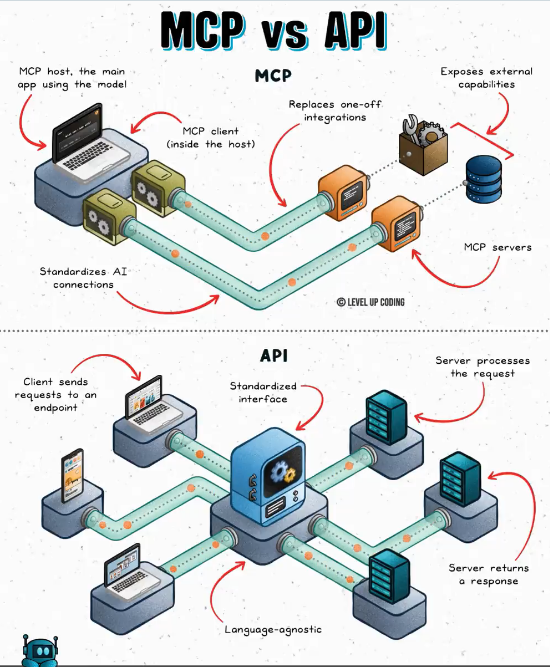
</details>

