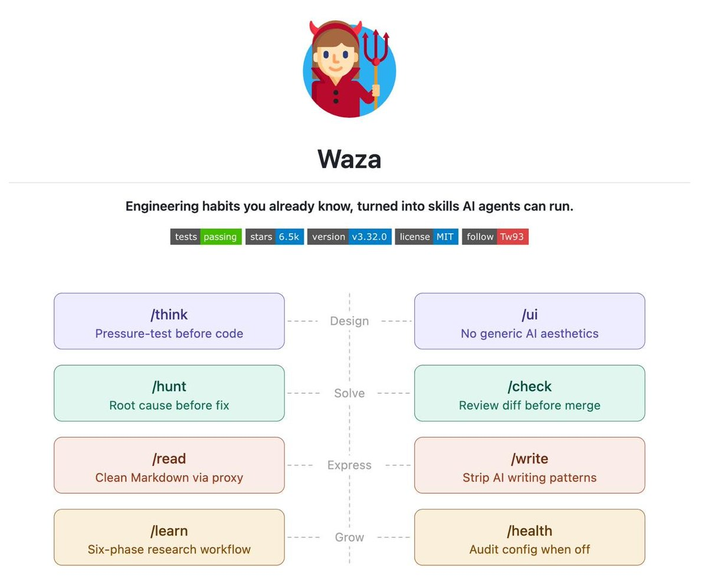
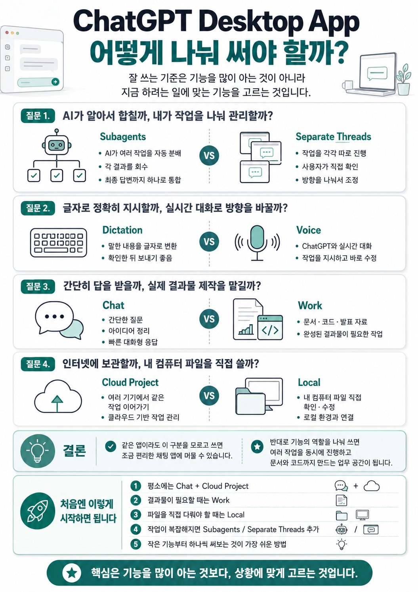
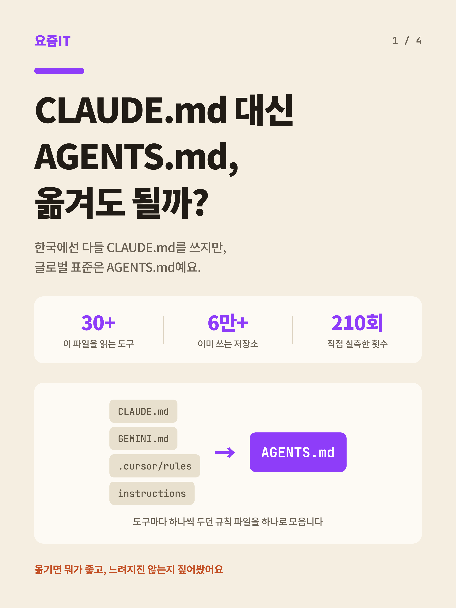
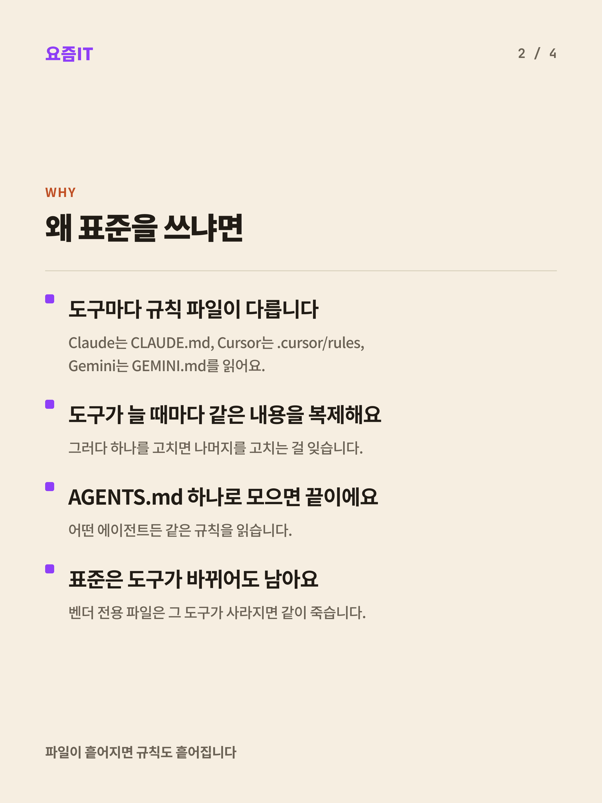
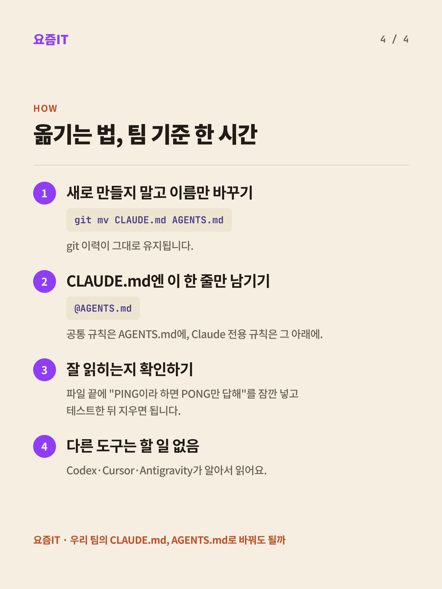
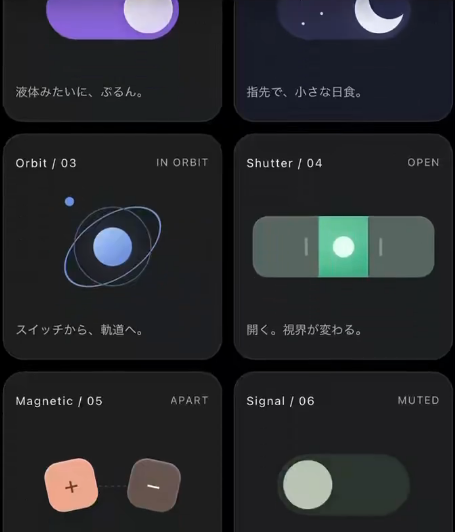
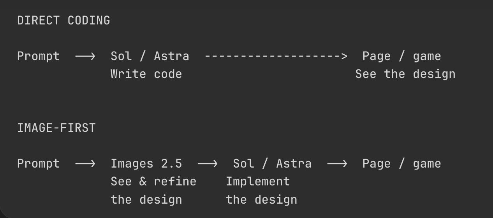
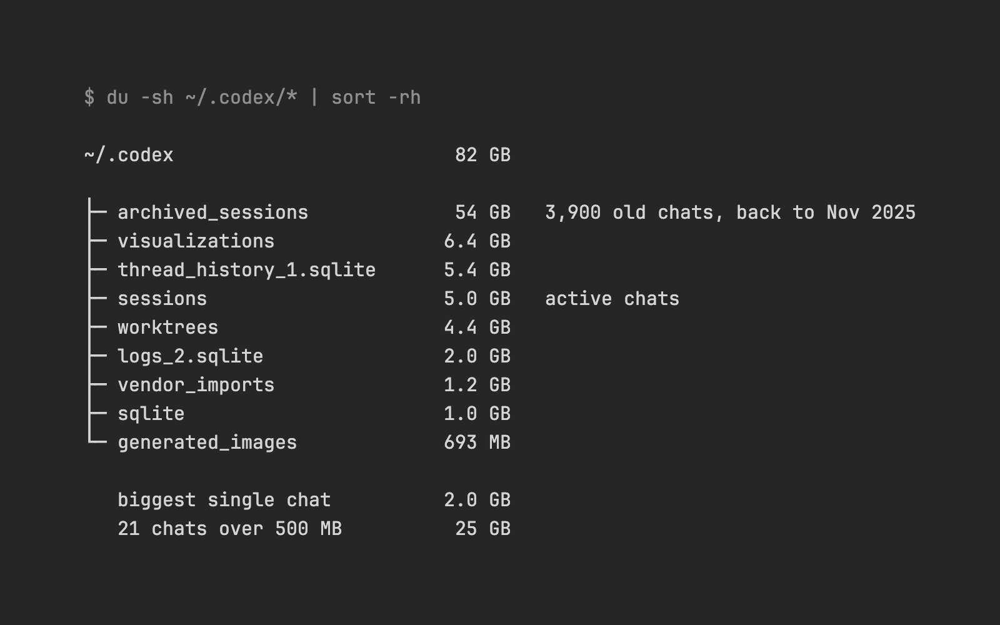
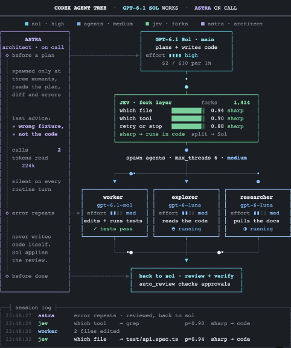

# Codex

속성: AI


<details>
<summary><strong>프로젝트 디렉토리 구성</strong></summary>


```markdown
프로젝트명/
├── .codex/
│   └── skills/
│       └── sol-worker-astra-advisor/
│           └── SKILL.md
│
├── .project/
│   └── plan.md
│
├── docs/
│   ├── instructions/
│   │   └── phaseN-*.md
│   └── results/
│       └── phaseN-*.md
│
├── AGENTS.md
├── DESIGN.md
└── README.md
```

### 책임 분리

```markdown
AGENTS.md
= 항상 적용되는 저장소 경계

DESIGN.md
= UI 변경 시에만 읽는 화면 기준

.project/plan.md
= 실제 기능·Phase 범위

SKILL.md
= Sol이 막혔을 때 Astra 자문 전환

README.md
= 사용자용 프로젝트 설명
```


</details>

---


<details>
<summary><strong>AGENTS.md</strong></summary>


```json
# Global Agent Instructions

> 모든 세션과 오케스트레이터가 준수하는 공통 실행 및 위임 원칙이다.

## 1. Autonomous Execution & Scope

- 사용자의 요청은 작업 지시로 간주하고 실제로 수행한다.
- 가설적인 위험이나 사소한 확인을 이유로 불필요한 승인 절차를 끼워 넣지 않는다.
- 허가된 작업 범위 내에서는 중간 질문을 남기지 말고 완료 조건까지 끝까지 진행한다.

### 자율 진행 범위
- 로컬 파일 수정 및 가역적인 코드 변경
- 로컬 테스트, 빌드, 린트 실행 및 오류 복구
- 변경으로 인해 발생한 실패의 수정 및 재검증
- 공개 문서 조회, 읽기 전용 진단 및 비보안 환경 변수 확인

### 승인 필수 (정지 지점)
- 프로덕션 배포, 퍼블리싱
- 외부 서비스의 쓰기·전송 작업 (상태 변경 API 호출 등)
- 운영 데이터베이스/스토리지의 변경 또는 삭제
- 신규 의존성 추가 및 패키지 lock 파일 갱신
- 파괴적 Git 작업 (`push --force`, 커밋 히스토리 재작성)
- 시크릿 값 또는 시크릿 파일 열람, 외부 전송

## 2. Context & Verification Policy

- 대상 파일과 변경 지점이 확인되면 추가 탐색 없이 수정을 진행한다.
- 변경 규모와 영향 범위에 맞는 직접 검증을 수행한다.
- 파일 전체 내용을 프롬프트에 나열하지 않고 변경 인터페이스와 대상 구간만 집중해 처리한다.

## 3. Subagent Delegation

- 서브에이전트는 작업이 독립적으로 분리되고 컨텍스트 절감 이득이 명확할 때만 사용한다.
- 서브에이전트를 호출할 때는 브리핑 프롬프트에 **결과(Goal), 제약(Constraints), 검증(Verification), 정지 지점(Halt)** 4요소를 반드시 명시한다.
- 서브에이전트에게 보내는 메시지는 가독성 있게 작성하며, 전체 대화 로그를 그대로 복사해 넘기지 않는다.

## 4. Completion & Reporting

- 요청한 동작 확인 및 검증이 모두 끝난 뒤 간결하게 보고한다.
- **수행 요약**: 변경 파일 및 핵심 내용
- **검증 결과**: 실행한 명령 및 동작 확인 결과
- **잔여 리스크 / 제약**: 미검증 항목 또는 환경 제약이 있는 경우만 명시
```

````
# Project AGENTS.md

## 0. 테스트 및 구현 원칙

- 코드를 작성한 후에 절대 단위 테스트를 작성하지 마십시오.
- 유일한 테스트 메커니즘으로 E2E 테스트를 강력히 선호하십시오. 복잡한 기능이 작동하는지 확인하기 위해 이를 사용하십시오. E2E 테스트 끝에 검증 가능하고 반복 가능한 아티팩트를 생성하십시오.
- 시스템을 격리된 상태에서 테스트해야 한다면, 먼저 그것이 실패할 수 있는 모든 방법을 작성한 후에 코드를 작성하십시오.

테스트 주도 개발로 구현할 때 에이전트 지침:

- 중복 테스트는 해롭다고 여겨집니다.
- 변경 감지 테스트는 해롭다고 여겨집니다.
- 진정한 동작 테스트의 격차 없이 버그 수정에 대한 회귀 테스트를 생성하지 마세요.

### 구현 품질 원칙

- 코드 작성 후 리뷰에서 쉽게 발견할 수 있는 문제를 의도적으로 남긴 초안 구현 금지
- 구현 전에 요구사항, 실패 경로, 경계 조건, 동시성 조건, 데이터 정합성 조건 확인
- 현재 Phase의 완료 기준을 충족하는 형태로 처음부터 구현
- 코드 리뷰는 이미 명시된 요구사항을 뒤늦게 보완하는 단계가 아니라 요구사항 준수, 통합 동작, 2차·3차 효과, 운영상 위험을 검증하는 단계로 사용
- 리뷰에서 발견된 문제가 구현 전에 확인 가능했던 항목이면 동일 유형이 반복되지 않도록 작업 기준에 반영
- 테스트 수나 커버리지 수치 자체를 품질 지표로 사용하지 않음
- 내부 구현 세부사항을 고정하는 테스트보다 사용자 관점의 실제 시스템 동작 검증 우선

---

## 1. 우선순위

작업 지시는 아래 순서를 따른다.

```text
사용자의 현재 명시적 지시
↓
AGENTS.md
↓
.project/plan.md
↓
DESIGN.md
↓
README.md
```

사용자가 기획 변경을 명시하지 않은 상태에서 `.project/plan.md` 범위를 벗어나지 않는다.

---

## 2. Phase 규칙

- 한 번에 현재 Phase 범위만 구현
- 이후 Phase 기능 선반영 금지
- 이후 Phase 기술 선택 선반영 금지
- 이후 Phase 운영 정책 선반영 금지
- 구현 전에 현재 Phase 완료 기준 확인
- Phase 완료 후 실제 구현·검증 결과를 `docs/results/`에 기록
- 계획과 실제 구현이 다르면 결과 문서에서 차이를 명시
- 계획 변경이 필요하면 코드보다 `.project/plan.md` 수정이 먼저
- MVP 작업 시 "한 번에 현재 Phase 범위만 구현" 규칙 제외

---

## 3. E2E 검증 규칙

HourBoard의 E2E 검증은 최소한 아래 불변식을 확인한다.

```text
winner count = 1
positions = 1..N
duplicate position = 0
missing position = 0
winner message mutation = 0
```

- 실제 애플리케이션과 실제 PostgreSQL을 연결한 상태에서 검증
- mock만으로 완료 판정 금지
- 동시 요청 검증은 실제 병렬 요청으로 수행
- E2E 종료 후 사람이 다시 확인할 수 있는 결과 아티팩트 생성
- 결과 아티팩트에는 최소 요청 수, 성공·실패 수, 순위 범위, 중복 순위 수, 누락 순위 수, 승자 수 포함
- 검증하지 않은 동작을 성공으로 기록하지 않음

---

## 4. 동시성 규칙

- 순위 결정 로직을 애플리케이션 메모리 카운터로 구현 금지
- `SELECT → 조건 확인 → INSERT/UPDATE` 분리 패턴 금지
- 동일 슬롯의 승자 결정과 순위 증가는 PostgreSQL atomic UPSERT로 처리
- 등록 API의 DB query는 원칙적으로 1회 유지
- 순위 의미를 브라우저 클릭 시각 순서로 표현 금지
- 순위는 서버·DB 처리 기준임을 문서와 UI에서 유지
- 동시성 문제를 숨기기 위한 전역 애플리케이션 mutex 도입 금지

---

## 5. 성능 규칙

- 요청마다 DB connection 생성 금지
- connection pool 재사용
- 등록 critical path에서 외부 API 호출 금지
- 등록 critical path에서 추가 영속화 작업 금지
- 측정 없이 Redis, cache, queue 도입 금지
- 성능 개선 전 baseline 측정
- 성능 변경 전후 p50 / p95 / p99 비교
- 정확성 손실을 latency 개선으로 인정하지 않음

---

## 6. 의존성 규칙

- 사용자 승인 없는 패키지 설치 금지
- 사용자 승인 없는 lock file 생성·갱신 금지
- prerelease dependency 사용 금지
- 현재 Phase에 필요하지 않은 dependency 추가 금지
- Node.js 안정 LTS 사용
- 라이브러리 선택 전 현재 공식 문서와 지원 버전 확인

---

## 7. 환경 변수

설정값은 가능한 한 환경 변수로 관리한다.

예정 변수:

```text
NODE_ENV
PORT
DATABASE_URL
MAX_MESSAGE_LENGTH
```

- 비밀값 코드 하드코딩 금지
- `.env` 커밋 금지
- 필요한 변수는 `.env.example`을 구현하는 Phase에서 명시
- 기본값이 안전하지 않으면 암묵적 fallback 금지

---

## 8. 코드 작성 규칙

- TypeScript 사용
- 불필요한 추상화 금지
- 현재 요구사항에 없는 generic framework 작성 금지
- SQL 동작이 핵심인 부분을 ORM 내부 동작에 숨기지 않음
- 동시성 SQL은 코드에서 식별 가능한 형태로 유지
- 오류를 삼키지 않음
- production 응답에 stack trace 노출 금지
- 사용자 입력을 HTML로 렌더링 금지

### 주석

주석은 짧고 직접적인 명사형 표현을 사용한다.

허용 형태:

```text
필수 환경 변수 값 조회
현재 시간 슬롯 계산
등록 결과 순위 변환
PostgreSQL 연결 풀 생성
```

문장형 종결어미 주석은 사용하지 않는다.

---

## 9. 문서 규칙

문서 역할을 섞지 않는다.

| 파일 | 역할 |
| --- | --- |
| `.project/plan.md` | 프로젝트 범위·기획·Phase·완료 기준 |
| `AGENTS.md` | 저장소 전체 작업 규칙 |
| `DESIGN.md` | 화면·상태·접근성·디자인 기준 |
| `docs/instructions/*` | 현재 Phase 구현 지침 |
| `docs/results/*` | 완료된 구현·검증 결과 |
| `README.md` | 사람을 위한 공개 프로젝트 설명 |

- 구현되지 않은 기능을 README에서 완료된 기능처럼 표현 금지
- 실제 측정하지 않은 latency·TPS 수치 작성 금지
- 완료하지 않은 Phase 결과 문서 작성 금지
- 같은 규칙을 여러 문서에 불필요하게 복제하지 않음
- `docs/results/*`에 작성할 내용 말고 다른 문서는 수정하지 않음

---

## 10. Git 규칙

- 사용자 명시적 요청 없는 push 금지
- Phase 완료 전 임의 commit 금지
- Phase 완료 및 검증 후 commit
- commit 형식은 `feat: phaseN-*` 사용
- unrelated 변경을 같은 commit에 포함 금지
- 비밀값, `.env`, 인증키 commit 금지

---

## 11. 완료 보고

Phase 완료 보고에는 아래 정보만 사실 기준으로 기록한다.

- 구현 범위
- 변경 파일
- 실행한 E2E 검증
- 검증 결과
- 생성된 결과 아티팩트
- 확인된 제한사항
- commit hash
- push 수행 여부

수행하지 않은 작업은 완료로 표현하지 않는다.

---

## 12. 토큰 사용량 중단 규칙

- 작업 중 **5시간 사용 한도가 10% 이하로 남거나, 주간 사용 한도가 2% 이하로 남은 경우 즉시 작업을 중단하십시오.**
- 한도에 도달한 이후에는 새로운 구현, 수정, 테스트, 리팩터링, 문서 갱신, 커밋을 진행하지 마십시오.
- 중단 직전까지 완료된 작업 상태를 확인하고, 현재 작업 트리와 검증 결과를 기준으로 어디까지 완료되었는지 기록하십시오.
- 이후 작업자가 바로 이어서 진행할 수 있도록 **남은 작업과 진행 순서를 구체적으로 작성하십시오.**
- 이어서 할 작업에는 최소한 다음 내용을 포함하십시오.
  - 완료된 작업
  - 현재 진행 중이던 작업
  - 아직 완료되지 않은 작업
  - 다음에 수정하거나 생성해야 할 파일
  - 실행해야 할 테스트 및 검증
  - 남아 있는 오류 또는 확인이 필요한 사항
  - 다음 작업 시작 지점
- 토큰 부족 상태에서 작업을 억지로 마무리하거나 범위를 축소해 완료 처리하지 마십시오.
- 완료 기준을 충족하지 못한 Phase는 완료로 기록하거나 커밋하지 마십시오.

````


</details>

---


<details>
<summary><strong>config.toml</strong></summary>


```json
# 사용할 Codex 모델
# model = "gpt-5.6-terra"
model = "gpt-6-astra"

# 모델 추론 강도
# high: 복잡한 코드 분석, 보안 검토, 버그 추적에 유리
model_reasoning_effort = "medium"

# 응답 성향
# pragmatic: 실용적이고 작업 중심적인 응답 스타일
personality = "pragmatic"

# 승인 정책
# on-request:
# - 일반적으로는 샌드박스 안에서 작업
# - 권한 상승, 위험한 명령, 샌드박스 밖 작업이 필요하면 사용자 승인 요청
approval_policy = "on-request"

# 샌드박스 모드
# workspace-write:
# - 현재 워크스페이스 내부 파일 읽기/쓰기 허용
# - 워크스페이스 밖 파일 접근은 제한
sandbox_mode = "workspace-write"
approvals_reviewer = "auto_review"

# 기능 플래그 (Context Note 활성화)
[features.context_management]
experimental_mode = true

# workspace-write 샌드박스 세부 설정
[sandbox_workspace_write]

# 네트워크 접근 차단
# false:
# - 패키지 설치, 외부 API 호출, 인터넷 요청 차단
# - 의도하지 않은 외부 통신이나 의존성 다운로드 방지
network_access = false

# Windows 환경 설정
[windows]

# 권장 Windows 네이티브 샌드박스
# 관리자 승인 기반 초기 설정이 불가능한 경우에만 unelevated 사용
sandbox = "elevated"

# 프로젝트별 신뢰 설정
# trusted:
# - 해당 워크스페이스를 신뢰된 프로젝트로 취급
# - 프로젝트별 설정과 AGENTS.md 규칙을 적용하기에 적합
[projects.'c:\users\user']
trust_level = "trusted"

[projects.'d:\01_programming\04_typescript\pixel-jukebox']
trust_level = "trusted"

[mcp_servers.context7]
command = "npx"
args = ["-y", "@upstash/context7-mcp"]

[tui.model_availability_nux]
gpt-6-astra = 4

```


</details>

---


<details>
<summary><strong>SKILL.md</strong></summary>


```markdown
---
name: sol-worker-astra-advisor
description: Sol의 구현 중 병목 해결을 위해 Astra에게 아키텍처 및 원인 분석 자문을 구합니다. Sol 수준에서 실패가 재현되었거나 고난도 트레이드오프 검토가 필요할 때 사용하세요.
---

# Sol Worker / Astra Advisor

## 완료 조건
- Sol이 자체 해결하지 못한 핵심 병목과 재현 결과가 정리되어 있다.
- Astra로부터 다음 항목이 포함된 읽기 전용 자문 보고를 수신한다.
  - **분석 결과 (Finding)**
  - **판단 근거 (Evidence)**
  - **권장 해결 방향 (Recommended Direction)**
  - **잔여 리스크 (Risks / Unresolved Points)**
- 수신한 자문을 바탕으로 Sol이 최종 구현 및 검증을 완료한다.
- 모델 지정 불가 또는 `fork_turns: "none"` 미지원 환경인 경우, 임의 실행 없이 해당 제약을 즉시 명시한다.

## 기본 절차
아래 순서를 기본으로 따르되, 상황에 맞춰 유연하게 적용하세요.
1. **Sol 선행 검토**: Sol 환경(`Medium` 추론)에서 문제를 재현하고, 병목을 입증할 최소한의 로그와 인터페이스를 수집합니다.
2. **Astra 자문 호출**: Astra 세션에 전체 히스토리가 아닌 핵심 질문, 재현 결과, 시도한 내역, 프로젝트 제약만 추려 전달합니다.
3. **구현 복귀**: Astra의 검토 결과를 토대로 실제 코드 수정과 검증은 다시 Sol 워커에서 수행합니다.

## 손대지 말 것
- Astra 세션에 파일 수정, 커밋 생성, 의존성 변경, 서브에이전트 스폰 권한을 부여하지 마세요. (Astra는 순수 Read-only 자문으로만 제한)
- 거대 파일 전체나 전체 세션 로그를 Astra 프롬프트로 복사하지 마세요.
```

---


</details>

---


<details>
<summary><strong>나는 Anthropic의 새로운 취약점 발견 하네스를 포크해서 Codex 우선으로 만들었다</strong></summary>


Recon → Find → Verify → Triage → Report → Patch

샌드박스된 에이전트들이 버그를 찾아내고, 충돌하는 PoC로 증명하며, 중복 제거하고, 활용 가능성 보고서를 작성하며, 패치 유효성을 검증한다.

보안 코드 리뷰 맡기면 영혼 없는 할루시네이션만 뱉어서 답답했을 것임.

단순히 텍스트로 코드만 훑는 게 아니라 샌드박스 환경에서 직접 크래시를 유발해 검증하는 제어 방식이 핵심임.

Anthropic 하네스를 포크해서 정찰, 중복 제거, 악용 보고서 작성, 패치 검증까지 에이전트가 알아서 수행하는 구조를 구축함.

실제 작동하는 보안 에이전트 시스템을 내 프로젝트에 적용하고 싶을 때 참고하기 딱 좋음.

[https://github.com/zeroxjf/defending-code-reference-harness-codex](https://github.com/zeroxjf/defending-code-reference-harness-codex)

---


</details>

---


<details>
<summary><strong>GPT-5.6 시대에 Skill 수집만 하던 사람들은 이제 정리할 때가 됐음.</strong></summary>


Codex나 Claude Code에 기능 겹치는 Skill 수백 개씩 넣지 마세요.

`Waza`는 딱 8개만 남김.

개발에서 제일 자주 터지는 순간마다 하나씩 대응하는 방식.

1️⃣ /think — 코딩 전에 설계부터 제대로 검증

2️⃣ /hunt — 코드부터 고치지 말고 버그 원인부터 찾기

3️⃣ /check — 머지 전에 Diff를 스스로 리뷰

4️⃣ /write — 한·영 문구를 덜 AI스럽고 자연스럽게 다듬기

핵심은 AI에게 “더 많은 기능”을 얹는 게 아님.

생각해야 할 때 생각하고,

파야 할 때 파고,

검증해야 할 때 대충 넘기지 못하게 만드는 것.

한 줄 설치로 Claude Code, Codex, Cursor 모두 사용 가능.

🔗Github: [https://github.com/tw93/Waza](https://github.com/tw93/Waza)



---


</details>

---


<details>
<summary><strong>ChatGPT Desktop App, 어떻게 나눠 써야 할까?</strong></summary>


최근 ChatGPT 데스크톱 앱은  
단순히 질문하고 답을 받는 앱에서 벗어나고 있습니다.  
여러 작업을 동시에 시키고,  
문서나 코드를 만들고,  
내 컴퓨터의 파일까지 다룰 수 있는  
작업 도구에 가까워졌습니다.

다만 기능 이름이 비슷해서  
처음 보면 무엇을 선택해야 할지 헷갈릴 수 있습니다.  
딱 네 가지만 구분하면 됩니다.  
일을 AI가 나눌까, 내가 나눌까?  
Subagents는 AI가 알아서 일을 나눠 처리하는 방식입니다.

예를 들어,  
“이 회사의 시장 상황, 경쟁사, 위험 요소를 조사해줘”

라고 요청하면 AI가 작업을 여러 개로 나눕니다.

각각의 조사 결과를 다시 모아  
하나의 최종 답변으로 정리해줍니다.

회사에서 팀장이 직원들에게 일을 나눠준 뒤  
최종 보고서를 받는 방식과 비슷합니다.

반면 Separate Threads는  
사용자가 대화방을 여러 개 직접 만드는 방식입니다.

한 대화방에서는 시장 조사를 하고,  
다른 대화방에서는 경쟁사를 분석하고,  
또 다른 대화방에서는 사업 아이디어를 검토할 수 있습니다.

각 작업을 따로 확인하고  
중간에 방향을 바꾸기도 편합니다.

정리하면 이렇습니다.  
결과를 마지막에 하나로 합치고 싶다면  
Subagents가 편합니다.

여러 방향을 따로 실험하고 비교하고 싶다면  
Separate Threads가 편합니다.  
말해서 입력할까, 대화하면서 지시할까?

Dictation은 음성 입력입니다.  
내가 말한 내용을  
ChatGPT가 글자로 바꿔줍니다.

전송하기 전에 내용을 읽어보고  
잘못 인식된 부분을 수정할 수 있습니다.  
긴 요청이나 정확한 지시를 전달할 때 적합합니다.  
예를 들어,

“이 문서를 세 문단으로 요약하고  
중요한 숫자는 표로 정리해줘”  
같은 요청을 말로 입력한 뒤  
확인해서 보내는 방식입니다.

Voice는 ChatGPT와 실시간으로 대화하는 기능입니다.

사람과 전화하듯 대화하면서  
작업 방향을 바꾸거나 추가 지시를 할 수 있습니다.  
“그 부분은 빼줘.”

“두 번째 방식으로 다시 해줘.”  
“지금 어디까지 진행됐어?”

처럼 중간에 계속 이야기할 수 있습니다.

정확한 요청을 한 번에 전달할 때는 Dictation,  
대화하면서 생각을 발전시킬 때는 Voice가 편합니다.

간단히 물을까, 결과물을 맡길까?  
Chat은 일반적인 질문과 대화에 사용합니다.

검색하거나, 궁금한 내용을 물어보거나,  
아이디어를 간단히 정리할 때 적합합니다.  
예를 들면 다음과 같습니다.

“ISA가 무엇인지 쉽게 설명해줘.”

“여행 준비물 목록을 만들어줘.”

“이 문장을 자연스럽게 고쳐줘.”  
Work는 여러 단계를 거쳐  
실제 결과물을 만들어야 할 때 사용합니다.

문서를 만들거나,  
스프레드시트를 분석하거나,  
발표 자료와 코드를 제작하는 작업에 적합합니다.  
Work에서는 클라우드 컴퓨터를 활용해  
저장소를 내려받고 코드를 수정한 뒤  
PR을 만드는 작업도 할 수 있습니다.

웹사이트를 만들고 배포하는 작업까지  
맡길 수도 있습니다.

다만 Work는 별도의 사용량이나  
크레딧이 적용될 수 있습니다.  
간단한 질문까지 Work로 처리하기보다는  
실제 파일이나 결과물을 맡길 때 선택하는 편이 좋습니다.

✏️결론은 네 가지만 기억하면 됩니다.

1. 자동 분배 vs 직접 관리
    
    AI가 일을 나누고 결과까지 합치게 하려면
    Subagents를 사용합니다.
    작업별로 따로 확인하고 관리하려면
    Separate Threads를 사용합니다.
    
2. 음성 입력 vs 실시간 대화
    
    말한 내용을 글자로 바꿔 확인하려면
    Dictation을 사용합니다.
    대화하면서 작업을 지시하고 수정하려면
    Voice를 사용합니다.
    
3. 질문 vs 결과물 제작
    
    간단한 질문과 아이디어 정리는
    Chat이 적합합니다.
    문서, 코드, 발표 자료를 만들 때는
    Work를 선택합니다.
    클라우드 vs 내 컴퓨터
    
4. 여러 기기에서 이어서 작업하려면
    
    Cloud Project를 사용합니다.
    내 컴퓨터의 파일을 직접 다룰 때는
    Local을 연결합니다.
    결국 중요한 것은 기능을 많이 쓰는 게 아니라
    작업에 맞는 기능을 고르는 것입니다.
    



---


</details>

---


<details>
<summary><strong>오픈AI가 무료 ChatGPT에 무제한 텍스트 채팅을 풀어요</strong></summary>


다른 곳들이 가격을 올리거나 무료 한도를 줄이는 사이 오픈AI는 반대로 가고 있습니다

■ 무료·Go 사용자
- 기본 모델이 GPT-5.6 Luna로 바뀜 (이번 주부터)
- 텍스트 채팅 무제한 + 어려운 질문엔 Think 버튼 (다음 주부터 순차)
- 단, 이미지·파일 등 일부 기능은 기존 한도 그대로

■ Plus·Pro 사용자
- 채팅용으로 다듬은 Sol + 추론 강도 조절 슬라이더 (오늘부터)
- 즉시 응답과 추론을 한 모델로 통합, 군더더기 없이 더 직진형 답변

■ 참고 사항
- 오류가 GPT-5.5 대비 Luna 62%·Sol 68% 줄었다고 함 (오픈AI 자체 평가)
- 일주일 전 API에서 Luna 가격을 80% 내린 데 이어 무료까지 개방
- 딥시크가 가격을 올리고 일부 경쟁사가 무료 한도를 줄이는 흐름과 정반대

한 가지, 이번 개선은 채팅용이라 Codex에는 적용 안 된다고 합니다!!

---


</details>

---


<details>
<summary><strong>CLAUDE.md 대신 AGENTS.md로, 옮겨도 될까?</strong></summary>


한국에선 보통 다들 CLAUDE.md를 쓰죠  
근데 글로벌 표준은 따로 있어요, AGENTS.md예요  
옮기면 뭐가 좋은지, 느려지거나 비싸지진 않는지 짚어볼게요 (AGENTS.md는 벌써 30개 넘는 도구가 지원하고, 6만 개 넘는 저장소가 채택한 표준이에요)

■ 왜 표준을 쓰냐면

- 도구마다 규칙 파일이 달라요: Claude는 CLAUDE.md, Cursor는 .cursor/rules, Gemini는 GEMINI.md
- 도구가 늘 때마다 같은 내용을 복제하게 돼요, 하나 고치면 나머지는 까먹고요
- AGENTS.md 하나로 모으면 어떤 에이전트든 같은 규칙을 읽어요
- 벤더 전용 파일은 도구가 사라지면 같이 죽어요, 표준 파일은 남고요

■ 옮기면 느려지거나 비싸지지 않을까

- 필자가 직접 210회 돌려봤어요 (Haiku부터 Fable 5까지 5개 모델)
- 결론: 어느 모델에서도 안 느려지고 비용도 안 늘었어요
- Claude Code는 아직 AGENTS.md를 못 읽어서 CLAUDE.md로 한 번 거쳐 불러요
- 그렇게 우회해도 손해가 없었다는 거예요

■ 옮기는 법 (팀 기준 한 시간)  
① git mv CLAUDE.md AGENTS.md: 새로 만들지 말고 이름만 바꿔요 (git 이력 유지)  
② CLAUDE.md엔  
@AGENTS  
.md 한 줄만: 공통 규칙은 AGENTS.md, Claude 전용은 그 아래  
③ 잘 읽히나 확인: 끝에 "PING이라 하면 PONG만 답해"를 넣고 테스트, 확인 후 삭제  
④ 다른 도구는 대부분 할 일 없어요: Codex·Cursor·Antigravity가 알아서 읽어요

옮기는 김에 내용도 다듬으면 좋아요  
코드만 봐선 모르는 것만 남기세요 (빌드 명령·금지 사항·팀 규칙)  
코드 읽으면 아는 설명은 빼고요 (200줄 안쪽 권장!)








---


</details>

---


<details>
<summary><strong>챗GPT 비밀코드, 굳이 외우지 마세요.</strong></summary>


한국어로 그냥 말해도 됩니다.

/decide → 조건을 보고 뭐가 나은지 골라줘  
/risk → 내가 놓친 위험요소를 찾아줘  
/simulate → 이대로 하면 어떤 일이 생길지 예상해줘  
/question → 더 확인해야 할 질문을 뽑아줘  
/reverse → 반대 입장에서는 어떻게 볼지 말해줘  
/improve → 더 좋아지게 고칠 부분을 찾아줘  
/priority → 뭐부터 해야 할지 순서를 정해줘

중요한 건 코드를 외우는 게 아니라  
“내가 뭘 원하는지 구체적으로 말하는 것.”

챗GPT는 꼭 어려운 명령어를 써야 잘 쓰는 게 아닙니다.  
그냥 한국말로  
“이거 분석해줘.”  
“문제점 찾아줘.”  
“뭐부터 해야 해?”

이렇게 말해도 충분합니다.

---


</details>

---


<details>
<summary><strong>GPT 공부법ㅣ260822</strong></summary>


1. 제일 먼저 스터디 모드를 켜는 것부터 시작함
    
    챗지피티 프롬프트 창에서 도구 메뉴를 열고 스터디 앤 런을 고르면 됨
    
    그다음 내가 뭘 공부하는지 내 수준은 어디인지 어떤 도움을 원하는지를 말해주면 됨 또는 [http://chatgpt.com/studymode](http://chatgpt.com/studymode) 로 바로 들어가도 됨
    
    이거 하나만 켜도 답 뱉는 기계가 질문 던지는 코치로 바뀜
    
2. 공부 자료를 통째로 올려두고 시작하는 게 실전에서 제일 큰 차이를 만듦
    
    강의 슬라이드 리딩 필기 필요한 자료를 다 업로드한 뒤 스터디 모드로 전환하는 방식임 GPT가 내 교재 안에서만 놀게 되니까 엉뚱한 일반론이 확 줄어듦 자료 없이 물으면 인터넷 평균값이 나오고 자료를 깔면 내 시험 범위가 나옴
    
3. 첫 프롬프트에 맥락을 최대한 구체적으로 박아넣는 게 핵심임
    
    예를 들어 나는 기초 화학을 공부 중임 간단한 반응식 균형은 아는데 산화환원이 들어가면 막힘 한 단계씩 질문해주고 내가 논리를 설명하기 전엔 최종 답을 주지 말라는 식으로 조건을 거는 것임
    
    수준 아는 것 막히는 지점 마감일을 한 번에 던지면 눈높이가 즉시 맞춰짐 막연히 알려달라 하면 시간만 날아감
    
4. 연습문제를 올린 뒤 새 문제를 뽑아 스스로 풀고 오답을 해부하는 루프가 가장 강력함 연습시험을 올리고 그 개념들로 새 문제 다섯 개를 만들어달라 한 다음 내가 다 풀고 나서 각 문제의 정답 풀이를 단계별로 짚어주고 내 논리가 어디서 틀어졌는지 설명해달라 하는 방식임
    
    정답 확인이 아니라 내가 어떻게 틀렸는지를 보는 게 진짜 학습임 이걸 반복하면 패턴 인식이 아니라 실제 풀이 근육이 붙음
    
5. 틀린 것만 모아 약점 소주제를 뽑고 거기에 맞춘 미니 레슨을 받는 게 시간 대비 효율이 최고임 내가 놓친 문제들을 근거로 지금 복습해야 할 핵심 소주제 세 개를 뽑아달라 하면 그 빈틈에 맞춘 짧은 강의를 만들어줌
    
    잘하는 단원 다시 보는 건 마음만 편하고 점수는 안 움직임 못하는 세 개만 파는 게 벼락치기보다 훨씬 남음
    
6. 시나리오 문제를 하나씩 던지게 하고 선택지마다 왜 맞고 틀린지 캐묻는 드릴이 실전 감각을 만듦
    
    이 주제를 가르치되 시나리오 문제를 하나 주고 내 답을 기다린 뒤 각 선택지가 왜 맞고 틀린지 설명해달라는 프롬프트를 씀 한 번에 한 문제씩 내가 먼저 답하고 그다음 해설을 받는 리듬이 중요함 실제 시험 문제는 함정형이라 이 방식이 잘 먹힘
    
7. 복습 스케줄은 간격 반복 날짜를 아예 숫자로 짜달라 하는 게 실전임 1 3 7 14 30일 리뷰를 자동으로 잡아주고 인출 방식을 섞어가며 진행 상황을 추적하게 설계할 수 있음
    
    오늘 배운 걸 이틀 뒤 다시 일주일 뒤 다시 되돌아오는 구조로 만들면 기억이 오래 감 원하면 앙키용 CSV 카드로 뽑아달라 해서 플래시카드로 바로 넘길 수도 있음
    
8. 파인만식으로 내가 GPT에게 설명하고 채점받는 걸 한 사이클씩 끼워넣어야 함 개념을 내 말로 쉽게 풀어 설명하면 GPT가 학생 역할로 허점과 빠진 부분을 지적하게 하는 방식임 파인만 봇으로 배운 그룹이 수동적으로 배운 그룹보다 회상 성적이 높았음 설명하다 막히는 지점이 곧 내가 진짜로 모르는 지점임
9. 시기별로 스터디 모드를 켰다 껐다 하는 운용이 고수들의 실전 팁임
    
    개념을 익히는 학습 단계에선 스터디 모드를 켜서 소크라테스식으로 천천히 가고 문제를 대량으로 빠르게 도는 시나리오 드릴 주간엔 스터디 모드를 꺼서 속도와 물량을 확보하는 식임
    
    느리게 이해할 때와 빠르게 반복할 때를 구분해야 함 계속 소크라테스식으로만 가면 진도가 안 나가고 계속 답만 받으면 안 남음
    
10. 마지막은 검증과 과의존 방지임 이걸 안 하면 앞의 아홉 개가 다 무너짐
    
    특히 자격시험처럼 버전이 있는 시험은 공식 시험 요강 파일을 프로젝트에 올리고 요강에 없는 내용은 없다고 명확히 말하라 옛 버전은 참조하지 말라고 지시를 박아둬야 함
    
    안 그러면 옛 버전과 신 버전을 섞은 그럴듯한 오답이 나옴 중요한 사실은 늘 원출처로 다시 확인하는 게 안전함
    

2025년 실험에서 챗봇으로 공부한 쪽이 사십오 일 뒤 시험에서 57.5 퍼센트

전통 방식이 68.5 퍼센트를 맞혔는데 편함에 기대 힘든 사고를 넘겨버리면 기억에 안 남는다는 뜻임

GPT는 나를 굴리는 도구일 뿐 사고는 끝까지 내가 떠안아야 실력이 됨

---


</details>

---


<details>
<summary><strong>Codex 5.6이 터무니없어지고 있어요. 🤯</strong></summary>


잠시 사용해 본 후, 실제로 설치할 가치가 있는 플러그인들은 다음과 같아요:

→ Browser — 웹사이트 자동화 및 테스트  
→ GitHub — 이슈, PR 및 코드 리뷰  
→ Security — 취약점 및 유출된 키 찾기  
→ Build Web Apps — 아이디어 → 작동하는 앱  
→ Figma — 디자인 → 반응형 코드  
→ Sentry — 프로덕션 버그 찾기 및 수정

하지만 Sites가 가장 큰 업그레이드일지도 몰라요. 👀

만들기 → 미리보기 → 공유하기 → 커스텀 도메인 연결.

디자인, 코딩, 테스트, 디버깅 및 배포를 하나의 AI가 처리해요.

Codex는 더 이상 단순히 코드를 작성하는 게 아니에요.

이제 완전한 개발 팀처럼 보이기 시작했어요.

---


</details>

---


<details>
<summary><strong>Codex에 넣어서 효과 본 설정 베스트 5</strong></summary>


5위: [SKILL.md](http://skill.md/) 파일을 놓기  
name과 description 두 가지를 맨 앞에 쓴 파일을 놓기만 하면, Codex가 알아서 찾아준다. 호출할 때는 「/skills」나 「$」로, 공식에서 배포하는 카탈로그의 것도 그대로 사용할 수 있음

4위: 접근 범위를 정하기  
config.toml에 sandbox_mode를 작성하기  
읽기만/작업 폴더만 쓸 수 있음/전부 만질 수 있음의 3단계로, 평소에는 중간의 workspace-write

3위: MCP 설정을 ~/.codex/config.toml에 한 곳에 모으기  
같은 컴퓨터라면 앱이든 CLI든 IDE든 같은 걸 쓸 수 있다고 나와 있음

2위: @로 다른 작업 호출하기  
최근 업데이트로, 실행 중인 다른 태스크를 @로 지정해서 참조할 수 있게 됨

1위: AGENTS.md에 「## Code Review Rules」 추가하기

GitHub의 풀 리퀘스트 댓글란에  @codex review 라고 쓰면, 차분을 읽고 중요한 문제만 피드백으로 돌려줍니다. 그 상태로 @codex fix it 이라고 쓰면, 수정해서 업데이트까지 해줍니다.

보고 싶은 관점은 ## Code Review Rules에 추가로 쓰면 적용되므로, 매번 같은 지적을 손으로 쓰는 사람은 거기로 옮기는 게 좋습니다.

---


</details>

---


<details>
<summary><strong>Codex 한번이라도 꼭 써봐야하는 100가지 이유.</strong></summary>

(8월 26일 기준)

1. 코덱스는 거의 매주 주간 한도를 통째로 리셋해줍니다.  
(티보가 거의 매주 해줌 ㅎㅎ)
2. 코덱스 사용자 100만 명 늘 때마다 한도를 리셋해줍니다.
3. ChatGPT 웹에서 채팅이 무제한입니다. (남용만 아니면) 하지만 클로드는 웹에서 채팅해도 클로드코드 한도가 깎입니다.
4. "완성했습니다" 하고 끝나는 클로드코드.. 코덱스는 내부 browser로 직접 눌러보게 시킬 수 있습니다. (지금 웹브라우저 조작, 컴퓨터 조작, 웹사이트, 앱 전체 테스트 짱 잘함. 이건 클로드보다 과장 보태서 100배 더 잘함.)
5. (누구랑 다르게) 코덱스 Pro $100/$200는 지금 그 5시간 리밋이 없습니다. (Plus는 8월 26일부터 다시 생겼지만... Pro 5x/20x는 앞으로 몇 달간 계속 비활성화한다고 밝혔습니다.)
6. 클로드가 코드 짜고 검사도 자기가 하면, 자기가 짠 거라 그냥 넘어갑니다. 공식 plugin만 깔면 클로드가 짠 걸 코덱스가 뒤에서 다시 봅니다.
7. AI가 내 마우스를 가져가서 손 놓고 보게 되는 그거. Mac에서는 코덱스가 자기 커서로 뒤에서 앱을 만지는 동안, 나는 내 커서로 다른 일을 할 수 있습니다. (Windows는 아직 내 커서 뺏김..)
8. "오른쪽 아래에서 세 번째 버튼 옆에…"라고 설명하다 지치는 그거. 그냥 화면 보내고 "이거 이상함" 하면 됩니다. (앱샷, 내부 브라우저 태그, 코맨트 등)
9. 도구 바꾼다고 세팅부터 다시 짜기 싫어서 안 바꿨던 그거. 코덱스에서 /import 치고 Claude Code만 고르면 세팅이 따라옵니다. 클로드코드는 그대로 남습니다.
10. Mac 잠금 사용을 켜두면, 화면이 잠겨 있어도 코덱스가 뒤에서 앱 작업을 이어갑니다.
11. 코덱스 Cloud에 40분짜리 작업을 던져놓으면, 내 노트북은 안 묶입니다. (내 컴퓨터는 빼고요)
12. 코덱스에는 답이 거의 바로 나오는 Spark 모델이 따로 있습니다. (안타깝게도 지금은 Pro만..)
13. 코덱스에 "이런 사이트 만들어줘"라고 하면 미리보기를 보고 고친 뒤, 다른 사람이 들어오는 주소로 공개할 수 있습니다. 코딩을 한 번도 안 해본 사람도 시작은 할 수 있습니다.
14. 한도를 다 썼다고 월 $200으로 올리는 경우가 많이 없습니다. (리밋이 너무 널널함) (하드 개발자, 맨날 코덱스만 하는 사람 제외)
15. 뭐가 맞는지 말로 30분 싸우는 것보다, 그냥 두 개 만들어보라고 하는 게 빠를 때가 많습니다.
16. 3월에 Ghostty 만든 Mitchell Hashimoto가 6개월 못 잡은 버그를 코덱스가 45분, $4.14에 고쳤습니다. Opus 4.6은 못 했습니다. 개인 사례지만 같은 프로젝트에 한 번 붙여볼 이유로는 충분합니다. (GPT-5.6 Sol 짱)
17. 코덱스는 화면을 보고 마우스를 움직이고 클릭하고 타이핑합니다. 버튼도 명령어도 없는 오래된 프로그램까지, 화면만 있으면 건드립니다. (Capcut 앱도 지가 알아서 조작해서 편집해줌)
18. 코덱스에 실시간 목소리도 들어갑니다. 받아쓰기만 하는 게 아니라, 작업하는 동안 말로 끼어들고 다른 작업도 추가로 돌릴 수 있습니다.
19. Spark는 초당 1,000토큰이 넘게 나옵니다. 답이 빠른 정도가 아닙니다. (한도도 분리 한도임)
20. 코덱스 여러 명이 각각 다른 Mac 앱을 동시에 만지게 만들 수도 있습니다. 노트북 안에 작은 직원들이 생긴 느낌.
21. 내 컴퓨터에서 하던 작업을 클라우드로 넘기고, 두 가지를 동시에 돌려본 뒤 더 좋은 쪽만 다시 가져올 수 있습니다. (로컬 하나, 클라우드 하나)
22. "한 번 해봐"가 아니라 "이 조건 만족할 때까지 계속해"라고 맡길 수 있습니다. (한 번 시키고 잘 수 있음)
23. 코딩을 거의 모르는 사람도 "내가 만든 로그인, 결제, DB 권한에 구멍이 있는지"를 한 번은 제대로 검사해볼 수 있습니다. (보안 모른다고 그냥 올리지 않아도 됨)
24. 수상한 글자만 찾아주는 보안 도구랑 다릅니다. 의심되는 구멍을 따로 막아둔 환경에서 실제로 재현해보려고 합니다. (빨간 줄만 쳐주는거 아님)
25. 재현된 구멍은 원인부터 고치는 최소 수정도 만들어줍니다. 사람이 확인한 뒤 그대로 올리면 됩니다.
26. 클로드가 계속 못 고치면 코덱스에게 넘길 수 있습니다. Spark로 빠르게 한 번 찔러보는 것도 됩니다. (같은 벽에 열 번 박지 말고)
27. GitHub에서 코덱스 보안 검사 댓글 하나만 달면 됩니다. 바뀐 줄만 보는 게 아니라, 프로젝트 전체에서 어디가 위험한지까지 보고 공격 경로를 찾습니다.
28. 결국 클로드가 짜고, 코덱스가 검사하고, 클로드가 고치는 식으로 굴릴 수 있습니다. (혼자 짜고 혼자 통과시키던 그거)
29. 같은 프로젝트에 여러 명을 붙여도, 각자 따로 폴더에서 작업하게 만들 수 있습니다.
30. 한 녀석에게는 조금만 고치라 하고, 다른 녀석에게는 전체를 손보라 한 뒤, 나온 결과로 고르면 됩니다.
31. 한 녀석이 사고 쳐도, 다른 녀석 폴더랑 내 원본까지 같이 터지는 걸 줄여줍니다.
32. Mac에서 양쪽 Command 키를 누르면 지금 보고 있는 창이 코덱스로 갑니다. 그림만 가는 게 아니라 앱 안의 글자도 같이 갑니다. (앱샷)
33. 화면을 보여주며 "여기 오류 보이지? 이거 고쳐"라고 말하면, 목소리랑 화면이랑 작업이 한 번에 붙습니다. (손가락질하면서 말로)
34. 웹페이지에서 직접 클릭하고 "여기 간격 줄여", "이 버튼 너무 큼"을 여러 개 쌓아서 한 번에 고치게 할 수 있습니다.
35. 모바일 화면으로 바꿔보고, 잘못된 값도 넣어보고, 엔터까지 쳐보라고 시킬 수 있습니다. (지가 직접 깨봄)
36. 코덱스에서 이미지도 만들고 고칠 수 있습니다. 홈페이지용 이미지, 게임 그림, 제품 목업을 만들어서 프로젝트에 바로 넣습니다.
37. (클로드 안에 코덱스 심을 때) Claude Code에서 '/plugin marketplace add openai/codex-plugin-cc' --> '/plugin install codex@openai-codex'면 설치됩니다.
38. 설치 후 '/codex:review --background'를 치면 클로드가 만든 코드를 뒤에서 코덱스가 검토합니다.
39. '/codex:review'는 읽기만 합니다. (코드는 안 건드림)
40. '/codex:adversarial-review'는 버그만 보는 게 아니라 "애초에 이 설계를 고른 게 맞나?"부터 공격합니다. (버그만 찾는 리뷰 아님)
41. '/codex:transfer'는 지금 클로드코드 대화를 코덱스에서 이어서 열 수 있게 바꿔줍니다. (세팅만 넘기는 거 아님)
42. 명령어가 싫으면 ChatGPT 데스크톱 앱 Settings --> Import --> Claude Code로 들어가면 됩니다.
43. 세팅, 지침, 연결, 스킬, 플러그인, 프로젝트, 최근 작업과 대화를 가져옵니다. 처음부터 다시 세팅할 필요가 없습니다.
44. 코덱스 Cloud의 PR 보안 검사는 지금 Pro 이상에서 크레딧을 안 먹습니다. 도입 기간 동안 무료입니다. (Plus는 빠집니다)
45. 자동으로도 걸 수 있습니다. PR이 열리거나 새 코드가 올라올 때마다 보안 검사가 돌게 만들 수 있습니다.
46. 프로젝트 전체를 연결하면, 어디로 공격이 들어오고 어떤 데이터가 위험한지부터 먼저 잡습니다.
47. 반복 업무도 예약할 수 있습니다. 매일 실패한 테스트 정리, 이슈 분류, 배포 내용 확인 같은 것들. (매일 아침마다 했던..)
48. 자동 작업은 예전 대화를 다시 쓰게 할 수 있어서, 매번 프로젝트 설명부터 안 해도 됩니다.
49. 메모리 기능 켜면, 반복해서 알려준 취향과 수정과 프로젝트 정보를 다음 작업에 가져옵니다. (맨날 같은 취향 다시 말하던 것)
50. Computer History까지 켜면, Mac에서 내가 뭘 봤는지 시간순으로 남겨 코덱스가 참고할 수 있습니다. (뭘 봤는지까지)
51. "아까 브라우저에서 봤던 그 문서 있잖아"가 점점 실제로 통하는 방향으로 가는 겁니다.
52. 테스트 다 통과, 점수 100, 남은 리뷰 0개처럼 끝나는 선을 주면 몇 시간짜리 반복 개선도 됩니다.
53. Pro 20x는 목소리 대화 자체가 무제한입니다. (대화만 무제한입니다..) 목소리로 시킨 실제 작업은 기존 코덱스 한도를 씁니다.
54. 개발자 도구 패널을 키고 Computer-use 쓰면 화면만 보는 게 아니라 에러, 네트워크, 화면 구조, 스타일, 속도까지 들여다봅니다.
55. PDF, 문서, 엑셀, 슬라이드를 앱 안에서 바로 보고 고칠 수 있습니다.
56. 코드를 안 짜도 데이터 정리, 예산표, 보고서, 대시보드 같은 작업을 코덱스에 맡길 수 있습니다. (코드 안 짜는 일도)
57. 내가 만든 작업 방식을 프로젝트에 넣으면 팀원들도 그대로 씁니다. 개인 노하우를 팀 자산으로 만드는 겁니다.
58. GitHub에서 'codex review'는 일반 코드 검사, 'codex security review'는 더 깊은 보안 검사로 나눌 수 있습니다.
59. Linear 이슈를 코덱스에게 맡기면 바로 작업을 시작하게 만들 수도 있습니다.
60. 여러 폴더와 여러 프로젝트가 얽힌 수정도 한 화면에서 같이 볼 수 있습니다. (폴더 하나씩 열던 거)
61. Daybreak Blue는 취약점 탐지에 특화된 보안 모델 쓸 수 있음 (pro 사용자만..ㅜㅜ)
62. 크롬 확장으로 지금 열린 탭을 코덱스가 만지게 할 수 있습니다.
63. 이미 로그인된 사이트도, 내 브라우저를 뺏지 않고 만집니다. (비밀번호 다시 칠 필요 없음) (한번에 비번까지 가져오기 가능)
64. 로컬에서 하던 작업을 클라우드로, 클라우드에서 하던 작업을 로컬로 넘길 수 있습니다. (끊고 다시 시작 아님)
65. 깃허브 PR에 리뷰가 달리거나 머지되면, 그때 작업이 돌아가게 걸 수 있습니다.
66. 메일이나 슬랙에 특정 일이 생겨도 작업을 걸 수 있습니다. (슬랙 보고 다시 열던..)
67. 소개 페이지뿐 아니라 대시보드, 계산기, 내부 도구 사이트도 만듭니다. (예쁜 랜딩만 뽑는 거 아님)
68. 사이트에 ChatGPT 로그인을 붙일 수 있습니다.
69. Stripe를 붙여 결제받는 사이트도 만들 수 있습니다. (결제는 외부 연결입니다.)
70. 같은 팀에게 수정 권한을 줘서 같이 고치고 배포할 수 있습니다.
71. 이미 있는 도메인을 연결할 수 있습니다.
72. 노션에 있는 스펙을 가져와서 작업을 시작할 수 있습니다. (노션에 다시 복붙하기 귀찮았음..)
73. 웹에서 자료를 찾아가며 코딩할 수 있습니다. (사용자가 쓰는 크롬창에서 바로)
74. 깃허브 액션으로도 코덱스를 돌릴 수 있습니다.
75. 맥이랑 폰에서 같은 고정 대화를 이어서 봅니다.
76. 한 번에 90개가 넘는 plugin이 추가된 적도 있습니다. (티보가 또 뿌림)
77. 작업 대화를 읽기 전용 링크로 공유할 수 있습니다.
78. 사이트가 제공하는 도구를 브라우저 안에서 바로 쓸 수 있습니다.
79. 스크린샷이나 사진을 넣으면, 그 화면을 보고 고칩니다.
80. 원격 서버에 붙어서, 집 노트북이 아닌 환경에서 작업할 수 있습니다.
81. 코드 리뷰 규칙을 프로젝트 파일에 적어두면 매 검사마다 다시 설명하지 않아도 됩니다. (리뷰 기준 매번 다시 말하던거)
82. Spark는 작업 중간에도 "아니 그쪽 말고 여기부터"라고 끊을 수 있습니다. (끝까지 기다릴 필요 없음)
83. 메인 한도가 바닥나도 Spark 한도는 따로 남습니다. (메인 꺼져도)
84. 깃랩에서도 이슈랑 머지 요청에 코덱스를 부를 수 있습니다.
85. 피그마만 던져도 화면을 코드로 뽑습니다. (피그마 보고 말로 설명하던거)
86. 리셋 쿠폰을 모아뒀다가 큰 작업 전에 한 번에 터뜨릴 수 있습니다.
87. 데스크톱 앱을 꺼도 클라우드 작업은 계속 돌아갑니다. (앱 꺼도 클라우드는 돎)
88. 슬랙에서 코덱스를 불러 작업을 시키고, 결과를 슬랙에서 받습니다.
89. 앱 안에서 PR을 만들고 리뷰 댓글까지 달 수 있습니다.
90. 일반 검사로 안 잡히면, 더 오래 파는 보안 딥스캔을 돌릴 수 있습니다.
91. 폰 알림 누르면 끝난 작업을 바로 엽니다. 노트북 앞에 앉아 기다릴 필요가 없습니다.
92. 아이폰 앱을 맥에서 만들고, 시뮬레이터 화면을 코덱스 안에서 볼 수 있습니다.
93. 보안 검사 결과를 심각도별로 한 화면에 모아 봅니다.
94. 예전에 쌓아둔 보안 이슈를 가져오면, 지금 코드에서 진짜인지 다시 판정해줍니다. (찍어두고 방치한 그거)
95. 리눅스에도 코덱스 데스크톱 앱이 나왔습니다.
96. 기본이 샌드박스라, 코덱스가 내 컴퓨터 전체를 함부로 못 만집니다.
97. 만든 사이트에 데이터랑 파일을 저장할 수 있습니다. (호스팅만 던져주는 게 아닙니다.)
98. 코덱스 전용 작은 컨트롤러가 있습니다. 작업 바꾸고 목소리 켜는 걸 손으로 누릅니다.
99. 보안 결과를 파일로 내보내 깃허브 이슈로 넘길 수 있습니다.
100. Fast모드 따로 과금없이 사용량에서 1.5배 차감으로 Fast모드 쓸 수 있습니다. (클코는 무조건 크레딧으로만 가능.)


---


</details>

---


<details>
<summary><strong>왜 내 5.6 Sol은 오버엔지니어링을 안 하는지 Codex한테 물어보니,</strong></summary>


평소에 잔소리처럼 말하던 걸 메모리에 기억하고 있었기 때문이었어.

그래서, 기억하고 있는 내용을 정리해달라고 했어.

이런 걸 처음에 지시해두면, 내 Codex처럼 쓸데없는 짓 안 하고 쌩쌩 구현해줄지도 몰라.

↓

- 너는 총괄 리더로서, 방침 결정・역할 분담・진행 관리를 철저히 하며, 스스로 구현은 하지 마.
- 서브 에이전트에게 업무를 위임할 때는, 작업뿐만 아니라 판단과 책임도 맡기고, 가능한 한 원스톱으로 완수하게 해. 필요한 상담이나 확인은 허용하지만, 과도한 소통으로 업무를 지연시키지 마.
- 항상 모범이 되는 베스트 프랙티스를 목표로 해.
- 오버엔지니어링을 피하고, 목적 달성에 필요한 범위에서만 설계・구현해.
- 구체적인 리스크에 맞지 않는, 과도한 안전 설계는 하지 마.
- 본질적인 문제에 집중하고, 티끌처럼 세세한 리뷰는 하지 마.

---


</details>

---


<details>
<summary><strong>코드의 구멍을 찾아서 고치는 도구를 OpenAI가 무료 공개</strong></summary>


openai/codex-security, ★1.0만.

・설치하고, 조사하고 싶은 폴더를 넘겨주기만 하면 진단이 시작됨

・찾은 구멍이 진짜인지 검증과, 고치는 방법 제안까지 한 번에 처리

・한꺼번에 조사하고 싶은 사람을 위해 Docker 일괄 스캔 구성도 동봉

보안의 1차 조사를, 통째로 기계에 맡길 수 있게 되었습니다.

https://github.com/openai/codex-security

---


</details>

---


<details>
<summary><strong>GPT6 Astra 진짜 좋음 디자이너가 만든 걸 실현하는 게 엄청 힘들었지만, 세계관만 전달하면 쓸 수 있는 파츠가 나와</strong></summary>




https://x.com/yuuritrade/status/2096200363741421842

---


</details>

---


<details>
<summary><strong>Astra의 최대변화: Context note 사용법</strong></summary>


GPT-6 Astra의 가장 큰 변화는 컨텍스트가 가득 찼을 때 나타납니다. 바로 “Note"를 통한 (과장 좀 보태서) 무한 컨텍스트 확장 기능입니다.

기존 Codex는 창이 차면 자동 요약을 했습니다. 이게 반복되면 옛날 컨텍스트는 조금씩 사라졌죠.

Astra는 컨텍스트를 한 줄 요약으로 반복 압축하는 대신, 노트와 검색 가능한 히스토리로 쌓인 디테일을 보존합니다.

이 키는 기본값이 false입니다. 몇 주 뒤 Astra 기본 설정으로 갈 예정이지만, 지금은 직접 켜야 합니다.

🔥🔥 한 줄 설정법 🔥🔥

~/.codex/config.toml 만 수정하면 됩니다.

```markdown
[features.context_management]
experimental_mode = true
```

로 값을 바꾸고 저장하시면 끝입니다.

이미 열린 스레드에는 적용되지 않습니다. CODEX_HOME을 바꾸셨다면 그 경로의 config.toml입니다. 프로젝트 로컬 .codex/config.toml보다 유저 설정에 두는 편이 안전합니다.

👀 간단 원리 설명 👀

실험 모드의 동작 원리는 컨텍스트를 note로 저장하고, 나중에 필요할 때 검색하는 것입니다. (이렇게 간단한 걸 이제야?)

기본 Codex는 컨텍스트가 model_auto_compact_token_limit에 닿으면 이전 턴을 한 덩어로 요약합니다.

실험 모드를 켜면 세 값을 저장합니다. 남은 컨텍스트 용량을 모델에게 알려 주는 토큰 버짓, 컨텍스트 윈도우가 바뀌어도 남는 노트, 요약을 만들지 않고 새 컨텍스트 윈도우을 여는 new_context입니다.

작업이 시작되면 컨텍스트 윈도우가 차기 전에 제약, 합의, 실패한 시도, 다음에 할 일을 노트에 적습니다. 더 이상 이 창으로 진행하기 어렵다고 판단하면 new_context를 호출합니다.

새 컨텍스트 윈도우에는 초기 컨텍스트와 짧은 노트 힌트만 올라갑니다. 힌트는 비어 있거나 4,000바이트를 넘으면 생략됩니다. 그 이상의 디테일은 히스토리 검색으로 꺼냅니다.

GPT-6 Astra를 사용할 거라면, 이건 절대 활성화하는 게 좋습니다  
~/.codex/config.toml 에 아래를 추가하세요

```markdown
[features.context_management]
experimental_mode = true
```

이걸 활성화하면, 기존의 「컨텍스트 압축」이 아니라, 노트 저장 + 필요한 컨텍스트만 검색해서 가져오는 방식 으로 전환됩니다.  
결과적으로,  
・불필요한 토큰 소비를 줄임  
・장시간 작업에서도 맥락을 유지하기 쉬움  
・Astra의 성능 향상  
을 기대할 수 있습니다.  
게다가 이 설정, 몇 주 후에는 GPT-6 Astra의 공식 기본값이 될 예정입니다.  
Astra를 Codex에서 쓰는 사람들은, 미리 ON으로 해두는 걸 추천합니다.

---


</details>

---


<details>
<summary><strong>코덱스 상위 모델 사용량 아끼는 법</strong></summary>


작업 시작할 때

“작업마다 적절한 모델과 추론 수준의 하위 에이전트에 알아서 할당해줘.”

이 한 줄 넣어두면 됨.

메인 모델이 계속 바뀌는 게 아니라  
작업을 나눠서 쉬운 건 가벼운 하위 에이전트,  
복잡한 건 상위 모델 + 높은 추론에 맡기는 방식임.

그래서 내가 매번  
Luna / Terra / Sol,  
Low / Medium / High  
직접 고를 필요가 줄어듦.

총 토큰이 무조건 줄어드는 건 아니고  
상위 모델 사용량 아끼는 용도에 가까움.

---


</details>

---


<details>
<summary><strong>GPT6-Astra 토큰 소비가 너무 빠른 이유는 다음 네 가지를 하지 않았기 때문일 수 있습니다:</strong></summary>


1. 실험적 기능 열기: 동일 작업에서 컨텍스트 창을 넘어 노트, 검색된 과거 메시지 및 도구 결과를 유지.
2. AGENTS.md와 [SKILL.md](http://skill.md/) 최적화: 반복 규칙 병합, 트리거 설명 간소화.
3. 일반 작업에는 “중”과 “고”로 충분하며, 복잡한 작업에는 “극고”와 “최고”로 하되, “Ultra”는 거의 적용 장면이 없음. 오늘 하루 동안 앞의 네 가지 지능 수준만 사용했는데, GPT5.6sol ultra로 해결되지 않는 많은 문제를 풀어냈습니다.
4. 속도는 정상 속도로 설정하면 됩니다. 오늘 실제 테스트 결과, Astra의 작업 성능 대비 가격이 매우 높으며, 정상 속도는 GPT5.6sol /fast의 2-5배입니다. 이는 Astra가 작업을 완료하는 효율이 높아졌기 때문일 수 있으며, GPT5.6sol처럼 쓸데없는 말이나 이상한 테스트를 하지 않기 때문입니다.

앞의 1과 2는 아래 이 프롬프트를 당신의 Codex에게 보내 활성화와 최적화를 도와달라고 할 수 있습니다:

첫 번째 단락: 실험적 컨텍스트 관리 활성화. 로컬 Codex의 유효한 구성 및 기능 지원 상황을 확인하세요. 실제 사용 중인 config.toml(보통 ~/.codex/config.toml에 위치)을 찾아 [features.context_management] 아래에 experimental_mode = true를 설정하세요. 

이미 활성화되어 있다면 변경하지 마세요. 수정이 필요할 때는 복구 가능하고 기존 백업을 덮어쓰지 않는 백업을 먼저 생성한 후, 중복 구성 테이블을 피하며 다른 설정을 유지한 채 멱등적으로 수정하세요. 완료 후 TOML 유효성을 검사하고 구성 읽기를 통해 “구성이 이미 작성되었는지”“런타임에서 이미 확인된 효과인지”를 각각 설명하며, 새 작업 생성이나 클라이언트 재시작이 필요한지도 명시하세요. 이 기능은 동일 작업에서 컨텍스트 창을 넘어 노트 유지, 과거 메시지 검색, 도구 결과 보존을 위한 것이며, 모든 다른 대화의 자동 검색을 의미하지 않습니다. 현재 클라이언트나 로그인 방식이 지원되지 않으면 명확히 설명하세요. 이 프롬프트는 위의 로컬 구성 수정을 완료할 권한을 부여하며, 반복 확인이 필요 없습니다.

두 번째 단락: AGENTS.md와 [SKILL.md](http://skill.md/) 검토 및 최적화. 먼저 읽기 전용으로 현재 프로젝트가 실제로 상속하는 전역 및 프로젝트 수준 [AGENTS.md](http://agents.md/), 그리고 활성화된 사용자 Skills를 디스커버리하세요. 프로젝트가 없을 때는 전역만 확인하세요. 먼저 진입점, 설명, 길이, 참조 관계를 확인한 후 관련성에 따라 검토하며, 전체 본문을 한 번에 로드하지 마세요. 백업 후 범위 내 최적화를 직접 구현하세요: 반복 규칙 병합, 트리거 설명 간소화, 오작동 범위 축소, 패턴 전용 워크플로·긴 예시·템플릿을 참조 파일로 이동시키고 명확한 필요 시 읽기 진입점을 유지하세요. 메모리 검색은 관련 항목을 먼저 위치한 후 소량의 원문을 읽어들이며, 기본적으로 전체 인덱스를 읽지 마세요. 사용자 유지 가능한 실제 소스 파일을 우선 수정하며, 심볼릭 링크와 필요한 메타데이터를 유지하고 시스템이나 플러그인 캐시를 수정하지 마세요. 필요한 기능, 사용자 명시 배송 수량, 권한 경계, 수락 기준 및 실패 중지 조건을 유지하며, 토큰 절감을 위해 품질을 임의로 낮추지 마세요. 기본 도구, 출력 수량 등의 동작 변경은 명확히 설명하세요. 공식 메모리 수정은 기존 쓰기 게이트웨이를 준수하며, 쓰기 전에 미완료 트랜잭션을 확인하세요. 다른 작업의 소유권 충돌 시 영향을 받는 부분만 일시 중지하고 독립 작업을 계속하며, 다른 작업의 내용을 인수하거나 덮어쓰지 마세요. 완료 후 구문, 참조, 핵심 워크플로 및 소스 파일 읽기를 검증하고, 수정 목록, 전후 문자 통계, 백업 위치, 검증 결과, 미완료 항목을 제공하세요. 실제 사용량 비교가 없을 때는 문자 감소폭을 토큰이나 패키지 할당량 절감 비율로 주장하지 마세요.

---


</details>

---


<details>
<summary><strong>만약 Astra가 ChatGPT Plus에서 거의 사용할 수 없을 정도로 빠르게 할당량을 소모한다면, 이렇게 해보세요:</strong></summary>


Sol에게 작업을 맡기고 어려운 부분에 대해 Astra를 조언자로 불러들이세요.

Sol이 일상적인 코딩과 테스트를 처리하게 하세요. 아키텍처 트레이드오프에 직면하거나, 막히거나, 독립적인 검토가 필요할 때, Astra에게 조언을 요청하게 하세요. 그런 다음 Sol이 계속 작업을 진행합니다. 두 모델 사이에서 메시지를 전달할 필요가 없습니다.

Codex에서 Astra를 선택하고 이 설정을 Skill로 변환하게 하세요:

“Sol을 위한 Skill 생성: Sol이 작업 진행, 구현, 검증을 처리합니다. 어려운 결정, 아키텍처 트레이드오프, 또는 독립적인 검토를 위해 높은 노력일 때만 Astra를 호출합니다. Astra는 파일을 편집하지 않고 조언, 추론, 위험을 제공합니다. Sol이 작업을 계속합니다.

조언자를 호출할 때 모델을 명시적으로 지정하세요. 새로운 컨텍스트를 사용하세요 (fork_turns를 "none"으로 설정)하고 질문, 필요한 자료, 따라야 할 제약 조건을 포함하세요. 조언자는 다른 에이전트를 생성해서는 안 됩니다. 단순히 위임하기 위해 위임하지 마세요. 기존 승인 요구 사항은 변경하지 마세요. 현재 도구가 모델 지정 기능을 지원하지 않는다면, 먼저 알려주세요.”

Skill이 준비되면 Sol로 전환해서 작업에 사용하세요.

---


</details>

---


<details>
<summary><strong>GPT-6 Astra에게 두 개의 링크를 주고, AGENTS.md와 Skills에 대해 한 번 &quot;대청소&quot;를 하도록 하세요.</strong></summary>


방법은 간단합니다:

OpenAI 공식 Model Guidance + Eric Provencher의 Astra Skills/Prompt 기사를 주고, 현재 적용 중인 [AGENTS.md](http://agents.md/), SKILL.md와 장기 지시사항을 검사하게 하세요.

어떤 것은 삭제해야 할지, 어떤 것은 수정해야 할지, 어떤 것은 사실상 더 이상 필요 없는지 알려주게 하세요.

이전에는 "오래된 모델을 이끌어주기 위해" 추가했던 많은 규칙들이 Astra에 이르러서는 오히려 방해가 될 수 있습니다.

먼저 감사(audit)만 하도록 하고, 확인이 끝난 후에 수정하는 것을 제안합니다.

---


</details>

---


<details>
<summary><strong>GPT-6 Astra Plus 사용자 저장 권장 토큰을 낭비하지 않는, 해외 진짜 고수들의 체크리스트 10선.</strong></summary>


1. Astra를 기본으로 하지 마라. Chat은 Sol. Work/Codex만 전환
2. 추론은 Low/Medium
3. Fast는 끄기
4. 긴 대화를 이어가지 마라. 설계가 끝나면 실행은 별도 세션
5. 프롬프트는 짧게, 산출물 정의는 두껍게. 사내 사정의 전체 텍스트보다 제약 5줄 + 템플릿 1개
6. 스킬은 지금 태스크에 효과적인 1~3개
7. AGENTS.md는 절반 이하. 중복·예시·긴 트리거를 줄여라
8. 하청에 Astra를 상속시키지 마라
9. 거대 파일을 전부 붙이지 마라. 272K 초과하는 순간 할증
10. 실패한 후에 올려라. Medium으로 한 번 해보고, 재현과 알려진 실패를 넘긴 후 High로

---


</details>

---


<details>
<summary><strong>극한 AI 가성비충의 Gpt PLUS 구독으로 Gpt 6 아스트라 효율적으로 사용하기.</strong></summary>


이렇게 해야 5시간 한도내에서 작업이 가능함.

1. 작업의 범위를 정해주고 계획만 시키기.
    
    무엇을 어떻게 해 같은 간단한 문장이면 충분함.
    
    여기서 모듈화의 중요성이 나오는데 예를 들면 웹페이지 ui와 실제 데이터처리는 프론트, 백엔드로 코드를 완전히 나눌 수 있음.
    
    ex ) 프론트 UI 비쥬얼을 최신 트렌드로 개선 계획세워. 백앤드 효율 개선 할것과 문제점을 찾아.
    
2. 아스트라의 계획이 나오면 1M Luna Max 로 작업하기.
    
    1M 컨텍스트 Luna Max는 Sol Max 와 성능차이가 적은데 토큰 사용량은 20배까지 차이가남.
    
    사실 평소엔 1M luna max로 거의 다 커버가됨 ㅋ
    
    큰그림을 그릴때나, 해결이 안될때 아스트라를 해결사로 사용.
    
    기본 루나 에서 약간의 셋팅이 필요하니까 아래 링크로.
    
3. 극한 AI 가성비충의 GPT 6 아스트라 사용소감.
    
    Plus 기준 아스트라 low로 기존 플젝 문제 찾으라고 시킴.
    
    5시간 사용한도의 65% 를 7분만에 사용 ㄷㄷ
    
    확실하게 문제점 바로 파악해서 해결법도 제시함.
    
    작업은 luna max 시켰음. 10 분쯤 렸고 10% 정도 사용.
    
    토큰 비용이 거의 10배이상 차이 나는듯.
    
    sol은 오래걸리고 해법도 일만크게 벌리는 식이었는데
    
    이정도면 Pro 요금제 구독해도 아깝지 않을거 같음.
    

---


</details>

---


<details>
<summary><strong>GPT-6 Pro는 무섭게 훌륭해요. 코딩을 시작하기 전에, 아직 생각하지 못한 부분을 지적해 보라고 하세요. 이게 정말 잘 작동해요.</strong></summary>


Pro에게 “내 프롬프트를 최적화해 줘”라고 요청하지 마세요. 대신 이렇게 물어보세요: “엔지니어에게 직접 넘길 수 있는 작업 브리프를 작성해 줘.”

모델에게 “AI를 위한 프롬프트를 작성해”라고 요청하면, 작업을 수행하는 에이전트를 과소평가하게 되어 모든 단계를 세세히 설명할 수 있어요. 이를 엔지니어를 위한 과제로 프레임하면, 독립적인 결정을 내릴 수 있지만 프로젝트 맥락이 부족한 사람을 위해 작성하도록 안내할 수 있어요.

GPT-6 Pro에게 당신의 아이디어, 스크린샷, 관련 코드, 그리고 제약 조건을 주고, 그다음 이걸 붙여넣으세요 👇

“이걸 하고 싶어요: [한 문장으로 하고 싶은 일을 설명하세요].

독립적으로 문제를 해결할 수 있는 엔지니어가 인수할 거라고 가정하세요. 하지만 그들은 우리의 대화를 보지 못했어요. 제가 제공한 자료를 사용해서, 먼저 제가 해결하려는 문제가 무엇인지 명확히 해 주고, 요구사항 간에 충돌이 있는지, 접근 방식에 영향을 줄 수 있는 누락된 정보가 있는지 도와주세요. 제가 내려야 할 결정을 물어보세요. 가정을 확인된 요구사항으로 바꾸지 마세요.

충분한 정보를 얻으면, 그 엔지니어에게 직접 보낼 수 있는 작업 브리프를 작성해 주세요. 필요한 배경, 산출물, 그리고 자료에 이미 확정된 프로젝트 위치, 시작 브랜치, 변경 경계를 포함하세요. 구체적인 검증 기준과 통과 기준을 정의하세요. 자료에 파일, 경로, 또는 테스트 명령어가 명시되지 않았다면, 엔지니어가 인수할 때 확인이 필요하다고 표시하세요. 임의로 만들지 마세요.

브리프는 우리의 대화를 읽지 않아도 이해할 수 있게 작성하세요. 구현 세부 사항은 엔지니어의 판단에 맡기세요. 모든 단계를 지시하거나 범위를 확장하지 마세요. 마지막에 작업 브리프만 출력하세요.”

브리프를 읽고 당신이 의도한 바를 반영하는지 확인하세요. 그런 다음 Codex에게 필요한 자료와 함께 주고, 작업하게 내버려 두세요.

---


</details>

---


<details>
<summary><strong>GPT-6 Astra에서 토큰 소비를 억제하면서 서브 에이전트를 효율적으로 사용하고자 할 때의 지시문</strong></summary>


■프롬프트  
――――  
Codex의 서브 에이전트 기능을 재활성화하고, 불필요한 단기 주기 확인을 억제하는 설정으로 변경해. 이 작업 자체에서는 서브 에이전트를 사용하지 마.

목적

- 현재의 서브 에이전트 완전 OFF를 해제한다
- 기능은 사용하지만, 부모가 10초마다 상태를 확인하며 이용 한도를 소비하는 동작을 멈춘다

실행 내용

1. 변경 전에 ~/.codex/config.toml 과, 있다면 [AGENTS.md](http://agents.md/) 의 백업을 취한다
2. config.toml 의 [features] 에서 multi_agent = false 를 삭제한다. 또는 multi_agent = true 로 한다
3. 동일한 [features] 에 다음을 추가하거나 업데이트한다. 기존 설정은 유지한다
    
    ```markdown
    [features]
    multi_agent = true
    multi_agent_v2.min_wait_timeout_ms = 120000
    multi_agent_v2.default_wait_timeout_ms = 120000
    ```
    
4. [AGENTS.md](http://agents.md/) 에 다음 운영 규칙을 추가한다. 기존 규칙은 지우지 않는다
    - 서브 에이전트 대기
        - 서브 에이전트로 위임한 후에는 짧은 폴링을 하지 않는다
        - wait_agent 의 대기 시간은, 예상 남은 시간의 2배를 지정한다
        - 예: 남은 3분 예상이라면 360000（6분）
        - 추정할 수 없는 경우 120000（120초）を 지정한다
        - 10초나 30초 등의 짧은 대기는 지정하지 않는다
        - 자식이 빨리 끝난 경우 완료 알림이 오는 전제로, 이상 종료 감지를 위해 기다린다
    - 제약
        - 기존 설정은 유지하며, 이번에 필요한 행만 변경한다
        - 파일 편집 이외의 작업은 하지 않는다
        - 반영에 재시작이 필요하다면, 그 절차만 알려준다
        - 변경 전후의 차이점을 간단히 보고한다

---


</details>

---


<details>
<summary><strong>Codex에서 &quot;Astra가 곧 프레임을 다 소모한다&quot;면</strong></summary>


Sol을 주력으로 삼는다(구현·테스트·진행은 이쪽에 전부 맡긴다)  
↓  
Astra는 자문역으로 격하시킨다(설계의 분기·막힘·제3자 리뷰만 부른다)  
↓  
이 전환을 Skill로 만들어 자동화한다(매번 직접 지시를 다시 내리지 않는다)  
↓  
Codex에서 Astra를 선택하고 "Sol용 Skill을 만들어줘"라고 부탁한다  
↓  
부를 때는 모델을 명시하게 한다(지정할 수 없는 사양이라면 미리 알려주도록 적는다)  
↓  
자문은 매번 완전히 새로운 맥락으로( fork_turns 를 "none" 으로)  
↓  
자문역에게는 파일을 건드리지 않게 한다·다른 에이전트도 부르게 하지 않는다  
↓  
Skill이 완성되면 Sol로 돌아가 평소에 사용한다

구현은 Sol → 난관만 Astra. 이 형태로 하면 무거운 모델의 프레임을 난관에 집중시킬 수 있습니다. 상시 가장 똑똑한 모델을 돌리는 것보다, 필요할 때만 부르는 게 결국 더 빠릅니다.

---


</details>

---


<details>
<summary><strong>GPT-5.6 / Codex 레인 맵 :</strong></summary>


- Sol (중간): 오케스트레이터, 초기화, 온보딩, 상태, 동기화
- Terra (높음): 탐색, 명세, 작업, 적용, 수정-에이전트
- Astra (낮음): 제안, 설계, 검증, 심사자, 리뷰
- Luna (높음): 아카이브

유지 가능한 맵은 Sol 오케스트레이트, Terra 적용, Astra 판단입니다.  
다음 작업은 전체 yaml을 복사하기 전에 레인 이름을 지정해야 합니다.

---


</details>

---


<details>
<summary><strong>GPT-6 Astra의 잠재력을 더 끌어내기 위해 기술, AGENTS.md, 그리고 작업 프롬프트를 다시 검토하세요.</strong></summary>


스킬 트리거를 구체적으로 만들고, 관련이 있을 때 지침을 로드하며, 완료가 어떤 모습인지 정의하세요.

[Rethinking skills and prompts for GPT-6 Astra | OpenAI Developers](https://developers.openai.com/blog/rethinking-skills-and-prompts-for-gpt-6-astra)

---


</details>

---


<details>
<summary><strong>Codex 6 Astra，토큰이 아직도 부족한가요?</strong></summary>


이 두 가지 설정만 바꾸면, 토큰을 80%나 절약할 수 있습니다.

GPT-6 Astra 자체가 이미 충분히 강력해서, 많은 경우 토큰을 진짜 낭비하는 건 작업 자체가 아니라, 당신의 AGENTS.md와 Skill에 한 뭉텅이의 제약 조건이 들어찬 프로세스 때문입니다.

두 군데만 수정하면 됩니다.

1️⃣ 먼저 Skill을 확인하세요, 특히 Superpowers  
Superpowers를 설치했다면, 또는 다른 skill이라면, 그것이 암시적으로 자동 트리거되는지 꼭 확인하세요.

이런 무거운 워크플로가 매 작업마다 한 번씩 실행되면, 작은 부분만 고치는 것이라도 간단한 작업을 완전한 프로세스 세트로 바꿔버릴 수 있습니다.

2️⃣ [AGENTS.md](http://agents.md/): 과도한 제약을 없애세요

제 현재 설정은 주로 이 몇 가지입니다:

- 간단한 작업은 바로 실행하고, 복잡한 작업에만 먼저 계획을 세우세요.
- Skill은 분명히 유용할 때만 호출하세요.
- 현재 작업에 필요한 범위만 읽고, 수정하고, 테스트하세요.
- 요구사항을 확대하지 말고, 손쉬운 리팩토링을 하지 말고, 반복 검사를 하지 마세요.
- 핵심 사실이 불확실하면 먼저 확인하세요, 추측하지 마세요.
- 기본적으로 결과를 간결하게 보고하세요.

핵심은 Codex가 작업 복잡도에 따라 프로세스를 결정하게 하는 것입니다.

---


</details>

---


<details>
<summary><strong>코덱스 📋 &quot;Sites&quot; 진짜 꼭 써보세요!!</strong></summary>


(진짜.. 성능에 비해 너무 안 알려져있고 저평가되어있음...)

아래 영상은 제가 코덱스의 Sites로 만든 웹사이트를 직접 써보면서 찍은 영상입니다.

코덱스에서 쓸 수 있는 사이트 제작 기능인데..

만들고 수정해서 실제 웹사이트로 공개하는 것까지 한번에 할 수 있습니다.

(만드는데 10분정도 소요됨, GPT-6 아스트라 xhigh로 만들었습니다.)

영상에 프롬프트창 보시면 아시겠지만 아스트라에게

- -> "너가 만들 수 있는 가장 고퀄리티의 사이트를 만들어달라고 했고.. 디자인 스킬과 스크롤 효과도 적극적으로 활용해"

달라고 요청했는데요!

마지막에는 이렇게 적었습니다.

✨ "가장 아름답게 가장 개쩌는 사이트로."

결과가 아래 영상입니다. ㅋㅋㅋ

스크롤하면서 화면이 이어지는 연출도 좋고..

버튼을 누르면 거대한 행성에서 푸른 설산, 붉은 사막으로 풍경이 바뀝니다.

화면 분위기를 조절하는 슬라이더까지 들어가 있고요.

큰 이미지와 글자 배치부터 직접 눌렀을 때의 움직임까지 생각보다 훨씬 잘 나온 것 같다고 생각합니다.

그리고 Sites에서 특히 좋은 부분은

- -> 호스팅까지 맡아준다는 것입니다.

코드만 받아서 별도 배포 서비스를 찾아 옮기는 대신..

만들어진 사이트를 실제 접속 주소로 배포하고 공유할 수 있습니다.

제품 소개 페이지나 포트폴리오 만드시는 분들은 만들고 싶었던 디자인으로 한번 테스트해보세요.

Codex에서 'Sites'를 태그해서 원하는 사이트를 설명하면 바로 '클로드 디자인'급 사이트 만들어줍니다!!

---


</details>

---


<details>
<summary><strong>GPT-6 Astra 쓰기 시작했다면 Codex 설정부터 한번 청소해보세요. (아래 복붙 프롬프트 붙여드림)</strong></summary>


OpenAI가 Astra 출시와 함께 [AGENTS.md](http://agents.md/), Skills, task prompt에 예전 모델용 지시가 너무 많이 쌓여 있으면 오히려 방해가 될 수 있다고 설명했습니다.

직접 하나씩 찾을 필요 없이 Astra에게 먼저 이렇게 요청해볼 수 있습니다.

복붙 프롬프트 아래 활용해보세요!

```markdown
“Rethinking skills and prompts for GPT-6 Astra”의 원칙을 기준으로 현재 repository의 Codex 설정을 감사해줘.

AGENTS.md, Skills, task prompts 및 관련 운영 지침을 실제 파일 기준으로 확인하고 다음을 찾아줘.
너무 길거나 적용 범위가 넓은 Skill description
서로 중복·충돌하는 Skills
작업과 무관한 문서까지 항상 읽게 하는 지시
작은 변경에도 과도한 테스트를 강제하는 지시
사소한 불확실성에도 ask/stop하도록 만드는 규칙
안전한 작업인데도 중간 승인을 반복 요구하는 규칙
첫 구현 후 너무 일찍 멈추게 만드는 완료조건
단, 규칙을 무조건 삭제하지 마라.
실제 안전·권한·production·destructive operation과 관련된 경계는 유지하고, 현재 정상 작동하는 구조도 불필요하게 재설계하지 마라.
각 문제를
현재 규칙 → 문제점 → 영향 → 유지/수정/삭제 → 최소 수정안
으로 정리해줘.
먼저 감사 결과를 보여주고, 근거가 불명확한 항목은 수정하지 마라.
```

포인트는 “Astra용 [AGENTS.md](http://agents.md/) 정답을 복붙”하는 게 아니라, 기존 모델을 쓰면서 누적된 과잉 지시를 Astra가 자기 프로젝트 기준으로 감사하게 하는 것 입니다.

---


</details>

---


<details>
<summary><strong>남은 적은 Codex 토큰을 절약하기 위한 필수 작업</strong></summary>


① AGENT.md를 5〜10줄로 줄이기  
이걸만 해도 토큰을 몇 배나 절약할 수 있었다는 보고가 다수

② Agent Skills의 최적화  
OpenAI 공식에서도 가이드가 나와 있으니, 전체를 복사해서 붙여넣고 지시하면 OK

---


</details>

---


<details>
<summary><strong>만약 여전히 Sol과 Astra가 디자인에 형편없다고 생각한다면, 이걸 시도해 봐:</strong></summary>


“이미지 생성기를 사용해 이 페이지를 재구상한 다음, 구현해.”

Codex는 이제 오늘날 사용 가능한 가장 강력한 이미지 모델인 𝗜𝗺𝗮𝗴𝗲𝘀 𝟮.𝟱를 내장하고 있어. 먼저 시각 자료를 생성하게 한 다음, Sol이나 Astra에게 구현하도록 해.

게시물에 공유되는 많은 3D 게임 장면, 캐릭터, 애니메이션은 이와 동일한 접근 방식을 기반으로 만들어졌어.



---


</details>

---


<details>
<summary><strong>코덱스 진짜 🍯 꿀팁 하나 더 공유드립니다.</strong></summary>


토큰 절약 방법 중에 가장 좋다고 생각하는 방법인데요!

- -> 루나를 max effort + fast mode로 매우 적극적으로 쓰는 것입니다.
    
    (GPT 5.6 루나는 성능도 좋고 싸고... 진짜 걸작입니다.)
    

9월 12~19일동안 제 기억으로는 전체 작업의 20~30% 정도를 루나로 돌렸는데요.

제 주간 사용량 화면에 찍힌 루나는

전체 주간 토큰 사용량 중... 0.5%였습니다.

그냥 간단한 질문 몇 개 던진 게 아닙니다.

1. X 게시물 데이터를 분석 맡기기
2. 컴퓨터를 직접 조작해 스프레드시트 작업하기
3. 제 프로젝트에 필요한 메모리 파일 변환, 데이터 추출하기4. 맥북에서 상시 실행되는 스크립트 점검
4. 코덱스 플러그인 오류 조사하기
5. 제 맥북에서 쓸데없이 렘 잡아먹는 스크립트나, 앱 리서치하기
6. 단순한 코드 로직 리팩토링
7. 오픈라우터 로그 분석
8. 제 맥북 다운로드 폴더 자료들 폴더별로 분류 작업시키고 깔끔하게 싹 정리시키기

등등.. 지금 생각나는 것만 이 9가지이고 훨씬 더 많이 루나한테 작업시켰던 것 같습니다.

특히 맥북쪽은 렘이 계속 부족해서 제가 옛날에 만들어둔 스크립트는 뭐가 돌아가는지 확인하는 데서 끝낸 게 아니라...

불필요한 실행을 중지하고 키보드 리맵의 작동 방식까지 바꾸는 작업이었습니다.

며칠전 리셋 이후에는 제 프로젝트 코드 리뷰에도 루나가 서브에이전트로 쓰였고요.

루나를 너무 간단한 작업용으로만 보실 필요는 없고, 위와 같은 작업은 거의 루나한테 시키셔도 될 것 같아요.

실제 프로젝트와 데이터 분석, 콘텐츠 작업 등에 써도 '루나'가 충분히 잘해줍니다!

---


</details>

---


<details>
<summary><strong>방금 ~/.codex 폴더를 감사(audit)해봤어요. 여기서 발견한 내용입니다.</strong></summary>


총 166 GB. 그중 100 GB 이상이 캐시입니다.

이번 달의 두 세션이 그 사이에 115 GB를 작성했습니다.

여기 같은 방법이에요. 감사할 때 하나의 프롬프트, 청소할 때 하나, 그리고 청소 프롬프트는 auth, config 또는 router를 절대 건드리지 않습니다.

두 프롬프트 모두 댓글에 있습니다.

감사 프롬프트:

내 ~/.codex 폴더를 감사하세요. 읽기 전용으로, 아무것도 변경하지 마세요.

du -sh ~/.codex를 실행한 후, du -sh ~/.codex/* | sort -rh | head -20을 실행하세요.

1GB를 초과하는 모든 경로에 대해, 그 크기, 파일 수, 그리고 가장 최근 수정 시간을 보고하세요.

이들을 두 개의 목록으로 나누세요: 재생 가능한 아티팩트, 그리고 실제로 잃을 상태.

상태는 auth, config, router, memories, goals, queue, session index, skills, plugins입니다.

그 다음 총량과 그 중 안전하게 지울 수 있는 양을 알려주세요.

---


</details>

---


<details>
<summary><strong>Codex 한도는 부족하고 Webchat한도는 남아돈다.</strong></summary>


그래서 Codex의 요청을 webchat으로 연결 시켜 로컬 작업을 진행할 수 있는 프로젝트를 사용하기 시작했다.

주간 초기화를 제때제때 잘 해주면 이런 것 까지 설치할 필요가 없는데.. 번거롭다.

Codex 앱 → CodexWebGPT 로컬 브리지  
→ ChatGPT 웹 세션 → GPT 응답 → Codex

겉으로는 평소 Codex처럼 파일 수정·터미널 실행 등을 하면서 추론 응답 부분은 ChatGPT Web 모델을 이용하는 구조다.

[https://github.com/miuuyy/codex-chatgpt-web](https://github.com/miuuyy/codex-chatgpt-web)

좀 사용해보고 후기를 남기겠다. 왠지 컨텍스트 윈도우가 코덱스보다는 작을 듯 하다.

사용량을 많이 아껴줄 수 있을 것 같다. 생각보다 좋았다.  
코덱스 무제한이라고 홍보하는 사람들도 있는 듯 한데, 웹챗 호출도 주간 제한이 존재한다.

Codex → local bridge → browser → ChatGPT → connector/tunnel → Codex tools

중간 단계가 많이 때문에 놓치는 분도 생기는 듯 하다.  
읽어야 하는 지침문서를 확인을 안하는 경우도 있었다.

그리고 뭔가 스스로 권한이 없다고 생각하는 듯 해서 자신감 없는 모습을 종종 보여준다.

약간 불안정 한 경우들이 있어서 다시 시작해야할때가 있다.

하지만 코덱스 사용자라면 꼭 사용하길 바란다. 추천한다.

클로드는 클로드코드 사용량 다 쓰면 챗도 함께 막힌다.

---


</details>

---


<details>
<summary><strong>방금 gpt 6 luna를 한 번 써봤는데, 그리고… 이 모델은 정말 이상해요</strong></summary>


1. 아래 포인트를 고려해도 터무니없이 저렴해요
2. 엄청 느려요, 첫 토큰까지의 시간이나 toks/sec 기준이 아니라, 뭔가를 끝내려면 몇 번의 턴이 걸리는지에 있어서요
3. 결국에는 일을 해내긴 하죠..

이게 흥미로운 상황을 만들었어요 - 대화형으로 쓰면 완전히 쓸 수 없을 정도로 느껴지는데, 유용한 결과가 나오기 전에 여러 턴을 기다려야 하거든요

firstmate로 고급 추론을 시도해봤는데, 솔직히 작동하지 않아요. 현재 턴을 마무지을 때쯤 이미 처리해야 할 두 턴 분량의 이벤트가 쌓여 있거든요. 따라잡지 못하고 말 그대로 끝낼 수 없어요

하지만 백그라운드 작업마로 쓰고, e2e 지연에 그렇게 신경 안 쓴다면, *극도로* 비용 효율적이고 유능해요 - 이 ROI에 근접하는 건 아무것도 없어요

랩에서 우리에게 "빠른 모드"를 가져다줬을 때, 모델을 더 빠르게 하지만 비용이 더 드는 거요, 제가 농담으로 실제로는 "느린 모드"를 원한다고 했어요

결국 luna가 그 느린 모드인 거예요

---


</details>

---


<details>
<summary><strong>𝗖𝗼𝗱𝗲𝘅 팁: ~/.codex를 정리하기 전에, Codex에게 안전하게 삭제할 수 있는 것과 채팅 기록을 함께 지워버릴 수 있는 것을 분류해 보라고 하세요.</strong></summary>


내 디스크가 96% 꽉 차 있어서 확인해 봤더니: ~/.codex 하나만 해도 82 GB였어요.  
→ 54 GB의 아카이브된 채팅, 3,900개, 작년 11월까지 거슬러 올라감  
→ 가장 큰 단일 채팅은 2 GB, 21개가 500 MB를 초과함  
→ 안전하게 삭제할 수 있는 캐시는 𝟬.𝟮 𝗚𝗕 미만이에요

공간을 확보하려면, 그 오래된 채팅들을 외장 드라이브로 옮기고 필요할 때 다시 가져오세요. 전체 프롬프트는 아래



```
디스크 감사: ~/.codex 및 ~/.claude

먼저 보고하세요. 승인할 때까지 아무것도 변경하지 마세요.

1. 측정: 두 폴더 모두에 대해 du -sh 실행, 각 폴더의 20개 가장 큰 항목, 그리고 Codex sessions/ + archived_sessions/를 월별로. 크기, 개수 및 날짜만. auth, config 또는 채팅 파일은 절대 열지 마세요.

2. 모든 항목을 하나의 버킷으로 분류:
- 보관: auth, config, rules, skills, memories, 모든 데이터베이스 파일
- 히스토리: 채팅, 프롬프트 히스토리, 생성된 이미지. 삭제되면 영원히 사라짐
- 작업: Codex worktrees. 변경 사항이 있거나 푸시되지 않은 커밋이 있는 것은 보관으로 이동
- 지울 수 있음: cache, tmp, debug, trash 폴더
- 알 수 없음: 보관으로 취급

3. 번호가 매겨진 명령을 제안, 각 명령에 버킷과 절약되는 GB를 명시. 기본적으로 지울 수 있는 것만, 지난 24시간 동안 수정된 것은 건너뛰기. 히스토리의 경우, 내가 선택한 폴더나 드라이브로 이동하거나 gzip 압축을 제안하고, 이동된 Codex 채팅은 다시 돌아올 때까지 다시 열 수 없음을 명시. 히스토리는 절대 rm하지 말고, worktree는 절대 rm -rf하지 말고, 데이터베이스는 절대 건드리지 마세요. 설정이 성장을 제한한다면 이름을 명시: Codex history.max_bytes, Claude Code cleanupPeriodDays.

4. 중지. 내가 승인한 번호만 실행한 후, 전과 후를 보여주세요.
```

---


</details>

---


<details>
<summary><strong>최근의 codex 개발은</strong></summary>


1. chatgpt의 chat을 github와 연결해서 코드를 읽히면서 앞으로의 방침을 상담
2. 정리되면 github에 issue를 생성  
（＝여기까지 codex의 프레임을 소모하지 않음）
3. codex에 issue를 소화시킴

간단한 설계에 관해서는 이 플로우로 비용을 codex에서 어느 정도 떼어내서 균형 있게 소화할 수 있습니다

---


</details>

---


<details>
<summary><strong>Codex 팁: GPT-6.1 Sol이 주요 모델이 되면, 매 턴마다 Astra를 실행하는 것을 중단하세요.</strong></summary>


Astra를 아키텍트 에이전트로 호출하세요.

GPT-6.1 Sol은 코드를 계속 작성합니다.  
Astra는 세 지점에서만 생성됩니다:

→ 계획 전에: 이 접근 방식이 올바른가?  
→ 동일한 오류가 다시 발생할 때: 잘못된 곳을 파고 있는 건가?  
→ "완료" 전에: 무엇을 놓쳤는가?

Astra는 검토합니다. Sol은 배포합니다.

Jev 엔지니어링은 한 층 아래로 같은 움직임입니다: 생각할 필요가 없는 포크(어떤 파일, 어떤 도구, 재시도 또는 중단)는 0.5초 이내에 Jev로 이동하고, 대형 모델들은 분기된 것들만 봅니다.

- 전체 트리

> GPT-6.1 Sol은 high에서 주요 세션을 실행합니다.  
explorer는 Luna에서 코드를 읽습니다.  
worker는 Sol에서 편집하고 테스트를 실행합니다.  
researcher는 Luna에서 문서를 가져옵니다.  
medium에서 세 개 모두  
Astra는 아키텍트로 호출됩니다.  
auto_review는 모든 승인을 확인합니다.  
> 

트리와 이 프롬프트를 Codex에 붙여넣으세요 ↓

"이 트리를 중심으로 내 Codex 설정을 재구축하세요:

1. ~/.codex/agents와 .codex/agents를 확인하여 explorer, worker, researcher에 이미 맞는 에이전트를 찾으세요.

> 누락된 역할에 대해서만 새로운 TOML 파일을 초안하세요.  
explorer와 researcher는 gpt-6-luna에서, worker는 gpt-6.1-sol에서, 모두 model_reasoning_effort medium으로  
gpt-6-astra에서 model_reasoning_effort high인 아키텍트 에이전트를 추가하세요. 이 에이전트의 유일한 일은 계획, 반복 오류, 완료된 작업을 검토하는 것입니다.  
다른 모델을 고정하는 것은 건너뛰고 목록으로 나열하세요.  
> 
1. ~/.codex/config.toml에서 model을 gpt-6.1-sol로 설정하고, model_reasoning_effort를 high로, approvals_reviewer를 auto_review로 설정하세요.
2. 이를 무효화할 수 있는 것(활성 프로필, 셸 별칭의 플래그, agents.default_subagent_model)을 찾으세요. 보고만 하고 아무것도 변경하지 마세요.
3. AGENTS.md에 한 가지 규칙을 추가하세요: 대형 계획 전에, 오류가 반복될 때, 긴 작업을 완료로 호출하기 전에 아키텍트를 생성하세요.

모든 변경을 먼저 diff로 보여주세요. 내가 go라고 말할 때까지 편집하지 마세요."



---


</details>

---


<details>
<summary><strong>지난 한 달 정도, codex로 죽을 정도로 개발하고 있지만, 아래와 같이 AGENT를 작성해두니 체험이 꽤 개선되었습니다.</strong></summary>


이것은 사내용 서비스이며, 개발 중인 PJ이므로 후방 호환성이나 데이터 마이그레이션은 하지 않고, 항상 이상적이고 KISS한 코드로 다시 작성해주세요. 개발은 아래 사이클로 진행해주세요

1. 자료를 업데이트합니다. 항상 개발은 자료 우선으로 먼저 자료를 업데이트하여 모순이나 오래된 정보가 없는지 확인해 주세요.
2. 테스트를 작성합니다. TDD로 진행해 주세요.
3. 최소 구현을 합니다.
4. 불필요한 코드, 자료 모순이 없는지 최종 확인합니다.」

대략적인 틀이지만, 위와 같은 느낌으로 사이클을 돌리면 꽤 편해집니다.

주로 다음이 힘들어서요

1. 후방 호환성이나 데이터 마이그레이션 코드를 엄청나게 작성하기
2. 필요 없어진 코드나 문서를 삭제하지 않거나 수정하지 않기
3. 불필요하게 테스트나 코드를 엄청나게 작성하기 (개집을 만들 기대치인데 못질 한 번 한 번에 테스트를 쓰는 것 같은 세밀함)

여기만 막아도 꽤 나아질 거예요
</details>

---

