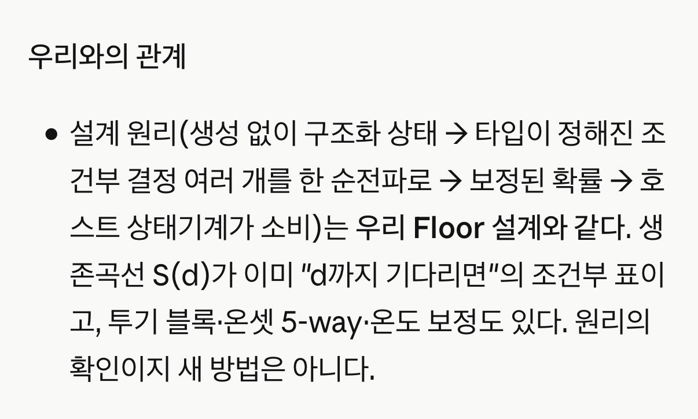
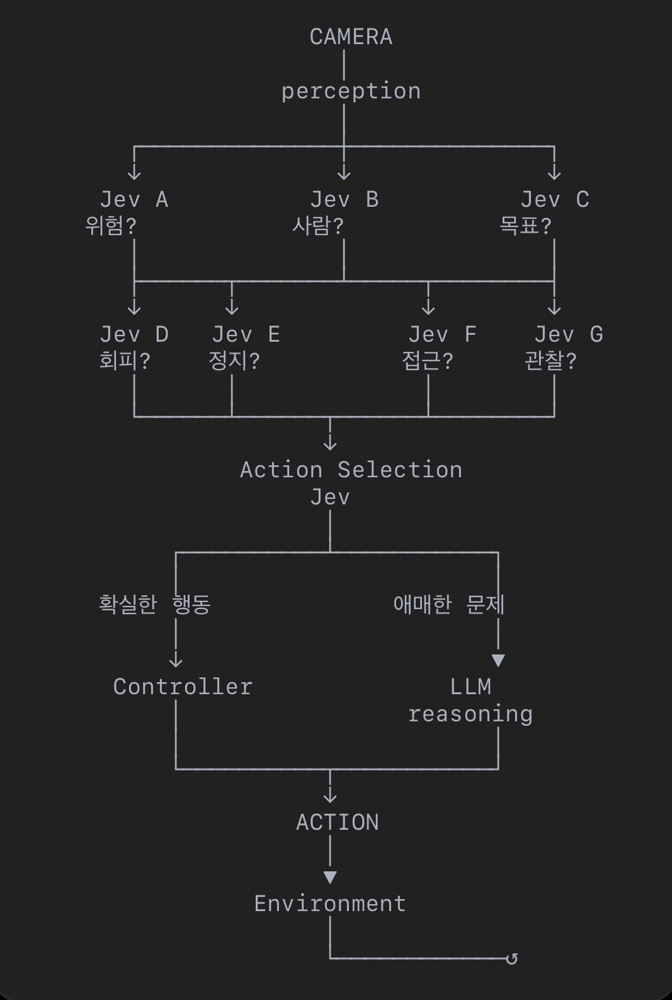
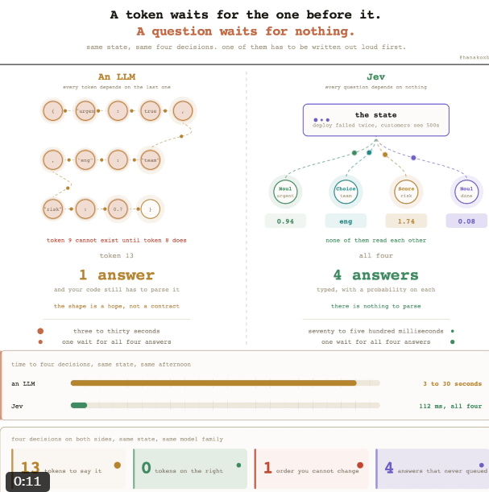
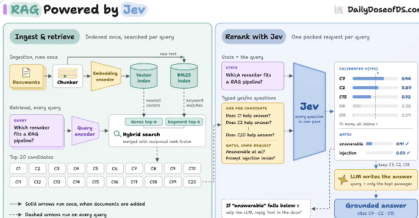

# Jev

속성: AI


<details>
<summary><strong>Jev가 제가 가입할 때 API 크레딧으로 5달러를 주셨어요</strong></summary>

Jev가 제가 가입할 때 API 크레딧으로 5달러를 주셨어요

제가 죽으면 남은 걸 제 아들에게 물려줄 거예요

바로 알아차리지 못하는 사람들을 위해 - Jev는 *정말* 싸요.. 전화 통화 엄청 많이 했는데, 사용량 숫자가 1센트도 안 움직이더라고요

"미터로 잴 수 없을 만큼 저렴한 지능"에 대한 그 모든 이야기들, jev만이 실제로 그걸 실천하고 있네요

---


</details>

---


<details>
<summary><strong>코드 리뷰를 Jev를 사용해서 하는 건 정말 좋은 유스케이스라고 생각해.</strong></summary>


Jev에게 내 PR 리뷰를 맡겼다. Claude보다 ~200배 저렴하고, 0.5초 만에 답변을 준다.

비디오에 실제 6개의 PR이 있다. 각각 $0.00007. 1,000 PR = 7센트 vs Opus 5에서 ~$14.50

diff를 붙여넣기 →  
@typesafeai  
에 ONE 콜 → 14개의 타입 체크가 확률로 돌아온다:  
하드코딩된 시크릿, SQL 인젝션, auth에 터치, 테스트 삭제, API 깨기, 마이그레이션, 디버그 잔여물, 설명이 실제로 diff와 맞는지, blast radius, 리뷰어 노력…

코드가 그걸 판정으로 바꾼다: BLOCK / 보안 리뷰 / nits / 병합. 중요한 체크가 확신이 없는 것(0.35–0.65)은 추측 대신 인간이나 큰 모델로 에스컬레이션된다.

---


</details>

---


<details>
<summary><strong>Jev 라는 새로운 AI 모델이 핫하군요. 아이디어는 하늘아래 새로운 것이 없죠.</strong></summary>


누가 제대로 만들어서 실제 제품으로 서비스 할 수 있는지가 관건. (첨부는 연구개발중인 자체 모델과 비교해 본 내용)



---


</details>

---


<details>
<summary><strong>LM 업계를 뜨겁게 달구고 있는 Jev에 대해 엄청나게 쉽게 설명한 게 있었어. AI 네이티브의 if문이라는 거야.</strong></summary>


＞  
Jev를 이해하는 가장 쉬운 방법은 이거야:

LLM은 답변을 생성해.

Jev는 결정을 내려.

이건 작은 차이처럼 들리지만, 실제로는 사용 사례 전체를 바꿔버려.

예를 들어, 보통의 LLM에 이걸 주면:

「여기에 사용자, 그 계정 이력, 결제 행동, 지원 채팅, 디바이스 데이터 등이 있어.

이게 위험해 보이는지 알려줘.」

LLM은 이걸 추론해서, 아래처럼 답할지도 몰라:

「네, 이건 고위험으로 보여요.」

정중하게 부탁하면 JSON 형식으로.

Jev에서는 가능한 결정을 미리 정의해:

위험:

- 낮음
- 중간
- 높음

수동 검토:

- 예
- 아니오

그리고 Jev는 이런 걸 반환해:

위험 = 높음 (96%)  
수동 검토 = 예 (91%)

이게 기본적으로 제품이야.

이건 또 다른 ChatGPT가 되려는 게 아니야.

더 AI 네이티브한 if문 같은 거지.

아래 같은 거 대신:

if 거래액 > $10,000:  
review()

더 아래처럼 생각하기 시작할 수 있어:

if 「이 행동이 수상한가？」 > 95%:  
review()\

제프, 조금 이해가 되기 시작했어

계속 움직이는 세계의 다양한 실시간 입력을 계속 입력하고, 그게 400ms 안에 해석이나 판단이 가능한 세계가 왔다는 거지

마우스의 위치, 시선, 기온, 인구 밀도, 다양한 정보를 다양한 세분화 수준으로 분석·판단할 수 있어

중요한 건 속도야, 속도가 필요 없으면 LLM으로도 할 수 있으니까

---


</details>

---


<details>
<summary><strong>Jev 사용 방법:</strong></summary>


1. 공식 사이트에서 waitlist 가입 신청, 기본적으로 신청 당일에 승인됨.  
🔗：[https://typesafe.ai](https://typesafe.ai/)
2. Codex에게 말하기: npx skills add typesafe-ai/skills –skill typesafe-ai 설치.
3. 대시보드로 돌아가서 API Key 생성.
4. prompt에서 “use the TypeSafe skill”이라고 한 문장 말하기.

테스트해봤는데, Jev는 정말 빠름! 현재 멀티모달만 지원하지만, 이미 많은 기존 시나리오가 다시 활성화될 거라는 느낌이 듦!!!


</details>

---


<details>
<summary><strong>Jev 사용법, 그리고 실제로 100배 성능을 발휘하는 곳:</strong></summary>


설치에 10분 걸림:

1. 대기자 명단에 가입하세요. 사람들이 당일 승인받고 있어요  
🔗 [https://typesafe.ai](https://typesafe.ai/)
2. 공식 스킬을 설치해서 에이전트가 올바른 호출을 작성하도록 하세요:
- npx skills add typesafe-ai/skills --skill typesafe-ai

Claude Code에서는 두 명령어만 필요해요. 마켓플레이스 추가만으로는 아무것도 설치되지 않아요:

- claude plugin marketplace add typesafe-ai/skills
- claude plugin install typesafe@typesafe-ai
1. 대시보드에서 API 키를 생성하세요
2. 프롬프트에서 그냥 이렇게 말하세요: "TypeSafe 스킬을 사용해"

이제 아무도 게시하지 않는 부분:

100배 성능은 모델 자체가 아니라, 모델을 어디에 배치하느냐에 달려 있어요

LLM을 Jev로 바꾸는 것만으로는 얻을 수 없어요  
언어 모델이 필요 없었던 호출들을 삭제함으로써 얻는 거예요

에이전트를 열고 단순히 뭔가를 선택하는 모든 호출을 찾아보세요:

> 다음으로 어떤 도구를 사용할까  
이게 스팸인가  
이 청크가 관련 있는가  
이게 사람의 개입이 필요한가  
이 변경 사항이 위험한가  
> 

이것들 중 어느 것도 글쓰기 작업이 아니에요  
이건 프론티어 모델에 외주를 준 if 문들이에요

여기 업그레이드 순서예요:

1. 각각을 타입화된 질문으로 교체하세요  
Choice는 최대 255개 옵션 중에서 선택하고, Score는 2-10 레벨 스케일에 배치하며, Noul은 0-1 원시 값을 반환해요
2. 배치 처리하세요  
한 호출 내 질문들은 병렬로 실행되며 지연 시간을 거의 움직이지 않고, 출력 토큰은 무료예요  
그래서 필요할 수 있는 모든 질문을 물어보세요. 버릴 질문들도 포함해서요
3. 답변이 아니라 신뢰도에 임계값을 설정하세요  
0.5 미만이면 대형 모델이나 사람에게 에스컬레이션하세요  
0.85+에서야 돌이킬 수 없는 작업 전에요
4. 절대 옵션을 창작하게 하지 마세요  
후보 목록을 코드에서, DOM에서, 검색 엔진에서, 도구 추적에서 구축하세요  
그 다음에 선택하게 하세요
5. 루프 옆에 두지 말고 루프 안에 넣으세요  
라우터는 저렴한 모델을 선택하고, 게이트는 도구 호출이 실행되기 전에 확인하며, 심판은 출력 후에 검증해요  
당신의 에이전트에서 가장 무거운 호출들이 숨어 있는 곳이에요
6. 오늘 밤부터 압축부터 시작하세요  
모든 도구 호출에 점수를 매기고, 죽은 것들은 버리며, 생존자들을 손실 있는 요약 대신 그대로 유지하세요  
가장 적은 노력으로 얻을 수 있는 승리인데, 내일 청구서에서 효과를 볼 거예요

솔직한 부분:

지금은 텍스트만, 이미지 없음, 오디오 없음  
그리고 광범위한 벤치마크에서는 프론티어 모델에 밀려요

하지만 누군가 18,514개의 이메일을 제로샷으로 돌려서 98.33%를 얻었어요  
14,800개의 레이블링된 예제로 훈련된 TF-IDF 분류기가 얻은 98.39%에 비해요

훈련 데이터 없음, 총 $1.12

좁고 잘 지정된 결정에서 이겨요  
당신의 에이전트가 하루 종일 실제로 하는 대부분의 일에서요

오늘은 콘텐츠 생성에 통합한 사용 사례와 이제 몇 초 만에 승리하는 메타 광고를 찾는 방법을 공유할 거예요...

---


</details>

---


<details>
<summary><strong>타임라인에 넘쳐나는 Jev 데모들을 보면서 Jev가 대단하기보다는 '저걸 어케 텍스트 입력으로 변환했누'가 더 대단하게 느껴짐</strong></summary>


사실 jev로 할 수 있는 대부분의 일은 강화학습 에이전트로 학습 시킬 수 있는 것인데, 이쪽에서 일반인의 도전에 병목이 되는 지점 역시 대상을 어떻게 environment로 구현하느냐였습니다.

이걸 먼저 해결하고 나야 신경망 설계니 연산자원이니 고민이 시작되는 것이지 환경부터 AI가 건들수 있게 만들디 못하면 첫단추도 못 꿰는..

---


</details>

---


<details>
<summary><strong>요즘 AI쪽에서 화제인 Jev가 뭐냐면</strong></summary>


지피티나 클로드처럼 직접 글 쓰고 코딩하는 AI가 아니라, 앱이나 AI 에이전트 안에서 “다음에 뭘 할지” 빠르게 판단해주는 AI임.

쉽게 말하면  
Codex / Claude = 실제 작업  
Jev = 작업 배분·다음 행동 판단

예를 들어 코덱스가 작업하다 실패하면 Jev가 “재시도 / 다른 AI로 넘기기 / 다른 툴 사용 / 중단” 중 뭐가 나을지 확률과 함께 결과를 줌. 실제로 Codex나 Claude를 움직이는 건 그 결과를 받은 내 프로그램임.

📌 어떻게 쓰냐?

Codex 안에 Jev를 설치하는 건 아님. 내 앱이나 프로그램에 Jev API를 연결해서 쓰는 방식임.

Codex 작업 실패 → Jev API에 현재 상황 전달 → Jev가 다음 행동 판단 → 내 프로그램이 그 결과대로 Codex·Claude·다른 툴 실행

여러 AI를 연결할 때뿐 아니라 일반 앱에서 “이 요청 어디로 보낼까 / 승인할까 / 사람이 확인해야 할까” 같은 판단에도 쓸 수 있음.

📌 왜 굳이 쓰냐?

이런 간단한 판단까지 매번 GPT나 Claude 같은 큰 AI한테 시키면 느리고 비쌈. Jev는 선택·점수·분류 같은 짧은 판단에 특화돼 있음.

TypeSafe 공개 가격은 입력 100만 토큰당 $0.042, 출력은 무료.

짧은 상황 설명만 보내는 식으로 쓴다고 가정하면  
하루 1,000번 정도 판단 → 월 $1 안팎  
하루 10,000번 → 월 몇 달러~10달러대 정도

엄청 자주 호출해도 코드 전체를 매번 통째로 보내지만 않으면 보조 AI 비용은 꽤 작은 편임.  
※ 실제 금액은 한 번에 Jev에 얼마나 많은 내용을 보내느냐에 따라 달라짐.

📌 한 줄 요약

GPT / Claude / Codex가 “일하는 AI”라면  
Jev는 프로그램 안에서 “다음에 뭘 할지 정하는 AI”에 가까움.

현재 Early Access 단계라 대기 신청 후 초대받아야 함.

---


</details>

---


<details>
<summary><strong>jev란거 꽤 재밌는 장난감일 수 있겠음...</strong></summary>


Jev 다발을 엮어서 일종의 조건 반사 신경계 처럼 만들 수 있을것 같다는 생각

굳이 모든 일에 LLM이 동원되는게 아니라 LLM에 반복적으로 혹은 유형적으로 가던 것들에 대해서는 LLM이 적절하게 (가중치를) 설계해 놓은 jev로 돌리는 방법이 있을 수 있을 것 같단 말임...



---


</details>

---


<details>
<summary><strong>Jev 대 현재 LLM이 아닙니다. Jev + LLM이 될 겁니다.</strong></summary>


Jev의 모든 장점과 단점을 여기 있습니다.

1. Jev 또는 Jev와 유사한 시스템은 자동 모델 라우팅, 작은 결정, if/else 쿼리, 검색, 도구 선택, 점수 매기기 등 모든 LLM에 통합될 것입니다.
    
    이 모든 것들에서 LLM은 사고와 계획에 많은 토큰을 잃고, 더 빠른 모델 대신 더 스마트한 모델을 사용합니다. Jev로 그것을 고칠 수 있습니다.
    
2. Jev는 LLM으로 파인튜닝이 필요한 일들을 할 수 있습니다. 단 하나의 프롬프트로 무엇을 해야 할지 배울 수 있습니다.
3. 미친 속도입니다. 스캔하고, 분석하고, 사고 차단 없이 즉시 결정을 내립니다.
4. 평범한 영어로 사고하고 계획하는 데 토큰을 낭비하지 않습니다. 확률을 점수 매기고 최고의 것을 선택합니다.
5. 출력 비용 $0. LLM처럼 자유 형식 텍스트 생성을 위해 만들어지지 않았기 때문에 당연합니다. 결정만 출력합니다.
6. RAG를 고칠 수 있습니다. 현재 32k 컨텍스트가 너무 낮지만, 가까운 미래에 1M 컨텍스트 윈도우를 가진 Jev 같은 시스템을 볼 것이고, 그것이 검색 문제를 해결할 것입니다.
7. Jev에는 3가지 결정 유형이 있습니다: 다지선다형 질문, 확률 점수 매기기, 그리고 Noul.
    
    ```markdown
    Choice → 어느 것?
    Score → 얼마나?
    Noul → 예 또는 아니오?
    ```
    
    그것이 추론이 필요 없는 이유입니다.
    
8. Jev는 병렬 샘플링으로 작동합니다. LLM은 순차적으로 생성합니다:
    
    ```markdown
    Token 1
    ↓
    Token 2
    ↓
    Token 3
    ↓
    Token 4
    ```
    
    Jev는 동일한 상태에 대해 여러 질문을 병렬로 평가할 수 있습니다. 그것이 낮은 지연 시간을 가지는 이유 중 하나입니다.
    
9. RLHF (인간 피드백으로부터의 강화 학습) 대신, RLCD (교정된 결정에 대한 강화 학습)로 작동합니다.
    
    RLCD로, 모델의 목표는 답을 예측하는 것뿐만 아니라 자신이 얼마나 자신 있는지 보여주는 것입니다.
    
    모델이 말하는: true는 true, 99% confidence와 다릅니다.
    
10. Jev 응답 시간은 대략 70–500 ms로, 프론티어 LLM 워크플로우보다 193.6배 빠르고 444.6배 저렴합니다.

오늘날 LLM의 가장 큰 문제는 작업 실행에 너무 많은 시간이 걸린다는 것입니다.

Jev 같은 시스템으로, 그것은 적어도 50% 더 빨라질 것입니다.

---


</details>

---


<details>
<summary><strong>요즘 개발자들 사이에서 Jev가 왜 핫한지 보면</strong></summary>

AI가 앞으로 어떻게 바뀔지 힌트가 하나 있음

지금 AI 에이전트는 보통  
GPT나 Claude한테 도구 100개를 다 보여주고

“알아서 뭐 쓸지 골라”

이렇게 시킴

생각해보면 좀 이상함

비싼 AI한테 일을 시키기도 전에  
매번 도구 100개 읽고 뭘 쓸지 고민까지 시키고 있는거임

Jev는 반대로 감

얘는 글도 안씀  
긴 생각도 안함

지금 뭘 해야되는지만 고름

예를 들어 도구가 100개 있으면  
Jev가 먼저 지금 필요한 도구 하나를 고르고  
그거 하나만 GPT나 Claude한테 넘기는 식임

실제 공개 실험 하나에서는

도구 100개짜리 에이전트에서  
입력토큰이 약 180만 → 27만  
비용은 $8.07 → $1.52까지 줄었음

물론 공짜 점심은 없음  
해야될 일을 제대로 끝낸 비율도  
98.4% → 92.1%로 떨어짐

근데 나는 숫자보다 이 구조가 더 중요해보임

앞으로 AI는 제일 똑똑한 모델 하나한테 모든걸 시키는 방향이 아니라

쉬운 판단 → 싸고 빠른 모델  
어려운 생각 → 비싼 모델  
확신 없으면 → 상위모델이나 사람

이렇게 분업하는 방향으로 갈 가능성이 큼

그리고 Jev 돈내고 안써도 됨 ㅋㅋ

아이디어만 빼먹으면

요청 먼저 분류하고  
필요한 도구만 AI한테 보여주고  
어려운것만 좋은 모델로 넘기면 됨

결국 AI 비용 줄이는 핵심도  
싼 모델만 찾는게 아니라  
비싼 AI가 생각 안해도 되는 것까지 생각시키지 않는거임

근데 이것도 한순간이고

지피티고 클로드고 뭐고 기본기능으로 탑재될거임.

---


</details>

---


<details>
<summary><strong>Jev으로 아주 소소한거 해보기: 뉴스 분류</strong></summary>


너무나 거창하고 멋진 예시가 이미 넘치지만  
이해를 위해 먼저 아주 소소한 개선부터.

매일 1회 주제별 뉴스 추려서 메일주는 서비스인데, Jev로 몇 가지 문제점 개선:

Noul - 중복 뉴스 필터  
Choice - 주제 이탈 필터  
Score - 내 프로필과 기반 뉴스 필터

사실 기존 LLM으로도 가능하지만, 확실히 훨씬 저렴하고 빠르게 처리 가능해서, 아 이런식으로 쓰면 되겠구나 싶음

LLM이 굳이 안해도 되는 ‘필터링’을  
전부 Jev에게 맡기면 될듯

---


</details>

---


<details>
<summary><strong>CLAUDE CODE용 JEV 모델 라우터 소개</strong></summary>


이 Claude Code 모드는 Typesafe AI API 또는  
@vercel  
AI Gateway를 통해 Jev를 직접 실행할 수 있게 해줍니다.

Claude Code로 보내는 모든 요청마다 Jev가 선택합니다:

→ 서브에이전트 모델  
→ 메인 모델 (세션 시작 시에만, 캐시가 깨지지 않도록)  
→ 노력 수준

한 명령어로 설치:

```markdown
npx claude-code-templates@latest –mod productivity/jev-model-router
```

1. 뭐가 새로운가.  
Claude Code의 각 요청을 Jev가 먼저 분류하는 부분이 흥미롭습니다.
    
    분류하는 것은 작업의 무게, 필요한 추론량, 위험도의 3가지입니다. 가벼운 수정이라면 작은 모델로, 어렵거나 위험한 작업이라면 깊은 추론으로 유도하는 설계입니다.
    
    인간이 매번 "이건 Haiku로 괜찮아? Sonnet? Opus?" 하고 고민하는 부분을 실행 전 라우터에 맡기는 발상입니다.
    
2. 다만, 본체 모델의 전환은 신중하게.  
이 Mod는 서브 에이전트의 모델 전환과 본체 대화의 추론 effort 조정을 기본 ON으로 설정하고 있습니다.
    
    반면, 본체 모델 자체의 전환은 기본 OFF입니다. 긴 대화 중에 본체 모델을 변경하면 프롬프트 캐시가 무너져, 절약은커녕 재캐싱 비용이 증가할 가능성이 있기 때문입니다.
    
    우선 subagent와 effort만으로 시도하는 것이 안전합니다.
    

---


</details>

---


<details>
<summary><strong>최고의 제부 설명인듯</strong></summary>


JEV 요약 : 자연어로 예/아니오 '논리게이트' 만들 수 있음.

왜 이걸로 호들갑들 떠냐고 생각하는 사람들, 이유 한번만 들어줘.  
개발자들이 원래 기본적으로 맨날 하던게 이 '논리게이트' 쓰던거라서 그럼

기본적인 if문, switch 문인데 조건절을 자연어로 쓸 수 있게 된거임! 그것도 겁나 싸게

원래는  
if( 겁나 복잡한 계산식 ) { print "yes" }

이런식이였다면

if ( "핫도그는 음식인가?" ) { print "yes" }

이렇게, 함수로 짜려면 어떤 자료부터 모아서 로직 어떻게 세워야 할지 감도 안오는 것까지 논리 게이트로 짤 수 있게 된 거.

---


</details>

---


<details>
<summary><strong>Jev 그냥 가벼운 LLM 아냐? 라고 생각하신다면 이 글을 읽어주세요</strong></summary>


1. 며칠 전, 글쓰기가 아니라 판단을 내리는 역할에 특화된 AI인 Jev가 등장했음  
(자세히 알고싶다면 인용글)
2. Jev 탄생 이후 글을 쓰는 AI와 판단을 내리는 AI가 나뉘어 쓰이기 시작함
3. 예전엔 LLM이 매번 문장을 만들고 그 문장에서 원하는 데이터를 파싱해야 했는데, 지금은 Jev가 판단할 수 있도록 데이터를 주는 구조로 바뀌고 있어 효율이 엄청나게 증가했음
4. 가장 체감되는 변화는 에이전트 루프가 훨씬 싸고 빨라졌다는 것 ㄷㄷ
5. 브라우저 에이전트에서 다음 클릭을 Jev가 고르고, 글 입력만 작은 LLM이 맡는 방식이 이미 나왔고
6. 얼마 전 Astra로 computer use가 빠르다는 영상이 돌았는데, Jev를 사용하면 이게 진짜 싸고 빠르게 가능해짐
7. 그래서 지금 GitHub에 Jev를 활용한 프로젝트가 실시간으로 나오고 있고 계속 새로운게 쏟아져 나오고 있는 중
8. Jev의 한계가 어느정도인지 계속 테스트되고 있고

앞으로 기존 LLM이 하던 일 중 일부를 특화하는 실험이 많아질 것으로 예상됨

---


</details>

---


<details>
<summary><strong>Jev를 어디에 쓸 수 있을까? 결정이 필요한 지점마다 넣어볼 수 있습니다.</strong></summary>


1. 모델 라우팅  
간단한 작업은 저렴한 모델에 맡기고, 어려운 작업만 강한 모델로 올립니다.
2. Agent 라우팅  
작업 성격을 보고 어떤 Agent에게 맡길지 정합니다.
3. 도구 선택  
Agent가 수십, 수백 개의 도구를 마주할 때 다음에 어떤 도구를 호출할지 먼저 고릅니다.
4. Browser Use  
현재 페이지 상태를 보고 클릭, 스크롤, 입력, 선택, 작업 종료 중 무엇을 할지 빠르게 판단합니다.
5. 정보 필터링과 우선순위화  
수백 개 파일, 웹페이지, 검색 결과, 지식베이스 자료 중 대형 모델이 먼저 읽을 내용을 추립니다.
6. 컨텍스트 정리  
이전 메시지, Tool Call, 명령 출력 중 무엇을 남기고 무엇을 압축하거나 버릴지 결정합니다.
7. 대량 분류  
이메일, 댓글, 티켓, 콘텐츠 검토, 사용자 피드백을 빠르게 분류하고 태그를 붙입니다.
8. Agent 실행 전 안전 점검  
도구 실행 전에 리스크를 판단해 실행 허용, 재시도, 사람 확인 중 하나를 선택합니다.
9. 코드 리뷰 전 사전 필터링  
보안, 호환성, 테스트, 로직 문제가 있을 법한 변경부터 찾아 강한 모델의 깊은 리뷰로 넘깁니다.
10. 결과 검증  
대형 모델이 작업을 마친 뒤 목표를 완료했는지, 형식이 맞는지, 추가 작업이 필요한지 빠르게 확인합니다.

Agent가 길게 생각할 필요 없는 “작은 판단”을 Jev가 맡으면, 더 빠르고 적은 비용으로 워크플로우를 굴릴 수 있습니다. ⚡️

---


</details>

---


<details>
<summary><strong>요즘 Jev가 핫한 이유는 AI의 역할이 생각하고 말하는 것에서 빠르게 판단하는 것으로 확장되고 있기 때문인거 같은데</strong></summary>


예를 들어 고객이  
“가격이 너무 비싸서 다른 업체를 검토 중입니다”  
라고 메일을 보냈다고 해보자.

LLM은 이 내용을 읽고 길게 추론한다

반면 Jev는 바로 판단한다고 한다  
아래처럼 말이다

이탈 위험: 92%  
경쟁사 전환 가능성: 81%  
즉시 영업 대응 필요: YES

쉽게 말하면 Jev는  
AI로 만든 똑똑한 if문에 가깝다고 보면된다

앞으로 AI 시스템은  
LLM이 복잡한 문제를 추론하고

Jev 같은 모델이 수많은 작은 판단을 내리는 시스템으로 바뀌지 않을까 싶다

---


</details>

---


<details>
<summary><strong>LLM vs. Jev, 명확히 설명!</strong></summary>


LLM은 훌륭하지만, 그 한계는 스크롤하며 지나가는 것을 지켜볼 수 있는 수준입니다:

LLM은 답변을 한 토큰씩 작성합니다.

배포 실패와 네 가지 결정을 주면, 이전 토큰에 의존하는 작은 JSON 객체를 생성합니다.

토큰 9는 토큰 8이 존재할 때까지 존재할 수 없기 때문에, 서로 아무 관련이 없는 네 가지 결정이 그냥 대기열에 서 있습니다.

그런 다음 코드가 이를 파싱하고, 형태를 검증하며, 형태가 잘못되면 재시도합니다.

Jev는 더 작거나 빠른 모델이 아님에도 이 문제를 해결합니다: 순서를 제거합니다.

그 배포에 대한 한 턴은 다음을 알아야 합니다:

→ 사건이 긴급한지  
→ 어떤 팀이 소유하는지  
→ 다음 명령이 위험한지  
→ 작업이 실제로 완료되었는지

질문과 답변 유형을 미리 선언하면, 네 가지 모두 함께 타입이 지정되고 각 항목에 확률이 붙어서 돌아옵니다.

에이전트의 거의 모든 분기점을 세 가지 기본 요소가 커버합니다:

1. **Choice**는 엔지니어링, 청구, 또는 판매처럼 정의한 최대 255개의 옵션 중 하나를 선택합니다.
2. **Score**는 낮음, 중간, 또는 높은 위험처럼 정의한 순서화된 척도에 상태를 배치합니다.
3. **Noul**은 예-아니오 조건이 참일 확률을 반환합니다.

이 문장이 모든 혼란을 해결합니다:

텍스트는 걸어가야 하는 선입니다. 답변 공간은 한 번에 전체를 볼 수 있는 방입니다.

↳ 생성: 변경할 수 없는 하나의 순서, 끝에 하나의 문자열, 유지되기를 바라는 형태  
↳ 평가: 순서가 전혀 없음, 타입 지정된 답변, 모든 옵션에 확률

프롬프트 → 에이전트 → 루프 → 그래프 → Jev

확률이 답변보다 더 중요합니다.

↳ 청구의 0.09에 대해 엔지니어링의 0.91은 자동화할 수 있는 경로입니다  
↳ 0.46에 대해 0.52는 라벨을 붙인 동전 던지기이며, 라벨만으로는 어떤 것을 얻었는지 알 수 없습니다

마지막 것은 신중한 사람들을 사로잡습니다. LLM은 자신만만한 문장에서 "엔지니어링"이라고 말했을 테고, 경주가 그만큼 치열했다는 사실을 알 방법이 없었을 것입니다.

임계값은 코드에 살고, 각 작업당 하나씩, 잘못된 판단의 비용에 맞춰 스케일링됩니다.

옵션이 알려져 있고 호출이 의미에 의존할 때 작동합니다. 쓰기, 코드, 산술, 또는 질문 2가 질문 1의 답변을 필요로 하는 모든 것에는 적합하지 않습니다.

그리고 밤새워 먹는 것: 타입 안전성은 잘못된 출력 형식을 방지하지만, 잘못된 판단은 아닙니다.

Jev는 스키마 밖의 옵션을 반환할 수 없으며, 여전히 자신만만하게 잘못된 유효한 옵션을 선택할 수 있습니다. 스키마 유효한 실수는 잘못된 고객에게 똑같이 빠르게 환불합니다.

LLM은 답변 공간이 열려 있을 때 새로운 언어를 작성합니다. Jev는 답변 공간이 닫혀 있을 때 알려진 경로를 평가합니다.

아래에 Jev에 대한 전체 분석을 인용했습니다. 세 가지 기본 요소, 병렬 배터리, 임계값, 그리고 적합하지 않은 곳을 다룹니다.



---


</details>

---


<details>
<summary><strong>JEV JEV 엄청 찬양하는데 하나만 알고가자. Jev 계속 보고 있는데 이번에는 약점 하나 얘기해봄</strong></summary>


Jev가 빠르고 싸고 AI 에이전트 앞에서  
판단하는 용도로 되게 좋아보이는데

잘못 쓰면 오히려 좀 무서울수도 있음

왜냐면 Jev는 말을 길게 만들다가 헛소리하는 AI가 아님

정해진 선택지 안에서 깔끔하게 하나를 골라줌

문제는

깔끔하게 골랐다고 맞는건 아니라는거임

예를 들어

A로 보낼까  
B로 보낼까  
C로 보낼까

물어봤는데

사실 정답은  
“셋 다 아님. 사람한테 물어봐야됨”

일 수도 있잖음

근데 내가 그 선택지를 안 넣어놨으면  
Jev는 결국 A/B/C 중 하나를 골라야함

여기서 Jev의 장점이 그대로 약점이 됨

LLM은 헛소리하면 티라도 날때가 있는데  
Jev는 형식이 너무 멀쩡해서  
코드가 그대로 실행해버릴 수 있음

그리고 confidence도 조심해야됨

confidence 95%라고  
“95% 확률로 정답”이라는 뜻이 아님

실제로 Vercel도  
자기 업무 데이터로 테스트해서

이 이상이면 자동 실행  
이 아래면 상위 AI  
더 애매하면 사람

이 threshold를 따로 잡으라고 함

공개된 Jev 에이전트 실험에서도 재밌는게

토큰은 약 85% 줄고  
비용도 크게 줄었는데

해야될 일을 끝낸 비율은  
98.4% → 92.1%로 내려감

싸지고 빨라졌는데  
품질을 공짜로 얻은건 아니라는거임

그래서 나는 Jev를

“GPT 대신 쓰는 싼 AI”

이렇게 보면 안된다고 봄

오히려

명확한 룰  
→ 코드

애매하지만 실패해도 복구 가능한 판단  
→ Jev

복잡하고 열린 판단  
→ GPT / Claude

돈 보내기 / 삭제 / 배포 / 개인정보처럼  
틀리면 큰일나는 판단  
→ 사람 또는 별도 검증

이런식으로 써야되는거 같음

결국 Jev의 핵심은  
얼마나 싸냐가 아니라 어디까지 맡길거냐임

---


</details>

---


<details>
<summary><strong>Jev의 올바른 사용법은,</strong></summary>


「하루 만에 복잡한 실시간 판단을 하는 프로토타입을 만든다」→「실행 로그를 보고 결정론이나 Bert나 증류 쪽이 더 좋은 부분을 교환한다」

이런 식으로, 「day1에 만들어서 나중에 투자할 수 있는」 부분이 가치라고 생각할 거 같아.

---


</details>

---


<details>
<summary><strong>Jev, 이제 오픈 소스: Lev</strong></summary>


Qwen 백본을 기반으로 한 4B 오픈 소스 System One 모델

작은 크기에 비해 최고의 성능  
[https://huggingface.co/interfaze-ai/lev](https://huggingface.co/interfaze-ai/lev)

---


</details>

---


<details>
<summary><strong>이 날 JEV 에이전트 폴더를 만든 이후로 CLAUDE가 결정을 내리도록 내버려두지 않게 됐어</strong></summary>


과거에는 Claude가 모든 단계를 결정하고 쓰고 실행하게 했어

- > 이제 Claude는 쓰기만 해. Jev가 결정을 내리고, 코드가 실행을 맡으며, 모든 단계가 영수증을 남겨

폴더 안에 뭐가 있는지 보여줄게:

- 입력

> [AGENTS.md](http://agents.md/) - 언제 Jev를 호출할지, 언제 건너뛸지  
state/build_state.py - 목표, 워커들, 완료, 누락, 제약. 증거, 결코 요약 아님  
> 
- Jev가 결정 (questions/)

> [http://route.py](http://route.py/) - 어떤 모델 티어가 작업을 맡을지  
next_worker.py - 다음으로 어떤 워커가 행동할지  
[http://relevance.py](http://relevance.py/) - 각 도구 출력을 유지할지 버릴지  
[http://done.py](http://done.py/) - 목표가 실제로 달성됐는지  
[http://risky.py](http://risky.py/) - 이게 보내기, 지불, 삭제를 하는지?  
> 
- 코드가 행동 (rules/)

> hard_rules.py - 10번 행동 후 멈추기, 승인 안 된 건 절대 게시 안 함  
thresholds.yaml - 자신 있는 답변에만 행동. 사기는 0.95 필요  
> 
- Claude가 쓰기 (workers/)

> [http://research.py](http://research.py/) - 출처와 노트  
[http://writer.py](http://writer.py/) - 초안과 브리핑  
폴더 전체에서 텍스트가 생성되는 유일한 곳  
> 
- 증거

> receipts/decisions.jsonl - 제안된 옵션, 선택된 ID, 재확인, 대체  
evals/ - 수십 개의 내가 직접 라벨링한 추적들, 그걸로 임계값 조정  
> 
- 가드 (hooks/)

> pre_tool_use.sh - 실행 전 모든 명령 확인  
[http://stop.sh](http://stop.sh/) - 에이전트가 멈추기 전에 "모두 완료" 확인  
> 

$0.42에 10,000 결정. 중앙값 300 ms

LLM이 쓰고, Jev가 결정하고, 코드가 행동해

---


</details>

---


<details>
<summary><strong>Ollama가 이제 Jev와 유사한 의사결정 모델을 모두 로컬에서 지원합니다.</strong></summary>


Nimble과 같은 의사결정 모델을 티켓 분류, 모델 라우팅, 콘텐츠 조절과 같은 작업에 사용하세요.

ollama pull nimble

여기 Nimble이 새로운 로컬 /v1/systemone API를 통해 실시간으로 의사결정을 내리며 Ollama racer를 플레이하는 모습입니다. 🏎️

3 models are now available on Ollama for use with /v1/systemone:  
• Nimble: [https://ollama.com/library/nimble](https://ollama.com/library/nimble)  
• Tev1 4b: [https://ollama.com/library/tev1:4b](https://ollama.com/library/tev1:4b)  
• Tev1 0.8b: [https://ollama.com/library/tev1:0.8b](https://ollama.com/library/tev1:0.8b)

---


</details>

---


<details>
<summary><strong>Jev를 위한 상위 12개 에이전트적 사용 사례:</strong></summary>


Jev는 일반 코드가 확실하게 표현할 수 없는 의미적 결정을 처리합니다. 타이핑된 답변과 확률을 반환하며, 코드는 워크플로우를 계속 담당합니다.

Jev를 위한 12가지 실용적인 사용 사례는 다음과 같습니다:

1. 브라우저 다음 액션
    
    > 현재 DOM 상태를 클릭, 타이핑, 또는 중지와 같은 제한된 액션으로 변환합니다. 코드는 유효한 작업-대상 쌍만 실행합니다. 이미 여러 개의 오픈소스 Jev 웹 에이전트가 존재합니다.
    > 
2. 컨텍스트 압축
    
    > 긴 에이전트 추적에서 어떤 이벤트가 유지되어야 할지 결정합니다. 선택된 텍스트는 생성된 요약으로 대체되는 대신 그대로 유지됩니다.
    > 
3. 스킬 및 컨텍스트 로딩
    
    > 현재 사용자 턴을 사용 가능한 스킬과 비교합니다. 모든 스킬로 컨텍스트 창을 채우는 대신 해당 턴에 필요한 지침만 로드합니다.
    > 
4. 타이핑된 도구 호출 컴파일
    
    > 자연어 요청을 함수에 매핑하고 타이핑된 인수를 채웁니다. 각 인수는 코드가 실행을 허용하기 전에 개별적으로 평가됩니다.
    > 
5. 인용 검증
    
    > 인용된 구절이 존재하는지, 그리고 주변 증거가 주장을 지지하는지 확인합니다. 출력은 지지됨, 비지지됨, 또는 모순됨으로 될 수 있습니다.
    > 
6. 추출 검증
    
    > 먼저 저렴한 추출기를 실행한 후, Jev를 사용하여 의심스러운 필드를 검증합니다. 깨끗한 레코드는 빠른 경로를 유지하는 반면, 불확실한 것은 추론 모델에 도달합니다.
    > 
7. 에이전트 추적 평가
    
    > 원시 궤적을 진행 상황 및 반복과 같은 쿼리 가능한 레이블로 변환합니다. 이는 모든 실행에 대한 전체 리뷰를 작성하도록 다른 LLM에 요청하는 것을 피합니다.
    > 
8. 의미적 회귀 테스트
    
    > 새로운 에이전트 빌드에 대해 추적 세트를 재생합니다. 의미적 검사는 CI에서 프롬프트, 모델, 도구, 정책 변경을 통과시키거나 차단할 수 있습니다.
    > 
9. Jevgrep 코드 검색
    
    > 코드의 정확한 단어가 아닌 코드가 하는 일에 따라 코드베이스를 검색합니다. Jev는 후보 스니펫을 점수화하고 가장 관련성 높은 코드를 먼저 반환합니다.
    > 
10. 엔티티 정렬
    
    > 두 개의 후보 레코드를 비교하고 병합, 검토, 또는 별도로 유지할지 결정합니다. 후보 생성은 결정론적이며 Jev가 의미적 동일성을 처리합니다.
    > 
11. 검색 재순위
    
    > 임베딩이 광범위한 후보 세트를 검색하도록 한 후, Jev를 사용하여 관련성에 따라 구절을 재정렬합니다. 생성 모델은 가장 유용한 증거를 먼저 받습니다.
    > 
12. 메모리 승격 게이트
    
    > 완료된 에이전트 추적을 캡처한 후, 그 수정 사항에 재사용 가능한 교훈이 포함되어 있는지 판단합니다. 추적 기반 교훈은 승격될 수 있으며 작업 특정 노이즈는 폐기됩니다.
    > 

실제로 최종 패턴을 보고 싶다면, Beacon 오픈소스 프로젝트에 이미 구현되어 있습니다.

Beacon은 Claude Code, Codex, Cursor, OpenCode, 그리고 20개 이상의 에이전트 하네스에 걸쳐 전체 세션을 캡처한 후, Jev가 어떤 워크플로우와 수정 사항이 학습할 가치가 있는지 식별합니다. 그래서 한 에이전트가 발견한 교훈이 다른 에이전트들에게도 이용 가능해집니다.

---


</details>

---


<details>
<summary><strong>RAG를 위한 Jev, 명확하게 설명!</strong></summary>


하이브리드 검색은 후보 목록을 제공합니다. 어떤 구절이 증거를 포함하는지, 단순히 인접한 것인지, 또는 증거가 답변에 충분히 강력한지 결정하지 않습니다.

그 누락된 판단이 바로 Jev가 들어설 곳입니다.

Jev는 검색과 생성 사이에 위치합니다. BM25, 임베딩, 또는 LLM을 대체하지 않습니다. 후보들이 컨텍스트 창에 들어가기 전에 그들이 생성한 후보들을 평가합니다.

→ 넓게 검색

밀집 검색과 키워드 검색을 결합한 후, 상호 순위 융합으로 결과를 병합합니다. 이는 Jev에게 시각 자료에 표시된 상위 20개 구절과 같은 광범위한 후보 풀을 제공합니다.

검색은 여전히 상한선을 설정합니다. 이 후보 목록에 올바른 구절이 누락되면 Jev는 이를 복구할 수 없습니다.

→ 모든 후보를 함께 판단

쿼리를 Jev의 상태로 보냅니다. 각 후보에 대해 “C7이 이 쿼리에 답하는 데 도움이 되나요?”와 같은 형식화된 예/아니오 질문을 합니다.

Jev는 하나의 압축된 요청으로 모든 질문을 평가하고 각 구절에 대한 보정된 확률을 반환합니다. 이는 쿼리-구절 쌍마다 별도의 모델 호출을 피합니다.

→ 코드가 임계값을 적용하도록

애플리케이션이 각 확률을 임계값과 비교합니다. 그 이상인 후보들은 LLM으로 진행합니다. 그 이하인 모든 것은 생성 전에 제거됩니다.

Jev가 모호한 판단을 내립니다. 코드는 실제 결정에 대한 책임을 유지합니다.

→ 전체 답변을 게이트

동일한 요청으로 유지된 구절들이 쿼리를 답변 가능하게 만드는지 확인할 수 있습니다. 또한 후보 내부의 프롬프트 인젝션 징후를 플래그할 수도 있습니다.

답변 가능성이 임계값 아래로 떨어지면, 애플리케이션은 LLM을 건너뛰고 “문서에 없습니다”를 반환할 수 있습니다. 인젝션 점수는 보안 경계가 아닌 필터링 신호로 유지되어야 합니다.

결과는 더 깨끗한 작업 분담입니다.

하이브리드 검색은 광범위하게 검색합니다. Jev는 재순위화, 필터링, 충분한 증거가 존재하는지 결정합니다. LLM은 살아남은 구절들로부터만 작성합니다.

여기서 Jev의 가치는 단순히 구절을 목록에서 위아래로 이동시키는 것이 아닙니다. 관련성을 애플리케이션이 검사, 임계값 적용, 행동할 수 있는 명시적 확률로 전환합니다.

요약:

- 검색이 후보를 찾습니다.
- Jev가 컨텍스트에 가치 있는 것을 결정합니다.
- LLM이 근거 있는 답변을 작성합니다.


</details>

---

