# AI

속성: AI


<details>
<summary><strong>이게 최근에 내가 가장 많이 쓰는 프롬프트 중 하나가 됐어:</strong></summary>

이게 최근에 내가 가장 많이 쓰는 프롬프트 중 하나가 됐어:

> 내 목표가 뭐라고 생각하는지, 그리고 내가 해결하려는 문제가 뭔지, 네 말로 다시 설명해 봐  
> 

AI한테 다운로드 폴더 정리 맡기기 전에

아직 옮기지 말고 현재 경로와 이동할 경로를 표로 보여주고, 이름이 겹치는 파일은 따로 표시한 뒤 내 확인을 기다려줘

파일 접근 가능한 AI에 이 문장 붙이면 됨  
일단 분류표부터  
엉뚱한 폴더로 보내려는 파일을 실행 전에 골라낼 수 있음

---


</details>

---


<details>
<summary><strong>학습 곡선별 AI 도구 순위</strong></summary>


🟢 ChatGPT — 매우 쉬움  
🟢 Gemini — 매우 쉬움  
🟢 Claude — 쉬움  
🟢 Perplexity — 쉬움  
🟢 GitHub Copilot — 쉬움

🔵 Cursor — 보통  
🔵 Lovable — 보통  
🔵 Replit — 보통  
🔵 v0 — 보통  
🔵 Bolt — 보통

🟠 LangChain — 어려움  
🟠 LlamaIndex — 어려움  
🟠 CrewAI — 어려움  
🟠 AutoGen — 어려움  
🟠 RAG Systems — 어려움

🔴 AI Agents — 매우 어려움  
🔴 Model Fine Tuning — 매우 어려움  
🔴 LLM Training — 매우 어려움  
🔴 Inference Optimization — 매우 어려움  
🔴 Building Foundation Models — 매우 어려움

---


</details>

---


<details>
<summary><strong>요즘 개발자들 사이에서 이런 이야기를 자주 듣는다.</strong></summary>


"AI를 쓰면 생산성은 올라가는 것 같은데, 내가 점점 멍청해지는 것 같다."

문서를 먼저 열어보기보다 AI에게 먼저 묻고,  
에러를 직접 읽기보다 로그 전체를 그대로 붙여넣는다.  
어느 순간부터 헤매는 시간이 사라진다.

근데 원래 공부는 그 헤매는 시간 안에서 많이 남는다.

이와 관련해서 우아한테크코스에서 코치 활동을 하고 계신 동준님과 이야기를 나누었다.

동준님은 AI를 학습에 어떻게 반영할지 계속 실험하고 계셨다.

처음부터 AI에게 전부 맡기는 방식은 아니었다.

먼저 사람이 생각하고,  
그 다음 AI로 정리하거나,  
모르는 것을 찾아가며,  
점진적으로 학습에 AI를 반영하는 방식이었다.

AI를 쓰지 말자는 것도 아니고,  
AI에게 다 맡기자는 것도 아니었다.

핵심은 AI와 함께 배우되,  
내가 직접 생각하고 판단하는 시간을 어떻게 남길 것인가였다.

동준님이 특히 중요하게 본 것은 "좋은 원천 소스를 다시 보게 만드는 구조" 였다.

요즘은 유튜브, 쓰레드, 블로그, 요약 콘텐츠가 너무 많다.

"AI로 딸깍하면 된다"는 이야기도 많고,  
새로운 도구 소개도 매일 나온다.

근데 결국 오래 남는 학습은  
좋은 공식 문서와 원천 소스를 스스로 읽고,  
내 상황에 맞게 해석하고,  
직접 적용해보는 과정에서 생긴다.

그래서 동준님이 잡은 방향이 흥미로웠다.

"AI Agent를 배우기 위해  
나의 AI 학습 Agent를 직접 만든다."

예전에 TDD를 배울 때  
TDD로 xUnit 같은 테스트 프레임워크를 직접 만들어보는 예제가 있었다.

테스트를 배우려고 테스트 도구를 만들고,  
그 도구로 다시 테스트를 더 깊이 이해하는 방식이다.

동준님의 접근도 비슷하다.

AI Agent를 배우려고 나의 AI 학습 Agent를 만들고,  
그 Agent로 다시 Anthropic 공식 문서와 커리큘럼을 학습한다.

내가 만든 학습 Agent는  
공식 문서를 읽고,  
어려운 개념을 다시 설명하게 만들고,  
내가 놓친 부분을 퀴즈로 확인하게 만들고,  
AI가 왜 그렇게 판단했는지 다시 설명하게 만든다.

단순히 "쉽게 설명해주는 챗봇"이 아니다.

내가 더 깊이 생각하게 만들고,  
좋은 원천 소스를 다시 보게 만들고,  
다음 학습으로 이어지게 만드는 도구다.

이렇게 하면 Claude Code 사용법 자체를 외우는 것보다 더 중요한 것을 다루게 된다.

"AI가 준 답을 어떻게 판단할 것인가?"  
"좋은 원천 소스를 어떻게 계속 학습할 것인가?"  
"내가 이해하지 못한 내용을 어떻게 다시 추론하게 만들 것인가?"  
"내 학습 방식에 맞는 도구를 어떻게 직접 만들 것인가?"

이 질문에 계속 답하는 과정이 필요하다.

특히 취준생이나 주니어 개발자라면 더 그렇다.

AI가 아무리 코드를 잘 짜줘도,  
면접에서는 여전히 깊이 있는 이해를 본다.

"왜 그렇게 구현했는지"  
"다른 방식과 무엇이 다른지"  
"어떤 트레이드오프가 있는지'  
"AI가 만든 코드가 맞는지 틀린지"  
설명할 수 있어야 한다.

AI도 잘 써야 하지만,  
그 과정에서 내 실력도 남아야 한다.

---


</details>

---


<details>
<summary><strong>소프트웨어 엔지니어링은 변화하고 있다. 천천히가 아니다. 구조적으로.</strong></summary>


```
구식 엔지니어
│
├── 코드를 수동으로 작성
├── 고립된 문제 해결
├── 구현에 집중
└── AI를 도우미로 사용

↓

신식 엔지니어
│
├── 올바른 문제 정의
├── 맥락 + 제약 조건 제공
├── 아키텍처 & 트레이드오프 검토
├── AI 에이전트 조율
└── 코드뿐 아니라 시스템 구축
```

변화의 흐름:

```
자동완성 → 어시스턴트 → 맥락 인식 도구 → 에이전트 워크플로
```

AI는 단순히 코딩을 돕는 게 아니다.  
생각하고, 결정하고, 실행하는 데 돕는다.

🔥 이제 정말 중요한 것:

- 시스템 사고
- 아키텍처 판단
- 코드 리뷰 기술
- 복잡한 흐름 디버깅
- 보안 & 신뢰성
- 작업 분해

🚀 다음으로 배울 것:

- 리포지토리 인식 프롬프팅
- AI 생성 코드 검토
- 평가 + 테스트 우선 워크플로
- 에이전트 워크플로 설계
- 가드레일 + 안전한 자동화

미래의 엔지니어는 단순히 코드를 작성하지 않을 것이다.

그들은 대규모 시스템을 조율할 것이다.

여전히 코딩만 하고 있다면 이미 뒤처진 것이다.

---


</details>

---


<details>
<summary><strong>AI 결과가 10배 달라지는 핵심 용어 3가지</strong></summary>


1. 재발방지
2. 추정하지말고 실측로그로 판단
3. e2e 테스트

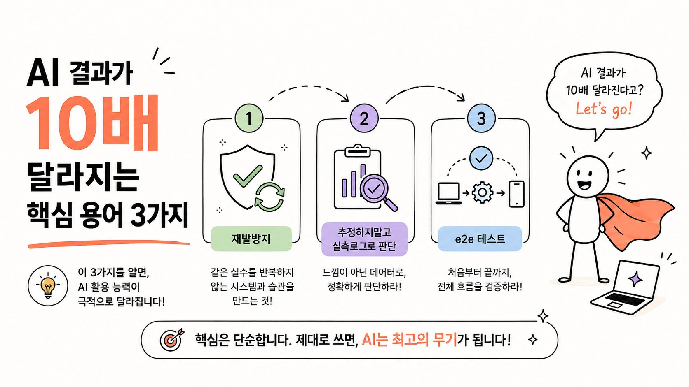

---


</details>

---


<details>
<summary><strong>티빙 해킹 건</strong></summary>


AWS 키가 하드코딩 돼있었다고 하는데  
나 예전에 다녔던 회사 중에도 키 하드코딩 돼있던 회사가 있었음  
그래서 물어봤음  
"최소한 환경변수같은 걸로 빼는 게 낫지 않아요?"  
"어차피 코드가 해킹당할 수준이면 환경변수도 해킹할텐데 관리만 번거롭지 않나?"

---


</details>

---


<details>
<summary><strong>ChatGPT, Claude, Gemini 에서 사용할 수 있는 한마디 &quot;신&quot; 프롬프트 등급 매기기</strong></summary>


Tier D（아쉬운 결과가 되기 쉽다）  
・요약해줘（너무 막연하다）  
・가르쳐줘（주제가 불명확）  
・좋은 느낌으로 해줘（당황스럽다）  
・전부 읽어줘（부담이 크다）  
・뭐 좀 있어?（넘어 던짐）

Tier C (합격점 아슬아슬)  
・최소한으로 요약해  
・3행으로 요약해(정보 부족)  
・중요한 부분만 추출해(선이 모호함)  
・더 자세히 알려줘(지적이 얕음)  
・간단히 설명해(해상도가 들쭉날쭉)  
・표로 만들어(열이 정해지지 않음)  
・비교해(비교 기준 없음)  
・장점을 알려줘(단점이 빠짐)

Tier B（실용 수준）  
・주장・근거・결론으로 나누어（논점이 정돈됨）  
・초보자도 알 수 있도록（독자가 명확함）  
・TODO, 담당, 기한으로 정리해서（태스크를 추출 가능）  
・장점과 단점 모두（비교가 정확함）  
・5개 포인트로 좁혀서（개수가 정해짐）  
・이 자료의 모순을 찾아서（교정이 효과적）

Tier A(엄청나게 뛰어남)  
・결정 사항과 TODO를 리스트화해서(회의록이 신 수준)  
・병목 현상을 특정해서(과제가 두드러짐)  
・신입도 이해할 수 있는 자료로 만들어서(교육 효율화)  
・이 자료의 누락을 지적해서(리뷰가 순환됨)  
・반론이 나올 만한 점 3가지를 열거해서(미리 대비 가능)  
・제안서의 뼈대를 만들어서(구성이 자동으로 짜짐)  
・경쟁자와의 차이를 표로 해서(비교가 한눈에 명확)

Tier S(진짜 최강)

・문제→원인→해결책으로 구조화해서 (구조가 정해짐)

・60점입니다. 100점으로 만들어 (정확도가 차원이 달라짐)

・상사가 승인할 형태로 정리해서 (한 방에 통과됨)

・숨겨진 리스크 3개를 들어 (리스크가 떠오름)

・반대 의견을 상정해서 깔끔히 처리 (미리 대비 가능)

・완전히 다른 산업의 관점에서 생각 (타 산업 시각이 들어감)

・간과한 전제 조건은 없는지 (전제가 의심 가능)

・이 정보가 거짓이라면 뭐가 수상한지 (검증 스위치가 켜짐)

・〇〇의 프롬프트를 만들어 (자동 생성 가능)

・근거를 전부 제시해서 (근거가 완비됨)

---


</details>

---


<details>
<summary><strong>AI로 코딩할 때 리얼 꿀팁!</strong></summary>


바이브 코딩할 때  
Claude Code나 Codex를  
오래 돌릴 일이 있으면  
tmux를 쓰면 좋음.

쉽게 말하면 이거임.

내 노트북에서 직접 돌리면  
노트북을 닫는 순간 작업도 멈출 수 있음.

tmux 사용하면 계속 돌릴 수 있음.  
그냥 3시간 동안 돌리고  
놀고 오면 됨.

처음 시작할 때:  
tmux new -s vibe

그 안에서 Claude Code나 Codex 실행.

중간에 노트북을 닫아도 괜찮음.  
서버 쪽 작업은 계속 살아있음.

다시 확인하고 싶을 때:  
tmux attach -t vibe

그러면 아까 작업하던 화면으로 다시 들어감.

로그도 남아있고,  
돌리던 작업도 그대로임.

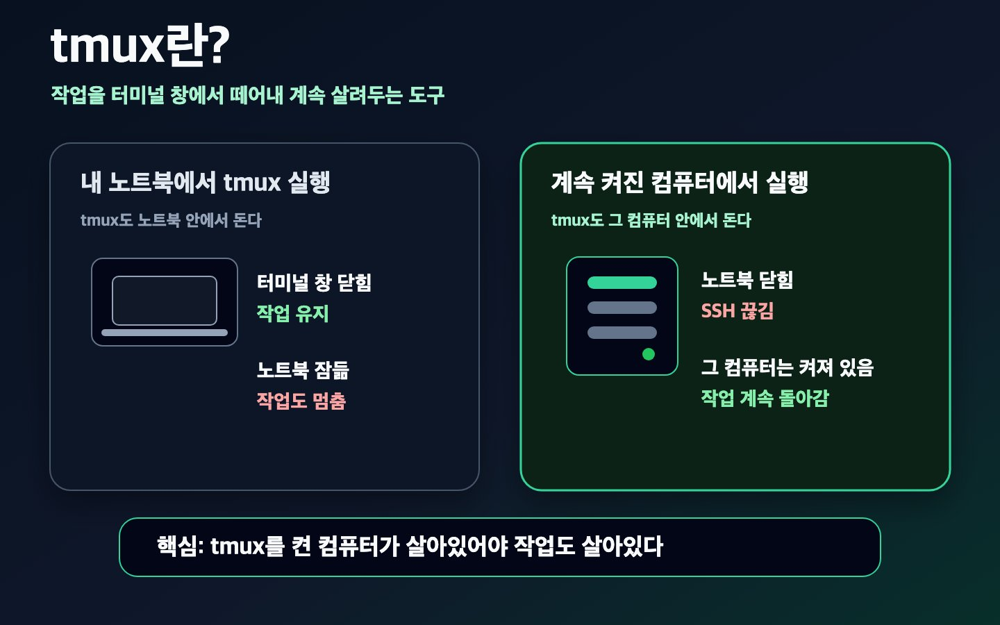

---


</details>

---


<details>
<summary><strong>vscode 확장 프로그램_ continue.</strong></summary>


continue 라는 확장프로그램을 사용중입니다.  
보통 vscode를 사용하면 깃허브 코파일럿 같은것을 사용하는데요.  
코드자동완성이나 코드추천기능이 좋아서 사용하지만  
무료로 제공되는것이 한계가 있어서 금방 한도가 차버립니다.

로컬LLM을 사용하면 ollama를 연동하여 continue에서 로컬llm이 코드자동완성과 추천기능을 제공합니다.  
물론 채팅창을 띄우고 작성한 코드에대해 설명을 듣거나 검사받고 고쳐주기도 합니다.

그래서 저는  
코드자동완성과 추천은 qwen2.5-coder:7b  
코드 관련 채팅은 qwen3.6:35b-a3b  
이렇게 쓰고 있는데, 느리거나 밀리는것없이 아주 자연스럽습니다.

---


</details>

---


<details>
<summary><strong>AI로 혼자 앱을 만들며 어디서 막히고 어떻게 고쳤는지 남긴 기록을 무료로 열어뒀습니다.</strong></summary>


프롬프트가 안 먹힐 때 실패 지점 보는 용도입니다.

[https://wikidocs.net/book/20452](https://wikidocs.net/book/20452)

---


</details>

---


<details>
<summary><strong>AI 시대, 대규모 차세대 SI는 어떻게 바뀔 것인가</strong></summary>


지금의 현실부터 냉정하게 짚어야 한다.   
300~500명이 투입되는 금융권·공공의 대규모 차세대 프로젝트에서는 클로드 코드나 코덱스 같은 유능한 외부 LLM을 사실상 쓰지 못한다.   
폐쇄망과 보안 규제, 개인신용정보 보호, 감사 추적성 요구가 겹겹이 얽혀 있어서, 소스코드 한 줄도 외부로 나갈 수 없는 환경이기 때문이다. 실제로 프런티어급 모델의 성능을 눈앞에 두고도, 현장은 여전히 사람 손으로 코드를 짜고 사람 눈으로 리뷰하는 노동집약 방식에 머물러 있다.

그러나 이 제약은 본질적으로 '규제와 인프라의 문제'이지 '기술의 문제'가 아니다.   
금융분야 망분리 개선 로드맵이 이미 발표됐고, 규제 샌드박스를 통해 생성형 AI 활용이 한 걸음씩 허용되고 있다. 격리된 온프레미스 sLLM의 성능도 빠르게 올라오고 있다.   
즉 지금의 벽은 시간이 해결해 줄 성질의 것이다. 

제약이 풀린다고 가정하고 미래를 상상하면, 대규모 차세대 SI의 모습은 다음과 같이 바뀔 것이다.

①개발표준·보안규정·레거시 소스·산출물을 구조화한 온톨로지 지식 파운데이션, 

②분석·설계 → 코딩 → 테스트·품질검증으로 이어지는 전문 에이전트 체계, 

③사전 정의된 기준으로 생성하고 검증하는 스펙 주도 개발(Spec-Driven Development), 

④COBOL을 Java로 분 단위에 바꾸는 레거시 모더나이제이션, 그리고 이 모두를 온프레미스 구축형으로 규제 산업에 이식하는 브라운필드 AI 전략으로 이뤄져 있다. 

이 골격을 미래로 연장하면 SI는 다섯 가지 축에서 근본적으로 달라질 것이다.

첫째, SI의 본질이 인력집약에서 지식집약으로 바뀐다. 

지금까지 차세대의 경쟁력은 "얼마나 많은 검증된 인력을 투입하느냐"였다. 앞으로는 프로젝트의 자산이 사람의 머릿수가 아니라 지식 파운데이션의 품질로 옮겨간다.   
고객사의 도메인·표준·레거시를 얼마나 정교하게 온톨로지화했는지가 곧 생산성과 품질의 상한을 결정한다. 이 자산은 프로젝트가 끝나도 사라지지 않고 운영(SM) 단계와 다음 과제로 재사용되며 복리로 증식한다.   
SI가 '일회성 구축'에서 '누적되는 지식 플랫폼의 운영'으로 성격 자체를 바꾸는 것이다.

둘째, 프로젝트의 첫 공정이 '분석·설계'가 아니라 'as-is 온톨로지화'가 된다. 

차세대의 진짜 난제는 신규 개발이 아니라 아무도 전체를 알지 못하는 as-is 레거시를 파악하는 일이다.   
착수 시점에 레거시 소스·DB·연계·실행 로그를 지식 파운데이션에 태우는 것이 1번 공정이 되고, 분석·설계 에이전트가 그 위에서 영향도와 업무 구조를 복원한다.   
그 결과 차세대 최대의 리스크였던 '이행 범위 산정 오류'가 초반에 상당 부분 흡수된다. 수 주씩 걸리던 레거시 분석·전환이 분 단위로 줄면서, 모더나이제이션은 별도 상품이 아니라 차세대의 기본 엔진이 된다.

셋째, 인간의 일이 '만드는 것'에서 '스펙을 쓰고 게이트를 지키는 것'으로 이동한다. 

스펙 주도 개발이 중심이 되면, 품질과 책임의 무게중심이 상류(스펙 정의)와 하류(검증·승인)로 뚜렷이 갈린다. 코드를 타이핑하던 중간층은 얇아지고, 대신 세 종류의 새로운 역할이 부상한다. 

요구·규정·아키텍처를 기계가 실행할 수 있는 스펙으로 번역하는 스펙 작성자, 지식 파운데이션을 큐레이션하고 검증하는 온톨로지·지식 엔지니어, 그리고 에이전트의 산출물을 감사·규제 관점에서 책임지고 통과시키는 품질 게이트키퍼다. 

인력 구조는 대량 코더가 가운데를 채우던 피라미드에서, 고급 인력이 허리를 이루는 다이아몬드형으로 재편된다. 개발자 단가를 낮추는 방향이 아니라, AI를 잘 다루는 더 높은 단가의 엔지니어·PL이 투입되는 방향이다.

넷째, 과금과 계약 모델이 맨먼스(M/M)에서 벗어난다. 

산출물의 대부분을 에이전트가 만든다면 "몇 명이 몇 개월"이라는 견적은 근거를 잃는다. 대신 스펙의 규모와 복잡도에 연동한 과금, 성과 기반 과금, 지식 파운데이션과 에이전트 파이프라인에 대한 플랫폼 구독형으로 이동한다. 

표준화된 쉬운 일은 범용 AI에 잠식되지만, 규제·레거시·연계가 얽힌 고난도 차세대는 오히려 브라운필드 방식의 해자가 깊어진다. 

SI 업체의 수익원이 '저난도 대량 물량'에서 '고난도 지식·플랫폼'으로 옮겨가는 것이다.

다섯째, 운영(SM)에 에이전트가 상주한다. 

구축이 끝나면 지식 파운데이션과 에이전트가 그대로 운영 환경에 남아 장애 원인 분석, 패치, 회귀 테스트를 상시 수행한다. 구축과 운영의 경계가 흐려지고, '차세대 오픈=종료'가 아니라 '지식 파운데이션이 계속 진화하는 상태'가 정상값이 된다.

물론 이 그림이 하루아침에 오지는 않는다.   
진짜 병목은 기술이 아니라 감사 추적성과 책임 소재다. 폐쇄망 온프레미스라 모델은 프런티어급이 아닌 격리된 sLLM이어서 성능에 상한이 있고, 에이전트가 만든 코드의 회귀 버그나 환각이 규제 감사에서 방어되려면 "왜 그렇게 판단했는지"에 대한 재현 가능한 로그와 인간 승인 이력이 반드시 남아야 한다.

 지식 파운데이션의 초기 구축 비용도 만만치 않아, 고객사의 거버넌스와 데이터 접근 승인 속도가 실제 도입 시점을 좌우한다. 그래서 확산은 3단계를 밟을 것이다. 

1단계는 리스크가 낮고 효과가 즉각적인 분석·이해와 레거시 파악 보조, 

2단계는 인간 검증을 전제로 한 코드 생성과 전환, 

3단계에 이르러서야 연계·이행까지 에이전트가 오케스트레이션하는 반 자율 SI다. 그중에서도 대고객 개인정보가 얽힌 영역은 망분리 규제 때문에 가장 늦게 열릴 것이다.

결국 미래의 대규모 차세대 SI는 "사람이 코드를 짜서 시스템을 만드는 일"에서 "사람이 지식과 스펙을 관리하고, 에이전트 군단이 그 위에서 시스템을 생성하고 검증하는 일"로 바뀐다.

경쟁력의 원천은 인력의 규모가 아니라 지식 파운데이션의 깊이로 이동한다. 지금 우리를 막고 있는 폐쇄망과 보안의 벽은 분명 실재하지만, 그것은 넘지 못할 벽이 아니라 시간이 낮춰 줄 문턱이다. 

그 문턱이 낮아지는 순간을 대비해 지금부터 레거시를 지식으로 구조화하고, 사람을 코더가 아닌 스펙·검증의 전문가로 준비시키는 조직이 다음 판을 가져갈 것이다.

---


</details>

---


<details>
<summary><strong>아이에게 AI를 제대로 가르쳐주고 싶다면, 이 무료 사이트부터 보여주세요</strong></summary>


[http://prompts.chat/kids](https://t.co/apMEu8SjNo)는 8~14세 어린이를 위한 프롬프트 학습 코스임.

어려운 용어도 없고,  
복잡한 프롬프트 템플릿도 없음.

로봇 `Promi`와 함께 스토리와 미니게임을 진행하면서  
AI에게 어떻게 질문하고, 원하는 답을 얻는지 자연스럽게 배움.

완전 무료, 오픈소스, 게임형 학습 방식.  
언어를 한국어로 바꿀 수도 있음.

AI 시대에서 가장 먼저 필요한 건  
AI와 제대로 대화하는 법일지도.

[https://prompts.chat/kids](https://t.co/sfP91rw7EZ)

---


</details>

---


<details>
<summary><strong>생성형 ai에게 지능이란 뭐게?</strong></summary>


1. 팩트를 사용자에게 제시하는 능력
2. 사용자가 속을 정도로 그럴 듯한 답변을  
제시하는 상상력과 추론 능력

둘중 뭐게?  
정답은 바로 2번.

생성형 ai는 이름 그대로 상상력과 추론능력을 바탕으로 결과물을 생성하는 능력을 가진 ai임 그래서 결과물의 팩트판단은 인간의 영역인거래

생성형 ai의 본질은 끊임없이 상상하고 추론하고 공감하는 거지 팩트와는 무관하대

**AI는 비어있는걸 채우는거에 능력이 있음  
이걸 어떻게 잘 채우게 제어하는게 관건**

---


</details>

---


<details>
<summary><strong>AI를 한 번도 안 써본 사람도 곧 AI를 쓰게 될지도 모르겠습니다.</strong></summary>


정부가 추진하는 ‘모두의 AI’가  
연내 베타를 거쳐 12월 정식 출시를 목표로 하고 있습니다.

국민 누구나 무료로 사용할 수 있는  
국산 범용 AI 서비스입니다.

처음에는 챗봇 형태로 시작하고,

내년부터는  
자산관리, 학습 코칭, 노후 설계처럼  
생활을 돕는 AI 에이전트까지 확대할 계획이라고 합니다.  
이미 한국은 생성형 AI 이용률 증가 속도가  
세계에서 가장 빠른 시장 중 하나입니다.

이제 관심은 AI를 누가 만들었는지보다,  
수천만 명이 사용할 서비스를 누가 운영하게 될까요? 투자 관점으로 접근해도 흥미롭습니다.

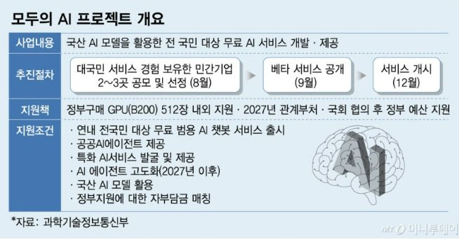

---


</details>

---


<details>
<summary><strong>카파시 형님이 말한 진짜 LLM 활용법인데 이거 진짜 공감됨다</strong></summary>


LLM한테 일을 잘 시키려면  
프롬프트를 잘 작성하는 것도 중요하지만

가끔은 그냥 음성 켜고  
10분 동안 머릿속에 있는 걸 막 떠드는 게  
훨씬 잘 먹힐 때가 있슴다

정리 안 된 생각  
중간에 바뀌는 목표  
애매한 감정  
이상한 예시  
다 같이 던져도 됨다

오히려 LLM은 그런 긴 횡설수설을 받아서  
“아 이 사람이 진짜 원하는 건 이거구나”  
하고 꽤 잘 재구성해줌다

저도 요즘 느끼는 게  
AI를 잘 쓰는 사람은

자기 머릿속 맥락을  
AI한테 많이 주입시키는 사람에 가까운 것 같슴다

생각이 정리돼야 AI를 쓰는 게 아니라  
AI랑 떠들다 보면 생각이 정리되는 거쥬

형님들도 막힐 때  
프롬프트 짜려고 너무 힘주지 말고

그냥 음성 켜고  
“지금부터 횡설수설할게”  
하고 5분만 떠들어보십쇼

생각보다 AI가 내 머릿속보다 내 생각을 더 깔끔하게 정리해줌다 ㄷㄷ

LLM과 함께 일할 때 유용하다고 생각하는 한 가지 패턴은 길고 느슨한 수다 세션입니다. 때때로 LLM은 당신이 이루려는 것을 이해하려면 더 많은 비트가 필요하지만, 당신은 그것들을 입력하기 너무 게으릅니다. 이런 경우에 저는 의자에 기대고, /voice로 전환한 뒤 그냥 10분 정도 수다를 떨며, 완전 엉망으로, 뭐든지 가는 풀 스트림 오브 컨셔스니스입니다. 때때로 맨 위에 선언하죠, "음성 인식으로 전환합니다 오타 죄송해요..." 같은 식으로요. 때때로 몇 턴 정도의 작은 인터뷰로 바꾸기도 합니다. 하지만 LLM들이 긴 비논리적인 수다를 재구성하는 데 어딘가 매우 능숙하다는 걸 알게 됐고, 종종 당신의 생각 덩어리에 대한 그들의 에코가 시작했던 것보다 훨씬 더 깔끔하게 나옵니다. 그 결과로 마음의 융합이 개선되고, 그 시점부터 수정할 게 훨씬 줄어듭니다.

---


</details>

---


<details>
<summary><strong>회사 일부터 AX 고민해보고 그걸 토대로 밖에서 사업을 강구하는게 좋은 방향</strong></summary>


코드 몇 줄짜리 터미널에서 실행하는 걸  
에이전트 대신 시키는건 AX라고 하면.... 듣는 사람 속터짐

생각보다 사람들 겁나 헤맴  
에이전트 에이전트 외치지만 그래서 뭐하지? 하는게 대부분임

사람은 시각으로 돌아가는데  
LLM은 글자로 돌아감

자동화가 잘되고 있는 분야들을 보면

1. 자료가 많고
2. 텍스트로 변환해도 데이터를 잃지 않는 분야라고 봄

---


</details>

---


<details>
<summary><strong>API와 MCP, 헷갈리시나요?</strong></summary>


정상이에요. 둘 다 “무언가를 연결한다”는 점에서는 비슷하거든요.

API는 Application Programming Interface.  
서비스끼리 기능과 데이터를 주고받는 연결 방식입니다.

MCP는 Model Context Protocol.  
AI가 파일, DB, 외부 도구를 일정한 방식으로 사용할 수 있게 해주는 규칙입니다.

쉽게 말하면,

API = 기능을 제공하는 창구  
MCP = AI가 여러 창구를 이용하게 해주는 공통 규칙

이 정도로 이해하고 있어도 바이브코딩할 때 크게 불편하지 않습니다.

---


</details>

---


<details>
<summary><strong>&quot;AI가 내 일을 대체하면 어쩌지&quot; 불안한 개발자에게 딱 한 편의 글만 권한다면, 오늘은 이 글입니다.</strong></summary>


백엔드에서 AI 풀스택으로 방향을 튼,  
같은 불안을 통과하는 주니어 개발자의 기록입니다.

🔖좋았던 문장들.

1. "마치 어떤 마법이 나올지 모르는 지팡이를 들고, 각자의 주문을 외우며 무언가를 만들어내는 기분이다."
2. "전이었다면 하루 종일 붙잡고 있었을 문제를 인공지능이 몇 분 만에 풀어내는 모습을 볼 때면, 짜릿하면서도 이상하게 허무하다."
3. "가만히 있을 수는 없었다. 세상이 바뀌는 속도는 너무 빨랐고, 나는 그 변화가 지나가길 기다릴 만큼 여유롭지 않았다."
4. "미래를 막연하다고 느끼는 것이 꼭 내가 무능하다는 뜻은 아닐지도 모른다. 시대가 정말로 예측하기 어려워졌다는 말일 수도 있다."
5. "인공지능이 코드를 쓰는 시대에도, 결국 누군가는 문제를 정의해야 한다."

불안이 자연스러운 시대라면, 멈추는 대신 다시 쓰일 자리를 찾아가면 됩니다. 🐾 오늘도 검은 화면 앞에 앉는 우리 개발자들, 화이팅


</details>

---


<details>
<summary><strong>우리 개발자들, 이제 어떻게 해야 해?</strong></summary>


> **인공지능 시대 앞에 선 주니어 개발자의 기록**  
> 

까만 화면 위로 문장이 한 글자씩 떠오른다.

나는 그 앞에 앉아 요구사항을 적었다가 지우기를 반복한다. 원하는 동작을 설명하고, 예외 상황을 덧붙이고, 기존 코드의 맥락을 알려준다. 그러면 에이전트가 코드를 작성한다. 눈으로 결과물을 훑고, 또 다른 에이전트로 검수한 다음, 부족한 부분을 다시 요구사항으로 정리해 요청한다.

이제 이런 방식은 내게 낯선 실험이 아니라 일상이다.

2026년에 소프트웨어 엔지니어로 일한다는 것은 참 이상한 경험이다. 우리는 오랫동안 예측 가능한 세계에서 일한다고 믿어왔다. 코드는 입력에 따라 정해진 결과를 내고, 버그에는 원인이 있으며, 그런 시스템은 논리적으로 설명될 수 있어야 한다고 배웠다.

그런데 지금 우리 손에는 비결정론적인 도구가 쥐어져 있다. 같은 요청에도 매번 조금씩 다른 결과를 내놓는 도구, 정확히 어떤 답을 줄지 알 수 없지만 놀라운 속도로 결과물을 만들어내는 도구. 마치 어떤 마법이 나올지 모르는 지팡이를 들고, 각자의 주문을 외우며 무언가를 만들어내는 기분이다.

우리는 이제 어떻게 해야 할까. AI가 코드를 쓰고, 도구가 판단을 돕고, 어제의 상식이 오늘 흔들리는 시대에 개발자는 어디에 서 있어야 할까. 여전히 우리에게 필요한 자리는 어디일까.

# **흔들린 믿음**

불과 1, 2년 전만 해도 이런 방식으로 일할 줄은 상상하지 못했다. 예전 같았으면 직접 파일을 열고, 코드를 읽고, 한 줄씩 수정했을 것이다. 하지만 지금은 먼저 요구사항을 쓴다. 직접 작성하기보다, 코드가 만들어지도록 지시하고 검토하는 시간이 더 많아졌다.

이제 막 이 업계로 들어오려는 후배들에게 나는 무엇을 조언할 수 있을까. 자료구조와 알고리즘을 공부하라고 말해야 할까. 운영체제와 네트워크, 데이터베이스 같은 컴퓨터 과학의 기본기를 깊게 익히라고 말해야 할까. 물론 이 모두가 여전히 중요하다고 믿고 싶다. 그러나 예전처럼 확신에 차서 말하기는 어려워졌다. “AI를 제대로 쓰려면 개발자도 그만큼의 지식을 갖춰야 한다”는 전제가 우리 사이를 이어줬지만, 시간이 지날수록 그 전제마저 흔들리고 있다.

이제는 한두 줄의 프롬프트만으로도 보안 취약점을 점검하고, 테스트 코드를 만들고, 리팩터링 방향을 제안받을 수 있다. 고급 해커 수준의 지식을 갖추지 않아도 AI의 도움을 받아 코드의 보안을 살필 수 있는 시대가 온 것이다. 물론 그 결과를 이해하고 책임지는 일은 여전히 사람에게 남아 있다. 하지만 적어도 “깊은 지식이 있어야만 AI를 제대로 활용할 수 있다”는 말은 더 이상 절대적인 방어선처럼 느껴지지 않는다.

고용주들의 기대도 달라지고 있다. AI를 통한 생산성 향상은 이미 업계 전반에서 눈에 보이는 성과로 나타났고, 적은 시간에 더 많은 결과물을 요구하는 분위기는 점점 강해지고 있다. 이런 상황에서 “Back to Basic”을 외치며 다시 모든 코드를 한 줄씩 직접 작성하던 시절로 돌아가자 말할 수 있을까. 쉽지 않다. 이미 AI 도구는 우리 일의 방식 안으로 깊숙이 들어와 버렸다.

사람이 짠 코드는 다르다고, 복잡한 맥락을 이해하고 책임질 수 있는 것은 결국 인간 엔지니어뿐이라고 믿고 싶다. AI가 코드를 만들 수는 있어도, 진짜 엔지니어링은 쉽게 대체되지 않을 것이라고도. 그러나 이 믿음도 점점 흔들리고 있다.

돌이켜보면 인간이 작성한 코드가 언제나 훌륭했던 것은 아니었기 때문이다. 모든 개발자가 좋은 코드를 썼던 것도 아니고, 모든 시스템이 아름다운 설계 위에 세워졌던 것도 아니다. “작동하면 건드리지 마라”는 말이 있었고, “레거시에는 이유가 있다”는 말도 있었다. 그 말들 뒤에는 수많은 타협과 임시방편, 그리고 누구도 쉽게 설명하지 못하는 코드들이 숨어 있었다.

그렇다면 사람의 코드와 AI의 코드는 정말 얼마나 다른가. AI가 만든 결과물을 그대로 믿을 수는 없다. 검토도 필요하고, 책임도 결국 사람에게 남는다. 하지만 적어도 “사람이 만들었기 때문에 더 낫다”는 말은 더 이상 충분한 방어선이 되지 않는 듯하다. 인간의 코드도 애초에 불완전했고, AI는 빠르게 그 불완전함의 영역을 침범하고 있다.

# **어떻게든 살아남아야지**

이 격랑의 시대에서, 고작 주니어 엔지니어인 나는 어떤 선택을 해야 했을까.

얼마 전, 나는 이직을 했고, 백엔드 엔지니어에서 인공지능을 다루는 풀스택 엔지니어로 직무를 전환했다.

그것이 정답이었다고 말할 수는 없다. 다만 한 가지는 분명했다. 가만히 있을 수는 없었다. 세상이 바뀌는 속도는 너무 빨랐고, 나는 그 변화가 지나가길 기다릴 만큼 여유롭지 않았다. AI가 개발자의 일을 대체할지도 모른다는 불안, 내가 쌓아온 개발 경험이 어느 순간 낡은 기술이 될지도 모른다는 두려움, 지금 공부하는 것들조차 몇 년 뒤에는 의미를 잃을지도 모른다는 허무함이 계속 나를 흔들었다.

전통적인 웹 서비스 산업의 포지션에 그대로 머물러 있다면, 앞으로의 변화 속에서 오래 살아남기 어렵겠다는 생각이 컸다. 물론 웹 서비스 자체가 사라진다고 본 것은 아니다. 여전히 세상의 많은 문제는 웹의 형태로 사용자에게 전달된다. 사람들은 미래에도 로그인하고, 데이터를 저장하고, 결제하고, 검색하고, 알림을 받을 것이다. 그 모든 흐름에는 앞으로도 여전히 백엔드가 필요할 것이다.

하지만 이 문제들을 푸는 방식은 급격히 달라지고 있다. 예전에는 기능을 정의하고, API를 만들고, 데이터베이스를 설계하고, 서버를 운영하는 능력이 중시되었다. 그러나 이제는 요청을 단순히 처리하는 것을 넘어, 사용자의 의도를 해석하고, 적절한 도구를 호출하고, 여러 시스템을 연결해 결과를 만들어내는 흐름이 점점 중요해지고 있다. 그 변화의 중심에 인공지능이 있다고 느꼈다.

그래서 제대로 공부해야겠다고 생각했다. 단순히 도구를 잘 쓰는 사람이 아니라, 인공지능이 전통적인 서비스와 어떻게 상호작용하는지, 어떤 한계를 가지고 있는지, 어떻게 안전하게 쓰일 수 있는지 이해하는 사람이 되고 싶었다. 그 연장선에서 대학원 지원도 준비하고 있다. 회사에서 마주하는 문제만으로는 부족하다고 느꼈고, 조금 더 깊게 이 분야를 들여다보고 싶었다.

그렇다고 두려움이 사라진 것은 아니었다. 학생 때부터 꿈꿔왔던 백엔드 분야의 스페셜리스트가 되겠다는 목표를 포기하는 것이 맞을까. 다양한 분야를 다루는 제너럴리스트가 되겠다는 새로운 목표는 몇 년 뒤에도 의미가 있을까. 나는 여전히 이런 생각들 앞에서 자주 멈춰 선다.

# **막연한 미래 너머**

학생 시절의 나는 개발자의 미래를 꽤 단순하게 상상했다. 회사에 들어가 좋은 선배에게 배우고, 실력을 쌓고, 언젠가는 능숙한 시니어 개발자가 되는 것. 새로운 기술이 나오더라도 기본기를 잘 다져두면 따라갈 수 있을 것이라고 믿었고, 이 믿음은 오랫동안 나를 지탱해주었다.

하지만 지금은 이 믿음이 조금은 부서졌다.

몇 년 전만 해도 직접 코드를 작성하는 것이 성장의 중요한 증거처럼 느껴졌다. 어려운 버그를 해결하고, 복잡한 로직을 구현하고, 성능을 개선하는 경험이 실력의 기반이라고 생각했다. 그런데 이제 나는 이 일들의 상당 부분을 인공지능과 함께 처리한다. 전이었다면 하루 종일 붙잡고 있었을 문제를 인공지능이 몇 분 만에 풀어내는 모습을 볼 때면, 짜릿하면서도 이상하게 허무하다.

분명 생산성은 높아졌다. 하지만 생산성이 높아진 만큼, 나의 역할에는 더 자주 의문이 든다.

이제 우리는 무엇을 잘해야 할까. 코드를 빠르게 작성하는 능력, 인공지능에게 좋은 지시를 내리는 능력, 서비스 전체를 설계하는 능력이 전부일까. 혹은 도메인을 이해하고, 사용자 문제를 정의하는 능력이 최고일까.

답은, 아마도 전부를 잘해내야 한다는 것이다.

그래서 더 어렵다. 예전에는 공부해야 할 것이 많아도 어느 정도 순서가 있었다. 예컨대 언어를 배운 다음에는 프레임워크를 익히고, 데이터베이스를 공부하고, 배포와 운영을 경험하는 식이었다. 그런데 지금은 모든 것이 순서 없이 쏟아져 들어오는 것 같다. 백엔드도 해야 하고, 클라우드도 알아야 하고, 인공지능도 알아야 하고, 보안도 알아야 하고, 제품 감각도 필요하다고 한다. 여기에 매주 새로운 도구와 프레임워크가 등장한다.

무언가를 놓치고 있다는 생각. 지금 따라가지 않으면 영영 뒤처질 것 같다는 두려움. 이런 생각들은 나를 계속 움직이게 하지만, 동시에 갉아먹기도 한다.

하지만 요즘은 다르게 생각하려 한다. 미래를 막연하다고 느끼는 것이 꼭 내가 무능하다는 뜻은 아닐지도 모른다. 시대가 정말로 예측하기 어려워졌다는 말일 수도 있다. 지금 공부하는 기술이 5년 뒤에도 같은 형태로 남아 있을지는 아무도 모른다. 지금 유망해 보이는 직무가 몇 년 뒤에도 같은 이름으로 존재할지도 확실하지 않다. 그러니 불안한 것은 자연스러운 일일지 모른다.

기술은 계속 바뀐다. 도구도 계속 바뀐다. 어쩌면 지금 우리가 열심히 익히는 많은 것들이 몇 년 뒤에는 다른 이름으로 불릴지도 모른다. 하지만 문제를 정의하고, 맥락을 이해하고, 결과에 책임지려는 태도는 쉽게 사라지지 않을 것이다.

나는 이 믿음만은 아직 놓고 싶지 않다.

# **마치며**

우리는 이제 어떻게 해야 할까?

이 질문에 자신 있게 답할 수 있는 사람은 많지 않을 것이다. 새 시대에 대해 말하는 사람은 많지만, 아직 그 시대를 정확히 살아본 사람은 없다. 모두가 변화의 한복판에 서 있고, 각자의 방식으로 살아내고 있다.

나 역시 그렇다. 백엔드 엔지니어에서 풀스택 엔지니어로 방향을 틀었지만, 이 선택이 완벽한 답이라고 말할 수는 없다. 대학원에 지원하고, 인공지능을 공부하고, 새로운 도구를 익히려 하지만, 이 길이 어디로 이어질지 확신하지 못한다.

그래도 되뇌인다. 변화를 외면하지 말자. 하지만 내가 쌓아온 것을 버리지도 말자. 대신 그것을 새로운 시대와 연결해보자.

백엔드를 해왔으니, 나는 그 경험 위에 인공지능을 얹을 수 있다. 어쩌면 인공지능 시대의 개발자에게 필요한 것은 자기 경험을 잃지 않고, 변화하는 기술과 연결해 다시 쓸 수 있는 능력일지 모른다 믿고 말이다. 인공지능이 코드를 쓰는 시대에도, 결국 누군가는 문제를 정의해야 한다. 누군가는 결과를 책임져야 한다. 누군가는 이용자의 불편함을 발견하고, 기술을 통해 상상을 현실로 만들어내야 한다. 나는 그 자리에 우리가 여전히 필요하다고 믿고 싶다.

지금의 나 역시 할 수 있는 말은 대단치 않지만, 그래도 전하고 싶다.

사라질까 두려워 멈추기보다, 변화하는 세상 속에서 우리가 다시 쓰일 자리를 찾아가자고. 우리 모두 결국에는 그 일을 함께 해낼 것이라고.

---


</details>

---


<details>
<summary><strong>AI 프롬프트 넣을때 왼쪽처럼 명령하면 안되고 오른쪽으로 해야 결과물 잘 나온대</strong></summary>


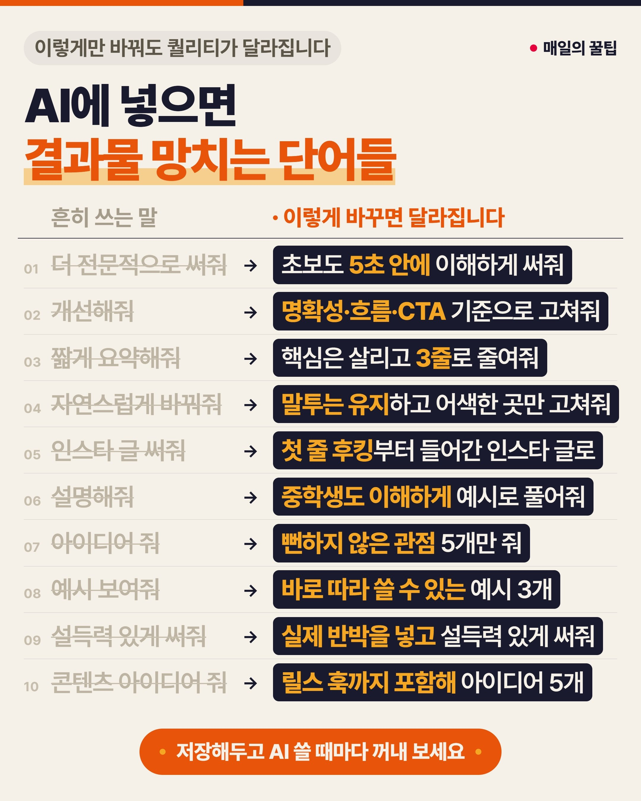

---


</details>

---


<details>
<summary><strong>AI 출력을 마크다운이 아니라 HTML로 하는 게 더 좋다는 설에 대해,</strong></summary>


처음에는 나도 "아니야, 구조화된 문서라면 별로 다를 거 없을 텐데"라고 생각했지만, 실제로 해보니 확실히 HTML 쪽이 표현력이 높고, 현재 병목 현상 중 하나인 인간의 인지 부하를 줄일 수 있다면 이라는 이유로, 요즘은 설계를 전부 artifact에 UL 시키고 있다.

회사 내부 테크 토크에서 "모두 HTML 출력하고 있고, 개발용 도구도 통합해놨어요"라고 여러 데모를 보여주며 이야기했더니, 바로 "지금까지 Markdown만으로도 충분하다고 생각해서 안 써봤는데..."라는 반응을 받았고, 다음 주 테크 토크에는 "바로 HTML 활용해봤어요!"라는 반응도 받았어요.

회사 내부 SNS에서도 지속적으로 발신하고 있었지만, 실제로 직접 눈으로 보는 것까지는 평가할 수 없구나, 라는 걸 개인적으로 아주 큰 배움으로 삼았어요.

---


</details>

---


<details>
<summary><strong>AI한테 &quot;본론부터 말해&quot;를 스킬로 박아두는 법</strong></summary>


코딩 시킬 때 AI가 정작 답은 저 아래 묻어두고 빙빙 돌 때 있죠  
i-have-adhd 스킬을 깔면 AI가 서론·군더더기 빼고 할 일부터 전달하게 합니다

■ 뭐가 바뀌냐면

- "좋은 질문이에요, 한번 볼게요" 같은 서론 없이 바로 실행할 명령부터
- 여러 단계 작업은 번호로 정리
- 끝맺음은 "다음에 뭐 하면 되는지" 딱 한 줄
- 리스트는 5개까지만, 곁길로 새는 얘기는 차단
- "도움이 되었으면 좋겠어요!" 같은 맺음말도 없음

■ 왜 편하냐면

- 답을 찾으려고 긴 설명을 스크롤할 일이 줄어요
- Claude Code·Codex 등에 명령어 두 줄이면 설치 끝
- 마음에 안 드는 규칙은 포크해서 고쳐 쓰면 돼요
- 무료 오픈소스(MIT)예요

[https://github.com/ayghri/i-have-adhd](https://github.com/ayghri/i-have-adhd)

---


</details>

---


<details>
<summary><strong>파이콘 코리아 2026 “로컬 LLM 으로 AI 에이전트 구현” 자료</strong></summary>


간단하면서도 핵심을 잘 짚어주셔서  
몇 가지 기억에 남는 장표는  
이미지로 붙여 넣었습니다

직접 따라해 보시는 것 추천!

[https://github.com/charsyam/pycon2026-tutorial-ai-agents/blob/main/pycon2026.pdf](https://github.com/charsyam/pycon2026-tutorial-ai-agents/blob/main/pycon2026.pdf)

---


</details>

---


<details>
<summary><strong>AI 시대 테스트를 어떻게 설계해야 하는가?</strong></summary>


- 구현이 아닌 동작을.
- Mock은 시스템 경계에서만.
- 통합 테스트의 검증력을 단위 테스트만큼 중시
- 테스트가 Green이라는 사실만으로 충분하다고 믿지 않음
- AI의 구현과 검증을 분리해 Independent Verification을 둠

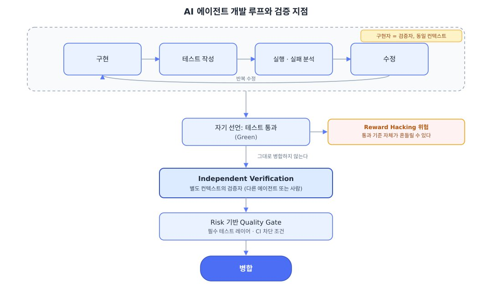

[AI 시대 테스트를 어떻게 설계해야 하는가? | Mimul Tech blog](https://www.mimul.com/blog/ai-test-rule/)

---


</details>

---


<details>
<summary><strong>2026년 프로그래밍에서 중요한 5가지:</strong></summary>


① 만드는 제품을 잘 알아야 한다  
② 다른 사람의 코드를 읽고 이해할 줄 알아야 한다  
③ AI의 환각을 감지할 줄 알아야 한다  
④ "이건 병합하지 말아야 해"라고 판단할 기준이 있어야 한다  
⑤ 무엇을 했고 왜 했는지 잘 전달할 줄 알아야 한다

---


</details>

---


<details>
<summary><strong>“AI 안 썼다”는 건 좀 과장 같습니다.</strong></summary>


코드 생성엔 어느 정도 썼고, 다만 통째로 넘긴 뒤 전 줄을 검수하는 구조를 피한 거 아닌가 싶네요. 오히려 AI가 만든 부분은 사람이 적극적으로 리뷰했다는 쪽으로 읽힙니다.

리뷰 방식도 추측해보면, 사람이 한 줄씩 눈으로 훑기보다는 기존 컴파일러의 방대한 테스트 스위트를 그대로 돌려서 원본과 출력이 일치하는지로 걸러냈을 것 같습니다. 즉 “코드를 리뷰”했다기보다 “동작을 대조”하는 쪽에 가깝고, 차이가 나는 지점만 사람이 파고드는 식이었겠죠.

실제로 지금은 테스트 작성이나 이슈 1차 대응에 AI를 적극적으로 쓴다고 본인이 말하기도 했고요. 결국 “AI 거부”가 아니라 “AI를 활용해 검증할 표면적을 줄이는 설계”에 가까운 얘기로 보입니다.

원본 컴파일러 코드를 분석해서 어떻게 리뷰했을지를… 단서들을 정리해서 이 부분을

[https://github.com/leaf-kit/book-verify-ai-code](https://t.co/tUNWhBiB7b)

에서도 한번 다뤄보려고 생각중이에요.

---


</details>

---


<details>
<summary><strong>AI글을 사람 글처럼 만드는 스킬</strong></summary>


[https://github.com/epoko77-ai/im-not-ai](https://github.com/epoko77-ai/im-not-ai)

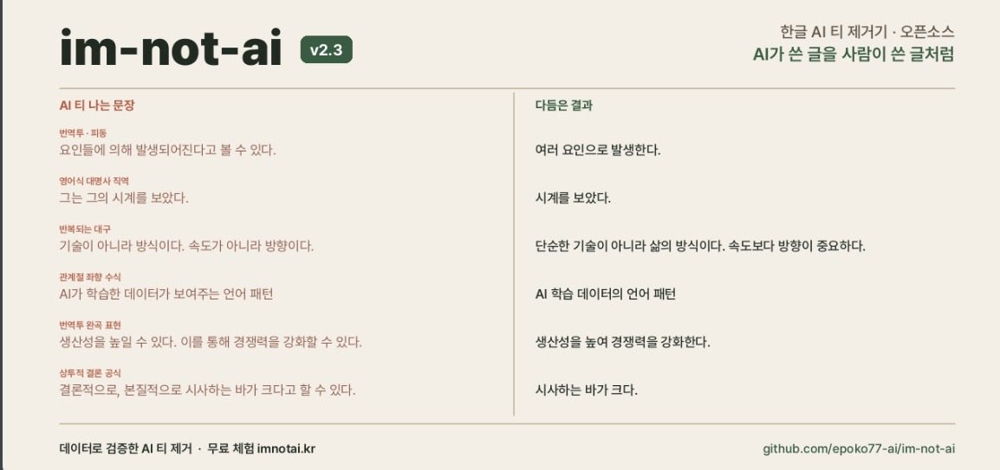

---


</details>

---


<details>
<summary><strong>AGENTS.md 대 SKILL.md 차이점이 뭐지?</strong></summary>


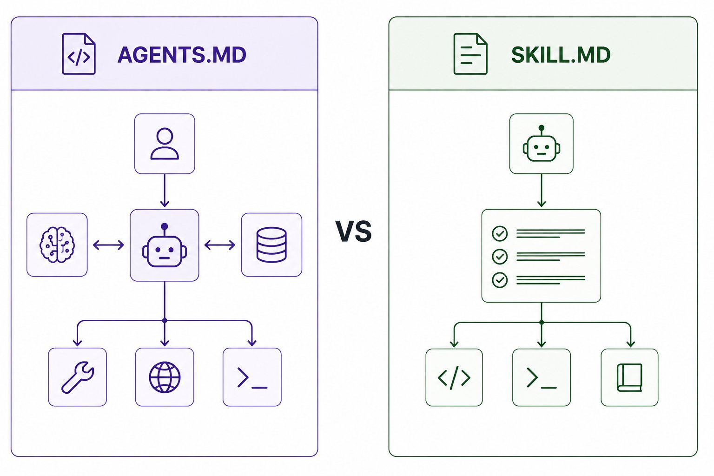

그들은 서로 다른 문제를 해결합니다...  
저는 최근 우리 프로젝트에서 이것을 실제로 탐구하고 있었는데, 특히 Cursor 내부의 [AGENTS.md](http://agents.md/) 파일에서, 그리고 그곳에서 그 구분이 제게 더 명확해졌습니다...

AGENTS.md → AI에게 프로젝트에서 어떻게 작동할지 알려줍니다  
코딩 규칙, 아키텍처 규칙, 명령어, 제약 조건 등.  
SKILL.md → AI에게 특정 작업/스킬을 수행하는 방법을 알려줍니다  
특정 작업을 위한 재사용 가능한 워크플로우, 지침, 도구, 단계.

이를 다음과 같이 생각해보세요  
AGENTS.md = 여기서 어떻게 행동해야 하는지.  
SKILL.md = 이 특정 작업을 수행하는 방법.

그것들은 대안이 되는 대신 서로를 보완할 수 있습니다.

---


</details>

---


<details>
<summary><strong>IT 엔지니어가 정말로 힘들어지는 건 이제부터야…</strong></summary>


전환기의 지금은 "일이 사라질 거야~~"라고 말하면서도, AI를 제대로 다루면 업무가 쑥쑥 진행되고, 능력도 업그레이드되는 느낌이 들어서 재미있어

AI를 거부하면 그 순간 진짜로 일이 사라지니까, 거부한다는 선택지가 없어

점점 부가가치의 원천이 코딩과 AI 활용 능력에서  
도메인 지식, 매니지먼트, 영업력, 센스 등으로 옮겨가면서, 힘들어지는 사람이 늘어날 거야

코드를 못 짜는 사람이 본격적인 소프트웨어를 만들어서 세상에 받아들여지는 걸 보고  
"저런 건 장난감이야""코드를 못 짜는 사람이 만든 건 결국…" 같은 식으로 간접적으로 거부 반응이 나오거나 할 거라고 생각해

---


</details>

---


<details>
<summary><strong>넥슨이 개발자 채용에서 코딩 테스트를 없앴습니다.</strong></summary>


대신 생긴 건 ‘AI 활용 역량 평가’.

AI를 활용해 실제 업무와 비슷한 문제를 풀게 합니다.

결과만 보는 것도 아닙니다.

문제를 어떻게 정의했는지,  
AI에게 어떻게 지시했는지,  
결과를 어떻게 검증했는지까지 봅니다.

CJ올리브영도 기존 라이브 코딩 대신  
‘AI 과제’를 도입했습니다.

개발자 채용 기준이 정말 바뀌는 것 같습니다.

예전:  
“이 알고리즘을 직접 구현해보세요.”

지금:  
“AI 써도 됩니다. 이 문제를 해결해보세요.”

그럼 다음 개발자 면접에서 가장 중요한 능력은

코딩 실력일까요?  
AI를 다루는 실력일까요?  
아니면 AI가 틀렸다는 걸 알아채는 실력일까요?

---


</details>

---


<details>
<summary><strong>데이터 사이언티스트 vs AI 엔지니어</strong></summary>


다른 포지션, 같은 목표  
문제를 해결하는 방식이 다릅니다.

🔵 데이터 사이언티스트

- SQL → 데이터 조회·정리  
• Pandas → 데이터 분석·조작  
• Python → 분석·모델링  
• Jupyter → 코드 실행·분석  
• Scikit-learn → 머신러닝 모델  
• Tableau·Power BI → 시각화·인사이트  
• A/B Testing → 가설 검증  
• Statistics → 데이터 분석·추론

👉 데이터를 분석해  
비즈니스 인사이트를 찾는 사람

🟢 AI 엔지니어

- Prompt → AI 결과 최적화  
• Vector Database → 데이터 검색·저장  
• RAG → 검색+생성으로 정확도 향상  
• APIs·Tools → 외부 기능 연결  
• Guardrails → AI 안전·품질 관리  
• Evals → AI 성능 평가·개선  
• Agent Orchestration → 복잡한 작업 자동화  
• Context Window → AI가 처리할 정보 범위 관리

👉 LLM과 도구를 활용해  
지능형 제품을 만드는 사람

결국 둘 다 목표는 같습니다.

데이터 사이언티스트는  
‘데이터에서 답을 찾고’

AI 엔지니어는  
‘AI로 답을 만들어냅니다.’

---


</details>

---


<details>
<summary><strong>AI랑 코딩하다 보면 말투가 점점 이상해집니다.</strong></summary>


처음엔 “이 기능 만들어줄래?”

몇 달 뒤

“딴 데 건드리지 마.”  
“시키는 것만 해.”  
“왜 마음대로 바꿨어?”  
“아까 말했잖아.”

그러다 문득 깨닫습니다.

회사에서 제일 싫어했던  
상사 말투 그대로 하고 있음.

AI가 개발자를 대체한 게 아니었음.

나를 부장님으로 승진시킴 ㅋㅋㅋ

---


</details>

---


<details>
<summary><strong>AI가 해결한 것들: 코드 작성 AI가 해결하지 못한 것들:</strong></summary>


- 어떤 코드를 작성해야 할지 아는 것
- 엔지니어링
- 제품 디자인
- 요구사항 수집
- 수집 후 변경되는 요구사항
- 이해관계자들
- "갑자기 생각난 아이디어가 있어요"라고 말하는 이해관계자
- 추정
- 추정에 대한 미팅
- 미팅에 대한 미팅
- 것에 이름 짓기
- 캐시 무효화
- 오프-바이-원 오류
- 스테이징 환경
- 지금 DNS가 하는 일
- Jira
- 2023년부터 "진행 중" 상태인 티켓
- 실제로는 자아에 관한 코드 리뷰 코멘트
- 인턴의 강제 푸시
- 시간대
- 날짜 전반
- 프린터

---


</details>

---


<details>
<summary><strong>나는 왜 AI를 써도 야근 중인 걸까? ㄷㄷ</strong></summary>


1. AI가 내 업무를 알아서 다 해줄 거라 믿었지만, 현실은 AI가 쏟아낸 결과물을 수습하고 다듬느라 야근 중임.
2. 찰떡같은 답변을 얻으려고 프롬프트(명령어)를 이리저리 깎고 수정하다 보면 어느새 한두 시간이 훌쩍 날아감.
3. 가장 큰 비극은 상사나 회사의 기대치가 미친 듯이 높아졌다는 점임. (회사 늙크크들 기대치 한도 초과)
4. "AI 쓰면 금방 하잖아?"라며 과거 대비 2~3배 많은 업무량과 퀄리티를 당연하다는 듯이 요구함.
5. 초안은 AI가 10초 만에 써주지만, 그걸 우리 회사 상황에 맞게 '사람의 언어'로 윤문하는 '마지막 1인치'는 오롯이 내 몫임.
6. 그럴듯해 보이지만 사실이 아닌 말(할루시네이션)을 섞어 놓기 때문에, 팩트 체크하느라 구글링을 두 배로 해야 함.
7. 게다가 회사 기밀이나 고객 개인정보는 보안상 AI에 함부로 입력할 수 없어서, 결국 중요한 실무는 내 손으로 다 해야 함.
8. 챗GPT, 클로드 등 자고 일어나면 쏟아지는 새로운 AI 툴 사용법을 공부하는 것 자체가 또 다른 스트레스이자 추가 업무가 됨.
9. 결과적으로 AI는 내 노동 시간을 줄여준 게 아님.

기술이 발전할수록 1인당 쳐내야 하는 업무의 기준점 자체가 올라가 버린 느낌이라 더 힘듬. 특히나 회사 늙크크들이 밑도 끝도 없이 AI 하자고 하니까 더 힘듬.

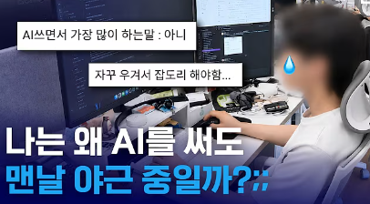

---


</details>

---


<details>
<summary><strong>📌 트렌드를 따라가려면 낱말의 뜻보다 먼저 알아야 할 것, 자리</strong></summary>


인공지능 소식은 매주 쏟아지는데, 왜 따라갈수록 뒤처지는 느낌일까요.

1. 새로 나온 걸 부지런히 찾아보는 게 잘못됐다는 얘기는 아니에요. 다만 뜻은 검색이 주고 자리는 안 주죠. 낱말이 쌓여도 지도가 없으면 흩어지거든요.
2. 트렌드를 안다는 건 최신 이름을 많이 아는 상태를 말하는 게 아니에요. 새 이름이 나왔을 때 이게 어느 층의 이야기인지 바로 얹을 수 있는 상태죠. 그게 되면 다음에 뭐가 나와도 안 밀려요.
3. 이 책은 비트에서 시작해 몸을 가진 인공지능까지, 층을 따라 이어 읽게 만든 지도예요. 낱말을 외우는 대신 자리를 짚고 지나가서, 한 번 읽으면 새 용어가 들어올 칸이 생겨요.
4. 깃헙에 통째로 올려뒀어요. 값은 0원이고 가입도 결제도 없이 아래 링크에서 바로 받으시면 돼요. 다만 필요한 순간에 찾으려 하면 찾기 어려우니까, 오늘은 저장만 해두셔도 충분해요.

지도는 길을 잃고 나서 펴는 게 아니라, 잃기 전에 접어두는 물건이잖아요.

[https://github.com/leaf-kit/book-ai-era-glossary](https://github.com/leaf-kit/book-ai-era-glossary)

---


</details>

---


<details>
<summary><strong>Anthropic이 직접 공개한, AI스러운 표현 없는 글쓰기 방법</strong></summary>


"겉멋 들린 문체는 직설적인 서술 대신 은유와 현란한 수식을 사용합니다. 겉멋 들린 작가는 "변화시킬 가치가 있는 매개변수" 대신 "돌려볼 가치가 있는 다이얼"이라는 표현을 만들어 냅니다. "이 점은 여전히 중요하다" 대신 "이 점은 제 몫을 다하고 있다"라고 씁니다. 이러한 문구들은 생각을 전달하기 위해서가 아니라 작가 자신을 과시하기 위해 존재하며, 독자들도 이를 알아차립니다. 이것이 바로 겉멋 들린 문체가 거슬리는 이유입니다. 작가가 돋보이도록 독자가 더 애를 쓰게 만들기 때문입니다. 또한 이는 불명확합니다. 은유는 작가가 의도하지 않았고 통제할 수도 없는 함축적 의미를 불러옵니다. 해결책은 전달하고자 하는 바를 있는 그대로 말하는 것입니다. 직설적인 표현이 있다면 그것을 사용하세요."

Anthropic은 짧은 프롬프트도 효과적이라고 합니다.

"Please remove all mannered prose."  
"모든 겉멋 들린 문체를 제거해 주세요."

---


</details>

---


<details>
<summary><strong>AI 잘쓰려면 프롬프트보다 이거부터 봐야됨</strong></summary>


“내 질문이 실제로 어디로 가는지”

Anthropic이 이번에 공개한 보고서가 좀 충격적인데

일부 AI 서비스/라우터에서 사용자가 자기 모델에 질문했다고 생각했는데

실제로는 그 요청이 Claude로 넘어간 사례가 확인됨

그 안에는  
회사자료, 이름, 이메일, 심지어 API 키 같은 민감정보도 있었음

그래서 AI 쓸 때 딱 3개만

- 가능하면 공식 서비스로 직접 쓰기
- 비밀번호·API키·토큰은 절대 그대로 넣지 않기
- 회사자료 넣을 땐 데이터가 어디 저장되고 어디로 전달되는지 확인하기

특히 “여기서 여러 AI를 싸게 다 쓸 수 있음”

이런 식의 정체 불명 라우터는 성능보다 데이터가 어디로 가는지부터 봐야됨

AI는 이제 잘 쓰는 것도 중요한데  
어디서 쓰는지도 진짜 중요해지는듯

까딱하다가는 내 정보 다 털림

---


</details>

---


<details>
<summary><strong>AI 에이전트 기초용어</strong></summary>


1. LLM  
AI의 두뇌  
글을 읽고 이해하고 답을 만드는 역할
2. API  
앱과 AI를 이어주는 전달자  
“이거 해줘”라고 부탁하는 통로
3. 에이전트 루프  
생각 → 행동 → 확인을 반복하는 과정
4. MCP  
AI 전용 연결 플러그  
AI가 다른 프로그램이나 도구를 사용할 수 있게 해줌
5. 스킬  
작업 방법이 적힌 레시피  
“이 일은 이렇게 해”를 알려줌
6. 토큰  
AI가 읽는 글 조각  
문장을 잘게 나눠서 이해함
7. 컨텍스트 윈도우  
AI가 지금 보고 있는 작업 책상  
한 번에 참고할 수 있는 정보의 범위
8. 메모리  
중요한 내용을 적어두는 노트  
다음에 필요할 때 참고함
9. RAG  
필요한 자료를 찾아서 답하는 방식  
모르는 내용을 자료에서 찾아 확인함

한마디로 정리하면  
LLM은 두뇌, API·MCP는 연결, 스킬은 레시피, RAG·메모리는 기억과 자료실임

---


</details>

---


<details>
<summary><strong>ChatGPT 채팅방 <strong>그대로 &quot;복제&quot;해서 쓸 수 있는 거 아셨나요?</strong></strong></summary>


원본 대화는 남겨두고 원하는 지점에서 새 채팅으로 나눠 이어갈 수 있습니다!!

새 채팅 열 때마다

**"지금까지 이야기한 내용 요약해줘" --> 복사 --> 붙여넣기 이렇게 옮기지 않아도 됩니다! ㅎㅎ**

방법은 간단합니다.

**ChatGPT 웹에서 이어가고 싶은 답변 아래 "..." 버튼 --> "새 분기 열기".**

여기서 "채팅"이나 "Work" 중에서 원하시는 쪽으로 열어주시면 됩니다.

그러면 이걸 어떻게 써먹냐?

예를 들어 ChatGPT랑 한참 이야기해서 콘텐츠 기획을 정해놨다고 해볼게요.

**한쪽에는**

- "이걸 X에 올릴 글로 써줘"

**다른 쪽에는**

- "유튜브 대본으로 만들어줘"라고 시켜보세요.

어떤 주제인지, 누구에게 보여줄 건지, 어떤 내용을 넣을 건지…

**그 설명을 각각 처음부터 다시 할 필요가 줄어드는 거죠.**

또 이런 상황에도 써보세요.

- -> "지금 나온 결과도 괜찮은데… 다른 방향으로도 만들어보고 싶다."

그럼 원래 채팅은 그대로 두고 복제한 채팅에서만 다른 방향으로 수정해보는 겁니다.

**기존 대화의 흐름을 건드리지 않고 다른 안을 시험할 수 있으니까요.**

한 채팅방에서 이것저것 다 시키다가 내용이 뒤섞였다면!!

이 기능? 한번 써보세요!

---


</details>

---


<details>
<summary><strong>ChatGPT를 더 효과적으로 사용하는 방법</strong></summary>


결국 ChatGPT 무료 버전은 Plus보다 정말로 성능이 떨어지는 게 사실이야,,

처음부터 기본 모델이 다르거든.

무료 = Luna  
Plus = Sol

성능 면에서: Luna < Terra < Sol < Astra

📌 추가 비용 없이 ChatGPT를 조금 더 똑똑하게 만드는 방법도 있어

무료와 Plus 사용자 모두 + 버튼을 탭 → “더 깊이 생각하기” 선택.

나침반 아이콘이 나타날 거야. 이 모드에서 질문을 하면 ChatGPT가 답변 전에 더 많은 시간을 추론에 할애해.

📌 Plus 사용자는 추론 수준도 선택할 수 있어

Instant = 더 빠른 응답  
Medium = 적당한 추론  
High = 더 길고 깊은 추론

그래서 답변 품질은 둘 다에 달려 있어:  
어떤 모델을 사용하는지 + 추론에 얼마나 시간을 들이는지.  
이 번역 평가하기:

---


</details>

---


<details>
<summary><strong>이건 오늘날 다운로드할 수 있는 최고의 소형 로컬 모델임에 틀림없어. 놀라워.</strong></summary>


오늘, 우리는 Ternary Bonsai 2 27B를 발표합니다.

Qwen3.8 27B를 기반으로 한 Bonsai 2 27B는 전체 정밀도 버전보다 9배 작으면서도 집계 벤치마크 성능의 98.2%를 유지합니다.

첫 번째 Bonsai 27B 출시 2개월 후, 가장 큰 변화는 품질입니다. 메모리 사용량은 여전히 5.9 GB로 유지되지만, 전체 정밀도와의 격차는 크게 좁혀졌으며, 특히 에이전트 코딩, 멀티모달 추론, 장기 지평 도구 사용에서 강력한 향상을 보입니다.

Ternary Bonsai 2 27B는 오늘 Apache 2.0 라이선스 하에 제공됩니다.

---


</details>

---


<details>
<summary><strong>Claude x Codex 스킬 가이드북</strong></summary>


[https://wikidocs.net/book/21365](https://wikidocs.net/book/21365)

오,, 새로운 책! 클로드 코드와 코덱스에서 쓰는 에이전트 스킬을 처음 접하는 사람도 고르고, 설치하고, 판단할 수 있게 한국어로 정리되었네요.

스킬은 많이들 쓰실텐데 에이전트가 필요할 때 꺼내 읽는 일종의 매뉴얼이죱.

GitHub에서 엄청나게 많은데 이 책은 스킬마다 어울리는 상황과 어울리지 않는 상황, 주의점을 표로 나눠 고르는 기준을 먼저 제시하고 있구요.

그리고 좋은건 사업, 마케팅, 데이터분석, 디자인, 개발, 운영자동화 분야별 스킬 소개..

저도 그간 공유드렸던 gstack, marketingskills, superpowers, obsidian-skills 같은 훌륭한 저장소가 언급되어 있네요.

이후에 에이전트 다루기 스킬 모음이 이어지는데,, 어떤 분야의 일을 맡기든 에이전트가 일하는 방식 자체를 바꾸는 스킬을 모은 곳.

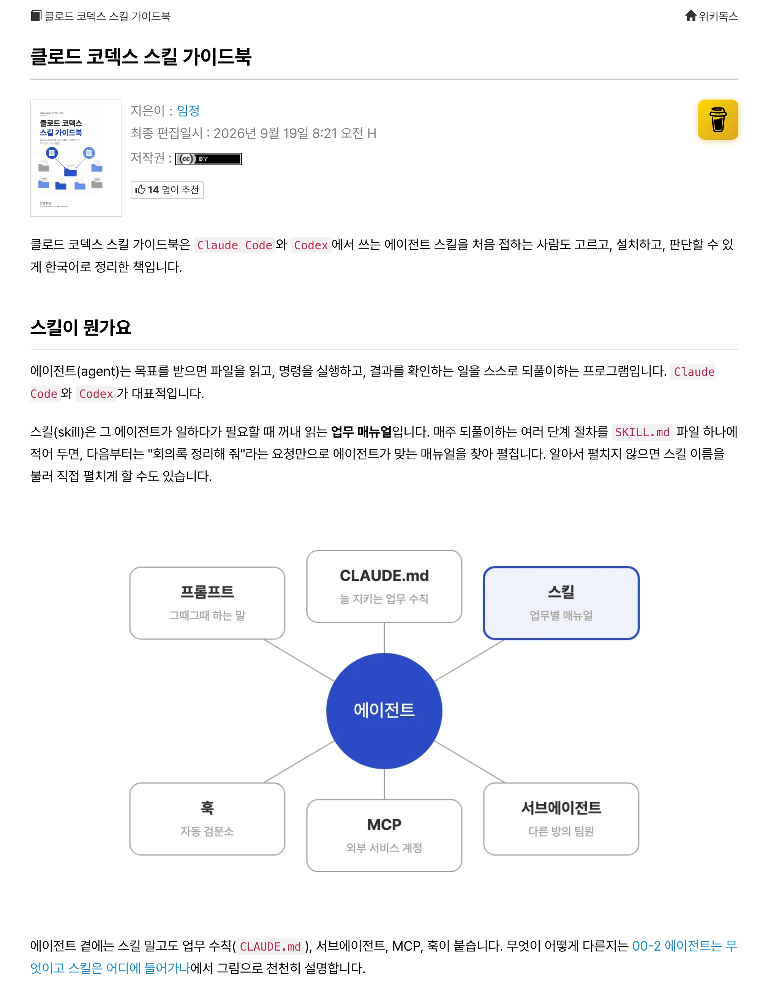

---


</details>

---


<details>
<summary><strong>현 시점, AI와 일 잘하는 사람의 차이점은 지시의 수용 정도라고 생각함</strong></summary>


애매하게 이상한 업무지시를 내릴 때

일잘러 : ??? 말하기 전에 생각 하셨나요?? 그게 아니라 이렇게 해야 할 거 같은데  
AI : 제가 틀렸습니다. 당신이 말한대로 구현합니다.

유저가 명시적으로 설정한 가드레일이나 코딩 에이전트의 하네스, 혹은 모델이 명확히 금지하는 사안이 아니라면 너무나 과하게 수용적임.

'일을 잘 한다'는 평가는 실행만 잘 하는 태도를 의미하지 않음. 사실 이것조차도 매 업무의 단위를 잘게 쪼개고 eval metric 을 잘 짜두면 되는 거지만, 그런 수고를 덜 하자고 좋은 모델 찾고 작업 전반에 공통되는 규칙과 하네스를 쓰는 게 아니겠음?

특히 코딩 외의 (상대적으로 RL이 덜 된 느낌을 받는) 영역, 동시에 내가 잘 아는 영역에서 이런 아쉬움이 강하게 느껴짐

---


</details>

---


<details>
<summary><strong>개인적으로 오픈소스 프론티어 중에서는</strong></summary>

`Qwen3.8 flash next`가 제일 적절하게 함

언어 길이, 추론 깊이, 질문 수준, 추가 행동 등등

답변을 좀 현학적으로 어렵게 하는 거 말고는 괜찮음

딥싴은 별에별거 다하고  
GLM flash는 안시키면 안함

---


</details>

---


<details>
<summary><strong>ChatGPT로 공짜로~ &quot;무한 작업&quot; 돌려보세요.</strong></summary>


이게 합법적으로 가능한 방법이 있는데요!

ChatGPT 웹앱에 "Google Drive" 플러그인을 연결하고

- -> 원하는 작업을 "예약"으로 걸어두는 겁니다.

근데 여기서 진짜 중요한 부분!!

지피티가 구글 드라이브에 있는 파일을 읽기만 되는게 아닙니다.

✍️ 내 구글 드라이브에 파일을 새로 만들고 기존 파일의 내용도 수정할 수 있습니다.

(코드파일도 전부 작성 가능)

그러면 이걸 어떻게 써먹을 수 있냐?

예를 들어 이렇게 쓸 수 있습니다!

1. 매 1시간마다 "OO한 느낌으로 기존에 중복되지 않는 내용으로 새로운 네이버 블로그 글 써줘"
2. 매 1시간마다 "OO 컨셉으로 카톡 이모티콘 이미지 만들어줘. (이전에 만든 느낌으로 다시 생성 X)
- -> 이런 식으로.. 최소 1시간마다 무한 작업을 새로 시킬 수 있습니다.

코딩도 같은 방식으로 계속 작업시킬 수 있습니다.

(계속 새로운 커밋있으면 리뷰 시키거나, 계속 새로운 아이디어 내보라고 해볼 수 있겠죠?!)

이거하실 때는 ChatGPT의 플러그인 목록에서 Google Drive를 연결하시면 됩니다.

그리고 작업용 폴더 링크와 함께 이런 식으로 요청해보세요.

"""  
매시간 이 구글 드라이브 폴더의 작업 지침, 진행 기록, 최신 결과물을 먼저 읽어주고, 다음 실행에서는 이 기록을 읽고 이어서 작업해.  
"""

여기서 ✨ "채팅에 답만 하지 말고, 실제 파일에 반영해줘" ✨ 까지 넣는 게 포인트! 입니다.

물론 ChatGPT 웹앱도 요금제에 따라 다르지만 무제한이 아니긴합니다.

(애초에 거의 무제한으로 쓸 수 있을만큼 쿼터가 넉넉하고 Codex 사용량과는 또 별도라 거의 신경 안쓰셔도 됩니다!)

ChatGPT 구독료 뽕 뽑으려면 이 "예약" 기능을 잘 써보시는거 추천드립니당

답변만 받지 말고 파일로 남는 일까지 맡겨보세요. ㅎㅎ

---


</details>

---


<details>
<summary><strong>어제는 신입 개발자의 AI 활용 역량을 이야기하며 LLM 서비스 개발 강의를 소개했다. 그 글에서 팀원들이 개발에 참여할 수 있도록 안전한 시스템을 만드는 일도 중요하다고 남겼다.</strong></summary>


비개발자분들도 AI의 도움을 받아 어느 정도 코드를 작성할 수 있게 됐다.  
이런 상황에서 회사는 개발자들이 보안 전문가가 아니더라도 기본적인 보안 지식을 갖추고 작성한 코드를 검토할 수 있기를 기대한다.  
(그래도 개발자니깐 말이다.)

SQL Injection, Logic Vulnerability, CSRF, XSS 등 웹 개발을 하면서 배워야 할 기본적인 웹 보안은 개발자들이 대부분 알고는 있다.  
다만, AI에게 물어보고 이해하는 수준보다는 좀 더 자세히 알고 있어야 한다.  
그러려면 직접 실습을 해볼 필요가 있다.  
배워는 뒀는데, 이해는 했는데, 실제로 어떻게 되는지 말이다.  
(실무에서 경험하기엔 너무 리스크하니)

knockOn 님의 '해킹 입문부터 중급까지, 한 번에 배우는 웹해킹'은 웹 해킹을 직접 해볼 수 있는 실습 환경과 문제를 제공한다.  
SQL 인젝션을 비롯한 공격이 어떻게 작동하는지 확인하고, 풀이에서 원인이 되는 코드를 분석해볼 수 있다.

개인적으로는 아래 섹션들을 취준생, 주니어 개발자분들께 추천드린다.

1. 로그인과 데이터 조회에서 무엇을 믿고 있는지 확인하기
    
    'SQL Injection 기초 풀이'에서는 로그인 요청의 입력값이 SQL 쿼리에 어떻게 들어가는지 코드를 읽는다.
    입력값이 쿼리의 의미를 바꾸면서 의도하지 않은 로그인이 가능해지는 이유를 실습으로 확인한다.
    'SQL Injection Mitigations'에서는 PHP 예제로 Prepared Statements와 입력값 바인딩을 설명한다.
    쿼리 구조와 사용자 입력을 분리해야 하는 이유를 앞의 문제와 연결해볼 수 있다.
    
2. 파일 업로드와 다운로드가 허용하는 범위 살펴보기
    
    'File Upload'와 'File Download(Local File Inclusion)'에서는 업로드한 파일이 서버에서 실행되거나, 다운로드 기능으로 서버 내부 파일을 읽게 되는 원인을 다룬다.
    파일을 올리고 다시 내려받는 기능을 만들었다면, 사용자가 지정한 파일 이름과 경로를 서버가 어디까지 믿는지 코드를 살펴보는 연습이 된다.
    확장자 검사나 파일 처리 방식이 어떤 조건에서 문제가 되는지도 실습으로 확인한다.
    
3. 서비스의 업무 규칙과 동시 요청 살펴보기
    
    취준생에게 특히 권하고 싶은 부분은 'Logic Vulnerability' 섹션이다.
    'Business Logic Error'와 이어지는 문제 풀이에서는 구매 가격과 수량을 서버가 검증하지 않을 때 생기는 문제를 설명하고, 실습용 상점에서 잘못된 수량이 잔액 계산에 영향을 주는 이유를 분석한다.
    

다른 사람의 데이터에 접근할 권한을 확인하지 않아 생기는 IDOR 사례도 다룬다.  
'Race Condition 문제 풀이'에서는 카운터 웹페이지의 코드를 읽고, 요청이 동시에 처리되면서 조건 검사와 값 변경이 예상대로 동작하지 않는 상황을 재현한다.  
평소 기능을 확인할 때는 정상적인 값을 넣고 요청을 한 번씩 보내기 쉽다.  
이 수업들은 잘못된 값이나 여러 요청이 겹치는 경우까지 생각해보게 한다.

수강 후에는 배운 내용을 본인이 만든 프로젝트에도 적용해보면 좋겠다.  
접근 권한이나 입력값 검사가 빠진 부분을 찾아 수정하고, 같은 문제가 다시 생기지 않도록 테스트를 추가해보는 것이다.

포트폴리오에도 어떤 요청에서 문제가 생겼는지, 원인이 된 코드는 무엇이었는지, 어떻게 수정하고 확인했는지를 남길 수 있다.  
면접에서도 본인이 검토하고 고민했던 내용을 설명할 자료가 된다.

웹 애플리케이션을 한 번 만들어봤고, 이제 그 코드의 보안 문제까지 직접 살펴보고 싶은 신입 개발자와 취준생분들께 추천드린다.

---


</details>

---


<details>
<summary><strong>ai 자주 쓰는 사람들 이런 메타질문 한번씩 해보는 것도 좋을듯</strong></summary>


내 경우:자료조사랑 팩트체크에 주로 쓰고 있어서 큰 문제는 없다고 한다...

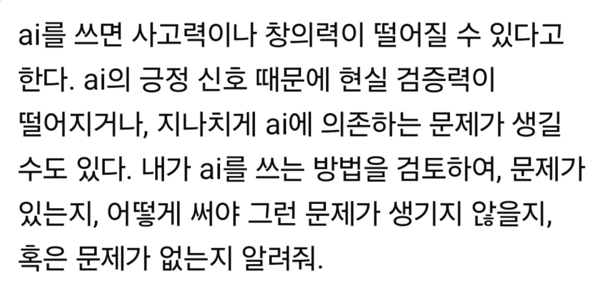

---


</details>

---


<details>
<summary><strong>SK하이닉스 신입 면접장에 이제 LLM이 켜진 PC가 놓여 있습니다. 이 회사가 보겠다는 건 AI를 켜고 나서 뭘 묻느냐입니다.</strong></summary>


올 하반기부터 반나절짜리 심층면접이 생겼는데, 면접장 PC로 LLM을 써서 직무 과제를 풀고 그 자리에서 발표하는 방식입니다. 자소서 문항도 없애고 AI로 프로젝트나 문제를 해결해 본 경험을 쓰게 바꿨고, 6월부터는 4년제 학위 같은 학력 제한도 전부 지웠습니다.

채용 담당자 말이 핵심입니다. AI를 얼마나 잘 쓰는지보다 과제를 어떻게 정의하고 해결하는지를 본다고요.  
생각해보면 당연합니다. 답은 LLM이 몇 초 만에 내놓으니 사람끼리 차이가 나는 곳은 세 군데밖에 안 남습니다. 문제를 어떻게 쪼개서 묻는지, 나온 답이 맞는지 틀린지 알아보는지, 그걸 남한테 설명할 수 있는지.

회사가 내세운 기준도 딱 그겁니다. 끝까지 파고드는 탐구력, 새 도구에 빨리 적응하는 힘, 다른 관점과 섞이는 힘.

취업 준비도 이제 정답 외우기보다 질문 만드는 연습 쪽으로 옮겨가야 할 것 같습니다. 반도체 1등 회사가 먼저 바꿨으니 다른 대기업도 따라갈 가능성이 큽니다.

---


</details>

---


<details>
<summary><strong>요즘 제일 핫한 건 Meta Muse인 듯</strong></summary>


근데 ChatGPT·Work·Codex랑 뭐가 다른지 헷갈려서 정리해봄  
ChatGPT = 머리 / Work = 사무직원  
Codex = 개발자 / Muse = 개인비서  
기능은 겹쳐도 주력 역할은 꽤 다름

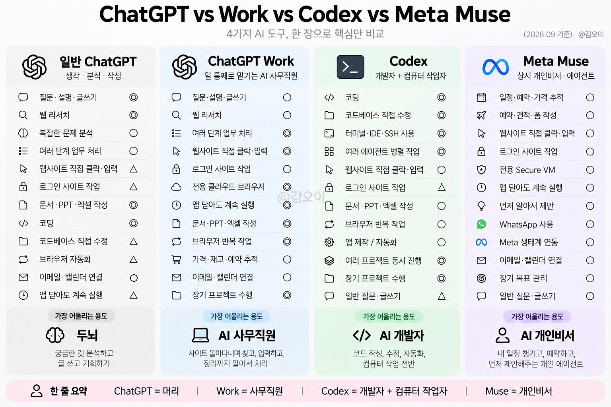

---


</details>

---


<details>
<summary><strong>AI 시대에 내가 어떤 경쟁력을 가져야 할까 라는 막막함이 있으시면 이번 주말을 이용해 한 번 시도해보시길 추천드립니다.</strong></summary>


- 코딩 에이전트로
- 내가 잘 알고 전문성이 있는 분야의 주제를 잡아
- 아무 프로덕트나 워크플로우를 하나 만들어보기
- 전문성이 날카로운 영역일수록 좋음
- 특히 ‘추론’ 과 해석이 많이 들어간 영역일수록 좋음

그 과정에서 무엇을 봐야 하냐면

- 기본적으로 LLM은 모르는 지식이 없다고 가정하는 게 맞지만
- 모델은 지시하는 사람이 주는 맥락과 방향, 그리고 지시 전략에 따라 천차만별인 답변을 내놓을 수 있습니다
- 정답이 비교적 '정해진', 즉 결정적인 (deterministic) 성격이 강한 업무에는 일정한 퀄리티를 충족하는 답변을 내놓지만
- 추론이나 해석의 여지에 따라 미묘하게 답이 갈리는 업무에서는 질문자의 의도를 다소 과하게 수용합니다
- 즉, 이런 분야에서 모델의 의견을 밀면 모델은 별다른 저항 없이 밀립니다

그런데 해석이 다양하거나 미묘한 추론을 요구하는 영역에서는 모든 의견을 다 수용하는 태도로는 가치를 생산할 수 없습니다.

그래서 흔히 고부가가치의 업무는 '암묵지' 내지 '전문성'에 의존합니다. 애초에 암묵지가 쉽게 해석될 수 있는 영역은 그 지식의 수요자가 높은 가치를 지불하지 않을 테니까 당연한 말이겠죠.

이 암묵지를 evaluation 을 통해 결정적 펑션으로 바꾸어 나가는 방법을 아는 게 현재 전문성을 가장 레버리지하기 좋은 방법일 테고요.

이 과정에서 느껴지는 점은

- 모델이 발전하면서 암묵지가 사라지는 속도가 꽤 빠르다
- 그런데 동시에 모델이 질문자의 의도에 따라 너무 의견을 빠르게 수정하는 경향이 있다보니 결국 워크플로우는 그 워크플로우를 설계하고 이용하는 사람들의 전문성 따라 (적어도 현재는..) 상방이 막힌다
- 질문자의 의도를 어떻게 해석해서 얼마나 수용할지는 alignment 의 문제이기도 하니 엄청 빠르게 사라질 영역은 아닐 것 같다 (개인적 의견입니다)

그리고 계속해서 해결해야 하는 과제는

- AI로 특정 태스크가 완료되지 않는 이유가 내 부족한 전문성 때문일까, 모델의 성향내지 능력 때문일까, 혹은 내가 짜 둔 하네스나 워크플로우의 불완전함 때문일까를 끊임없이 고민하기 (알기 정말 어렵더라고요)
- 프론티어 모델들을 밀어붙여보며 능력과 한계를 계속 체화하기
- 하나의 프론티어 모델의 과거와 현재를 비교해보며 능력의 변화 속도 체감해보기

정도가 있겠네요.

저는 이 과정을 통해 무엇을 할 수 있을까 조금씩 감을 잡아가는 과정에 있습니다. 어디까지나 현재 기준이고 어느 순간 이런 고민조차도 무색하게 만드는 초지능이 등장할 때가 찾아오겠지만요

---


</details>

---


<details>
<summary><strong>신한은행 해킹 도구가 아래 오픈도구를 사용했군요~</strong></summary>


GitHub Autumn-27/ARTEX에 공개된 오픈소스입니다. 중국어 UI의 LLM 멀티 에이전트 자율 침투 테스트 시스템으로, Go 백엔드 + Next.js 프론트 + PostgreSQL 구조입니다.  
[https://github.com/Autumn-27/ARTEX](https://github.com/Autumn-27/ARTEX)

- Planner가 공격 의도를 나누고, Worker가 nmap 등 실제 도구를 호출한 뒤 결과를 DB에 다시 씁니다.  
-자산 그래프와 탐색 그래프를 따로 두어, 장시간·다자산 작업을 사람 개입 없이 이어 가게 설계됐습니다.  
고위험 호출은 가로채 승인하는 가드가 있습니다.  
-LLM은 Anthropic·OpenAI 키 또는 UI에서 Base URL을 넣도록 되어 있고, 이후 버전에서 DeepSeek 검색 연동도 추가됐습니다.

2026년 바이두 BSRC 주관 「Agent+」 공방 챌린지에서 종합 1위를 했다는 소개가 있습니다. 온라인 데모는 [http://artex-demo.vercel.app입니다](http://artex-demo.vercel.xn--app-db3mme233k/).  
원래는 허가된 보안 평가용으로 소개되지만, 오픈소스라 공격자가 그대로 돌리면 정보 수집·취약점 탐색·도구 실행을 자동화하는 데 쓸 수 있습니다. 업계가 “자율 공격 효율이 올라갈 수 있다”고 보는 이유입니다.
</details>

---


<!-- devtrack-draft-id: 5ac63c8e-f437-4102-b9bc-c7a42c10a485 -->
<details>
<summary><strong>AI는 코드를 작성할 수 있습니다. 당신은 여전히 장애의 책임을 지게 됩니다.</strong></summary>

AI 코딩:  

약한 엔지니어:  
- AI가 생성한 코드를 복사  
- 그걸 읽지 않음  
- 고장 나면 더 많은 프롬프트를 추가  
- 배포함  
- 그걸 “AI 보조 개발”이라고 부름  

강한 엔지니어:  
- AI에게 적절한 맥락을 제공함  
- 모든 변경 사항을 검토함  
- 구현 방식을 질문함  
- 경계 사례를 테스트함  
- 생성된 코드를 이해함  
- 최종 결과에 대한 책임을 짐  

</details>

---
