# RAG

속성: AI


<details>
<summary><strong>논문 1000개, 몇 분 만에 다 읽혔다</strong></summary>


논문 1,000개를 몇 분 만에 다 훑어버리는 플러그인이 있다길래 눈이 갔다.

Zotero라고, 논문이나 자료 PDF를 모아두는 프로그램이 있다. 나도 사이드 프로젝트 하면서 자료 스크랩할 때 비슷한 거 쓰는데, 문제는 쌓이기만 하고 안 읽는다는 거지. 폴더 열어보면 200개 훌쩍 넘는 PDF가 그냥 잠들어 있음.

PapersGPT는 이 Zotero에 꽂는 부가기능(앱스토어에서 앱 깔듯 추가하는 플러그인)인데, 논문 더미를 그냥 검색 가능한 지식창고로 바꿔버린다. 여기까지는 비슷한 AI 도구들도 많은데, 이게 좀 다른 건 처리 방식이다. 보통 이런 툴은 파이썬 스크립트로 문서를 잘게 쪼개서(임베딩이라고 부르는 방식) 색인을 만드는데 라이브러리 커지면 버벅대다 죽는다. PapersGPT는 자기네 소개에 '네이티브 C++ 엔진'이라 적어놓고 1,000개 넘는 문서도 몇 분이면 색인 끝난다고 주장하는데, 정작 깃허브 저장소 언어 통계를 까보면 자바스크립트·타입스크립트뿐이고 C++ 소스는 안 보임. 컴파일된 바이너리로 따로 번들했을 가능성도 있지만 그건 확인이 안 돼서, 이 속도 얘기는 일단 벤더 자기소개로 걸러 들어야 할 듯.

예전 같으면 '심장내과' 폴더에 있는 논문 50개 열어서 표본수랑 p-value를 하나하나 찾아 엑셀에 옮겨 적었을 거다. 이제는 '이 폴더 논문들 표본수랑 p-value 비교해줘' 한 문장 던지면 표로 정리해서 내놓는다. 심지어 결과에 딸린 인용 표시를 클릭하면 그 문장이 나온 논문 페이지로 바로 이동한다. AI가 대충 지어낸 요약인지 진짜 원문에 있는 내용인지 바로 확인이 되는 거다. 폴더 하나가 아니라 라이브러리 전체, 그러니까 만 개 넘는 문서를 다 뒤져서 흐름이나 서로 어긋나는 주장까지 잡아낸다니 스케일이 다르다.

결과부터 말하면 — 이게 100% 로컬로 돌아간다는 게 제일 눈에 띄었다. 색인 작업 자체가 클라우드 안 거치고 내 컴에서 끝나서 인터넷 없어도, 심지어 비행기 모드에서도 동작한다고. 논문 데이터 어디로 새나갈 일이 없다는 거지.

이게 Claude 쓰는 입장에서 재밌는 건, PapersGPT가 MCP(클로드에 꽂는 확장 커넥터, 콘센트 멀티탭 같은 거) 플러그인이라 Claude나 Claude Code에다 그대로 연결해서 쓸 수 있다는 거다. Claude Code로 사이드 프로젝트 리서치 자료 정리하다가, 예전 자료 뒤져야 할 때 이 Zotero 라이브러리를 통째로 붙여놓고 물어보면 되는 거지. 폴더 위치 설명하고 파일 하나씩 열어달라고 할 필요가 없어지는 거다.

자료가 안 읽히는 이유는 게을러서가 아니라, 찾는 데 드는 품이 읽는 것보다 컸기 때문이더라.

PDF 다운받아놓고 아직 안 열어본 거, 각자 몇 개씩 쌓여있나. 나는 세어보기 겁난다.

출처: GitHub — papersgpt/papersgpt-for-zotero

[https://github.com/papersgpt/papersgpt-for-zotero](https://github.com/papersgpt/papersgpt-for-zotero)

---


</details>

---


<details>
<summary><strong>PDF 하나 올렸다고 생각했는데, AI 입장에서는 사실 두 개를 받는 거임.</strong></summary>


「텍스트 + 페이지별 스크린샷」

Anthropic 공식 예시 기준, 3페이지 PDF도 텍스트만 추출하면 약 1,000 Token.

비전 분석까지 켜면 약 `7,000 Token`까지 올라감. 🤯

차트나 레이아웃을 읽어야 하면 비전이 필요함.

그런데 논문 요약, 자료 검색, RAG 지식베이스용이라면?

PDF를 그대로 넣는 순간 Token을 그냥 태우는 셈.

GitHub 7.6만 Star `MinerU`가 이 작업을 대신해줌.

→ PDF·이미지·Office 문서 → Markdown

→ 수식은 LaTeX, 표는 HTML로 보존

→ 스캔본·2단 문서·109개 언어 지원

→ 오픈소스, 로컬 실행·웹 버전 모두 지원

문서는 먼저 `MinerU`로 정리하고 AI에 넣는걸 추천👍

가장 비싼 모델에게

가장 단순한 문서 정리부터 시키지 말자.🙅[https://github.com/opendatalab/MinerU](https://github.com/opendatalab/MinerU)

---


</details>

---


<details>
<summary><strong>MCP vs RAG vs AI Agents</strong></summary>


현대 AI 시스템을 이해하려면 이 세 가지 요소가 어떻게 조합되는지 이해해야 합니다.

𝗥𝗔𝗚 = “𝗠𝗼𝗱𝗲𝗹에 더 나은 답변을 제공하세요”  
RAG는 관련 데이터를 검색하여 프롬프트에 주입하고, 근거 있는 응답을 생성합니다. 문서 기반 질문 답변, 환각(hallucinations) 감소, 또는 출처 및 인용 표시가 필요한 문제에 가장 적합합니다. RAG는 모델이 아는 것을 개선하지만, 할 수 있는 것을 개선하지는 않습니다.

RAG 애플리케이션을 구축 중이라면, 여기 초보자부터 고급 수준까지 훌륭한 가이드가 여러 개 있습니다:

[https://lucode.co/ai-learning-hub-z71bxd](https://t.co/tGPF4cNWZT)

𝗠𝗖𝗣 = “표준화된 도구 및 데이터 액세스”  
MCP는 LLM과 API, 데이터베이스, 앱 같은 외부 시스템 간의 표준화된 인터페이스입니다. 모델이 데이터를 쿼리하거나 서비스를 호출하거나 Slack, GitHub 등 실제 시스템과 상호작용해야 할 때 사용하세요. MCP는 행동을 결정하지 않고, 도구가 노출되는 방식을 정의합니다.

𝗔𝗜 𝗔𝗴𝗲𝗻𝘁𝘀 = “모델이 행동을 취하도록 하세요”  
에이전트는 관찰 → 계획 → 행동 → 반복의 루프에서 작동하며, 종종 도구와 메모리를 사용합니다. 다단계 추론, 검증이 필요한 도구 사용, 또는 전체 작업 실행이 필요한 문제에 사용하세요. 에이전트는 RAG가 멈춘 지점에서 시작하여 결정을 행동과 결과로 전환합니다.

간단한 정신 모델:  
RAG → 지식 계층  
MCP → 도구 계층  
Agents → 실행 계층

모든 시스템이 이 세 가지를 명시적으로 필요로 하는 것은 아니지만, 복잡한 시스템은 종종 이들을 결합합니다.

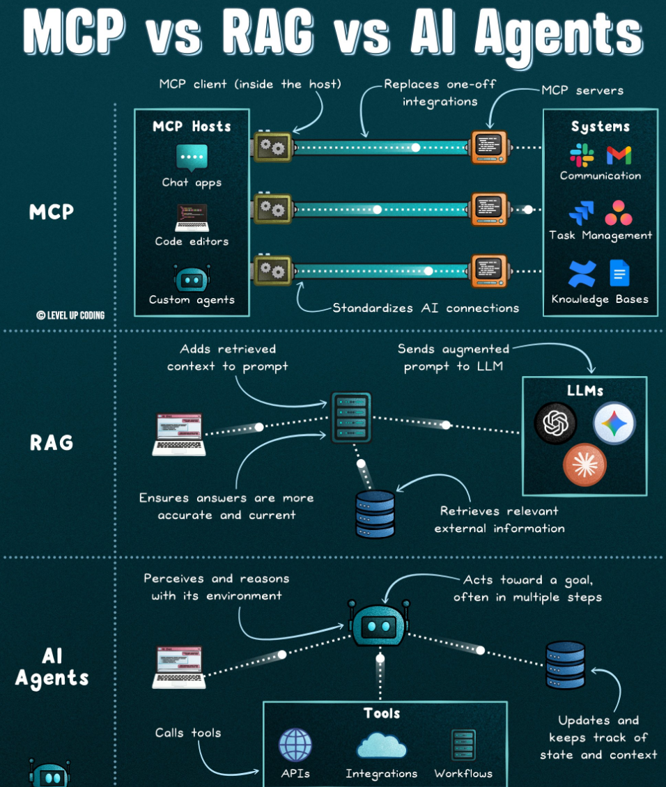

---


</details>

---


<details>
<summary><strong>RAG란 무엇인가요? ✨</strong></summary>


RAG는 Retrieval-Augmented Generation의 약자입니다.

이는 AI 애플리케이션이 LLM에게 응답을 생성하기 전에 관련 정보를 검색할 수 있게 하는 기술입니다.

훈련 중에 LLM이 배운 내용에만 의존하는 대신, 애플리케이션은 먼저 외부 소스에서 정보를 검색한 후 이를 프롬프트에 포함시킵니다.

RAG는 어떻게 작동하나요? ✨

1. 질문을 합니다.
2. 애플리케이션이 지식 소스를 검색합니다.

이 과정에서 검색될 수 있는 내용:  
→ 회사 문서  
→ PDF 파일  
→ 위키  
→ 데이터베이스 레코드  
→ 지식 베이스  
→ 벡터 데이터베이스

검색된 정보는 추가 맥락으로 프롬프트에 추가됩니다.

LLM은 그 정보를 사용하여 응답을 생성합니다.

그건 그냥 맥락이 아닌가요? ✨  
정확히 말하면 아닙니다.

맥락은 LLM이 응답을 생성하기 전에 받는 모든 것입니다.

RAG는 애플리케이션이 관련 정보를 검색하여 맥락으로 변환하는 하나의 기술입니다.

LLM은 그 정보가 당신에게서 온 것인지 자동으로 검색된 것인지 알지 못합니다.

단순히 최종 맥락을 받고 응답을 생성할 뿐입니다.

기억하기 쉬운 간단한 방법:

📝 맥락 = LLM이 보는 모든 것.  
📚 RAG = 애플리케이션이 그 맥락을 구축하는 하나의 방법.

AI 애플리케이션이 계속 진화함에 따라, RAG는 회사 지식, 문서, 그리고 지속적으로 변화하는 데이터를 다루는 핵심 구성 요소 중 하나가 되었습니다.

그래서 ChatGPT, Claude Code, Cursor, Bug0를 포함한 많은 현대 AI 제품에서 이를 찾아볼 수 있습니다.

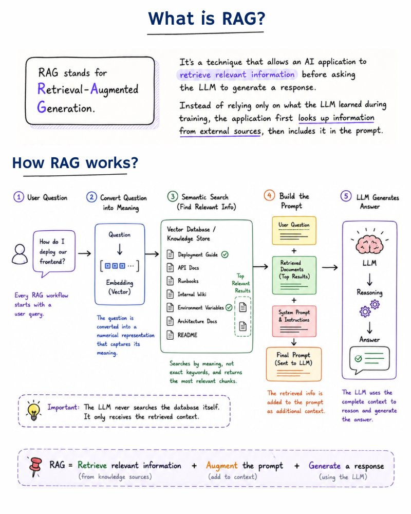


</details>

---


<details>
<summary><strong>RAG는 실제로 어떻게 구현되는 걸까요?</strong></summary>


우리는 RAG가 AI 애플리케이션에서 LLM에게 응답을 생성하기 전에 정보를 검색하는 데 사용되는 기술이라는 것을 배웠습니다.

그건 알고리즘인가요?  
아니요.

분해해서 살펴보죠. 👇

RAG는 단일 알고리즘이나 머신러닝 모델이 아닙니다.

여러 구성 요소가 함께 작동하는 워크플로입니다.

대부분의 RAG 시스템은 두 단계로 작동합니다:

**✨단계 1: 지식 준비 (일회성 설정)**

누군가가 질문을 하기 전에 애플리케이션은 데이터를 준비합니다.

→ 문서를 더 작은 청크로 분할  
→ 각 청크를 임베딩으로 변환  
→ 임베딩을 벡터 데이터베이스에 저장

이 작업은 문서가 추가되거나 업데이트될 때만 필요합니다.

**✨ 단계 2: 사용자의 질문에 답하기**

사용자가 프롬프트를 보낼 때마다 애플리케이션은 다음 단계를 따릅니다:

**🔍 단계 1: 검색**

→ 사용자의 질문을 임베딩으로 변환  
→ 의미론적 검색 수행  
→ 가장 관련성 높은 청크 검색

**📝 단계 2: 프롬프트 구축**

→ 사용자의 질문 결합  
→ 검색된 청크 추가  
→ 시스템 지침 포함  
→ 최종 프롬프트를 LLM에 전송

**🤖 단계 3: 응답 생성**

→ LLM이 완전한 컨텍스트를 받음  
→ 정보에 대해 추론  
→ 최종 답변 생성

**✨ "문서"란 무엇인가요?**

RAG에서 문서는 검색하고 검색할 수 있는 모든 정보 조각을 의미합니다.

애플리케이션에 따라 다를 수 있지만, 다음과 같을 수 있습니다:  
→ 소스 코드 (Claude Code, Cursor, GitHub Copilot)  
→ 업로드된 파일 (ChatGPT, Gemini, Claude)  
→ 프로젝트 문서화 및 지식 베이스 (Notion AI, Glean, Atlassian Rovo)  
→ 테스트 아티팩트, 테스트 사양 및 프로젝트 메타데이터 (Bug0, KaneAI)

지능은 모델에만 있는 것이 아닙니다.

애플리케이션이 정보를 검색하고, 준비하며, 모델에 제공하는 방식에도 있습니다.

그게 바로 RAG의 본질입니다.

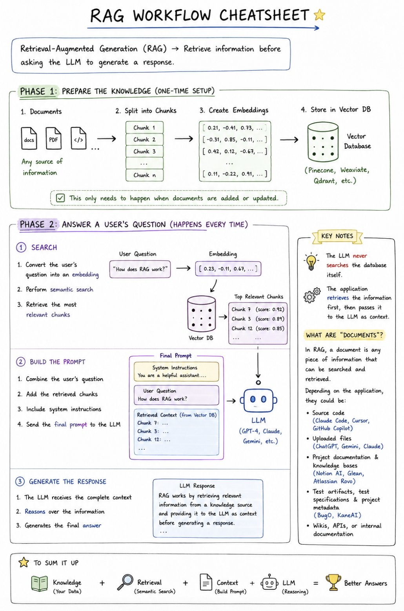

---


</details>

---


<details>
<summary><strong>헷갈리던 LLM · RAG · 에이전트, 개념을 정리해봤습니다</strong></summary>


이 셋을 구분하면 어떤 일에 무얼 써야 할지 구분할 수 있습니다

① LLM 단독 - 아는 것만으로 답하는 두뇌  
→ 그동안 배운 지식으로만 답해요  
일반 상식·요약·글쓰기엔 강하지만, 안 배운 건 모른다 안 하고 그럴듯하게 지어낼 수 있습니다

② RAG - 자료를 주고 답하게 하기  
→ 질문에 맞는 자료를 찾아 그걸 근거로 답해요  
회사 문서·내 자료에 맞는 답이 필요할 때 쓰는데, 자료가 부실하면 답도 부실해집니다

③ 에이전트 - 손발 달고 직접 일하기  
→ 검색·예약 같은 액션을 스스로 판단해 직접 실행해요  
여러 단계 일을 맡길 수 있지만, 잘못 실행할 수 있어 확인이 필요합니다

중요한 일일수록, 그냥 묻지 말고 자료를 같이 붙여주세요  
개념만 잡아도 AI 쓰는 게 한결 수월해질 수 있습니다

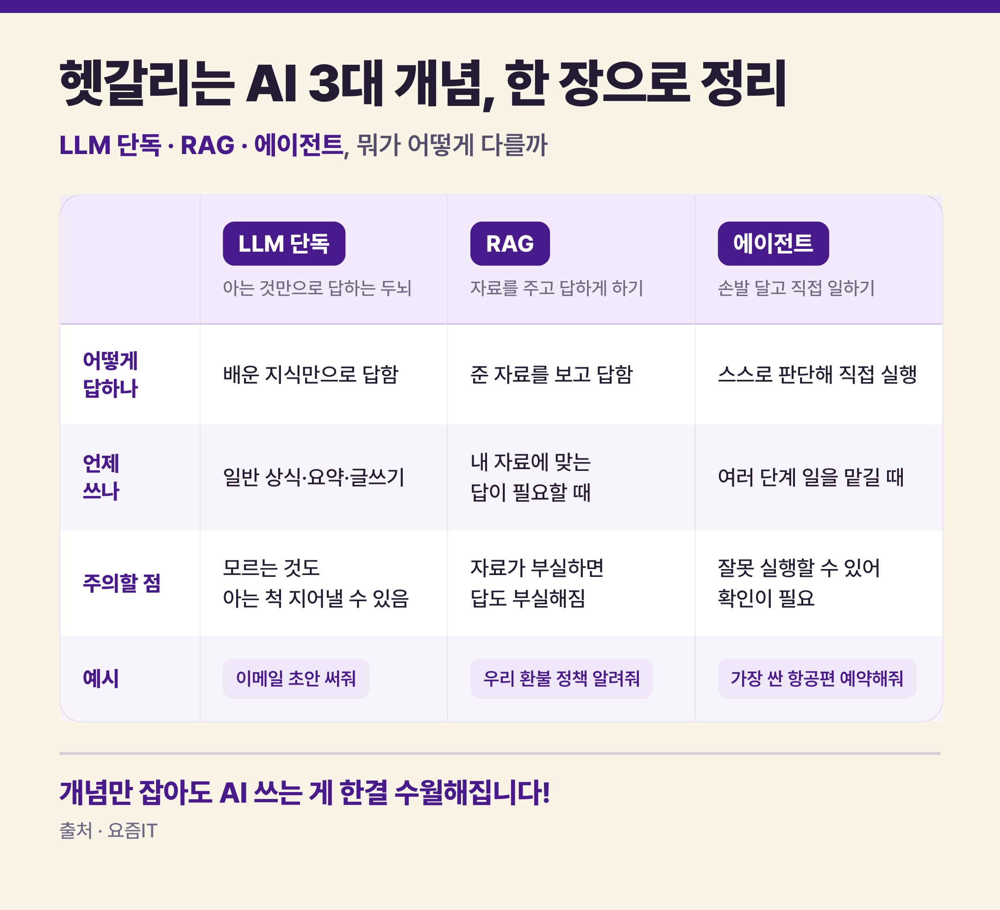

---


</details>

---


<details>
<summary><strong>속보: IBM이 모든 문서를 데이터로 변환하는 무료 Python 라이브러리를 출시했습니다</strong></summary>


**Docling**을 소개합니다. 알아야 할 사항은 다음과 같습니다:

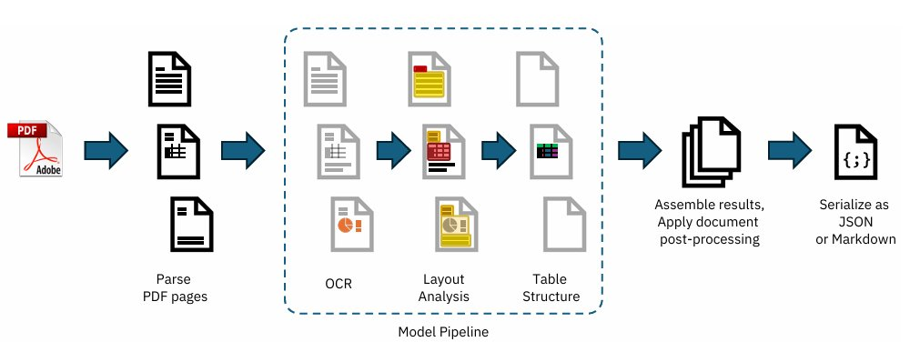

1. Docling이란 무엇인가?
    
    Docling은 문서 처리를 간소화하는 Python 라이브러리로, 다양한 형식의 파싱 — 고급 PDF 이해를 포함하여 — 을 지원하며 gen AI 생태계와의 원활한 통합을 제공합니다.
    
2. 문서 변환 아키텍처
    
    각 문서 형식에 대해 문서 변환기는 해당 형식에 특화된 백엔드를 사용하여 문서를 파싱하고 실행을 조정하기 위한 파이프라인을 선택하며, 관련 옵션을 함께 사용합니다.
    
3. PDF를 Markdown으로 변환
    
    arXiv의 DocLayNet 논문 예시를 Docling으로 Markdown 형식으로 변환한 것입니다
    
4. 핵심 기술: Docling에는 다음이 포함됩니다. 
    - PDF 구문 분석을 위한 백엔드
    - 레이아웃 분석 모델
    - 비전 기반 표 포맷터
    - 텍스트 OCR

사내 문서 자동화나 RAG 데이터 전처리 인프라 만지는 형들 이거 Docling 저장소 참고해두면 좋을 듯. PDF를 포함해서 온갖 지저분한 문서 포맷을 AI가 먹기 좋은 클린 데이터로 변환해 주는 무료 파이썬 라이브러리임.

---


</details>

---


<details>
<summary><strong>RAG 대 CAG, 명확하게 설명!</strong></summary>


RAG는 훌륭하지만, 주요 문제가 있습니다:

모든 쿼리가 벡터 DB에 도달합니다. 심지어 몇 달 동안 변하지 않은 정적 정보에 대해서도요.

이것은 비용이 많이 들고, 느리며, 불필요합니다.

캐시 증강 생성(Cache-Augmented Generation, CAG)은 모델이 키-값(KV) 메모리에 정적 정보를 직접 "기억"할 수 있게 함으로써 이 문제를 해결합니다.

사실, RAG와 CAG를 결합하면 두 세계의 장점을 모두 누릴 수 있습니다.

작동 방식은 다음과 같습니다:

RAG + CAG는 지식을 두 층으로 나눕니다:

↳ 정적 데이터(정책, 문서화)는 모델의 KV 메모리에 한 번 캐싱됩니다

↳ 동적 데이터(최근 업데이트, 실시간 문서)는 검색을 통해 가져옵니다

이렇게 하면 추론 속도가 빨라지고, 비용이 줄며, 중복이 적어집니다.

비결은 캐싱할 내용을 선택적으로 고르는 것입니다.

변하지 않는 정적이고 고가치 지식만 캐싱하세요. 모든 것을 캐싱하면 컨텍스트 제한에 부딪힐 겁니다. "콜드"(캐싱 가능)와 "핫"(검색 가능) 데이터를 분리하면 이 시스템이 안정적으로 유지됩니다.

오늘 바로 시작할 수 있습니다. OpenAI와 Anthropic은 이미 API에서 프롬프트 캐싱을 지원합니다.

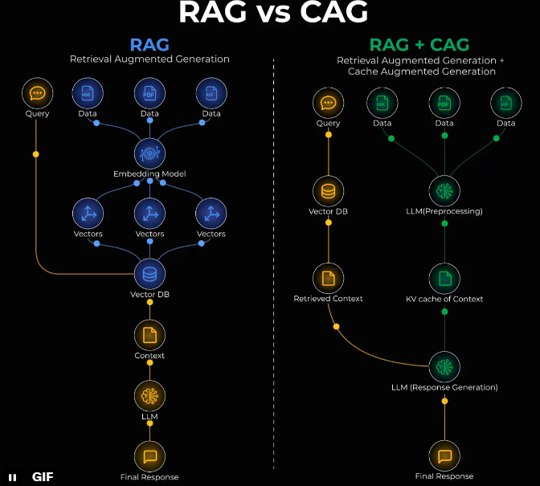


</details>

---


<details>
<summary><strong>RAG 대 Graph RAG, 시각적으로 설명!</strong></summary>


RAG에는 많은 문제가 있습니다.

예를 들어, 전기(傳記)를 요약하고 싶다고 상상해 보세요. 문서의 각 장이 한 사람(P)의 특정 업적을 다루는 경우입니다.

이것은 단순한 RAG로는 어렵습니다. 왜냐하면 단순한 RAG는 상위 k개의 관련 청크만 검색하지만, 이 작업에는 전체 맥락이 필요하기 때문입니다.

Graph RAG는 이를 해결합니다.

다음 시각 자료는 이것이 단순한 RAG와 어떻게 다른지 보여줍니다.

핵심 아이디어는 다음과 같습니다:
- 문서에서 그래프(엔티티 & 관계)를 생성합니다.
- 검색 중에 그래프를 탐색하여 맥락을 가져옵니다.
- 맥락을 LLM에 전달하여 응답을 얻습니다.

Graph RAG가 위 문제를 어떻게 해결하는지 보겠습니다.

먼저, 시스템(일반적으로 LLM)이 문서에서 그래프를 생성합니다.

이 그래프는 사람(P)에 대한 서브그래프를 가지며, 각 업적은 P의 엔티티 노드에서 한 홉 떨어져 있습니다.

요약 중에 시스템은 그래프 탐색을 수행하여 P의 업적과 관련된 모든 관련 맥락을 가져올 수 있습니다.

전체 맥락이 LLM이 완전한 답변을 생성하는 데 도움이 될 것이며, 단순한 RAG는 그렇지 않습니다.

Graph RAG 시스템은 또한 LLM이 구조화된 데이터로 추론하는 데 본질적으로 능숙하기 때문에 단순한 RAG 시스템보다 더 우수합니다.

올바른 아키텍처가 갖춰지면, 다음 레버리지 포인트는 효율성입니다.

대부분의 RAG 아키텍처는 벡터 검색에 크게 의존하며, 그 레이어는 바이너리 양자화를 사용하여 메모리 효율성을 32배 더 높일 수 있습니다.

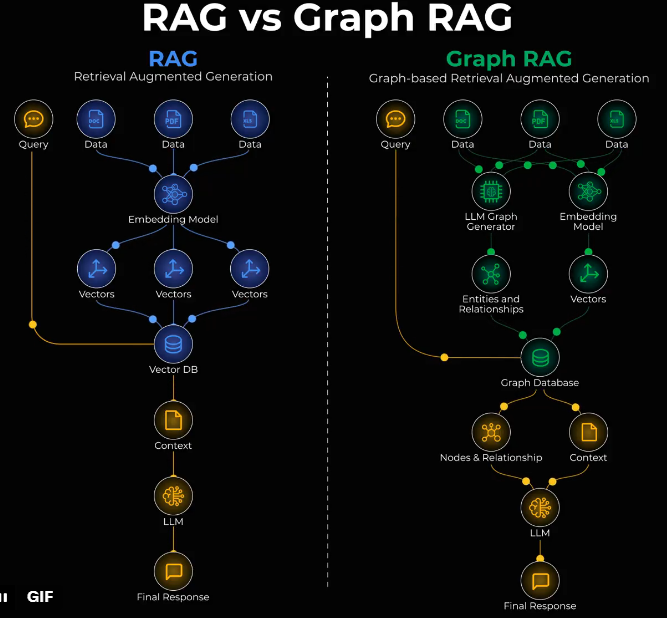

---


</details>

---


<details>
<summary><strong>웹 스크래핑은 이제 절대 예전과 같지 않을 것입니다.</strong></summary>


(대규모 100% 오픈소스 비주얼 검색)

PixelRAG는 HTML 파싱을 완전히 건너뛰는 검색 시스템입니다.

페이지를 텍스트로 스크래핑하고 청크를 임베딩하는 대신, 페이지를 스크린샷으로 캡처하고 이미지를 검색합니다. 비전-언어 모델이 픽셀에서 직접 답변을 읽어냅니다.

그 이유가 중요한 이유: 파싱은 웹 RAG가 조용히 정보를 잃어버리는 지점입니다.

- 단일 HTML-텍스트 파서 하나가 페이지의 40% 이상을 떨어뜨릴 수 있습니다.
- 테이블, 차트, 레이아웃은 평평하게 되거나 버려집니다.
- 파서만 교체해도 동일한 문서에서 정확도가 ~10포인트 움직일 수 있습니다.

PixelRAG는 사람이 실제로 보는 페이지를 인덱싱합니다. 팀은 위키피디아 전체의 비주얼 인덱스를 구축했으며, 3천만 개 이상의 스크린샷으로 구성되었고, 텍스트 전용 QA에서 가장 강력한 텍스트 RAG 기준선보다 18.1% 더 우수한 성능을 보입니다.

리포지토리에는 Claude에게 시각을 부여하는 Claude Code 플러그인도 포함되어 있습니다.

이 플러그인은 Claude가 어떤 URL도 스크린샷으로 캡처하고 DOM을 스크래핑하는 대신 렌더링된 페이지를 읽을 수 있게 합니다. 따라서 라이브 페이지, arXiv 논문, 또는 로컬 사이트를 건네주고 실제로 어떻게 보이는지 물어볼 수 있습니다.

하나의 설정 스크립트. MCP 서버 없음, 백엔드 없음.

파이프라인이 작동하는 방식:

- 각 문서(웹, PDF, 이미지)를 이미지 타일로 렌더링합니다.
- 스크린샷에 대해 LoRA 미세 조정된 Qwen3-VL-Embedding으로 임베딩합니다.
- FAISS 인덱스를 구축하고 검색 API를 제공합니다.

더 강력한 리더 모델은 인덱싱을 다시 할 필요 없이 정확도를 높여줍니다. 인덱스가 단순히 픽셀이기 때문입니다.

모든 것이 Apache-2.0 라이선스 하에 오픈소스입니다.

GitHub 리포지토리:

[https://github.com/StarTrail-org/PixelRAG](https://t.co/qun9TjAdmw)

---


</details>

---


<details>
<summary><strong>AI 엔지니어를 위한 8가지 RAG 아키텍처</strong></summary>


(사용법과 함께 설명)

1. Naive RAG
    - 쿼리 임베딩과 저장된 임베딩 간의 벡터 유사성에만 기반하여 문서를 검색합니다.
    - 직접적인 의미 매칭으로 충분한 간단하고 사실 기반 쿼리에 가장 적합합니다.
2. Multimodal RAG
    - 텍스트, 이미지, 오디오 등 여러 데이터 유형을 처리하며, 모달리티 간 임베딩과 검색을 수행합니다.
    - 텍스트 쿼리에 텍스트와 이미지 컨텍스트를 모두 사용한 답변과 같은 교차 모달 검색 작업에 이상적입니다.
3. HyDE (Hypothetical Document Embeddings)
    - 쿼리가 문서와 의미적으로 유사하지 않습니다.
    - 이 기술은 검색 전에 쿼리에서 가상의 답변 문서를 생성합니다.
    - 이 생성된 문서의 임베딩을 사용하여 더 관련성 높은 실제 문서를 찾습니다.
4. Corrective RAG
    - 검색된 결과를 신뢰할 수 있는 소스(예: 웹 검색)와 비교하여 검증합니다.
    - LLM으로 전달하기 전에 검색된 콘텐츠를 필터링하거나 수정하여 최신이고 정확한 정보를 보장합니다.
5. Graph RAG
    - 검색된 콘텐츠를 지식 그래프로 변환하여 관계와 엔티티를 포착합니다.
    - 원시 텍스트와 함께 구조화된 컨텍스트를 LLM에 제공하여 추론을 강화합니다.
6. Hybrid RAG
    - 단일 파이프라인에서 밀집 벡터 검색과 그래프 기반 검색을 결합합니다.
    - 작업이 비구조화된 텍스트와 구조화된 관계 데이터를 모두 필요로 할 때 더 풍부한 답변을 위해 유용합니다.
7. Adaptive RAG
    - 쿼리가 간단한 직접 검색을 필요로 하는지 아니면 다단계 추론 체인을 필요로 하는지 동적으로 결정합니다.
    - 복잡한 쿼리를 더 작은 하위 쿼리로 분해하여 더 나은 커버리지와 정확성을 제공합니다.
8. Agentic RAG
    - 계획, 추론(ReAct, CoT), 메모리를 가진 AI 에이전트를 사용하여 여러 소스에서 검색을 조율합니다.
    - 도구 사용, 외부 API 또는 여러 RAG 기술 결합이 필요한 복잡한 워크플로우에 가장 적합합니다.

여기 대부분의 아키텍처는 검색 시점의 결정 형태를 포함합니다. 하지만 이들은 모두 이미 인덱싱된 것 위에서 실행됩니다.

그 인덱싱 단계가 엉망인 청크를 출력하면, 모든 아키텍처가 이를 상속받습니다. 이를 개선하는 것은 위의 8가지와 별개의 문제입니다.

인덱싱 단계에 대한 더 나은 단위에 대해 썼습니다. 그 기술:

- 코퍼스 크기를 40배 줄입니다.
- 쿼리당 토큰을 3배 줄입니다.
- 벡터 검색 관련성을 2.3배 향상시킵니다.

그리고 이는 검색 알고리즘, 재순위기 또는 임베딩 모델을 변경하지 않습니다.

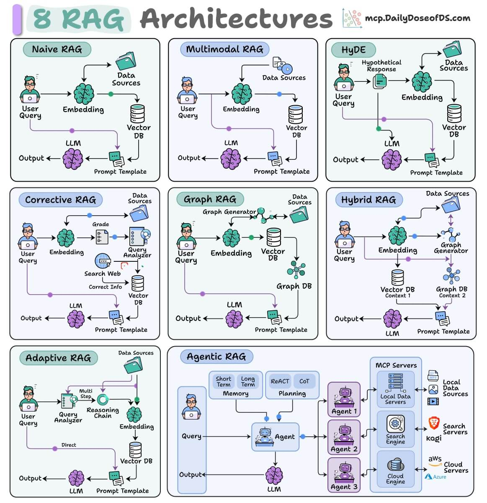

---


</details>

---


<details>
<summary><strong>AI는 수천 개나 수백만 개의 정보 중에서 올바른 정보를 어떻게 찾을까요?</strong></summary>


AI 애플리케이션은 종종 유용한 작업을 수행하기 전에 정보를 찾아야 합니다.

일반적인 키워드 검색으로는 항상 충분하지 않습니다.

사용자가 이렇게 물을 수 있습니다: "비밀번호를 잊어버렸어요. 어떻게 재설정하나요?"

하지만 관련 문서는 이렇게 말할 수 있습니다: "계정 설정에서 자격 증명을 재설정할 수 있습니다."

단어는 정확히 같지 않지만 의미는 유사합니다.

여기서 임베딩과 벡터 데이터베이스가 등장합니다.

**✨ 벡터 데이터베이스란 무엇인가요?**

벡터 데이터베이스는 임베딩을 저장하고 검색하도록 설계된 데이터베이스입니다.

임베딩은 정보를 벡터로 표현합니다. 데이터의 패턴과 관계를 포착하는 숫자 목록입니다.

AI 애플리케이션이 문서를 처리할 때, 각 청크는 임베딩으로 변환됩니다.

예를 들어:  
"계정 설정에서 비밀번호를 재설정할 수 있습니다."

는 다음과 같이 변환될 수 있습니다:

[0.21, -0.43, 0.87, ...]

벡터 데이터베이스는 이 임베딩과 함께 유용한 정보를 저장합니다:

→ 원본 텍스트  
→ 문서 ID  
→ 메타데이터  
→ 소스

**✨ 사용자가 질문을 하면 어떻게 되나요?**

사용자가 이렇게 묻는다고 가정해 봅시다:

"비밀번호를 잊어버렸어요. 어떻게 재설정하나요?"

애플리케이션은:  
→ 질문을 임베딩으로 변환합니다  
→ 벡터 데이터베이스를 검색합니다  
→ 가장 유사한 벡터를 찾습니다  
→ 해당 텍스트 청크를 검색합니다  
→ 프롬프트에 추가합니다  
→ 프롬프트를 LLM에 보냅니다

그 후 LLM은 검색된 정보를 사용하여 답변을 생성합니다.

**✨ 왜 일반 데이터베이스를 사용하지 않나요?**

전통적인 데이터베이스는 "WHERE user_id = 123" 같은 쿼리에 훌륭합니다.

하지만 AI 애플리케이션은 종종 다른 종류의 검색이 필요합니다:

"이 질문과 의미적으로 유사한 정보를 찾아라."

벡터 데이터베이스는 바로 이를 위해 최적화되어 있습니다.

기억해야 할 중요한 점:  
벡터 데이터베이스는 답변을 생성하지 않습니다.  
관련 정보를 찾을 뿐입니다.

애플리케이션이 이를 검색합니다.  
LLM이 이를 바탕으로 추론합니다.

이 때문에 벡터 데이터베이스는 ChatGPT와 Claude Code부터 Cursor, GitHub Copilot, Bug0, 그리고 AI 기반 검색 및 추천 시스템에 이르기까지 현대 AI 애플리케이션의 중요한 구성 요소가 되었습니다.

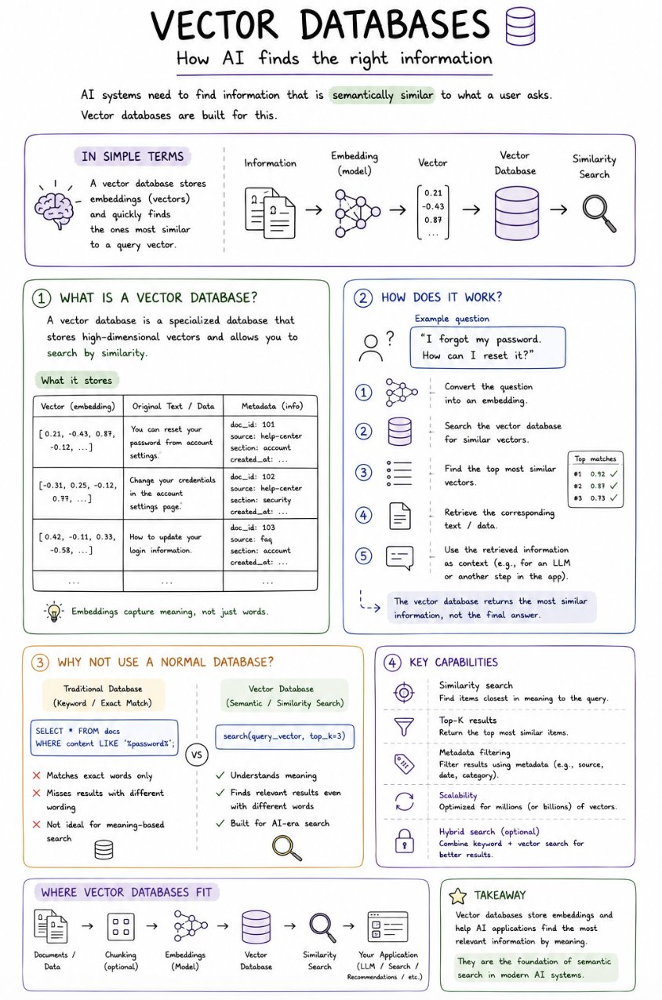

---


</details>

---


<details>
<summary><strong>대부분의 LLM 실패는 모델 실패가 아닙니다. 검색 실패입니다.</strong></summary>


RAG는 올바른 문제를 해결합니다. 전체 아키텍처를 한 번에 설명하면 다음과 같습니다:

1. 수집 → 문서 파싱, 청크로 분할, 모든 청크 임베딩
2. 저장 → 768차원 벡터를 ANN 인덱스(HNSW / IVF)에 푸시
3. 검색 → 쿼리 임베딩, 상위 k개 유사 청크 추출, 재순위화
4. 생성 → LLM이 해당 청크를 맥락으로 사용해 답변 생성, 인용 포함

핵심 통찰: 모델은 추론 레이어뿐입니다. 인덱스가 지식 레이어입니다. 둘 중 하나를 독립적으로 업그레이드하고, 둘 다 더 빠르게 배포하세요.

포스터의 숫자:  
→ 검색 정밀도  
@5  
: 0.91  
→ 충실도: 0.88  
→ P95 지연 시간: 246 MS  
→ 근거 기반 답변: 94%

AI 시스템을 구축한다면, 이 포스트를 저장하세요. 재사용할 참고 자료입니다.

전체 분석 + 데이터 모델은 여기:

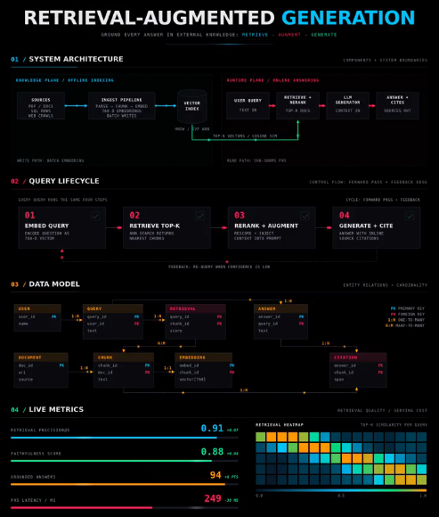

---


</details>

---


<details>
<summary><strong>RAG - 문서에서 답변까지 🤖</strong></summary>


RAG는 단순한 “검색 + LLM” 이상입니다

1. 수집(Ingestion)
    - 문서 → 청크(Chunks)
    - 청크 → 임베딩(Embeddings)
    - 벡터 → 벡터 저장소(Vector Store)
2. 검색(Retrieval)
    - 질문 → 쿼리 벡터(Query Vector)
    - 유사도 검색 → 상위 K(Top-K)
    - 상위 K → 관련 컨텍스트(Relevant Context)
3. 생성(Generation)
    - 질문 + 컨텍스트 → 프롬프트(Prompt)
    - 프롬프트 → LLM
    - 로짓(Logits) → 소프트맥스(Softmax) → 확률(Probabilities)
    - 다음 토큰 선택 → 반복(Repeat)
4. 최종 답변(Final Answer)
    - 토큰 단위로 생성됨
    - 검색된 컨텍스트에 기반함

핵심 아이디어:  
답변을 생성하기 전에 올바른 컨텍스트를 검색하세요. 🎯

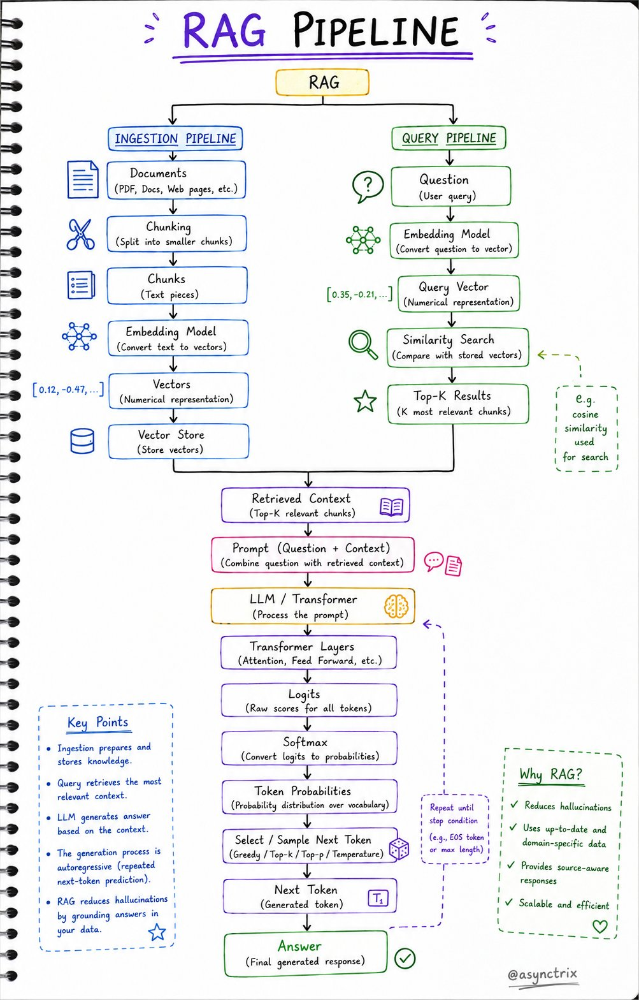

---


</details>

---


<details>
<summary><strong>마이크로소프트가 모든 사람이 처음부터 구축하려고 애쓰는 RAG 파이프라인을 조용히 출시했습니다</strong></summary>


이것은 Kernel Memory라고 불리며, 파일 더미를 인용과 함께 답변하는 AI 메모리로 변환합니다.

데이터를 넣기만 하면 마이크로소프트의 파이프라인이 나머지를 처리합니다:

> PDF, Word, PPT, Excel, 웹 페이지, 심지어 이미지까지 흡수  
텍스트를 추출하고, 청크로 나누고, 벡터로 임베딩  
메타데이터와 함께 벡터를 저장하고, 원본을 블롭 스토리지에 유지  
질문을 하면 의미론적 + 하이브리드 검색으로 적합한 청크를 끌어옴  
> 

그 다음, 정확한 소스에 대한 링크와 전체 토큰 사용량과 함께 근거 있는 답변을 반환합니다.

그리고 이미 실행 중인 모든 것에 연결됩니다:

> 모델을 위해 Azure OpenAI, OpenAI, Ollama, 또는 Anthropic  
벡터를 위해 Qdrant, pgvector, Redis, 또는 Azure AI Search  
모든 단계가 교체 가능한 핸들러이므로, 원하는 부분을 자신의 것으로 교체할 수 있음  
> 

한 가지 주의사항: 마이크로소프트는 2026년 6월에 저장소를 아카이빙하고, 이를 프로덕션용이 아닌 참조 블루프린트로 출시했습니다. 하지만 메모리와 RAG가 실제로 어떻게 구축되는지에 대한 지도로서, 이보다 더 깔끔한 것은 없습니다.

한 명령어로 실행:

```java
docker run kernelmemory/service
```

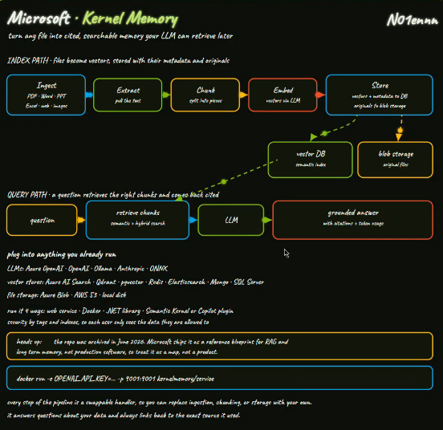

이걸 북마크하세요. 마이크로소프트가 이미 블루프린트를 그렸으니, 당신은 그 위에 구축하기만 하면 됩니다.

[https://github.com/microsoft/kernel-memory](https://github.com/microsoft/kernel-memory)

---


</details>

---


<details>
<summary><strong>Static RAG는 죽었다, 에이전트가 다음이다.</strong></summary>


대부분의 사람들은 RAG를 고급 AI라고 생각한다.

그렇지 않다.

그건 시작점일 뿐이다.

이 시각 자료는 지금 일어나고 있는 진짜 변화를 보여준다:

RAG vs Agentic RAG

간단한 용어로 차이점을 설명하면 다음과 같다:

🔹 RAG (검색 증강 생성)

- 관련 문서를 가져온다
- 이를 LLM에 제공한다
- 답변을 생성한다

➡️ 선형적. 한 번에 끝. 제한된 사고.

🔹 Agentic RAG

- 당신의 쿼리를 재작성한다
- 누락된 정보가 무엇인지 결정한다
- 최적의 데이터 소스를 선택한다 (DB, API, 웹)
- 답변이 실제로 좋을 때까지 반복한다

➡️ 동적. 반복적. 목표 지향적.

큰 통찰은? RAG는 정보를 검색한다.

Agentic RAG는 더 나은 정보를 검색하는 방법에 대해 생각한다.

AI 제품을 구축하고 있다면, 이 변화는 선택이 아니라 불가피하다.

AI 시스템을 작업 중이라면 이걸 저장해라.

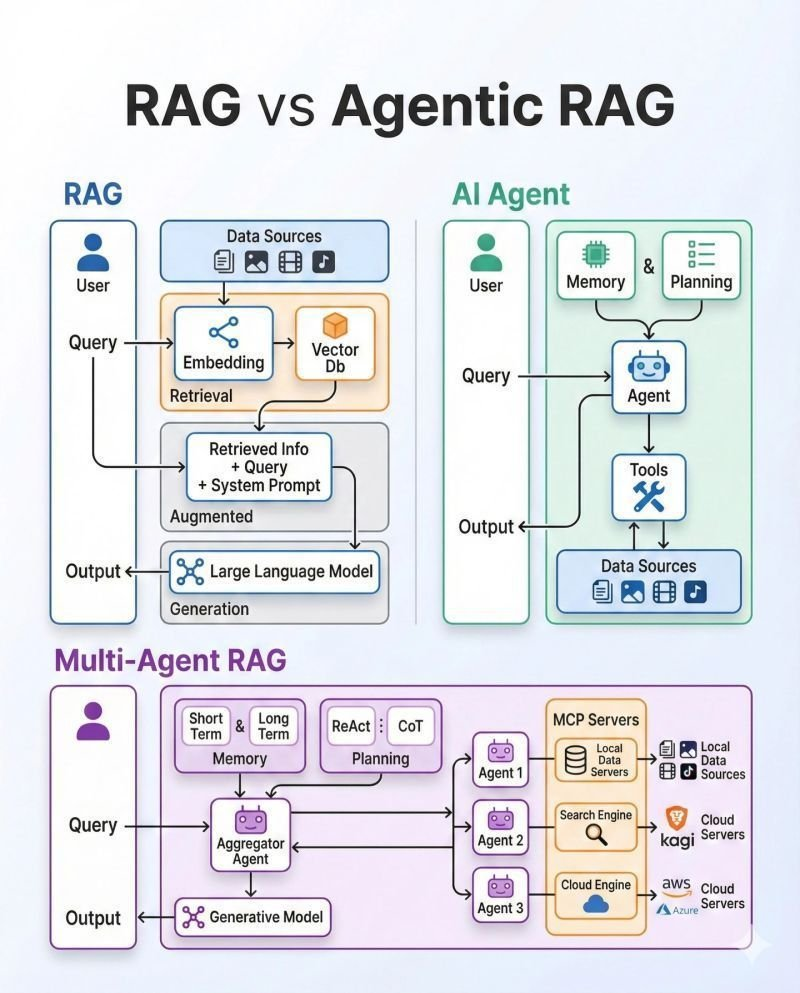

---


</details>

---


<details>
<summary><strong>RAG - 문제와 해결책</strong></summary>


문제: 모델이 사용자의 비공개 데이터를 모름  
해결책: 검색 - 쿼리 시점에 관련 문서를 가져와서 모델에 컨텍스트로 전달.

문제: 키워드 검색이 의미를 놓침  
해결책: 임베딩과 벡터 검색 - 정확한 단어가 아닌 의미로 검색.

문제: 의미 검색이 정확한 이름, ID, 희귀 용어를 놓침  
해결책: 하이브리드 검색 - BM25와 벡터 검색을 결합.

문제: 문서가 하나의 단위로 임베딩하기에 너무 길음  
해결책: 청킹 - 문서를 검색 가능한 조각으로 분할.

문제: 청크가 주변 컨텍스트를 잃음  
해결책: 컨텍스트 청킹 - 각 청크에 문서 수준 컨텍스트를 첨부.

문제: 상위 k 결과가 잡음이 많음  
해결책: 재순위화 - 크로스 인코더로 후보를 재정렬.

문제: 사용자 쿼리가 모호하거나 잘못 표현됨  
해결책: 쿼리 재작성 / HyDE - 검색 전에 쿼리를 개선.

문제: 답변이 단일 청크가 연결하지 못하는 여러 문서에 퍼져 있음  
해결책: GraphRAG - 엔티티와 관계를 지식 그래프로 추출한 후, 연결된 증거를 수집하기 위해 탐색.

문제: 한 번의 검색 패스가 충분하지 않음  
해결책: 에이전트 RAG - 검색, 판단, 다시 검색.

---


</details>

---


<details>
<summary><strong>LLM의 가장 많은 use case는 여전히 문서에서 원하는 *정답*을 빠르게 찾는 것입니다.</strong></summary>


Upstage에서 최근 출시한 가볍고 빠른 Embeddings2 그리고 파일만 주시면 RAG를 구현하고 SolarPro4를 호출하여 정답을 찾아 주는 FileSearch API를 공개합니다.

몇 줄의 코드로 원하는 RAG가 완성됩니다. 또는 바이브코딩시 [https://console.upstage.ai/llms.txt만](https://console.upstage.ai/llms.txt%EB%A7%8C) 주시면 알아서 만들어 줄 것입니다.

[llms.txt](../../assets/rag/llms.txt)

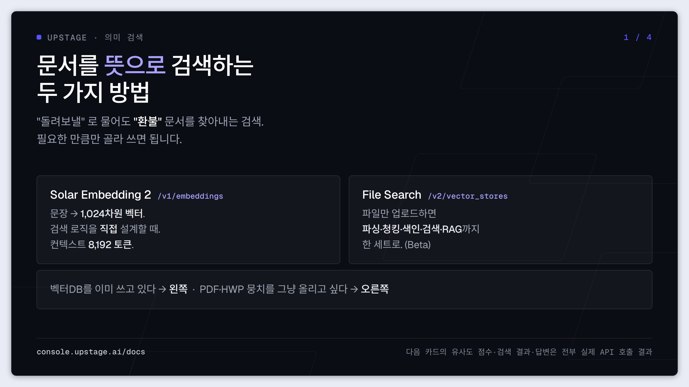

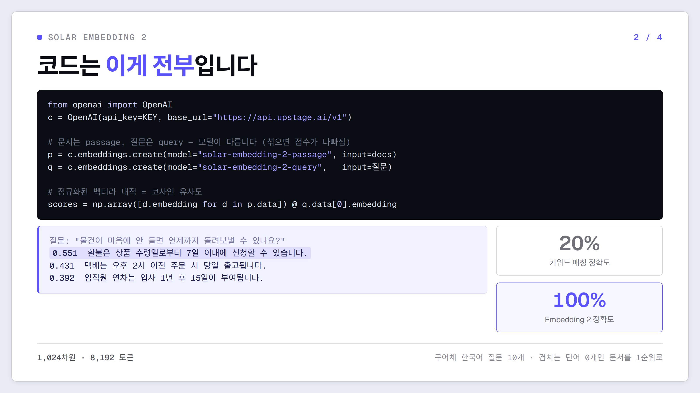

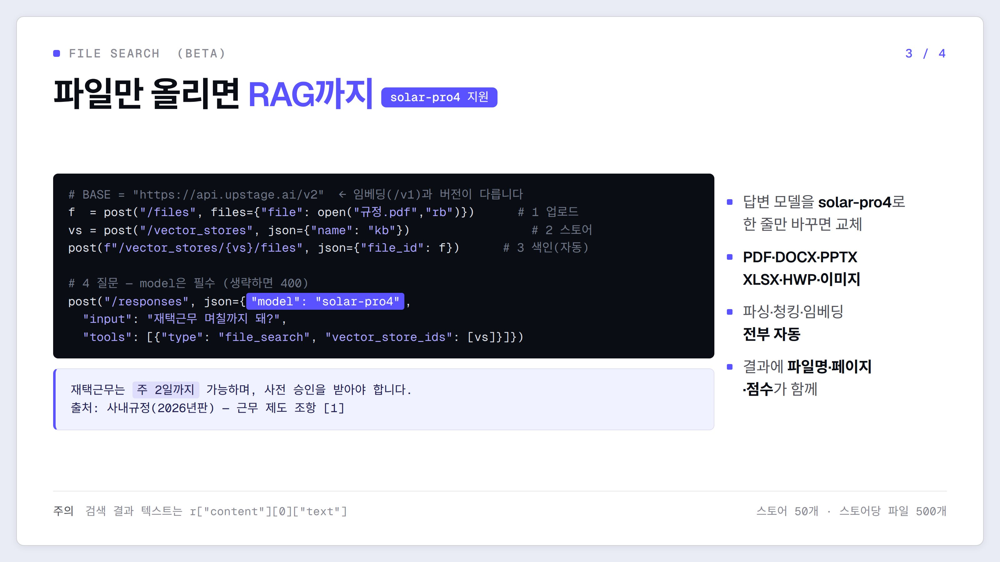

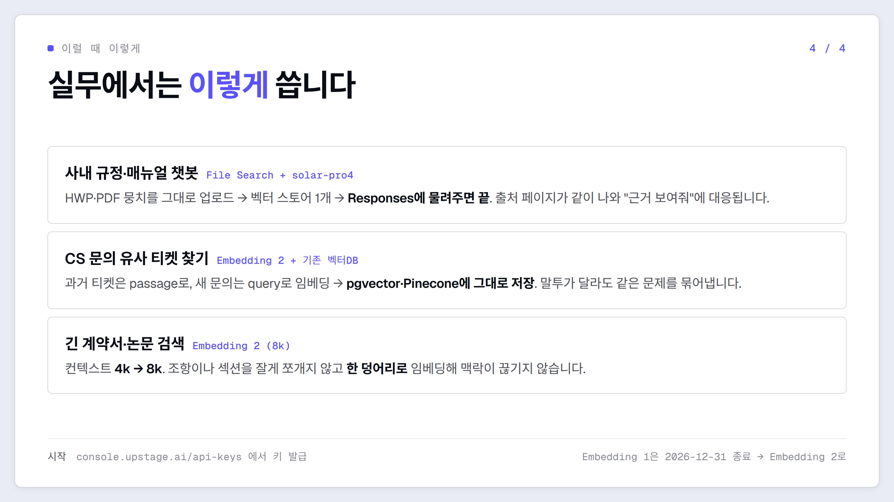

---


</details>

---


<details>
<summary><strong>RAG에서 컨텍스트 그래프로: 어떤 아키텍처가 실제로 승리하는지 결정짓는 블라인드 테스트</strong></summary>


동일한 모델, 동일한 12개 질문, 블라인드 채점

대부분의 팀들이 스택 어딘가에서 이미 실행 중인 세 가지 검색 설정에 대해 실행

아키텍처:

- RAG

> 청크화, 임베딩, 인덱싱, 검색  
top-k가 들어가고, 나머지는 절대 보이지 않음  
벽에 대한 임시방편이지, 근본 해결책이 아님  
> 
- long context

> 전체 코퍼스가 하나의 창에 로드됨  
1M 창의 12%에 도달하려면 127,068 토큰 필요  
그 5분의 1을 넘어서는 상황에 대해 아무도 테스트하지 않음  
> 
- context graph

> ~300개의 서브 에이전트, ~4,000개의 조정된 단계  
48개의 단절된 소스가 들어가고, 하나의 구조가 출력됨  
타입화된 에지, 공유 엔티티 - 300개의 별개 답변을 대충 붙인 게 아님  
> 

블라인드 테스트:

> tier A - 단일 사실, 한 곳: 둘 다 12/12, 승자 없음  
tier B - 기사 간 교차, 2-3 소스: long context가 앞서 나감  
tier C - 코퍼스 전체, 모든 것: long context가 완전히 휩쓸음  
> 

그 승리는 16배 더 비싸고 약 3배 더 오래 걸림

> 12 질문: RAG $0.23, long context $3.82  
12,000 질문: RAG $230, long context $3,800  
결정짓는 숫자: 코퍼스당 쿼리 수, 그 안에 있는 문서 수가 아님  
> 

자신의 스택에 그 수학을 적용해 보세요: 빈번하고 좁은 쿼리가 있는 코퍼스는 RAG를 long context로 교체하는 순간 12k 질문당 $3,570 추가 소모

프로젝트별이 아닌 작업별로 선택:

> 빈번하고 좁으며, 크고 안정된 코퍼스 -> RAG  
가끔, 깊고, 창에 맞음 -> long context  
광범위한 연구, 아직 코퍼스 없음 -> 에이전트 스웜 + 그래프  
> 

아키텍처 선택은 쉬운 부분입니다. 실제로 어떤 형태의 문제를 가지고 있는지 파악하는 게 먼저입니다

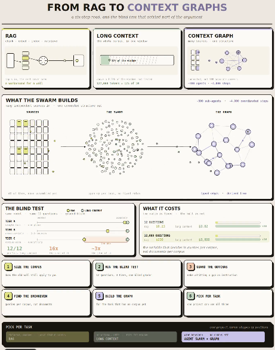

---


</details>

---


<details>
<summary><strong>MCP, RAG와 AI 에이전트는 서로 다른 문제를 해결합니다:</strong></summary>


MCP → AI 앱이 도구, 리소스 및 외부 시스템에 접근하는 방식을 표준화합니다.

RAG → 관련 정보를 검색하여 응답을 생성하기 전에 모델의 컨텍스트에 추가합니다.

AI 에이전트 → 목표를 받고, 무엇을 할지 결정하며, 도구를 사용하고 결과를 관찰한 후 작업을 완료할 때까지 계속합니다.

흥미로운 점은 이 세 가지를 결합할 때입니다.

예시 1: 지원

고객이 환불을 요청합니다.

> RAG가 반품 정책을 검색합니다.  
MCP가 주문을 조회하고 Stripe나 CRM에서 작업을 실행할 수 있게 합니다.  
에이전트가 해당 정보를 교차 확인하고, 규칙에 따라 다음 단계를 결정하며 적절한 경우 환불을 실행합니다.  
> 

예시 2: 개발

"이 버그를 조사하고 PR을 열어"라고 요청합니다.

> RAG가 서비스의 내부 문서를 검색합니다.  
MCP가 GitHub, Jira 및 CI에 접근할 수 있게 합니다.  
에이전트가 문제를 조사하고, 코드를 수정하며, 테스트를 실행한 후 PR을 엽니다.  
> 

RAG는 컨텍스트를 제공하고 MCP는 도구와 시스템 접근을 표준화합니다.

에이전트는 둘 다를 사용하여 목표를 달성합니다.

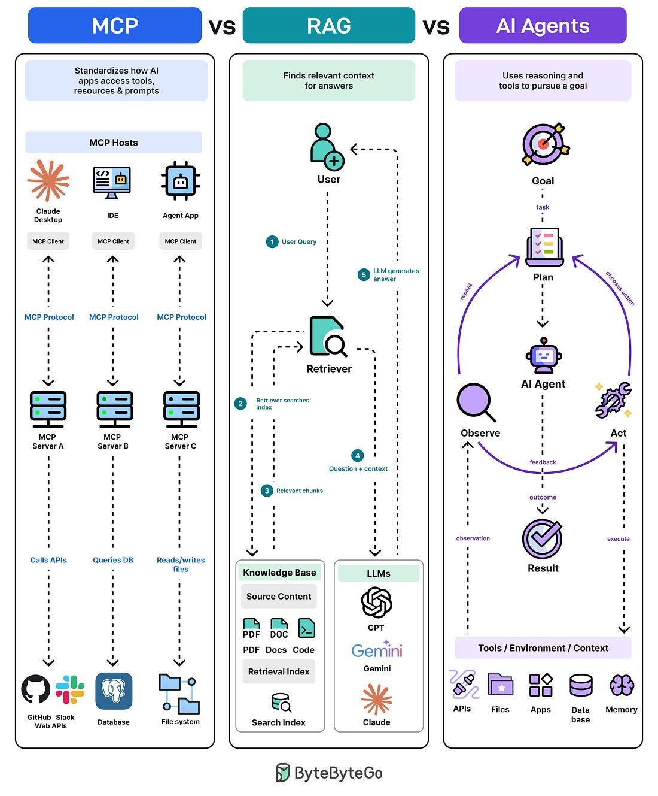

---


</details>

---


<details>
<summary><strong>전체 RAG 산업이 뒤집힐 거예요</strong></summary>


연구원들이 완전히 새로운 RAG 방식을 개발했는데, 거의 전통 RAG가 의존하던 모든 것을 우회하네요:

벡터 데이터베이스 불필요  
데이터 임베딩 불필요  
청크 분할 불필요  
유사도 검색 불필요

그 이름은 PageIndex

이제 문서를 조각조각 잘라서 Pinecone에 던져 넣는 대신, 트리 모양의 인덱스를 구축해서 대형 모델이 사람처럼 책을 읽으며 그 안에서 추론하며 검색할 수 있게 해요

FinanceBench 정확도 98.7%, 랭킹 보드의 모든 벡터 RAG를 앞질렀어요

완전 무료, 오픈소스

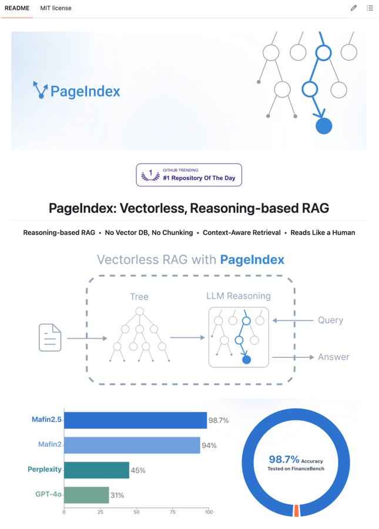

[https://github.com/VectifyAI/PageIndex](https://github.com/VectifyAI/PageIndex)
</details>

---

<!-- devtrack-draft-id: ce739fca-5863-44c0-b0b3-cd90b43552e3 -->
<details>
<summary><strong>RAG를 배우고 있다면, 또 다른 기본적인 "PDF 챗봇"을 만드는 데 시간을 낭비하지 마세요.</strong></summary>

대신 이 10가지 프로젝트를 만들어 보세요.

이 프로젝트들은 기본적인 검색에서 프로덕션급 AI 시스템까지 당신을 이끌어줄 겁니다:

1. 하이브리드 검색 RAG
    
    만들게 될 것:  
    BM25 키워드 검색과 밀집 벡터 검색을 결합하여 정확한 일치 항목과 의미적으로 관련된 문서를 모두 찾습니다.
    
    스택: Python · BM25 · Elasticsearch/FAISS · Sentence Transformers
    
2. 메타데이터 필터링 RAG
    
    만들게 될 것:  
    날짜, 카테고리, 작성자, 위치 등의 필터와 의미 검색을 결합하여 관련 컨텍스트를 좁혀줍니다.
    
    스택: Python · PostgreSQL · pgvector · Pydantic · OpenAI
    
3. 재순위화 RAG
    
    만들게 될 것:  
    많은 후보를 검색한 후 크로스-인코더를 사용해 재순위화하고, 가장 관련성 높은 청크만 LLM에 보냅니다.
    
    스택:Python · FAISS/pgvector · CrossEncoder/Cohere Rerank · OpenAI
    
4. 컨텍스트 청킹 RAG
    
    만들게 될 것:  
    청크를 생성할 때 문서 수준의 컨텍스트를 유지하여 검색된 구절이 독립적으로 의미 있게 유지되도록 합니다.
    
    스택: Python · Docling · OpenAI/Claude · pgvector
    
5. SQL + 벡터 RAG
    
    만들게 될 것:  
    구조화된 데이터에 대한 SQL과 비구조화된 지식에 대한 벡터 검색을 결합합니다.
    
    스택: Python · PostgreSQL · pgvector · SQLAlchemy · LangGraph
    
6. 지식 그래프 + 벡터 RAG
    
    만들게 될 것:  
    사실 간의 연결이 중요한 질문에 답하기 위해 의미 검색과 엔티티 간 명시적 관계를 결합합니다.
    
    스택: Python · Neo4j · pgvector · OpenAI · LangGraph
    
7. 수정 RAG
    
    만들게 될 것:  
    답변 전에 검색된 컨텍스트를 평가합니다. 검색이 약하다면 쿼리를 다시 작성하거나, 다시 검색하거나, 다른 소스를 사용합니다.
    
    스택: Python · LangGraph · OpenAI · pgvector · Tavily
    
8. 자가 RAG
    
    만들게 될 것:  
    시스템이 검색이 필요한 시점을 결정하고, 증거를 평가하며, 답변이 충분히 뒷받침되는지 확인하도록 합니다.
    
    스택: Python · LangGraph · OpenAI · pgvector
    
9. 멀티모달 RAG
    
    만들게 될 것:  
    모든 것을 단순 텍스트로 취급하는 대신 텍스트, 테이블, 이미지, 문서 페이지를 검색하고 추론합니다.
    
    스택: Python · Docling · Multimodal LLM · Vector DB · OpenAI
    
10. 에이전트 RAG
    
    만들게 될 것:  
    어떤 지식 소스나 도구를 사용할지 결정하는 에이전트를 만들고, 필요 시 여러 검색 단계를 수행하며 결과를 결합합니다.
    
    스택: Python · LangGraph · OpenAI · Vector DB · Search APIs
    

흥미로운 점은?

이것들은 10개의 완전히 별개의 아키텍처가 아닙니다.

당신은 이들을 결합할 수 있습니다.

하이브리드 검색 + 재순위화 + 메타데이터 필터링 + 수정 검색은 결국 하나의 프로덕션 RAG 파이프라인이 될 수 있습니다.

RAG를 진지하게 배우고 있다면, 여기서 멈추지 마세요:

"문서를 검색해서 LLM에 보낼 수 있어요."

검색을 정확하고, 컨텍스트가 있으며, 검증 가능하고, 적응적으로 만드는 방법을 배우세요.

</details>

---
