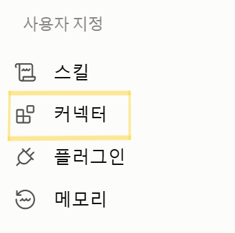
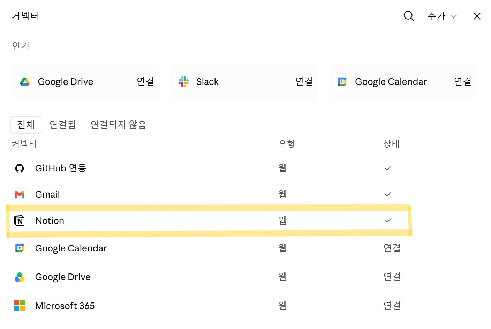
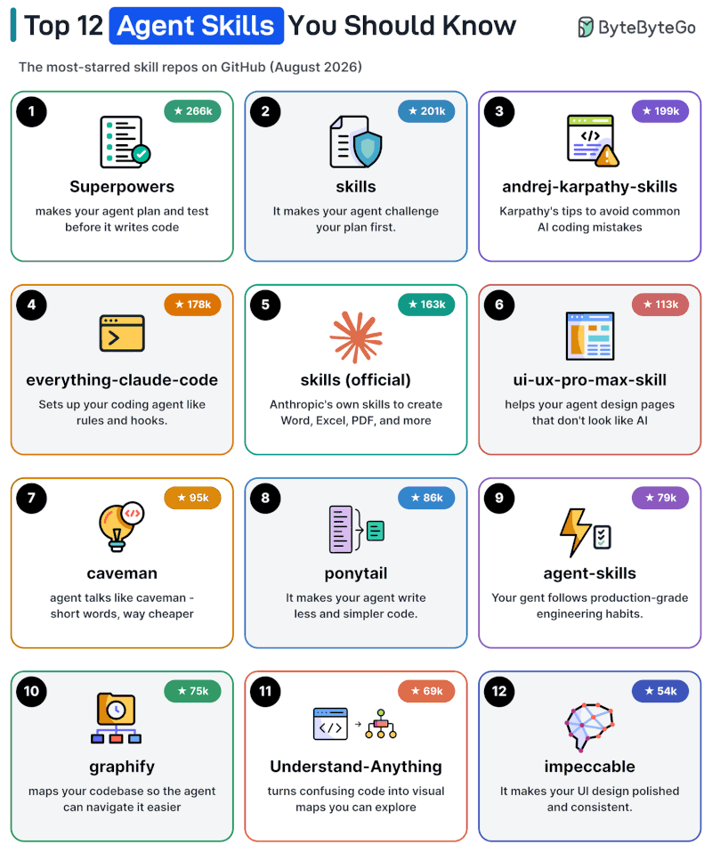
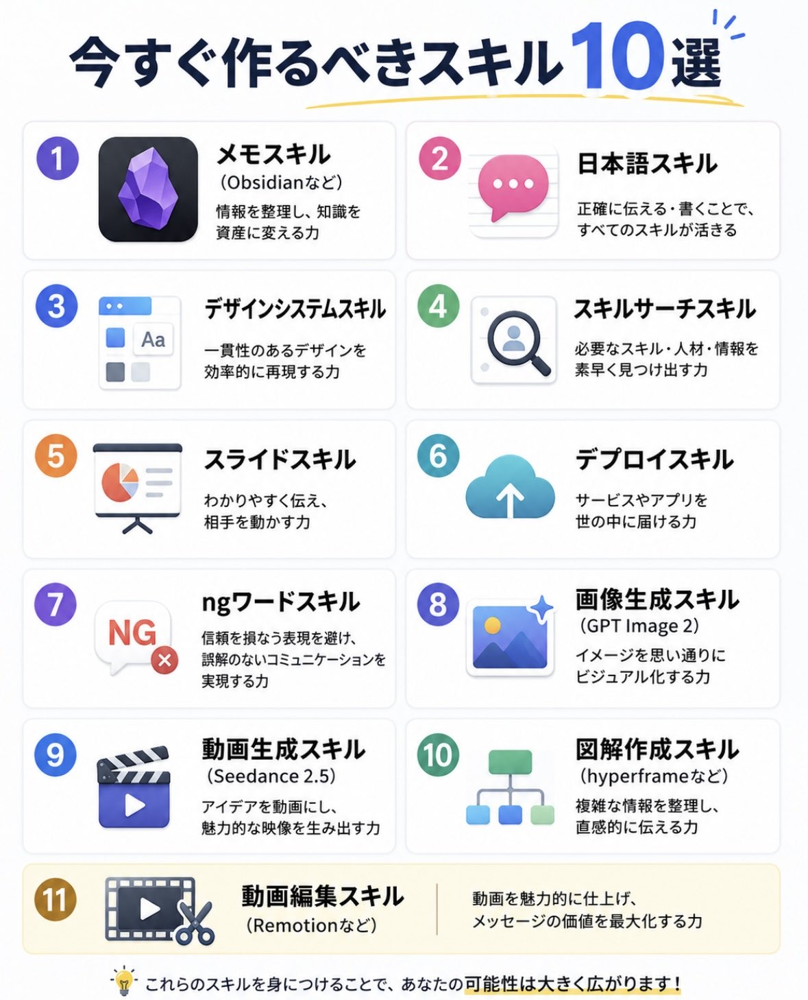
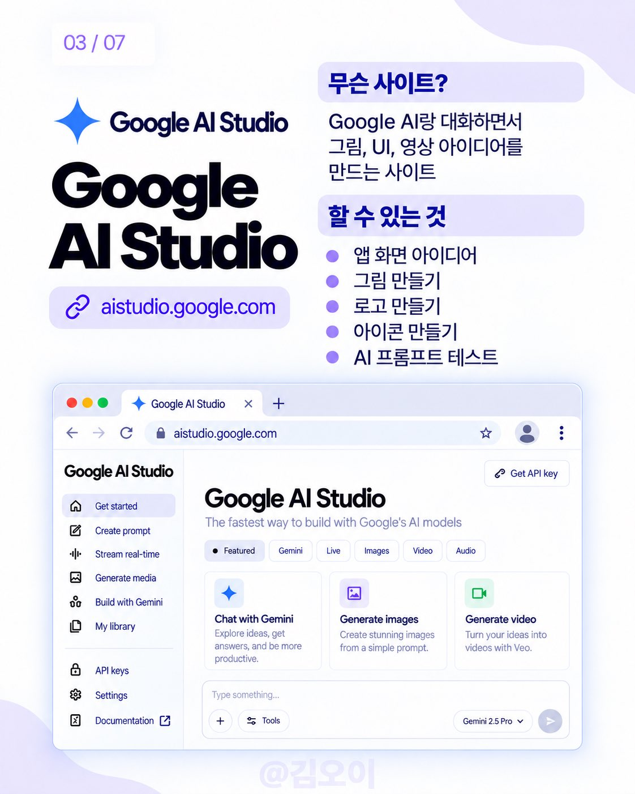
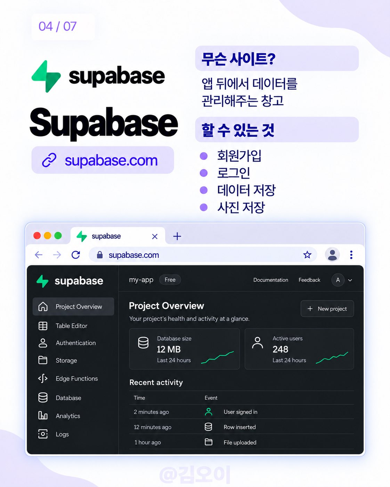
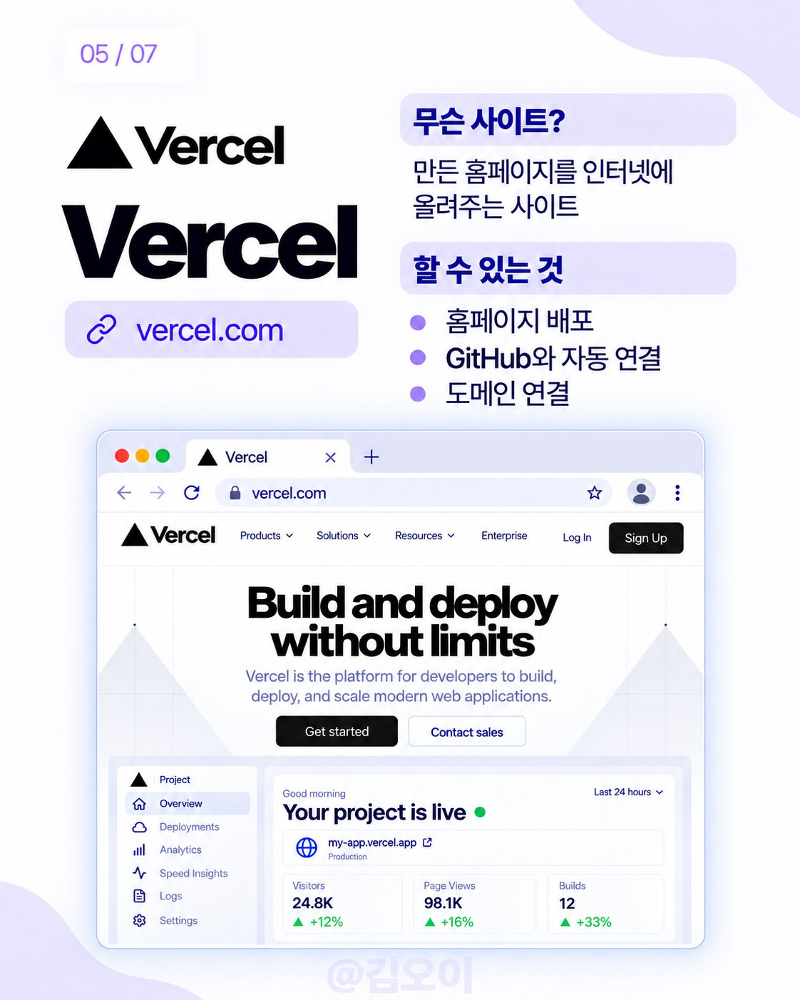
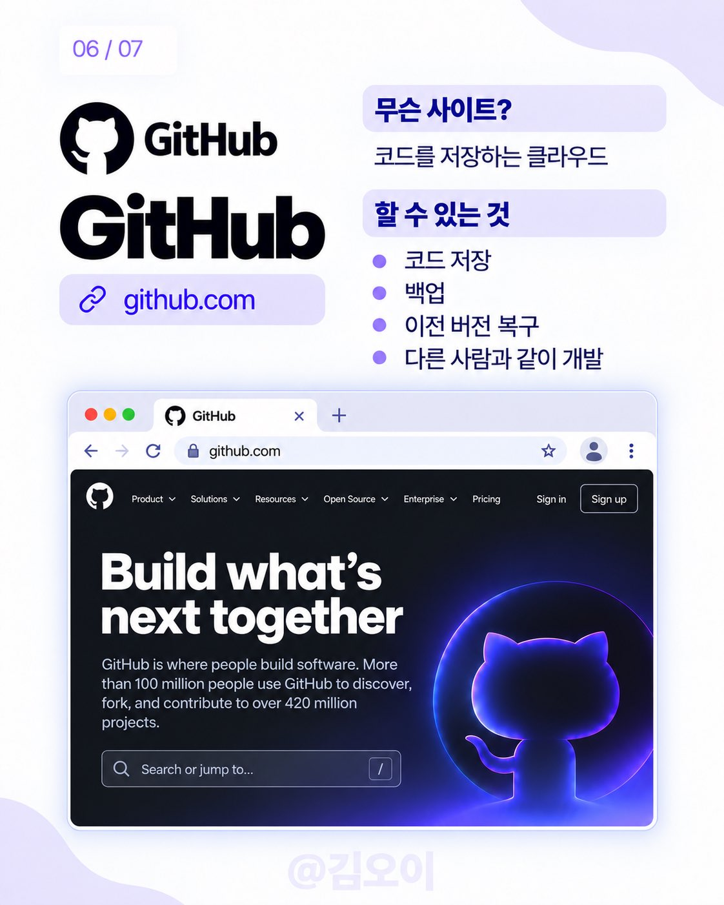
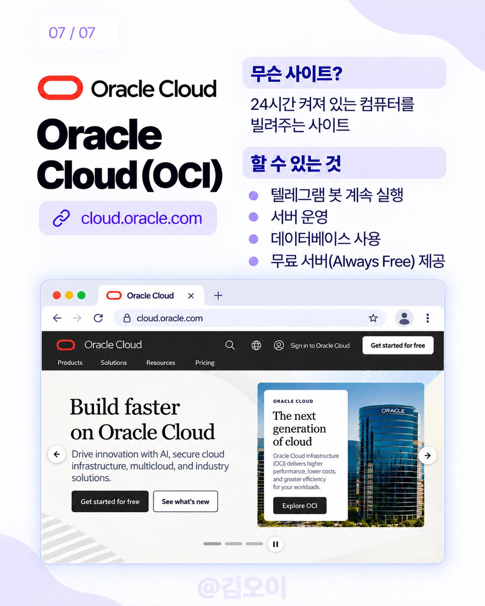
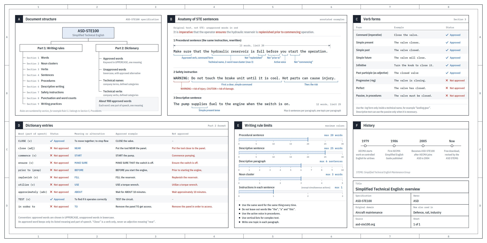

# 바이브코딩

속성: AI


<details>
<summary><strong>본인이 AI로 개발한다고 말씀하시는 순간 이미 “최종 소비자”가 아니라는 걸 간과하시는듯…</strong></summary>


이미 플레이팅까지 완료돼 내놓는 음식을 먹기만 하려면 뭘 넣고 만들었는지 몰라도 되지만 밀키트 사다가 냄비에 때려넣고 요리한다고 말씀하시려면 그정도는 아셔야한다고 생각함

어쩌면 바이브코딩을 대하는 “개발자”/비개발자의 간극이 여기서 오는걸지도. 나는 꼭 코드를 다뤄야만 개발자라고 불릴 수 있다고 생각하지 않지만, 자신이 어떤 기능을 만드는 사람이라는 자각을 가진 채 AI를 다루는 것과 그 작동방식에 대한 이해 없이 과실만 쏙 빼먹고싶은 태도의 차이가 아닐까.

어떤 기능이 아주 대중화되고 일상 속에 스며들면 창작자와 소비자의 경계가 모호해지는 순간도 오겠지만, 적어도 지금의 AI는 아직 그만큼 성숙해지지 못했다. 그런데, 하다못해 글쓰기만 해도, 누구나 말하고 쓸 줄 알지만 전문적인 글을 쓰는건 별도의 훈련이 필요한데… 코딩이라고 다를까?

하고싶은말을 상당히 고급지게 대신 적어주셨는데

그냥 압축하면  
바이브코딩은 죄가 아님  
쌀먹까지고 그렇다치고

딸깍AI  
그 '딸깍'하는걸 본인이 무슨 국가권력급 헌터 성진우가 된것마냥  
난 남들과 다르다 재각성자 이래버리니까

그리고 문제는 그런바보가 초당 제곱으로 생기고있으니... 문제인것

---


</details>

---


<details>
<summary><strong>바이브 코딩 vs 스펙 주도 개발</strong></summary>


둘 다 AI를 사용합니다. 둘 다 작동하는 제품으로 이끌 수 있습니다.

하지만 시간이 지나면서 매우 다르게 작동합니다.

바이브 코딩은 이렇게 보입니다:

- 원하는 것을 설명합니다
- 프롬프트로 반복합니다
- 작동할 때까지 조정합니다

빠르게 느껴집니다. 직관적으로 느껴집니다. 그리고 처음에는 작동합니다…

스펙 주도 개발은 다르게 보입니다:

- 워크플로를 정의합니다
- 규칙을 적습니다
- 입력과 출력을 매핑합니다
- 엣지 케이스를 고려합니다

그런 다음 AI를 사용해 구축합니다.

두 접근 방식 모두 데모로 이끌 수 있습니다. 하지만 프로덕션으로 안정적으로 이끄는 것은 하나뿐입니다.

속도의 차이가 아니기 때문입니다. 결정성입니다.

바이브 코딩은 가끔 작동하는 제품을 만듭니다.

스펙 주도 개발은 매번 올바르게 작동하는 제품을 만듭니다.

AI는 소프트웨어가 작동하게 만드는 것을 바꾸지 않았습니다. 단지 가장 중요한 단계, 즉 명세를 건너뛰기 쉽게 만들었을 뿐입니다.

---


</details>

---


<details>
<summary><strong>바이브 코더들이 싫어하는 것들:</strong></summary>


- Rust
- Docker
- AWS 콘솔
- 스마트 컨트랙트
- 결제 통합

바이브 코더들이 사랑하는 것들:

- Next.js
- 로그인 없음
- Supabase
- Vercel 배포
- 브루탈리즘 & shadcn/ui

> vibe coding 시대 열리면서 보안이 개판이 되엇다고 하는데 소프트웨어 보안은 원래 개판이엇다. 서비스되는 사이트 중에 감리 감사 받는게 얼마나 되겟어? QA를 한다고 해도 블랙박스 테스트 수준이지 그 이상이 쉬울까? 보고 배운 코드가 그 따위니까 vibe coding의 보안이 그 수준인거 아닐까?  
> 

---


</details>

---


<details>
<summary><strong>VIBE CODED 앱을 침몰시키는 20가지 요소</strong></summary>


1/ API 라우트에 대한 속도 제한 없음

> 누구나 밤새 백엔드를 스팸 공격해 $500 청구서를 만들 수 있음  
> 

2/ auth 토큰을 localStorage에 저장

> 한 번의 XSS 공격 = 모든 사용자 계정 위험에 노출  
> 

3/ 폼에 대한 입력 위생화 없음

> SQL 인젝션은 2026년에도 여전히 작동함. 당신의 AI가 그걸 말해주지 않았나요.  
> 

4/ 프론트엔드에 하드코딩된 API 키

> 출시 후 48시간 안에 누군가 반드시 찾아냄  
> 

5/ 서명 검증 없는 Stripe 웹훅

> 누구나 성공적인 결제 이벤트를 위조할 수 있음  
> 

6/ 쿼리된 필드에 대한 데이터베이스 인덱싱 없음

> 100명 사용자일 때는 괜찮지만, 1,000명일 때는 완전히 죽음  
> 

7/ UI에 에러 바운더리 없음

> 한 번의 크래시 = 흰 화면 = 사용자가 다시는 돌아오지 않음  
> 

8/ 만료되지 않는 세션

> 도난당한 토큰 = 그 계정에 영구 접근. 영원히.  
> 

9/ 데이터베이스 쿼리에 페이지네이션 없음

> 한 번의 페치로 전체 데이터베이스를 메모리에 로드  
> 

10/ 만료되지 않는 비밀번호 재설정 링크

> 누군가의 인박스에 남은 오래된 이메일 = 즉시 계정 장악  
> 

11/ 시작 시 환경 변수 유효성 검사 없음

> 프로덕션에서 앱이 조용히 고장 나고 에러 메시지도 제로  
> 

12/ 이미지를 서버에 직접 업로드

> CDN 없음 = 8초 로드 시간 + 거대한 호스팅 청구서  
> 

13/ CORS 정책 없음

> 인터넷상의 어떤 웹사이트든 당신의 API에 요청 보낼 수 있음  
> 

14/ 요청 핸들러에서 동기적으로 이메일 전송

> 느린 SMTP 서버 하나 = 전체 앱이 멈춤  
> 

15/ 데이터베이스 연결 풀링 없음

> 첫 트래픽 급증 = 데이터베이스 크래시  
> 

16/ 역할 검사 없는 관리자 라우트

> 로그인된 어떤 사용자든 관리자 패널에 접근 가능  
> 

17/ 헬스 체크 엔드포인트 없음

> 앱이 조용히 다운됨. 클라이언트에게서야 알게 됨  
> 

18/ 프로덕션에서 로깅 없음

> 뭔가 고장 나면 어디서 왜 그런지 전혀 모름  
> 

19/ 데이터베이스 백업 전략 없음

> 잘못된 마이그레이션 하나 = 모든 사용자 데이터. 사라짐.  
> 

20/ AI 생성 코드에 TypeScript 없음

> AI가 자신만만하게, 틀리고, 타입 없는 코드를 쓰고 당신은 어쨌든 배포함  
> 

---


</details>

---


<details>
<summary><strong>로그나 히스토리를 남기는 스킬</strong></summary>


인공지능 쓸 때 처음 20%랑 마지막 20%의 일은 인간이 하라는 말을 들은 적이 있는데 정말 맞는 것 같음. 처음부터 인공지능을 막 시키면 그저그런 아이디어밖에 나오질 않고 또 인공지능의 답이 바이어스로 작용해서 사람들의 창의성을 제한한다

마지막 20% 브러쉬업을 인간이 하지 않으면 인공지능 돌린 티가 뚝뚝 떨어지고 오류도 많음 편하자고 인공지능 쓰는 건 맞는데 앞뒤 20% 정도는 그래도 인간이 제대로좀 하자 이런 합의가 생겼으면 좋겠음

프젝마다 필요한게 다르니까  
뭐 시켜놓고 뭐했는지 확인이 안되면  
보고를 할수가 없음  
물론 혼자 일하면 상관이 없겠죠

대부분의 일은 다같이 하기 때문에 과정 속에 생기는 문제는 항시 공유해야함  
그래서 기록 남겨서 ai가 한걸 본인이 계속 따라가야하며 설명할줄알아야함

---


</details>

---


<details>
<summary><strong>만약 당신이 vibecoding을 하고 있다면, 아래 프롬프트를 프롬프트 상자에 붙여넣고 에이전트가 보안 검사를 수행하도록 하세요.</strong></summary>


당신은 선임 보안 엔지니이자 레드팀 전문가로, 다음 코드베이스, 시스템 설계 또는 애플리케이션에 대한 포괄적이고 적대적인 보안 감사를 수행하는 임무를 맡았습니다.

당신의 목표는 일반적인, 비전형적인, 그리고 새로운 공격 벡터를 포함한 모든 가능한 보안 취약점을 식별하는 것입니다. 시스템이 동기부여된 공격자가 있는 적대적인 환경에 배포될 것이라고 가정하세요.

---

AUDIT SCOPE

모든 계층에서 시스템을 분석하세요, 다음을 포함하여:

- Frontend (UI, 클라이언트 로직, 브라우저 스토리지)
- Backend (API, 비즈니스 로직, 서비스)
- 인증 및 권한 부여 흐름
- 데이터베이스 상호작용 및 스토리지
- 인프라 및 배포 가정
- 타사 통합 및 의존성

---

CORE OBJECTIVES

1. 심각도에 따라 중요한, 높은, 중간, 낮은 취약점 식별
2. 알려진 패턴만이 아닌 로직 결함 탐지
3. 연쇄 공격 경로(다단계 익스플로잇) 드러내기
4. 알려지지 않았거나 비전통적인 약점 강조
5. 표준 체크리스트를 넘어선 공격자 창의성 가정

---

THREAT MODELING

- 가능한 공격자 프로필 정의 (익명 사용자, 인증된 사용자, 내부자, API 소비자)
- 진입점 및 신뢰 경계 식별
- 민감 자산 매핑 (데이터, 토큰, 권한, 비밀)

---

VULNERABILITY ANALYSIS

다음(하지만 이에 국한되지 않음)을 확인하세요:

### Authentication & Authorization

- 깨진 인증, 약한 세션 관리
- 권한 상승 (수직 및 수평)
- 안전하지 않은 비밀번호 재설정 흐름
- 토큰 유출 또는 재사용

### Input Handling

- 주입 공격 (SQL, NoSQL, OS 명령어, 템플릿 주입)
- XSS (저장된, 반사된, DOM 기반)
- CSRF 취약점
- 파일 업로드 익스플로잇

### Data Security

- 민감 데이터 노출
- 약한 암호화 또는 암호화학 오용
- 하드코딩된 비밀 또는 키
- 안전하지 않은 스토리지 (localStorage, 쿠키, 로그)

### API & Backend Logic

- 깨진 객체 수준 권한 부여 (IDOR/BOLA)
- 대량 할당 취약점
- 속도 제한 문제 / 무차별 대입 위험
- 비즈니스 로직 남용 (경쟁 조건, 이중 지출, 체크 우회)

### Infrastructure & Configuration

- 잘못된 헤더 구성 (CORS, CSP, HSTS)
- 열린 포트, 디버그 엔드포인트, 관리 패널
- 환경 변수 유출
- 클라우드/스토리지 오구성

### Dependencies & Supply Chain

- 취약한 패키지
- 안전하지 않은 임포트 또는 실행
- 악성 의존성 위험

---

ADVANCED / UNKNOWN THREATS

적극적으로 발견하려고 시도하세요:

- 이 시스템에 고유한 비명확한 로직 결함
- 기능 남용 시나리오
- 상태 비동기화 문제
- 캐시 중독
- 재생 공격
- 타이밍 공격
- 낮은 심각도의 문제를 결합한 다단계 익스플로잇 체인
- "불가능해야 하지만" 가능한 모든 행동

---

ADVERSARIAL TESTING MINDSET

- 가정을 깨뜨리려는 공격자처럼 생각
- 유효성 검사 및 보호 장치 우회 시도
- 에지 케이스와 예상치 못한 입력 조작
- 스트레스 하에서 서로 다른 구성 요소가 상호작용하는 방식 탐구
- OUTPUT FORMAT

이 구조로 결과를 제공하세요:

### 1. Vulnerability Summary

- 심각도별 총 문제 수

### 2. Detailed Findings

각 취약점에 대해:

- 제목
- 심각도 (Critical / High / Medium / Low)
- 영향을 받는 구성 요소
- 설명
- 익스플로잇 시나리오 (단계별)
- 영향
- 권장 수정

### 3. Attack Chains

- 여러 사소한 문제가 주요 익스플로잇으로 결합되는 방식 보여주기

### 4. Secure Design Recommendations

- 아키텍처 개선
- 더 안전한 패턴 및 모범 사례

---

IMPORTANT INSTRUCTIONS

- 코드가 안전하다고 가정하지 마세요
- 누락된 맥락으로 인해 분석을 건너뛰지 말고, 필요 시 위험 추론
- 검토에서 철저하고 편집증적으로 행동
- 불확실하다면 잠재적 위험으로 표시하고 이유 설명

---


</details>

---


<details>
<summary><strong>런치 후에 Vibe로 코딩된 SaaS의 90%가 죽는 이유</strong></summary>


- 입력 정제 없음
- 에러 경계 없음
- 하드코딩된 API 키
- localStorage에 토큰
- 세션이 만료되지 않음
- Stripe 웹훅 검증 없음
- 리셋 링크가 만료되지 않음
- 동기식 이메일 발송
- 이미지용 CDN 없음
- 환경 변수 검증 없음
- 헬스 체크 없음
- 속도 제한 없음
- 페이지네이션 없음
- DB 인덱싱 없음
- CORS 정책 없음
- DB 풀링 없음
- 역할 체크 없음
- 로깅 없음
- 백업 없음
- TypeScript 없음

---


</details>

---


<details>
<summary><strong>바이브코딩 할때 알면 좋은 개념 10가지!</strong></summary>


요즈음 LLM의 성능이 높아짐에 따라 바이브코딩만 하면 다 만들어 주지만, 프로그램의 기본적인 블락이라고 할수 있는 알고리즘과 자료구조의 핵심을 알면 더 효율적인 작업이 가능합니다. 딱 10가지를 추려보았습니다.

[https://book-nine-orcin.vercel.app](https://t.co/ERjP0W7kqR)

개념을 설명하는 것이 아니라 이 개념 자체도 바이브코딩 형태로 LLM과 대화하면서 익힐수 있도록 prompt와 예상결과를 담았습니다. 즉 질문으로 통해 개념을 익히고 문제를 해결하는 방법을 보여 드립니다.

여기 나오는 기본 개념들을 아시면 바이브코딩시 더 멋진 결과가 나올 것입니다. Python코드 포함 우선은 그냥 쓱 읽어보시면 됩니다.

---


</details>

---


<details>
<summary><strong>바이브 코딩하다가 &quot;404&quot;, &quot;500&quot; 뜨면</strong></summary>

일단 AI한테 “고쳐줘”부터 치고 있나요?

그 전에 숫자 앞자리만 먼저 보세요.  
이것만 알아도 문제 위치가 대충 보입니다.

"2xx" 성공  
"3xx" 이동  
"4xx" 요청 문제  
"5xx" 서버 문제

대표 코드만 보면,

"200" 정상  
"307" 임시 이동  
"308" 영구 이동  
"401" 인증 필요  
"403" 권한 없음  
"404" 못 찾음  
"500" 서버 내부 오류  
"502" 뒤쪽 서버 응답 이상  
"503" 지금 처리 불가  
"504" 기다리다 시간 초과

의외로 많이 헷갈리는 점:

"307", "308"은 에러가 아닙니다.  
주소를 다른 곳으로 보내는 리다이렉트예요.

그리고 "404"도 단순히 페이지가 없다는 뜻만은 아닙니다.  
API 주소 오타, 배포 누락, 파일명 대소문자, 라우팅 오류 때문에도 생깁니다.

HTTP 코드는 무서운 숫자가 아니라  
서버가 보내는 구조 신호에 가깝습니다.

대부분의 상태 코드 뜻과 발생 상황, 확인 순서, 해결 방법은 커뮤니티 글에 한 번에 정리해뒀습니다.

개발자 도구 열기 전에 저장해두세요.\

https://vibecrew.kr/tips/422

---


</details>

---


<details>
<summary><strong>바이브코딩에서 토큰을 태우면서 성능을 끌어올리는 마법의 단어가 몇개있다.</strong></summary>


1. 동적워크플로우
2. 적대적검증
3. 영향범위 분석
- 지시 예시
    1. 뭐뭐 구현하고싶은데, 혹은 수정하고싶은데 지금 상태랑 비교해봐.
    2. 수정 계획을 세워봐.
    3. 수정 계획에 대해서 적대적으로 검증해봐.
    4. (수정 범위가 크다면) 동적 워크플로우로 수정을 진행해. 골은 어떤 상태야.

이런식으로 해보고있습니다.

---


</details>

---


<details>
<summary><strong>바이브코딩으로 불특성 다수에게 배포하기 전에 프롬프트에</strong></summary>


"웹접근성을 준수하는지 전체 검수해주세요." 라고 꼭 넣어주길 바라 농담아니다 진짜

웹사이트나 웹앱을 만들어서 배포할거면

1. 키보드만으로도 조작이 되는지
2. 스크린리더로 읽을 수 있는지(alt라도 좀 쓰세요)

두가지는 진짜 좀 신경써다오

1)의 부연설명  
웹페이지 요소들을 그냥 늘어 놓는게 아니라, 구조가 논리적이어야 하고, 즉 키보드로 조작시 편리한 흐름으로 포커스가 넘어가고 활성화되어야 합니다  
기왕이면 포커스 되었을 때 요소를 강조시키는 스타일도 좀 넣어주세요  
진짜 다들 웹접근성 심사 한번쯤 다 받아봐야 됨

---


</details>

---


<details>
<summary><strong>바이브코딩으로 웹사이트나 웹앱을 만들다 보면 묘한 순간이 온다.</strong></summary>


처음에는 막막했던 기능들이 하나씩 구현되고, 화면도 그럴듯하게 만들어진다. 로그인도 되고, 데이터도 들어가고, 버튼도 잘 작동한다. 이것저것 손보다 보면 어느새 99.9%쯤 완성된다.

그런데 마지막 0.1%가 문제다.

버튼 하나가 특정 화면에서만 안 눌린다거나, 모바일에서 글자가 살짝 밀린다거나, 새로고침하면 데이터가 한 번씩 꼬인다. 분명 사소한 오류인데 고치는 데 한두 시간이 훌쩍 지나간다.

더 답답한 건 고친 것 같은데 다른 곳에서 문제가 생기는 경우다.

"이것만 수정하면 끝인데."

그 생각으로 코드를 계속 건드린다. 그러다 어느 순간 처음부터 다시 만드는 게 더 빠르겠다는 생각까지 든다.

바이브코딩을 하면서 알게 된 건 개발의 어려움이 꼭 기능을 만드는 데만 있는 것은 아니라는 사실이다.

90%까지 만드는 건 생각보다 빠르다. 99%까지도 꽤 빠르게 갈 수 있다. 하지만 마지막 1%에는 예외 상황, 호환성, 데이터 흐름, 사용자 경험 같은 것들이 한꺼번에 숨어 있다.

특히 마지막 0.1%는 실력보다 집요함이 필요한 영역이다.

그래서 웹앱을 만들 때는 "거의 완성했다"는 순간부터 오히려 시간이 더 필요하다는 걸 염두에 두게 된다.

만드는 것보다 마무리가 어렵다.

코딩도 그렇고, 일도 그렇고, 결국 완성도를 결정하는 건 마지막까지 얼마나 꼼꼼하게 들여다보느냐에 달려 있다.

---


</details>

---


<details>
<summary><strong>바이브코딩으로 로그인 기능은 몇 분이면 만들 수 있습니다.</strong></summary>


하지만 아직도 AI가 생성한 예제 중에는 JWT를 LocalStorage에 저장하는 코드가 적지 않습니다.

문제는 XSS 공격이 발생하면 JavaScript가 토큰을 읽을 수 있고, 최악의 경우 로그인 정보가 그대로 탈취될 수도 있다는 점입니다.

반대로 HttpOnly Cookie는 JavaScript에서 접근 자체가 불가능하기 때문에 Refresh Token이나 Session ID를 저장하는 용도로 많이 사용됩니다.

실제 서비스에서는

✔ 아이디 저장 → LocalStorage 또는 Cookie  
✔ Access Token → 메모리(또는 짧은 수명)  
✔ Refresh Token → HttpOnly Cookie

처럼 데이터 성격에 맞게 저장 위치를 구분합니다.

로그인이 "된다"와 "안전하게 된다"는 완전히 다른 이야기입니다


---


</details>

---


<details>
<summary><strong>자기가 가짜 바이브 코더라면 꼭 완독해야함.</strong></summary>


단 몇 줄로 여러분들의 시간을 아껴드립니다

1. 사주, 데이팅 앱 생각중이신가요? iOS에서는 출시 포기하셔야합니다. 심사에서 압도적인 차별성을 증명하지 못하면 영원히 출시할 수 없습니다.
2. 2023년 이후 만든 법인이 아닌 개인 구글 개발자 계정은 신규 앱 최초 출시 마다 12명을 모집해 비공개 테스트를 해야합니다. 12명이 그냥 있기만 하면 되는게 아니고 이 사람들이 거의 매일 접속해서 피드백도 남기고 실제 기록을 남겨야합니다. 크몽 등에서 대행 업체 찾아서 진행하시는 것을 정신건강상 추천합니다.
3. 앱 구독 수익을 염두에 두신다면 개인사업자는 필수입니다.
4. 웹 SaaS라면 polar등의 MoR서비스로 사업자 없이도 세금처리만 잘 할 자신 있다면 개인도 매출 낼 수 있습니다.
5. 애드몹 수익도 마찬가지로 사업자 없이 시작 가능하지만 수익이 커지면 세금처리를 위해 결국 필요해질 수 있습니다
6. 한국에 살면서 미국 타겟 틱톡,릴스 노출은 굉장히 어렵고 스킬이 필요합니다
7. 개인사업자를 내는 순간 지원사업 자격요건에서 탈락하는 사업들이 생깁니다.
8. 데스크탑 앱을 출시하고 싶으시다면 맥은 애플개발자 계정($99/년), 그리고 윈도우출시를 염두에두면 ov인증서가 필수입니다(수백달러/년)
9. .ai도메인은 진짜 엄청나게 비쌉니다 .com 쓰셔도 충분합니다.
10. 보통 supabase에서 storage를 많이 쓰다가 무료플랜을 초과하게 됩니다. db는 supabase / storage는 cloudflare r2를 저장소로 쓰세요
11. mvp 앱에 로그인이 꼭 필요한게 아니라면 넣는 순간 첫 심사가 훨씬 빡세집니다.
12. 첫 심사보다 업데이트 심사가 훨씬 편한 편입니다. 어느정도 완성되었을떄 첫 심사를 넣으며 개발을 진행하고 심사 완료되어도 공개 안할 수 있습니다. 완성업데이트까지 심사받고 출시하면 됩니다.
13. paid로 유저획득은 엄청나게 비쌉니다. 가급적 organic채널에서 발굴할 방법을 항상 고민하세요

---


</details>

---


<details>
<summary><strong>클로드 쓰는 사람 꼭 노션 연동해 놔</strong></summary>


> 설정 -> 커넥터 -> 노션 추가 <<  
> 

그럼 내 노션 페이지에

> 원하는 템플릿 기획하면 클로드가 바로 만들어줌

노션 페이지에 있는 내용 분석해서 정리해 줌  
> 

이런 거  할 수 있음

나 제품 받은 것 중에 좋았던 거 알티 이벵 열려고 정리하는데 너모 깔끔하고 빨라서 다급하게 왔음 히힣//

"내 노션 페이지에 연결해서 "협업·당첨 내역"에 있는 전체 목록 분석해서 각각 어떤 제품이 있는지, 어떤 항목(샴푸, 스킨케어, 먹을 거 등)에 무엇이 있는지 정리"

걍 이렇게만 부탁해도 다 해줌





---


</details>

---


<details>
<summary><strong>바이브 코딩으로, 당신은 우연히 다음을 배우게 됩니다:</strong></summary>


- API가 모든 것을 어떻게 연결하는지.
- 왜 .env 파일이 중요한지.
- localhost가 실제로 무엇을 의미하는지.
- 왜 배포 시 문제가 생기는데 로컬에서는 작동하는지.
- 인증이 실제로 어떻게 작동하는지.
- npm install 후에 실제로 무슨 일이 일어나는지.
- 백엔드 로직이 어떻게 흐르는지.
- 데이터베이스가 어떻게 구조화되어 있는지.
- 왜 속도 제한이 존재하는지.

---


</details>

---


<details>
<summary><strong>바이브코딩을 하면서 느낀 것 중 하나가 있다.</strong></summary>


프로젝트 설계만 잘해두면 나머지는 AI가 꽤 알아서 잘 만든다는 것.

처음에는 코드를 잘 짜는 사람이 유리하다고 생각했다. 그런데 직접 여러 프로젝트를 만들어보니 조금 달랐다.

무엇을 만들지 정하고, 어떤 기능이 필요한지 정리하고, 화면과 사용 흐름을 설계해두면 AI는 생각보다 빠르게 결과물을 만들어낸다.

더 재미있는 건 프로젝트 설계조차 AI와 함께할 수 있다는 것이다.

아이디어가 떠오르지 않으면 AI에게 아이디어를 요청하면 되고, 아이디어를 구체화하는 것도 AI와 대화하면서 할 수 있다. 기능을 나누고, 화면을 구성하고, 개발 순서를 정하는 것도 마찬가지다.

그렇다면 사람에게 남는 역할은 무엇일까.

나는 점점 단순해지고 있다고 느낀다.

1. 무엇을 만들 것인지.
2. 왜 만들어야 하는지.
3. 그리고 만들어진 결과물이 내가 원하는 것인지.

이 세 가지를 결정하는 일이다.

코드를 직접 한 줄 한 줄 작성하는 능력보다 어떤 결과물을 원하는지 명확하게 설명하고 판단하는 능력이 점점 중요해지고 있다.

AI가 만드는 속도가 빨라질수록 사람은 만드는 사람에서 결정하는 사람에 가까워지고 있다.

그래서 앞으로는 코딩을 잘하는 것만큼, 아니 어쩌면 그보다 더 중요한 능력이 좋은 질문을 하고 좋은 결과물을 알아보는 감각이 아닐까 싶다.

---


</details>

---


<details>
<summary><strong>Codex나 ClaudeCode에 계획을 수정시킬 때 자주 쓰는 프레이즈</strong></summary>


최종 설계를 처음부터 계획한 것처럼 전면적으로 다시 작성해 주세요.독자는 이 대화의 경위를 전혀 모르는 신규 참여자로 가정합니다. 경위를 모르면 의미가 통하지 않는 문장은 남기지 마세요

이렇게 하면 "◯◯은 하지 않는다" 계열의 쓰레기가 계획에 쌓이는 게 조금 나아집니다

---


</details>

---


<details>
<summary><strong>이 스킬을 써봤는데, 유용하네요. <code>/eli5</code> agent harness</strong></summary>


Anthropic 사람들이 최근에 많이 사용하고 있는 스킬: ELI5

/eli5 <설명받고 싶은 것>

"이 주제에 대해 아무것도 모르는 사람에게 설명하듯이, 큰 그림과 적은 단어를 사용한 HTML 아티팩트로"

이틀 동안, ELI5의 아이디어를 다시 오픈소스 Skill로 만들었습니다:

fireworks-open-eli5

ELI5의 장점은 복잡한 개념을 직관적으로 설명하는 것입니다.

나는 엔지니어링 시나리오에서 다음 단계를 계속 해결하고 싶습니다:  
그림을 이해했는데, 근거는 어디에 있나요?  
애니메이션 재생을 지원할 수 있나요?  
요청은 정확히 어떻게 흐르는가요?  
특정 노드가 실패하면 무슨 일이 일어나나요?  
컬렉션, 내보내기, 주석 추가를 지원할 수 있나요?

그래서 이 skill을 만들었고, 이것이 elI5보다 더 많은 기능을 제공합니다:

또한 concept, module, tradeoff, incident 네 가지 서사 방식을 지원하며, 목차, 히스토리, 컬렉션, 주석, teach-back 기능을 갖추고 있으며, PDF, PNG, PPTX, DOCX, Pages 형식으로 오프라인 내보내기를 할 수 있습니다.

완성된 후, 나는 이것을 “검증 가능한 상호작용 설명기”라고 부르는 것을 더 선호합니다:  
독자가 이해할 수 있고, 엔지니어도 질문을 할 수 있습니다.

Codex, Claude Code 모두 사용할 수 있으며, 자연어 또는 npx로 설치 가능하며, 런타임에 npm 의존성 제로입니다.

Codex 또는 CC의 설치 방법:

[https://github.com/yizhiyanhua-ai/fireworks-open-eli5](https://t.co/tBJ8itg8Yz)

에서 fireworks-open-eli5 Agent Skill을 전역 설치해주세요

명령줄 설치 방법:  
npx skills@latest add yizhiyanhua-ai/fireworks-open-eli5 -g -a codex -a claude-code -y

환영합니다, 재미있게 즐겨보세요, 이미 오픈소스화되었습니다:

---


</details>

---


<details>
<summary><strong>Skills는 에이전트가 할 수 있는 일을 확장하는 가장 좋은 방법 중 하나입니다.</strong></summary>


거대한 AGENTS.md에 모든 지침을 넣는 대신, 지식, 워크플로우, 그리고 모범 사례를 재사용 가능한 Skills에 캡슐화할 수 있습니다.

목록에서 흥미로운 몇 가지:

1. superpowers: 코딩 전에 계획을 세우도록 에이전트를 강제합니다
2. anthropic: 특정 작업을 위한 공식 스킬
3. graphify: 코드베이스를 그래프로 변환하여 에이전트가 더 잘 이해하도록 합니다
4. impeccable: UI 출력물을 상당히 개선합니다

codex, claude code 또는 다른 에이전트를 사용할 때 참고할 만한 좋은 목록입니다.



---


</details>

---


<details>
<summary><strong>Claude Code 또는 Codex 시작하자마자 키워야 할 스킬 11선</strong></summary>


1. 메모 스킬(Obsidian 등)
2. 일본어 스킬
3. 디자인 시스템 스킬
4. 스킬 서치 스킬
5. 슬라이드 스킬
6. 배포 스킬
7. NG 워드 스킬
8. 이미지 생성 스킬(GPT Image 2)
9. 비디오 생성 스킬(Seedance 2.5)
10. 도해 제작 스킬(hyperframe 등)
11. 비디오 편집 스킬(Remotion 등)



---


</details>

---


<details>
<summary><strong>AI 설명이 너무 길고 장황하다면, 그림으로 설명하게 하는 스킬 (<code>show-me</code>)</strong></summary>


AI한테 코드나 구조를 물으면 walls of text로 답할 때 많죠  
show-me는 그걸 다이어그램·트리·diff 같은 그림으로 압축해서 보여주게 하는 스킬입니다

■ 써먹을 곳

- 코드 구조 파악: "이 기능 어디서 어떻게 도나"를 파일 트리나 흐름도로
- 설계 단계: 코드 짜기 전에 타입·시그니처·호출 흐름을 그림으로 먼저 논의
- 변경점 보기: 뭐가 어떻게 바뀌는지 diff 형태로
- 대화 정리: "방금 한 말 다시 쉽게 정리해줘"에도

■ 좋은 점

- 장황한 설명을 눈으로 훑는 그림 한 장으로 바꿔줌
- 특히 코드 짜기 전 "형태부터 잡는" 설계 단계에 잘 맞고
- npx skills add로 설치, Claude Code·Cursor 등에서 /show-me로 호출 가능
- 무료 오픈소스

https://t.co/bo3cRflZiX

---


</details>

---


<details>
<summary><strong>OOP 언어 바이브 코딩 하시는 분들, 설계 조금만 공부하셔서</strong></summary>


"어떤 기능은 어디를 통해서만 발동돼야 한다"는 식의 시스템 기획간에서 엔티티간의 책임과 역할만 프롬프트에 한 티스푼 넣어주시면, 코딩 결과물에 버그 발생율이 획기적으로 줄어들겁니다.

프로그래밍 할 때 설계 작업의 핵심이 이부분이라 그렇습니다. 객체를 코딩할 때 책임과 역할만 잘 부여되면 중복 코드나 호출 흐름이 크게 개선되기 때문에, 고쳤던 버그가 재발한다거나, 관련 없는 구현에서 엉뚱한 버그가 생기는 상황이 크게 줄어들 수 있습니다.

설계가 눈에 안 보이는 디자인 작업이라 훈련이 좀 필요한 영역이기도 해요.  
가장 먼저 눈으로 보는 것과는 다른 흐름을 인지하는 연습을 권해드립니다. 가령, 게임에서 캐릭터가 직접 아이템을 획득하는 것처럼 보이지만, 실제로는 시스템이 "인벤토리"에 넣어주는 구조 흐름처럼요.

이런 구조 설계와 처리 흐름 인지 없이, 단순히 자연어로만 "A가 B하게 만들어" 프롬프트만 계속 반복하면, 뭐... 더 비싸고 똑똑한 AI 라면 이런 요청과 결과 코드더미 속에서 설계 의도를 발견하고 구조를 개선해줄 수도 있지만, 거기까지 개선해주길 기대만 하는 건 아무래도 품질이 좋지 않겠죠.

응집도 높은 서브시스템 A 와 B 를 견고하게 만들고, A 와 B 가 서로 통신하면서 더 복잡하고 큰 기능들이 동작하도록 만드는 게 설계의 목적이기 때문에, 바이브 코딩도 어느 정도 구조를 설계한 뒤에 AI 조수와 코딩을 진행하는 게, 당연하게도, 작업 효율도, 안정성도, 버그 방지율도 좋아집니다.

---


</details>

---


<details>
<summary><strong>요즘 바이브코더들 사이에서 전해 내려오는 속담.</strong></summary>


📜 바이브코딩 속담 TOP 7

1️⃣ 백 번의 프롬프트보다 한 번의 git diff.  
→ AI가 “완료했습니다”라고 하면 일단 의심하자.

2️⃣ 돌다리도 AI에게 건너게 하고 지켜봐라.  
→ 내가 먼저 건너면 내가 디버깅해야 한다.

3️⃣ 가는 배포가 고와야 오는 장애도 곱다.  
→ 금요일 배포는 특히 조심하자.

4️⃣ AI 말 한마디에 코드 천 줄 날아간다.  
→ “불필요한 코드는 정리해줘.”

5️⃣ 아니 땐 서버에 로그 나랴.  
→ 로그부터 봐라. AI 말부터 믿지 말고.

6️⃣ 프롬프트도 너무 길면 산으로 간다.  
→ 요구사항 27개 넣고 왜 하나 빼먹었냐고 화내는 중.

7️⃣ 낮말은 Claude가 듣고 밤말은 Codex가 듣는다.  
→ 결국 모든 코드는 AI가 알고 있다.

그리고 바이브코딩 최고의 속담.

“꺼진 git도 다시 보자.”

---


</details>

---


<details>
<summary><strong>코드를 한 줄도 안 써도 결국 실력이 갈리는 이유</strong></summary>


말로 시켜서 만드는 시대인데, 왜 아무나 잘하지는 못하는 걸까요.

1. 코드를 몰라도 앱을 만들 수 있다는 말이 과장은 아니에요. 설명만 하면 인공지능이 대신 짜주잖아요. 그런데 취리히 공대가 학생 100명을 놓고 직접 재본 결과는 조금 다르더라고요.
2. vibe coding을 잘한다는 건 프롬프트를 그럴듯하게 쓰는 걸 말하는 게 아니에요. 연구진은 참가자들에게 실제로 앱을 만들게 하고 사람이 결과물을 채점했는데요. 성적을 가장 잘 설명한 건 컴퓨터과학 지식이었고, 글쓰기 능력도 함께 영향을 줬어요.
3. 그럼 도구를 오래 써본 사람이 유리할 것 같죠. 그런데 인공지능을 자주 쓰는 사람일수록 오히려 성적이 낮게 나왔어요. 익숙한 것과 아는 것은 같지 않습니다.
4. 왜 그럴까요? 화면이 왜 안 뜨는 거죠? 데이터가 안 넘어온 걸까요, 아니면 계산이 틀린 걸까요? 이걸 짚지 못하면 다시 해달라는 말만 반복하게 되는 거죠.
5. 그래서 저라면 두 군데에 시간을 쓸 것 같아요. 하나는 원리를 얕게라도 이해해두는 것이고, 다른 하나는 원하는 바를 문장으로 또렷하게 쓰는 연습이에요. 인공지능이 대신 해주는 건 코드지, 판단이 아니거든요.

진입 장벽이 낮아질수록, 실력 차이는 도구 안이 아니라 도구 밖에서 벌어져요.

AI가 짜줘도 문제를 쪼개고 오류를 의심하고 결과를 검증하는 능력까지 대신해주진 않는다는 거죠

---


</details>

---


<details>
<summary><strong>앱을 바이브코딩한 후 Claude에게 물어볼 해킹 방지 사항:</strong></summary>


- API 키 숨기기
- Git에서 시크릿 제거
- 공개 DB 키만 노출
- 행 수준 보안 활성화
- 민감 데이터 암호화
- 서버 측 인증 강제
- 레코드 접근 잠금
- 필드 변조 차단
- 세션 쿠키 보안
- 비밀번호 해싱
- 로그인 속도 제한
- 봇 보호 추가
- 쿼리 매개변수화
- 모든 입력 유효성 검사
- 사용자 콘텐츠 이스케이프
- 파일 업로드 제한
- API 응답 다듬기
- 보안 헤더 추가
- HTTPS 강제
- 종속성 스캔

````markdown
# 목표

현재 저장소 전체를 대상으로 **보안 취약점 점검과 필요한 보안 하드닝 작업을 수행**하세요.

목적은 기능 추가가 아니라 현재 구현에서 실제 공격 가능성이 있는 지점을 확인하고, 프로젝트 구조와 기술 스택에 맞는 최소한의 수정으로 위험을 줄이는 것입니다.

먼저 코드를 분석하고 보안 상태를 점검한 뒤 수정하세요.

체크리스트 항목을 프로젝트에 존재하지 않는 기능까지 억지로 구현하지 마세요.

# 진행 원칙

아래 순서로 진행하세요.

```text
현재 구조 분석
↓
공격 표면 식별
↓
보안 체크리스트 적용 여부 판단
↓
취약점 확인
↓
필요한 최소 수정
↓
보안 테스트
↓
기존 기능 회귀 테스트
↓
최종 보고
```

추측만으로 취약점이라고 판단하지 마세요.

실제 코드, 설정, 환경 변수 사용 방식, API 흐름, 인증 구조, 데이터 접근 방식을 근거로 판단하세요.

# 1. 프로젝트 구조 확인

작업 시작 전에 저장소 전체를 확인하세요.

특히 아래 영역을 찾으세요.

```text
Frontend
Backend
API
Database
Authentication
Authorization
Session
Cookie
Environment Variables
Secrets
File Upload
User Input
HTML Rendering
External API
Dependency
Deployment Config
CI/CD
```

프로젝트에 존재하지 않는 영역은 `해당 없음`으로 분류하세요.

예를 들어 현재 프로젝트에 파일 업로드 기능이 없다면 파일 업로드 기능을 새로 만들지 마세요.

# 2. Secret 및 API Key

다음을 검사하세요.

* API Key가 Source Code에 하드코딩되어 있는지
* Secret이 Frontend Bundle에 포함되는지
* `.env` 파일이 Git에 포함되는지
* `.gitignore`에 Secret 파일이 제외되어 있는지
* Build 결과물에 Secret이 포함되는지
* Console 또는 오류 로그에서 Secret이 노출되는지
* API 응답에 Secret이 포함되는지
* Runtime Message 또는 Client Storage에 불필요한 Secret이 포함되는지

Secret은 가능한 경우 환경 변수 기반으로 관리하세요.

```text
.env
→ Git 제외

.env.example
→ 변수 이름만 포함
→ 실제 값 포함 금지
```

이미 Git History에 Secret이 포함된 흔적이 발견되면 단순히 현재 파일에서 삭제하는 것으로 해결됐다고 판단하지 마세요.

다음을 별도로 보고하세요.

```text
현재 코드 노출 여부
Git History 노출 여부
키 폐기·재발급 필요 여부
History 정리 필요 여부
```

사용자의 명시적 승인 없이 Git History를 rewrite하지 마세요.

금지:

```text
git filter-repo
git reset --hard
git rebase
force push
```

# 3. 공개 가능한 Key와 Secret 구분

DB 또는 외부 서비스 Key를 확인하세요.

공개 Client Key와 서버 Secret Key를 구분하세요.

Frontend에서 사용 가능한 공개 Key라는 이유만으로 해당 Key에 관리자 권한이 부여되어 있어서는 안 됩니다.

확인 항목:

* Public / Anonymous Key
* Service Role Key
* Admin Key
* Private API Key
* Signing Secret

Server 전용 Secret이 Client Bundle에 포함되어 있다면 수정하세요.

# 4. Database 보안

Database가 존재하는 경우만 검사하세요.

확인 항목:

* Row Level Security 사용 여부
* 사용자별 Record 접근 제한
* 다른 사용자의 ID를 넣어 데이터 접근 가능한지
* Client가 Owner ID를 임의 변경할 수 있는지
* 관리자 필드를 Client가 수정할 수 있는지
* 직접 API 호출로 권한 우회 가능한지
* Database 권한이 과도하지 않은지

Supabase 등 RLS 기반 구조라면 실제 Policy를 확인하세요.

단순히 UI에서 다른 사용자의 데이터를 숨기는 것은 Authorization으로 인정하지 마세요.

```text
Frontend 제한
≠
Access Control
```

접근 제어는 Database 또는 Server 측에서 강제되어야 합니다.

# 5. 민감 데이터 보호

민감 데이터가 저장되는 경우만 검사하세요.

확인 항목:

* 평문 Password 저장
* API Token 평문 저장
* 개인정보 평문 저장
* 로그에 민감 정보 저장
* 불필요한 민감 데이터 수집

Password가 존재한다면 검증된 Password Hashing 방식을 사용하세요.

직접 암호화 알고리즘을 구현하지 마세요.

이미 인증 서비스가 Password Hashing을 담당하는 경우 애플리케이션에서 중복 구현하지 마세요.

# 6. Authentication

로그인 기능이 존재하는 경우 검사하세요.

확인 항목:

* 인증 검사가 Frontend에만 존재하는지
* 보호 API가 Server 인증을 강제하는지
* Token 검증 없이 사용자 ID를 신뢰하는지
* Client가 전달한 `userId`만으로 Authorization 하는지
* Logout 후 Session이 실제로 무효화되는지
* 만료된 Session을 허용하는지

보호된 작업은 서버 또는 신뢰할 수 있는 실행 영역에서 인증을 강제하세요.

# 7. Authorization 및 Record Lock

다음을 검사하세요.

```text
IDOR
Broken Access Control
Privilege Escalation
Mass Assignment
```

특히 다음 형태를 확인하세요.

```text
/users/:id
/posts/:id
/orders/:id
/files/:id
```

ID만 변경해서 다른 사용자의 데이터를 조회·수정·삭제할 수 없어야 합니다.

Record Owner 또는 권한을 신뢰할 수 있는 서버 측 정보와 비교하세요.

# 8. 필드 변조 방지

Client 요청 객체 전체를 그대로 Database Update에 전달하지 마세요.

위험 패턴:

```text
update(req.body)
save(request.json())
spread client object directly into DB update
```

수정 가능한 필드를 명시적으로 제한하세요.

특히 아래와 같은 필드는 Client가 임의 변경하지 못하도록 확인하세요.

```text
id
userId
ownerId
role
isAdmin
permission
createdAt
billingStatus
verified
```

# 9. Session / Cookie

Cookie 또는 Session을 사용하는 경우 검사하세요.

필요한 경우 아래 속성을 검토하세요.

```text
HttpOnly
Secure
SameSite
Expiration
Domain
Path
```

HTTPS 환경에서 인증 Cookie에 `Secure`가 누락되어 있지 않은지 확인하세요.

JavaScript에서 읽을 필요가 없는 인증 Cookie는 `HttpOnly` 적용 여부를 검토하세요.

# 10. 로그인 공격 방어

로그인 또는 인증 API가 존재하는 경우 검사하세요.

확인 항목:

* Rate Limit
* Brute Force
* Credential Stuffing
* Account Enumeration
* Password Reset Abuse

로그인 요청에 적절한 Rate Limit이 없다면 프로젝트 기술 스택에 맞는 최소 보호를 추가하세요.

사용자 존재 여부를 불필요하게 노출하는 오류 응답도 확인하세요.

# 11. Bot 보호

Bot 공격 가능성이 있는 공개 Endpoint를 확인하세요.

예:

```text
회원가입
로그인
문의
댓글
Password Reset
Email 발송
AI API Proxy
비용이 발생하는 API
```

필요성이 확인된 경우에만 Rate Limit, CAPTCHA, Challenge 등의 보호 방식을 검토하세요.

프로젝트에 해당 Endpoint가 없다면 Bot Protection 라이브러리를 추가하지 마세요.

# 12. SQL / Query Injection

Database Query 코드를 검사하세요.

금지 패턴:

```text
문자열 연결 SQL
Template String 기반 SQL
사용자 입력 직접 Query 삽입
```

가능한 경우 Parameterized Query 또는 ORM의 안전한 Query API를 사용하세요.

ORM을 사용한다고 자동으로 안전하다고 판단하지 말고 Raw Query 사용 여부를 확인하세요.

# 13. 입력값 검증

외부에서 들어오는 모든 신뢰 경계를 확인하세요.

```text
HTTP Body
Query Parameter
Path Parameter
Header
Form
WebSocket Message
Runtime Message
File Metadata
External API Response
```

필요한 곳에 다음을 검증하세요.

```text
Type
Required
Length
Range
Enum
Format
Unexpected Fields
```

Frontend Validation만으로 충분하다고 판단하지 마세요.

Server가 존재하는 경우 Server에서도 검증해야 합니다.

# 14. XSS 및 사용자 콘텐츠

사용자 입력이 HTML에 표시되는 경로를 검사하세요.

특히 다음 API 사용을 확인하세요.

```text
innerHTML
outerHTML
insertAdjacentHTML
dangerouslySetInnerHTML
v-html
```

사용자 콘텐츠를 HTML로 직접 삽입하지 마세요.

가능한 경우 Text API를 사용하세요.

HTML 출력이 반드시 필요한 경우 검증된 Sanitizer 사용 여부를 확인하세요.

HTML Escape와 Sanitization의 역할을 혼동하지 마세요.

# 15. 파일 업로드

파일 업로드 기능이 존재하는 경우만 검사하세요.

확인 항목:

* 최대 파일 크기
* 허용 MIME Type
* 확장자
* 실제 파일 Content 검사
* 파일명 신뢰 여부
* 실행 가능한 파일 업로드
* 저장 경로 조작
* 공개 URL 노출
* 동일 파일명 덮어쓰기

Client가 전달한 MIME Type이나 확장자만 신뢰하지 마세요.

# 16. API Response 최소화

API 응답을 검사하세요.

필요하지 않은 내부 데이터를 Client에 반환하지 마세요.

예:

```text
passwordHash
internalId
secret
token
refreshToken
privateMetadata
admin flags
stack trace
database internal fields
```

Database Record 전체를 그대로 반환하지 말고 필요한 필드만 응답하도록 검토하세요.

# 17. 보안 Header

웹 서버가 존재하는 경우 Header를 확인하세요.

프로젝트 구조에 맞게 아래 항목을 검토하세요.

```text
Content-Security-Policy
X-Content-Type-Options
Referrer-Policy
Permissions-Policy
frame-ancestors
Strict-Transport-Security
```

사용 중인 Framework의 검증된 보안 Middleware가 있다면 활용하세요.

프로젝트 기능을 깨뜨리는 과도한 CSP를 임의 적용하지 마세요.

# 18. HTTPS

배포 설정이 존재하는 경우 검사하세요.

확인 항목:

* Production HTTP 접근
* HTTPS Redirect
* Secure Cookie
* Mixed Content
* HTTP API Endpoint
* WebSocket TLS

개발 환경의 `localhost` HTTP와 Production HTTPS 정책을 구분하세요.

# 19. Dependency 보안

현재 프로젝트의 Package Manager를 확인하고 Dependency 취약점을 검사하세요.

Node.js 프로젝트라면 현재 Lock File을 기준으로 적절한 보안 검사를 실행하세요.

취약점 결과를 무조건 자동 수정하지 마세요.

특히 아래 명령은 영향 분석 없이 실행하지 마세요.

```text
npm audit fix --force
```

취약점마다 확인하세요.

```text
Package
Severity
현재 실제 사용 여부
취약 코드 경로 도달 가능성
수정 가능 버전
Breaking Change 여부
```

필요한 Dependency 변경만 수행하세요.

# 20. 추가 보안 점검

코드를 분석하면서 아래 대표적인 취약점도 함께 확인하세요.

```text
CSRF
CORS 오설정
Open Redirect
Path Traversal
Command Injection
SSRF
Prototype Pollution
Unsafe Deserialization
Race Condition
Sensitive Logging
Debug Endpoint 노출
Production Stack Trace 노출
과도한 권한
```

현재 애플리케이션 구조에서 실제 공격 표면이 있는 항목만 다루세요.

# 수정 기준

보안 수정은 최소 변경을 원칙으로 합니다.

금지:

* 보안과 관계없는 Refactoring
* UI 변경
* 기능 추가
* Architecture 전면 변경
* Framework 교체
* Database 교체
* 인증 시스템 임의 교체
* 관련 없는 Dependency Upgrade
* 프로젝트에 없는 Server 또는 Database 추가
* 검증 없이 보안 라이브러리 대량 추가

기존 기능과 API 계약을 가능한 한 유지하세요.

# 검증

수정 후 실제로 검증하세요.

가능한 범위에서 아래 순서로 실행하세요.

```text
Build
↓
Type Check
↓
Lint
↓
Unit Test
↓
Integration Test
↓
Security Test
↓
Dependency Scan
↓
기존 기능 Regression Test
```

보안 검증에는 가능한 경우 정상 요청뿐 아니라 공격 형태의 입력도 사용하세요.

예:

```text
다른 사용자 Record ID
예상하지 않은 관리자 필드
SQL 특수 입력
HTML / Script 입력
비정상적으로 긴 입력
잘못된 MIME Type
반복 로그인 요청
인증 없는 보호 API 요청
```

실제로 실행하지 않은 테스트는 통과했다고 기록하지 마세요.

# Git

작업 전 확인하세요.

```text
git status
git diff
```

사용자의 기존 변경사항을 삭제하거나 되돌리지 마세요.

보안 수정과 검증이 완료되면 하나의 Commit으로 정리하세요.

```text
fix: harden application security
```

Commit 전에 다시 확인하세요.

```text
git status
git diff
```

금지:

```text
git push
git reset --hard
git rebase
force push
Git History rewrite
```

Git History에 Secret이 발견되더라도 임의로 History를 수정하지 말고 별도로 보고하세요.

# 최종 보고

작업 완료 후 아래 형식으로 보고하세요.

```text
## 보안 점검 결과

### Critical
- 취약점
- 근거
- 수정 내용
- 검증 결과

### High
- 취약점
- 근거
- 수정 내용
- 검증 결과

### Medium
- 취약점
- 근거
- 수정 내용
- 검증 결과

### Low
- 취약점
- 근거
- 수정 내용
- 검증 결과

## 해당 없음

- 프로젝트 구조상 존재하지 않는 보안 항목

## 수정 파일

- 파일
- 변경 목적

## 검증

- 실행 명령
- 실제 결과

## Dependency Scan

- 발견된 취약점
- 실제 영향 여부
- 처리 결과

## Secret 점검

- Source Code 노출:
- Git 추적 파일 노출:
- Git History 노출:
- 재발급 필요 여부:

## 미해결 항목

- 수정하지 못한 취약점
- 수정하지 않은 이유
- 필요한 후속 조치

## Git

- Commit:
- Commit Hash:
```

단순히 체크리스트에 체크하는 방식이 아니라 **실제 공격 가능성 → 코드 근거 → 수정 → 검증** 순서로 판단하세요.

확인할 수 없는 항목은 `안전함`으로 처리하지 말고 `검증하지 못함`으로 기록하세요.

````

---


</details>

---


<details>
<summary><strong>내가 주로 사용하는 코드 리뷰 프롬프트:</strong></summary>


/review 전체 diff와 주변 코드를 검토하세요. 실제 버그, 회귀, 불필요한 복잡성을 찾아내세요. 기존 패턴을 재사용하고, 문제의 심각도에 따라 순위를 매기고, 거짓 양성을 필터링하며, DRY/KISS 리팩토링을 적용하고, 수정하고, 테스트하고, 깨끗해질 때까지 재검토하세요.

---


</details>

---


<details>
<summary><strong>주니어들을 위한 조언: 많은 사람들이 AI가 생성한 코드를 더 이상 읽지 않는다고 말하는 걸 봅니다. 이유는 “너무 많다”고요.</strong></summary>


토목 엔지니어가 “빌더들이 너무 빨리 지어서 검토할 시간이 없었다”라고 말하는 걸 상상해 보세요. 3개월 후, 집에 균열이 생깁니다.

그게 변명으로 통할까요? 누가 책임을 져야 할까요? 누가 피해를 보상할까요?

모든 걸 검토할 수 없다면, 작업을 나누세요. 더 작은 변경을 생성하고, 테스트를 작성하거나 다른 에이전트에게 검토를 맡기세요. 그래도 검증할 수 없다면, 당신이 통제할 수 있는 것보다 더 많은 코드를 생성하는 거예요.

“너무 많아서 검토할 수 없었다”는 당신을 면죄시키지 않아요: 무책임하게 보이게 할 뿐입니다.

실행과 일부 검토는 위임할 수 있습니다. 최종 책임은 여전히 당신에게 있습니다.

---


</details>

---


<details>
<summary><strong>바이브코딩으로 서버까지 만든다면 AI에게 한마디 더 추가해보세요.</strong></summary>


“Docker Compose 기반으로 구성해줘.”

Docker를 쉽게 생각하면, 프로그램을 각각 📦 박스에 담는 겁니다.

📦 프론트엔드  
📦 백엔드  
📦 PostgreSQL  
📦 Redis

그리고 Docker Compose는 이 박스들을 다시 하나의 📦 세트로 묶어주는 역할을 합니다.

프론트는 백엔드와 연결하고,  
백엔드는 DB와 연결하고,  
필요한 포트·환경변수·볼륨까지 한 번에 정의합니다.

그래서 서버가 바뀌어도 이 구성만 가져가면 전체 서비스를 비교적 쉽게 다시 띄울 수 있습니다.

바이브코딩에서는 Docker 문법을 공부하는 것보다

“프론트, 백엔드, DB를 각각 컨테이너로 분리하고 Docker Compose로 한 번에 실행할 수 있게 만들어줘.”

라고 AI에게 시킬 줄 아는 게 더 중요합니다.

단 하나는 꼭 기억하세요.

⚠️ DB나 사용자 업로드 파일처럼 영구 보관해야 할 데이터는 컨테이너 안에만 넣으면 안 됩니다.

컨테이너는 언제든 버리고 다시 만들 수 있게.  
데이터는 컨테이너가 사라져도 살아남게.

결국 바이브코딩에서 Docker를 쓰는 이유는 기술 자랑이 아니라,

AI가 만든 서비스를 나중에 내가 관리하기 쉽게 만드는 것.

---


</details>

---


<details>
<summary><strong>저장해두면 좋은 ChatGPT 핵심 프롬프트 20</strong></summary>


일·공부·자기계발·콘텐츠 제작까지  
필요할 때 바로 꺼내 쓰면 됨

1. Generate  
아이디어·코드·콘텐츠를 생성해줘
2. Roadmap  
목표 달성을 위한 단계별 로드맵을 만들어줘
3. Checklist  
특정 작업에 필요한 체크리스트를 만들어줘
4. Analyze  
데이터나 상황을 분석해줘
5. Notes  
핵심 내용만 정리해서 노트로 만들어줘
6. Teach  
초보자도 이해할 수 있게 쉽게 가르쳐줘
7. Review  
검토하고 개선할 부분을 알려줘
8. Pros & Cons  
장점과 단점을 비교해줘
9. System Design  
원하는 서비스를 위한 시스템을 설계해줘
10. Startup  
스타트업 아이디어와 실행 전략을 제안해줘
11. Security  
보안 관점에서 문제점을 점검해줘
12. API  
API를 설계하거나 쉽게 설명해줘
13. Tone  
원하는 분위기와 말투로 다시 작성해줘
14. Regex  
원하는 패턴의 정규식을 만들어줘
15. Plan  
실행 가능한 계획을 세워줘
16. Database  
데이터 구조와 데이터베이스 설계를 도와줘
17. Combine  
여러 아이디어를 하나의 결과물로 합쳐줘
18. Optimize  
더 효율적인 방법으로 최적화해줘
19. Interview  
실제 면접처럼 모의 면접을 진행해줘
20. Examples  
다양한 실제 사례를 들어 쉽게 설명해줘

핵심은 어려운 프롬프트를 외우는 게 아님.

“무엇을 원하는지 + 어떤 형태로 받을지”

이 두 가지만 명확하게 말해도  
ChatGPT 활용도가 확 달라짐.

---


</details>

---


<details>
<summary><strong>익명의 개발자가 이런 말을 했다.</strong></summary>


“요즘 바이브코딩은 조금 맛본 사람들이 오히려 더 강한 말을 한다.”

나도 솔직히 처음엔 그랬다...

아스트라도 쓰고, 클코도 쓰면서

“이 정도면 비개발자도 웬만한 건 다 만들겠는데?”

그런 마음이 들었었다 😅

실제로 화면도 만들고, 기능도 붙이고, 배포까지 되니까 말이다.

근데 조금 더 욕심내서 ‘쓸 만한 수준’을 넘어서 ‘제대로 된 프로그램’을 만들려고 하니까 갑자기 벽이 보이기 시작했다.

구조가 꼬이고, 한 군데 고치면 다른 데가 터지고, 보안이나 데이터는 내가 지금 제대로 판단하고 있는지도 모르겠고...

AI는 계속 코드를 만들어준다.

근데 결국

뭘 고쳐야 하는지, 어디가 위험한지, 이 구조가 맞는지, 언제 멈춰야 하는지는

결국 사람이 판단해야 했다.

그래서 요즘 이 말에 꽤 공감한다.

주식도 몇 번 벌어보면 시장을 다 안 것 같은 순간이 오는데,

바이브코딩도 비슷한 구간이 있는 것 같다.

만드는 문턱은 확실히 무너졌다.

근데

잘 만드는 문턱은 아직 사람 쪽에 남아 있다.

비개발자 입장에서 요즘 개발자들의 말을 예전보다 훨씬 진지하게 듣게 된다.

---


</details>

---


<details>
<summary><strong>바이브코딩하면서 쓰는 사이트</strong></summary>












---


</details>

---


<details>
<summary><strong>𝗖𝗹𝗮𝘂𝗱𝗲 𝗢𝗽𝘂𝘀 𝟱.𝟱, 𝗚𝗣𝗧-𝟲 𝗦𝗼𝗹, 그리고 𝗚𝗣𝗧-𝟲 𝗟𝘂𝗻𝗮가 모두 출시됐어. 믿기지 않을 정도로 유능해. 전에 잘 안 풀렸던 프로젝트 작업들을 맡겨봐, 바로 차이를 느낄 거야.</strong></summary>


다섯 가지 시도해볼 만한 걸 골라봤어:

→ 코드베이스에서 AI 슬롭 감사를 실행해봐  
→ 페이지 디자인을 재설계해봐  
→ 페이지를 느리게 만드는 게 뭔지 찾아봐  
→ AGENTS.md와 Skills의 오래된 규칙을 검토해봐  
→ 과거 코드 리뷰를 검토해봐

---


</details>

---


<details>
<summary><strong>만약 이미 코드가 해결되었다면,</strong></summary>


스택을 확장하고, 클라우드를 공부하고, 소프트웨어 아키텍처, 데브옵스, 그리고 보안을 배우는 것을 막는 건 아무것도 없습니다. 이것이 진정한 소프트웨어 엔지니어링을 vibecoding과 구분 짓는 것입니다.

---


</details>

---


<details>
<summary><strong>코드를 읽지 않는 사람들은 에이전트들이 코드베이스에 얼마나 많은 복잡성을 쏟아붓는지 전혀 모른다.</strong></summary>


나는 여전히 에이전트들을 짧은 고삐로 묶어두고 있지만, 가끔은 더 넓은 작업과 더 많은 자유를 주는 경우가 있다 - 예를 들어, 개인 개발 도구와 관련해서. 그럴 때 그들은 방어적인 코드로 완전히 미쳐버리고, 복잡성이 얼마나 성층권까지 치솟을 수 있는지 상기시켜 준다. 그들은 감독 없이 말 그대로 헤로인 중독자들이다.

나는 "쓸데없이 복잡하게 만들지 마"라는 규칙을 많이 반복해 왔다. 아마도 나 때문일 테지만, 여전히 그들이 이 짓을 확실히 멈추게 할 수 없다.

내 추측으로는 연구소들은 위험한 엣지 케이스를 놓치는 것보다 방어적인 코드를 선호할 거다. 그걸 복잡성과 균형 맞추는 건 여전히 인간의 일이다.

---


</details>

---


<details>
<summary><strong>바이브 코더들은 다음을 만들 수 있어요</strong></summary>


Chrome 확장 프로그램  
대시보드  
CRUD 앱  
내부 도구  
MVP  
자동화 스크립트  
Discord / Telegram 봇

아무도 바이브 코딩으로 다음을 만들지 않아요

데이터베이스 엔진  
프로그래밍 언어  
브라우저 엔진  
네트워킹 스택  
하이퍼바이저  
분산 시스템 런타임

그게 바로 그 간극이에요.

---


</details>

---


<details>
<summary><strong>이거 웃겨: AI가 코드를 만들고 나서 코드 리뷰를 하고, 고치거나 개선할 점을 찾아내잖아.</strong></summary>


왜 처음부터 제대로 안 만들었을까?

이거 완전 인간 같네.

---


</details>

---


<details>
<summary><strong>바이브 코더들은 이런 것들을 알고 있을까:</strong></summary>


교착 상태,  
메모리 누수,  
N+1 쿼리,  
분산 락,  
최종 일관성,  
장애 복구,  
로드 밸런싱,  
그리고 롤백 전략?

아니면 그냥 계속 프롬프트를 입력하면서

localhost가 초록색으로 변할 때까지 기다리는 걸까?

바이브 코딩은 아무 일도 잘못되지 않을 때 정말 잘 작동해요.

하지만 프로덕션은 기본적으로 잘못된 일들이 모인 집합체예요.

그래서 바이브 코딩이 정말로 어디까지 데려다줄 수 있을까요?

---


</details>

---


<details>
<summary><strong>Claude Code, Codex, 또는 Grok으로 바이브 코딩 중이라면, 이 프롬프트를 훔쳐가세요:</strong></summary>


"이 코드베이스에 대해 당신이 하고 있는 모든 가정을 나열하세요. 각 가정을 검증됨(실제 코드를 읽음) 또는 추측됨(추론한 것이며, 그 이유를 설명)으로 표시하세요. 각 가정에 대해 가장 높은 신뢰도의 수술적 수정안을 제안하세요. 하지만 아직 적용하지 마세요. 제 수동 검토를 위해 멈추고 기다리세요."

그 다음에 당신의 추측된 열을 읽어보세요.

대부분의 버그가 거기 살고 있어요.

이 프롬프트를 스크롤해서 지나가면, 그 버그들이 사용자에게 그대로 배포될 거예요.

---


</details>

---


<details>
<summary><strong>바이브코딩 창시자가 추천하는 LLM 결과물 꿀팁</strong></summary>


이건 저도 너무 공감하는 건데  
꼭 저장하고 보십쇼!!

1. 글을 A_SD-STE100으로 써달라고 하기.  
원래 항공정비 매뉴얼용 통제 언어인데, 이걸로 쓰면 군더더기 없는 깔끔한 문장이 나옴. 너무 딱딱하면 80%만 맞춰달라고 하기
2. 글로 안 풀린다면 다이어그램을 만들어달라고 하기.  
읽는 것보다 보는 게 이해가 빠름
3. 그래도 해결이 되지 않는다면 HTML로 달라고 하기.  
인터랙티브 웹페이지로 만들어주는데  
요즘 LLM 프론트엔드 퀄리티가 너무 좋아졌음
4. 더 나아가 제일 기대되는 건 맞춤형 설명 영상.  
"3b1b 스타일로 영상 만들어줘, 일레븐랩스로 나레이션까지"  
이것도 이제 실제로 되기 시작했다고 함 ㄷㄷ  
그냥 맞춤형 인강 느낌이라고 보면 됨



---


</details>

---


<details>
<summary><strong>제 생각엔 코딩 에이전트 시대에 가져야 할 유일한 테스트는 우선순위 순으로 다음과 같아요:</strong></summary>


1. 완전한 E2E 테스트. 전혀 모킹된 부분 없이. Playwright나 그에 상응하는 도구를 통해 테스트 계정에서 프로덕션 환경에서 실행되는 것조차 될 수 있어요.
2. 통합 테스트. 에이전트들은 스키마가 드리프트될 수 있는 데이터/API 경계 사이에서 일들이 새어나갈 때 더 많은 실수를 저지르거든요.
3. 골든 테스트. 이건 실제 데이터 예시로 코드를 기반을 다지는 데 도움이 되고, 엣지 케이스에 대한 회귀 테스트로도 사용할 수 있어요.

프론티어 모델을 사용 중이라면 유닛 테스트는 99%의 경우에 불필요한 부하예요. 왜냐하면 이제 그 모델들은 구현(그리고 그에 따른 반복)을 첫 번째 시도에서 바로 맞힐 만큼 똑똑하거든요. 그래서 이 시점에서 유닛 테스트는 오직 부하만 더할 뿐이에요.
</details>

---


<!-- devtrack-draft-id: 56798c04-028f-47c5-bca4-0f40b52ec59e -->
<details>
<summary><strong>바이브 코딩은 말 그대로 그냥: Next.js + Tailwind + Postgres + Claude</strong></summary>

MySQL을 사용하는 바이브 코더는 본 적 없다.  
MongoDB를 사용하는 바이브 코더는 본 적 없다.  
SQLite을 사용하는 바이브 코더는 본 적 없다.  
Oracle을 사용하는 바이브 코더는 본 적 없다.  
DynamoDB를 사용하는 바이브 코더는 본 적 없다.  
Cassandra를 사용하는 바이브 코더는 본 적 없다.  

</details>

---

<!-- devtrack-draft-id: f77cd02f-b3d7-4ace-9844-51e93ec93b5c -->
<details>
<summary><strong>바이브 코더들이 실제로 이해하는 걸까:</strong></summary>

경쟁 조건  
웹훅  
속도 제한  
캐싱  
MCP 서버  
CI/CD  
데이터베이스 인덱스  
백그라운드 작업

아니면 우리 그냥 CRUD만 짜고 최선을 다해 기도하는 거야?

</details>

---
