# Backend

속성: Backend


<details>
<summary><strong>지우기 쉬운 코드가 좋은 코드다</strong></summary>


갠적인 경험으론 이게 설계의 진리임  
확장성 있는 설계 <- 애매함  
접기 쉬운 설계 <- 뭔가 확신이 듦


</details>

---


<details>
<summary><strong>백엔드 뼈 때리는 말 모음</strong></summary>


- 결국 백엔드는 API 잘 짜는 걸 넘어서 DB 트랜잭션이나 분산 환경에서의 데이터 정합성 싸움인 듯. 시스템 디자인이랑 비동기 아키텍처까지 훑어야 진짜 서비스 돌아가는 구조가 보임. 리스트 보니까 공부할 건 산더미인데  이거 다 제대로 파면 진짜 몸값은 확실히 뛰겠네.
- 프레임워크 유행 쫓아다니는 것보다 이런 고전 원칙 파는 게 가성비 훨씬 좋음. 코드는 결국 사람이 읽는 거라 네이밍이랑 모델링 같은 기본기가 실무의 80% 이상임. AI한테 일 시킬 때도 이런 지식이 있어야 아키텍처가 안 무너짐. 한 번 제대로 익혀두면 평생 써먹는 거라 무조건 봐야 함.


</details>

---


<details>
<summary><strong>Backend Tools</strong></summary>


1. Docker – to separate tasks
2. Kubernetes – to group and manage containers
3. Nginx – for web serving
4. Postman – to manage APIs
5. Jira – to track app issues
6. Back4App – to construct apps
7. Redis – for caching and fast data access
8. MongoDB – to store flexible data
9. Node.js – to run backend code
10. Git – to manage code and collaboration
11. 실시간이라면 → WebSockets
12. 규모라면 → Kafka
13. 단순함이라면 → REST
14. 혼란이면 → GraphQL
15. AI라면 → Python
16. 인프라라면 → Go
17. 로그라면 → ElasticSearch
18. 저지연이라면 → Redis
19. 고가용성이라면 → Postgres
20. 스트리밍이라면 → Flink
21. 저수준이라면 → C
22. 고성능이라면 → C++
23. 엔터프라이즈라면 → Java


</details>

---


<details>
<summary><strong>데이터 정리 치트 시트</strong></summary>


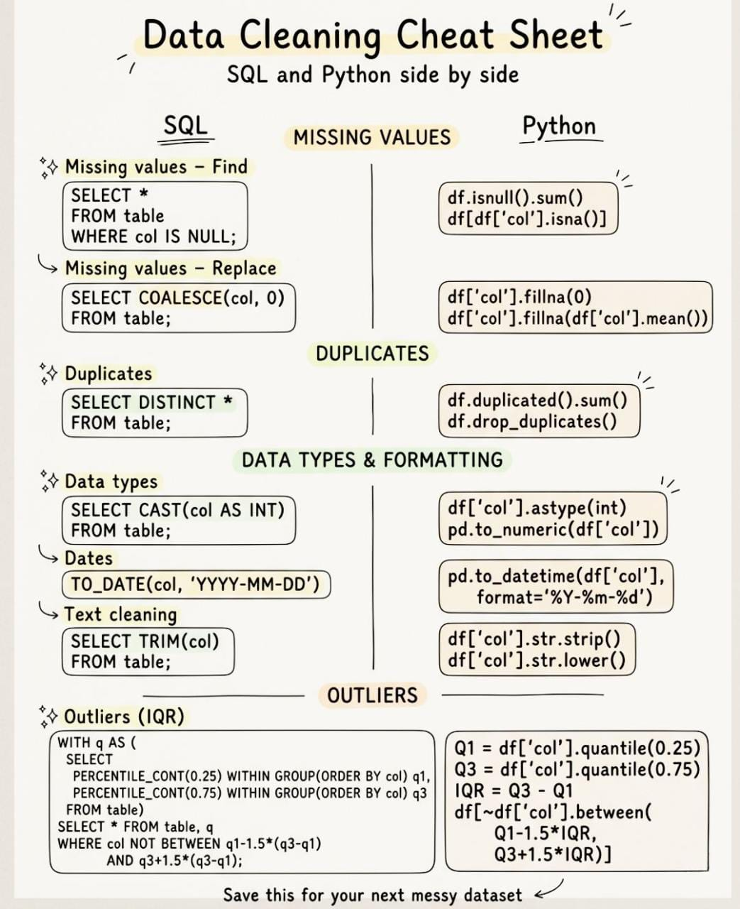


</details>

---


<details>
<summary><strong>이 주제들에 대해 편하지 않다면 스스로를 백엔드 개발자라고 부르지 마세요</strong></summary>


- SOLID 설계 원칙
- 싱글톤 패턴
- 옵저버블
- 멀티스레딩
- 불변성
- 직렬화
- 보안
- 팩토리 설계 패턴


</details>

---


<details>
<summary><strong>상위 1% 개발자 스택</strong></summary>


- 데이터 구조 & 알고리즘
- 시스템 설계
- 소프트웨어 아키텍처
- 데이터베이스 & SQL
- 분산 시스템
- 테스트 & 디버깅
- 네트워킹 기초
- 리눅스 & 컨테이너
- 컴퓨팅을 위한 수학
- 끈질긴 문제 해결
- AI 프롬프팅
- 커뮤니케이션


</details>

---


<details>
<summary><strong>백엔드 아키텍트</strong></summary>


1. 마이크로서비스 설계  
서비스 분해, 경계 컨텍스트, 복원력 (서킷 브레이커, 벌크헤드)
2. 분산 시스템 기초  
CAP 정리, 이벤트 소싱, CQRS, 데이터 일관성 모델 (ACID vs. BASE)
3. 고성능 데이터 관리  
데이터베이스 파티셔닝, 인덱스 최적화, NoSQL 데이터 모델링
4. 고급 API 설계  
gRPC, GraphQL, API 게이트웨이, 비동기 API
5. 이벤트 주도 아키텍처  
Kafka, 메시지 큐, Pub/Sub 패턴, 사가 패턴
6. 클라우드 네이티브 패턴  
컨테이너 오케스트레이션 (Kubernetes), 서버리스, 멀티 클라우드 전략
7. 관찰 가능성  
분산 추적 (OpenTelemetry), 중앙화된 로깅 (ELK), 실시간 모니터링
8. 인프라 as 코드  
Terraform, Helm, 구성 관리 모범 사례
9. 고급 보안  
제로 트러스트, OAuth2, JWT, 전송 중 및 저장 시 데이터 암호화
10. 스케일링 전략  
로드 밸런싱, 샤딩, 수평 스케일링 vs. 수직 스케일링


</details>

---


<details>
<summary><strong>HTTP 상태 코드</strong></summary>


2xx: 성공  
요청이 예상대로 작동했습니다.  
(시스템이 자신의 일을 잘 수행했습니다.)

3xx: 리다이렉션  
요청은 유효하지만, 다른 곳을 확인하세요.  
(URL이 이동되었거나, 캐시가 사용되었거나, 리다이렉트되었습니다.)

4xx: 클라이언트 실수  
요청이 잘못되었거나 불완전합니다.  
(인증 누락, 잘못된 입력, 리소스 미발견.)

5xx: 서버 실패  
요청은 괜찮았습니다. 서버가 고장 났습니다.  
(크래시, 타임아웃, 잘못된 종속성.)


</details>

---


<details>
<summary><strong>백엔드 스킬 난이도 분석</strong></summary>


🟢 쉬움 (시작하기)  
REST API → 기본 엔드포인트 🔗  
CRUD 작업 → 생성 / 읽기 / 업데이트 / 삭제 📦  
JSON 처리 → 데이터 교환 📄  
상태 코드 → API 응답 📶

🟡 쉬움 → 중간 (진짜 백엔드가 시작됨)  
인증 → 로그인 / 회원가입 🔐  
미들웨어 → 요청 처리 ⚙️  
검증 → 깨끗한 입력 처리 🧹  
오류 처리 → 안정적인 API 🚧

🟠 중간 (프로덕션 준비)  
데이터베이스 설계 → 스키마 생각 🗄️  
캐싱 → 성능 향상 ⚡  
비동기 처리 → 백그라운드 작업 🔄  
페이지네이션 → 대용량 데이터 처리 📊  
연결 풀링 → 효율적인 DB 사용 🔌

🔴 어려움 (스케일링 시스템)  
속도 제한 → 트래픽 제어 🚦  
분산 시스템 → 다중 서비스 🌐  
메시지 큐 → 비동기 통신 📩  
로드 밸런싱 → 트래픽 분산 ⚖️

🟣 매우 어려움 (전문가 수준)  
시스템 설계 → 엔드투엔드 아키텍처 🧠  
관찰 가능성 → 로그 / 메트릭 / 추적 📈  
장애 내성 → 실패 처리 💥

⚠️ 대부분의 개발자는 CRUD에서 멈춥니다.  
그건 백엔드가 아니에요… 기본일 뿐입니다.

진짜 백엔드 = 확장 가능 + 신뢰성 + 관찰 가능 🚀


</details>

---


<details>
<summary><strong>개발자 설명 필수</strong></summary>


- 로드 밸런서
- API 게이트웨이
- 리버스 프록시
- 스로틀링
- 속도 제한
- 멱등성
- 페이지네이션
- 캐시 스태피드
- gRPC
- GraphQL
- 웹훅
- OAuth
- JWT
- 캐시 무효화
- 쿼리 최적화
- 복합 인덱스
- ACID
- CAP 정리
- 샤딩
- 서킷 브레이커
- 라이브락
- CSRF
- 백프레셔
- 거짓 공유
- mTLS


</details>

---


<details>
<summary><strong>배포 전 체크리스트</strong></summary>


```
보안
[ ] 프론트엔드 코드에 API 키나 비밀 키가 없음
[ ] 모든 라우트가 인증을 확인 (명백한 것뿐만 아니라 모든 엔드포인트 감사)
[ ] 모든 곳에서 HTTPS 강제, HTTP 리다이렉트
[ ] CORS를 도메인으로 잠금 — 와일드카드 아님
[ ] 서버 측에서 입력 검증 및 정제
[ ] 인증 및 민감한 엔드포인트에 속도 제한
[ ] 비밀번호를 bcrypt 또는 argon2로 해싱
[ ] 인증 토큰에 만료 시간 있음
[ ] 로그아웃 시 세션 무효화 (서버 측)

데이터베이스
[ ] 백업 설정 및 테스트 (백업만이 아니라 복원 테스트)
[ ] 모든 곳에서 매개변수화된 쿼리 — 문자열 연결 없음
[ ] 개발 및 프로덕션 데이터베이스 분리
[ ] 연결 풀링 설정
[ ] 마이그레이션이 버전 컨트롤에 있음, 수동 변경 아님
[ ] 앱이 루트가 아닌 DB 사용자 사용

배포
[ ] 프로덕션 서버에 모든 환경 변수 설정
[ ] SSL 인증서 설치 및 유효
[ ] 방화벽 설정 (80/443만 공개)
[ ] 프로세스 매니저 실행 (PM2, systemd)
[ ] 롤백 계획 존재
[ ] 프로덕션 배포 전에 스테이징 테스트 통과

코드
[ ] 프로덕션 빌드에 console.log 없음
[ ] 모든 비동기 작업에 오류 처리
[ ] UI에 로딩 및 오류 상태
[ ] 모든 리스트 엔드포인트에 페이지네이션
[ ] npm 감사 실행, 치명적 문제 해결
```


</details>

---


<details>
<summary><strong>백엔드 개발자로서 모르면 고통과 눈물을 가져다줄 알고리즘 순위</strong></summary>


1. 해싱 – 모든 조회가 악몽이 됨
2. 이진 탐색 – 비효율적인 쿼리 & 느린 성능
3. 정렬 알고리즘 – 정렬 없음, BS 없음, 최적화 없음.
4. 재귀/분할정복 – 효율적인 자원 할당에 고군분투
5. 동적 프로그래밍 – 재계산이 조용히 전체 서버를 삼켜버림.
6. 그래프 알고리즘 (BFS/DFS) – 엉망이 된 워크플로 & 자원 라우팅.
7. 힙 & 우선순위 큐 – 속도 제한 없음 & 망가진 메시지 큐.
8. 트라이 – 느린 검색 & 자동완성
9. 탐욕 알고리즘 – 거대한 컴퓨트 청구서에 울며 자원 할당 엉망
10. 위상 정렬 – 순환 종속성이 CPU를 갉아먹음


</details>

---


<details>
<summary><strong>백엔드 - UI 뒤의 모든 것 🧩</strong></summary>


1. API → 요청 처리 🔗
2. Auth → 사용자 인증 👤
3. AuthZ → 권한 부여 ✅
4. 비즈니스 로직 → 핵심 규칙 ⚙️
5. DB → 데이터 저장 🗄️
6. Cache → 속도 향상 ⚡
7. 큐 → 비동기 처리 📬
8. 워커 → 백그라운드 작업 🔄
9. 검색 → 빠른 조회 🔍
10. 파일 저장소 → 업로드 📦
11. 로깅 → 이벤트 추적 🧾
12. 모니터링 → 시스템 상태 📊
13. 속도 제한 → 남용 방지 🚫
14. 스케일링 → 성장 대응 📈


</details>

---


<details>
<summary><strong>API 설계 - 핵심 규칙 🔗</strong></summary>


1. 명확한 경로 → /users, /orders 📍
2. HTTP 메서드 → GET, POST, PUT, DELETE 🔁
3. 상태 코드 → 200, 201, 400, 404, 500 📊
4. 명명 → 일관성 있고 예측 가능 🏷️
5. 페이지네이션 → 대용량 응답 제한 📦
6. 필터링 → 쿼리 파라미터 (?status=active) 🔍
7. 검증 → 잘못된 입력 거부 ❌
8. 인증 → 보안 엔드포인트 보호 🔐
9. 속도 제한 → 남용 방지 🚫
10. 버전 관리 → /v1, /v2 🔄
11. 멱등성 → 안전한 재시도 ♻️
12. 문서화 → 사용하기 쉬움 📚


</details>

---


<details>
<summary><strong>백엔드 개발은 이러한 기본 사항을 이해하는 한 “간단”합니다:</strong></summary>


HTTP 기본

- 메서드
- 상태 코드
- 요청 및 응답 헤더

보안 & ID

- 인증 vs 권한 부여
- JWT, 세션, 쿠키
- OAuth 2.0
- 비밀번호 해싱 (bcrypt / Argon2)
- 솔팅과 페퍼링
- 2FA 및 SSO
- RBAC 및 ABAC

API 기본

- API 설계 원칙
- RESTful API
- GraphQL
- WebSockets
- API 버저닝
- 속도 제한 및 스로틀링
- 페이징, 필터링, 정렬
- 파일 업로드 및 스트리밍

서버 개념

- 미들웨어
- 오류 처리
- 로깅 및 모니터링
- APM (성능 모니터링)
- 서버사이드 렌더링

데이터베이스

- 데이터베이스 설계
- SQL 및 NoSQL
- 인덱싱 및 쿼리 최적화
- ACID 속성
- CAP 정리
- 정규화 vs 비정규화
- ORMs
- 연결 풀링
- 트랜잭션, 마이그레이션, 시딩

캐싱 & 성능

- 캐싱 전략
- Redis 및 Memcached
- CDN 통합

확장성 & 아키텍처

- 로드 밸런싱
- 수평 vs 수직 스케일링
- 모놀리스, 마이크로서비스, SOA
- 메시지 큐 및 Pub/Sub
- 이벤트 기반 시스템
- CQRS 및 Saga 패턴
- API 게이트웨이 및 서비스 메쉬

인프라 & DevOps

- Docker 컨테이너
- Kubernetes 오케스트레이션
- CI/CD 파이프라인
- 환경 변수
- 구성 및 비밀 관리

보안 강화

- CORS
- CSRF 보호
- XSS 방지
- SQL 인젝션 방지
- 입력 검증 및 출력 위생화

백그라운드 처리

- 백그라운드 작업
- 크론 작업 및 스케줄러
- 워커 프로세스

동시성 & 런타임

- Async/await
- 프로미스 및 콜백
- 스레드 풀
- 프로세스 및 메모리 관리
- 가비지 컬렉션

품질 & 도구

- 테스트 (단위, 통합, E2E)
- 모킹 및 스터빙
- API 문서화 (Swagger / OpenAPI)
- Postman 또는 Insomnia
- Git 및 버전 관리
- 코드 리뷰
- 디버깅 및 벤치마킹

프로덕션

- 배포 전략
- 프로덕션 모니터링


</details>

---


<details>
<summary><strong>백엔드 시스템에 필요한 9가지 관찰 가능성 관행:</strong></summary>


1. 구조화된 로깅 (print 문 아님)
2. 메트릭 (지연 시간, 처리량, 오류)
3. 알림 (실행 가능한, 소음이 아닌)
4. 오류 추적 (Sentry 등)
5. 상관 ID
6. 주요 흐름에 대한 대시보드
7. 분산 추적
8. 대규모 로그 샘플링
9. 인시던트 후 분석

보이지 않으면 고칠 수 없습니다.

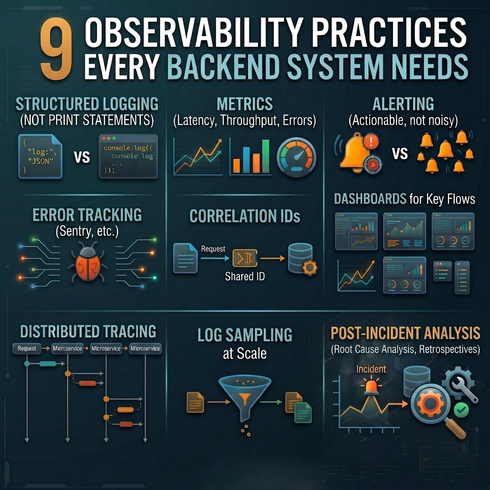


</details>

---


<details>
<summary><strong>고급 시나리오 기반 Spring Boot 질문</strong></summary>


1) API가 높은 트래픽에서만 느려집니다. CPU는 정상입니다. 병목 현상이 무엇일 수 있나요?

2) DB 연결 풀(HikariCP)이 갑자기 고갈됩니다. 왜 그런가요?

3)[@Transactional](https://x.com/Transactional) 이 있지만 중첩 호출에서 롤백이 일어나지 않습니다. 왜 그런가요?

4) API는 로컬에서 작동하지만 Kubernetes 배포에서 실패합니다. 먼저 무엇을 확인하나요?

5) 서비스는 작동하지만 메모리가 시간이 지나면서 계속 증가합니다. 무엇이 원인일 수 있나요?

6) 다운스트림 서비스가 건강한데도 회로 차단기가 자주 열립니다. 왜 그런가요?

7) 캐싱을 추가해 성능이 향상되었지만 데이터 불일치가 발생합니다. 왜 그런가요?

8) 비동기 처리([@Async](https://x.com/Async))가 시스템을 더 느리게 만듭니다. 어떻게요?

9) 로그는 로컬에서 보이지만 프로덕션에서 누락됩니다. 무엇이 잘못된 것일 수 있나요?

10) 여러 인스턴스를 배포했지만 성능이 향상되지 않습니다. 왜 그런가요?

11) API 게이트웨이 호출은 성공하지만 다운스트림 서비스에서 헤더가 누락됩니다. 왜 그런가요?

12) 부하 시 애플리케이션이 무작위로 503 오류를 발생시킵니다. 무슨 일이 일어나고 있을까요?

13) 배포 후 사용자들이 여전히 이전 동작을 봅니다. 문제가 무엇일 수 있나요?

14) 스케줄링된 작업이 API 지연에 영향을 미칩니다. 어떻게 격리하나요?

15) 외부 API 통합이 무작위 타임아웃을 유발합니다. 무엇을 구성해야 하나요?

16) 애플리케이션은 스테이징에서 잘 작동하지만 프로덕션에서 실패합니다. 어떤 차이점이 중요한가요?

17) 높은 GC 활동이 응답 시간을 영향을 줍니다. 무엇이 원인일 수 있나요?

18) 서비스가 마이크로서비스 아키텍처에서 병목이 됩니다. 어떻게 식별하나요?

19) 재시도 메커니즘이 서비스 간 연쇄 실패를 유발합니다. 왜 그런가요?

20) 리소스(CPU/RAM)를 늘렸지만 성능이 향상되지 않습니다. 진짜 문제는 무엇인가요?


</details>

---


<details>
<summary><strong>Node.js</strong></summary>


Node.js + TypeScript – Type safety and scalable code

Node.js + Express – Web framework

Node.js + Fastify – High performance APIs

Node.js + NestJS – Scalable backend architecture

Node.js + Mongoose – MongoDB ODM

Node.js + Prisma – Modern, type-safe ORM

Node.js + Sequelize – SQL ORM

Node.js + SocketIO – Real-time communication

Node.js + BullMQ – Background jobs and queues

Node.js + Node-Cron – Task scheduling

Node.js + Passport – Authentication

Node.js + JWT – Secure authorization

Node.js + Zod – Schema validation

Node.js + Redis – Caching, sessions, pub/sub

Node.js + Jest – Testing

Node.js + Swagger (OpenAPI) – API documentation

Node.js + ESLint / Prettier – Code quality and formatting

Node.js + PM2 – Process management

Node.js + Docker – Containerization

Node.js + Nginx – Reverse proxy and load balancing

Node.js + Winston / Pino – Logging

Node.js + Puppeteer – Browser automation

Node.js + GraphQL – API query language

Node.js + tRPC – End-to-end type safety


</details>

---


<details>
<summary><strong>REST vs GraphQL</strong></summary>


Both REST and GraphQL are used to build APIs but they solve different problems.

🔹 𝐑𝐄𝐒𝐓 (𝐑𝐞𝐩𝐫𝐞𝐬𝐞𝐧𝐭𝐚𝐭𝐢𝐨𝐧𝐚𝐥 𝐒𝐭𝐚𝐭𝐞 𝐓𝐫𝐚𝐧𝐬𝐟𝐞𝐫)  
A resource-based API style using multiple endpoints.  
Different URLs represent different resources — /users, /orders, /products

Pros:

- Simple, predictable, widely adopted
- Caches well at HTTP layer (CDNs, proxies)
- Easy to reason about and debug

Cons:

- Over-fetching (you get more than you need)
- Under-fetching (you need multiple calls for one screen)
- Evolving versions often need /v1, /v2 style endpoints

Best For: Public APIs, CRUD services, simple domain models

🔹 𝐆𝐫𝐚𝐩𝐡𝐐𝐋  
A query language for APIs with a single endpoint: /graphql  
Client asks exactly for the fields it needs in a single query.

Pros:

- No over/under-fetching. The client controls shape of data
- One round trip for complex UI screens
- Strong schema + introspection = great developer experience

Cons:

- Harder caching (no URL per response)
- More complex backend + performance tuning
- Needs stronger query guardrails to avoid abuse (N+1, deep queries)

Best For: Complex UIs, mobile apps, microservices aggregation, product teams iterating fast

𝐈𝐧 𝐬𝐡𝐨𝐫𝐭:

- Use REST when simplicity, caching, and stability matter.
- Use GraphQL when clients need flexibility and efficiency across many data sources.

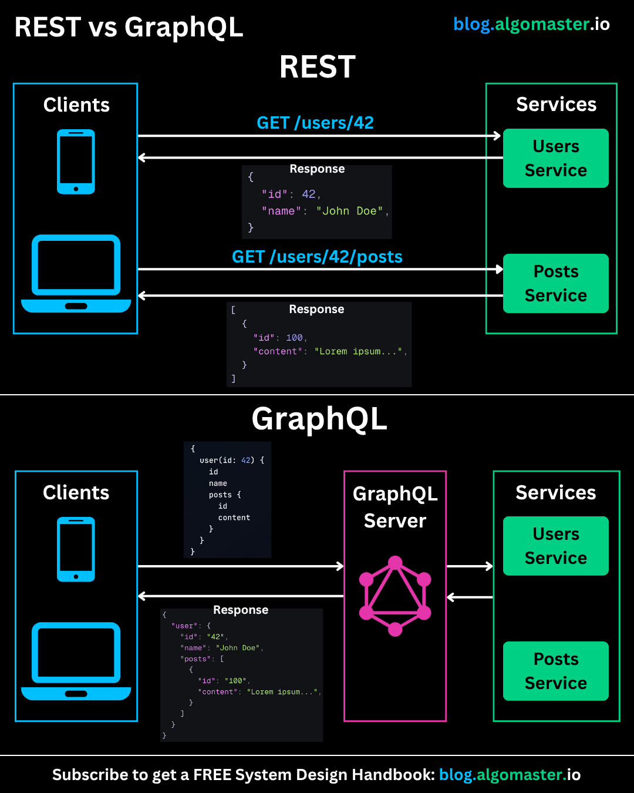


</details>

---


<details>
<summary><strong>Java 팁: 깊은 if-else 피하기 - 가드 절 사용</strong></summary>


Java 코드에서 가장 흔한 문제 중 하나는 깊게 중첩된 조건문입니다.  
코드가 형식적으로는 작동하지만, 읽기 어렵고 유지보수하기 어렵습니다.

× 나쁜 예: 중첩된 if-else

- 읽기 어렵다
- 로직이 흩어져 있다
- 어떤 수정도 골칫거리로 변한다

✓ 좋은 예: 가드 절 (조기 종료)

- 즉시 체크하여 유효하지 않은 상태를 차단한다
- 주요 시나리오를 위에서 아래로 읽을 수 있다
- 코드가 더 짧고 명확하다

가드 절이 전문적인 접근인 이유:

- 인지 부하를 줄인다
- 비즈니스 로직을 명확하게 만든다
- 리팩토링과 테스트를 단순화한다
- fail-fast 철학과 완벽하게 맞는다

규칙은 간단하다:  
조건이 오류이거나 정상 흐름의 예외라면, 즉시 체크하고 메서드를 종료하라.

이렇게 하면 코드가 된다:

- 선형적이다
- 예측 가능하다
- 유지보수하기 쉽다

문법 수준에서는 사소한 일이지만, 코드 품질에서는 엄청난 차이를 만든다.


</details>

---


<details>
<summary><strong>실제로 채용되는 기술들</strong></summary>


- 인증 흐름 (OAuth, JWT, 세션)
- 데이터베이스 설계 및 마이그레이션
- 캐싱 (Redis, CDN)
- 백그라운드 작업 및 큐
- 파일 업로드 및 저장
- 실시간 시스템 (WebSocket, pub/sub)
- 폼 및 유효성 검사
- 상태 관리
- 테스트 (단위 + e2e)
- 배포 및 모니터링


</details>

---


<details>
<summary><strong>2026년 백엔드 개발자 생존 키워드</strong></summary>


**'시스템'**

단순히 코드 짜는 걸 넘어 인증, 캐싱, 이벤트 기반 아키텍처를 이해 못 하면 시장에서 바로 도태됨. 

여기에 AI 연동이랑 벡터 DB 같은 최신 트렌드까지 얹어야 비빌 수 있음. 

새로운 언어 찍먹하는 시간에 이 11가지 핵심 역량 중 내 강점이 뭔지부터 고민하는 게 훨씬 이득임.

1. API 설계 - REST/GraphQL/gRPC
2. 인증 & 권한 부여 - OAuth2, JWT, OpenID Connect, Passkeys
3. 데이터베이스 - SQL, NoSQL, 샤딩, 인덱싱, 쿼리 튜닝
4. 캐싱 - Redis, CDN, 에지 캐싱 전략
5. 이벤트 기반 시스템 - Kafka, Pulsar, 스트리밍 파이프라인
6. 동시성 & 비동기 - 리액티브 프로그래밍, 구조화된 동시성
7. 분산 시스템 - 마이크로서비스, 서비스 메시, 최종 일관성
8. 보안 - HTTPS, 암호화, 제로 트러스트, OWASP 상위 10
9. 관찰 가능성 - 로깅, 트레이싱, 메트릭, OpenTelemetry
10. 클라우드 & 배포 - Docker, Kubernetes, 서버리스, GitOps
11. AI 통합 - LLM API, 벡터 데이터베이스, 검색 증강 시스템


</details>

---


<details>
<summary><strong>속도 제한 (Rate Limiting)</strong></summary>


- Rate limiting은 “도구” 문제가 아니라 “정책 설계 문제”
- Redis + token bucket부터 말하면 감점 요소
- 항상 순서:
    1. 보호 대상
    2. 목적
    3. 기준
    4. 동작


</details>

---


<details>
<summary><strong>너무 자주 보게 되는 API 설계 실수</strong></summary>


엔드포인트를 통해 데이터베이스 스키마를 직접 노출하는 것.

이렇게 하면 강한 결합이 생기고, 미래의 변경이 고통스러워집니다.

대신, API 계약을 독립적으로 설계하세요. 클라이언트가 필요로 하는 것에 대해 생각하고, 데이터베이스가 어떻게 생겼는지에 대해 생각하지 마세요. 당신의 미래 자아가 감사할 겁니다.


</details>

---


<details>
<summary><strong>API가 실제로 어떻게 작동하는지</strong></summary>


대부분의 개발자들은 “API를 사용합니다.”

매우 적은 수만이 API가 시스템을 실제로 어떻게 구동하는지 이해합니다.

코드 작성과 확장 가능한 제품 구축의 차이점이 바로 그겁니다.

API가 실제로 어떻게 작동하는지 여기 있습니다

```
APIs
│
├── Open APIs (외부 시스템)
│   ├── REST API
│   │   ├── 날씨 데이터
│   │   ├── 로그인/인증 시스템
│   │   └── 제품 정보
│   │
│   ├── SOAP API
│   │   ├── 은행 이체
│   │   ├── 보험 청구
│   │   └── 정부 기록
│   │
│   └── GraphQL API
│       ├── 소셜 피드 (Facebook 등)
│       ├── GitHub 통계
│       └── 사용자 지정 쿼리 (필요한 것만 가져오기)
│
├── Internal APIs (시스템 백본)
│   ├── Frontend ↔ Backend
│   │   ├── 로그인 요청
│   │   ├── 프로필 가져오기
│   │   └── 실시간 검색
│   │
│   ├── Backend ↔ Backend
│   │   └── 마이크로서비스 통신
│   │
│   └── Service ↔ Database
│       ├── 사용자 삽입/업데이트
│       └── 보고서 및 쿼리
│
└── Partner APIs (비즈니스 통합)
    ├── B2B 통합
    │   ├── 결제 게이트웨이
    │   ├── 항공/호텔 예약
    │   └── 외부 서비스 데이터
    │
    ├── 제휴 시스템
    │   ├── 제품 링크
    │   ├── 수수료 추적
    │   └── 클릭 분석
    │
    └── 데이터 공유 API
        ├── 건강 기록
        ├── 금융 데이터
        └── 물류 추적
```

이제 중요한 부분입니다:

대부분의 사람들은 “API 호출”에서 멈춥니다.

하지만 진짜 엔지니어들은 이렇게 생각합니다:

→ 이 API는 시스템에서 어디에 맞는가?

→ 외부, 내부, 아니면 파트너 수준인가?

→ 계층 간 데이터 흐름은 어떻게 되는가?

→ 사용자가 10배 증가할 때 확장될 수 있는가?

실제 애플리케이션에서:

- Open API는 데이터를 가져옵니다
- Internal API는 제품을 실행합니다
- Partner API는 비즈니스를 성장시킵니다

회사가 구축하는 방식이 바로 이것입니다:

→ SaaS 플랫폼  
→ 마켓플레이스  
→ 핀테크 시스템  
→ 확장 가능한 제품

변화는 간단합니다:

아마추어 → 엔드포인트 호출

전문가 → API 아키텍처 설계

이렇게 API를 이해한다면, 단순히 기능을 구축하는 것이 아닙니다. 시스템을 구축하는 것입니다.

https://x.com/i/status/2048000336049160404

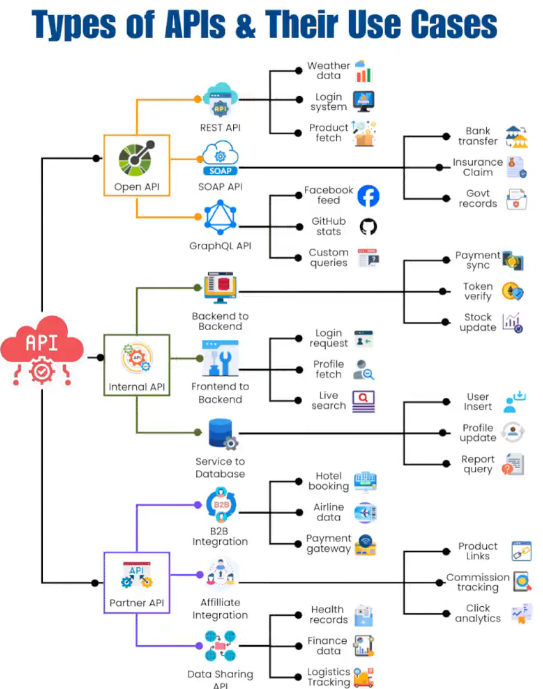


</details>

---


<details>
<summary><strong>최소 API와 API 버전 관리는 엉망입니다.</strong></summary>


올바른 방법으로 하지 않는 한...

모든 엔드포인트에 ApiVersionSet을 태깅하는 대신, 라우트 그룹을 정의하세요.

버전을 한 번 설정하면 그룹 내 모든 엔드포인트에 적용됩니다.

더 깔끔한 라우트, 중복 감소. /v1 같은 버전 접두사에도 훌륭하게 작동합니다.

최소 API와 컨트롤러 모두에서 작동하는 방식을 보고 싶으신가요?

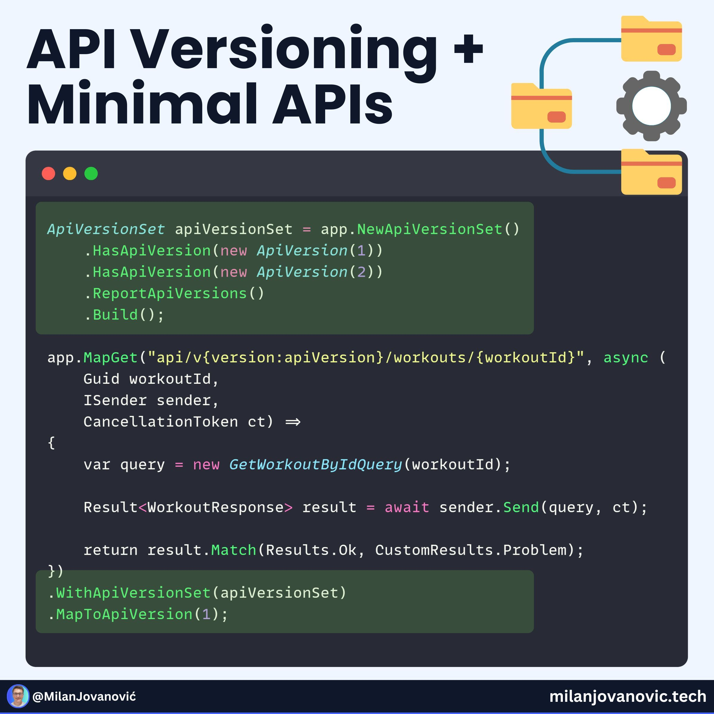


</details>

---


<details>
<summary><strong>HTTP 상태 코드 치트시트</strong></summary>


1xx :   잠깐만요  
2xx:   여기 있습니다  
3xx :  가세요  
4xx :  당신이 잘못했어요  
5xx :  우리가 잘못했어요

- 모든 개발자가 알아야 할 HTTP 상태 코드
    - 200 - 성공
    - 201 - 생성됨
    - 204 - 콘텐츠 없음
    - 301 - 영구 이동
    - 304 - 수정되지 않음
    - 400 - 잘못된 요청
    - 401 - 인증되지 않음
    - 403 - 금지됨
    - 404 - 찾을 수 없음
    - 405 - 메서드 허용 안 됨
    - 409 - 충돌
    - 422 - 유효성 검사 오류
    - 429 - 속도 제한
    - 500 - 내부 서버 오류
    - 502 - 잘못된 게이트웨이
    - 503 - 서비스 사용 불가
    - 504 - 게이트웨이 타임아웃
- HTTP 상태 코드를 모르면 개발자가 아니야
    - ✅ 200 → OK. 요청 성공
    - 🆕 201 → Created. 새 리소스 추가됨
    - ↩️ 301 → Moved Permanently. URL이 영구적으로 변경됨
    - 🔄 302 → Found. 임시 리다이렉트
    - ❌ 400 → Bad Request. 잘못된 데이터 전송
    - 🔐 401 → Unauthorized. 로그인 필요
    - 🚫 403 → Forbidden. 접근 거부됨
    - 🔍 404 → Not Found. 페이지가 존재하지 않음
    - ⏳ 408 → Request Timeout. 서버가 대기 시간을 포기함
    - 💥 429 → Too Many Requests. 속도를 늦춰!
    - 🔥 500 → Internal Server Error. 서버가 고장 났음
    - 🚧 502 → Bad Gateway. 서버가 잘못된 응답을 받음
    - 😴 503 → Service Unavailable. 서버가 다운됨
    - ⏰ 504 → Gateway Timeout. 서버가 너무 오래 걸림


</details>

---


<details>
<summary><strong>엔지니어가 &quot;자주 보는 에러의 정체&quot; 5선</strong></summary>


- 「500 에러」 → 서버 측 문제
- 「404」 → 라우팅
- 「CORS 에러」 → 설정 부족
- 「타임아웃」 → 처리 or 통신
- 「권한 에러」 → IAM나 설정


</details>

---


<details>
<summary><strong>아무도 백엔드 로드맵을 주지 않았어, 내가 처음 시작했을 때.</strong></summary>


1. 하나의 언어를 제대로 배워  
Python이나 JavaScript (Node.js). 둘 다 말고. 하나 골라서 깊이 파고들어.

2. HTTP 이해하기  
URL을 입력하면 무슨 일이 일어나? 요청, 응답, 상태 코드 배워. 이게 기초야.

3. 첫 번째 REST API 만들기  
Express나 FastAPI 써서. 진짜 뭔가 만들어봐. 할 일 앱, 간단한 블로그. 뭐든 상관없어.

4. 데이터베이스 배우기  
PostgreSQL부터 시작해. 테이블, 쿼리, 관계 이해해. 그다음 MongoDB를 살짝 만져봐서 차이점을 알아.

5. 인증  
JWT, 세션, bcrypt로 비밀번호 해싱. 모든 앱에 이게 필요해.

6. 뭔가 배포하기  
Railway, Render, "내 노트북에서는 잘 돼"는 진지하게 받아들여지지 않아.

7. 버전 컨트롤을 종교처럼 배우기  
Git. 브랜치. PR. 변명 말고 그냥 배워.

8. 다른 사람들 코드 읽기  
오픈 소스 프로젝트. 실제 시스템이 어떻게 구조화됐는지 봐.


</details>

---


<details>
<summary><strong>대부분의 개발자들이 너무 늦을 때까지 건너뛰는 시스템 설계 개념들</strong></summary>


- 로드 밸런싱: 한 서버가 모든 걸 떠맡지 않게 하세요
- 캐싱: 거의 변하지 않는 데이터 때문에 DB를 계속 쿼리하지 마세요
- 속도 제한: 아니면 한 사용자가 전체 API를 다운시킬 거예요
- 데이터베이스 인덱싱: 인덱싱되지 않은 쿼리는 당신을 늙게 만들 거예요
- 메시지 큐: 지금 당장 일어나지 않아도 되는 걸 분리하세요
- 수평 스케일링: 하나의 큰 서버는 한계가 있어요. 작은 서버 여러 대는 그렇지 않죠

이 모든 걸 한 번에 마스터할 필요는 없어요.

하지만 진짜 사용자들을 위해 빌드한다면, 이런 개념들이 존재한다는 걸 알아야 해요.  
이걸 저장하세요.


</details>

---


<details>
<summary><strong>시니어 Java 인터뷰의 95.7%는 이 7가지 주제입니다.</strong></summary>


1. JVM 내부 구조
    
    힙, 스택, 가비지 컬렉션, 클래스 로딩, JIT, 메모리 누수, 그리고 CPU가 정상으로 보이는데도 앱이 느려지는 이유.
    
2. 동시성  
스레드, 실행자, 동기화, 휘발성, 락, CompletableFuture, 경쟁 상태, 교착 상태, 그리고 부하 하에서 안전한 코드를 작성하는 방법.
3. 컬렉션  
HashMap, ConcurrentHashMap, ArrayList, LinkedList, TreeMap, 큐, 시간 복잡도, 그리고 리사이징 중에 실제로 일어나는 일.
4. **Spring Boot**  
의존성 주입, REST API, 필터, 인터셉터, 트랜잭션, 프로파일링, 자동 구성, 그리고 Spring의 내부 작동 원리에 대해 알아봅니다.
5. 데이터베이스 통합  
JPA, Hibernate, N+1 쿼리, 트랜잭션 경계, 연결 풀, 지연 로딩, 인덱스, 그리고 ORM이 성능을 조용히 망칠 수 있는 이유.
6. 시스템 설계  
API 설계, 캐싱, 큐, 재시도, 멱등성, 속도 제한, 분산 잠금, 서비스 간 통신 및 오류 처리가 포함됩니다.
7. 프로덕션 디버깅  
스레드 덤프, 힙 덤프, 로그, 메트릭, 트레이스, GC 일시 중지, 느린 쿼리, 메모리 압박, 그리고 추측 없이 라이브 이슈를 디버깅하는 방법.


</details>

---


<details>
<summary><strong>10가지 중요한 백엔드 도구</strong></summary>


1. Docker – 작업을 분리하기 위해
2. Kubernetes – 컨테이너를 그룹화하고 관리하기 위해
3. Nginx – 웹 서버를 위해
4. Postman – API를 관리하기 위해
5. Jira – 앱 문제를 추적하기 위해
6. Back4App – 앱을 구축하기 위해
7. Redis – 캐싱 및 빠른 데이터 액세스를 위해
8. MongoDB – 유연한 데이터를 저장하기 위해
9. Node.js – 백엔드 코드를 실행하기 위해
10. Git – 코드와 협업을 관리하기 위해


</details>

---


<details>
<summary><strong>IP 필터링, 속도 제한, 침투 탐지를 포함한 FastAPI 미들웨어</strong></summary>


https://github.com/rennf93/fastapi-guard


</details>

---


<details>
<summary><strong>Rate limiting</strong></summary>


다층 방어를 추가하겠습니다:

- 사용자/API 키/디바이스별 속도 제한, IP만이 아닌

• 토큰 기반 제한 (JWT / API 키)

• 행동 탐지 (버스트 패턴, 이상 징후)

• 의심스러운 트래픽에 대한 CAPTCHA / 챌린지

• WAF / 봇 보호 (Cloudflare 등)

• 지리/ IP 평판 필터링

• 요청 지문 추적 (UA, 헤더, 디바이스 신호)

• 서킷 브레이커 + 백프레셔

• 스파이크에 대한 큐 + 비동기 처리

목표:  
IP로만 차단하는 것이 아니라, 남용을 비용이 많이 들게 만드는 것.

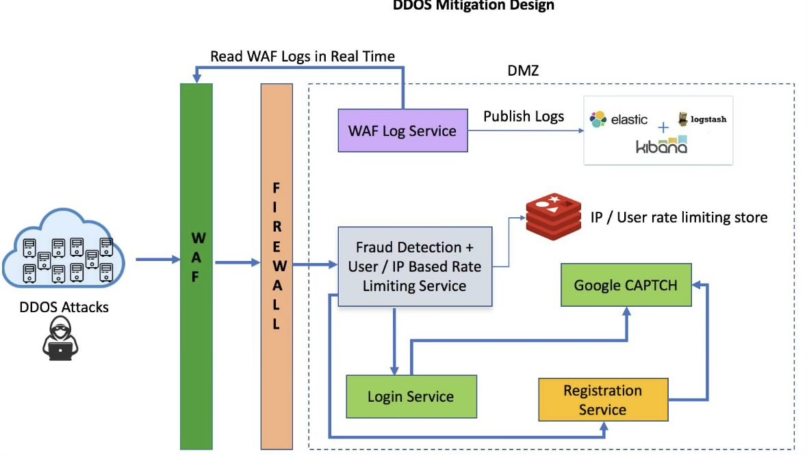

시작 신호:  
• 사용자/IP/디바이스당 초당 요청 수

• 버스트 패턴 (급격한 스파이크)

• 실패 대 성공 비율

• 비정상적인 엔드포인트 순서

• 지리적 변경 / 불가능한 이동

• 헤더 / 사용자 에이전트 일관성

그 다음 기능 구축:  
• 슬라이딩 윈도우 (지난 10초 / 1분 / 5분)

• 요청 빈도 분포

• 행동 엔트로피 (너무 반복적 = 봇)

탐지 계층:  
• 규칙 기반 임계값 (빠른 승리)

• 이상 탐지 (기준선 대 편차)

• 간단한 점수 시스템 (요청당 위험 점수)

조치:  
• 낮은 위험 → 허용

• 중간 → 제한 / 도전 (CAPTCHA)

• 높은 위험 → 차단 / 강력 속도 제한

인프라:  
• 스트림 로그 (Kafka)

• 처리 (Flink / Spark / Redis 카운터)

• 게이트웨이/WAF에서의 실시간 결정

핵심 아이디어:  
하나의 신호에 의존하지 말고 → 약한 신호들을 강력한 결정으로 결합하세요.

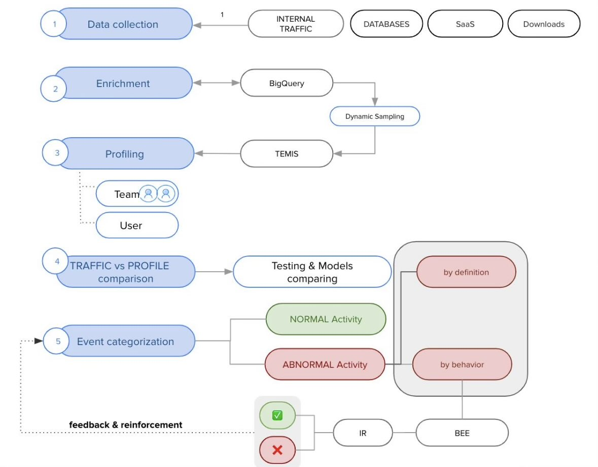


</details>

---


<details>
<summary><strong>모든 백엔드는 결제 처리 방법을 알아야 합니다.</strong></summary>


결제 재시도에 대한 간단한 소개.

결제를 처리하는 모든 시스템은 신뢰할 수 있어야 하며 장애 내성을 구축해야 합니다.

언뜻 보기엔 무섭게 들리지만, 가장 간단한 방법 중 하나는 결제 상태를 추적하는 것입니다.

실패가 발생하면, 현재 상태에 접근해 재시도를 할지 아니면 환불이 필요한지를 결정할 수 있습니다.

이를 위해 결제 상태를 저장할 수 있으며, 이는 추가 전용 데이터베이스 테이블에 지속적으로 보관될 수 있습니다.

도움이 될 수 있는 또 다른 두 가지 구성 요소는 재시도 큐(Retry Queue)와 데드 레터 큐(Dead Letter Queue)입니다.

- 재시도 큐: 일시적인 오류를 재시도하는 데 사용됩니다.
- 데드 레터 큐: 메시지가 여러 번 실패하면 데드 레터 큐로 이동합니다. 이는 디버깅에 유용하며, 문제가 있는 메시지를 격리해 검사하여 왜 성공적으로 처리되지 않았는지 파악하는 데 도움이 됩니다.

다음 다이어그램에서:

결제 프로세스에서 실패가 발생합니다.  
시스템은 실패가 재시도 가능한지 확인합니다.  
실패가 재시도 가능하다면, 해당 실패는 재시도 큐로 전송됩니다.  
실패가 재시도 불가능하다면, 실패는 데이터베이스에 로깅되거나 기록됩니다.  
재시도 큐의 메시지는 결제 서비스에 의해 다시 처리됩니다.  
재시도가 실패하면, 프로세스는 다음 재시도 가능성 검사로 이동합니다.  
시스템은 다시 실패가 재시도 가능한지 확인합니다.  
실패가 재시도 불가능하다면, 메시지는 추가 조사를 위해 데드 레터 큐로 전송됩니다.  
여러 번 재시도 후에도 실패하고 재시도 불가능하다고 판단된 메시지는 데드 레터 큐로 전송됩니다.

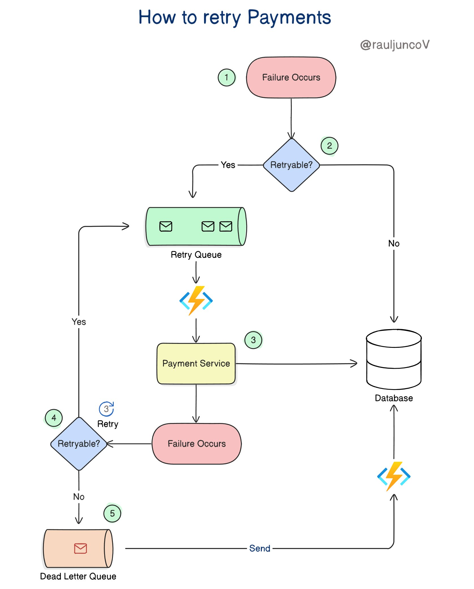


</details>

---


<details>
<summary><strong>REST API에서 가장 많이 묻는 4가지 개념</strong></summary>


- HTTP 메서드의 멱등성(GET, PUT, DELETE).
- PUT과 PATCH의 차이점.
- 페이지네이션, 필터링, 버전 관리 전략.
- 속도 제한 & 스로틀링.


</details>

---


<details>
<summary><strong>주말에 백엔드를 배우기 위한 아이디어</strong></summary>


1. 리버스 프록시
2. API 게이트웨이
3. 간단한 크론 스케줄러
4. KV 스토어
5. 일관된 해싱
6. TCP를 통한 Redis 클론
7. 인증 시스템
8. 서버-전송 이벤트 (SSEs)
9. 메시지 큐 시스템
10. 분산 락 서비스
11. 인증 시스템
12. 파일 업로드 (S3)
13. 알림 시스템 (푸시 큐)
14. 채팅 백엔드 (WebSockets)
15. 검색 자동완성 (트라이)
16. 결제 흐름 (멱등성/재시도)
17. 피드 생성 (팬아웃-쓰기/읽기)
18. 로깅 파이프라인
19. 메트릭 시스템 (시계열)
20. TCP 구현
21. HTTP 서버
22. 웹소켓 (간단한 채팅)
23. 속도 제한기 (모든 알고리즘)
24. 로드 밸런서
25. 메시지 큐
26. 분산 캐시 (Redis)
27. 미니 로그 수집기
28. 태스크 스케줄러
29. URL 단축기 (모두 결합)


</details>

---


<details>
<summary><strong>축하합니다, 이제 Java 백엔드 직업에 준비됐어요.</strong></summary>


Step-1: Java 배우기

Step-2: JVM, 힙, 스택, GC 이해하기

Step-3: 멀티스레드 서버 만들기 (라이브러리 사용 금지)

Step-4: OpenJDK 명세 읽기. 인생 선택에 의문 제기하기

Step-5: Spring Boot 배우기 (자동 구성, 빈, 라이프사이클)

Step-6: 프로덕션급 서버 만들기 (DB, 캐싱, 메시징, API)

Step-7: 부하를 견디게 만들기 (스레드 & 연결 풀, GC 튜닝)

Step-8: 프로파일링하기 (JFR, VisualVM) & 병목 현상 수정하기

Step-9: 배포하기


</details>

---


<details>
<summary><strong>백엔드 개발을 위해 배워야 할 10가지 API 설계 개념</strong></summary>


1. 멱등성
2. 페이지네이션 (커서/오프셋)
3. 속도 제한 (DDoS 보호)
4. 버전 관리 (하위 호환성)
5. 필터링/정렬 (쿼리 유연성)
6. 타임아웃 & 재시도
7. HATEOAS
8. API 게이트웨이
9. 부분 응답 (필드 선택)
10. 오류 모델링 (일관성)

백엔드 개발자라면 멱등성부터 HATEOAS까지 이 10가지 체크리스트는 무조건 머릿속에 박아둬야 함. 특히 결제나 주문 로직에서 멱등성 설계가 깨지면 CS 지옥을 맛보게 되고, 페이지네이션 커서 처리는 데이터가 쌓일수록 성능 병목의 주범이 됨. 실전 투입 전후로 내 API가 이 방어 기제들을 제대로 갖췄는지 검토하는 용도로 쓰기 딱 좋음.


</details>

---


<details>
<summary><strong>백엔드 엔지니어처럼 생각하기</strong></summary>


Node.js API가 프로덕션에서 잘 실행되고 있습니다.

갑자기 피크 트래픽 중에:

→ CPU가 100%에 도달함  
→ API 지연 시간이 80ms에서 5초로 급증함  
→ 일부 요청이 타임아웃 발생  
→ 데이터베이스는 정상으로 보임  
→ Redis는 정상으로 보임

먼저 무엇을 조사하시겠습니까?

대부분의 초보자는 즉시 데이터베이스를 탓합니다.  
하지만 Node.js에서 가장 먼저 의심해야 할 것은 이벤트 루프 블로킹입니다.

Node.js는 논블로킹 I/O를 사용하기 때문에 많은 동시 요청을 처리할 수 있습니다.

하지만 코드가 CPU 집약적인 동기 작업을 실행하면 이벤트 루프가 차단됩니다.

예시:

→ 대규모 JSON 파싱  
→ 무거운 암호화/압축  
→ 이미지 처리  
→ 큰 루프  
→ 동기 파일 작업  
→ 복잡한 정규 표현식  
→ PDF/보고서 생성

이벤트 루프가 차단되면 Node는 새로운 요청, 콜백, 타이머, 또는 I/O 완료를 효율적으로 처리할 수 없습니다.

따라서 데이터베이스가 건강하더라도 API가 고통스러울 정도로 느려질 수 있습니다.

선임 백엔드 엔지니어는 다음을 확인할 것입니다:

→ 이벤트 루프 지연  
→ CPU 프로파일링  
→ 느린 동기 함수  
→ 대규모 페이로드 처리  
→ 워커 스레드 필요성  
→ 큐/오프로드 전략

가능한 해결책:  
→ CPU 집약적 작업을 워커 스레드로 이동  
→ 백그라운드 큐 사용  
→ 버퍼링 대신 대규모 데이터 스트리밍  
→ 요청 경로에서 동기 API 피하기  
→ 추측 전에 프로파일링 추가

Node.js API 레이턴시가 80ms에서 5초로 점프하고 CPU 100% 찍을 때 요긴하게 써먹을 디버깅 체크리스트임. DB가 정상인데 서버가 터졌다면 워커 스레드 분리나 스트림 처리가 안 돼서 이벤트 루프가 블로킹된 상황일 확률이 존나 높음. 백엔드 엔지니어라면 성능 장애 터졌을 때 엄한 인프라 탓하기 전에 프로파일링 도구 들고 동기 함수부터 색출하는 습관을 들여야 함.


</details>

---


<details>
<summary><strong>Go로 간단한 웹 서버 만들기</strong></summary>


https://dormoshe.io/trending-news/building-a-simple-web-server-in-go-59hl-91000?utm_source=twitter&utm_campaign=twitter

https://dev.to/steve_omollo/building-a-simple-web-server-in-go-59hl?utm_source=dormosheio&utm_campaign=dormosheio

Go가 백엔드에서 깡패 소리 듣는 건 외부 프레임워크 주렁주렁 안 달고 표준 라이브러리만으로 고성능 서버가 뚝딱 나와서임. 입문용 튜토리얼 수준이지만 인프라 비용 아끼고 싶은 개발자라면 이 미니멀한 구조부터 뼈대에 새겨야 함.

실무에서 대용량 분산 서비스에서도 굉장히 안정적으로 운영하고 개발도 빠르고 배포시  라이브러리 의존성도 없고 여러모로 최강


</details>

---


<details>
<summary><strong>주니어 개발자가 할인 쿠폰 시스템을 만들었어요:</strong></summary>


테스트에서는 완벽하게 작동해요.

출시 24시간 이내에  
사용자들이 동일한 쿠폰을  
동시에 여러 번 사용하고 있어요.

정확한 결함은 뭐예요?  
그리고 어떻게 고치나요?

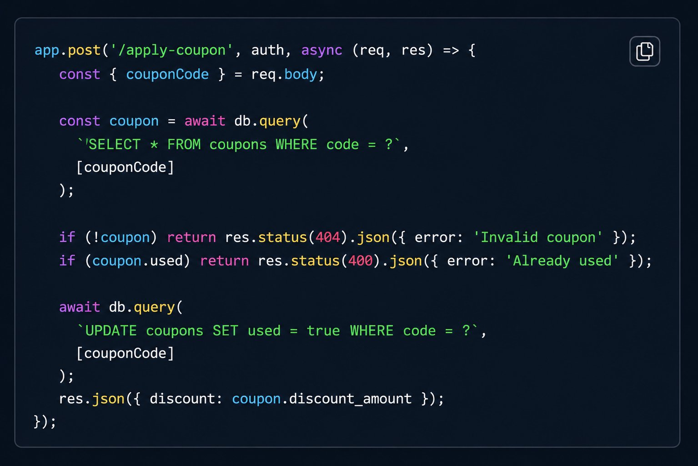

백엔드 개발하면서 쿠폰이나 결제 동시성 버그로 대형 사고 치기 싫으면 이 코드 스니펫은 꼭 킵해두길 바람. Node.js 환경에서 사용 여부 조회하고 갱신하는 사이에 틈새가 벌어지는 전형적인 race condition 예시임 ㅋㅋㅋ 단일 쿼리 안에서 atomic UPDATE를 치고 변경된 행의 개수(rows affected)를 검증하는 구조로 뼈대를 고쳐야 나중에 트래픽 몰려도 회사 돈 안 깨짐.


</details>

---


<details>
<summary><strong>Node.JS로 백엔드를 개발하는 이유</strong></summary>


1. 구조적 타이핑
2. ADT 지원
3. 생태계가 최소 크기는 넘을것
4. 개발 이터레이션이 빠를것

동시에 만족하는 언어는 node + 타입스크립트 정도 말고는 없다. 다른 백엔드 언어는 위의 조건에서 하나씩 빵꾸나있어

Node로 백엔드를 왜만드냐니 세상에 백엔드가 게임서버랑 주식거래시장이랑 전자정부만 있는건 아닐텐데

백엔드 언어로 타입스크립트보다 좋은게 며 있나

Golang 쓰면 타입시스템 빵꾸나있고  
Java, c#은 구조적 타이핑 안되서 노가다 코딩 많이 해야되고  
러스트는 빌드시간 저세상이고  
하스켈은 라이브러리 뭐 있나 싶고  
...

뺑뺑 돌고 node 다시 보면 생각보다 좋아보인다


</details>

---


<details>
<summary><strong>대부분의 백엔드 보안 버그는 올바른 도구를 잘못 사용하는 데서 비롯됩니다.</strong></summary>


1. JWT: 액세스 토큰을 단기간(5-15분)으로 유지하세요. iss/aud/exp/nbf를 검증하세요. kid를 사용해 키를 순환시키세요. 클레임에 비밀 정보 또는 PII를 넣지 마세요.
2. OAuth: 이를 위임으로 취급하고, 로그인 마법으로 보지 마세요. Authorization Code + PKCE를 사용하세요. 리디렉션 URI를 정확히 검증하세요. 리프레시 토큰을 비밀번호처럼 저장하고 로그아웃 시 취소하세요.
3. mTLS: 서비스 간 인증에 사용하세요. 환경별로 신뢰를 분리하세요. 인증서를 자동으로 순환시키세요(일/주 단위로, 연 단위가 아닌). 여전히 앱 수준의 인증/인가를 수행하세요.
4. Webhooks: 상수 시간 비교로 HMAC 서명을 검증하세요. 재생 공격을 막기 위해 타임스탬프 + 논스를 포함하세요. 핸들러를 멱등으로 만들고 2xx를 빠르게 반환하며 작업을 큐에 넣으세요.
5. 비밀 관리: API 키나 자격 증명을 소스 코드, Docker 이미지, 또는 프론트엔드 번들에 하드코딩하지 마세요. 비밀 관리 도구를 사용하고 자격 증명을 정기적으로 갱신하세요.
6. 속도 제한: 속도 제한이 없는 인증 엔드포인트는 무차별 대입 공격의 놀이터가 됩니다. 로그인, OTP, 비밀번호 재설정, 토큰 갱신 API를 보호하세요.
7. 로깅: 로그를 정제하세요. 팀들은 토큰, 이메일, 헤더, 내부 페이로드를 로그 시스템에 실수로 유출하는 일이 생각보다 자주 발생합니다.
8. RBAC/AuthZ: 인증은 사용자가 누구인지 알려주고, 권한 부여는 그들이 무엇에 접근할 수 있는지 결정합니다. 대부분의 권한 상승 버그는 여기서 발생합니다.
9. 파일 업로드: MIME 타입을 검증하고, 파일을 스캔하며, 파일 이름을 무작위로 생성하고, 클라이언트 측 검증을 절대 신뢰하지 마세요. 업로드는 가장 쉬운 공격 표면 중 하나입니다.


</details>

---


<details>
<summary><strong>2026년 백엔드 인터뷰의 90%는 여전히 7가지 검토로 무너집니다.</strong></summary>


화이트보드나 레포에서 이걸 해낼 수 있다면, 합격입니다.

1. 디버깅: 모호한 500 에러 + 로그/메트릭을 10분 안에 1개의 근본 원인으로 좁히기
2. 데이터: Postgres vs Redis vs 큐 선택; 인덱스, 격리 수준, 장애 모드 설명
3. API: 페이지네이션, 멱등성 키, 속도 제한, 버전 관리를 포함한 엔드포인트 설계
4. 분산 시스템: 재시도, 타임아웃, 백프레셔; 재시도 폭풍과 중복 작업 피하기
5. 안정성: SLO, 에러 예산, 런북; 새벽 2시에 페이지할 만한 것 아는 것
6. 배포: CI, 마이그레이션, 롤백, 기능 플래그; 프로덕션을 다운시키지 않고 배포하기
7. 보안 기본: 인증/인가, 비밀 관리, 최소 권한, 일반적인 SSRF/SQLi 함


</details>

---


<details>
<summary><strong>URL보다 리소스가 먼저다: AI 시대의 REST API 설계</strong></summary>


“회원 가입 API 만들어 줘.”

Cursor나 Claude 같은 AI 에이전트에게 이렇게 말하면 곧바로 엔드포인트가 나옵니다.[**1**](https://wild-coding.com/blog/2026/06/17/rest-resource-before-url#user-content-fn-agent)

- **`POST /api/createUser`**
- **`POST /api/user/signup`**
- **`POST /api/register`**

셋 다 동작은 합니다. 하지만 리소스를 먼저 정하지 않은 결과입니다.

## **URL은 결과지, 출발점이 아니다**

REST에서 URL을 먼저 정하려고 하면 길을 잃습니다.

먼저 정해야 할 것은 **리소스가 무엇인가**입니다.

회원 가입은 동사처럼 보입니다.

그래서 **`createUser`**, **`register`** 같은 동사형 URL이 튀어나옵니다.

하지만 REST에서 리소스는 **개념**입니다.

URL은 리소스를 **식별**합니다.[**2**](https://wild-coding.com/blog/2026/06/17/rest-resource-before-url#user-content-fn-url)

비즈니스 행위가 아무리 복잡해도, REST는 그것을 리소스에 대한 조작으로 추상화합니다.[**3**](https://wild-coding.com/blog/2026/06/17/rest-resource-before-url#user-content-fn-rest)

리소스를 **`User`**로 잡으면 URL은 자연스럽게 따라옵니다.[**4**](https://wild-coding.com/blog/2026/06/17/rest-resource-before-url#user-content-fn-collection)

```
POST   /users        사용자 생성
GET    /users/{id}   사용자 조회
PATCH  /users/{id}   사용자 수정
DELETE /users/{id}   사용자 삭제
```

URL은 리소스를 정하고 나면 거의 자동으로 결정됩니다.

어려운 건 URL을 짓는 일이 아니라, **무엇을 리소스로 볼 것인가**를 정하는 일입니다.

리소스는 DB 테이블이 아닙니다.

Entity와 1:1로 대응하지도 않습니다.

리소스는 **어떤 개념**입니다.

테이블 구조가 어떻든, 도메인 객체가 어떻든, 내부에서 무엇을 하든 상관없습니다.

## **REST API 설계는 결국 약속을 정하는 일이다**

리소스와 URL을 정하면 끝일까요?

아닙니다.

REST API를 설계한다는 건 URL만 정하는 일이 아닙니다.

시스템과 시스템 사이의 **약속을 정하는 일**입니다.

정해야 할 것이 많습니다.

- 같은 요청을 두 번 보내면 어떻게 되는가?
    
    [**5**](https://wild-coding.com/blog/2026/06/17/rest-resource-before-url#user-content-fn-idempotent)
    
- 실패하면 어떤 **상태 코드**와 **에러 모델**을 돌려주는가?
- 목록은 어떻게 **페이지네이션**하는가?
- 이 약속이 바뀌면 기존 클라이언트는 어떻게 되는가? **버저닝**은 어떻게 할 것인가?

이 약속들은 AI가 추측해서 채울 수 있습니다. 실제로 잘 채웁니다.

문제는 **그 추측이 우리 의도와 같다는 보장이 없다**는 점입니다.

예를 들어, 결제 요청이 네트워크 오류로 재시도된다고 합시다.

같은 결제가 두 번 일어나면 안 됩니다.

그래서 요청마다 고유한 키를 붙여 중복을 막기로 정합니다.[**6**](https://wild-coding.com/blog/2026/06/17/rest-resource-before-url#user-content-fn-idempotency-key)

이건 설계 결정입니다.

AI가 알아서 정해 줄 일이 아니라, **사람이 먼저 정하고 AI에게 구현을 맡길 일**입니다.

## **구현은 가져가도, 약속은 남는다**

외부와 주고받기로 한 이 약속을 **계약**이라 부릅니다.

AI가 코드를 가져갈수록 이 계약은 더 중요해집니다.

구현은 바꿀 수 있습니다.

내부 로직을 다시 작성하고, 데이터베이스를 갈아끼우고, 프레임워크를 바꿔도 됩니다.

하지만 **계약은 한번 외부에 공개되면 함부로 바꿀 수 없습니다.**

다른 팀이, 다른 서비스가, 모바일 앱이 그 약속에 의존하기 때문입니다.

무엇을 리소스로 볼지,

무엇을 보장할지,

어떻게 진화시킬지.

이 약속을 사람이 또렷하게 정해 두어야 AI가 그 안에서 구현할 수 있습니다.

**리소스가 흐릿하면 URL도 흔들리고, 약속이 흐릿하면 계약도 흔들립니다.**

거꾸로 가면 AI가 아무리 빨라도 틀린 곳으로 빠르게 갈 뿐입니다.

이걸 제대로 배우고 싶다면, 와일드 백엔드로 오세요.

## **Footnotes**

1. AI 에이전트는 사용자의 지시를 받아 코드를 작성하고 실행까지 수행하는 AI 시스템입니다. [**↩**](https://wild-coding.com/blog/2026/06/17/rest-resource-before-url#user-content-fnref-agent)
2. 엄밀히는 URI라고 해야 합니다. URN도 URI의 일종이지만 실제로는 거의 쓰이지 않아, 이 글에서는 URL로 표기했습니다. [**↩**](https://wild-coding.com/blog/2026/06/17/rest-resource-before-url#user-content-fnref-url)
3. REST는 로이 필딩이 2000년 박사 논문에서 제안한 아키텍처 스타일로, 균일한 인터페이스 제약을 통해 복잡한 비즈니스 행위를 리소스에 대한 조작으로 추상화합니다. [**↩**](https://wild-coding.com/blog/2026/06/17/rest-resource-before-url#user-content-fnref-rest)
4. 이 예시는 Collection Pattern입니다. 복수형 명사로 컬렉션을 표현하고 **`{id}`**로 개별 리소스를 식별하는 방식은 널리 쓰이지만, REST가 요구하는 것은 아닙니다. 중요한 건 URL 형식이 아니라 **리소스를 올바르게 식별했는가**입니다. [**↩**](https://wild-coding.com/blog/2026/06/17/rest-resource-before-url#user-content-fnref-collection)
5. 멱등(idempotent)은 같은 요청을 여러 번 보내도 결과가 달라지지 않는 성질입니다. **`GET`**, **`PUT`**, **`DELETE`**는 멱등하지만 **`POST`**는 기본적으로 멱등하지 않습니다. [**↩**](https://wild-coding.com/blog/2026/06/17/rest-resource-before-url#user-content-fnref-idempotent)
6. 이 패턴을 Idempotency Key라고 부릅니다. Stripe 등의 결제 API에서 널리 사용합니다. [**↩**](https://wild-coding.com/blog/2026/06/17/rest-resource-before-url#user-content-fnref-idempotency-key)


</details>

---


<details>
<summary><strong>API 보안 모범 사례</strong></summary>


대부분의 API 침해는 깨진 권한 부여, 유출된 비밀, 또는 누락된 속도 제한 때문에 발생합니다. 몇 가지 기본 사항을 살펴보겠습니다.

- 현대 OAuth/OIDC + MFA 사용: 공용 클라이언트에는 PKCE, 단기 토큰, 그리고 민감한 모든 작업에는 단계별 MFA를 적용하세요. 암시적 및 비밀번호 그랜트는 이제 사멸해야 합니다.
- 세밀한 권한 부여 강제: 모든 요청에서 객체, 함수, 필드 수준의 권한을 확인하세요. BOLA는 여전히 최고의 API 취약점입니다.
- 스코프와 데이터 최소화: 각 클라이언트에 가장 작은 토큰 스코프와 필요한 최소 데이터를 부여하세요. 호출자가 실제로 필요로 하는 필드만 반환하세요.
- 모든 홉 암호화: 외부 트래픽에는 TLS, 서비스 간에는 mTLS를 사용하세요. 네트워크 경계를 넘는다면 암호화하세요.
- 비밀 및 키 보호: 서명 키를 HSM 기반 볼트에 저장하세요. 주기적으로 교체하세요.
- 스키마로 요청 검증: 게이트웨이에서 알 수 없는 필드, 과도한 페이로드, 의심스러운 URL을 거부하세요. 잘못된 입력이 비즈니스 로직에 도달하지 않도록 하세요.
- 속도 제한 및 자원 상한 설정: 사용자별 할당량, 페이로드 크기 상한, 실행 시간 제한을 적용하세요. 이러한 조치 없이 한 명의 비정상적인 클라이언트가 전체 시스템을 다운시킬 수 있습니다.
- 민감한 비즈니스 흐름 방어: 로그인, 결제, OTP를 봇 방지, 멱등성 키, 단계별 인증으로 보호하세요.
- 아웃바운드 및 타사 호출 제어: API가 호출할 수 있는 대상을 허용 목록으로 제한하고 내부 메타데이터 엔드포인트를 차단하세요. 보안은 가장 약한 통합만큼 강력합니다.
- 구성 및 오류 처리 강화: CORS, 메서드, 디버그 엔드포인트에서 기본적으로 거부하세요. 일반 오류만 반환하고, 스택 트레이스는 절대 반환하지 마세요.
- API 및 버전 재고 관리: 모든 엔드포인트, 버전, 그림자 API를 추적하세요. 존재를 모르는 것을 보호할 수 없습니다.
- 로깅, 탐지, 대응: 인증 결정과 이상 징후를 SIEM으로 푸시하세요. 401 급증 시 경고를 발생시켜 인시던트가 되기 전에 대응하세요.

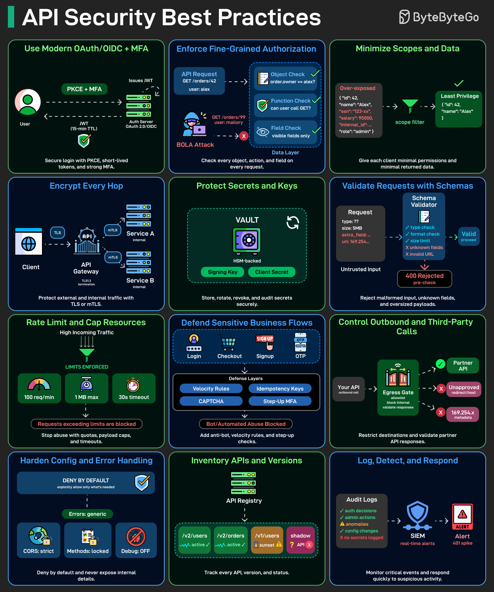


</details>

---


<details>
<summary><strong>API 디자인 실수 Top 10</strong></summary>


1. 버저닝 계획 없음 (그리고 v1이 조용히 깨짐)
2. 내부 정보 유출 (DB ID, 테이블 이름, 스택 트레이스)
3. 일관성 없는 리소스 명명 (동사 + 명사 혼합, 복수형 무작위)
4. 비표준 상태 코드 (오류 시 200, 인증에 404, 검증에 500)
5. 모호한 오류 본문 (오류 코드 없음, 필드 경로 없음, 상관관계 ID 없음)
6. 수다스러운 API (N+1 요청, 벌크 엔드포인트 없음, 페이지네이션 없음)
7. 멱등성 누락 (재시도 시 중복 생성, 모든 것에 POST 사용)
8. 타임아웃이나 재시도 지침 없음 (클라이언트 스탬피드, 장애 시 썬더링 허드)
9. 약한 인증 경계 (스코프 불명확, 테넌트 검사 산재, 감사 추적 없음)
10. 관찰성 부족 (요청 ID 없음, 구조화된 로그 없음, 엔드포인트별 SLO 없음)


</details>

---


<details>
<summary><strong>인터뷰에서 다뤄지는 API 개념들, 백엔드 개발자라면 이걸 건너뛰지 마세요</strong></summary>


1. 멱등성(Idempotency): PUT/DELETE가 멱등한 이유를 알되, POST는 그렇지 않은 이유를 알아야 합니다. 우발적인 중복 쓰기를 피하는 데 도움이 됩니다.
2. 페이징(Pagination): 오프셋(Offset)은 규모가 커질 때까지는 괜찮지만, 대규모 데이터셋에서는 커서/키셋(Cursor/keyset)이 필요합니다.
3. 버저닝(Versioning): URI vs 헤더 vs 쿼리 파라미터. 정답은 없고, 트레이드오프만 있을 뿐입니다.
4. 속도 제한(Rate limiting): 공정성을 중시한다면, 단순 고정 윈도우(naive fixed window)보다 토큰 버킷(Token bucket)이 더 낫습니다.
5. 오류 계약(Error contracts): 400(잘못된 요청) ≠ 422(유효성 검사 문제) ≠ 409(충돌). 모든 곳에 500을 던지지 마세요.
6. 캐싱(Caching): ETag + Cache-Control이 불필요한 DB 부하를 줄여줍니다.
7. 보안(Security): JWT는 만료되는 이유가 있습니다. 사용자 PII를 그 안에 채워넣지 마세요.
8. N+1 쿼리(N+1 Queries): 일찍 죽여버리세요. 중첩 리소스를 반환할 때는 배칭이나 조인을 사용하세요.
9. 문서(Docs): OpenAPI/Swagger는 선택 사항이 아닙니다.
10. 일관성(Consistency): 때로는 캐시된 데이터로 충분합니다.


</details>

---


<details>
<summary><strong>2026년 자바의 90%는 이 10가지 개념을 마스터하는 데 달려 있습니다.</strong></summary>


나머지는 모두 구문 트리비아일 뿐입니다.

1. JVM 메모리 모델 + GC: 힙, 세대, 그리고 할당 속도가 힙 크기보다 일시 중지를 더 많이 유발하는 방식을 알아야 합니다.
2. 동시성 기본 요소: 락 vs 원자적 연산 vs 실행자; 프로덕션 버그의 대부분은 데드락이 아니라 놓친 가시성 문제입니다.
3. 컬렉션 + 복잡도: HashMap 리사이징, 반복 비용, 그리고 LinkedList가 언제 느린 ArrayList일 뿐인지.
4. I/O와 백프레셔: 블로킹 vs NIO, 요청당 스레드 제한, 그리고 큐가 과부하를 숨기다가 결국 숨기지 못하는 방식.
5. 예외와 실패 의미론: 체크드 예외는 신뢰성이 아닙니다; 타임아웃, 재시도, 그리고 멱등성이 진짜입니다.
6. 성능 기본: JIT 워밍업, 튜닝 전에 프로파일링, 그리고 JMH 없이 마이크로벤치마크가 왜 거짓말하는지.
7. 도구 유창성: Maven/Gradle, 의존성 트리, 쉐이딩, 그리고 CI와 노트북 간 재현 가능한 빌드.
8. 프로덕션 디버깅: 스레드 덤프, 힙 덤프, async-profiler, 그리고 추측 없이 스택 트레이스 읽기.
9. 보안 위생: 역직렬화, SSRF, 로그 속 비밀, 그리고 SBOM/SCA로 의존성 패치 유지.
10. 도움이 되는 관찰 가능성: 구조화된 로그, 카디널리티 제한이 있는 메트릭, 샘플링을 통한 트레이싱, 그리고 SLO 기반 경고.


</details>

---


<details>
<summary><strong>가장 중요한 분산 시스템 개념 중 하나:</strong></summary>


→ 멱등성

REST API를 설계할 때도 매우 중요합니다.

멱등한 작업은 첫 번째 API 요청 이후 시스템 상태를 변경하지 않고 여러 번 반복할 수 있습니다. 이는 분산 시스템에서 특히 중요합니다. 네트워크 장애나 타임아웃으로 인해 요청이 반복될 수 있습니다. 시스템은 이러한 일시적인 오류를 처리할 수 있어야 합니다.

멱등성을 구현하는 예시 흐름:

1. 클라이언트는 각 작업에 대해 고유한 키를 생성하고 사용자 지정 헤더에 포함하여 보냅니다.
2. 서버는 이 키를 이전에 본 적이 있는지 확인합니다
- 새로운 키의 경우, 요청을 처리하고 결과를 저장합니다
- 알려진 키의 경우, 재처리 없이 저장된 결과를 반환합니다

API에서 멱등성을 처리하고 계신가요?

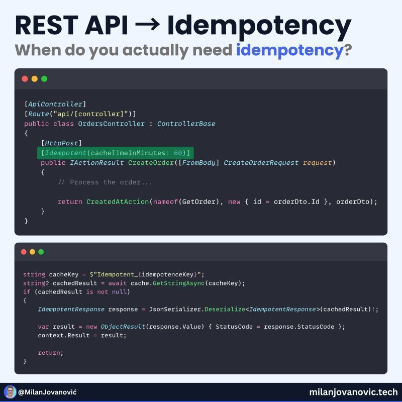

참고: 멱등성 키는 작업 자체에서 원자적으로 저장 및 검사되어야 합니다. 검사 후 실행 방식은 경쟁 조건(race condition)을 발생시킬 수 있습니다. 동일한 키를 가진 두 요청이 동시에 검사를 통과하여 실행될 수 있습니다. 안전한 패턴은 멱등성 키를 특정 위치에 삽입하는 것입니다.


</details>

---


<details>
<summary><strong>대부분의 엔지니어들은 락킹을 지나치게 복잡하게 생각합니다.</strong></summary>


여기 진실이 있습니다:

낙관적 락 → 애플리케이션 수준 제어  
비관적 락 → 데이터베이스 수준 제어

낙관적 = 모두가 편집하도록 허용하고, 저장 시 충돌을 확인합니다.  
(Google Docs를 생각해보세요.)

비관적 = 당신이 완료할 때까지 다른 모든 사람을 차단합니다.  
(도서관 책을 생각해보세요.)

대략적인 규칙

재시도가 저렴하다면 → 낙관적 사용  
재시도가 비용이 많이 든다면 → 비관적 사용

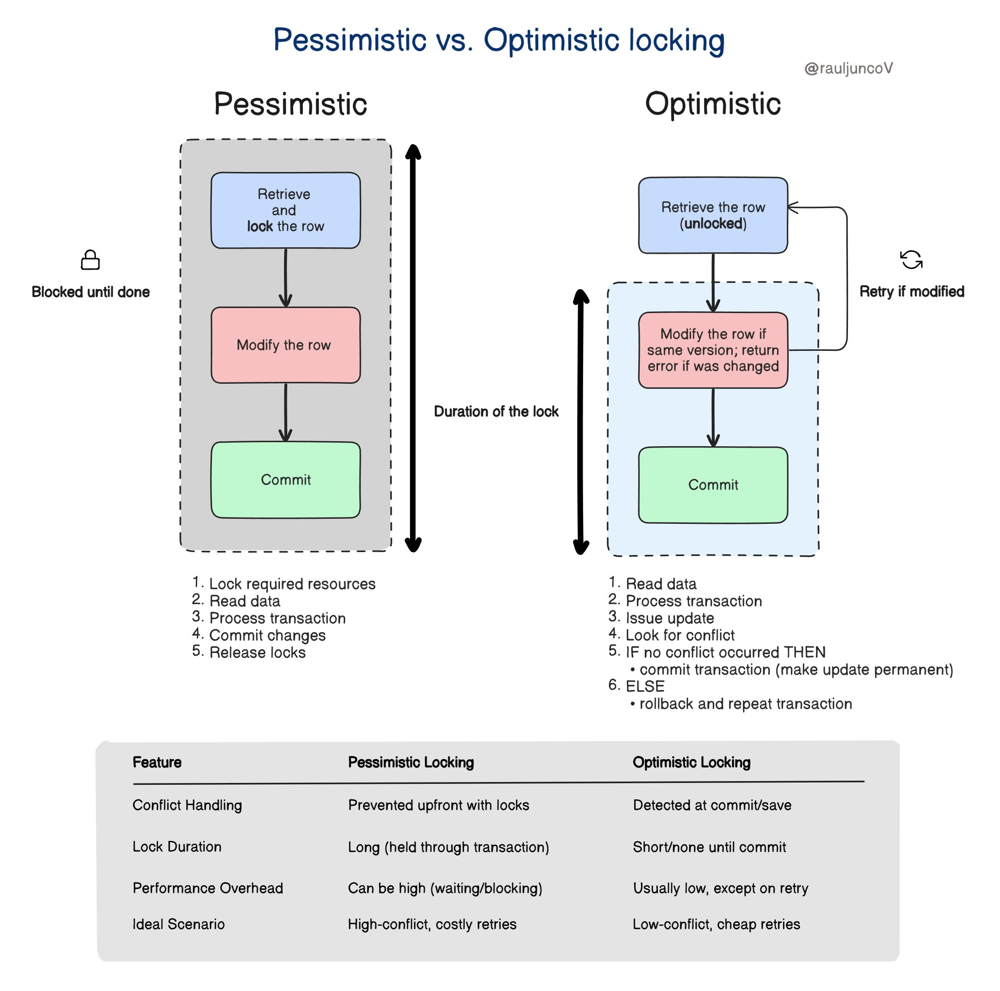


</details>

---


<details>
<summary><strong>10회 이상의 백엔드 인터뷰를 진행한 후, 정말 마스터해야 할 20가지 주제만 찾았습니다 -</strong></summary>


백엔드 기초:

1. 서버 작동 방식 (요청–응답 사이클)
2. REST API 설계 원칙
3. HTTP 메서드 & 상태 코드
4. 미들웨어 & 요청 흐름
5. 인증 vs 권한 부여

Node.js & 백엔드 런타임:

1. 이벤트 루프 & 논블로킹 I/O
2. Async/Await & Promise
3. 오류 처리 & 전역 오류 미들웨어
4. 환경 변수 & 설정 관리
5. 로깅 & 디버깅

데이터베이스:

1. SQL vs NoSQL (언제 무엇을 사용할지)
2. 데이터베이스 스키마 설계
3. 인덱싱 & 쿼리 최적화
4. 트랜잭션 & ACID 속성
5. 관계 (1–1, 1–다수, 다수–다수)

보안 & 확장성:

1. JWT, 세션 & 쿠키
2. 비밀번호 해싱 & 보안 모범 사례
3. 속도 제한 & 캐싱 (Redis)
4. 확장성 개념 (로드 밸런싱, 수평 확장)
5. API 버전 관리 & 배포 기초

이것들을 마스터하면 대부분의 백엔드 인터뷰가 예측 가능해집니다


</details>

---


<details>
<summary><strong>바이브코딩할 때 자주 쓰는 서버 포트, 한 번 정리해 봤습니다.</strong></summary>


그런데 이런 질문을 자주 받습니다.

"포트 번호를 알아서 뭐가 좋은데요?"

외우는 게 목적은 아닙니다.

포트만 알아도 어디서 문제가 났는지 금방 찾을 수 있습니다.

- 3000 → Next.js
- 8000 → FastAPI
- 3001 / 4000 → NestJS
- 5432 → PostgreSQL
- 3306 → MySQL / MariaDB
- 6379 → Redis
- 11434 → Ollama

예를 들어 3000은 열리는데 API가 안 되면 백엔드를 보면 되고, API는 되는데 데이터가 안 나오면 DB를 의심하면 됩니다.

AI는 코드를 잘 만들어주지만, 문제를 찾는 건 아직 개발자의 역할입니다.

포트 번호는 암기 과목이 아니라, 가장 빠른 디버깅 지도입니다.


</details>

---


<details>
<summary><strong>백엔드 언어 산업 채택 순위 ⚙️</strong></summary>


🟢 Java — 엔터프라이즈 + 뱅킹  
🟢 C# — 엔터프라이즈 + Microsoft 생태계  
🟢 Python — AI + 데이터 + 백엔드  
🟢 JavaScript — 웹 + 풀스택  
🟢 TypeScript — 현대 백엔드 + SaaS

🔵 Go — 클라우드 + 인프라  
🔵 PHP — 웹 + 콘텐츠 플랫폼  
🔵 Kotlin — 백엔드 + 안드로이드  
🔵 Ruby — SaaS + 웹 제품

🔴 Rust — 시스템 + 성능 중심 소프트웨어  
🔴 Elixir — 분산 + 실시간 시스템


</details>

---


<details>
<summary><strong>학습 곡선별 API 기술 순위</strong></summary>


🟢 REST API — 쉬움  
🟢 GraphQL — 쉬움  
🟢 Webhooks — 쉬움  
🟢 Server Sent Events — 쉬움

🔵 WebSockets — 보통  
🔵 gRPC — 보통  
🔵 tRPC — 보통  
🔵 API Gateways — 보통

🟠 Message Queues — 어려움  
🟠 Kafka — 어려움  
🟠 Event Driven Architecture — 어려움  
🟠 Microservices — 어려움

🔴 Distributed Systems — 매우 어려움  
🔴 Eventual Consistency — 매우 어려움  
🔴 Consensus Algorithms — 매우 어려움  
🔴 Distributed Transactions — 매우 어려움


</details>

---


<details>
<summary><strong>AI 시대에 백엔드를 과도하게 고민하지 마세요.</strong></summary>


기본 사항은 여전히 필요합니다.

- HTTP 배우기 → 웹이 어떻게 소통하는지
- 데이터베이스 배우기 → 데이터가 어떻게 존재하는지
- 캐싱 배우기 → 앱이 어떻게 빨라지는지
- 인증 배우기 → 사용자가 어떻게 안전하게 유지되는지
- API 배우기 → 시스템이 어떻게 연결되는지
- 큐와 백그라운드 작업 배우기 → 비동기 작업이 어떻게 일어나는지
- 로깅과 관찰 가능성 배우기 → 프로덕션이 어떻게 디버깅되는지
- 테스트와 CI/CD 배우기 → 소프트웨어가 어떻게 안정적으로 배포되는지

그 다음 AI 레이어를 추가하세요:

- LLM API → 애플리케이션이 어떻게 지능을 사용하는지
- RAG와 검색 → AI가 어떻게 맥락을 얻는지
- 도구 호출 → AI가 어떻게 시스템과 상호작용하는지
- 에이전트와 워크플로 → AI가 어떻게 작업을 실행하는지
- 평가와 가드레일 → AI가 어떻게 신뢰할 수 있게 되는지

모든 프레임워크를 배울 필요는 없습니다. 먼저 기본 사항을 마스터하세요. AI는 그 위에 쌓이는 또 다른 레이어일 뿐입니다.


</details>

---


<details>
<summary><strong>모든 개발자가 알아야 할 기본 Localhost 포트</strong></summary>


- ⚛️ React (CRA) → :3000
- ⚡ Next.js → :3000
- 🚀 Vite → :5173
- 🅰️ Angular → :4200
- 🟢 Vue CLI → :8080
- 📦 Node.js / Express → :3000 / :5000
- 🐍 Django → :8000
- 🌶️ Flask → :5000
- 🏎️ FastAPI → :8000
- ☕ Spring Boot → :8080
- 🐘 Laravel → :8000
- 💎 Ruby on Rails → :3000
- 🍃 MongoDB → :27017
- 🐘 PostgreSQL → :5432
- 🐬 MySQL → :3306
- ⚡ Redis → :6379
- 🐳 Docker daemon → :2375
- 🔍 Elasticsearch → :9200


</details>

---


<details>
<summary><strong>모든 개발자가 알아야 할 백엔드 개념</strong></summary>


- 🌐 HTTP → 클라이언트와 서버 간 통신
- 🔗 API → 서로 다른 시스템 간 인터페이스
- 🔐 인증 → 당신은 누구인가?
- 🛡️ 권한 부여 → 무엇에 접근할 수 있는가?
- 🧠 미들웨어 → 요청과 응답 사이의 로직
- 💾 캐싱 → 자주 사용되는 데이터 저장
- 📄 페이지네이션 → 대량 데이터를 청크 단위로
- 🚦 속도 제한 → 요청 빈도 제어
- 📝 로깅 → 애플리케이션 이벤트 기록
- ❤️ 헬스 체크 → 서비스가 정상 작동하는지 확인
- 🔄 로드 밸런서 → 서버 간 트래픽 분산
- 📦 큐 → 작업을 비동기적으로 처리
- 🔁 재시도 → 실패한 작업을 다시 시도
- ⏱️ 타임아웃 → 너무 오래 걸리는 요청 중지
- 🔒 유효성 검사 → 입력이 올바른지 확인
- 🗄️ 데이터베이스 인덱스 → 데이터 조회 속도 향상
- 🔗 데이터베이스 트랜잭션 → 관련 작업의 일관성 유지
- 🧩 웹훅 → 이벤트에 대해 다른 시스템 알림
- 📡 WebSocket → 실시간 양방향 통신
- 🔍 모니터링 → 시스템 상태 및 성능 추적


</details>

---


<details>
<summary><strong>엔지니어가 &quot;어느 정도&quot;로 자주 쓰는 말들</strong></summary>


- API → 시스템 간의 창구
- 캐시 → 자주 사용하는 데이터를 임시 저장
- 세션 → 사용자의 상태를 유지
- 미들웨어 → OS와 앱 사이를 지탱하는 것
- 컨테이너 → 앱의 실행 환경을 묶는 것

설명하라고 하면 의외로 어렵다.  
"안다"와 "설명할 수 있다" 사이에는 꽤 큰 차이가 있다.


</details>

---


<details>
<summary><strong>웹사이트를 여는 &quot;고작 몇 초&quot; 동안 일어나는 일</strong></summary>


웹사이트를 여는 것만으로도,  
① DNS로 IP 주소를 조회  
② 서버에 연결  
③ HTTPS로 안전한 통신 확립  
④ HTTP 요청 전송  
⑤ 서버가 처리  
⑥ DB나 API에서 데이터 획득  
⑦ HTML 등을 반환  
⑧ 브라우저가 화면을 렌더링  
몇 초의 이면에서 이 모든 게 움직이고 있어.  
이 메커니즘을 알면 웹이 재미있어져.


</details>

---


<details>
<summary><strong>주니어 개발자: “인증은 쉽다.”</strong></summary>


로그인 → JWT → 완료. 😎

프로덕션:

이제 리프레시 토큰 처리,  
토큰 로테이션,  
만료,  
로그아웃, 세션,  
CSRF,  
비밀번호 재설정,  
속도 제한…”

주니어:

“console.log로 남아 있었어야 했어.” 💀


</details>

---


<details>
<summary><strong>모든 마이크로서비스 개발자가 알아야 할 패턴들:</strong></summary>


Circuit Breaker (Resilience4j)  
→ 실패하는 서비스 호출 중지  
→ 빠르게 실패하고 우아하게 복구  
→ 상태: CLOSED → OPEN → HALF_OPEN

Retry with Exponential Backoff  
→ 실패했나? 기다린 후 재시도  
→ 매번 더 오래 기다림  
→ 지터 추가 — 썬더링 허드 방지

Bulkhead  
→ 실패 격리  
→ 서비스별 별도 스레드 풀  
→ 한 서비스 느려도 다른 서비스 영향 없음

Saga Pattern  
→ 락 없이 분산 트랜잭션  
→ 코레오그래피: 이벤트가 다음 단계 주도  
→ 오케스트레이션: 중앙 코디네이터

API Gateway Pattern  
→ 단일 진입점  
→ 인증, 속도 제한, 라우팅  
→ 클라이언트가 한 곳과만 소통

Service Discovery  
→ 서비스들이 스스로 등록  
→ 클라이언트가 동적으로 발견  
→ Eureka, Consul


</details>

---


<details>
<summary><strong>프로덕션에서 나타나는 상위 10개 API 설계 실수:</strong></summary>


1. POST/웹훅에 대한 멱등성 없음. 재시도가 하나의 작업을 2번의 청구로 만듦.
2. 모호한 오류 의미론. 모든 것이 400/500으로, 클라이언트가 재시도 vs 수정 여부를 결정할 수 없음.
3. 타임아웃 + 취소 누락. 클라이언트가 떠난 후에도 서버가 계속 작동하며, 큐가 녹음.
4. 버전 관리 계획 없음. 동일한 경로/스키마 아래에서 파괴적 변경 사항 배포.
5. 일관성 없는 페이지네이션. 한 엔드포인트에서는 오프셋, 다른 곳에서는 커서 사용, 불안정한 정렬로 인해 중복 발생.
6. 수다스러운 엔드포인트. API가 테이블을 미러링하므로 사용 사례가 아닌 페이지 렌더링에 12번의 왕복 필요.
7. 새는 추상화. 내부 ID/상태 머신 노출 후 클라이언트 깨뜨리지 않고 리팩토링 불가.
8. 나쁜 속도 제한. IP당만 적용, 토큰/테넌트당 없음, Retry-After와 함께 429 없음.
9. 약한 authZ 모델링. 핸들러당 역할 검사 분산, 리소스 수준 정책 없음, 권한 버그 발생 쉬움.
10. 낮은 관찰 가능성. 요청 ID 없음, 구조화된 오류 없음, 상태 코드 및 경로별 메트릭 없음


</details>

---


<details>
<summary><strong>IT 엔지니어가 이해하고 싶은 보안 공격 5선</strong></summary>


- SQL 인젝션
- XSS
- CSRF
- 브루트 포스
- DoS/DDoS

자격증 시험에서도 실무에서도 자주 출제됩니다.
</details>

---


<!-- devtrack-draft-id: 7d8597e2-413a-450d-9403-1f692da2ba70 -->
<details>
<summary><strong>2026년 백엔드 엔지니어링의 90%는 이 10가지 개념을 마스터하는 데 달려 있습니다:</strong></summary>

1. 동시성 + 백프레셔  
    
    모든 큐, 스레드 풀, 컨슈머를 제한하세요; 작업을 드롭하는 것이 DB를 녹이는 것보다 종종 더 낫습니다.
    
2. 데이터 모델링 + 불변량  
    
    절대 깨져서는 안 되는 것(고유성, 단조성, 균형 잡힌 장부)을 적어 두고 데이터베이스에서 강제하세요, 분위기로 하지 말고요.
    
3. 멱등성 + 재시도  
    
    모든 네트워크 호출은 재시도될 것입니다; 멱등성 키와 중복 제거를 사용해 최소 한 번 전달이 이중 청구로 변하지 않게 하세요.
    
4. 일관성 트레이드오프  
    
    쓰기 후 읽기 vs 최종 일관성을 어디서 필요한지 아세요; 대부분의 장애는 나쁜 코드가 아니라 기대치 불일치 때문입니다.
    
5. 캐시 정확성  
    
    TTL은 전략이 아닙니다; 스탬피드, 네거티브 캐싱, 그리고 진실의 원천이 변경될 때 무효화를 처리하세요.
    
6. 배포 안전성  
    
    작은 롤아웃, 빠른 롤백, 기능 플래그가 영웅적 디버깅을 이깁니다; 스키마 변경에는 제로 다운타임 계획이 필요합니다.
    
7. 질문을 답하는 관찰 가능성  
    
    골든 시그널 플러스 요청 ID에 연결된 고-카디널리티 트레이스; 컨텍스트 없는 로그는 그냥 비싼 텍스트일 뿐입니다.
    
8. 프로덕션 디버깅  
    
    시간이 어디로 갔는지 증명하는 법을 배우세요: CPU vs IO vs 락 vs 네트워크; p95는 보통 하나의 핫 키나 하나의 느린 의존성 때문입니다.
    
9. 물어뜯는 보안 기본기  
    
    모든 경계에서 AuthZ 체크, 최소 권한 IAM, 시크릿 로테이션, 그리고 적대적 클라이언트를 가정하는 입력 검증.
    
10. 도구와 런북  
    
    반복 가능한 로컬 재현(docker, 시드 데이터), 한 명령어 배포, 그리고 새벽 2시에 확인할 것(대시보드, 쿼리, 킬 스위치)을 말하는 런북.

</details>

---
