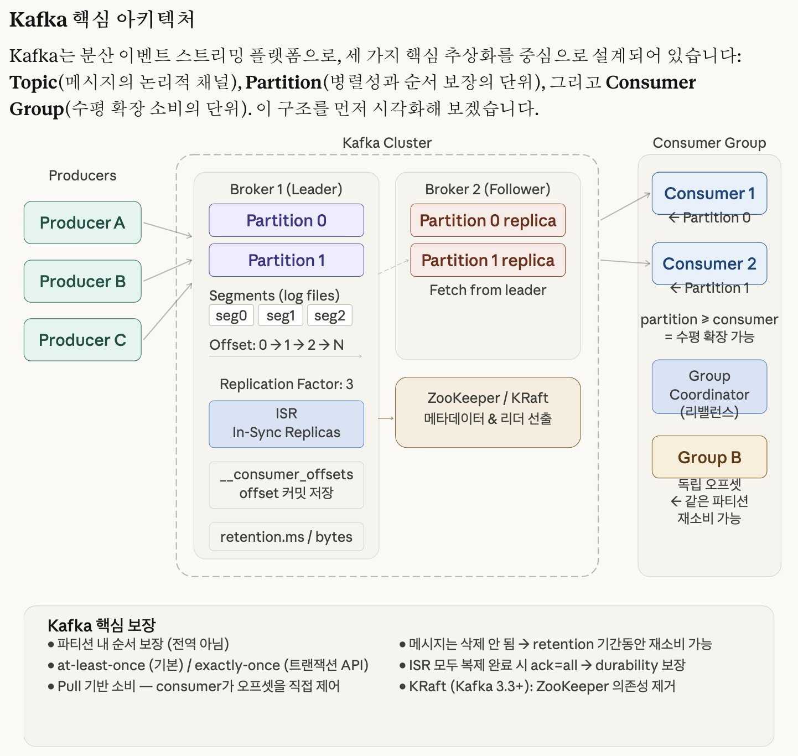
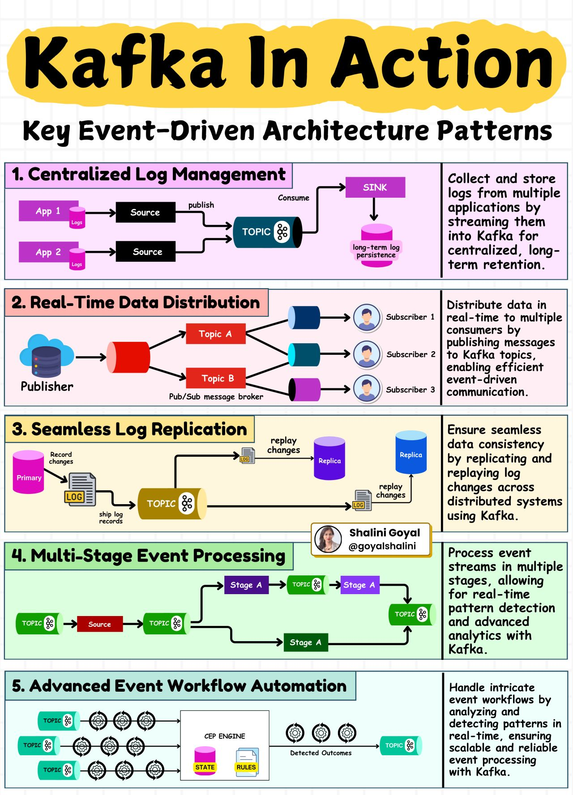

# Kafka

속성: Backend

Kafka 아키텍처를 먼저 살펴보고, PostgreSQL + Rust MPSC로 재구현하는 관점에서 분석해 드릴게요.


<details>
<summary><strong>Kafka 핵심 아키텍처</strong></summary>


Kafka는 분산 이벤트 스트리밍 플랫폼으로, 세 가지 핵심 추상화를 중심으로 설계되어 있습니다: **Topic**(메시지의 논리적 채널), **Partition**(병렬성과 순서 보장의 단위), 그리고 **Consumer Group**(수평 확장 소비의 단위). 




</details>


<details>
<summary><strong>PostgreSQL + Rust MPSC로 재구현하는 관점</strong></summary>


이제 Kafka의 각 개념이 PostgreSQL + Rust에서 어떻게 매핑되는지 살펴보겠습니다.

---

### **개념 매핑 대응표**

| **Kafka 개념** | **PostgreSQL + Rust MPSC 대응** |
| --- | --- |
| Topic | 테이블 (또는 파티셔닝된 테이블) |
| Partition | `PARTITION BY HASH(key)` |
| Offset | `BIGSERIAL` + `SKIP LOCKED` |
| Consumer Group | `tokio::sync::mpsc` 채널 + worker pool |
| Broker | Rust async 서비스 프로세스 |
| Retention | `DELETE WHERE created_at < NOW() - INTERVAL` |
| Replication | PostgreSQL streaming replication |
| ISR | synchronous_standby_names |

---

### **1. Topic / Partition 스키마 설계**

```
-- Topic = 테이블, Partition = 논리 파티션
CREATE TABLE events (
    id          BIGSERIAL,
    partition   INT NOT NULL,          -- hash(key) % N
    offset_id   BIGINT NOT NULL,       -- partition-local offset
    topic       TEXT NOT NULL,
    key         BYTEA,
    payload     BYTEA NOT NULL,
    headers     JSONB DEFAULT '{}',
    created_at  TIMESTAMPTZ DEFAULT NOW(),
    PRIMARY KEY (topic, partition, offset_id)
) PARTITION BY LIST (topic);

-- 토픽별 파티션 테이블
CREATE TABLE events_orders PARTITION OF events
    FOR VALUES IN ('orders');

CREATE TABLE events_payments PARTITION OF events
    FOR VALUES IN ('payments');

-- 오프셋 추적 (Kafka의 __consumer_offsets)
CREATE TABLE consumer_offsets (
    group_id    TEXT NOT NULL,
    topic       TEXT NOT NULL,
    partition   INT NOT NULL,
    offset_id   BIGINT NOT NULL DEFAULT 0,
    committed_at TIMESTAMPTZ DEFAULT NOW(),
    PRIMARY KEY (group_id, topic, partition)
);

-- 빠른 poll을 위한 인덱스
CREATE INDEX idx_events_poll
    ON events (topic, partition, offset_id)
    WHERE offset_id IS NOT NULL;
```

### **2. Producer — Rust 구현**

Kafka의 `acks=all`에 해당하는 내구성 보장을 PostgreSQL 트랜잭션으로 구현합니다.

```
use sqlx::{PgPool, postgres::PgPoolOptions};
use tokio::sync::mpsc;
use serde::{Serialize, Deserialize};

#[derive(Debug, Clone)]
pub struct Event {
    pub topic: String,
    pub key: Option<Vec<u8>>,
    pub payload: Vec<u8>,
    pub headers: serde_json::Value,
}

pub struct Producer {
    pool: PgPool,
    partition_count: u32,
}

impl Producer {
    pub fn new(pool: PgPool, partition_count: u32) -> Self {
        Self { pool, partition_count }
    }

    /// Kafka의 partition = hash(key) % N 방식과 동일
    fn assign_partition(&self, key: Option<&[u8]>) -> i32 {
        match key {
            Some(k) => {
                use std::hash::{Hash, Hasher};
                use std::collections::hash_map::DefaultHasher;
                let mut hasher = DefaultHasher::new();
                k.hash(&mut hasher);
                (hasher.finish() % self.partition_count as u64) as i32
            }
            None => rand::random::<u32>() as i32 % self.partition_count as i32,
        }
    }

    /// 단일 이벤트 발행 (at-least-once)
    pub async fn send(&self, event: Event) -> anyhow::Result<i64> {
        let partition = self.assign_partition(event.key.as_deref());

        // offset_id를 partition-local sequence로 관리
        let row = sqlx::query!(
            r#"
            INSERT INTO events (topic, partition, offset_id, key, payload, headers)
            VALUES (
                $1, $2,
                COALESCE(
                    (SELECT MAX(offset_id) + 1 FROM events
                     WHERE topic = $1 AND partition = $2),
                    0
                ),
                $3, $4, $5
            )
            RETURNING offset_id
            "#,
            event.topic,
            partition,
            event.key.as_deref(),
            event.payload.as_slice(),
            event.headers,
        )
        .fetch_one(&self.pool)
        .await?;

        Ok(row.offset_id)
    }

    /// 배치 발행 — Kafka의 linger.ms + batch.size 유사
    pub async fn send_batch(&self, events: Vec<Event>) -> anyhow::Result<Vec<i64>> {
        let mut tx = self.pool.begin().await?;
        let mut offsets = Vec::with_capacity(events.len());

        for event in events {
            let partition = self.assign_partition(event.key.as_deref());
            let row = sqlx::query!(
                r#"
                INSERT INTO events (topic, partition, offset_id, key, payload, headers)
                VALUES (
                    $1, $2,
                    COALESCE(
                        (SELECT MAX(offset_id) + 1 FROM events
                         WHERE topic = $1 AND partition = $2),
                        0
                    ),
                    $3, $4, $5
                )
                RETURNING offset_id
                "#,
                event.topic, partition,
                event.key.as_deref(),
                event.payload.as_slice(),
                event.headers,
            )
            .fetch_one(&mut *tx)
            .await?;
            offsets.push(row.offset_id);
        }

        tx.commit().await?;
        Ok(offsets)
    }
}
```

---

### **3. Consumer Group — MPSC + SKIP LOCKED**

Kafka의 pull 기반 소비와 consumer group rebalance를 Rust MPSC + PostgreSQL `SKIP LOCKED`로 구현합니다.

```
use tokio::sync::mpsc;
use std::sync::Arc;
use tokio::time::{sleep, Duration};

#[derive(Debug, Clone)]
pub struct ConsumedEvent {
    pub offset_id: i64,
    pub partition: i32,
    pub topic: String,
    pub key: Option<Vec<u8>>,
    pub payload: Vec<u8>,
}

pub struct ConsumerGroup {
    pool: Arc<PgPool>,
    group_id: String,
    topic: String,
    partitions: Vec<i32>,  // 이 consumer가 담당하는 파티션들
}

impl ConsumerGroup {
    /// Kafka poll()에 해당 — SKIP LOCKED으로 경쟁 없이 가져옴
    pub async fn poll(&self, max_records: i64) -> anyhow::Result<Vec<ConsumedEvent>> {
        // 현재 커밋된 오프셋 조회
        let offsets = self.fetch_committed_offsets().await?;

        let mut all_events = Vec::new();

        for partition in &self.partitions {
            let committed = offsets.get(partition).copied().unwrap_or(-1);

            // SKIP LOCKED = 다른 consumer가 처리 중인 행 건너뜀
            // Kafka의 파티션 단위 소비와 동일한 효과
            let events = sqlx::query_as!(
                ConsumedEvent,
                r#"
                SELECT
                    offset_id, partition, topic,
                    key as "key: Option<Vec<u8>>",
                    payload as "payload: Vec<u8>"
                FROM events
                WHERE topic = $1
                  AND partition = $2
                  AND offset_id > $3
                ORDER BY offset_id ASC
                LIMIT $4
                FOR UPDATE SKIP LOCKED
                "#,
                self.topic,
                partition,
                committed,
                max_records,
            )
            .fetch_all(&*self.pool)
            .await?;

            all_events.extend(events);
        }

        Ok(all_events)
    }

    /// Kafka commitSync()에 해당
    pub async fn commit_offset(
        &self,
        partition: i32,
        offset_id: i64,
    ) -> anyhow::Result<()> {
        sqlx::query!(
            r#"
            INSERT INTO consumer_offsets (group_id, topic, partition, offset_id)
            VALUES ($1, $2, $3, $4)
            ON CONFLICT (group_id, topic, partition)
            DO UPDATE SET offset_id = $4, committed_at = NOW()
            "#,
            self.group_id, self.topic, partition, offset_id,
        )
        .execute(&*self.pool)
        .await?;
        Ok(())
    }

    async fn fetch_committed_offsets(&self) -> anyhow::Result<std::collections::HashMap<i32, i64>> {
        let rows = sqlx::query!(
            "SELECT partition, offset_id FROM consumer_offsets
             WHERE group_id = $1 AND topic = $2",
            self.group_id, self.topic
        )
        .fetch_all(&*self.pool)
        .await?;

        Ok(rows.into_iter().map(|r| (r.partition, r.offset_id)).collect())
    }
}

/// MPSC로 worker pool 구성 — Kafka consumer group의 병렬 처리와 동일
pub async fn run_consumer_group(
    pool: Arc<PgPool>,
    group_id: String,
    topic: String,
    partition_count: i32,
    worker_count: usize,
) -> anyhow::Result<()> {
    let (tx, mut rx) = mpsc::channel::<ConsumedEvent>(1024);

    // 파티션을 worker에 균등 분배 (Kafka rebalance 단순 구현)
    let partitions_per_worker = partition_count as usize / worker_count;

    // Poller tasks — 각 파티션 그룹을 담당
    for worker_id in 0..worker_count {
        let start = (worker_id * partitions_per_worker) as i32;
        let end = ((worker_id + 1) * partitions_per_worker) as i32;
        let my_partitions: Vec<i32> = (start..end).collect();

        let consumer = ConsumerGroup {
            pool: Arc::clone(&pool),
            group_id: group_id.clone(),
            topic: topic.clone(),
            partitions: my_partitions,
        };
        let tx = tx.clone();

        tokio::spawn(async move {
            loop {
                match consumer.poll(100).await {
                    Ok(events) if !events.is_empty() => {
                        for event in events {
                            // 처리 후 오프셋 커밋
                            let offset = event.offset_id;
                            let partition = event.partition;
                            if tx.send(event).await.is_err() {
                                return; // channel closed
                            }
                            // 실제론 처리 완료 후 커밋해야 at-least-once 보장
                            let _ = consumer.commit_offset(partition, offset).await;
                        }
                    }
                    Ok(_) => {
                        // Kafka의 fetch.min.bytes / fetch.max.wait.ms 유사
                        sleep(Duration::from_millis(100)).await;
                    }
                    Err(e) => {
                        eprintln!("poll error: {e}");
                        sleep(Duration::from_millis(500)).await;
                    }
                }
            }
        });
    }

    drop(tx); // 모든 sender drop되면 rx가 닫힘

    // Worker (처리 로직)
    while let Some(event) = rx.recv().await {
        // 실제 비즈니스 로직
        println!(
            "[{}] partition={} offset={} payload={}",
            event.topic,
            event.partition,
            event.offset_id,
            String::from_utf8_lossy(&event.payload)
        );
    }

    Ok(())
}
```

### **4. Retention (메시지 보존 정책)**

```
/// Kafka의 log.retention.ms에 해당
pub async fn run_retention_cleanup(pool: Arc<PgPool>, retention_hours: i64) {
    loop {
        let result = sqlx::query!(
            "DELETE FROM events WHERE created_at < NOW() - ($1 || ' hours')::INTERVAL",
            retention_hours.to_string()
        )
        .execute(&*pool)
        .await;

        match result {
            Ok(r) => println!("Deleted {} expired events", r.rows_affected()),
            Err(e) => eprintln!("Retention cleanup error: {e}"),
        }

        sleep(Duration::from_secs(3600)).await;
    }
}
```

---

### **Kafka vs PostgreSQL+Rust — 한계와 트레이드오프**

| **항목** | **Kafka** | **PostgreSQL + Rust MPSC** |
| --- | --- | --- |
| **처리량** | 수백만 msg/s | 수만~수십만 msg/s |
| **지연** | 수 ms | 수십 ms (네트워크+DB) |
| **순서 보장** | 파티션 내 보장 | `ORDER BY offset_id`로 보장 |
| **exactly-once** | 트랜잭션 API | DB 트랜잭션으로 구현 가능 |
| **재소비** | offset reset | `consumer_offsets` 수정 |
| **스케일** | 수평 확장 용이 | DB가 단일 병목 가능 |
| **운영 복잡도** | 높음 (ZK/KRaft) | 낮음 (PG 하나) |
| **적합한 규모** | 대규모 스트리밍 | 중소규모, 트랜잭션 보장 필요 |

**핵심 통찰**: PostgreSQL의 `SKIP LOCKED` + `BIGSERIAL` 조합은 Kafka의 offset 기반 소비를 꽤 충실하게 재현할 수 있습니다. 특히 **메시지와 비즈니스 데이터를 같은 DB 트랜잭션으로 묶어야 할 때** (outbox pattern 등) PostgreSQL 기반이 Kafka보다 오히려 유리합니다. 반면 처리량이 초당 수만 건을 넘어가거나 멀티 데이터센터 복제가 필요하다면 Kafka가 맞는 선택입니다.

---

대부분의 개발자들은 Kafka를 메시징 시스템으로 알고 있지만, 이벤트 기반 아키텍처에서 그 잠재력을 온전히 활용하는 방법을 진정으로 이해하는 사람은 거의 없습니다.

Kafka는 단순히 메시지를 생성하고 소비하는 데 그치지 않습니다. 세계에서 가장 큰 기업들이 사용하는 확장 가능하고, 장애 내성을 가지며, 실시간 시스템의 중추입니다.

모든 엔지니어가 알아야 할 다섯 가지 주요 Kafka 패턴을 분해해 보겠습니다:

1. 중앙 집중식 로그 관리 – 여러 애플리케이션의 로그를 Kafka로 스트리밍하여 장기 저장 및 분석을 수행합니다.
2. 실시간 데이터 분배 – Kafka의 pub/sub 아키텍처를 사용하여 여러 소비자에게 데이터를 효율적으로 게시합니다.
3. 원활한 로그 복제 – 로그 변경을 복제하고 재생하여 분산 시스템 전반의 일관성을 보장합니다.
4. 다단계 이벤트 처리 – 실시간 패턴 탐지 및 분석을 위해 이벤트 스트림을 여러 단계로 처리합니다.
5. 고급 이벤트 워크플로 자동화 – 실시간으로 이벤트 패턴을 탐지하고 분석하여 워크플로를 자동화합니다.

이러한 패턴을 마스터하면 실제 애플리케이션을 구동하는 확장 가능하고 이벤트 기반 아키텍처를 설계하는 데 도움이 됩니다.

미래 참조를 위해 이 포스트를 저장하세요.
시스템 디자인 인터뷰를 준비하거나 이벤트 기반 시스템을 다루는 사람과 공유하세요.


</details>

