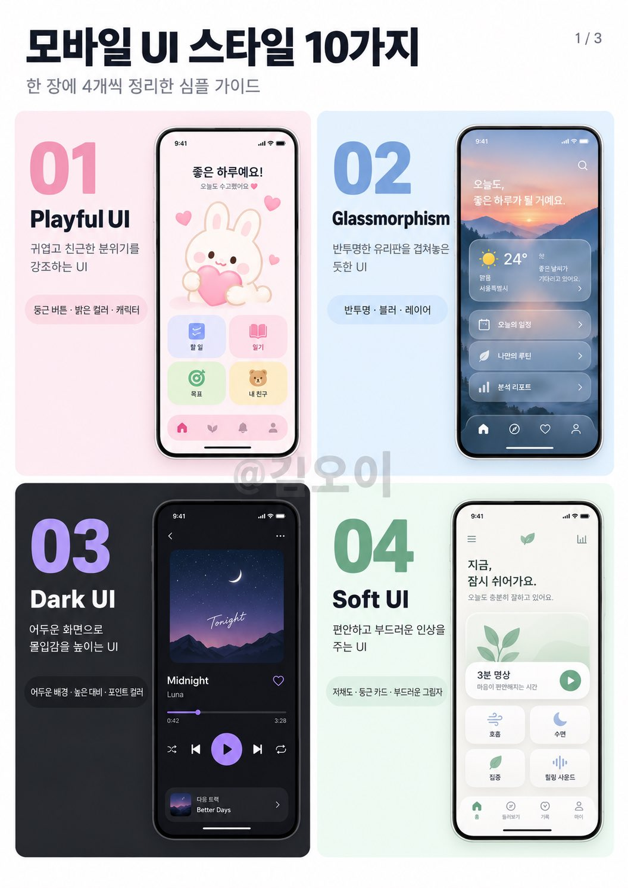
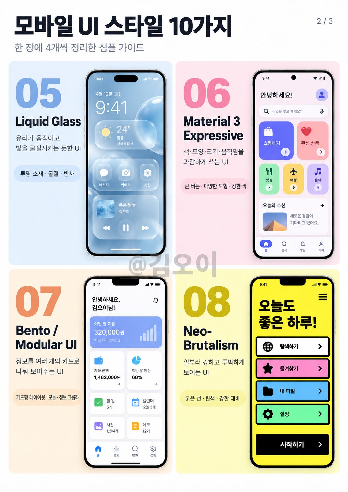
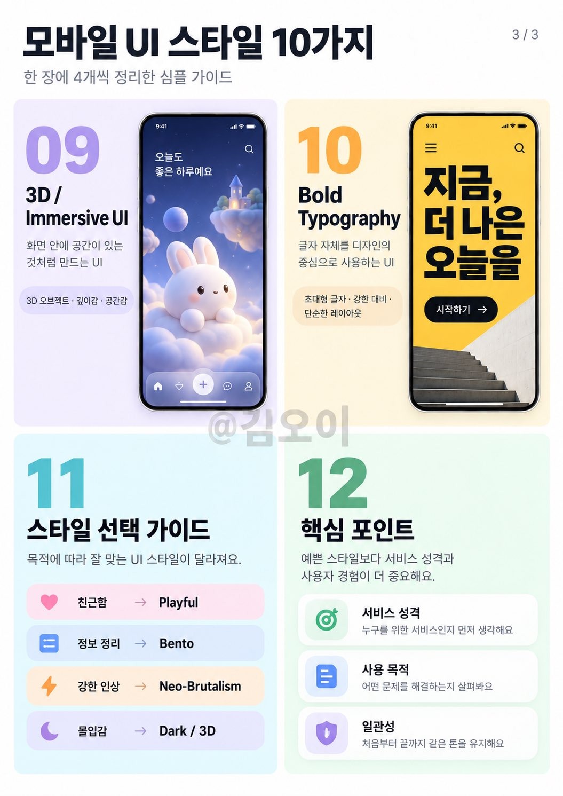

# 디자인

속성: Design

<strong>전세계 브랜드들의 브랜드가이드를 모아둔 사이트 발견</strong>

대기업의 브랜드가이드 PDF로 다운받아서 참고하는거
너무 고능하자나 팀디자이너 당장 북마크하라

[https://brandingstyleguides.com/](https://brandingstyleguides.com/)

---

<strong>비디자이너를 위한 정말 좋은 디자인 자료입니다.</strong>

[https://namethatui.com/](https://namethatui.com/)

---

<strong>5년차 프로덕트 디자이너가 회사 다니면서 꼭 쌓아두는 것</strong>

1. 프로젝트 전후 화면
2. 왜 이렇게 결정했는지
3. 버린 시안과 실패한 시도
4. 사용자 피드백
5. 전환율·이탈률·리텐션 같은 지표
6. 내가 실제로 맡은 역할

포트폴리오 만들 때 제일 힘든 건
디자인보다 그때 왜 그렇게 했는지 기억 안 나는 것!!!

퇴사하고 찾으려면 진짜 늦음.

---

<strong>기업 브랜드 로고 사이트</strong>

https://www.logochakchak.site/

---

<strong>2026년에도 여전히 Pinterest를 디자인 영감으로 사용하고 있나요? 이게 그걸 대체할 거예요.</strong>

1. [http://getlayers.ai](http://getlayers.ai/) — 50+ 웹사이트 프롬프트. 300+ 3D 장면, 1000+ 인터랙티브 그라데이션, 100+ 배경, 모션 섹션. 모든 게 프롬프트예요.
2. [http://supahero.io](http://supahero.io/) — 스와이프해서 가져올 수 있는 완전한 웹사이트 히어로 섹션 라이브러리.
3. [http://cta.gallery](http://cta.gallery/) — 실제로 클릭되는 콜-투-액션들.
4. [http://loadmo.re](http://loadmo.re/) — 대담하고 시끄러운 모바일 웹사이트 갤러리.
5. [http://60fps.design](http://60fps.design/) — 비싸 보이는 작은 모션 & 인터랙션 디테일들.
6. [http://recent.design](http://recent.design/) — 오늘 출시된 최고의 것들, 매일 새로고침.
7. [http://posts.design](http://posts.design/) — 한 곳에 모인 가장 날카로운 소셜 포스트 디자인.
8. [http://navbar.gallery](http://navbar.gallery/) — 복사할 가치 있는 모든 네브바 패턴.

---

<strong>UI/UX 디자이너 여러분, AI 코딩을 위한 최고의 DESIGN.md 리소스 중 일부를 북마크해두셔야 할 것들입니다:</strong>

스타일 → [http://styles.refero.design](http://styles.refero.design/)
디자인 시스템 → [http://neuform.ai](http://neuform.ai/)
UI 컴포넌트 → [http://typeui.sh](http://typeui.sh/)
웹 디자인 → [http://aura.build](http://aura.build/)[디자인.md](http://xn--2z1bu26abc.md/) → [http://design-md.hyperbrowser.ai](http://design-md.hyperbrowser.ai/)
디자인 리소스 → [http://designmd.supply](http://designmd.supply/)
오픈 디자인 → [http://open-design.ai](http://open-design.ai/)[디자인.md](http://xn--2z1bu26abc.md/) → [http://designmd.me](http://designmd.me/)

---

<strong>문서의 구획을 《황금비》나 《백은비》를 사용해 나누고 싶을 때 이 사이트 한 번 방문해 보세요</strong>

길이를 입력만 해주면 알아서 계산 끝!!
[https://voidism.net/metallicratio/](https://voidism.net/metallicratio/)

---

<strong>여기저기 ai thread 에 올라오는 웹디자인 레퍼런스들을 봤는데</strong>

첫페이지에 동영상 히어로 백그라운드에
과도한 모션 떡칠남발,
너무 화려하고 일관되지 않은 UI
홈페이지 빼고는 구성력이 떨어지는 레이아웃
클로드나 코덱스가 만든 그대로 해서
CSS 튜닝을 해도 티가나는 디자인들
클라이언트가 원하는 컨텐츠가
반영되어야하는 요소가
구현이 안되잇거나
응용하기에는 코드수정없이
불가한 페이지들이 숱하게 보인다.
가장중요한 정적요소와 동적요소의 분배는
페이지를 추가해갈수록 꼬이겟지.
파워포인트나 슬라이드쇼 같은
단편적 영상 클립생성과
견실한 웹페이지 제작은 다른데
기본개념도 없는 슬롭 디자인이 많다.
제일중요한 속도문제보다
멋드러진 모션에 토큰을 태우는
바보들이 많아보인다.

---

<strong>요즘 많이 보이는 모바일 UI 스타일 10가지</strong>

앱 만들 때마다 지피티로 디자인 고민하다가 힘들어서, 요즘 자주 보이는 모바일 UI 스타일을 10개로 정리해봤음.

같은 기능의 앱이어도 색, 카드 모양, 타이포, 레이아웃만 바뀌면 인상이 완전히 달라짐.

📌 비교한 UI 스타일

01 Playful UI — 둥근 요소 + 밝은 컬러 + 캐릭터로 귀엽고 친근하게

02 Glassmorphism — 반투명 카드 + 블러 + 레이어로 유리 같은 느낌

03 Dark UI — 어두운 배경 + 높은 대비 + 포인트 컬러로 몰입감 있게

04 Soft UI — 저채도 컬러 + 둥근 카드 + 부드러운 그림자로 편안하게

05 Liquid Glass — 투명 소재 + 굴절 + 반사로 더 입체적이고 유동적인 느낌

06 Material 3 Expressive — 큰 버튼 + 다양한 도형 + 강한 색으로 기능을 확실하게 강조

07 Bento / Modular UI — 정보를 여러 개의 카드와 모듈로 나눠 한눈에 정리

08 Neo-Brutalism — 굵은 선 + 원색 + 강한 대비로 일부러 투박하고 강렬하게

09 3D / Immersive UI — 3D 오브젝트 + 깊이감 + 움직임으로 화면 안에 공간감 만들기

10 Bold Typography — 초대형 글자 + 강한 폰트 대비로 텍스트 자체를 디자인의 중심으로

같은 앱이어도 어떤 UI 스타일을 쓰느냐에 따라
완전히 다른 서비스처럼 보임.

---

<strong>프로그래머들이 가장 쉽게 막히는 건, 때로는 코드가 아니라 UI 감각이야.</strong>

내 게으른 플레이 방법: 예쁜 기존 컴포넌트를 찾아서, AI 에이전트한테 바로 던져주고, 그게 알아서 고르고, 수정하고, 프로젝트에 끼워넣게 하는 거.

이 5개 사이트 먼저 북마크해둬:

1️⃣ Beautiful UI — [https://beautifului.dev](https://beautifului.dev/)
2️⃣ BeUI — [https://beui.dev](https://beui.dev/)
3️⃣ Rare UI — [https://rareui.com](https://rareui.com/)
4️⃣ Transitions — [https://transitions.dev](https://transitions.dev/)
5️⃣ shadcn/ui — [https://ui.shadcn.com](https://ui.shadcn.com/)
Claude Code, Codex 같은 에이전트들도 참고로 쓸 수 있어.
디자인 못해도 괜찮아, 좋은 거 어디서 찾는지 먼저 알면 돼.

