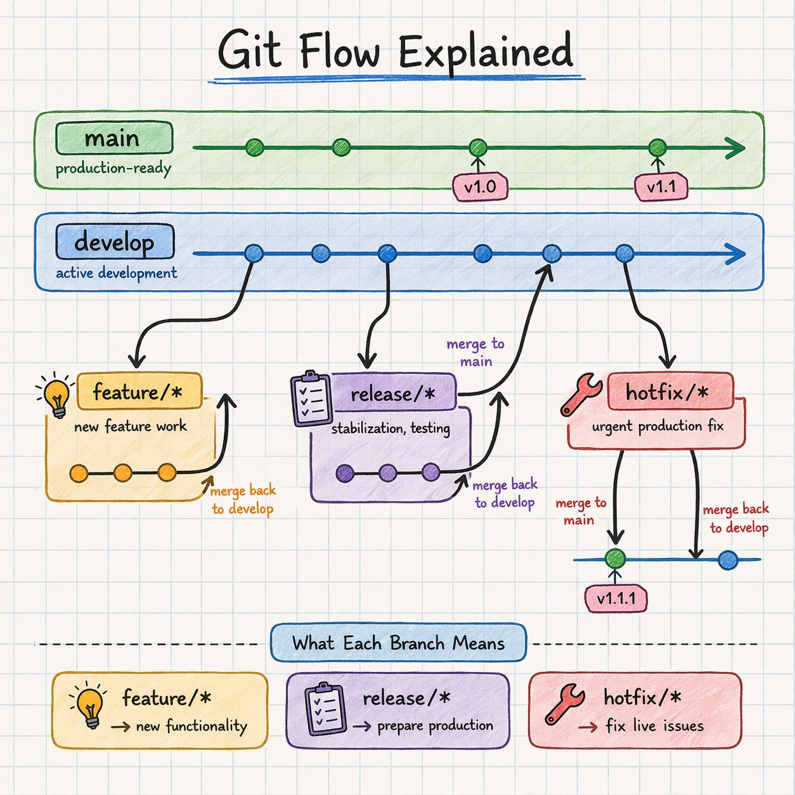
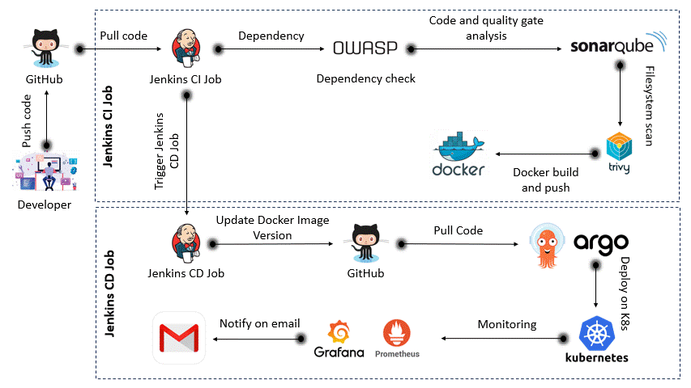
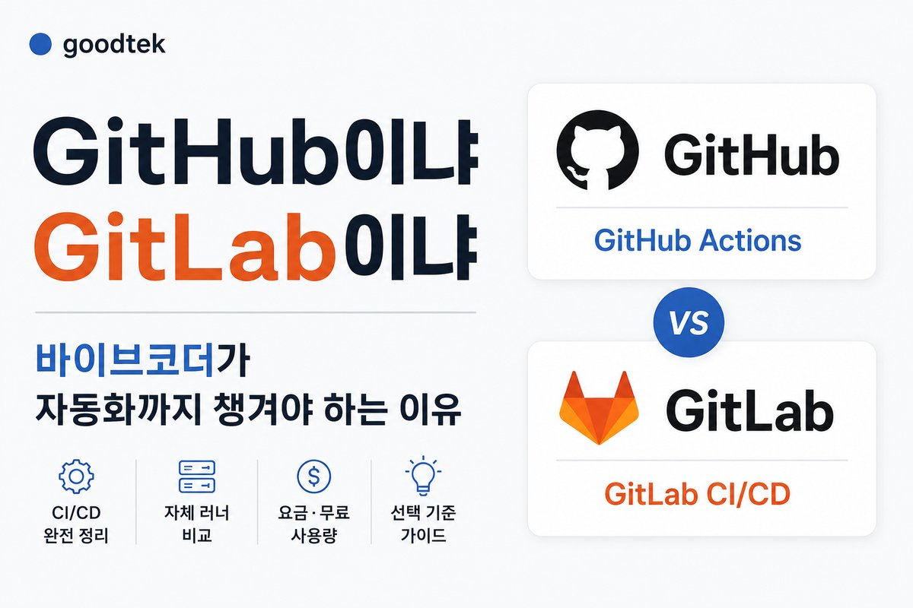

# CI/CD

속성: DevOps


<details>
<summary><strong>CI/CD Concepts</strong></summary>


- Build pipelines - 🟢 Easy
- Unit testing - 🟢 Easy
- Artifact storage - 🟢 Easy
- Deployment pipelines - 🟡 Medium
- Environment management - 🟡 Medium
- CI/CD tools - 🟡 Medium
- Rollbacks & strategies - 🟠 Medium
- Secrets management - 🟠 Medium
- Pipeline debugging - 🔴 Hard
- Release at scale - 🔴 Hard

---


</details>

---


<details>
<summary><strong>훌륭한 데브옵스/SRE 엔지니어가 되고 싶으신가요?</strong></summary>


1. 리눅스 및 시스템 기초  
프로세스, 메모리, 파일 시스템, 네트워킹, CLI를 이용한 디버깅 등 실제 시스템 작동 방식
2. 네트워킹  
DNS, HTTP/HTTPS, TCP/IP, 포트, 로드 밸런싱, 실제 트래픽 흐름 방식
3. 클라우드 (하나를 골라서 깊이 파고들어 보세요)  
AWS/GCP/Azure, IAM, VPC, 스케일링, 스토리지 - 서비스가 아니라 기본 원리를 이해해야 합니다.
4. 컨테이너  
Docker, 이미지, 네트워킹, 볼륨, 컨테이너를 실행할 때 실제로 일어나는 일들
5. 쿠버네티스  
Pod, 스케줄링, 서비스, 배포, 디버깅 등 단순히 kubectl 명령어만 사용하는 것이 아닙니다.
6. 코드형 인프라(Infrastructure as Code)  
Terraform이나 유사 도구를 사용하여 상태, 모듈 등을 관리하고, 인프라를 제대로 관리하세요. 수동 클릭은 필요 없습니다.
7. CI/CD  
파이프라인, 빌드, 배포, 롤백, 코드가 프로덕션 환경에 도달하는 과정
8. 관찰 가능성  
로그, 메트릭, 추적, 알림, 문제 발생 시 디버깅 방법
9. 신뢰성  
타임아웃, 재시도, 속도 제한, 오류 처리, 시스템 안정화
10. 비용 및 효율성  
기본 재무 운영, 청구서 이해, 낭비 제거, 인프라 사용 최적화
11. 공학적 사고  
도구만 쫓지 말고 시스템을 이해하고, 고장 원인과 해결 방법을 알아라.

---


</details>

---


<details>
<summary><strong>Git Flow</strong></summary>


main → 프로덕션  
develop → 작업 브랜치

feature → 빌드  
release → 안정화  
hotfix → 프로덕션 빠르게 수정



---


</details>

---


<details>
<summary><strong>GitHub -&gt; Jenkins -&gt; Docker -&gt; Kubernetes -&gt; 완전한 DevOps 워크플로우</strong></summary>


이어그램에 표시된 𝐞𝐧𝐝-𝐭𝐨-𝐞𝐧𝐝 𝐂𝐈/𝐂𝐃 𝐟𝐥𝐨𝐰의 간단한 분해입니다

𝐂𝐈 𝐏𝐢𝐩𝐞𝐥𝐢𝐧𝐞 (𝐁𝐮𝐢𝐥𝐝 & 𝐒𝐜𝐚𝐧)  
‣ 개발자가 GitHub에 코드를 푸시합니다  
‣ Jenkins CI가 코드를 가져와 파이프라인을 트리거합니다  
‣ OWASP Dependency Check가 취약한 라이브러리를 스캔합니다  
‣ SonarQube가 코드 품질 및 보안 분석을 수행합니다  
‣ Docker가 이미지를 빌드합니다  
‣ Trivy가 이미지의 취약점을 스캔합니다  
‣ 이미지가 레지스트리에 푸시됩니다

𝐂𝐃 𝐏𝐢𝐩𝐞𝐥𝐢𝐧𝐞 (𝐃𝐞𝐩𝐥𝐨𝐲)  
‣ Jenkins CD가 이미지 버전을 업데이트합니다  
‣ 변경 사항이 GitHub로 다시 푸시됩니다  
‣ ArgoCD가 최신 변경 사항을 가져옵니다  
‣ 애플리케이션을 Kubernetes에 배포합니다

𝐌𝐨𝐧𝐢𝐭𝐨𝐫𝐢𝐧𝐠 & 𝐀𝐥𝐞𝐫𝐭𝐬  
‣ Prometheus가 메트릭을 수집합니다  
‣ Grafana가 대시보드를 시각화합니다  
‣ 파이프라인 상태에 대한 이메일 알림

𝐓𝐡𝐢𝐬 𝐢𝐬 𝐰𝐡𝐚𝐭 𝐜𝐨𝐦𝐩𝐚𝐧𝐢𝐞𝐬 𝐞𝐱𝐩𝐞𝐜𝐭 𝐲𝐨𝐮 𝐭𝐨 𝐮𝐧𝐝𝐞𝐫𝐬𝐭𝐚𝐧𝐝:  
‣ CI (build + scan)  
‣ CD (deploy + automate)  
‣ Security (shift-left approach)  
‣ Monitoring (production visibility)



---


</details>

---


<details>
<summary><strong>🧠 Git 기술 - 난이도 분해 🔥</strong></summary>


➕ git add -> 🟢 쉬움

💾 git commit -> 🟢 쉬움

📥 git pull -> 🟢 쉬움 (⚠️ 숨겨진 복잡성)

📤 git push -> 🟢 쉬움

📦 git clone -> 🟢 쉬움

🌿 브랜칭 -> 🟡 쉬움–중간

🔀 병합 -> 🟡 쉬움–중간

🧾 git log -> 🟢–🟡 쉬움–중간

🔄 git stash -> 🟡 쉬움–중간

🔗 리모트 (origin/upstream) -> 🟡 쉬움–중간

⚔️ 병합 충돌 -> 🟠 중간

🧠 리베이스 -> 🟠 중간

🔍 bisect -> 🟠 중간

🧹 cherry-pick -> 🟠 중간

🧱 reset -> 🟠 중간

🪄 revert -> 🟠 중간

🔍 reflog -> 🟠 중간

🔒 훅 -> 🔴 어려움

🧬 서브모듈 -> 🔴 어려움

🧬 인터랙티브 리베이스 -> 🔴 어려움

🧠 히스토리 디버깅 -> 🟣 매우 어려움

⚙️ 리포지토리 전략 (모노 vs 멀티) -> ☠️ 극한

---


</details>

---


<details>
<summary><strong>Github 다이어그램 변환</strong></summary>


Github의 URL을 단 1글자만 수정하면, 복잡한 리포지토리 구조가 순식간에 트리 다이어그램으로 바뀌는 「**gitdiagram**」이 너무 대단해

・로그인 불필요, URL만 수정하면 끝  
・파일의 의존 관계가 깔끔한 트리 다이어그램으로 표시  
・순식간에 코드의 전체 구조가 시각화됨  
・공부하고 싶은 저기 저 리포지토리 내용도 한눈에 파악

「타인의 코드, 어디부터 읽기 시작해야 할지 모르겠어」라는 고민이 해결됨

기존 프로젝트를 파악하고 싶을 때도, 학습을 위해 오픈소스 코드를 읽고 싶을 때도, 어쨌든 코드 리딩할 때는 항상 쓰고 싶은 도구

이걸 아는 것만으로도 타인의 코드를 읽는 진입 장벽이 1/10 정도가 돼

https://x.com/shiba_program/status/2047606145909760385

---


</details>

---


<details>
<summary><strong>푸시 전에 GitHub Actions 워크플로우를 로컬에서 테스트합니다</strong></summary>


https://github.com/bahdotsh/wrkflw

## 실행 방안 (바로 사용)

### 1. 설치

```
# Rust 기반
cargo install wrkflw

# mac
brew install wrkflw
```

---

### 2. 워크플로우 문법 검증 (푸시 전 필수)

```
wrkflw validate
```

- 결과
    - `0` → 정상
    - `1` → 오류 있음

👉 PR 올리기 전에 이거 한 번 돌리면 CI 실패 거의 방지됨

### 3. 로컬 실행 (CI 시뮬레이션)

```
wrkflw run .github/workflows/ci.yml
```

### 옵션

```
# 특정 job만 실행
wrkflw run --job build .github/workflows/ci.yml

# 컨테이너 없이 빠르게 테스트
wrkflw run --runtime emulation .github/workflows/ci.yml

# 실패한 컨테이너 유지 (디버깅용)
wrkflw run --preserve-containers-on-failure .github/workflows/ci.yml
```

### 4. 이벤트 기반 실행 (실제 CI처럼)

```
# push 이벤트 시뮬레이션
wrkflw run --event push --diff .github/workflows/ci.yml

# PR 이벤트
wrkflw run --event pull_request --base-branch main --diff .github/workflows/ci.yml
```

👉 `on:` 조건까지 그대로 검증됨

### 5. 자동 감시 (개발 중)

```
wrkflw watch
```

- workflow 수정 시 자동 재실행

### 6. TUI (옵션)

```
wrkflw
```

- 워크플로우 목록 / 실행 / 로그 확인 가능

---

## 실전 적용 패턴 (추천)

### Git push 전 루틴

```
wrkflw validate && wrkflw run .github/workflows/ci.yml
```

→ 실패 시 push 금지

### Git hook으로 강제 (선택)

`.git/hooks/pre-push`

```
#!/bin/sh
wrkflw validate || exit 1
wrkflw run .github/workflows/ci.yml || exit 1
```

## 제한 사항 (중요)

- service container (`services:`) 실제 실행 안됨
- macOS / Windows runner 완전 지원 아님
- GitHub secrets 완전 동일하게 재현 불가

## 핵심 요약

- `validate` → 문법 체크
- `run` → CI 실행 재현
- `-event` → 트리거 조건 검증
- `-runtime emulation` → 빠른 테스트

---


</details>

---


<details>
<summary><strong>터미널 하나로 단일 머신 진단 완료, 더 이상 htop, iostat, nettop 같은 걸 잔뜩 열 필요 없음.</strong></summary>


Rust로 작성된 시스템 진단 TUI, CPU, 메모리, 디스크, GPU, 전원, 서비스, 네트워크 등을 커버하는 12개 탭 페이지, macOS와 Linux 모두 실행 가능. Insights 페이지는 스왑 떨림, 좀비 프로세스, 디스크 꽉 찬 거 같은 이상을 자동으로 감지해서, 아주 쉬운 말로 무슨 문제가 생겼는지 알려줌. Timeline 페이지는 타임라인을 드래그해서 전체 세션의 임의 시점 상태를 되돌아볼 수 있음. 읽기 전용, 프로세스 안 죽이고 설정도 안 바꿈, 새로고침할 때 CPU 점유율 0.5% 이하로 억제.

[https://github.com/matthart1983/syswatch](https://github.com/matthart1983/syswatch)

### 1. 기능 구조 (12개 탭)

| 탭 | 기능 | 대체 도구 |
| --- | --- | --- |
| Overview | 전체 시스템 요약 | 없음 (통합 대시보드) |
| CPU | CPU 사용량 상세 | htop, mpstat |
| Memory | 메모리 상태 | free, vm_stat |
| Disks | 디스크 IO | iostat |
| Filesystems | 파일시스템 상태 | df |
| Procs | 프로세스 | htop, ps |
| GPU | GPU 상태 | ioreg / sysfs |
| Power | 전력/배터리 | pmset |
| Services | 서비스 상태 | systemctl |
| Net | 네트워크 | nettop |
| Timeline | 시간 기반 상태 조회 | 없음 |
| Insights | 이상 감지 | 없음 |

---

### 2. 핵심 차별점

### (1) Insights (이상 탐지)

- 스왑 쓰래싱
- 좀비 프로세스
- 디스크 용량 부족
- 메모리 압박
- 과도한 load

→ 단순 수치가 아니라 **문제 원인을 자연어로 설명**

---

### (2) Timeline (세션 리플레이)

- ← / → 키로 과거 상태 조회
- 모든 패널이 동일 시점으로 동기화

→ `htop` 계열에는 없는 기능

---

### (3) 통합 UI

- CPU / 메모리 / IO / 네트워크 / 서비스 한 화면
- 다중 터미널 필요 없음

---

### (4) 낮은 오버헤드

- 새로고침 시 CPU 사용량 < 0.5%

---

### (5) 안전성

- read-only
- 프로세스 kill / 설정 변경 없음

---

### 3. 지원 환경

- OS: macOS / Linux
- 언어: Rust
- 의존성:
    - Rust 1.75+
    - Linux: 추가 의존성 없음
    - macOS: 시스템 프레임워크 링크

---

### 4. 설치 및 실행

```
git clone https://github.com/matthart1983/syswatch.git
cd syswatch
cargo build--release
./target/release/syswatch
```

옵션:

```
syswatch--tick500# 2Hz
syswatch--tab procs# 특정 탭으로 시작
```

---

### 5. 주요 키 바인딩

| 키 | 기능 |
| --- | --- |
| 1~9 | 각 탭 이동 |
| 0 / - / + | Net / Timeline / Insights |
| Tab | 탭 순환 |
| ↑ ↓ | 항목 선택 |
| s | 정렬 변경 |
| ← → | 타임라인 이동 |
| p | 일시정지 |
| q | 종료 |

---

### 6. 설계 철학 (명확한 제한)

- 멀티 호스트 ❌ → 단일 머신 전용
- 데몬 ❌ → 실행 중 세션만 존재
- 자동 조치 ❌ → 관측만 수행
- 로그 분석 ❌ → 상태 기반 진단
- UI 꾸미기 ❌ → 수치 중심

---

### 7. v0.1 범위 vs 향후 계획

### v0.1

- 12개 탭 완성
- macOS / Linux 지원
- 실시간 데이터 수집

### v0.2 예정

- Snapshot / Diff
- Recording / Replay
- 필터 / 설정

---

### 8. 제한 사항 (권한/플랫폼)

- 일부 기능은 sudo 필요:
    - 팬 속도
    - GPU 상세 전력
    - 온도 (macOS 일부)
- Apple Silicon GPU:
    - 일부 지표만 제공

---

## 실행 방안

### 1. 실제 사용 시 포지션

- 장애 징후 감지 초기 단계
- "느리다", "이상하다" 같은 상황에서 1차 진단

---

### 2. 기존 도구 대비 적용 전략

| 상황 | 권장 |
| --- | --- |
| 전체 상태 확인 | SysWatch |
| 특정 프로세스 디버깅 | htop |
| 로그 분석 | journalctl |
| 네트워크 심층 분석 | iftop |

---

### 3. 당신 환경 기준 (백엔드/인프라)

- Kafka / Influx / Collector 병목 확인
- CPU vs IO vs 네트워크 병목 구분
- OOM / swap thrash 감지
- 서비스 상태(systemd) 즉시 확인

---


</details>

---


<details>
<summary><strong>Git 팁: 아무도 말해주지 않지만 모두가 필요한 팁</strong></summary>


- git bisect를 사용해 문제 발생 커밋 찾기
- git reflog를 사용해 잃어버린 커밋 복구
- 명확성을 위해 이름과 함께 git stash 사용
- 병렬 브랜치 작업을 위해 git worktree 사용
- git blame를 사용해 누가 무엇을 작성했는지 확인
- 기여 요약을 위해 git shortlog 사용
- git 기록 없이 내보내기를 위해 git archive 사용
- 특정 커밋을 위해 git cherry-pick 사용
- 커밋 기록 정리 위해 git rebase -i 사용
- 사전 커밋 검사 위해 git hooks 사용

---


</details>

---


<details>
<summary><strong>시스템 디자인 시리즈 - CI/CD &amp; 배포</strong></summary>


**CI/CD가 실제로 의미하는 것:**

수동 배포는 예측 불가능하게 실패합니다.  
자동화된 파이프라인은 매번 같은 방식으로 실패합니다. 예측 가능한 실패는 고칠 수 있는 실패입니다.

CI는 프로덕션 전에 깨진 코드를 잡아냅니다.  
CD는 테스트가 통과하면 자동으로 배포합니다.

시작하기: GitHub Actions + Docker.

**GitHub Actions:**

리포지토리의 YAML 파일이 GitHub에 푸시할 때마다 자동으로 무엇을 할지 알려줍니다.

테스트 실행 → Docker 이미지 빌드 → 스테이징에 배포.

GitHub Secrets가 자격 증명을 안전하게 유지합니다.  
코드에 절대 포함시키지 마세요.

**Docker:** 

어디서나 동일한 환경.

Dockerfile → 이미지 → 컨테이너.

하나의 명령어(`docker compose up`)로 새로운 엔지니어가 로컬에서 전체 스택을 실행할 수 있습니다.

"스테이징에서 작동함"이 마침내 "프로덕션에서 작동함"을 의미합니다.

**배포 전략:**

다섯 가지 전략, 각각 다른 위험 수준을 가집니다:

• 롤링 배포 (기본 안전 선택)

• 블루-그린 (즉시 롤백, 제로 위험)

• 카나리 (먼저 5% 트래픽)

• 기능 플래그 (코드 배포, 기능 릴리스 별도)

• 데이터베이스 마이그레이션 안전 (항상 하위 호환)

---


</details>

---


<details>
<summary><strong>Git 기술 - 난이도 분류</strong></summary>


- ➕ git add → 🟢 쉬움
- 💾 git commit → 🟢 쉬움’
- 📥 git pull → 🟢 쉬움 (숨겨진 복잡성 있음)
- 📤 git push → 🟢 쉬움
- 📦 git clone → 🟢 쉬움
- 📋 git status → 🟢 쉬움

- 🌿 브랜치 생성 → 🟡 쉬움–중간
- 🔀 병합 → 🟡 쉬움–중간
- 🧾 git log → 🟡 쉬움–중간
- 🔄 git stash → 🟡 쉬움–중간
- 🔗 원격 저장소 (origin, upstream) → 🟡 쉬움–중간
- 🏷️ 태그 → 🟡 쉬움–중간

- ⚔️ 병합 충돌 → 🟠 중간
- 🧠 git rebase → 🟠 중간
- 🔍 git bisect → 🟠 중간
- 🧹 git cherry-pick → 🟠 중간
- 🧱 git reset → 🟠 중간
- 🪄 git revert → 🟠 중간
- 🔍 git reflog → 🟠 중간

- 🔒 Git 훅 → 🔴 어려움
- 🧬 서브모듈 → 🔴 어려움
- ✂️ 대화형 리베이스 → 🔴 어려움
- 🏗️ Git 내부 구조 → 🔴 어려움

- 🧠 히스토리 디버깅 → 🟣 매우 어려움
- ♻️ 손실된 커밋 복구 → 🟣 매우 어려움
- 🕰️ 히스토리 안전하게 재작성 → 🟣 매우 어려움

- ⚙️ 모노레포 vs 폴리레포 전략 → ☠️ 극한
- 🏢 엔터프라이즈 Git 워크플로우 설계 → ☠️ 극한
- 🚚 대형 저장소 마이그레이션 → ☠️ 극한

---


</details>

---


<details>
<summary><strong>당신의 GitHub 프로필은 두 번째 이력서입니다. 가치를 더하세요.</strong></summary>


- README 만들기
    
    [https://profile-readme-generator.com](https://t.co/z0VMAh66qW)
    
- GitHub Stats
    
    [https://github.com/anuraghazra/github-readme-stats](https://t.co/Mkt8xA36n3)
    
- GitHub Streak
    
    [https://github.com/DenverCoder1/github-readme-streak-stats](https://t.co/GhQgTi0zvf)
    
- Shields.io
    
    [https://shields.io](https://t.co/wz3bwEt916)
    
- Capsule Render
    
    [https://github.com/kyechan99/capsule-render](https://t.co/Xw4Q2d7NDM)
    
- GitHub Trophies
    
    [https://github.com/ryo-ma/github-profile-trophy](https://t.co/Pa3FllQN80)
    
- Profile Summary
    
    [https://github.com/vn7n24fzkq/github-profile-summary-cards](https://t.co/yCmL8vHUZB)
    
- Visitor Badge
    
    [https://visitorbadge.io](https://t.co/bybfWkbREJ)
    

당신의 GitHub 프로필을 돋보이게 하세요.


</details>

---


<details>
<summary><strong>깃허브냐, 깃랩이냐.</strong></summary>


바이브코더라면 은근히 오래 고민하게 되는 문제입니다.

혼자 빠르게 만들고 Vercel·Cloudflare·각종 SaaS와 바로 연결하려면 GitHub가 편합니다. 예제와 자료가 많아서 AI에게 에러를 물어볼 때도 답을 찾기 쉽습니다.

반대로 내 서버에 직접 배포하고, 저장소·러너·배포 흐름까지 한곳에서 통제하려면 GitLab이 더 잘 맞습니다. 사내망이나 셀프호스팅 환경이라면 특히 강점이 큽니다.

그리고 많이 놓치는 부분:

GitHub과 GitLab 모두 셀프호스티드 러너를 붙일 수 있습니다.

남는 서버나 NAS가 있다면,

코드 푸시 → 자동 테스트 → 자동 빌드 → 자동 배포

를 내 장비에서 돌릴 수 있습니다.

다만 현실적인 고민도 있습니다.

설정이 더 쉬운 쪽은 어디인가?

AI가 참고할 자료가 많은가?

배포 서버까지 직접 관리할 것인가?

러너 서버의 보안과 업데이트를 감당할 수 있는가?

앱 하나 때문에 GitLab 전체를 운영할 필요가 있는가?

정리하면,

빠르게 만들고 외부 서비스와 붙이기: GitHub  
자체 서버와 통제 중심 운영: GitLab

바이브코더에게 진짜 중요한 건 저장소 이름보다  
AI가 만든 코드를 자동으로 검사하고, 통과한 코드만 배포하게 만드는 구조입니다.



[VibeCrew - GitHub vs GitLab, 바이브코더는 무엇을 골라야 할까](https://vibecrew.kr/free/593)

---


</details>

---


<details>
<summary><strong>Git 로드맵</strong></summary>


```markdown
커밋 → 브랜치 → 병합 → 리베이싱
 → 원격 → 태그 → 체리피킹 → 바이섹트
  → 훅 → Git 워크플로 → CI/CD.
```

---


</details>

---


<details>
<summary><strong>오늘 @github 비동기 병합 API를 출시하게 되어 기쁩니다!</strong></summary>


PR을 프로그래밍 방식으로 병합하는 당신(또는 당신의 에이전트)에게 이건 딱 맞아요 🧵

[https://github.blog/changelog/2026-10-01-github-async-merge-api-generally-available/](https://github.blog/changelog/2026-10-01-github-async-merge-api-generally-available/)
</details>

---

