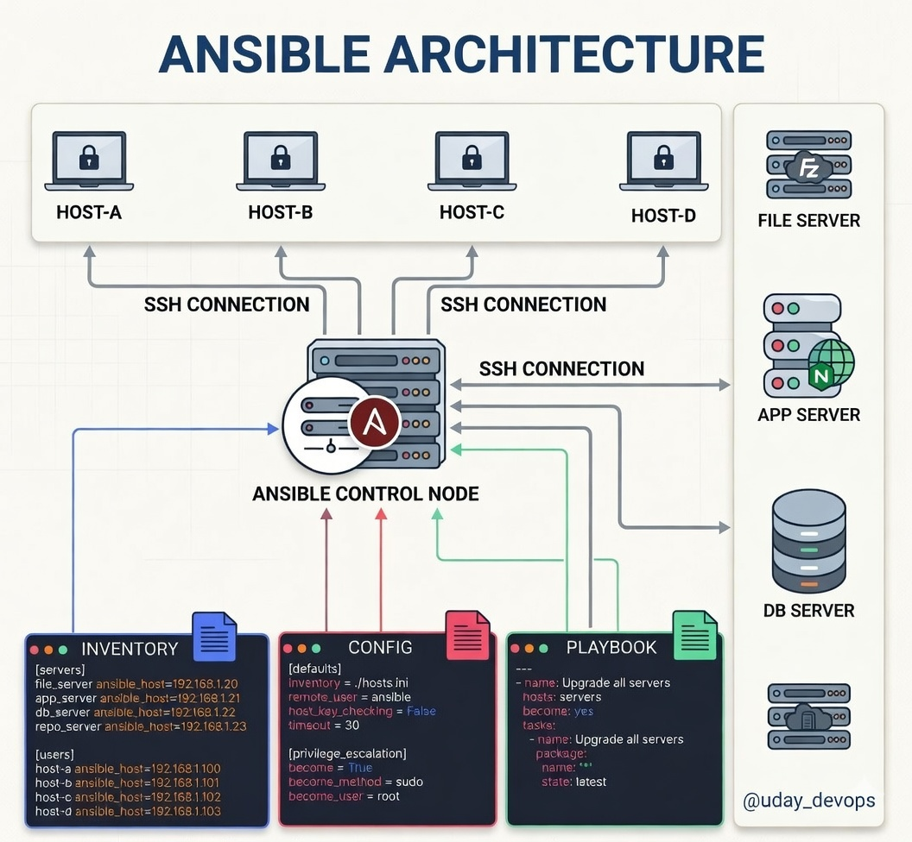
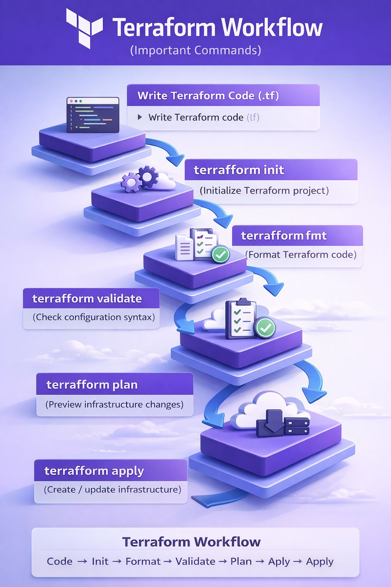
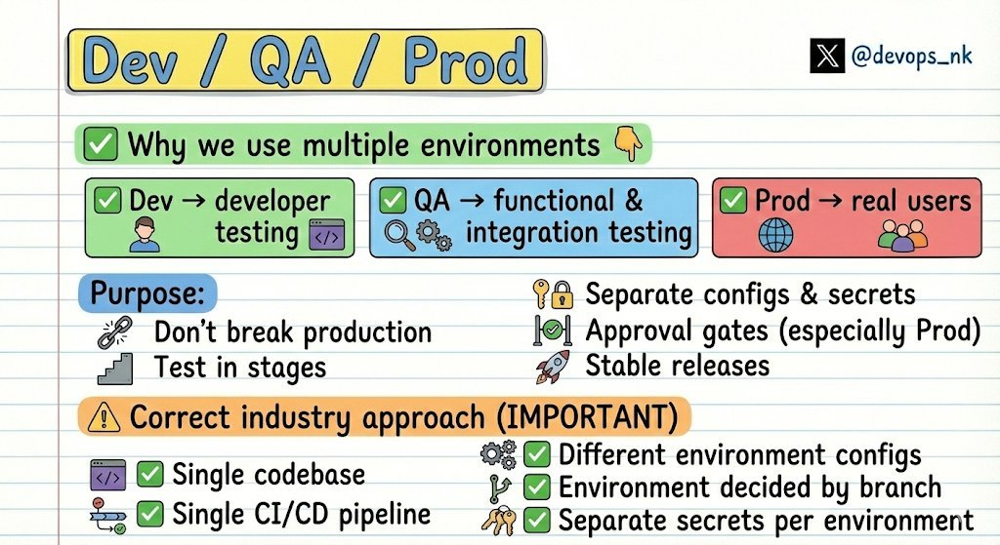

# DevOps

속성: DevOps

<strong>DevOps 문제 - 난이도 분류</strong>

(엔지니어들을 실제로 망가뜨리는 것)

- Dockerfile 작성 → 🟢 쉬움
- 로컬 실행 → 🟢 쉬움
- CI/CD 설정 → 🟡 보통
- 기본 Kubernetes 배포 → 🟡 보통
- 실패한 빌드 디버깅 → 🟠 보통
- 파드 충돌 수정 → 🟠 보통
- 설정 문제 (환경 변수, 시크릿) → 🟠 보통
- 네트워킹 문제 → 🔴 어려움
- 프로덕션 장애 → 🔴 어려움
- 무작위 타임아웃 → 🔴 어려움
- “로컬에서는 작동하는데 프로덕션에서는 안 됨” → 🔴 어려움

💡 대부분의 사람들은 도구를 배웁니다.

⚠️ 진짜 엔지니어들은 실패 패턴을 배웁니다.

---

<strong>Ansible</strong>

대부분의 DevOps 엔지니어들은 매주 10시간 이상을 단일 스크립트로 처리할 수 있는 반복적인 작업에 낭비하고 있습니다.

환경을 처음 확장하기 시작했을 때, 수동 검토가 안전을 보장하는 유일한 방법이라고 생각했습니다. 제가 잘못 생각한 거였습니다. 이 아키텍처로 전환한 후, 우리 팀은 배포 오류를 거의 하룻밤 사이에 40% 줄일 수 있었습니다.

✔️제어 노드: 하나의 중앙 두뇌가 SSH를 통해 전체 플릿을 관리하므로, 개별 서버에 로그인하는 시간을 낭비하지 마세요.  
✔️인벤토리 관리: 단일 파일에 500개 이상의 자산을 정리하여 인프라를 예측 가능하고 깔끔하게 유지하세요.  
✔️플레이북: 간단한 YAML 파일을 사용하여 복잡한 설정을 모든 배포에서 보장되고 반복 가능한 프로세스로 전환하세요.

거대한 인프라를 운영하기 위해 거대한 팀이 필요하지 않습니다. 지루한 작업을 자동화하는 더 나은 방법을 찾기만 하면 됩니다.

---

<strong>DevOps Tools in 2026</strong>

🟢 Git → Source of truth

🐳 Docker → Build once, run anywhere

☸️ Kubernetes → Keep systems running

🛠️ Terraform / OpenTofu → Infrastructure as code

⚡ GitHub Actions / Argo → Automate workflows

📊 Prometheus + Grafana → Observe systems

🔐 Vault / External Secrets → Manage secrets safely

🛡️ Kyverno / Cilium → Enforce security & policy

---

<strong>DevOps 로드맵 (2026)</strong>

1. 🧠 기초부터
    
    Linux, 네트워킹, HTTP, DNS, OS 기본 개념
    
    (이해하지 못하는 걸 디버그할 수 없어요)
    
2. 🧑‍💻 스크립팅
    
    Bash + Python
    
    일찍부터 모든 걸 자동화하세요
    
3. 🗂️ 버전 관리
    
    Git + GitHub (브랜칭, PR, 워크플로)
    
4. ⚙️ CI/CD
    
    GitHub Actions / GitLab CI
    
    빌드 -> 테스트 -> 배포 파이프라인
    
5. 🐳 컨테이너
    
    Docker (이미지, 볼륨, 네트워킹)
    
6. ☸️ 오케스트레이션
    
    Kubernetes (파드, 서비스, 배포)
    
7. ☁️ 클라우드
    
    AWS / GCP 기본 (EC2, S3, IAM, VPC)
    
8. 🏗️ 인프라 as 코드
    
    Terraform (코드처럼 인프라 프로비저닝)
    
9. 📊 모니터링 & 로깅
    
    Prometheus + Grafana + ELK
    
    (관찰할 수 없으면 스케일링할 수 없어요)
    
10. 🔐 DevSecOps
    
    시크릿, IAM, 취약점 스캐닝
    
11. ⚡ 스케일링 & 안정성
    
    로드 밸런싱, 오토스케일링, 캐싱
    
12. 🧩 실제 프로젝트
    
    앱을 엔드투엔드 배포 (여기서 모든 게 연결돼요)
    

---

<strong>Terraform</strong>

---

<strong>2026년에 DevOps에 뛰어들 계획이라</strong>

> Kubernetes를 선택하세요. 모든 진지한 구인 공고가 실제 K8s 경험을 요구합니다. 모든 중요한 플랫폼이 이를 기반으로 운영됩니다.  
> 

> Jenkins 대신 GitHub Actions를 선택하세요. Jenkins는 레거시 코드를 유지보수하는 느낌이 들죠. GitHub Actions는 리포지토리와 통합되며, 내장 보안 스캐닝을 제공하고, 모든 회사가 이미 이를 채택하고 있습니다.  
> 

> Terraform를 선택하세요. 어디서나 작동합니다. 한 번 배우면 어디서나 프로비저닝할 수 있습니다.  
> 

> Python을 선택하세요. DevOps 작업의 99%에 충분히 빠릅니다. 모든 AI 도구가 이를 기반으로 합니다.  
> 

> Datadog 대신 Loki + Grafana를 선택하세요. Datadog은 조용히 예산을 파괴할 겁니다. Loki + Grafana는 유연성과 가격 면에서 우위를 점합니다 — 특히 Kubernetes 환경에서요.  
> 

> ArgoCD나 Flux를 배우세요. GitOps가 표준입니다. 수동 배포는 이미 죽었습니다.  
> 

> Ansible은 쓰레기통에 버리세요. 이제 Terraform + GitOps + ArgoCD가 무거운 작업을 처리합니다.  
> 

> DevSecOps를 배우세요. 보안은 더 이상 보안 팀의 문제만이 아닙니다. 왼쪽으로 이동하세요. 코드, 컨테이너, IaC를 프로덕션에 배포되기 전에 스캔하세요.  
> 

AI를 최대한 활용하세요. 빠르게 배우세요. 빠르게 구축하세요. 빠르게 문제 해결하세요. AI를 핵심 도구로 다루는 엔지니어들이 모두를 앞지를 겁니다.

또한 시스템 설계, 재해 복구, 카오스 엔지니어링을 배우세요. 플랫폼 엔지니어링은 DevOps의 진화입니다.

P.S. 2026년에 DevOps에서 멈추지 마세요. MLOps, AIOps, AI 인프라를 배우세요. 거기에 일자리, 돈, 미래가 있습니다.

---

<strong>GitHub Actions와 Jenkins의 장점</strong>

호스팅:  
Jenkins는 자체 호스팅 방식으로, 실행을 위해 별도의 서버가 필요하지만, GitHub Actions는 GitHub에서 호스팅되며 GitHub 저장소 내에서 직접 실행됩니다.

사용자 인터페이스:  
Jenkins는 복잡하고 정교한 사용자 인터페이스를 가지고 있지만, GitHub Actions는 더 간소화되고 사용자 친화적인 인터페이스를 제공하여 간단한 수준부터 중간 수준의 자동화 작업에 더 적합합니다.

비용:  
Jenkins는 특히 대규모 및 복잡한 자동화 요구사항을 가진 조직에서 실행 및 유지보수 비용이 많이 들 수 있습니다. 반면 GitHub Actions는 오픈 소스 프로젝트에 대해 무료이며, 개인 저장소에 대해서는 계층화된 가격 모델을 적용하여 소규모 조직과 개별 개발자에게 더 접근하기 쉽습니다.

---

<strong>젠킨스 인터뷰 질문</strong>

- 확장 가능한 Jenkins 아키텍처를 어떻게 설계하나요?
- 마스터-에이전트 아키텍처란 무엇이며, Jenkins에서 어떻게 작동하나요?
- Jenkins에서 여러 파이프라인을 효율적으로 어떻게 처리하나요?
- Jenkins를 사용해 마이크로서비스를 위한 CI/CD 파이프라인을 어떻게 설계하나요?
- 프로덕션 환경에서 Jenkins를 어떻게 보안하나요?
- Jenkins에서 자격 증명을 어떻게 안전하게 관리하나요?
- Jenkins를 GitHub/GitLab과 어떻게 통합하나요?
- 웹훅을 사용해 파이프라인을 어떻게 트리거하나요?
- Jenkins에서 파이프라인 실패를 어떻게 처리하나요?
- Jenkins 빌드 문제를 어떻게 디버깅하나요?
- 파이프라인 애즈 코드란 무엇이며, 어떻게 구현하나요?
- Jenkins에서 공유 라이브러리를 어떻게 사용하나요?
- Jenkins 파이프라인 성능을 어떻게 최적화하나요?
- Jenkins에서 병렬 실행을 어떻게 처리하나요?
- Jenkins 파이프라인에서 롤백 전략을 어떻게 구현하나요?
- Jenkins를 Docker와 Kubernetes와 어떻게 통합하나요?
- Jenkins 성능을 어떻게 모니터링하나요?
- 일반적인 Jenkins 프로덕션 문제는 무엇인가요?
- Jenkins에서 플러그인 관리를 어떻게 처리하나요?
- 프로덕션 환경에서 Jenkins의 모범 사례는 무엇인가요?
- 프로젝트에서 어떤 종류의 플러그인을 사용하고 있나요?
- 젠킨스 이제 구리다고 욕해도 결국 현업에서는 이거 없으면 안 돌아가는 곳이 천지임. 단순히 빌드 돌리는 수준 넘어서 마스터 에이전트 구조나 보안, 쿠버네티스 연동까지 물어보는 거 보면 확실히 시니어 뽑는 기준인 듯. 공용 라이브러리랑 복구 전략까지 제대로 대답할 수 있으면 어디 가서 젠킨스 좀 친다고 명함 내밀어도 됨 ㅋㅋㅋ 도구 탓하기 전에 인프라 기본기부터 챙기는 게 먼저임.

---

<strong>Dev / QA / Prod는 환경에 관한 것이 아닙니다. 이는 규율에 관한 것입니다.</strong>

여러 환경을 사용하는 이유 👇  
✅ Dev → 개발자 테스트  
✅ QA → 기능 및 통합 테스트  
✅ Prod → 실제 사용자

목적:

- 프로덕션을 망가뜨리지 않기
- 단계별 테스트
- 구성 및 비밀 분리
- 승인 게이트 (특히 Prod)
- 안정적인 릴리스

올바른 산업 접근 방식 (중요)  
✅ 단일 코드베이스  
✅ 단일 CI/CD 파이프라인  
✅ 서로 다른 환경 구성  
✅ 브랜치에 따라 환경 결정  
✅ 환경별 별도 비밀

조직에서 어떤 것을 사용하고 계신가요? 단일 코드베이스인가요, 아니면 DEV / QA / PROD용 별도 코드베이스인가요?

---

<strong>만약 당신이 DevOps / SRE 신입이라면</strong>

이것들을 간단한 말로 설명할 수 있어야 합니다:

- URL을 입력했을 때 일어나는 일 (DNS + HTTP + TLS 기본)
- L4 vs L7 로드 밸런서 (각각 볼 수 있는 것/볼 수 없는 것)
- 리버스 프록시 vs API 게이트웨이
- 컨테이너 vs VM (실제로 공유되는 것)
- Kubernetes에서 Pod vs Deployment
- Readiness vs Liveness 프로브
- Horizontal vs Vertical 오토스케일링
- CI vs CD (그리고 테스트가 실행되는 위치)
- Blue/Green vs Rolling 배포
- 로그 vs 메트릭 vs 트레이스 (그리고 어디서 무엇을 사용할지)
- 기본적인 속도 제한 (토큰 버킷을 한 줄로)
- k8s에서 OOMKilled가 왜 발생하는지

---

<strong>DevOps Tools and their Difficulty to Learn</strong>

- 📋 YAML → 🟢 Easy
- 🐙 Git → 🟢 Easy
- 🐧 Linux CLI → 🟢 Easy
- 📜 Bash Scripting → 🟡 Easy–Medium
- 🐳 Docker → 🟡 Easy–Medium
- 🔄 GitHub Actions → 🟡 Easy–Medium
- 📦 Ansible → 🟡 Easy–Medium
- 🏗️ Terraform → 🟠 Medium
- ⚙️ Jenkins → 🟠 Medium
- ☸️ Kubernetes → 🟠 Medium
- 📊 Prometheus + Grafana → 🟠 Medium
- ☁️ AWS/GCP/Azure Basics → 🟠 Medium
- 🛠️ Helm → 🟠 Medium
- 🌐 Advanced Kubernetes (Networking/RBAC) → 🔴 Hard
- 🔄 GitOps (ArgoCD/Flux) → 🔴 Hard
- 🛡️ Security & IAM → 🔴 Hard
- 📡 Full Observability Stack → 🔴 Hard
- 🌐 Istio Service Mesh → 🟣 Very Hard
- 🧬 Custom Kubernetes Operators → 🟣 Very Hard
- ⚡ eBPF / Cilium → ☠️ Extreme
- 🏭 Building Your Own Orchestrator → ☠️ Extreme

---

<strong>요즘 보안 사고 뉴스를 보면 예전하고 좀 달라졌다.</strong>

서버가 뚫렸다는 이야기보다, 개발자가 매일 쓰는 도구를 타고 들어온 사고가 많아졌다.

올해 3월엔 컨테이너 취약점 점검 도구로 유명한 Trivy의 GitHub Action이 공격당했다.  
릴리스 태그 77개 중 76개가 조용히 바꿔치기됐고, 이걸 CI에서 쓰던 곳들은 클라우드 키랑 도커 설정, 쿠버네티스 토큰을 그대로 털렸다.  
보안 점검하라고 만든 도구가 거꾸로 공격 통로가 된 거다.

지난달엔 npm 패키지 14개가 4시간 만에 뿌려져서 AWS 키랑 CI 시크릿을 긁어갔다.  
이번 달엔 Red Hat이 배포하던 npm 패키지 32개에 설치 스크립트가 심겨서 개발자랑 CI의 비밀값을 빼냈다.

이런 사고들을 모아놓고 보면, 공격 대상이 바뀐 것 같다.  
운영 서버가 아니라, 개발자가 npm install 하는 순간이랑 git push 하는 파이프라인 쪽으로.

그럴 만한 이유가 있다.  
요즘은 데브옵스 조직이 제대로 갖춰진 곳이 많지 않다.  
대부분 백엔드는 백엔드대로, 프론트엔드는 프론트엔드대로 각자 CI/CD를 직접 짠다.  
파이프라인을 내가 짠다는 건, 공격자가 노리는 그 키들을 내가 들고 있다는 말이기도 하다.

그래서 DevSecOps가 보안팀만의 일은 아닌 것 같다.  
파이프라인을 직접 만지는 개발자라면 한 번쯤 교양처럼 알아둘 만한 게 됐다.  
별스러운 게 아니라, 내가 짠 파이프라인을 보안의 눈으로 한 번 더 들여다보는 일이다.

왜 하필 지금이냐면,  
AI가 코드를 대신 짜주면서 배포 속도는 빨라졌는데, 그 코드랑 거기 딸려 온 패키지를 사람이 일일이 뜯어보는 건 오히려 줄었다.  
AI가 가져온 라이브러리, AI가 만들어 준 Dockerfile을 별 의심 없이 그대로 올리는 일이 많아졌다.  
공격하는 쪽에서 보면 점점 들어오기 좋아지는 거다.  
실제로 올해 들어 이런 공급망 공격이 부쩍 늘었다.

다만 막상 DevSecOps를 혼자 공부해 보려고 하면 막막하다.  
개발은 화면에 제대로 뜨면 끝난 걸 안다.  
보안은 그런 신호가 없다.  
"안 뚫렸다"는 걸 어떻게 확인하는지부터가 안 보인다.

SAST, SCA, DAST 같은 이름은 들어봤어도 각각 뭘 잡아주는지, 내 파이프라인 어디에 끼워야 하는지가 연결이 안 된다.  
보안 자료는 대개 보안 전문가 기준으로 쓰여 있어서, 내 CI/CD에 그대로 가져다 붙이기도 쉽지 않다.  
도구 하나하나 문서는 많은데, 그걸 내 파이프라인 하나로 꿰어주는 자료가 드물다.

마침 이걸 도커부터 보안까지 하나로 꿰어주는 강의가 있다.

CLOUD SECURITY LAB 최일선 님의 "도커 마스터즈! CI/CD, DevSecOps로 자동화 보안 실무까지!"

도커가 어떻게 도는지부터 시작해서, CI/CD 파이프라인을 짜고, 그 단계마다 보안 점검을 자동으로 끼워 넣는 데까지 간다.

코드의 보안 결함은 SonarQube로 걸러내고(SAST),  
컨테이너 이미지 취약점은 Trivy로 점검하고(SCA),  
배포한 서비스는 OWASP ZAP으로 직접 두드려본다(DAST).

앞에서 공격당했던 그 Trivy를, 이번엔 내 파이프라인을 지키는 쪽으로 제대로 쓰는 법을 배우는 거다.

결국 이 강의는  
"내가 짠 파이프라인을, 공격자보다 먼저 들여다보는 법"을 알려준다.

데브옵스나 인프라 엔지니어는 물론이고,  
도커로 백엔드 서비스를 띄우고 배포하는 백엔드 개발자분,  
Next.js 서버를 직접 운영하고 모니터링하는 프론트엔드 개발자분들에게도 권하고 싶다.  
내 파이프라인 보안을 남한테 미루지 않고 직접 챙겨두고 싶다면, 한 번 들어볼 만하다.

---

<strong>내가 OS가 되어, 프로세스를 효율적으로 처리해 나가는 게임</strong>

진짜 바빠. 몇몇 프로세스는 죽어버렸지만… CPU와 OS의 기분이 조금 이해됐어.

[You're the OS!](https://t.co/oXtjEOlNSD)

---

<strong>PC가 죽으면, 그 PC가 보내는 장애 알림도 같이 죽습니다. vibePulse 활용하기</strong>

어제 새벽 5시, 자동화 프로그램 하나가 멈췄습니다.  
저는 오전이 되어서야 알았고, 그동안 손해도 났습니다.

그래서 vibePulse는 반대로 작동합니다.

프로그램이 외부의 vibePulse 서버로  
“저 아직 살아 있습니다”라는 생존 신고를 주기적으로 보냅니다.

그 신고가 끊기는 순간,

“얘 죽었는데요?”

하고 Discord·Telegram·Slack으로 알려드립니다.

웹사이트 200 응답 체크는 기본이고,  
진짜 킥은 자동화·크론·봇·AI 에이전트처럼  
조용히 죽어도 아무도 모르는 프로그램을 잡아내는 것.

자동화를 돌리고 있다면 하나씩 걸어두세요.

죽은 프로그램은 신고를 못 합니다.  
그래서 외부에서 생존 신고를 받아야 합니다.

[VibeCrew - 여러분의 자동화 스크립트에 vibePulse가 필요한 이유](https://vibecrew.kr/ship/969)

---

<strong>아무도 DevOps에 고용되는 데 로드 밸런서가 뭔지 아는 걸로 뽑히지 않아요.</strong>

저는 2년 동안 업계에 뛰어들려는 사람들에게 무료 콘텐츠를 공유하며 보냈고, 고군분투하는 사람들은 거의 항상 같은 실수를 저질렀어요:

그들은 수집해요.

인증서. 강의. 치트 시트. 또 다른 YouTube 플레이리스트.

반면에 고용되는 사람들은 뭔가 다른 걸 해요.

그들은 결정을 변호할 수 있어요.

그들에게 "왜 메모리 누수를 고치지 않고 포드를 스케일링했나요?"라고 물어보면 그들은 당황하지 않아요. 그들은 마치 백 번 해본 것처럼 트레이드오프를 설명해 주죠.

왜냐하면 그들의 머릿속에서 이미 그렇게 했으니까요.

그게 바로 "DevOps를 공부했어"와 "나는 이 일을 할 수 있어" 사이의 격차예요.

인증서는 당신이 암기할 수 있다는 걸 증명해요.  
판단력은 당신이 새벽 3시에 믿을 만하다는 걸 증명해요.

인터뷰어들은 두 번째를 사는 거예요.

그래서 두 번째를 연습하세요. 진짜 결정을 내리세요. 도전을 받으세요. 두 번째 본능이 될 때까지 변호하세요.

그게 게임의 전부예요.

---

