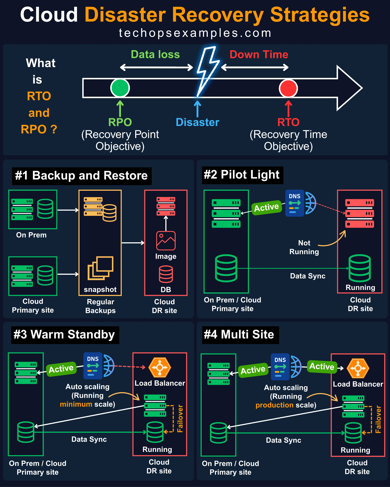
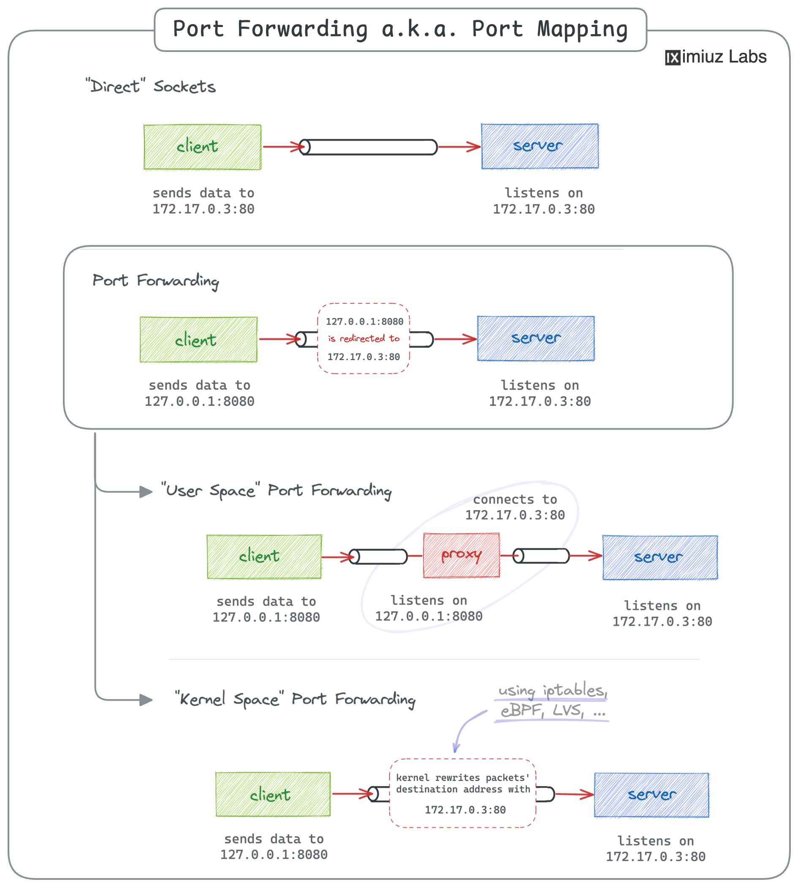
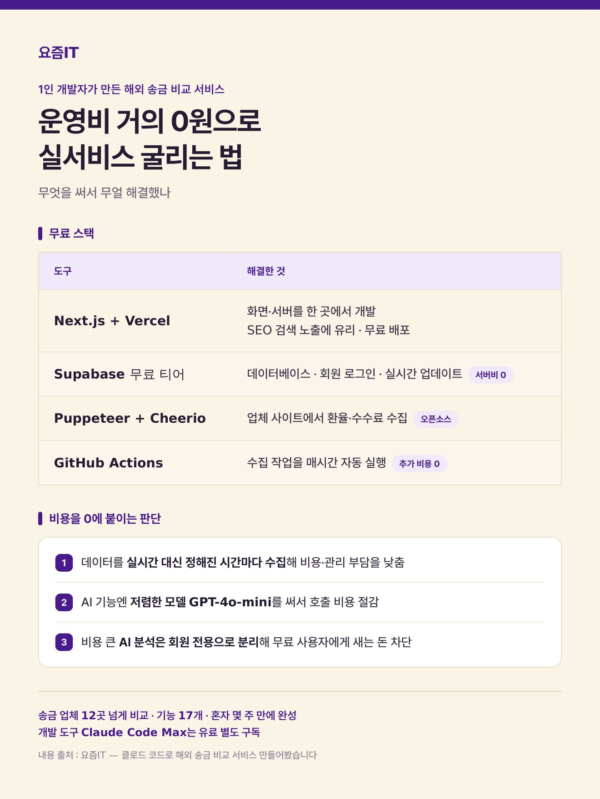

# Cloud

속성: Infra

<strong>Cloud Concepts</strong>

- Compute (VMs) - 🟢 Easy
- Storage (S3, Blob) - 🟢 Easy

- Databases (RDS, NoSQL) - 🟡 Medium
- IAM (Users, Roles) - 🟡 Medium
- Networking (VPC) - 🟡 Medium
- Load Balancing - 🟡 Medium
- DNS - 🟡 Medium

- Auto Scaling - 🟠 Medium
- Infrastructure as Code - 🟠 Medium
- Monitoring & Logging - 🟠 Medium
- CDN - 🟠 Medium
- Backup & Recovery - 🟠 Medium

- Cost Optimization - 🔴 Hard
- Security Best Practices - 🔴 Hard
- Multi-region Architecture - 🔴 Hard
- Disaster Recovery - 🔴 Hard
- High Availability Design - 🔴 Hard

---

<strong>클라우드 재해 복구 전략</strong>

모든 DR 전략은 다음을 확정짓는 것으로 시작합니다:  
𝟭. 𝗥𝗧𝗢 (𝗥𝗲𝗰𝗼𝘃𝗲𝗿𝘆 𝗧𝗶𝗺𝗲 𝗢𝗯𝗷𝗲𝗰𝘁𝗶𝘃𝗲):  
허용할 수 있는 다운타임은 얼마나 될까?

𝟮. 𝗥𝗣𝗢 (𝗥𝗲𝗰𝗼𝘃𝗲𝗿𝘆 𝗣𝗼𝗶𝗻𝘁 𝗢𝗯𝗷𝗲𝗰𝘁𝗶𝘃𝗲):  
허용할 수 있는 데이터 손실은 얼마나 될까?

재해 복구 전략:  
𝟭. 𝗕𝗮𝗰𝗸𝘂𝗽 𝗮𝗻𝗱 𝗥𝗲𝘀𝘁𝗼𝗿𝗲:  
재해 발생 시 복구를 위해 주기적으로 데이터와 시스템의 복사본을 생성하는 방식

전형적으로,  
𝘙𝘛𝘖: 몇 시간에서 며칠  
𝘙𝘗𝘖: 몇 시간에서 마지막 성공적인 백업까지 다양할 수 있음

𝟮. 𝗣𝗶𝗹𝗼𝘁 𝗟𝗶𝗴𝗵𝘁:  
재해 발생 시 인프라를 빠르게 확장하기 위해 필수 구성 요소를 대기 상태로 유지하는 방식

전형적으로,  
𝘙𝘛𝘖: 몇 분에서 몇 시간  
𝘙𝘗𝘖: 데이터 동기화 빈도

𝟯. 𝗪𝗮𝗿𝗺 𝗦𝘁𝗮𝗻𝗱𝗯𝘆:  
복구 중 다운타임을 최소화하기 위해 최신 데이터로 부분적으로 운영 가능한 환경을 준비하는 방식

전형적으로,  
𝘙𝘛𝘖: 몇 분에서 몇 시간  
𝘙𝘗𝘖: 지난 몇 분 또는 몇 시간 이내

𝟰. 𝗛𝗼𝘁 𝗦𝗶𝘁𝗲 / 𝗠𝘂𝗹𝘁𝗶 𝗦𝗶𝘁𝗲:  
기본 시스템과 병렬로 완전히 중복된 활성 프로덕션 환경을 운영하여 지속적인 비즈니스 운영을 보장하는 방식

전형적으로,  
𝘙𝘛𝘖: 거의 0 또는 몇 분  
𝘙𝘗𝘖: 매우 최소, 종종 지난 몇 초 이내

55K+가 제 DevOps와 클라우드 뉴스레터를 읽었습니다: [https://techopsexamples.com/subscribe](https://techopsexamples.com/subscribe)

'The Practical Linux Guide for DevOps Engineers'를 받으려면 구독하세요

다루는 내용:  
DevOps, Cloud, Kubernetes, IaC, GitOps, MLOps

---

<strong>클라우드 제공업체 학습 난이도</strong>

🟢 쉬움

- Railway
- Render
- Vercel

🟡 보통

- GCP
- Azure

🔴 어려움

- AWS

🔥 극한

- Bare metal + Kubernetes self-hosted

---

<strong>2026년에 쓸모없어지는 5가지 클라우드 인증</strong>

AI가 대신 통과해줄 수 있는 배지를 쫓는 걸 멈춰.

다음 10년을 버틸 수 있는 진짜 스킬을 배우기 시작해:

❌ Cloud Practitioner

❌ AZ-900

❌ Jenkins Engineer

❌ CEH

❌ 구문 기반 코딩 인증

대신 이걸 배워:

✅ IaC (Terraform)

✅ GitOps (ArgoCD)

✅ 시스템 디자인

✅ SRE 개념

✅ 클라우드 보안 (CKS/OSCP)

---

<strong>아직 AWS에서 무엇을 구축할지 과도하게 고민하고 계신가요?</strong>

- 정적 웹사이트 (S3 + CloudFront)
- EC2 앱 배포 (SSH + 설정)
- 서버리스 API (Lambda + API Gateway)
- 파일 업로드 시스템 (S3 + Lambda)
- 모니터링 알림 (CloudWatch + SNS)
- 자동 스케일링 앱 (ASG + ALB)
- RDS 백엔드 통합
- 보안 VPC 설정 (공용/비공용)
- CI/CD 파이프라인 (CodePipeline)
- 백업 시스템 (S3 + 라이프사이클)

---

<strong>AWS 실제로 사용하게 되는 것들</strong>

1. EC2 → 서버 실행 🖥️
2. S3 → 파일 저장 📦
3. RDS → 관리형 DB 🗄️
4. Lambda → 서버리스 컴퓨트 ⚡
5. VPC → 프라이빗 네트워크 🌐
6. IAM → 권한 🔐
7. CloudFront → 빠른 배포 🚀
8. API Gateway → API 노출 🔗
9. CloudWatch → 로그 & 메트릭 📊
10. SQS → 작업 큐 📬
11. SNS → 알림 🔔
12. EKS → Kubernetes ☸️
13. ECS → 컨테이너 🐳

---

<strong>팀들이 저지르는 25가지 인프라 실수</strong>

1. 백업 전략 없음.
2. 재해 복구 계획 없음.
3. 자원 과다 프로비저닝.
4. 자원 부족 프로비저닝.
5. 취약한 비밀 관리.
6. 수동 배포.
7. 프로덕션과 스테이징 간 패리티 없음.
8. 비용 가시성 무시.
9. 단일 실패 지점.
10. 부적절한 IAM 권한.
11. 오토스케일링 규칙 없음.
12. 모니터링 커버리지 없음.
13. 취약한 네트워크 세그먼테이션.
14. 인프라 as 코드 없음.
15. 패치되지 않은 시스템.
16. 롤백 계획 없음.
17. 부적절한 DNS 관리.
18. 에지에서 속도 제한 없음.
19. CDN 사용 무시.
20. 로드 테스트 없음.
21. 취약한 로그 보존 정책.
22. 공유된 프로덕션 자격 증명.
23. 용량 계획 없음.
24. 소유권 명확성 없음.
25. 인프라를 사후 생각으로 다룸.

---

<strong>포트 포워딩</strong>

포트 포워딩은 내가 거의 매일 의지하게 되는 그런 트릭 중 하나입니다. 예를 들어, 내 마지막 기능 - 로컬 머신에서 원격 쿠버네티스 클러스터에 접근하기 -에서는 끝까지 포트 포워딩이었습니다. 이 기술을 익히는 것을 강력히 추천합니다. 나중에 나에게 감사하게 될 겁니다.

- socat을 사용하여 포트 포워딩하기[https://labs.iximiuz.com/challenges/port-forwarding-using-socat](https://t.co/BMJ4tflgpL)
- netcat을 사용하여 포트 포워딩하기[https://labs.iximiuz.com/challenges/port-forwarding-using-netcat](https://t.co/ANRAQITrvP)
- 프록시 프로세스를 시작하지 않고 포트 포워딩하기
    
    
    

---

<strong>엔지니어가 알고 싶어 하는 AWS 서비스 5선</strong>

EC2 → 가상 서버 

S3 → 파일 저장

RDS → 관리형 DB

Lambda → 서버리스 실행

CloudWatch → 모니터링·로그 관리

AWS의 기본은 먼저 이 5가지.

---

<strong>엔지니어가 이해하고 싶은 클라우드 용어 5선</strong>

IaaS → 서버를 빌리다

PaaS → 앱 실행 환경을 빌리다

SaaS → 소프트웨어를 이용하다

리전 → 클라우드의 설치 지역

AZ → 장애 대책용 거점

ㄴAWS나 GCP를 다룬다면 처음에 익히고 싶은 것.

---

<strong>제 전체 2026 스택은 클라우드플레어에서 실행되며, 이를 위해 매달 5달러를 지불합니다</strong>

- workers (컴퓨트)
- d1 (sql db) + 더 나은 인증
- kv (캐시)
- r2 (객체 스토리지)
- queues (백그라운드 작업)
- hyperdrive (db 가속)
- email routing (발송)

---

<strong>사이드 프로젝트 운영비 때문에 접어본 적 있다면 이 조합을 참고하세요</strong>

혼자 만든 해외 송금 비교 서비스인데  
운영비가 도메인값 빼면 사실상 0원이라는 사람이 쓴 조합 구성

① Next.js + Vercel - 화면·서버를 한 프로젝트에서 → 무료 티어로 배포  
② Supabase 무료 티어 - DB·로그인·실시간 업데이트 → 서버비 0  
③ Puppeteer + Cheerio - 업체 사이트에서 환율·수수료 수집 → 오픈소스  
④ GitHub Actions - 그 수집을 매시간 자동 실행 → 추가 비용 0

- 유료로 돌아가는 건 AI 분석뿐이라 회원 전용으로 빼서 비용 새는 걸 막았다고 함
- 사용자가 폭증하면 무료 한도를 넘어갈 수 있지만, 저장해둘 만한 조합입니다

---

