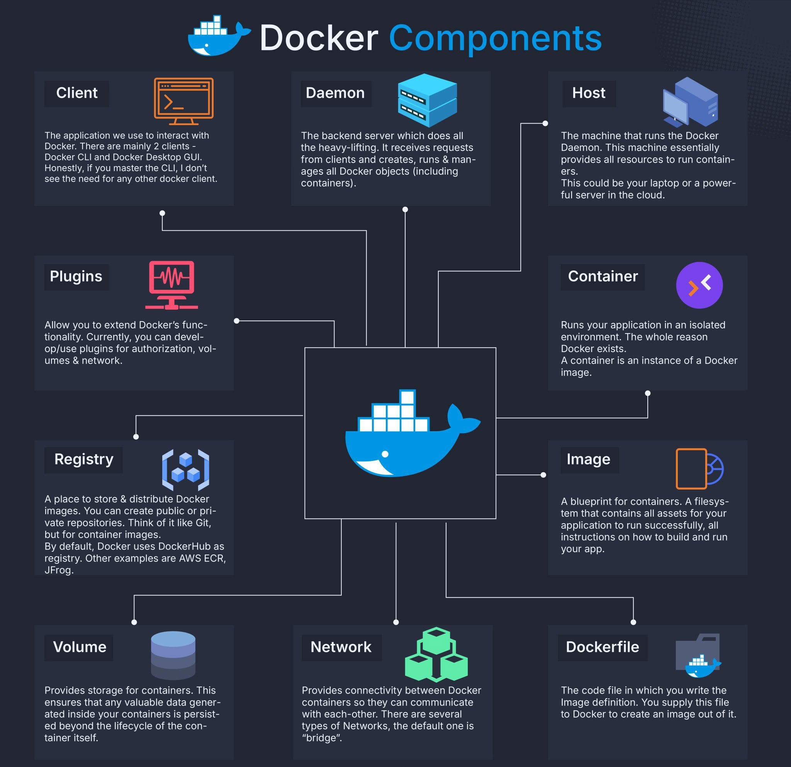
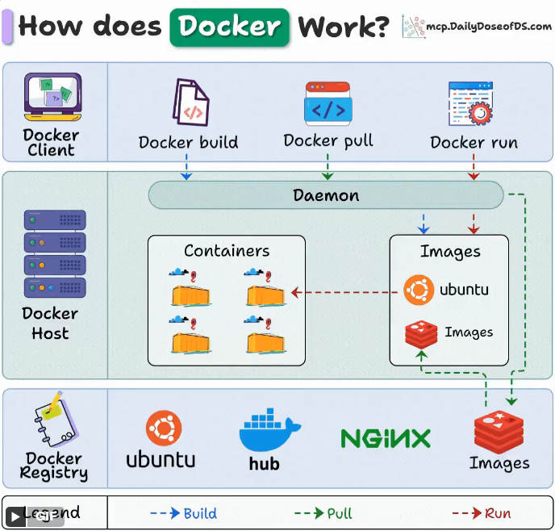
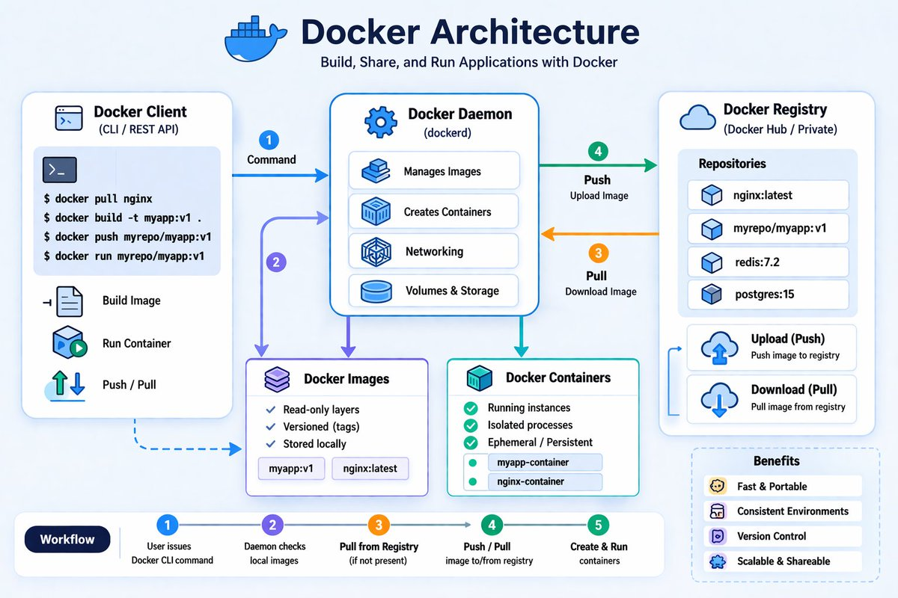
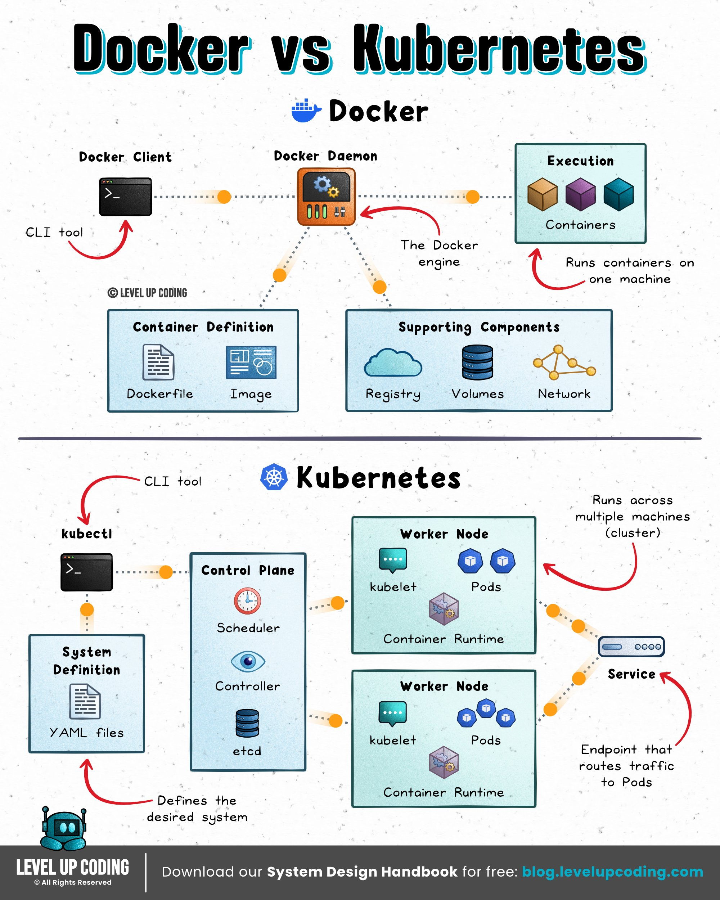
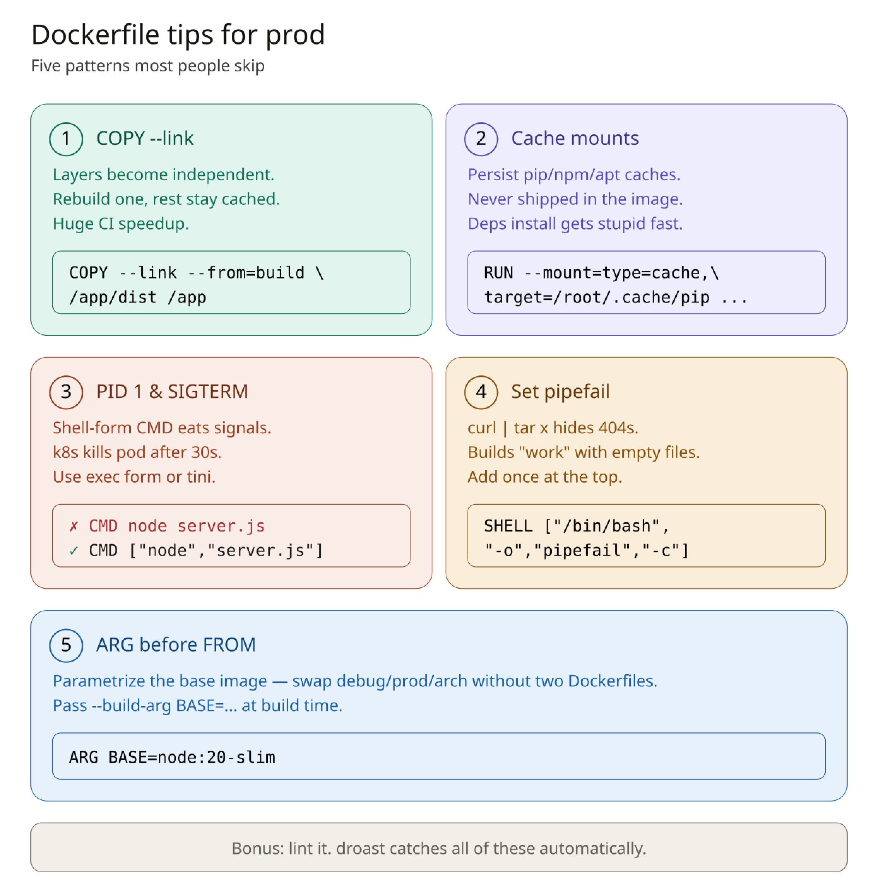
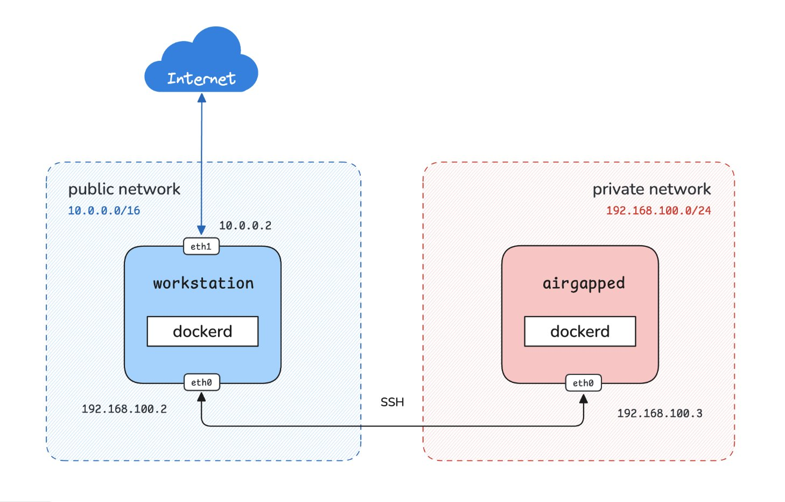
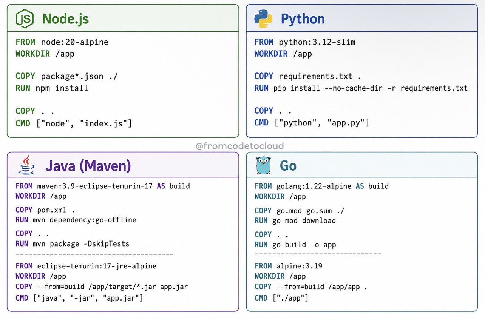
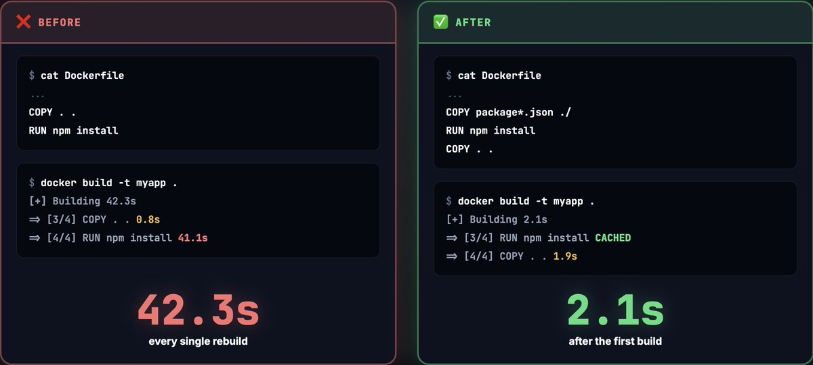
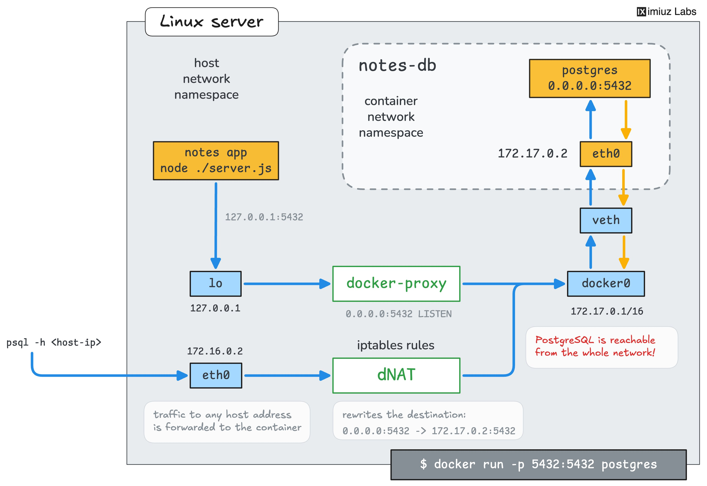

# Docker 🐳

속성: Infra


<details>
<summary><h3>Docker container security best practices</h3></summary>


Docker 컨테이너 보안 모범 사례

1⃣ No root access: Use --user. If someone breaks in, they won't have the keys to your whole server.

루트 액세스 금지: --user 옵션을 사용하세요. 누군가 침입하더라도 서버 전체에 대한 접근 권한을 얻지 못합니다.

2⃣ Avoid privileged mode: Never use --privileged unless you really have to. It gives the container way too much control.

특권 모드 사용 금지: 정말 필요한 경우가 아니면 --privileged 옵션을 절대 사용하지 마십시오. 컨테이너에 너무 많은 제어 권한을 부여하게 됩니다.

3⃣ Hide your ports: Only open the ones you actually need. Don't leave extra doors unlocked.

포트를 숨기세요: 실제로 필요한 포트만 여세요. 불필요한 문은 잠그지 않은 채로 두지 마세요.

4⃣ Set limits: Use --memory and --cpus so one container can't hog all your resources and crash the system.

제한 설정: 하나의 컨테이너가 모든 리소스를 독차지하여 시스템을 다운시키지 않도록 --memory 및 --cpus 옵션을 사용하십시오.

5⃣ Go read-only: Use --read-only. This stops hackers from changing your files or adding malicious scripts.

읽기 전용으로 설정: --read-only 옵션을 사용하십시오. 이렇게 하면 해커가 파일을 변경하거나 악성 스크립트를 추가하는 것을 방지할 수 있습니다.

6⃣ No easy upgrades: Use --security-opt=no-new-privileges so a process can't sneakily gain more power.

쉬운 업그레이드는 없습니다. 프로세스가 몰래 더 많은 권한을 얻지 못하도록 --security-opt=no-new-privileges를 사용하십시오.

Only give your container exactly what it needs to work. Nothing more.

컨테이너가 제대로 작동하는 데 필요한 것만 정확히 제공하세요. 그 이상은 주지 마세요.


</details>

---


<details>
<summary><h3>도커의 작동 원리</h3></summary>





</details>

---


<details>
<summary><h3>2분 만에 이해하는 Docker</h3></summary>


대부분의 개발자들은 Docker를 매일 사용하지만, 그 내부에서 무슨 일이 일어나는지 이해하지 못합니다. 여기서 알아야 할 모든 것을 알려드리겠습니다.

Docker는 3개의 주요 구성 요소를 가지고 있습니다:

1. Docker 클라이언트: API를 통해 Docker 데몬과 통신하는 명령어를 입력하는 곳입니다.
2. Docker 호스트: 데몬이 여기서 실행되며, 모든 무거운 작업(이미지 빌드, 컨테이너 실행, 자원 관리)을 처리합니다.
3. Docker 레지스트리: Docker 이미지를 저장합니다. Docker Hub는 공개적이지만, 회사들은 프라이빗 레지스트리를 운영합니다.

"docker run"을 실행할 때 무슨 일이 일어나는지 설명하겠습니다:

- Docker는 (로컬에 없으면) 레지스트리에서 이미지를 가져옵니다  
• Docker는 그 이미지로부터 새로운 컨테이너를 생성합니다  
• Docker는 컨테이너에 읽기-쓰기 파일 시스템을 할당합니다  
• Docker는 컨테이너를 연결하기 위한 네트워크 인터페이스를 생성합니다  
• Docker는 컨테이너를 시작합니다

그게 전부입니다.

클라이언트, 호스트, 레지스트리는 서로 다른 머신에 있을 수 있습니다. 이것이 Docker가 잘 확장되는 이유입니다.

이 아키텍처를 이해하면 컨테이너 문제 디버깅이 훨씬 쉬워집니다. 무언가 고장 날 때 정확히 어디를 봐야 할지 알게 될 것입니다.




</details>

---


<details>
<summary><h3>도커 아키텍처의 기초</h3></summary>


Docker Client -->  
여기서 docker build, docker pull, docker push, docker run 등의 명령어를 실행합니다.  
명령어를 실행할 때, 클라이언트는 Docker 데몬으로 REST API 호출을 보냅니다.

Docker Daemon (dockerd 또는 containerd) -->  
이미지를 빌드하고, 컨테이너를 생성하며, 이미지의 push&pull을 처리하고 네트워킹 및 스토리지 등을 관리하는 엔진입니다.

클라이언트로부터 REST API 호출을 받아 필요한 기능을 수행합니다.

Docker Images -->

컨테이너를 생성하는 데 사용되는 읽기 전용 템플릿입니다. 애플리케이션과 그 라이브러리 및 기타 필요한 구성 요소가 Docker 이미지로 패키징되어 컨테이너를 생성하는 데 사용됩니다.

Docker Containers -->

애플리케이션을 실행하는 이미지의 실행 인스턴스입니다.

Docker Registry -->  
Docker 이미지를 저장하는 원격 저장소(예: Artifactory registry/Nexus Registry/Docker Hub 등)입니다.

아래 다이어그램에서 흐름이 설명되어 있습니다.

1. 클라이언트에서 docker 명령어가 실행됩니다.  
docker build --> Dockerfile과 애플리케이션 코드 및 라이브러리 등을 사용하여 Docker 이미지를 빌드하기 위해.  
docker pull --> Docker Registry에서 Docker 이미지를 가져오기 위해  
docker push--> Docker 이미지를 Docker 레지스트리에 푸시하기 위해  
docker run --> 컨테이너를 생성하고 실행하기 위해.  
docker stop/start --> Docker 컨테이너를 각각 중지하고 시작하기 위해
2. 클라이언트가 데몬으로 REST API 요청을 보냅니다.
3. 데몬이 레지스트리에서 이미지를 가져옵니다(이미지가 없으면).
4. 데몬이 이미지( docker push 명령어를 실행한 경우)를 레지스트리에 푸시합니다.
5. 컨테이너가 생성되고 시작됩니다( docker run 명령어를 실행한 경우)




</details>

---


<details>
<summary><h3>가상화 vs 컨테이너화</h3></summary>


𝗩𝗶𝗿𝘁𝘂𝗮𝗹𝗶𝘇𝗮𝘁𝗶𝗼𝗻 (VMs)은 각 워크로드에 독립적인 전체 머신을 제공하며, 고유한 게스트 OS와 커널을 갖춥니다. 격리와 OS 유연성에 뛰어나지만, 각 워크로드마다 전체 운영 체제를 부팅하고 관리하는 비용을 지불해야 합니다.

𝗖𝗼𝗻𝘁𝗮𝗶𝗻𝗲𝗿𝗶𝘇𝗮𝘁𝗶𝗼𝗻은 공유 OS에서 격리된 프로세스로 워크로드를 실행합니다. 빠르고 효율적이지만, 격리가 약하고 보안 및 OS 호환성에 더 많은 제약이 따릅니다.

VMs은 강력한 경계와 완전한 환경을 제공합니다. 컨테이너는 속도와 효율적인 배포를 제공합니다.

VM을 사용해 본 적이 있다면, 고통의 원인이 VM 자체가 아니라 주변 요소임을 알 것입니다: 프로비저닝, 네트워킹, 노출, 지속성 등입니다.

여기서 exe[.]dev가 등장합니다.  
SSH를 통한 즉시 VM을 제공하며, 다음 기능을 갖추고 있습니다:

- 내장 HTTPS 노출  
• 지속적인 환경  
• 제로 클라우드 구성 오버헤드  
• 에이전트를 위한 안전한 샌드박스 실행 계층 (Integrations를 통한 보안 자격 증명 주입 포함)

인프라를 이렇게 빠르게 시작할 수 있다면, 망설이지 않고 테스트를 시작하게 됩니다.




</details>

---


<details>
<summary><h3>Dockerfile 명령어 순서 및 의미</h3></summary>


1. FROM → 기본 이미지 (첫 번째 줄)
2. LABEL → 메타데이터 (작성자, 버전)
3. ARG → 빌드 시점 변수
4. ENV → 이미지 내부 환경 변수
5. WORKDIR → 작업 디렉토리
6. COPY / ADD → 소스/아티팩트 복사
7. RUN → 패키지 설치, 빌드 및 정리
8. EXPOSE → 컨테이너 포트 문서화 (선택 사항)
9. VOLUME → 영구 저장소 (필요한 경우)
10. USER → 비루트로 전환
11. HEALTHCHECK → 헬스체크 정의
12. ENTRYPOINT / CMD → 실행할 명령어


</details>

---


<details>
<summary><h3>생산 환경에서 당신의 베이컨을 구해줄 Dockerfile 팁들</h3></summary>


1 - 가능한 한 COPY --link 사용하세요.  
이렇게 하면 레이어가 독립적이 됩니다 — 한 스테이지를 다시 빌드해도 나머지는 여전히 캐시를 히트합니다. CI 시간에 절대적인 게임 체인저예요. 아무도 이 얘기를 안 하죠

2 - BuildKit 캐시 마운트  
RUN --mount=type=cache,target=/root/.cache/pip pip install -r requirements.txt  
— 의존성 캐시는 빌드 간에 살아남지만 이미지에는 절대 포함되지 않습니다. node_modules/apt/pip 설치가 터무니없이 빨라집니다

3 - PID 1이 당신의 하루를 망칠 겁니다. CMD가 셸 스크립트를 실행한다면, SIGTERM이 먹히지 않고 k8s가 30초 유예 기간 후에 당신의 파드를 죽입니다.   
exec 형식 사용하거나   
CMD ["node", "server.js"]  
아니면 "tini"를 거기에 붙이세요. 이건 고통스러운 방법으로 배웠어요

4 - 맨 위에 SHELL ["/bin/bash", "-o", "pipefail", "-c"]  
pipefail 없이  
RUN curl ... | tar x  
curl이 404를 반환해도 조용히 성공합니다. 아무것도 없는 "작동하는" 이미지를 빌드하게 될 거예요

5 - FROM 전에 ARG를 두면 베이스 이미지를 파라미터화할 수 있습니다 —   
ARG BASE=node:20-slim  
그리고 FROM $BASE

디버그/프로덕션 베이스를 두 개의 Dockerfile을 유지하지 않고 교체하는 데 최고예요.




</details>

---


<details>
<summary><h3>도커 사실</h3></summary>


:latest는 가장 최근에 빌드된 이미지를 의미하지 않습니다.

푸시할 때 :latest로 태그된 이미지를 의미합니다.

누군가 :latest로 태그하지 않고 v2.0을 푸시하면,  
:latest는 여전히 이전 버전입니다.

docker pull myapp:latest  
→ 마지막으로 :latest로 태그된 것을 가져옵니다  
→ 반드시 존재하는 가장 최신 버전은 아닙니다

이것이 이미지 태그를 고정하는 것이 중요한 이유입니다.  
myapp:abc123  (git SHA)  
myapp:v2.1.0  (semver)

쿠버네티스 매니페스트에서 :latest를 절대 사용하지 마세요. 절대요.


</details>

---


<details>
<summary><h3>도커 실습: 컨테이너 이미지를 에어갭 환경으로 전송하기</h3></summary>


팀에서 온프레미스 서버에 새로운 애플리케이션 스택을 배포할 준비를 하고 있지만, 해당 서버는 공용 인터넷과 완전히 격리되어 있습니다 - 외부 네트워크나 컨테이너 레지스트리에 대한 경로가 전혀 없는 강화된 에어갭 환경입니다.

필요한 컨테이너 이미지를 에어갭 서버로 전송할 방법을 찾을 수 있나요?




</details>

---


<details>
<summary><h3>Docker Android 에뮬레이터</h3></summary>


docker-android라는 이름입니다. 하나의 Docker 명령어만으로 ADB 포트 포워딩, KVM, GPU 가속을 지원하는 완전한 Android 기기를 실행할 수 있습니다. 완전히 헤드리스이며 CI 준비가 완료되어 있습니다.

100% 오픈소스.https://github.com/HQarroum/docker-android/


</details>

---


<details>
<summary><h3>도커 빌드 크기를 ~99.8% 줄이기</h3></summary>


 (1.87 GB → 2.5 MB)

[https://github.com/Kikobeats/untracked](https://t.co/3t0TQ3aP9Q)

사용하기만 하면 돼요


</details>

---


<details>
<summary><h3>애플이 공식 네이티브 “Docker” 출시</h3></summary>


macOS에서 가벼운 가상 머신을 통해 리눅스 컨테이너를 실행할 수 있게 해줍니다.

✓ Docker Hub의 OCI 이미지와 호환  
✓ Apple Silicon에 최적화  
✓ Swift로 작성

[https://github.com/apple/container](https://github.com/apple/container)


</details>

---


<details>
<summary><h3>Docker 인터뷰에서 이 말을 하면 즉시 더 경험이 많아 보일 거예요:</h3></summary>


기억해야 할 것은 모두 이것뿐이에요:

먼저 전체 코드베이스를 복사하지 마세요.

대신:

- 의존성 파일 복사
- 의존성 설치
- 애플리케이션 코드 복사
- 앱 빌드

코드가 아니라 의존성을 캐시하세요.




</details>

---


<details>
<summary><h3>초보자들의 Dockerfile에서 흔히 보이는 Docker 실수</h3></summary>


```
COPY . .
RUN npm install
```

이렇게 해야 함:

```
COPY package*.json ./
RUN npm install
COPY . .
```

왜 중요한가?

- Docker는 각 명령어를 독립적인 레이어로 캐싱함.
- 소스 코드는 매 커밋마다 변경됨.
- 그래서 COPY . . 이 캐시를 깨뜨리고, 그 뒤의 모든 명령어(포함 npm install)가 매 빌드마다 처음부터 다시 실행됨.
- 순서를 바꾸면 코드가 변경되어도 install 레이어만 package.json에 의존하므로 캐시가 유지됨.

한 줄만 바꿈. 매 리빌드에서 40초 이상 절약. 코드가 아니라 의존성을 캐싱하세요.




</details>

---


<details>
<summary><h3>Docker Compose가 마침내 init 컨테이너에 대한 네이티브 지원을 출시했습니다.</h3></summary>


예를 들어 DB 마이그레이션이나 유사한 일회성 작업을 실행하는 경우입니다.

k8s와 다소 유사하게, 이들은 서비스 컨테이너가 시작되기 전에 성공적으로 종료되어야 하는 일시적인 컨테이너입니다. Compose 파일에서 pre_start 훅으로 정의됩니다.

몇 달 전에 Uncloud를 위해 pre_deploy 훅으로 설계된 매우 유사한 기능을 출시했습니다.

근본적인 차이는 없고, 몇 가지 매개변수만 다릅니다. 하지만 Uncloud는 "deploy"가 별도의 일류 작업인 멀티 호스트 오케스트레이터이므로 pre_deploy라는 이름이 서비스 롤아웃이 시작되기 전에 무언가를 실행하려는 의도를 더 명확하게 설명한다고 믿습니다.

결국 우리는 새로운 pre_start 사양을 채택할 수도 있습니다. 예를 들어, 서비스 배포당 한 번뿐만 아니라 모든 서비스 복제본을 시작하기 전에 실행되는 컨테이너 수명 주기 훅을 지정하기 위해요.


</details>

---


<details>
<summary><h3>7가지 알아야 할 Docker 보안 명령어 🐳</h3></summary>


1️⃣ docker inspect → 컨테이너가 어떻게 구성되었는지 정확히 확인하세요. 권한, 기능, 마운트, 사용자 및 네트워킹을 포함합니다.

2️⃣ docker history → 이미지의 모든 레이어를 검사하여 하드코딩된 비밀, 불필요한 패키지 및 위험한 빌드 단계를 찾아내세요.

3️⃣ --cap-drop ALL → 기본적으로 모든 Linux 기능을 제거하고, 애플리케이션이 실제로 필요로 하는 것만 다시 부여하세요.

4️⃣ --security-opt no-new-privileges → 컨테이너 내부에서 권한 상승을 방지하세요. 프로세스가 setuid 바이너리를 실행하더라도요.

5️⃣ docker events → 컨테이너 생명 주기 이벤트를 실시간으로 모니터링하고, 예상치 못한 exec 세션이나 재시작을 감지하세요.

6️⃣ --log-driver syslog → 컨테이너 로그를 중앙 로깅 시스템으로 전달하여, 컨테이너가 삭제된 후에도 로그가 남도록 하세요.

7️⃣ docker scout cves → 알려진 취약점을 위해 이미지를 스캔하고, 중요한 CVE가 프로덕션에 도달하기 전에 CI/CD 파이프라인을 실패시키세요.

이 명령어들은 다음 보안 사고로부터 당신을 구할 수 있습니다.


</details>

---


<details>
<summary><h3>Docker의 기본 포트 퍼블리싱 동작은 편리하지만 보안에 취약합니다:</h3></summary>


`docker run -p 5432:5432`는 호스트의 모든 인터페이스에서 포트 5432를 열어 호스트 네트워크의 모든 머신이 접근할 수 있게 만듭니다.

재미있는 점은 모든 포트를 차단하는 호스트 수준 방화벽(예: ufw)이 이 동작으로부터 항상 보호하지 못할 수 있다는 것입니다. 왜냐하면 많은 Linux 배포판에서 Docker의 포트 퍼블리싱 규칙이 더 높은 우선순위를 가지기 때문입니다.

따라서 daemon.json에서 기본값을 변경하거나 -p|--publish 플래그의 전체 형태를 사용하여 포트를 명시적으로 일부 호스트 인터페이스(예: localhost)에만 퍼블리싱하세요:

-p <host-ip>:<host-port>:<container-port>



Docker 포트 공개는 방화벽보다 바인딩 주소부터 점검해야 합니다.  
✓ -p 127.0.0.1:5432로 제한 ✓ 외부 노출 시 방화벽·보안그룹 확인  
✓ 컨테이너 네트워크도 분리


</details>

---


<details>
<summary><h3>수년 동안 Docker 설정에서 Nginx를 사용했어요.</h3></summary>


잘 작동했지만, 새로운 서비스를 추가할 때마다 설정 파일을 수정하고 Nginx를 다시 로드하며 SSL을 수동으로 처리해야 했죠.  
점점 짜증이 나더라고요.

그러다 Traefik을 써보게 됐는데, 솔직히 말해서 삶이 훨씬 편해졌어요. docker-compose.yml 안에 라벨로 바로 라우트를 정의할 수 있고, Traefik이 자동으로 감지해 주거든요. 수동 설정도 없고, 재시작도 필요 없어요. Let’s Encrypt으로 SSL도 자동 처리돼요.

게다가 멋진 대시보드가 있고, 스케일링도 엄청 간단해요.

Nginx 파일을 서비스 추가할 때마다 수정하느라 지쳤다면, Traefik을 한 번 써보세요. 제 설정이 더 깔끔해지고 거의 유지보수가 필요 없어졌어요.
</details>

---

