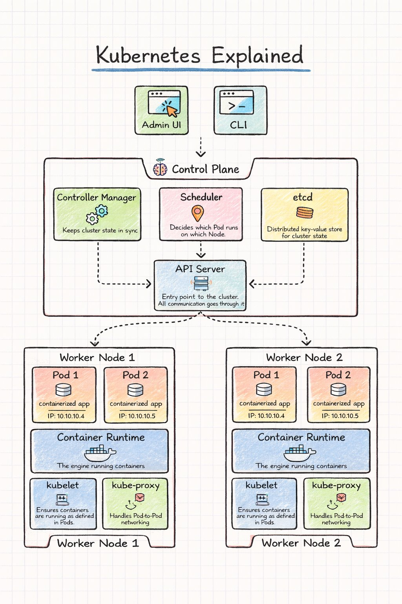
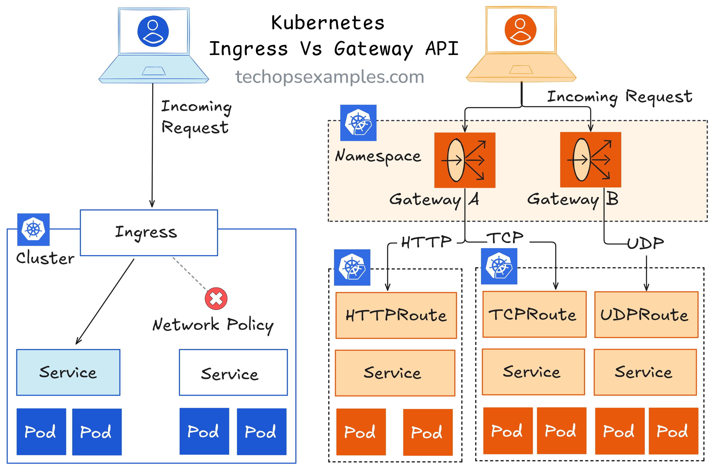
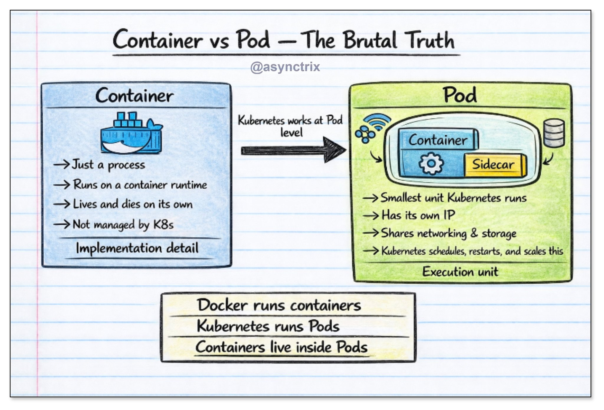
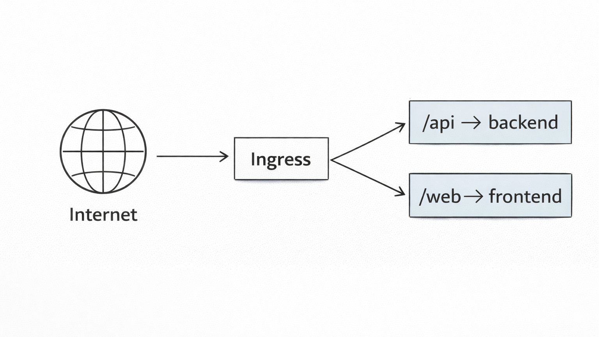
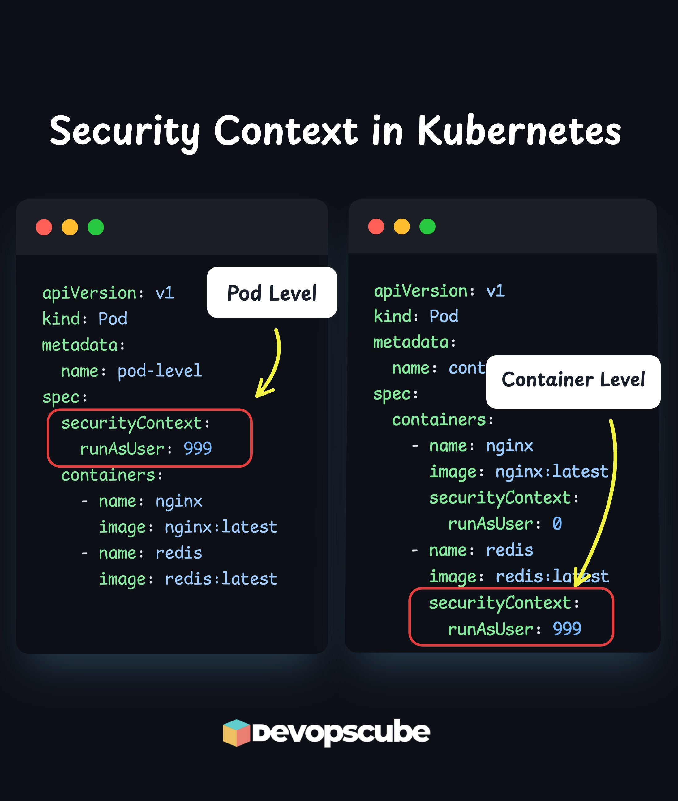
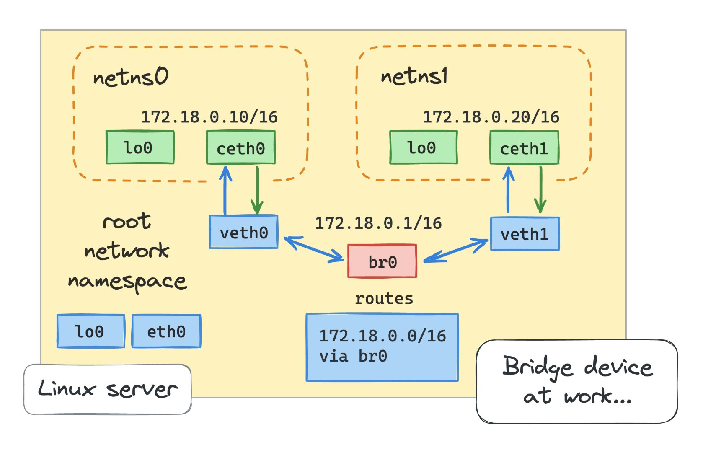
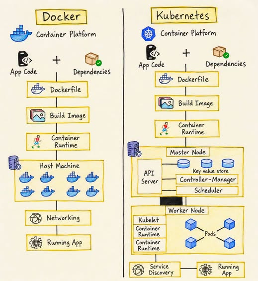
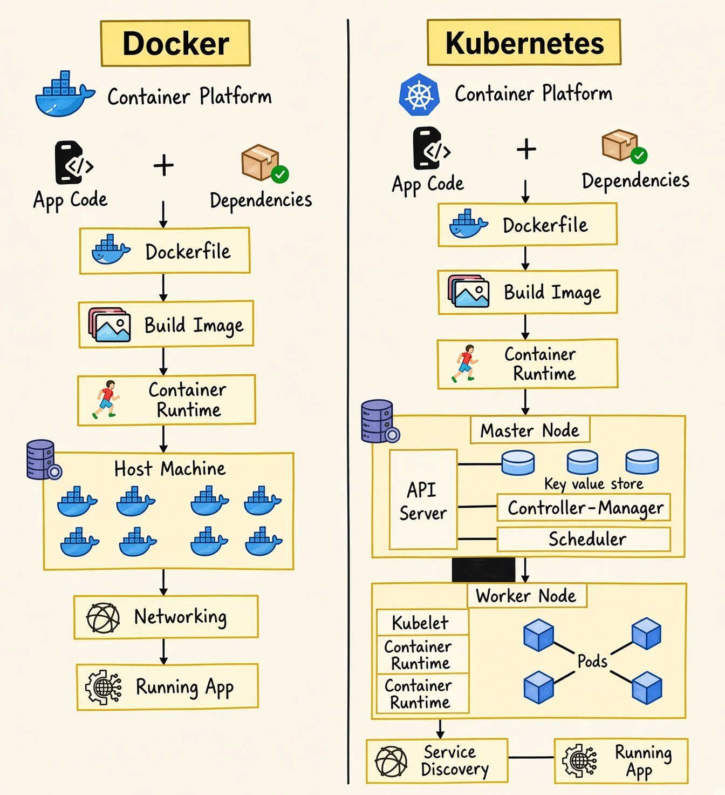

# Kubernetes

속성: Infra

<h3>☸️ Kubernetes Concepts - Difficulty Breakdown 🔥</h3>

- Pods - 🟢 Easy
- Deployments - 🟢 Easy
- ReplicaSets - 🟢 Easy

- Services - 🟡 Medium
- ConfigMaps / Secrets - 🟡 Medium
- Namespaces - 🟡 Medium
- Labels / Selectors - 🟡 Medium

- Ingress - 🟠 Medium
- Volumes / PVC - 🟠 Medium
- RBAC - 🟠 Medium
- Helm - 🟠 Medium
- StatefulSets - 🟠 Medium
- DaemonSets - 🟠 Medium

- Networking (CNI) - 🔴 Hard
- Scheduling & Affinity - 🔴 Hard
- Security Policies - 🔴 Hard
- Autoscaling (HPA/VPA) - 🔴 Hard
- CRDs / Operators - 🔴 Hard
- Troubleshooting - 🔴 Hard

---

---

<h3>Kubernetes Simplified</h3>

### 🧠 Control Plane

API Server

- Entry point of the Kubernetes cluster
- All commands and requests go through it
- Communicates with all components

Scheduler

- Watches for new Pods
- Chooses the best worker node
- Assigns Pods to nodes

Controller Manager

- Keeps cluster in the desired state
- Detects failures
- Recreates Pods if needed

etcd

- Distributed key-value database
- Stores cluster configuration
- Stores cluster state

### 🖥 Worker Nodes

Pods

- Smallest deployable unit
- Runs one or more containers
- Each Pod gets its own IP

Container Runtime

- Runs containers on the node
- Pulls container images
- Manages container lifecycle

kubelet

- Agent running on each node
- Communicates with the API Server
- Ensures containers run as expected

kube-proxy

- Handles network routing
- Enables Pod-to-Pod communication
- Manages service traffic

---

---

<h3>쿠버네티스는 아름답습니다.</h3>

모든 개념에는 이야기가 담겨 있습니다. 다만 당신이 아직 모를 뿐이죠.

Kubernetes에서는 앱을 파드(Pod)로 실행합니다. 파드는 컨테이너를 실행하는데, 충돌이 발생하면 아무도 다시 시작하지 않습니다. 그냥 사라져 버립니다.

그래서 Deployment를 사용하면 됩니다. Pod 하나가 종료되면 다른 Pod가 다시 시작됩니다. 3개의 Pod를 실행하고 싶으면 3개가 계속 실행된 상태로 유지됩니다.

각 파드는 재시작할 때마다 새로운 IP 주소를 할당받습니다. 다른 서비스가 앱과 통신해야 하는데 IP 주소가 계속 변경됩니다. 대규모 환경에서는 IP 주소를 하드코딩할 수 없습니다.

그러니까 서비스를 사용하는 거죠. 고정된 IP 주소 하나를 사용해서 IP 주소가 아닌 레이블을 통해 항상 파드를 찾아냅니다. 파드가 죽었다가 다시 살아나도 서비스는 신경 쓰지 않아요.

하지만 이제 서비스가 10개, 로드 밸런서도 10개나 있습니다. 클라우드 요금은 그중 6개가 거의 트래픽을 처리하지 않는다는 사실을 고려하지 않습니다.

그래서 Ingress를 사용하는 거죠. 로드 밸런서 하나에 모든 서비스를 연결하고 스마트 라우팅을 활용하는 겁니다. 하지만 Ingress는 단순히 규칙일 뿐이고, 실제로 그 규칙을 실행하는 사람은 아무도 없습니다.

그래서 인그레스 컨트롤러를 추가합니다. Nginx, Traefik, AWS 로드 밸런서 컨트롤러 같은 것들이죠. 이제야 규칙이 제대로 작동합니다.

앱에 설정이 필요해서 컨테이너 내부에 하드코딩했습니다. 스테이징 환경에 잘못된 데이터베이스가 있습니다. 프로덕션 환경에 잘못된 API 키가 있습니다. 설정이 변경될 때마다 이미지를 다시 빌드합니다.

그래서 ConfigMap을 사용하는 겁니다. 설정은 컨테이너 외부에 저장되고 런타임에 주입됩니다. 동일한 이미지가 개발, 스테이징, 프로덕션 환경에서 각각 다른 설정으로 실행됩니다.

하지만 이제 데이터베이스 비밀번호가 암호화되지 않은 상태로 ConfigMap에 저장되어 있습니다. kubectl에 대한 기본 접근 권한만 있으면 누구나 비밀번호를 읽을 수 있습니다. 이는 단순한 실수가 아니라 보안 사고입니다.

그래서 비밀 키를 사용하는 겁니다. 민감한 데이터는 별도의 접근 제어 기능을 통해 안전하게 저장됩니다. 사용자의 이미지는 이 데이터를 절대 볼 수 없습니다.

어떤 날은 사용자가 100명일 수도 있고, 어떤 날은 10,000명에 달할 수도 있습니다. 사용자가 급증할 때 수동으로 파드를 8개로 확장하고 나면, 그 파드들이 밤새도록 유휴 상태로 있는 것을 지켜볼 수밖에 없습니다. 클러스터를 영원히 관리할 수는 없으니까요.

HPA를 사용하면 CPU 사용률이 70%를 넘으면 Pod가 자동으로 추가됩니다. 트래픽이 감소하면 Pod는 축소됩니다 down. 더 이상 새벽 2시에 깨지 않아도 됩니다.

하지만 이제 노드가 가득 차서 새 파드가 대기 상태에 있습니다. HPA가 제 역할을 다한 것입니다. 클러스터에 파드를 배치할 공간이 없었던 것입니다.

Karpenter를 사용하면 Pod가 대기 상태에 머무르는 동안 새 노드가 자동으로 생성됩니다. 부하가 줄어들면 해당 노드는 제거됩니다. 실제로 사용한 만큼만 비용을 지불하면 됩니다.

하나의 파드가 4GB의 메모리를 마구 소비하기 시작했는데, 쿠버네티스에는 그렇게 하면 안 된다는 설정이 없었습니다. 그 결과 해당 노드의 다른 모든 파드가 메모리 부족으로 제대로 작동하지 못하게 되고, 연쇄 반응이 일어나 결국 메모리 사용량 제한이 없는 하나의 파드가 주변의 모든 파드를 다운시켜 버립니다.

리소스 요청과 제한을 사용합니다. 요청은 Kubernetes에게 Pod가 스케줄링되는 데 필요한 최소 리소스를 알려줍니다. 제한은 어떤 Pod도 주변의 다른 Pod의 리소스를 독점하지 못하도록 합니다. 이렇게 하면 클러스터가 예측 가능하게 실행됩니다.

---

---

<h3>☸️ Don’t Overthink Kubernetes</h3>

- Pods + Deployments → run applications
- Services + Ingress → expose them
- ConfigMaps + Secrets → configuration
- Namespaces → isolation
- Helm → packaging
- HPA + Resource Requests → scaling
- RBAC → security
- ArgoCD → GitOps

---

---

---

<h3>Pod vs Container - 잔인한 진실🔥</h3>

컨테이너는 쿠버네티스가 실행하는 것이 아닙니다.

쿠버네티스는 Pod를 실행합니다.

그 혼란이 많은 고통을 초래합니다.

[ Container - Docker World ]  
→ 단지 하나의 프로세스  
→ 독립적으로 살아가고 죽습니다  
→ 쿠버네티스에서 고유한 ID가 없습니다  
→ 쿠버네티스는 컨테이너를 직접 관리하지 않습니다

컨테이너는 구현 세부 사항입니다.

[ Pod - Kubernetes World ]  
→ 쿠버네티스에서 가장 작은 배포 단위  
→ 하나 이상의 컨테이너를 감쌉니다  
→ 고유한 IP를 가집니다  
→ 네트워킹과 스토리지를 공유합니다  
→ 쿠버네티스가 스케줄링하고, 재시작하고, 확장하는 대상입니다

Pod는 실행 단위입니다.

[ How to Think About It ]  
→ Docker는 컨테이너를 실행합니다  
→ Kubernetes는 Pod를 실행합니다  
→ 컨테이너는 Pod 안에 삽니다

컨테이너 중심으로 생각하면 쿠버네티스가 혼란스럽게 느껴집니다.  
Pod 중심으로 생각하면 모든 것이 맞춰지기 시작합니다.

👉 Kubernetes는 당신의 컨테이너에 신경 쓰지 않습니다.  
👉 주변의 Pod에 신경 씁니다.

이것이 이해되면,  
배포(Deployments), 스케일링, 그리고 셀프 힐링이 마침내 이해가 됩니다.

---

---

<h3>☸️ 2026년의 쿠버네티스 현실 🔥</h3>

가장 “고급”인 것들?

여전히 기본으로 돌아간다.

문제가 생기면, 80%의 경우는 이런 것들 중 하나다:

→ 파드 실행 안 됨 (이벤트 확인)

→ 앱 건강하지 않음 (로그 + 준비 상태)

→ 서비스 선택자 불일치

→ 인그레스 / DNS 해결 안 됨

→ 네트워크 정책 차단

AI는 초 단위로 YAML을 뱉어낸다.

하지만 흐름을 모르면,

복붙하고 빌어만 볼 뿐이다.

스택을 따라가라.

레이어별로.

2026년에 여전히 자주 겪는 쿠버네티스 문제는 뭐야? 👇

---

---

<h3>Kubernetes Ingress란 무엇인가?</h3>

Kubernetes 네트워킹이 혼란스럽다면…이게 바로 당신이 놓치고 있는 부분일 가능성이 큽니다.

이렇게 생각해보세요:  
Pod        = 당신의 앱  
Service = 내부 접근  
Ingress = 인터넷으로의 정문.

Ingress 없이:  
앱을 노출하는 방법 -  
NodePort [지저분한 포트들]  
LoadBalancer [비싸고 + 서비스당 하나씩]

Ingress와 함께:  
✅ 하나의 진입점  
✅ 스마트 라우팅 (URL/경로 기반)  
✅ 더 깔끔한 아키텍처

예시:  
/api → 백엔드 서비스

/web → 프론트엔드 서비스

단일 도메인. 다중 서비스.

Ingress는 마법이 아닙니다. 클러스터를 위한 트래픽 매니저일 뿐입니다.

---

---

<h3>Kubernetes SecurityContext</h3>

Kubernetes 보안에서 가장 중요하지만 가장 무시되는 부분 중 하나입니다.

Pod와 Container 수준에서 작동합니다.

🔵  Pod 수준 --> 모든 컨테이너에 대한 기본값

🟢 Container 수준 --> 각 컨테이너에 대한 사용자 지정 설정 (Pod 수준을 재정의)

우리는 다음을 다루는 실용적인 가이드를 만들었습니다.

- 비루트(non-root)로 컨테이너를 실행하는 이유가 중요한 이유
- Pod에 할당되는 기본 UID
- Pod vs Container SecurityContext (예시 포함)
- Kubernetes가 비루트 사용자가 있는/없는 컨테이너 이미지를 다루는 방법.

𝗥𝗲𝗮𝗱 𝗶𝘁 𝗛𝗲𝗿𝗲: [https://newsletter.devopscube.com/p/secure-kubernetes-pods-with-securitycontext](https://newsletter.devopscube.com/p/secure-kubernetes-pods-with-securitycontext)

비루트 컨테이너를 강제하는 당신의 접근 방식은 무엇인가요?

- SecurityContext만?
- Admission controllers?
- Kyverno나 OPA 같은 도구?

---

---

<h3>쿠버네티스 다이어그램을 자동으로 생성해주는 멋진 무료 도구</h3>

KubeDiagrams는 매니페스트, Helm 차트, 심지어 라이브 클러스터까지 초 단위로 깔끔한 아키텍처 다이어그램으로 바꿔줘요.

→ YAML, Helm, Helmfile, Kustomize에서 다이어그램 생성  
→ 라이브 클러스터 상태 시각화 가능  
→ 커스텀 리소스 지원  
→ PNG, SVG, PDF, draw.io로 내보내기  
→ 무료 오픈 소스

문서화, 온보딩, 클러스터 아키텍처 빠르게 이해하는 데 정말 유용해요.

Repo: 쿠버네티스 다이어그램https://github.com/philippemerle/KubeDiagrams

---

---

<h3>컨테이너 네트워킹의 작동 원리</h3>

Docker와 Kubernetes 네트워킹은 마법처럼 느껴질 수 있습니다. 하지만 조각들이 맞물리게 하는 입증된 방법이 있습니다: 처음부터 다시 구축하는 것입니다.

이 튜토리얼에서 저는 단일 네트워크 네임스페이스부터 시작해서, veth 쌍을 통해 호스트에 연결한 다음, 두 번째 컨테이너를 시뮬레이션하기 위해 또 다른 네임스페이스를 추가하고, 마지막으로 Linux 브리지를 사용해 N개의 컨테이너를 단일 L2 세그먼트로 상호 연결하는 방법을 보여줍니다. 모두 표준 Linux 도구만 사용합니다: ip netns, veth 쌍, 브리지, 그리고 NAT와 포트 퍼블리싱을 위한 약간의 iptables.

쉽지 않은 여정이 될 테지만, 이를 통과하면 컨테이너 네트워킹 문제는 더 이상 무섭게 보이지 않을 것입니다 - 튜토리얼에서 얻은 지식을 바탕으로 기존 시스템을 디버깅하고 새로운 시스템을 설계하는 데 대한 정신적 모델을 갖게 될 테니까요

---

---

<h3>2026년 쿠버네티스 인터뷰의 90%는 이 7가지 포인트로 귀결됩니다</h3>

1. Pods vs Deployments vs StatefulSets: 안정적인 ID/스토리지가 필요한 경우 vs 교체 가능한 복제본.
2. Services와 Ingress: 트래픽이 포드에 도달하는 방법, 게다가 L4 vs L7 그리고 TLS 종료 지점.
3. Requests/limits와 HPA: 스케줄링 vs 스로틀링 vs OOMKilled, 그리고 부하 시 메트릭이 왜 거짓말하는지.
4. Probes: readiness vs liveness vs startup, 그리고 잘못된 프로브가 어떻게 플래핑과 장애를 일으키는지.
5. Volumes와 storage classes: PVC 라이프사이클, 액세스 모드, 그리고 상태가 왜 어려운 부분인지.
6. RBAC와 service accounts: 최소 권한, 네임스페이스 경계, 그리고 흔한 권한 상승 함정.
7. 디버깅 흐름: kubectl describe/logs/events, 기본을 위한 exec, 그리고 노드/네트워크/DNS/CNI 문제로 넘어가는 시점.

---

---

<h3>Kubernetes를 쉽게 풀어서 설명</h3>

- Pod → 가장 작은 실행 앱 단위
- Deployment → 앱이 항상 실행되도록 유지
- Service → Pod에 안정적인 접근 제공
- Ingress → 외부 트래픽을 앱으로 라우팅
- Namespace → 팀/환경을 분리
- ConfigMap → 앱 설정 저장소
- Secret → 민감한 데이터를 안전하게 저장
- Volume → 컨테이너를 위한 영구 저장소
- Node → 워크로드를 실행하는 머신
- Cluster → 함께 관리되는 노드 그룹
- kube-apiserver → Kubernetes의 두뇌 진입점
- Scheduler → Pod가 어디서 실행될지 결정
- kubelet → 모든 노드의 작업자 에이전트
- ReplicaSet → 원하는 Pod 수 유지
- HPA → 부하에 따라 앱 자동 스케일링
- DaemonSet → 모든 노드에 하나의 Pod 실행

---

---

<h3>Docker vs Kubernetes: 차이점은 무엇일까? 🐳☸️</h3>

Docker는 애플리케이션을 컨테이너로 패키징합니다. Kubernetes는 그 컨테이너들을 가져와 여러 대의 머신에 걸쳐 배포, 스케일링, 네트워킹, 그리고 높은 가용성을 자동화합니다.

이렇게 생각해 보세요:  
🐳 Docker = 컨테이너 빌드 및 실행.  
☸️ Kubernetes = 대규모 컨테이너 관리.

다음 DevOps 인터뷰를 위해 이 손으로 쓴 치트 시트를 저장하세요

---

---

<h3>Docker vs Kubernetes: Which one is better?</h3>

---

