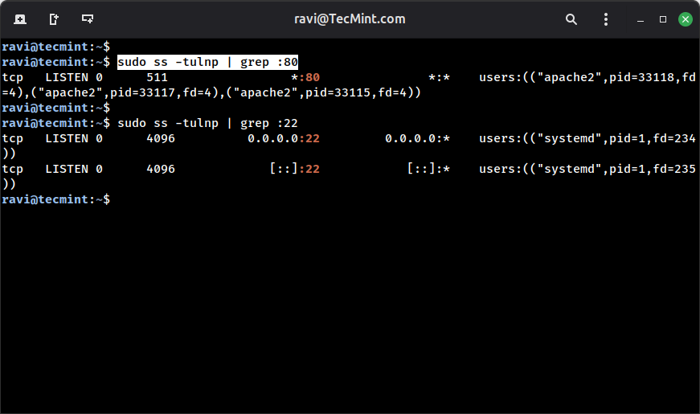
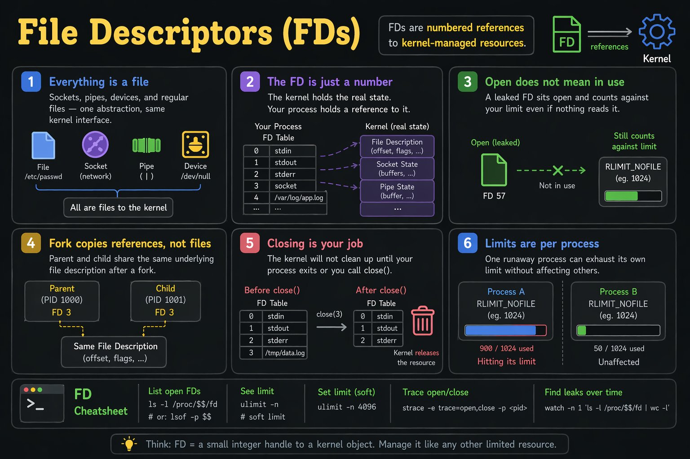
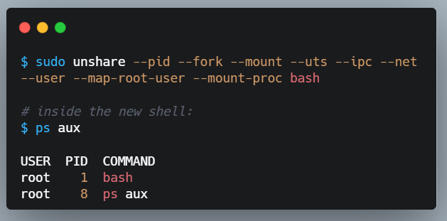
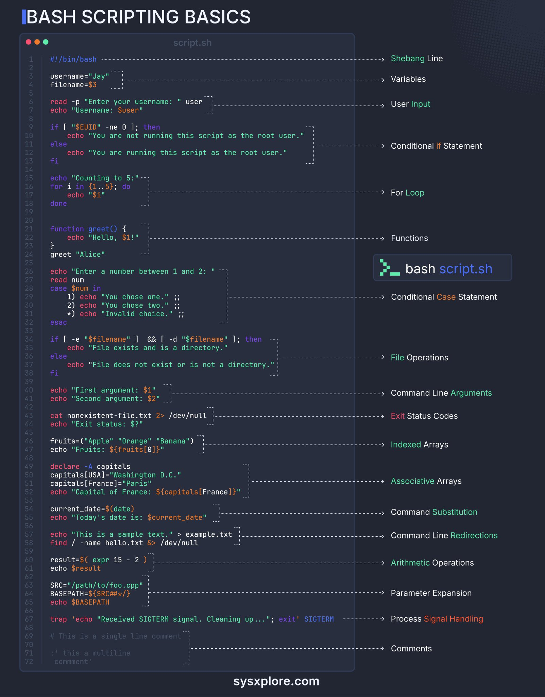
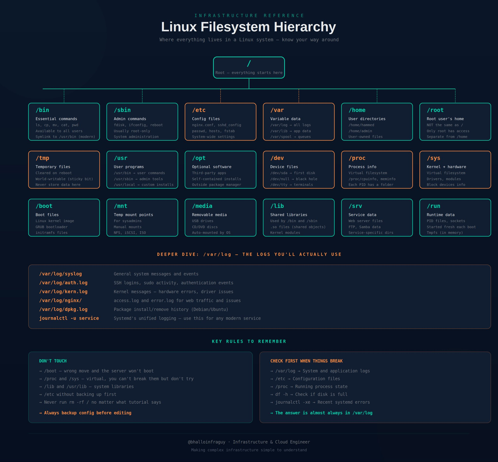
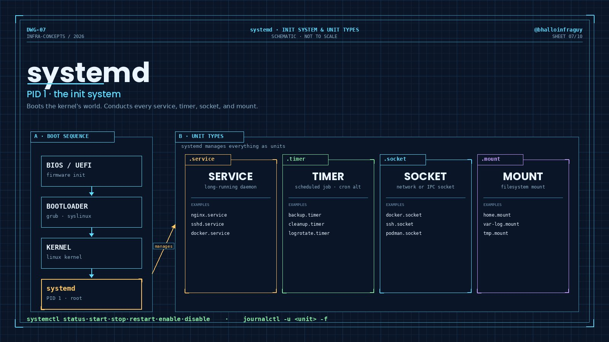
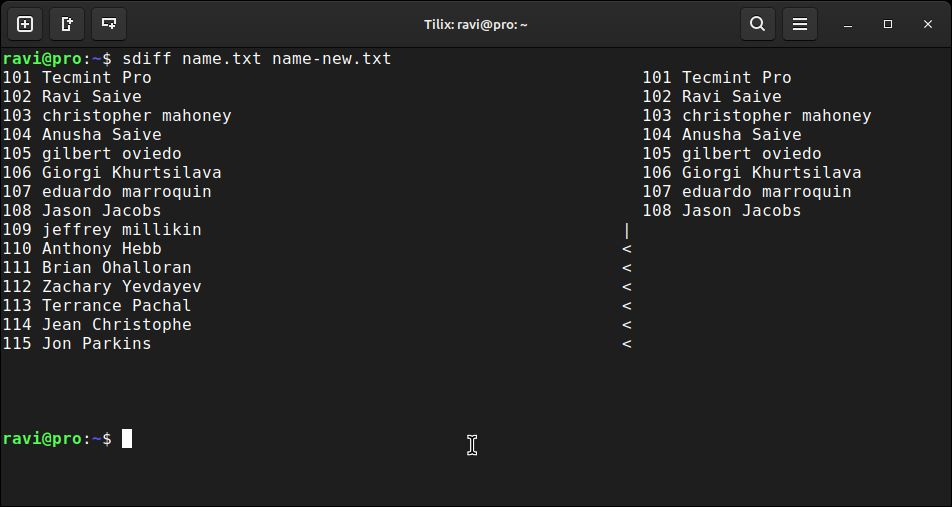

# 리눅스

속성: Infra


<details>
<summary><strong>orphaned file space</strong></summary>


리눅스 서버에서 df -h를 실행하면 디스크 사용량이 100%로 표시됩니다.
하지만 du -sh /*를 실행하면 아무것도 100%에 도달하지 않습니다.

가장 가능성 있는 원인은 무엇일까요?

A. 루트 디렉토리의 숨겨진 파일
B. 실행 중인 프로세스에 의해 여전히 열려 있는 삭제된 파일
C. 디스크가 고장 났습니다
D. 스왑이 가득 찼습니다

프로세스가 삭제 후에도 파일 디스크립터를 열린 상태로 유지하므로 공간이 해제되지 않습니다.

du는 파일 시스템 트리에 더 이상 없기 때문에 이를 볼 수 없습니다.

"lsof | grep deleted"로 확인하세요.


</details>


<details>
<summary><strong>디스크가 가득 찼습니다. 실행할 상위 3개 명령어</strong></summary>


- df -h → 디스크 잔여 공간 확인 (파일시스템 수준)
- du -sh *  → 디스크를 채우는 것 확인 (폴더 수준)
- du -sh * | sort -rh | head -10  → 가장 큰 상위 10개 항목


</details>


<details>
<summary><strong>리눅스를 10단계로 마스터하기</strong></summary>


1. 리눅스란 무엇인가 → 커널, 배포판, 쉘
2. 파일 시스템 → 디렉토리, 경로, 권한
3. 핵심 명령어 → ls, cd, cp, mv, rm
4. 파일 보기 → cat, less, head, tail
5. 검색 & 필터 → grep, find, 파이프
6. 권한 → chmod, chown, 사용자
7. 프로세스 → ps, top, kill, systemctl
8. 네트워킹 → ping, curl, netstat, ssh
9. 패키지 관리 → apt, yum, dnf
10. 쉘 스크립팅 → 작업 자동화


</details>


<details>
<summary><strong>빠른 리눅스 팁</strong></summary>


- 터미널을 실수로 닫았나요? 이전 세션 출력을 복구하세요. 세션이 /home/ravi/session.log에 저장되었습니다
    
    ```
    script ~/session.log
    # 이제 모든 것이 기록됩니다
    exit
    ```
    
- 프로세스가 멈췄을 때, 이를 종료하고 싶지 않다면 strace를 사용해 실시간으로 어떤 시스템 콜에서 막혔는지 정확히 확인하세요.
    
    ```
    strace -p <PID> -e trace=read,write,open
    ```
    
    프로덕션 디버깅에서 많이 사용됩니다 - 코드 변경 없음, 재시작 불필요. 파일 디스크립터, 네트워크 호출, 차단된 I/O를 실시간으로 보여줍니다.
    
    리눅스 서버에서 프로세스 멈췄을 때 원인도 모르고 일단 재시작부터 갈기는 게 얼마나 위험한 도박인지 아는 사람들은 strace부터 켬. 코드 수정 없이 실시간 syscall 흐름만 훑어도 네트워크 병목인지 파일 락인지 바로 견적 나오는 판임. 막연한 추측 대신 커널 레벨에서 찍히는 팩트로 패는 게 진짜 고수들의 디버깅 방식임.
    
- 상태 필터를 사용한 ss는 프로덕션 서버의 연결 문제를 진단할 때 netstat보다 훨씬 강력합니다.
    
    ```
    ss -tnp state established '( dport = :443 or sport = :443 )'
    ```
    
    활성 HTTPS 연결만 프로세스 이름과 함께 표시합니다. 연결 누수나 예상치 못한 트래픽 급증을 추적할 때 유용합니다.
    
- 대부분의 사람들은 디렉토리 구조를 시각화하기 위해 tree를 사용합니다. 많은 사람들이 모르는 것은, 이것이 파일 권한, 소유자, 그룹, 그리고 크기도 표시할 수 있다는 점입니다.\
    
    ```bash
    $ tree -pugh -L 3
    ```
    
    각 옵션이 의미하는 바는 다음과 같습니다:
    
    ```bash
    p - 파일 권한
    -u - 소유자
    -g - 그룹
    -h - 사람이 읽기 쉬운 크기
    -L - 디렉토리 트리의 깊이 제한
    ```
    
    이것은 파일 권한 감사, 액세스 문제 해결, 또는 프로젝트의 디렉토리 구조 문서화 시 특히 유용합니다.
    


</details>


<details>
<summary><strong>리눅스 배포판이 당신에 대해 말해주는 것</strong></summary>


- 우분투: (당신 아빠가 PC에 다운로드했음)
- 민트: (당신은 윈도우를 좋아함)
- 칼리: (당신은 자신이 해커라고 생각함)
- 스팀OS: (당신은 모두에게 아치 쓰는 거 알지 btw라고 말함)
- 아치: (당신은 아치 쓰는 거 알지 btw)
- 젠투: (당신은 특별하다고 느껴지는 걸 좋아함)
- 페도라: (당신은 서버 관리자임)


</details>


<details>
<summary><strong>명령어 팁</strong></summary>


디스크 사용량 확인 - df -h

큰 폴더 찾기 - du -sh /* 2>/dev/null

최상위 공간 점유 항목 - du -ah / | sort -rh | head -20

로그 정리 - /var/log

삭제되었지만 열려 있는 파일 확인 - lsof | grep deleted


</details>


<details>
<summary><strong>만약 &quot;free -h&quot;를 실행해본 적이 있다면,</strong></summary>


그 출력 결과가 많은 사람들을 혼란스럽게 한다는 걸 알 거예요

```
                 total    used    free   buff/cache  available
Mem:          15Gi    8.2Gi   512Mi    6.3Gi      6.8Gi
Swap:          2Gi    100Mi   1.9Gi
```

각 열이 의미하는 것 👇

total     → 설치된 물리적 RAM
used      → 프로세스에 의해 실제로 사용 중인 메모리
free      → 완전히 사용되지 않음 (보통 작음, Linux가 전부 사용함)
buff/cache → 커널이 디스크 캐싱에 사용 (재사용 가능!)
available  → 새로운 프로세스에 실제로 사용 가능한 메모리

중요한 숫자 🟩

available 지표, free가 아님.

Linux는 여유 RAM을 디스크 캐시로 사용합니다 (모든 걸 더 빠르게 만듦).
그 메모리는 필요 시 즉시 앱에 반환됩니다.
건강한 Linux 시스템에서 'free'는 의도적으로 낮게 유지됩니다.

언제 걱정할지🫤

available < 500MB  → 실제로 메모리가 부족함
OOM killer 이벤트  → dmesg | grep -i 'oom' 확인

free가 낮다고 당황하지 마세요.
available을 주시하세요. 그게 진짜 숫자입니다. 🔖


</details>


<details>
<summary><strong>DevOps에서 5년 이상 일한 후, 가장 유용하다고 생각하는 명령어들:</strong></summary>


grep -r 'text' ./     → 파일에서 무언가를 찾기
curl -I <url>         → 서비스가 실행 중인지 확인
kubectl describe      → 이게 왜 고장 났는지
terraform plan        → 이게 무엇을 변경할지
git log --oneline     → 최근에 무슨 일이 있었는지
tail -f <logfile>     → 지금 무슨 일이 일어나고 있는지


</details>


<details>
<summary><strong>실제 프로덕션 작업에서 실제로 등장하는 명령어들</strong></summary>


🔎찾아내기:

find / -name 'config.yml' 2>/dev/null
→ 시스템 어디서든 이름으로 파일 찾기

grep -r 'ERROR' /var/log/ --include='*.log'
→ 모든 로그 파일에서 텍스트 재귀적으로 검색

lsof -i :8080
→ 8080 포트를 사용 중인 프로세스는?

🤔리소스를 사용하는 걸 이해하기:

htop
→ top의 더 나은 버전. CPU, 메모리, 프로세스별.

iotop
→ 지금 디스크를 두들기는 프로세스는?

nethogs
→ 가장 많은 네트워크 대역폭을 사용하는 프로세스는?

du -sh /* 2>/dev/null | sort -rh | head -15
→ 루트에서 상위 15개 디스크 사용자

🛜네트워크 디버깅:

ss -tlnp
→ 모든 리스닝 포트 + 소유 프로세스

curl -v [https://myservice.internal/health](https://myservice.internal/health)
→ 헤더와 타이밍 포함 전체 HTTP 요청

dig +trace .
→ 루트에서 권한 있는 서버까지 전체 DNS 해석 경로

tcpdump -i eth0 port 443 -w /tmp/cap.pcap
→ Wireshark용 HTTPS 트래픽 파일로 캡처

💟한눈에 보는 시스템 상태:

uptime
→ 1, 5, 15분 동안의 로드 평균

vmstat 1 5
→ 1초마다 5회 CPU, 메모리, I/O 통계

dmesg -T | grep -i error
→ 타임스탬프 포함 커널 오류

journalctl -p err -b
→ 마지막 부팅 이후 모든 오류

🦺긴급 상황에서 구해주는 것들:

kill -9 $(lsof -t -i:8080)
→ 8080 포트를 사용 중인 모든 것 종료

nohup ./script.sh &
→ 백그라운드에서 스크립트 실행, SSH 연결 끊김에도 생존

watch -n 5 'df -h | grep -v tmpfs'
→ 5초마다 디스크 사용량 새로고침

tail -f /var/log/app.log | grep --line-buffered ERROR
→ 라이브 로그에서 오류 라인만 스트리밍

🪄마법처럼 보이지만 그렇지 않은 원라이너들:

- 폴더 아카이브 + 압축
    - tar -czf backup.tar.gz /etc/nginx/
- 추출
    - tar -xzf backup.tar.gz
- 지난 24시간 내 수정된 파일 찾기
    - find /var/log -mtime -1 -type f
- 모든 로그 파일의 라인 수 세기
    - wc -l /var/log/*.log | sort -rn


</details>


<details>
<summary><strong>CLI 도구 개발자들이 사랑하는 도구들</strong></summary>


⚡ htop – 시스템 모니터링
⚡ bat – 더 나은 cat 명령어
⚡ fzf – 퍼지 검색 도구
⚡ ripgrep – 초고속 검색
⚡ tldr – 간소화된 매뉴얼 페이지
⚡ lazygit – 터미널용 Git UI
⚡ zoxide – 더 똑똑한 cd 명령어
⚡ exa – ls의 현대적 대체 도구


</details>


<details>
<summary><strong>빠른 Linux 팁 🐧</strong></summary>


1. Linux에 처음이고 포트 80을 점유하고 있는 게 뭔지 모르겠나요? 이 한 가지 명령어만으로 모든 걸 알려줍니다. 어떤 프로세스인지, 어떤 PID인지, 전부요: ss는 netstat보다 빠르고 모든 현대적인 배포판에 미리 설치되어 있습니다.
`$ sudo ss -tulnp | grep :80`
    
    
    
2. 명령어의 출력을 실시간으로 모니터링하고 싶었지만 루프를 작성하지 않고 싶으신 적 있나요?watch는 2초마다 자동으로 해줍니다:
`watch df -h`
`Every 2.0s: df -h`
    
    ```
    Filesystem      Size  Used Avail Use%
    /dev/sda1        50G   28G   22G  56%
    /dev/sdb1       200G  102G   98G  51%
    ```
    
3. 여러 터미널 세션을 실행하고 싶지만 여러 창을 열 필요는 없나요? tmux가 답이며, 한 번 사용하기 시작하면 다시는 돌아갈 수 없을 거예요.
    
    ```
    $ tmux new -s myserver
    [detached from session myserver]
    ```
    
    ```
    $ tmux ls
    myserver: 1 windows (created Tue Apr 15)
    ```
    
    ```
    $ tmux attach -t myserver
    ```
    
    터미널을 패널로 나누고, 분리하고, 다시 연결하세요.
    


</details>


<details>
<summary><strong>리눅스에서 파일 디스크립터</strong></summary>


1. 모든 것이 파일이다 - 소켓, 파이프, 장치, 실제 파일. 하나의 추상화, 동일한 커널 인터페이스.
2. FD는 단지 숫자일 뿐이다 - 커널이 실제 상태를 유지한다. 프로세스는 이에 대한 참조를 가지고 있다.
3. 열린(open) 상태가 사용 중(in use)을 의미하지 않는다 - 누출된 FD는 열린 상태로 남아 아무것도 읽지 않더라도 한도에 포함된다.
4. fork는 파일이 아닌 참조를 복사한다 - fork 후 부모와 자식 프로세스는 동일한 기본 파일 설명을 공유한다.
5. 닫기는 당신의 몫이다 - 커널은 프로세스가 종료되거나 close()를 호출할 때까지 정리하지 않는다.
6. 한도는 프로세스별로 적용되며 전역이 아니다 - 하나의 폭주 프로세스가 자신의 한도를 소진해도 다른 프로세스에 영향을 주지 않는다.




</details>


<details>
<summary><strong>느린 데이터베이스 디버깅</strong></summary>


그가 서버에 로그인했습니다.
그가 df -h를 실행했습니다.
그건 30% 여유 공간을 보여줬습니다.
그는 어깨를 으쓱하며 저장 공간이 문제가 아니라고 말했습니다.

나는 그에게 inode를 무시하는 게 즐거운지, 아니면 작은 파일을 싫어하는지 물었습니다.

그는 당황한 표정으로 df -h가 표준이라고 말했습니다.
나는 그에게 df -h는 공간을 보여줄 뿐 inode는 아니라고 말했습니다. 수백만 개의 빈 임시 파일이 inode를 소진시킬 수 있는데 공간은 괜찮아 보일 수 있죠. 그는 그 차이를 알지 못할 겁니다.

나는 그에게 df -i를 보여줬습니다.
그건 100% inode 사용량을 보여줬습니다.
나는 그에게 df -h 때문에 우리가 유령 같은 공간 문제를 찾느라 45분을 낭비했다고 말했습니다.

나는 공간과 inode 둘 다에 알림을 보내는 cron 스크립트를 작성하고 그에게 팀에게 그걸 설명하게 했습니다.


</details>


<details>
<summary><strong>명령어 모음</strong></summary>


- unshare
    
    리눅스에서, 도커나 어떤 컨테이너 런타임도 없이, 고유한 프로세스 트리, 마운트 뷰, 호스트네임, 네트워크 등에서 프로그램을 격리된 환경에서 실행할 수 있습니다.
    
    커널이 직접 처리합니다.
    
    그것을 unshare라고 부릅니다. 보이는 프로세스는 몇 개뿐입니다. 시스템의 나머지 부분은 숨겨집니다.
    
    
    
- 초보자가 알아야 할 10가지 Linux 명령어
    1. pwd → 현재 디렉토리
    2. ls → 파일 목록 표시
    3. cd → 디렉토리 변경
    4. mkdir → 폴더 생성
    5. touch → 파일 생성
    6. cat → 파일 내용 보기
    7. cp → 파일 복사
    8. mv → 파일 이동/이름 변경
    9. rm → 파일 삭제
    10. grep → 텍스트 검색


</details>


<details>
<summary><strong>Bash 스크립팅 기초</strong></summary>




스크립트 실행 기본 명령어: `bash script.sh`

### 1. Shebang Line (셔뱅 라인)

스크립트를 실행할 인터프리터를 지정합니다.

```jsx
#!/bin/bash
```

### 2. Variables (변수)

변수를 선언하고 값을 할당합니다.

```jsx
username="Jay"
filename=$3
```

### 3. User Input (사용자 입력)

사용자로부터 입력을 받아 변수에 저장합니다.

```jsx
read -p "Enter your username: " user
echo "Username: $user"
```

### 4. Conditional if Statement (if 조건문)

조건에 따라 다른 코드를 실행합니다. `$EUID`를 통해 루트 사용자 여부를 확인합니다.

```jsx
if [ "$EUID" -ne 0 ]; then
    echo "You are not running this script as the root user."
else
    echo "You are running this script as the root user."
fi
```

### 5. For Loop (For 반복문)

지정된 범위(`{1..5}`) 내에서 반복 실행합니다.

```jsx
echo "Counting to 5:"
for i in {1..5}; do
    echo "$i"
done
```

### 6. Functions (함수)

재사용 가능한 코드 블록을 정의하고 호출합니다.

```jsx
function greet() {
    echo "Hello, $1!"
}
greet "Alice"
```

### 7. Conditional Case Statement (Case 조건문)

변수의 값에 따라 여러 분기 중 하나를 실행합니다.

```jsx
echo "Enter a number between 1 and 2: "
read num
case $num in
    1) echo "You chose one." ;;
    2) echo "You chose two." ;;
    *) echo "Invalid choice." ;;
esac
```

### 8. File Operations (파일 작업)

파일의 존재 여부 및 디렉터리 여부를 확인합니다.

```jsx
if [ -e "$filename" ] && [ -d "$filename" ]; then
    echo "File exists and is a directory."
else
    echo "File does not exist or is not a directory."
fi
```

### 9. Command Line Arguments (명령줄 인수)

스크립트 실행 시 전달된 인수(`$1`, `$2` 등)를 참조합니다.

```jsx
echo "First argument: $1"
echo "Second argument: $2"
```

### 10. Exit Status Codes (종료 상태 코드)

직전 명령어의 성공/실패 여부를 나타내는 종료 코드(`$?`)를 확인합니다.

```jsx
cat nonexistent-file.txt 2> /dev/null
echo "Exit status: $?"
```

### 11. Indexed Arrays (인덱스 배열)

숫자 인덱스를 사용하는 배열을 선언하고 접근합니다.

```jsx
fruits=("Apple" "Orange" "Banana")
echo "Fruits: ${fruits[0]}"
```

### 12. Associative Arrays (연관 배열)

문자열 키를 사용하는 배열을 선언(`declare -A`)하고 접근합니다.

```jsx
declare -A capitals
capitals[USA]="Washington D.C."
capitals[France]="Paris"
echo "Capital of France: ${capitals[France]}"
```

### 13. Command Substitution (명령어 치환)

명령어의 실행 결과를 변수에 저장합니다.

```jsx
current_date=$(date)
echo "Today's date is: $current_date"
```

### 14. Command Line Redirections (명령줄 리다이렉션)

표준 출력 및 표준 에러를 파일이나 `/dev/null`로 보냅니다.

```jsx
echo "This is a sample text." > example.txt
find / -name hello.txt &> /dev/null
```

### 15. Arithmetic Operations (산술 연산)

`expr` 명령어를 사용하여 수학 연산을 수행합니다.

```jsx
result=$( expr 15 - 2 )
echo $result
```

### 16. Parameter Expansion (매개변수 확장)

변수 값을 조작하여 문자열의 일부(여기서는 파일명)를 추출합니다.

```jsx
SRC="/path/to/foo.cpp"
BASEPATH=${SRC##*/}
echo $BASEPATH
```

### 17. Process Signal Handling (프로세스 시그널 처리)

`trap` 명령어를 사용하여 특정 시그널(예: `SIGTERM`) 수신 시 수행할 동작을 정의합니다.

```jsx
trap 'echo "Received SIGTERM signal. Cleaning up..."; exit' SIGTERM
```

### 18. Comments (주석)

단일 줄 주석 및 여러 줄 주석을 작성합니다.

```jsx
# This is a single line comment

:' this a multiline
comment'
```


</details>


<details>
<summary><strong>인프라 엔지니어가 알아야 할 Linux 파일 시스템 계층</strong></summary>


/ → 루트 디렉토리. 모든 것이 여기서 시작됩니다
/bin → 필수 사용자 명령어 (ls, cp, mv)
/sbin → 시스템 관리자 명령어 (fdisk, ifconfig)
/etc → 설정 파일 (nginx.conf, sshd_config)
/var → 가변 데이터 (로그, 메일, 스풀, 데이터베이스)
/var/log → 시스템 및 애플리케이션 로그
/home → 사용자 홈 디렉토리
/root → 루트 사용자의 홈 (/)과 다릅니다
/tmp → 임시 파일 (재부팅 시 삭제됨)
/usr → 사용자 프로그램 및 라이브러리
/opt → 선택적 타사 소프트웨어
/dev → 장치 파일 (디스크, 터미널)
/proc → 실행 중인 프로세스에 대한 가상 파일 시스템
/sys → 커널 및 하드웨어 정보
/boot → 부트로더 및 커널 파일
/mnt → 임시 마운트 지점
/media → 이동식 미디어 (USB, CD)
/lib → /bin 및 /sbin용 공유 라이브러리




</details>


<details>
<summary><strong>리눅스 로그 파싱 명령어</strong></summary>


### 1. 검색 및 패턴 매칭 (Search & Pattern Matching)

특정 패턴이나 정규 표현식을 사용하여 텍스트를 찾는 도구들입니다.

| **명령어** | **설명** |
| --- | --- |
| **grep** | 정규 표현식을 사용하여 텍스트를 검색하고 일치하는 라인을 출력합니다. |
| **ripgrep** | 현재 디렉토리를 재귀적으로 검색하는 라인 중심 검색 도구로, 속도가 매우 빠릅니다. |
| **ag (The Silver Searcher)** | 속도에 최적화된 코드 검색 도구로, 프로그래머들 사이에서 인기가 높습니다. |
| **pt (The Platinum Searcher)** | 속도와 효율성에 중점을 둔 코드 검색 도구로, ag나 ripgrep과 유사합니다. |
| **ack** | 개발자 친화적인 검색 도구로, 특정 코드 파일 형식을 인식하며 기본적으로 버전 관리 디렉토리를 무시합니다. |
| **ugrep** | 재귀 검색, 정규 표현식 패턴, 유니코드를 지원하는 풍부한 기능의 검색 도구입니다. |
| **agrep** | "Approximate grep"의 약자로, 텍스트 내에서 유사하거나 오타가 있는 단어를 찾는 근사치 매칭을 지원합니다. |
| **ngrep** | 네트워크 패킷 분석 도구로, 네트워크 트래픽에서 정규 표현식 패턴을 검색하고 필터링합니다. |

### 2. 텍스트 변환 및 조작 (Text Transformation & Manipulation)

텍스트의 내용을 수정, 변환 또는 특정 부분만 추출하는 도구들입니다.

| **명령어** | **설명** |
| --- | --- |
| **sed** | 강력한 스트림 에디터로, 정규 표현식을 기반으로 텍스트 검색, 교체, 삽입, 삭제 등의 작업을 수행합니다. |
| **awk** | 데이터 조작, 텍스트 추출 및 보고서 생성에 사용되는 다목적 텍스트 처리 도구입니다. |
| **tr** | "Translate"의 약자로, 텍스트 스트림에서 문자를 변환, 삭제 또는 압축하는 데 사용됩니다. |
| **cut** | 파일이나 데이터 스트림의 각 라인에서 특정 섹션(필드나 열)을 추출합니다. |
| **rev** | 데이터 스트림이나 텍스트 파일의 각 라인에 있는 문자 순서를 반대로 뒤집습니다. |
| **nl** | 텍스트 파일이나 데이터 스트림의 각 라인에 줄 번호를 추가합니다. |

### 3. 출력 및 조회 (Output & Viewing)

데이터를 화면에 출력하거나 형식을 지정하여 보여주는 도구들입니다.

| **명령어** | **설명** |
| --- | --- |
| **cat** | "Concatenate"의 약자로, 하나 이상의 파일 내용을 표시하거나 여러 파일을 하나로 합칩니다. |
| **tac** | `cat`의 역순으로, 파일의 내용을 마지막 줄부터 거꾸로 출력합니다. |
| **head** | 파일의 처음 몇 줄(기본 10줄)을 표시합니다. |
| **tail** | 파일의 마지막 몇 줄을 표시하며, 실시간 로그 모니터링에 자주 사용됩니다. |
| **less/more** | 터미널 화면을 넘어가는 긴 텍스트 파일을 한 번에 한 화면씩 끊어서 볼 수 있게 해주는 페이저 프로그램입니다. |
| **echo** | 텍스트나 변수를 표준 출력(주로 터미널)으로 출력합니다. |
| **printf** | 데이터를 특정 형식(너비, 정밀도, 정렬 등)에 맞춰 포맷팅하여 출력합니다. |
| **watch** | 지정된 명령어를 정기적인 간격(기본 2초)으로 반복 실행하여 결과를 실시간으로 보여줍니다. |
| **ccze** | 로그 파일을 색상화하여 가독성을 높여주는 도구입니다. |

### 4. 데이터 정리 및 분석 (Sorting & Analysis)

데이터를 정렬하거나 중복을 제거하고 통계를 내는 도구들입니다.

| **명령어** | **설명** |
| --- | --- |
| **sort** | 텍스트 파일의 라인을 오름차순 또는 내림차순으로 정렬합니다. |
| **uniq** | 정렬된 파일이나 스트림에서 중복된 라인을 제거합니다. 보통 `sort`와 함께 사용됩니다. |
| **wc** | 텍스트 파일이나 스트림 내의 줄 수, 단어 수, 문자 수를 계산합니다. |

### 5. 파일 비교 및 병합 (Comparison & Merging)

두 개 이상의 파일을 비교하거나 합치는 도구들입니다.

| **명령어** | **설명** |
| --- | --- |
| **diff** | 두 텍스트 파일의 내용을 비교하여 차이점을 출력합니다. |
| **vimdiff** | Vim 에디터 내에서 두 개 이상의 파일을 시각적으로 비교하고 병합할 수 있도록 실행합니다. |
| **comm** | 정렬된 두 파일을 비교하여 각 파일에만 있는 라인과 공통된 라인을 출력합니다. |
| **paste** | 여러 파일이나 데이터 스트림의 라인을 나란히 병합합니다. |

### 6. 특수 포맷 처리 (Specialized Formats)

JSON이나 CSV와 같은 구조화된 데이터를 처리하는 도구들입니다.

| **명령어** | **설명** |
| --- | --- |
| **jq** | 커맨드라인용 JSON 처리기로, JSON 데이터를 쿼리, 조작 및 포맷팅하는 데 필수적입니다. |
| **csvcut** | CSV 파일에서 특정 열을 선택하거나 작업하기 위한 유틸리티입니다. |


</details>


<details>
<summary><strong>인프라 엔지니어가 매일 실행하는 리눅스 명령어들</strong></summary>


서버 터졌을 때 원인도 모르고 우왕좌왕하는 초보 엔지니어라면 당장 터미널 켜고 쳐봐야 할 12가지 필수 리눅스 명령어 세트임. uptime부터 dmesg까지 서버 내부의 디스크, 메모리, 포트 상태를 웹 UI 없이 날것 그대로 빠르게 진단할 때 유용함. 복잡한 모니터링 툴이 안 먹히는 최악의 장애 순간을 대비해 무조건 저장해두고 손에 익혀야 할 기본 스펙임

uptime → 서버가 얼마나 오래 실행되었는지
df -h → 디스크 공간 사용량
free -h → 메모리 사용량
top / htop → 실시간 프로세스 및 리소스 보기
ss -tlnp → 리스닝 포트 및 프로세스
journalctl -u <service> -f → 실시간 서비스 로그
systemctl status <service> → 서비스 상태
systemctl --failed → 한 번에 모든 실패한 서비스
ip a → 네트워크 인터페이스 및 IP
ip r → 라우팅 테이블
dmesg | tail → 최근 커널 메시지
last → 최근 로그인 기록


</details>


<details>
<summary><strong>인프라 개념: systemd</strong></summary>


리눅스 서버가 부팅될 때, 커널을 시작하고, 파일 시스템을 마운트하고, 네트워킹을 활성화하고, 서비스를 실행하며, 종료를 처리해야 하는 무언가가 필요합니다. 그 무언가가 바로 systemd, PID 1, 거의 모든 현대 리눅스 배포판의 init 시스템입니다.

systemd가 관리하는 모든 것은 유닛입니다. 가장 일반적인 유형:
→ .service - 데몬 (nginx, sshd, docker)
→ .timer - 예약된 작업 (현대적인 cron 대안)
→ .socket - 네트워크 또는 IPC 소켓
→ .mount - 파일 시스템 마운트

매일 사용할 명령어들:

- systemctl status nginx - 실행 중인가?
- systemctl restart nginx - 재시작하기
- systemctl enable nginx - 부팅 시 시작하기
- journalctl -u nginx -f - 로그 추적하기

systemd를 이해하면 리눅스 서버가 실제로 어떻게 작동하는지 이해하게 됩니다.



요즘 인공지능이 코드 다 짜주니까 서버 아키텍처나 운영체제 기초는 몰라도 된다는 착각이 팽배해지는 듯.. 인프라 장애는 에이전트가 대신 밤새워 고쳐주지 않고 결국 터미널 켜서 systemctl 뒤지는 노가다로 귀결됨. 도커나 쿠버네티스 뒤에 숨어서 리눅스 기초 건너뛴 백엔드 개발자들이 장애 대응할 때 꺼내봐야 하는 인프라 핵심 요약임.


</details>


<details>
<summary><strong>Linux RAM 요구 사항이 정말 터무니없어 🤯</strong></summary>


- 🟠 Ubuntu - 6 GB
- 🎮 SteamOS - 4 GB
- 🚀 Pop!_OS - 4 GB
- 🔵 Fedora - 2 GB
- 🎩 Red Hat Enterprise Linux - 2 GB
- 🦎 openSUSE - 2 GB
- 🍃 Linux Mint - 2 GB
- 🪟 Zorin OS - 2 GB
- 🛡️ Kali Linux - 2 GB
- 🏔️ Manjaro - 2 GB
- 🏔️ Rocky Linux - 2 GB
- 🎯 CentOS Stream - 2 GB
- 🕊️ Lubuntu - 1 GB
- 📦 Debian - 512 MB
- 🐧 Arch Linux - 512 MB
- 🪶 Puppy Linux - 256 MB
- 💿 Tiny Core Linux - 64 MB

Linux는 감자부터 워크스테이션까지 모든 것에서 실행될 수 있어.


</details>


<details>
<summary><strong>🔑 chmod vs chown</strong></summary>


1. chmod = 권한 변경 파일을 읽기, 쓰기, 실행할 수 있는 사용자를 제어합니다.
    
    chmod 755 [http://script.sh](http://script.sh/)
    
    - > 소유자: rwx | 그룹: r-x | 기타: r-x
2. chown = 소유권 변경 파일이나 디렉토리의 실제 소유자를 변경합니다.
    
    chown ubuntu:developers [http://deploy.sh](http://deploy.sh/)
    
    - > 소유자 = ubuntu | 그룹 = developers

간단한 비유:
→ chown = 집을 소유한 사람 🏠
→ chmod = 키를 받는 사람 & 집 안에서 할 수 있는 일 🔑


</details>


<details>
<summary><strong>⚠️ 커리어를 끝장낼 수 있는 7가지 Linux 명령어</strong></summary>


1️⃣ rm -rf / --no-preserve-root
→ 시스템의 모든 파일을 삭제합니다. 확인 절차 없음. 되돌리기 불가능.

2️⃣ :(){ :|:& };:
→ 포크 폭탄. 커널이 다른 것을 스케줄할 수 없을 때까지 프로세스를 생성합니다.

3️⃣ dd if=/dev/zero of=/dev/sda
→ 디스크를 바이트 단위로 0으로 덮어씁니다. Ctrl+C를 누르기 전에 데이터가 사라집니다.

4️⃣ dd if=/dev/urandom of=/dev/mem
→ RAM에 직접 쓰레기 데이터를 씁니다. 커널은 이로부터 복구되지 않습니다.

5️⃣ wipefs -a /dev/sda
→ 파티션 테이블을 파괴합니다. 데이터는 여전히 남아 있지만 — OS는 그것을 찾을 방법을 모릅니다.

6️⃣ while :; do mkdir ; done
→ 디스크 공간이 남아 있어도 inode가 소진될 때까지 파일 시스템을 디렉토리로 가득 채웁니다.

7️⃣ echo c > /proc/sysrq-trigger
→ 즉시 커널 패닉을 강제합니다. 경고 없음, 로그도 작성되지 않음.

이 모든 명령어가 실제 프로덕션 사고로 이어진 적이 있습니다.


</details>


<details>
<summary><strong>리눅스 데스크톱만 1주일 동안 써본 후기:</strong></summary>


카카오톡 불편하지만 잘 돌아감
한글 입력 문제 전혀 없음
지문 인식 잘 됨
윈도우 11 램 사용량 절반
32기가 기준 20을 넘기지 않는 중
PowerShell 말고 zsh, bash 쓸 수 있음

그냥 쓰면 됩니다. 궁금하셨던 분들은 듀얼 부팅해 보세요. 재밌습니다.


</details>


<details>
<summary><strong>리눅스 커널 정리 /with MINZKN</strong></summary>


[리눅스 커널 정리 /with MINZKN](https://www.minzkn.com/linuxkernel/index.html)


</details>


<details>
<summary><strong>두 개의 파일을 가지고 있고, 이를 나란히 비교하고 싶다면.</strong></summary>


```
sdiff file1 file2
```

예를 들어:

```
sdiff old.txt new.txt
```

이 명령은 두 파일을 나란히 표시하고 차이점을 강조합니다.

또한 다음도 시도해 볼 수 있습니다:

```
sdiff config_old.txt config_new.txt
sdiff users_old.txt users_new.txt
sdiff list1.txt list2.txt
```

설정 파일, 목록 또는 문서 변경 사항을 비교하는 데 완벽합니다.




</details>


<details>
<summary><strong>터미널에서 파일 찾느라 cd → ls → cd .. → ls 무한 반복하는 사람?</strong></summary>


GitHub 2.2만 Star `Superfile`은

터미널 안에 듀얼 패널 파일 관리기를 넣어주는 툴임. 

왼쪽엔 원본 폴더, 오른쪽엔 목적지 폴더 띄워두고

복사·이동·이름 변경·검색·일괄 처리까지 키보드로 끝낼 수 있음.

Vim 키바인딩도 지원해서

터미널 오래 쓴 사람은 거의 바로 적응할 듯.

미리보기, 테마, 플러그인까지 있고

Go 기반 단일 바이너리라 가볍게 설치 가능.

macOS·Linux는 한 줄 설치, Windows도 winget·Scoop 지원.

하루 종일 터미널에 사는 사람이라면

파일 찾는 스트레스부터 줄여보셈. 

[https://github.com/yorukot/superfile](https://github.com/yorukot/superfile)


</details>


<details>
<summary><strong>리눅스에서 차이가 나는 건 아는 명령어의 수가 아니야.</strong></summary>


장애 발생 시 df -h→free -m→journalctl→ss -tlnp 순으로 확인할 수 있는지 여부야.

디스크, 메모리, 로그, 네트워크 순으로 하나씩 확인하기만 해도 원인의 8할은 좁힐 수 있어.

암기보다 순서.

이 4가지만 메모해두길 바래.


</details>


<details>
<summary><strong>이 Linux 명령어들이 지난 13년간의 IT 경력에서 가장 큰 도움을 주었습니다</strong></summary>


일상적인 것들:

- ps aux | grep {process} - 그 교활한 프로세스 찾기
- lsof -i :{port} - 누가 그 포트를 점유하고 있는가?
- df -h - 고전적인 "공간이 부족해요" 확인기
- netstat -tulpn - 네트워크 연결 탐정
- kubectl get pods | grep -i error - K8s 문제 찾기

로그 관련 명령어:

- tail -f /var/log/* - 실시간 로그 감시자
- journalctl -fu service-name - SystemD 로그 추적자
- grep -r "error" . - 오류 사냥꾼
- zcat access.log.gz | grep "500" - 압축 로그 닌자
- less +F - 더 나은 tail 명령어

컨테이너 CLI:

- docker ps --format '{{.Names}} {{.Status}}' - 깔끔한 상태 확인
- docker stats --no-stream - 빠른 자원 확인
- crictl logs {container} - 원시 컨테이너 이야기
- docker exec -it - 컨테이너 백도어
- podman top - 컨테이너 내부 프로세스 엿보기

시스템 탐정들:

- htop - 시스템 자원 이야기꾼
- iostat -xz 1 - 디스크 성능 시인
- free -h - 메모리 미스터리 해결사
- vmstat 1 - 시스템 활력 징후
- dmesg -T | tail - 커널의 최근 소문

네트워크 관련:

- curl -v - HTTP 대화 디버거
- dig +short - 빠른 DNS 조회
- ss -tunlp - 소켓 통계 간소화
- iptables -L - 방화벽 규칙 읽기
- traceroute - 경로 찾기

파일 및 기타:

- find . -name "*.yaml" -type f - YAML 사냥꾼
- rsync -avz - 더 나은 파일 복사기
- tar -xvf - 압축 해제기 (네, 우리 모두 이걸 구글링하죠)
- ln -s - 심링크 마법사
- chmod +x - 실행 가능하게 만들기

성능:

- strace -p {pid} - 시스템 호출 스파이
- tcpdump -i any - 네트워크 패킷 스니퍼
- sar -n DEV 1 - 네트워크 통계 감시
- uptime - 부하 평균 한눈에
- top -c - 고전적인 프로세스 뷰어

Git 필수:

- git log --oneline - 역사 간소화
- git reset --hard HEAD^ - "앗" 지우개
- git stash - 작업 숨기기
- git diff --cached - 스테이징된 것 확인
- git blame - "누가 이걸 했어?" 해결사

빠른 수정:

- sudo !! - 마지막 명령어를 sudo로 실행
- ctrl+r - 명령어 히스토리 검색
- history | grep - 명령어 타임머신
- alias - 명령어 단축키 제작기
- watch - 명령어 반복자
</details>

