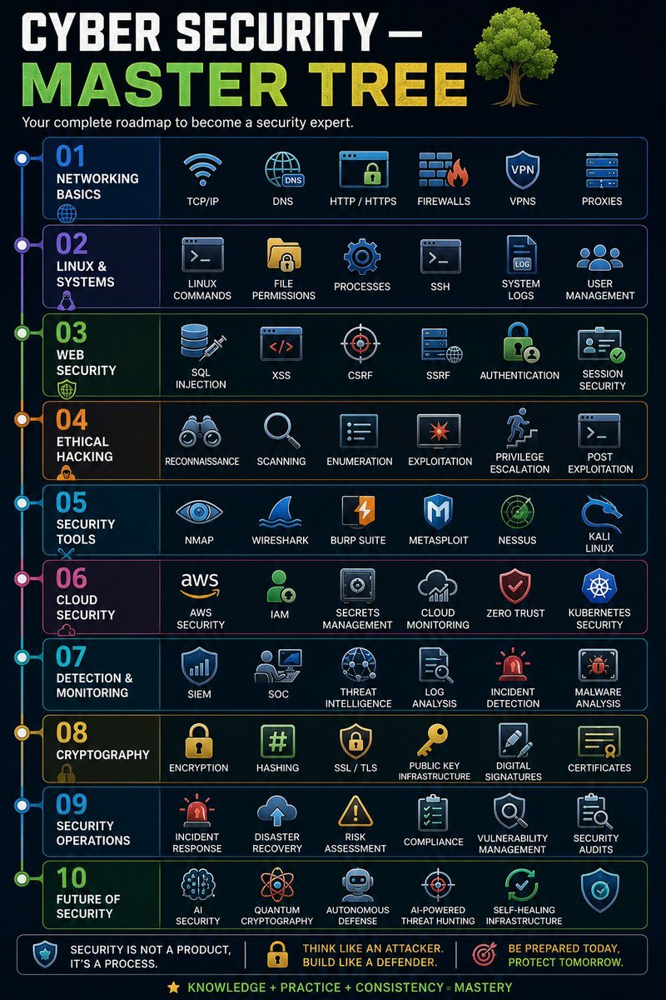
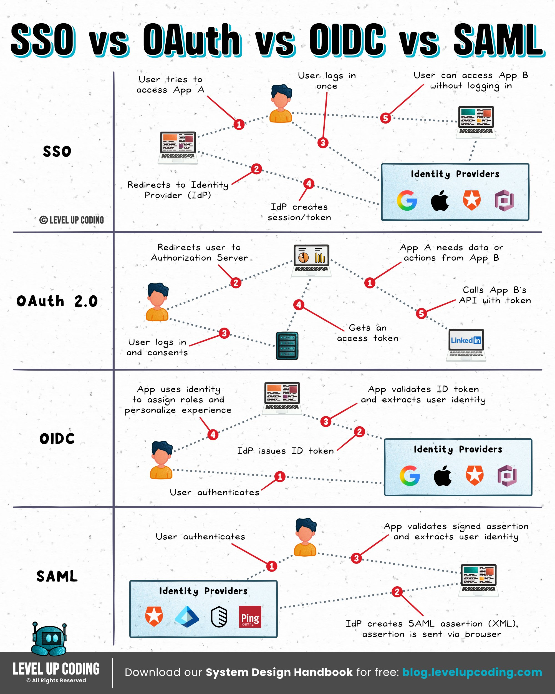

# 보안

속성: Security


<details>
<summary><strong>체크항목</strong></summary>


- 실행파일 (exe, bat, dll 등)
- 파일 구성
- 악성 실행 가능 파일
- 숨김 패턴
- 전체 파일 개수


</details>


<details>
<summary><strong>주의할 점</strong></summary>


- 파일 읽기/분석
- 빌드해서 실행
- 이 폴더를 프로젝트에 두기
- 결론

---


</details>


<details>
<summary><strong>2026년 최고의 사이버 보안 도구</strong></summary>


① 🌐 Nmap → 네트워크 스캐닝

② 💥 Metasploit → 익스플로잇 프레임워크

③ 🧱 Burp Suite → 웹 테스트

④ 📡 Aircrack-ng → WiFi 크래킹

⑤ 🔑 John the Ripper → 비밀번호 크래킹

⑥ 🗄️ SQLmap → SQL 인젝션

⑦ 🕸️ Maltego → OSINT 매핑

⑧ 💀 Nikto → 웹 취약점 스캔

⑨ 🐂 BeEF → 브라우저 익스플로잇

⑩ 🔺 Empire → 사후 익스플로잇 프레임워크


</details>


<details>
<summary><strong>사이버 보안 — 마스터 트리</strong></summary>


```
사이버 보안
│
├── 01. 네트워킹 기초
│   ├── TCP/IP
│   ├── DNS
│   ├── HTTP / HTTPS
│   ├── 방화벽
│   ├── VPN
│   └── 프록시
│
├── 02. 리눅스 & 시스템
│   ├── 리눅스 명령어
│   ├── 파일 권한
│   ├── 프로세스
│   ├── SSH
│   ├── 시스템 로그
│   └── 사용자 관리
│
├── 03. 웹 보안
│   ├── SQL 인젝션
│   ├── XSS
│   ├── CSRF
│   ├── SSRF
│   ├── 인증
│   └── 세션 보안
│
├── 04. 윤리적 해킹
│   ├── 정찰
│   ├── 스캐닝
│   ├── 열거
│   ├── 익스플로잇
│   ├── 권한 상승
│   └── 사후 익스플로잇
│
├── 05. 보안 도구
│   ├── Nmap
│   ├── Wireshark
│   ├── Burp Suite
│   ├── Metasploit
│   ├── Nessus
│   └── Kali Linux
│
├── 06. 클라우드 보안
│   ├── AWS 보안
│   ├── IAM
│   ├── 비밀 관리
│   ├── 클라우드 모니터링
│   ├── 제로 트러스트
│   └── 쿠버네티스 보안
│
├── 07. 탐지 & 모니터링
│   ├── SIEM
│   ├── SOC
│   ├── 위협 인텔리전스
│   ├── 로그 분석
│   ├── 인시던트 탐지
│   └── 멀웨어 분석
│
├── 08. 암호학
│   ├── 암호화
│   ├── 해싱
│   ├── SSL/TLS
│   ├── 공개 키 인프라
│   ├── 디지털 서명
│   └── 인증서
│
├── 09. 보안 운영
│   ├── 인시던트 대응
│   ├── 재해 복구
│   ├── 위험 평가
│   ├── 규정 준수
│   ├── 취약점 관리
│   └── 보안 감사
│
└── 10. 보안의 미래
├── AI 보안
├── 양자 암호학
├── 자율 방어
├── AI 기반 위협 사냥
└── 자가 치유 인프라
```

대부분의 사람들은 무언가가 고장난 후에야 보안을 사용합니다.

최고의 엔지니어들은 기본적으로 안전한 시스템을 구축합니다.



---


</details>


<details>
<summary><strong>SSO vs OAuth vs OIDC vs SAML</strong></summary>


𝗦𝗦𝗢는 사용자 경험일 뿐, 프로토콜이 아닙니다. 사용자가 한 번 로그인한 후 여러 앱에 재인증 없이 접근할 수 있게 해주며, 도구 간 원활한 접근을 제공합니다. SAML이나 OIDC 같은 프로토콜에 의존합니다.

**SSO (Single Sign-On):** "한 번의 로그인으로 여러 시스템을 이용하게 만든다"는 기능적/구조적 목표(개념)

𝗢𝗔𝘂𝘁𝗵는 권한 부여를 위한 것입니다. 앱이 자격 증명을 공유하지 않고 사용자 데이터나 서비스에 접근할 수 있게 합니다. 앱이 접근할 수 있는 것을 제어하지만, 신원은 아닙니다.

**OAuth 2.0:** 로그인 자체가 아니라, 특정 서비스가 다른 서비스의 자원에 접근할 수 있도록 권한을 위임받는 **인가(Authorization) 프로토콜**

𝗢𝗜𝗗𝗖는 OAuth 2.0 위에 구축된 인증 레이어입니다. 사용자 신원을 확인하고 ID 토큰(보통 JWT)을 통해 사용자 정보를 제공합니다. 현대 앱에서 로그인 + 신원을 위한 표준입니다.

**OIDC (OpenID Connect):** OAuth 2.0 레이어 위에 사용자 정보(ID Token)를 전달하는 표준을 더해 만든 **인증(Authentication) 프로토콜 (최신 웹/모바일, MSA에 주로 사용)**

𝗦𝗔𝗠𝗟은 기업 SSO에 사용되는 오래된 XML 기반 인증 프로토콜입니다. 레거시 및 기업 시스템에서 여전히 널리 사용되지만, 최신 애플리케이션은 점점 OIDC를 채택하고 있습니다. 강력하지만 OIDC보다 더 복잡합니다.

**SAML 2.0:** XML 기반의 전통적인 **기업형(Enterprise) 연합 인증 프로토콜 (기업 B2B SaaS, 레거시 시스템 연동에 주로 사용)**

한 가지 기억할 점: OAuth = 접근, OIDC = 신원, SAML = 기업 SSO, SSO = 경험.


</details>

