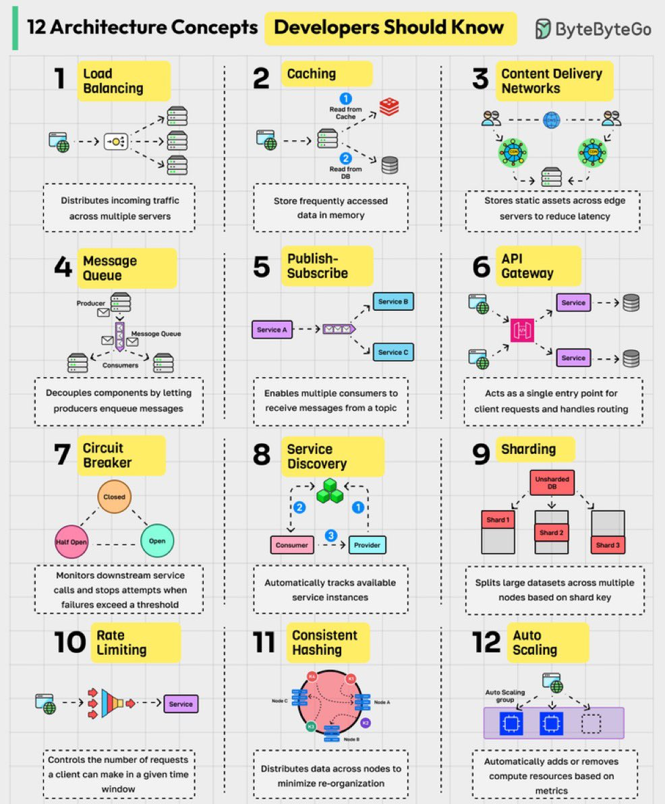
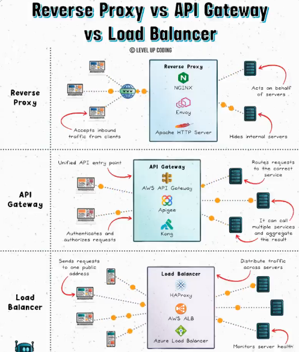
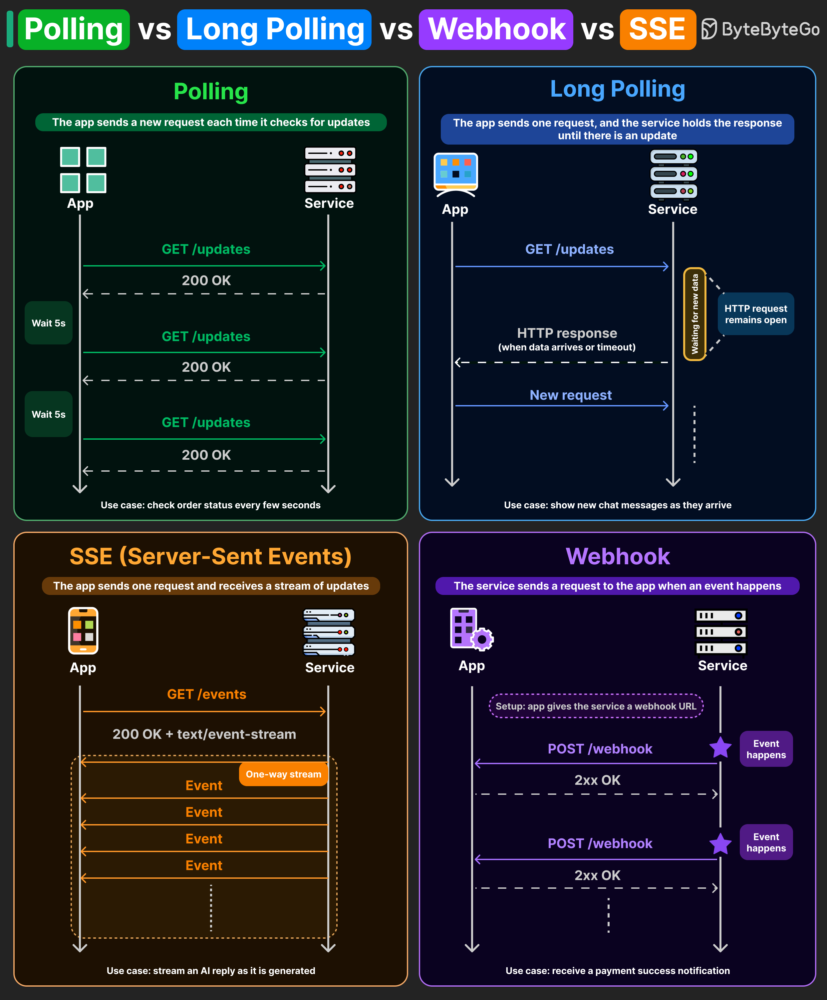
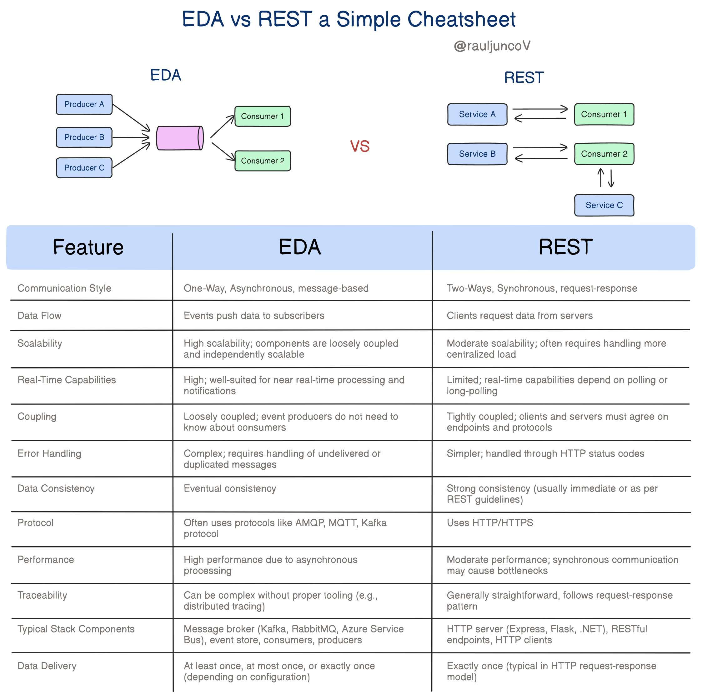
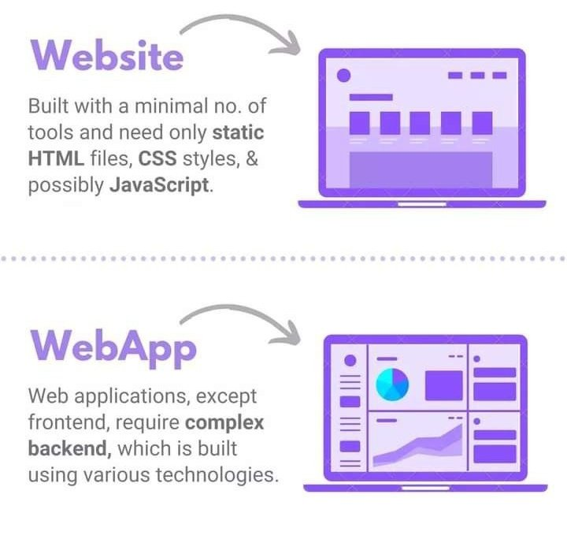
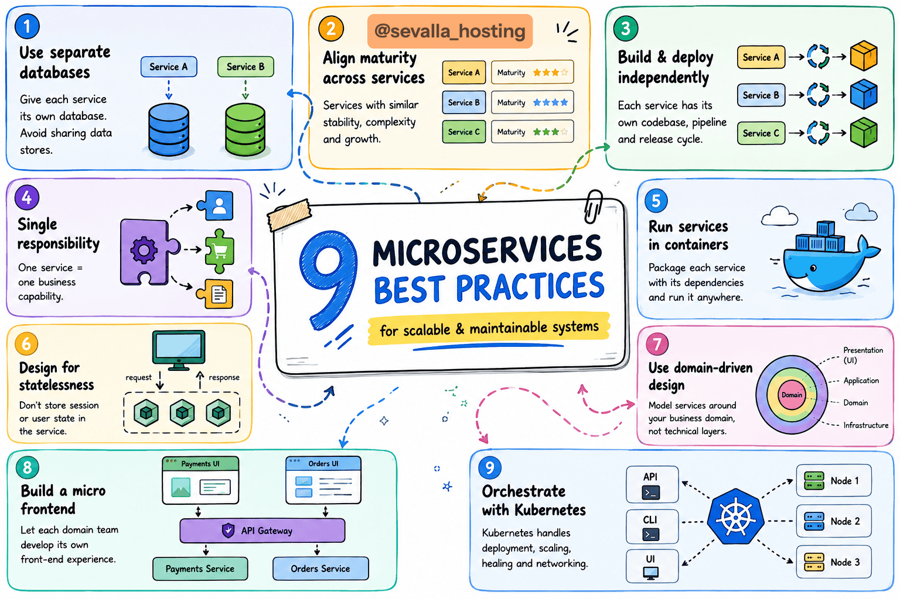
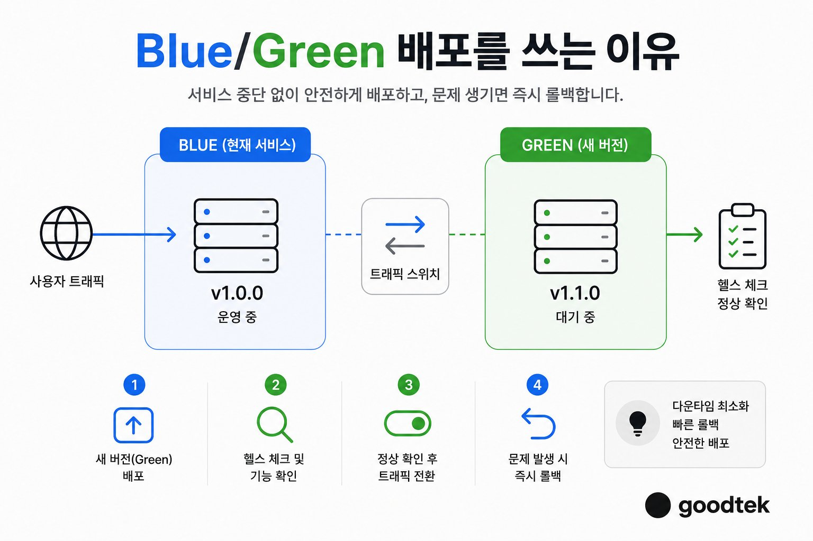
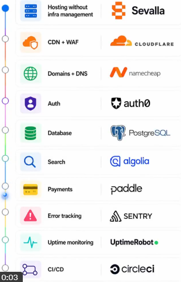
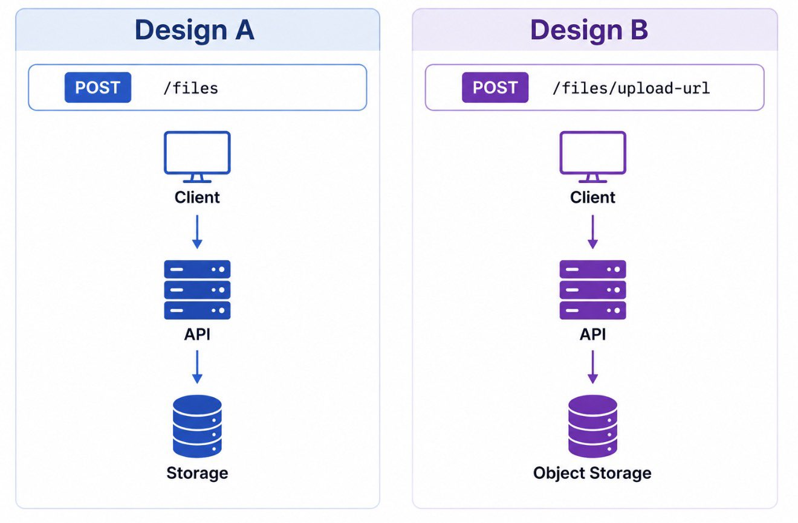
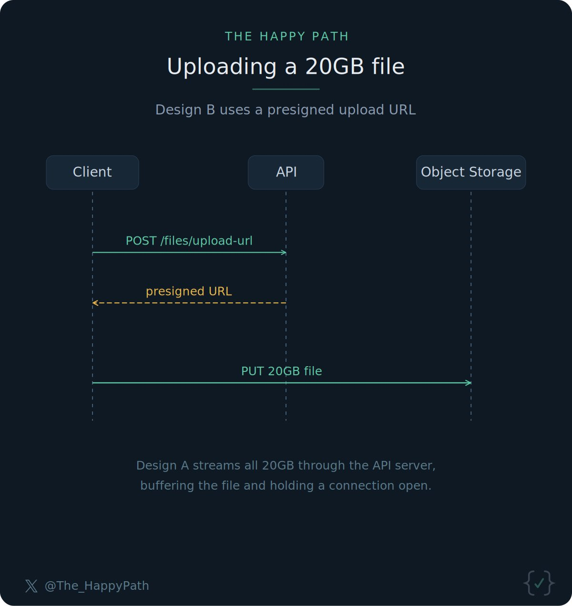

# 시스템 디자인

속성: Architecture


<details>
<summary><strong>꼭 알아야 할 시스템 디자인 개념</strong></summary>


1. 로드 밸런싱(Load Balancing)이란 들어오는 네트워크 트래픽을 여러 서버에 골고루 분산시키는 기술임. 특정 서버 한 대에 요청이 몰리면 과부하가 걸리고 서비스가 느려지거나 다운될 수 있는데, 로드 밸런서가 중간에서 이를 분산해줌으로써 서비스의 안정성과 가용성을 높여줌. 쉽게 말해 음식점 입구에서 손님을 빈 테이블로 안내하는 직원과 같은 역할임.
2. 캐싱(Caching)은 자주 요청되는 데이터를 메모리(RAM 등 빠른 저장소)에 미리 올려두어, 매번 느린 데이터베이스를 뒤지지 않고 즉시 응답할 수 있게 해주는 기법임. 캐시는 브라우저, CDN, 로드 밸런서, 서비스 내부, Redis 같은 분산 캐시, 데이터베이스까지 시스템의 모든 계층에 존재하며, 각 레이어마다 속도와 비용의 트레이드오프가 있음.
3. 데이터베이스 샤딩(Database Sharding)은 하나의 거대한 데이터베이스를 여러 조각(샤드)으로 나누어 각기 다른 서버에 분산 저장하는 방식임. 데이터가 수십억 건을 넘어서면 단일 DB로는 처리 한계에 부딪히게 되는데, 샤딩을 통해 각 서버가 일부 데이터만 담당하게 하여 대규모 데이터 성장에 대응할 수 있음.
4. 복제(Replication)는 동일한 데이터를 여러 서버(레플리카)에 복사해두는 것임. 주 서버(Primary)가 장애를 일으켜도 복제본(Replica)이 즉시 서비스를 이어받아 가용성과 장애 내구성을 보장하며, 읽기 요청을 여러 레플리카에 분산시켜 성능을 높이는 용도로도 활용됨.
5. CAP 정리(CAP Theorem)는 분산 시스템에서 일관성(Consistency), 가용성(Availability), 파티션 허용성(Partition Tolerance) 세 가지 속성을 동시에 완벽하게 만족하는 것은 불가능하다는 이론임. 실제 설계 시에는 네트워크 장애가 불가피하므로 파티션 허용성은 포기할 수 없고, 결국 일관성과 가용성 중 하나를 우선할 것인지 선택해야 하는 핵심 트레이드오프임.
6. 일관 해싱(Consistent Hashing)은 서버가 추가되거나 제거될 때 데이터를 최소한으로 재배치하면서 부하를 균등하게 분산하는 알고리즘임. 일반 해싱은 서버 수가 바뀔 때마다 거의 모든 데이터를 재배치해야 하는 반면, 일관 해싱은 변경된 서버 구간의 데이터만 이동하면 되므로 동적 환경에서 매우 효율적임.
7. 메시지 큐(Message Queues)는 서비스 간에 데이터를 직접 주고받지 않고, 중간 버퍼(큐)에 메시지를 넣어두면 소비자 서비스가 자신의 속도에 맞춰 꺼내 처리하는 비동기 아키텍처임. Kafka 같은 메시지 브로커가 대표적이며, 서비스 간 결합도를 낮추고 한 서비스가 다운되어도 메시지가 유실되지 않아 시스템 전체의 탄력성이 높아짐.
8. 속도 제한(Rate Limiting)은 특정 사용자나 IP가 정해진 시간 안에 보낼 수 있는 요청 횟수에 상한을 두는 기술임. 이를 통해 DDoS 공격, 스크래핑, 악의적인 봇 트래픽으로부터 시스템을 보호하고, 정상 사용자에게도 공정한 서비스 품질을 유지할 수 있음. API 게이트웨이 단에서 요청이 한도를 초과하면 즉시 거부됨.
9. API 게이트웨이(API Gateway)는 클라이언트의 모든 요청이 내부 마이크로서비스에 직접 닿기 전에 반드시 거치는 단일 진입점(Single Entry Point)임. 요청 파싱 및 유효성 검사, 화이트리스트/블랙리스트 확인, 인증·인가, 속도 제한, 경로 매칭을 통한 라우팅, 프로토콜 변환, 회로 차단(Circuit Break), 로깅 및 모니터링까지 다양한 역할을 한 곳에서 처리함. API 게이트웨이는 단순한 트래픽 라우터를 넘어 인증·버전 관리·분석까지 포함하는 완전한 API 관리 플랫폼으로 진화했음.
10. 마이크로서비스(Microservices)는 거대한 단일 애플리케이션(모놀리스)을 결제, 사용자 관리, 알림 등 독립적으로 배포·확장·운영할 수 있는 작은 서비스 단위들로 분해하는 아키텍처 스타일임. 각 서비스는 느슨하게 결합되어 있어 한 서비스의 장애나 변경이 다른 서비스에 영향을 최소화하며, 서비스 규모를 개별적으로 조절할 수 있어 대형 플랫폼에서 폭발적인 트래픽 증가에 유연하게 대응할 수 있음.



---


</details>

---


<details>
<summary><strong>생산 시스템을 망가뜨리는 25가지</strong></summary>


1. 누락된 환경 변수.
2. 만료된 자격 증명.
3. 처리되지 않은 경계 사례.
4. 데이터베이스 연결 고갈.
5. 메모리 누수.
6. 무한 재시도 루프.
7. 부실한 오류 처리.
8. 경계 없는 큐.
9. 속도 제한 없음.
10. 타사 API 실패.
11. 디스크 공간 고갈.
12. 잘못된 배포 구성.
13. 경쟁 조건.
14. 시차 문제.
15. API 변경으로 인한 호환성 문제.
16. 캐시 불일치.
17. 대용량 페이로드 급증.
18. 트래픽 급증.
19. 누락된 인덱스.
20. 데이터베이스 내 데드락.
21. DNS 문제.
22. SSL 인증서 만료.
23. 모니터링 경고 없음.
24. 잘못된 롤백 전략.
25. 배포 중 인간 실수.

---


</details>

---


<details>
<summary><strong>초보자들은 배운 것을 지나치게 과도하게 적용한 예시</strong></summary>


인터뷰어: 시스템 디자인 아세요?

후보자: 네!

인터뷰어: 100명 사용자용 시스템을 디자인해 보세요...

후보자: 마이크로서비스, 로드 밸런서, 큐...

인터뷰어: 당신은 수백만 명을 위한 해결책을 내고 있네요... 난 100명만 요청했는데.

---


</details>

---


<details>
<summary><strong>API 게이트웨이 vs 로드 밸런서 vs 리버스 프록시</strong></summary>


🟩리버스 프록시 :

- 가장자리에 위치하여 백엔드 서비스로 요청을 전달하면서 인프라를 숨깁니다.
- TLS 종료, 캐싱, 라우팅을 처리하며 클라이언트와 서버 사이의 보호 층 역할을 합니다.

DevOps 관점: 다음이 필요할 때 사용하세요  
• SSL 종료  
• URL 기반 라우팅  
• 캐싱  
• 백엔드 서비스 숨기기

예시: Nginx, HAProxy, Traefik

🟦 로드 밸런서

- 들어오는 트래픽을 여러 인스턴스에 분산시켜 가용성과 확장성을 향상시킵니다.
- 단일 인스턴스가 과부하되지 않도록 하고, 건강한 서버로만 트래픽을 라우팅합니다.

DevOps 관점: 다음이 필요할 때 사용하세요  
• 높은 가용성  
• 수평 확장  
• 헬스 체크  
• 장애 내성

예시: AWS ALB/NLB, Azure Load Balancer, Kubernetes Service

🟨 API 게이트웨이

- 요청을 중앙화하고 보호하며, 서비스에 대한 단일 진입점을 제공합니다.
- 인증, 속도 제한, 요청 변환, API 라우팅을 처리합니다.

DevOps 관점: 다음이 필요할 때 사용하세요  
• 마이크로서비스 아키텍처  
• 인증 & 권한 부여  
• 속도 제한  
• API 버전 관리  
• 관찰 가능성 & 모니터링

예시: Kong, AWS API Gateway, Apigee, Nginx API Gateway

━━━━━━━━━━━━━━━━━━━

실제 DevOps 아키텍처에서는 종종 다음과 같이 보입니다:

클라이언트 → API 게이트웨이 → 로드 밸런서 → 리버스 프록시 → 서비스



---


</details>

---


<details>
<summary><strong>시스템 디자인 로드맵</strong></summary>


1. 시작 → 기초 → 네트워킹 → 운영체제 → 데이터베이스 → 캐싱 → 메시징 → 스케일링 → 안정성 → 보안 → 관찰 가능성 → 실습
2. 요구사항 → API → 로드 밸런서 → 앱 서버 → 데이터베이스 → 캐시 → 큐 → 스토리지 → CDN → 속도 제한기 → 모니터링
3. 클라이언트 → DNS → CDN → 리버스 프록시 → 서비스 → DB → 캐시
4. 지연 → 처리량 → 가용성 → 일관성 → 내구성 → 장애 내성 → 확장성
5. SQL → NoSQL → 인덱싱 → 복제 → 샤딩 → 파티셔닝 → 트랜잭션
6. REST → gRPC → WebSockets → 비동기 처리 → 이벤트 기반 시스템
7. Redis → Kafka → RabbitMQ → S3 → Postgres → Elasticsearch
8. 단일 노드 → 분산 → 다중 AZ → 다중 리전
9. 모놀리식 → 모듈러 모놀리식 → 필요할 때만 마이크로서비스
10. 로그 → 메트릭 → 추적 → 알림 → SLO
11. 무차별 설계 → 병목 찾기 → 트레이드오프 고려 → 더 나은 아키텍처
12. 기능적 요구사항 → 비기능적 요구사항 → 용량 추정 → 고수준 설계 → 심층 탐구 → 장애 사례 → 스케일 계획
13. 설계 읽기 → 장애 관찰 → 작은 시스템 구축 → 실수 검토 → 다시 재설계
14. URL 단축기 → 속도 제한기 → 채팅 앱 → 알림 시스템 → 검색 → 피드 → 결제 시스템 → 라이드 쉐어링
15. 생각 → 그리기 → 설명 → 트레이드오프 변호 → 개선
16. 일관성 → 명확성 → 반복 → 깊이 있는 작업

---


</details>

---


<details>
<summary><strong>많은 엔지니어들이 시스템 설계를 이렇게 답합니다:</strong></summary>


로드 밸런서.  
캐시.  
카프카.  
레디스.  
큐.  
샤드.  
CDN.

그저 도구들의 쇼핑 리스트일 뿐입니다.

훌륭한 엔지니어들은 먼저 다른 것을 합니다:

그들은 묻습니다:  
여기서 진짜 고통은 무엇인가요?

- 읽기가 너무 느린가요?
- 쓰기가 너무 무거운가요?
- 팬아웃이 너무 많은가요?
- 핫 키인가요?
- 일관성 문제인가요?
- 운영 문제인가요?

좋은 설계는 고통에서 시작합니다.

박스에서가 아닙니다.

---


</details>

---


<details>
<summary><strong>시스템 디자인을 처음부터 공부한다면:</strong></summary>


먼저 기초 (쉬움):  
→ 클라이언트-서버 (애플리케이션이 백엔드와 대화)  
→ API들 (데이터 교환)  
→ 요청-응답 (요청 → 응답 사이클)  
→ 데이터베이스 (데이터 저장)  
그리고 가장 핵심 포인트:  
→ 데이터 모델링 (무엇을 저장하고 어떻게 쿼리할지 결정)

그 다음 첫 번째 고민들이 시작됨 (중간):  
→ 트래픽 증가 → 로드 밸런싱 (요청 분산)  
→ 지연 발생 → 캐싱 / CDN (더 빠른 응답 제공)  
→ 사용자 유입 → 인증 (신원 확인 및 권한 부여)  
→ 남용 시작 → 속도 제한 (스팸 방지)

시스템이 어떻게 사용되는지가 여기서 중요해짐:  
→ 읽기 중심 vs 쓰기 중심 (읽기 또는 쓰기 중심 최적화)

시스템이 성장함에 따라 (중간 - 어려움):  
→ 애플리케이션 비대해짐 → 모놀리스 vs 마이크로서비스 (책임 분리)  
→ 장기 작업 발생 → 큐/대기열 (작업을 백그라운드에서 처리)  
→ 의존성 증가 → 이벤트 기반 (단일 흐름에 의존하지 않음)  
→ 데이터 폭증 → 샤딩 (데이터를 조각으로 나누기)  
→ 수요 폭발 → 스케일링 (수직 vs 수평)

라이브 환경 (어려움):  
→ 시스템 상태를 알 수 없음 → 관찰 가능성 (로그, 메트릭, 트레이싱)  
→ 장애 발생 → 내결함성 (오류에도 불구하고 유지)  
→ 데이터 불일치 → CAP 정리 (일관성 vs 가용성 논쟁)  
→ 끊김 없는 서비스 필요 → 복제 (단일 머신에 의존하지 않음)

시스템 디자인은 용어를 외우는 게 아님.  
문제를 보고, 해결책을 결정하고, "트레이드오프"들(무엇을 포기할지)을 받아들이는 거임.

---


</details>

---


<details>
<summary><strong>폴링 vs 롱 폴링 vs 웹훅 vs SSE</strong></summary>


서버로부터 업데이트를 받는 네 가지 방법. 각각은 단순성, 효율성, 실시간 전달 사이에서 다른 트레이드오프를 제공합니다.

- 폴링: 클라이언트가 몇 초마다 "새로운 게 있나요?"라고 요청을 보냅니다. 서버는 새로운 데이터가 있든 없든 즉시 응답합니다. 대부분의 요청이 빈 응답으로 돌아오며, 클라이언트와 서버 자원을 낭비합니다. 주문 상태 페이지처럼 약간의 지연이 허용되는 사용 사례에 적합하며, 구현하기 가장 간단한 옵션입니다.
- 롱 폴링: 클라이언트가 요청을 보내고, 서버는 새로운 데이터가 사용 가능하거나 타임아웃이 발생할 때까지 HTTP 연결을 열린 상태로 유지합니다. 이는 일반 폴링에 비해 빈 응답이 적다는 의미입니다. 일부 채팅 애플리케이션은 이 패턴을 사용하여 메시지를 실시간에 가까운 통신으로 전달합니다.
- 서버-전송 이벤트 (SSE): 클라이언트가 지속적인 HTTP 연결을 열고, 서버는 이벤트가 생성됨에 따라 이를 통해 이벤트를 스트리밍합니다. 이는 단방향이며 가볍고, 일반 HTTP를 기반으로 합니다. 토큰 단위로 나타나는 많은 AI 응답은 SSE를 통해 전달되며, 단일 열린 연결을 통해 각 청크를 스트리밍합니다.
- 웹훅: 클라이언트가 업데이트를 요청하는 대신, 서비스는 특정 이벤트가 발생할 때마다 미리 등록된 콜백 URL로 HTTP POST를 보냅니다. Stripe는 이를 결제 확인에 사용합니다. GitHub는 푸시 이벤트에 이를 사용합니다. 클라이언트는 폴링하거나 연결을 열린 상태로 유지하지 않고, 서버의 호출을 기다릴 뿐입니다.

많은 시스템은 단일 패턴에 의존하지 않습니다. 주문 상태에는 폴링을, AI 응답 스트리밍에는 SSE를, 결제 확인에는 웹훅을 사용할 수 있습니다.



---


</details>

---


<details>
<summary><strong>올바른 아키텍처 선택</strong></summary>


EDA vs. REST 간단한 치트시트.

𝗘𝘃𝗲𝗻𝘁-𝗗𝗿𝗶𝘃𝗲𝗻 𝗔𝗿𝗰𝗵𝗶𝘁𝗲𝗰𝘁𝘂𝗿𝗲 (𝗘𝗗𝗔)

EDA는 비동기 통신을 사용하며, 구성 요소들이 이벤트를 방출하고 소비함으로써 상호 작용합니다.

이 디자인은 높은 확장성, 실시간 응답성, 그리고 서비스 간 느슨한 결합을 요구하는 시스템에 특히 효과적입니다.

𝗥𝗲𝗽𝗿𝗲𝘀𝗲𝗻𝘁𝗮𝘁𝗶𝗼𝗻𝗮𝗹 𝗦𝘁𝗮𝘁𝗲 𝗧𝗿𝗮𝗻𝘀𝗳𝗲𝗿 (𝗥𝗘𝗦𝗧)

이는 HTTP를 통한 동기적 요청-응답 통신이 필요한 웹 서비스를 구축하는 데 인기 있는 선택입니다.

강력한 일관성, 단순성, 그리고 표준 CRUD 작업이 필요한 애플리케이션에 이상적입니다.

그러나 REST는 거의 실시간 통신이나 동적 확장이 필요한 시나리오에서 도전을 겪을 수 있습니다.

더욱 중요한 것은, 이러한 아키텍처들은 상호 배타적이지 않다는 점입니다.

많은 현대 시스템이 하이브리드 접근 방식으로부터 이점을 얻습니다.

현명하게 선택하세요!



---


</details>

---


<details>
<summary><strong>시스템 설계 원칙</strong></summary>


1. 확장성
    
    → 사용자와 트래픽 증가를 처리할 수 있도록 시스템 설계
    → 수평적 확장 사용 (서버 추가)
    → 단일 머신의 한계 피하기
    
    좋은 시스템은 깨지지 않고 성장해야 합니다.
    
2. 가용성
    
    → 시스템이 항상 접근 가능하도록 보장
    → 중복성과 장애 복구 전략 사용
    → 다운타임 최소화
    
    높은 가용성 = 더 나은 사용자 신뢰.
    
3. 신뢰성
    
    → 시스템이 시간에 걸쳐 일관되게 작동
    → 장애를 우아하게 처리
    → 데이터 정확성 보장
    
    사용자는 시스템에 의존할 수 있어야 하며, 예상치 못한 문제가 없어야 합니다.
    
4. 성능
    
    → 지연 시간과 응답 시간 줄이기
    → 데이터베이스 쿼리 최적화
    → 캐싱 전략 사용
    
    빠른 시스템은 사용자 경험을 향상시킵니다.
    
5. 장애 내성
    
    → 일부가 실패해도 시스템이 계속 작동하도록 설계
    → 백업과 복제 사용
    → 재시도 메커니즘 구현
    
    장애는 불가피합니다 — 이를 대비하세요.
    
6. 로드 밸런싱
    
    → 트래픽을 여러 서버에 분산
    → 서버 과부하 방지
    → 시스템 응답성 향상
    
    단일 서버가 모든 부하를 지지 않아야 합니다.
    
7. 캐싱
    
    → 자주 액세스되는 데이터를 일시적으로 저장
    → 데이터베이스 부하 줄이기
    → 속도 향상
    
    예시: Redis, 인메모리 캐싱
    
8. 데이터베이스 설계
    
    → 적합한 데이터베이스 선택 (SQL vs NoSQL)
    → 사용 사례에 따라 정규화 또는 비정규화
    → 더 빠른 쿼리를 위한 인덱싱
    
    데이터 설계는 시스템의 기반입니다.
    
9. 일관성 vs 가용성 (CAP 정리)
    
    → 완전한 일관성, 가용성, 파티션 허용을 동시에 가질 수 없음
    → 시스템 요구에 따라 트레이드오프 선택
    
    분산 시스템에서 트레이드오프를 이해하는 것이 핵심입니다.
    
10. 마이크로서비스 아키텍처
    
    → 시스템을 더 작은 독립 서비스로 분할
    → 각 서비스가 특정 책임을 담당
    → 확장성과 유연성 가능
    
    스케일링 시 긴밀하게 결합된 모놀리스를 피하세요.
    
11. API 설계
    
    → REST 또는 GraphQL 사용
    → API를 일관되고 예측 가능하게 유지
    → API 버전 관리
    
    API는 시스템 간의 커뮤니케이션 다리입니다.
    
12. 메시지 큐
    
    → 비동기 작업 처리
    → 시스템 회복력 향상
    → 서비스 간 결합 해제
    
    예시: RabbitMQ, Kafka
    
13. 보안
    
    → 데이터 암호화 (HTTPS, TLS)
    → 인증 및 권한 부여 구현
    → 공격 방어 (SQL 인젝션, XSS)
    
    보안은 첫날부터 구축해야 합니다.
    
14. 모니터링 & 로깅
    
    → 시스템 성능 추적
    → 오류와 이벤트 로깅
    → Prometheus, ELK 같은 도구 사용
    
    보이지 않는 것을 고칠 수 없습니다.
    
15. 배포 & CI/CD
    
    → 빌드와 배포 자동화
    → 테스트와 릴리스용 파이프라인 사용
    → 원활한 업데이트 보장
    
    더 적은 오류로 더 빠른 배포.
    

시스템 설계는 확장 가능하고, 신뢰성 있으며, 효율적인 시스템을 구축하면서 올바른 트레이드오프를 하는 것입니다.

면접용으로만 외우지 말고 서버 터질 때 이거 하나라도 제대로 지켰는지 복기해보면 답 나옴. 확장성이니 가용성이니 말은 번드르르해도 현실은 장애 터지기 전까지 예산 아낀다고 무시당하는 게 국룰이라. 결국 설계는 정답을 찾는 게 아니라 내가 어떤 단점을 감당할지 결정하는 선택의 연속임.

---


</details>

---


<details>
<summary><strong>웹사이트와 웹 애플리케이션의 차이점</strong></summary>




---


</details>

---


<details>
<summary><strong>시스템 디자인 로드맵 2026 → 제로에서 프로까지</strong></summary>


Phase 1: 기초

- 기본 → 네트워킹 → 운영 체제

Phase 2: 핵심 빌딩 블록

- 데이터베이스 (SQL + NoSQL) → 캐싱 (Redis) → 메시징 (Kafka/RabbitMQ)

Phase 3: 스케일링 & 아키텍처

- 로드 밸런서 → CDN → 샤딩 → 복제 → 마이크로서비스 (필요할 때만)

Phase 4: 프로덕션 마스터리

- 신뢰성 → 보안 → 관찰 가능성 (로그 + 메트릭 + 트레이싱)
- 속도 제한 → API 디자인 (REST/gRPC/WebSockets) → 이벤트 기반 시스템

Phase 5: 실전 스킬

- 기능적 + 비기능적 요구사항
- 용량 추정 → 고수준 디자인 → 심층 탐구 → 트레이드오프 사고
- 실패 사례 → 병목 현상 추적 → 지속적 재디자인

연습 프로젝트 (순서대로):

URL 단축기 → 속도 제한기 → 채팅 앱 → 알림 시스템 → 피드 → 결제 → 라이드 쉐어링

일일 습관:

생각 → 그리기 → 설명 → 트레이드오프 방어 → 개선

게임은 모든 걸 아는 게 아니야. 명확성 + 반복 + 깊은 작업에 관한 거야.

다들 북마크만 오지게 박아두고 다시는 안 볼 거 다 안다. 근데 이 로드맵은 마이크로서비스 무지성으로 쓰지 말라는 것부터가 짬바가 좀 느껴지네. 단순히 용어 외우는 게 아니라 트레이드오프 고민하고 설계안 방어하는 게 진짜 실력이다. 일단 저장해두고 나중에 이직 생각날 때나 슥 훑어봐라.

---


</details>

---


<details>
<summary><strong>주니어 소프트웨어 엔지니어를 위한 좋은 시스템 설계 인터뷰 질문:</strong></summary>


사용자들이 작업을 생성, 업데이트, 삭제하고 볼 수 있는 간단한 Todo 앱 백엔드를 설계하세요.

겉보기에는 매우 기본적으로 보입니다. “그냥 작업을 생성하고 목록에 표시하면 돼요.” 하지만 주니어 엔지니어에게는 이것이 매우 좋은 인터뷰 질문입니다. 왜냐하면 API, 데이터베이스 테이블, 인증, 검증, 오류 처리, 페이지네이션, 그리고 기본 백엔드 설계를 이해하고 있는지 확인할 수 있기 때문입니다.

저는 주요 기능을 분리하는 것부터 시작할 것입니다. 사용자는 가입하고, 로그인하고, 투두를 생성하고, 완료로 표시하고, 수정하고, 삭제하고, 자신의 모든 투두를 나열할 수 있어야 합니다. 나중에 마감일, 우선순위, 태그, 알림, 검색을 추가할 수 있습니다. 하지만 첫 번째 버전에서는 범위를 단순하게 유지하고 핵심을 제대로 구축할 것입니다.

높은 수준에서 보면, 클라이언트는 REST API를 사용하여 백엔드와 통신합니다. 백엔드는 사용자가 로그인했는지 확인하고, 요청을 검증하고, 데이터베이스와 통신하며, 응답을 반환합니다. 데이터베이스는 사용자와 투두를 저장합니다. 가장 중요한 것은 한 사용자가 다른 사용자의 작업을 절대 볼 수 없거나 수정할 수 없도록 하는 것입니다.

API의 경우, POST /signup, POST /login, POST /todos, GET /todos, GET /todos/:id, PATCH /todos/:id, DELETE /todos/:id 같은 엔드포인트를 만들 것입니다. 생성 API는 제목, 선택적 설명, 마감일, 우선순위를 받습니다. 목록 API는 로그인한 사용자의 모든 투두를 반환합니다. 업데이트 API는 제목, 설명, 마감일 또는 완료 상태를 변경할 수 있습니다. 삭제 API는 작업을 강제 삭제하거나 삭제 표시로 소프트 삭제할 수 있습니다.

데이터베이스 설계의 경우, 두 개의 테이블을 유지할 것입니다. 사용자 테이블은 id, name, email, password_hash, created_at 같은 필드를 가집니다. 투두 테이블은 id, user_id, title, description, status, priority, due_date, created_at, updated_at, deleted_at 같은 필드를 가집니다. user_id는 각 투두를 소유자와 연결합니다. 대부분의 쿼리가 “이 사용자의 모든 투두를 보여줘”일 것이므로 user_id에 인덱스를 추가할 것입니다.

인증은 간단하게 할 수 있습니다. 사용자가 이메일과 비밀번호로 로그인하면, 백엔드는 비밀번호 해시를 확인하고 세션 토큰이나 JWT를 반환합니다. 모든 투두 API는 이 토큰을 요구해야 합니다. 백엔드는 토큰에서 사용자 ID를 추출하고 데이터베이스 쿼리에 그 사용자 ID를 사용합니다. 클라이언트가 요청 본문에 user_id를 보내는 것을 신뢰하지 말아야 합니다. 누군가 그것을 변경하여 다른 사람의 데이터를 접근할 수 있기 때문입니다.

검증도 중요합니다. 백엔드는 빈 제목, 매우 긴 제목, 잘못된 날짜, 잘못된 우선순위 값, 잘못된 상태 값을 거부해야 합니다. 이것은 많은 주니어가 세부 사항을 놓치는 부분입니다. 좋은 백엔드 코드는 프론트엔드가 보내는 것을 맹목적으로 삽입하지 않습니다. 그것은 나쁜 데이터로부터 데이터베이스를 보호합니다.

투두 목록을 위해 페이지네이션을 지원할 것입니다. 한 사용자가 보통 20개의 작업만 가지고 있더라도, 시간이 지나면서 어떤 사용자는 10,000개의 작업을 가질 수 있습니다. 그래서 GET /todos?page=1&limit=20이나 커서 기반 페이지네이션이 모든 것을 반환하는 것보다 낫습니다. 또한 status=pending, status=completed, due_date=today 같은 간단한 필터를 허용할 것입니다.

삭제의 경우, 많은 실제 앱에서 소프트 삭제를 선호합니다. 행을 즉시 제거하는 대신 deleted_at을 설정합니다. 이는 사용자가 나중에 취소, 감사 로그, 또는 복구를 원할 때 도움이 됩니다. 하지만 간단한 인터뷰에서는 트레이드오프를 명확히 언급한다면 강제 삭제도 허용됩니다.

오류 처리는 깨끗해야 합니다. 사용자가 로그인하지 않았다면 401을 반환합니다. 투두가 존재하지 않으면 404를 반환합니다. 사용자가 다른 사람의 투두에 접근하려 하면 404나 403을 반환합니다. 입력이 잘못되면 400을 반환합니다. 서버에서 무언가가 깨지면 500을 반환합니다. 이러한 기본 사항은 매우 중요합니다. 왜냐하면 백엔드 엔지니어링은 행복한 경로 코드 작성에만 관한 것이 아니기 때문입니다.

저는 또한 간단한 방식으로 동시성을 고려할 것입니다. 같은 투두가 두 개의 탭에서 열리고 둘 다 업데이트한다고 가정해 보세요. 마지막 쓰기가 이길 수 있습니다. 주니어 수준 시스템에서는 그것이 괜찮습니다. 하지만 이것이 중요해지면 updated_at이나 버전 번호를 사용하여 충돌을 감지할 수 있다고 언급할 수 있습니다.

신뢰성을 위해, 백엔드를 상태 비저장으로 유지하여 로드 밸런서 뒤에 여러 인스턴스를 실행할 수 있게 합니다. 데이터베이스가 진실의 원천입니다. 트래픽이 증가하면 일반적인 읽기에 캐싱을 추가할 수 있지만, 솔직히 투두 앱의 경우 처음에는 캐싱이 필요하지 않습니다. 먼저 단순하게 유지하세요.

관찰 가능성도 간단한 시스템에서 무시해서는 안 됩니다. 요청 ID, 사용자 ID, 엔드포인트, 상태 코드, 지연 시간을 로깅할 것입니다. API 오류율, 로그인 실패, 투두 생성 수, 데이터베이스 지연, p95 응답 시간을 추적할 것입니다. “로그를 추가할 거예요”라고 말하는 것은 모호합니다. 좋은 시스템은 추측 없이 “이 사용자의 투두 생성이 왜 실패하는가?”에 답해야 합니다.

주요 트레이드오프는 단순성 대 과도한 엔지니어링입니다. 주니어 엔지니어는 투두 앱에 Kafka, Redis, 마이크로서비스, Kubernetes를 추가할 필요가 없습니다. 좋은 답변은 깨끗한 API, 적절한 데이터베이스 스키마, 인증, 권한 부여, 검증, 페이지네이션, 오류 처리, 데이터 소유권을 보여주는 것입니다. 그것이 실제 백엔드 엔지니어링이 시작되는 지점입니다.

---


</details>

---


<details>
<summary><strong>마이크로서비스 9가지 모범 사례</strong></summary>


1. 별도의 데이터베이스 사용
    - 각 서비스는 자신의 데이터를 소유해야 합니다.
2. 서비스 성숙도 맞추기
    - 복잡성을 비즈니스 요구사항에 맞춥니다.
3. 독립적으로 배포하기
    - 각 서비스는 자체 릴리스 주기를 가져야 합니다.
4. 하나의 책임 유지하기
    - 하나의 서비스 = 하나의 명확한 비즈니스 기능.
5. 컨테이너로 서비스 패키징하기
    - 환경을 일관되게 하고 이식 가능하게 만듭니다.
6. 상태 비저장으로 설계하기
    - 세션 상태를 서비스 내부에 저장하지 마세요.
7. 도메인 주도 설계 사용하기
    - 서비스를 비즈니스 도메인 중심으로 모델링합니다.
8. 마이크로 프론트엔드 고려하기
    - 팀이 프론트엔드 영역을 독립적으로 소유하게 합니다.
9. 오케스트레이션 사용하기
    - Kubernetes는 스케일링, 롤아웃, 자체 복구를 처리할 수 있습니다.



---


</details>

---


<details>
<summary><strong>시스템 디자인 인터뷰에서 계속 보이는 상위 10가지 실수</strong></summary>


1. 요구사항과 규모(RPS, p95, 데이터 크기)를 명시하기 전에 마이크로서비스로 바로 뛰어드는 것
2. 데이터 모델 없음: 엔티티, 키, 액세스 패턴, 핫 파티션
3. SELECT * 스타일 사고에 의존: 모든 것을 가져와서 앱에서 필터링, 지나치게 수다스러운 API
4. 인덱스와 쿼리 형태 무시: 복합 인덱스 없음, 페이지네이션 계획 없음, N+1 논의 없음
5. 캐시 건너뛰기 하지만 캐시 무효화 전략도 건너뛰기 (TTL vs write-through vs evented)
6. 연결 풀링이나 백프레셔 없음: 모든 인스턴스가 1k DB 연결을 열고 넘어짐
7. 약한 실패 처리: 타임아웃 없음, 지터 없는 재시도, 서킷 브레이커 없음, 재시도 폭풍
8. 일관성 선택 안 함: 강한 vs 최종적, 멱등성 키, 중복 제거, 정확히 한 번 환상
9. 관찰 가능성 사후 고려: SLO 없음, p95/p99 없음, 추적 없음, 카디널리티 위생 없음
10. 용량 계산 없음: 스토리지 성장, 팬아웃 비용, 큐 깊이, 샤드 수, 마이그레이션 계획

---


</details>

---


<details>
<summary><strong>대부분의 개발자들은 시스템 설계를 거꾸로 배웁니다.</strong></summary>


그들은 다음으로 시작합니다:

Kafka. Redis. Kubernetes. Microservices.  
하지만 실제 순서는 다음과 같습니다:

1. 작동하게 만들기  
단일 서버. 단일 데이터베이스. 배포하기.
2. 올바르게 만들기  
캐싱 추가. 느린 쿼리 수정. 오류 처리.
3. 빠르게 만들기  
인덱스. 연결 풀링. CDN.
4. 확장 가능하게 만들기  
로드 밸런서. 읽기 복제본. 샤딩.
5. 탄력적으로 만들기  
서킷 브레이커. 재시도. 페일오버.

대부분의 시스템은 4단계나 5단계가 필요 없습니다.  
대부분의 개발자들은 어쨌든 바로 그쪽으로 뛰어듭니다.  
복잡성은 아키텍처가 아닙니다.  
그건 그냥 복잡성일 뿐입니다.

---


</details>

---


<details>
<summary><strong>저는 Blue/Green 배포를 씁니다.</strong></summary>


배포 때문에 서비스가 멈추는 게 정말 싫습니다.

특히 고객이 쓰는 서비스라면, 몇 초의 다운타임도 치명적일 수 있습니다.

Blue/Green은 기존 서비스는 그대로 두고, 새 버전을 먼저 띄워 테스트합니다.

정상이면 트래픽만 새 버전으로 넘기고,

문제가 생기면 바로 기존 버전으로 되돌리면 끝입니다.

서비스를 끄고 배포하는 게 아니라, 새 버전을 준비한 뒤 교체하는 방식입니다.

조금 번거롭더라도 운영해보면 왜 다들 Blue/Green 배포를 쓰는지 알게 됩니다.



기본인데 지키지 않는 분들이 많은것 같습니다.  
바이브코딩으로  
자잘한 수정이라고 문제없을거라고 생각하고 배포하면 안됩니다.  
우리가 모르는사이  
느낌표, 따옴표 하나 잘못 들어가서  
정상작동 안되는 경우가 많습니다. 심지어  
AI가 이런실수를 할거라고 생각지도 못했는데  
콤마를 잘못 쓴다거나 하는  
이상한 실수를 자주 하곤 합니다.

---


</details>

---


<details>
<summary><strong>더 빠른 배포를 위한 깔끔한 SaaS 스택</strong></summary>


- 인프라 관리 없이 호스팅 → Sevalla
- CDN + WAF → Cloudflare
- 도메인 + DNS → Namecheap
- 인증 → Auth0
- 데이터베이스 → PostgreSQL
- 검색 → Algolia
- 결제 → Paddle
- 에러 추적 → Sentry
- 가동 시간 모니터링 → UptimeRobot
- CI/CD → CircleCI



---


</details>

---


<details>
<summary><strong>🚨더 일찍 이해했으면 좋았을 11가지 소프트웨어 공학 원칙:</strong></summary>


𝟏. 𝐒𝐎𝐋𝐈𝐃: 더 나은 객체 지향 설계  
𝟐. 𝐃𝐑𝐘: 반복 피하기  
𝟑. 𝐊𝐈𝐒𝐒: 단순하게 유지하기  
𝟒. 𝐘𝐀𝐆𝐍𝐈: 불필요한 기능 만들지 않기  
𝟓. 𝐒𝐑𝐏: 한 가지 책임  
𝟔. 𝐎𝐩𝐞𝐧/𝐂𝐥𝐨𝐬𝐞𝐝: 깨뜨리지 않고 확장하기  
𝟕. 𝐃𝐞𝐩𝐞𝐧𝐝𝐞𝐧𝐜𝐲 𝐈𝐧𝐯𝐞𝐫𝐬𝐢𝐨𝐧: 느슨한 결합  
𝟖. 𝐂𝐨𝐦𝐩𝐨𝐬𝐢𝐭𝐢𝐨𝐧: 유연한 컴포넌트 구축  
𝟗. 𝐒𝐞𝐩𝐚𝐫𝐚𝐭𝐢𝐨𝐧 𝐨𝐟 𝐂𝐨𝐧𝐜𝐞𝐫𝐧𝐬: 더 깔끔한 설계  
𝟏𝟎. 𝐅𝐚𝐢𝐥 𝐅𝐚𝐬𝐭: 문제를 일찍 감지하기  
𝟏𝟏. 𝐌𝐞𝐚𝐬𝐮𝐫𝐞 𝐅𝐢𝐫𝐬𝐭: 실제로 중요한 것 최적화하기

[https://x.com/venkateshdotdev/status/2088527936697860559](https://x.com/venkateshdotdev/status/2088527936697860559)

---


</details>

---


<details>
<summary><strong>모든 소프트웨어 엔지니어가 알아야 할 리소스들 📌</strong></summary>


코스가 아닙니다. 인증서도 아닙니다.  
단지 북마크할 가치가 있는 것들뿐입니다.

1. Uber Engineering  
실제 시스템, 스케일링, 인프라 + AI  
[https://uber.com/blog/engineering/](https://uber.com/blog/engineering/)
2. Stripe Engineering  
결제, API, 분산 시스템  
[https://stripe.dev/blog/topic/engineering](https://stripe.dev/blog/topic/engineering)
3. Meta Engineering  
대규모 프로덕션 ML + 인프라  
[https://engineering.fb.com](https://engineering.fb.com/)
4. Cloudflare Learning  
DNS, CDN, 네트워킹, 보안, HTTP  
[https://cloudflare.com/learning/](https://cloudflare.com/learning/)
5. AWS Architecture Center  
실제 아키텍처 패턴 + 다이어그램  
[https://aws.amazon.com/architecture/](https://aws.amazon.com/architecture/)
6. GitHub Engineering  
GitHub가 플랫폼을 어떻게 구축하고 스케일링하는지  
[https://github.blog/engineering/](https://github.blog/engineering/)
7. Google Engineering Practices  
엔지니어들이 실제로 코드를 어떻게 작성하고 리뷰하는지  
[https://google.github.io/eng-practices/](https://google.github.io/eng-practices/)
8. Netflix TechBlog  
분산 시스템, 데이터 + 인프라  
[https://netflixtechblog.com](https://netflixtechblog.com/)

이것들을 북마크하세요.

회사들이 실제 엔지니어링 문제를 어떻게 해결하는지 읽는 것은  
완전히 다른 종류의 학습입니다.

---


</details>

---


<details>
<summary><strong>시스템 디자인을 처음 시작한다면, 이 순서로 배워보세요:</strong></summary>


1. 끝에서 끝까지 요청(request)이 어떻게 작동하는지
2. API와 데이터베이스
3. 캐싱(caching)
4. 로드 밸런싱(load balancing)
5. 큐와 비동기 처리(queues와 async processing)
6. 복제와 샤딩(replication과 sharding)
7. 속도 제한(rate limiting)
8. 재시도와 멱등성(retries와 idempotence)
9. 관찰 가능성(observability)

각 개념에 대해 3가지를 이해하세요:  
어떤 문제를 해결하는지, 언제 필요한지, 그리고 어떤 복잡성을 추가하는지.

예시:

사용자가 30초가 걸리는 보고서 생성을 요청합니다.

요청 내에서 모든 작업을 처리한다면, 사용자는 응답을 받기 위해 30초를 기다려야 합니다.

그래서 작업을 큐로 보내고, 받았음을 응답한 후, 워커가 백그라운드에서 보고서를 생성합니다.

하지만 이제 새로운 질문들이 생깁니다:

> 워커가 실패하면 어떻게 되나요?  
언제 재시도하나요?  
같은 작업이 두 번 처리되면 어떻게 되나요?  
> 

시스템 디자인을 배우는 것은 각 문제에 어떤 도구를 사용할지 아는 것과, 그것이 도입하는 트레이드오프를 이해하는 것입니다.

---


</details>

---


<details>
<summary><strong>시스템 설계 질문: 사용자들이 20GB 파일을 업로드합니다. 어떤 엔드포인트?</strong></summary>




- 디자인 B, 사전 서명된 URL 접근 방식. 이 크기의 업로드의 경우, API는 URL만 발급하고 데이터 경로에서 벗어나야 합니다.
- 클라이언트 -> API -> 사전 서명된 URL 가져오기 -> 클라이언트 -> 객체 스토리지
- 디자인 B.  API를 통해 20GB를 파이프하지 마세요. /files/upload-url을 호출해서 사전 서명된 URL을 받고, S3에 바로 업로드하세요. 멀티파트와 재개 기능을 사용하지 않으면 망칩니다.



---


</details>

---


<details>
<summary><strong>프로그래밍에 이미 익숙해졌을 때, 다음 단계는 시스템 설계 학습입니다.</strong></summary>


이미 기능 하나를 구축하는 법을 아시죠. 이제 수천 명이 동시에 그 기능을 사용할 때 무슨 일이 일어나는지, 데이터가 증가하거나 서비스가 실패할 때 어떻게 되는지 이해하는 단계입니다.

어디서 시작할까요? 저라면 이 순서를 따를 거예요:

1. 클라이언트와 서버 아키텍처: 요청의 흐름을 따라가 보세요. 브라우저에서 데이터베이스까지, 그리고 돌아오는 길까지.
2. 데이터베이스: 데이터를 모델링하는 법, 인덱스로 쿼리를 가속화하는 법, 트랜잭션을 사용해 일관성을 유지하는 법을 배우세요.
3. 확장성: 언제 더 많은 인스턴스를 추가할지, 트래픽을 어떻게 분산할지, 무엇을 캐시에 저장하는 게 유리한지 이해하세요.
4. 큐와 이벤트: 사용자가 즉시 받아야 하는 것과 나중에 처리할 수 있는 것(예: 이메일)을 분리하세요.
5. 장애 처리: 응답을 얼마나 기다릴지, 언제 재시도할지, 부작용을 어떻게 피할지 정의하세요.
6. 보안과 관찰 가능성: 각 리소스에 누가 접근할 수 있는지 제어하고, 로그와 메트릭스를 사용해 무슨 일이 일어나는지 파악하세요.

연습으로는 이미 구축한 앱을 가져와 조건을 바꿔보세요: 트래픽이 100배 증가하거나, 데이터베이스가 느려지거나, 서비스가 다운된 경우.

무엇을 바꿀 건가요, 그리고 왜요?

실제 사례를 공부하는 게 이 개념들을 이해하는 가장 좋은 방법입니다.

---


</details>

---


<details>
<summary><strong>시스템 설계 — 궁극의 로드맵 (지금 저장하세요)!</strong></summary>


```markdown
├── 01 기초
│ ├── 확장성, 가용성 및 안정성
│ ├── 지연 시간 vs 처리량
│ ├── CAP / PACELC & 트레이드오프
│ ├── 대략적인 추정 계산
│ └── 요구사항 (기능적 vs 비기능적)
│
├── 02 네트워킹 & API
│ ├── DNS, TCP/UDP, HTTP/TLS
│ ├── REST, GraphQL & gRPC
│ ├── API 게이트웨이
│ ├── WebSockets / SSE / 롱 폴링
│ └── 인증 / 권한 부여 (JWT, OAuth, 세션)
│
├── 03 트래픽 & 배포
│ ├── 로드 밸런싱 (L4 vs L7)
│ ├── 리버스 프록시
│ ├── CDN & 에지
│ ├── 속도 제한
│ └── 일관된 해싱
│
├── 04 데이터베이스 & 스토리지
│ ├── SQL vs NoSQL
│ ├── 데이터 모델링 & 인덱싱
│ ├── 복제
│ ├── 샤딩 / 파티셔닝
│ ├── 트랜잭션 & 격리 수준
│ └── 객체 / 블롭 스토리지
│
├── 05 캐싱
│ ├── 캐시 배치 (클라이언트, CDN, 앱, DB)
│ ├── 전략 (사이드, 스루, 어라운드, 라이팅백)
│ ├── 제거 & TTL
│ ├── 무효화
│ └── Redis / Memcached 패턴
│
├── 06 분산 시스템
│ ├── 일관성 모델
│ ├── 쿼럼 & 리더 선출
│ ├── 합의 (Raft / Paxos 직관)
│ ├── 분산 트랜잭션 (2PC, 사가)
│ └── 멱등성, 재시도 & 중복 제거
│
├── 07 메시징 & 비동기
│ ├── 큐 vs 발행/구독
│ ├── 전달 의미론 (최대 / 최소 / 정확히 한 번)
│ ├── Kafka / 이벤트 스트림
│ ├── 백프레셔 & 데드 레터
│ └── 이벤트 기반 아키텍처
│
├── 08 아키텍처 패턴
│ ├── 모놀리식 vs 마이크로서비스
│ ├── 서비스 디스커버리
│ ├── 서킷 브레이커, 타임아웃, 벌크헤드
│ ├── CQRS & 이벤트 소싱
│ └── 다중 리전 / 액티브-액티브
│
├── 09 안정성 & 프로덕션
│ ├── 관찰 가능성 (로그, 메트릭, 트레이스)
│ ├── SLI / SLO / 오류 예산
│ ├── 실패 모드 & 우아한 저하
│ ├── CI/CD, 롤아웃 & 롤백
│ └── 보안, 비밀 & 최소 권한
│
├── 10 클래식 설계
│ ├── URL 단축기
│ ├── 속도 제한기
│ ├── 채팅 / 메시징
│ ├── 뉴스 피드
│ ├── 알림
│ ├── 파일 스토리지 (Dropbox)
│ ├── 비디오 스트리밍
│ ├── 검색 / 웹 크롤러
│ └── 라이드 헤일링 / 결제
```

확장 가능하고, 안전하게 실패하며, 배포할 수 있는 시스템을 설계하는 법을 배우세요.

---


</details>

---


<details>
<summary><strong>시스템 디자인을 배우고 싶다면, 이 8가지 개념부터 시작하세요.</strong></summary>


이 개념들은 시스템을 설계할 때 나타나는 대부분의 문제를 이해하는 데 도움이 될 거예요:

1. 요구사항: 얼마나 많은 트래픽을 예상하는지, 얼마나 빠르게 응답해야 하는지, 그리고 어떤 실패를 견딜 수 있는지. 이게 디자인을 안내해줍니다.
2. 데이터베이스: 모델링, 인덱스와 트랜잭션. 느린 쿼리는 더 많은 서버를 추가하기 전에 인덱스가 필요할 수 있어요.
3. 확장성: 한 대의 머신에 더 많은 리소스를 할당하거나, 작업을 여러 대로 분산시키는 것.
4. 캐시: 더 빠른 응답을 위해 결과를 저장하지만, 데이터가 오래될 수 있다는 점을 받아들여야 해요.
5. 큐: 사용자를 기다리게 하지 않고 작업을 처리하는 것, 예를 들어 구매 이메일을 보내는 거예요. 지연, 재시도, 중복 메시지를 고려해야 합니다.
6. 장애 내성: 얼마나 기다릴지, 몇 번 재시도할지 제한하는 것. 전략 없이 고집하면 장애가 더 악화될 수 있어요 (예: 백오프).
7. 멱등성: 작업을 반복해도 효과가 중복되지 않게 하는 것. 결제 재시도는 두 번 청구되지 않아야 해요.
8. 일관성과 동시성: 데이터가 오래된 것을 언제 허용할지, 그리고 동시 작업을 어떻게 처리할지 결정하는 것, 예를 들어 마지막 재고에 대한 2개의 구매처럼요.

연습으로, 온라인 상점을 어떻게 디자인할지 생각해보세요. 방문자가 10배 많아지면 어떻게 될까요? 결제 서비스가 응답하지 않으면? 사용자가 구매 버튼을 두 번 누르면?
</details>

---

